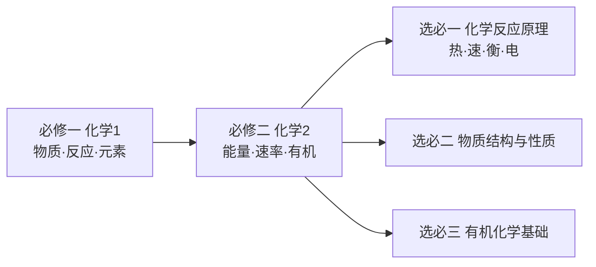

# 高中化学总览

> [!abstract] 概览
> 本目录按**人教版高中化学教材**的知识结构，参照「化学笔记(外)」中【一化基础大合集】的章节划分，系统整理高中化学全部内容。全库分为**必修一（化学 1）**、**必修二（化学 2）**、**选择性必修一（化学反应原理）**、**选择性必修二（物质结构与性质）**、**选择性必修三（有机化学基础）**五大部分，共 22 个章节。
>
> 每个章节以「00-章节总览」为入口，下设若干知识笔记。笔记采用统一的格式：`> [!abstract] 概览` → **核心概念** → **重点知识/实验** → **典型例题** → **易错提醒** → **与其他知识关联**，大量使用 `\ce{}` 化学式与 LaTeX 公式，并配合 Obsidian callout 标注易错点与记忆技巧。

## 学习路线

- **必修一（化学 1）**：物质分类、离子反应、氧化还原是"工具性"基础；钠、氯、铁、铝、硫、氮、硅及其化合物是元素化学的主干；物质的量是化学计算的基石；元素周期律是微观规律的总结。
- **必修二（化学 2）**：从"能量"（化学键与反应热、原电池）与"速率/限度"（化学反应速率与平衡初步）两个维度深化对反应的认识，并引入有机化学入门与化学与可持续发展。
- **选必一（化学反应原理）**：将必修二的"能量、速率、平衡"系统化——热化学（盖斯定律）、化学平衡（平衡常数、勒夏特列原理）、水溶液离子平衡（电离、水解、沉淀溶解、滴定）、电化学（原电池、电解池、金属腐蚀）。
- **选必二（物质结构与性质）**：从原子结构（核外电子排布）→ 分子结构（共价键、杂化、分子间作用力）→ 晶体结构（四种晶体与性质），回答"为什么物质具有这样的性质"。
- **选必三（有机化学基础）**：从有机物结构特点与命名 → 各类烃 → 烃的衍生物（卤代烃、醇酚、醛酮、羧酸酯）→ 有机合成与推断 → 生物大分子，建立"结构—性质—转化"的有机化学主线。

## 章节导航

### 必修一（化学 1）

| 章节 | 内容 | 入口 |
| --- | --- | --- |
| 01 | 物质分类与转化 | [[01-物质分类与转化/00-物质分类与转化总览\|00-物质分类与转化总览]] |
| 02 | 离子反应 | [[02-离子反应/00-离子反应总览\|00-离子反应总览]] |
| 03 | 氧化还原反应 | [[03-氧化还原反应/00-氧化还原反应总览\|00-氧化还原反应总览]] |
| 04 | 钠及其化合物 | [[04-钠及其化合物/00-钠及其化合物总览\|00-钠及其化合物总览]] |
| 05 | 氯及其化合物 | [[05-氯及其化合物/00-氯及其化合物总览\|00-氯及其化合物总览]] |
| 06 | 物质的量 | [[06-物质的量/00-物质的量总览\|00-物质的量总览]] |
| 07 | 铁及其化合物 | [[07-铁及其化合物/00-铁及其化合物总览\|00-铁及其化合物总览]] |
| 08 | 铝及其化合物与金属材料 | [[08-铝及其化合物与金属材料/00-铝及其化合物总览\|00-铝及其化合物总览]] |
| 09 | 元素周期表与周期律 | [[09-元素周期表与周期律/00-元素周期表与周期律总览\|00-元素周期表与周期律总览]] |
| 10 | 硫及其化合物 | [[10-硫及其化合物/00-硫及其化合物总览\|00-硫及其化合物总览]] |
| 11 | 氮及其化合物 | [[11-氮及其化合物/00-氮及其化合物总览\|00-氮及其化合物总览]] |
| 12 | 硅及其化合物与非金属材料 | [[12-硅及其化合物与非金属材料/00-硅及其化合物总览\|00-硅及其化合物总览]] |

### 必修二（化学 2）

| 章节 | 内容 | 入口 |
| --- | --- | --- |
| 13 | 化学反应与能量 | [[13-化学反应与能量必修二/00-化学反应与能量总览\|00-化学反应与能量总览]] |
| 14 | 有机化合物 | [[14-有机化合物必修二/00-有机化合物总览\|00-有机化合物总览]] |
| 15 | 化学与可持续发展 | [[15-化学与可持续发展/00-化学与可持续发展总览\|00-化学与可持续发展总览]] |

### 选择性必修一（化学反应原理）

| 章节 | 内容 | 入口 |
| --- | --- | --- |
| 16 | 化学反应热效应 | [[16-化学反应热效应选必一/00-化学反应热效应总览\|00-化学反应热效应总览]] |
| 17 | 化学反应速率 | [[17-化学反应速率选必一/00-化学反应速率总览\|00-化学反应速率总览]] |
| 18 | 化学平衡 | [[18-化学平衡选必一/00-化学平衡总览\|00-化学平衡总览]] |
| 19 | 水溶液中的离子平衡 | [[19-水溶液中的离子平衡选必一/00-水溶液中的离子平衡总览\|00-水溶液中的离子平衡总览]] |
| 20 | 电化学 | [[20-电化学选必一/00-电化学总览\|00-电化学总览]] |

### 选择性必修二、三

| 章节 | 内容 | 入口 |
| --- | --- | --- |
| 21 | 物质结构与性质 | [[21-物质结构与性质选必二/00-物质结构与性质总览\|00-物质结构与性质总览]] |
| 22 | 有机化学基础 | [[22-有机化学基础选必三/00-有机化学基础总览\|00-有机化学基础总览]] |

## 使用建议

> [!tip] 学习顺序
> 建议按 01→22 的顺序学习，其中：
> - **01-03**（物质分类、离子反应、氧化还原）与 **06**（物质的量）是工具性基础，务必先掌握；
> - **04、05、07、08、10、11、12** 是元素化学，可结合元素周期律（09）穿插学习；
> - **13-15**（必修二）是必修一的延伸；**16-20**（选必一）把必修二的"能量/速率/平衡"系统化，是全库的理论核心；
> - **21、22**（选必二、三）相对独立，可并行或后学。

> [!note] 与其他资源的关系
> 本目录的知识结构对应「化学笔记(外)」中【一化基础大合集】电子版讲义的章节划分（01-22 章），可在对应讲义 PDF 中查阅更详细的例题与高考真题。部分专题（如 [[杂化轨道理论]]、[[常见离子的检验方法]]、[[化学反应平衡移动的影响因素]]、[[燃烧热的计算]]、[[侯氏制碱法1]]、[[侯氏制碱法2]]）在 `化学笔记/` 根目录已有独立笔记，可互相参考。

## 作者的话

> [!quote] 个人理解
> 高中化学的骨架是"**结构决定性质、性质决定用途**"。必修一侧重"是什么"——物质怎么分类、怎么反应、常见元素有什么性质；必修二引入"为什么会反应"的能量与速率视角；选必一回答"反应进行到什么程度、怎么定量"；选必二从微观结构解释宏观性质；选必三建立有机分子的结构与转化网络。
>
> 学习时建议以"**反应方程式**"为载体——每学一种物质，先写它的性质反应（与金属、非金属、酸、碱、盐、氧化剂、还原剂），再用"氧化还原 + 离子反应 + 平衡"的理论框架去解释，最后用"物质的量"做定量计算。这样知识就不再是孤立的记忆点，而是一张互相联结的网络。

---
*返回 [[化学笔记/化学]]*
