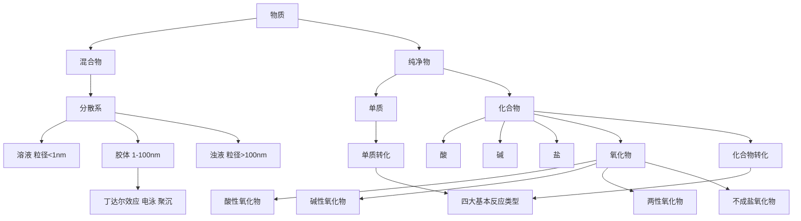

# 物质分类与转化总览

> [!abstract] 概览
> 本章是**高中化学的工具性起点**，回答三个基本问题：
> 1. **物质如何分类**——用树状分类法、交叉分类法把万千物质归入"纯净物/混合物、单质/化合物、酸/碱/盐/氧化物"的框架；
> 2. **物质如何转化**——通过四大基本反应类型与酸碱盐氧化物的通性，建立元素化合物的转化网络；
> 3. **分散系与胶体**——从粒子直径的微观尺度区分溶液、胶体、浊液，认识丁达尔效应等胶体特有的性质。
>
> 本章概念是后续"离子反应""氧化还原反应"及所有元素化学（钠、氯、铁、铝、硫、氮、硅）的基础。学完本章，应能对任意一种物质"分类定位、预测性质、设计转化"。

## 本章结构

- [[01-物质的分类]]：纯净物与混合物、单质与化合物、树状分类法与交叉分类法、氧化物的分类
- [[02-物质的转化]]：四大基本反应类型、酸/碱/盐/氧化物的通性、复分解反应发生的条件、物质转化网络
- [[03-分散系与胶体]]：分散系的分类、胶体的性质（丁达尔效应、布朗运动、电泳、聚沉）、胶体的制备与提纯

## 学习目标

1. 能运用**树状分类法**和**交叉分类法**对常见物质进行分类，能举出纯净物、混合物、单质、化合物的典型实例。
2. 能说出酸、碱、盐、酸性氧化物、碱性氧化物、两性氧化物的概念与判断标准，正确书写常见的化学式与类别。
3. 理解四大基本反应类型的定义，掌握**复分解反应发生的条件**（生成沉淀、气体或水），并能判断给定反应的类型。
4. 能建立"单质 → 氧化物 → 氢氧化物 → 盐"的典型转化关系（如 $\ce{Ca -> CaO -> Ca(OH)2 -> CaCO3}$）。
5. 知道分散系按分散质粒子直径分为溶液、胶体、浊液；能解释丁达尔效应、聚沉等现象；会制备 $\ce{Fe(OH)3}$ 胶体。

## 核心知识框架

> [!tip] 记忆主线
> **分类定位 + 性质预测 + 转化设计** 三位一体。看到一种物质先问三句：它是什么类？（分类）——它可能和什么反应？（通性）——它可由什么制得、又能变成什么？（转化）。

## 常见物质分类自查表

| 物质 | 类别（易错项） | 判断理由 |
| --- | --- | --- |
| 冰水共存物 | 纯净物 | 都是 $\ce{H2O}$ |
| 盐酸、氨水、氯水 | 混合物 | 分别是 $\ce{HCl}$、$\ce{NH3}$、$\ce{Cl2}$ 的水溶液 |
| 纯碱 $\ce{Na2CO3}$ | 盐（不是碱） | 阳离子 $\ce{Na+}$ + 酸根 $\ce{CO3^2-}$ |
| 苛性钠 $\ce{NaOH}$ | 碱（不是盐） | 电离出 $\ce{Na+}$ 与 $\ce{OH-}$ |
| $\ce{NaHSO4}$ | 酸式盐（不是酸） | 阳离子含 $\ce{Na+}$，属盐 |
| $\ce{CO2}$、$\ce{SO2}$ | 酸性氧化物 | 能与碱反应生成盐和水 |
| $\ce{CO}$、$\ce{NO}$、$\ce{NO2}$ | 不成盐氧化物 | 不能与酸/碱直接反应生成盐 |
| $\ce{Al2O3}$、$\ce{ZnO}$ | 两性氧化物 | 既与酸又与强碱反应 |
| $\ce{Mn2O7}$ | 酸性氧化物（金属氧化物） | 水化物 $\ce{HMnO4}$ 是酸 |
| 空气、石油、合金 | 混合物 | 无固定组成、无固定熔点 |

## 高考考点提示

| 考点 | 常见考法 | 对应笔记 |
| --- | --- | --- |
| 物质分类正误判断 | 选择题：判断"纯净物/混合物""电解质/非电解质"等概念辨析 | [[01-物质的分类]] |
| 氧化物分类 | 判断 $\ce{CO2}$、$\ce{Na2O}$、$\ce{Al2O3}$、$\ce{CO}$ 的类别 | [[01-物质的分类]] |
| 反应类型判断 | 给方程式判断四大基本反应类型 | [[02-物质的转化]] |
| 物质转化路线 | 判断某一步转化能否一步实现 | [[02-物质的转化]] |
| 胶体性质 | 丁达尔效应、聚沉、$\ce{Fe(OH)3}$ 胶体制备 | [[03-分散系与胶体]] |

## 易错总提醒

> [!warning] 本章高频易错点
> - **概念从属关系**：溶液、浊液是**混合物**；单质是纯净物但**不是化合物**；电解质是非电解质的前提是"化合物"。
> - **氧化物分类**：$\ce{CO}$、$\ce{NO}$、$\ce{NO2}$ 是不成盐氧化物，不是酸性氧化物；$\ce{Mn2O7}$ 是金属氧化物但属酸性氧化物。
> - **胶体不是一种物质**：胶体是分散系，属于混合物；"胶体粒子直径 1–100 nm"是关键判据。
> - **丁达尔效应≠胶体专有**：丁达尔效应是胶体特有的光学性质，可用于鉴别溶液与胶体，但鉴别胶体与浊液应看是否稳定、是否均一。

## 与其他知识关联

- 本章"物质分类"是 [[02-离子反应/00-离子反应总览]] 中"电解质/非电解质"概念的基础；"转化"与 [[03-氧化还原反应/00-氧化还原反应总览]] 的氧化还原判断直接相关（如置换反应一定是氧化还原反应）。
- 物质的量（后续章节）将"分类与转化"定量化；元素化学各章（钠、氯、铁、铝、硫、氮、硅）都在运用本章的分类框架与转化通性。
- 根目录已有笔记 [[一、物质的分类及转化1.电解质与电离方程式]] 可作为电解质概念的延伸阅读；[[常见离子的检验方法]] 与物质鉴别密切相关。

---
*返回 [[00-化学总览]]*
