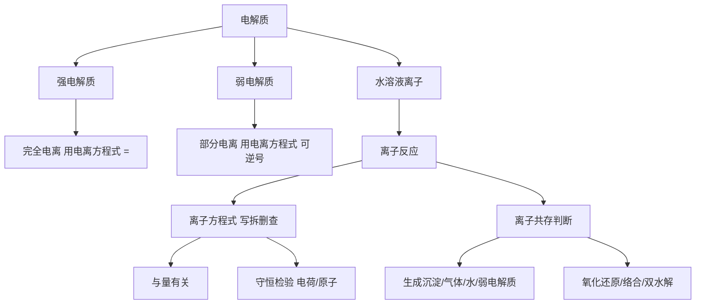

# 离子反应总览

> [!abstract] 概览
> 离子反应是高中化学最重要的**工具性理论**之一，它回答：电解质在水溶液中以什么形态存在？离子之间如何反应？如何用离子方程式简洁、准确地表达这种反应？
>
> 本章由浅入深三个层次：
> 1. **电离与电解质**——为什么溶液能导电，什么是电解质、强弱电解质；
> 2. **离子反应与离子方程式**——离子反应的实质，离子方程式的"写拆删查"四步法，与量有关的书写；
> 3. **离子共存与离子检验**——溶液中离子"能否共存"的判断，离子的检验与鉴别。
>
> 离子方程式是高考化学的必考内容（选择题正误判断 + 非选择题书写），也是后续所有水溶液反应（元素化学、酸碱盐、电化学、水溶液离子平衡）的表达语言。

## 本章结构

- [[01-电离与电解质]]：电解质与非电解质、强电解质与弱电解质、电离方程式、导电性
- [[02-离子反应与离子方程式]]：离子反应实质、离子方程式书写四步、拆写规则、与量有关、守恒
- [[03-离子共存与离子检验]]：离子共存的判断依据、隐含条件、常见离子的检验

## 学习目标

1. 能区分**电解质与非电解质**、**强电解质与弱电解质**，正确书写常见电解质的电离方程式。
2. 理解离子反应发生的实质（某些离子浓度减小），掌握离子方程式书写的"**写、拆、删、查**"四步法。
3. 掌握**拆写规则**：强酸、强碱、可溶性盐拆成离子；难溶物、弱电解质、气体、单质、氧化物不拆。
4. 能处理**与量有关**的离子方程式（少量/过量），会用**电荷守恒、原子守恒**检验方程式。
5. 会判断离子能否**共存**，掌握常见离子检验方法及干扰排除。

## 核心知识框架

> [!tip] 记忆主线
> **"谁拆谁不拆" + "为何不能共存"** 是本章两条主线。离子方程式的核心在"拆"，离子共存的本质是"离子间是否发生反应使浓度减小"。

## 离子方程式"拆与不拆"速查表

| 类别 | 是否拆成离子 | 举例 |
| --- | --- | --- |
| 强酸（$\ce{HCl}$、$\ce{H2SO4}$、$\ce{HNO3}$） | 拆 | $\ce{H+}$、$\ce{Cl-}$、$\ce{SO4^2-}$ |
| 强碱（$\ce{NaOH}$、$\ce{KOH}$、$\ce{Ba(OH)2}$） | 拆 | $\ce{Na+}$、$\ce{K+}$、$\ce{OH-}$ |
| 可溶性盐（钾盐、钠盐、铵盐、硝酸盐） | 拆 | $\ce{Na+}$、$\ce{K+}$、$\ce{NH4+}$、$\ce{NO3-}$ |
| 难溶物（$\ce{BaSO4}$、$\ce{AgCl}$、$\ce{CaCO3}$、$\ce{Fe(OH)3}$） | 不拆 | 写化学式 |
| 弱电解质（$\ce{CH3COOH}$、$\ce{H2CO3}$、$\ce{NH3.H2O}$、$\ce{H2O}$） | 不拆 | 写化学式 |
| 气体、单质、氧化物 | 不拆 | $\ce{CO2}$、$\ce{Cl2}$、$\ce{Na2O}$ |
| 微溶物（$\ce{Ca(OH)2}$） | 澄清溶液拆、沉淀不拆 | 石灰乳不拆 |

## 离子能否共存的判断依据速查

| 反应类型 | 典型"不共存"离子对 |
| --- | --- |
| 生成沉淀 | $\ce{Ag+}$ 与 $\ce{Cl-}$；$\ce{Ba^2+}$ 与 $\ce{SO4^2-}$/$\ce{CO3^2-}$；$\ce{Fe^3+}$ 与 $\ce{OH-}$ |
| 生成气体 | $\ce{H+}$ 与 $\ce{CO3^2-}$/$\ce{HCO3-}$/$\ce{SO3^2-}$/$\ce{S^2-}$ |
| 生成水/弱电解质 | $\ce{H+}$ 与 $\ce{OH-}$/$\ce{CH3COO-}$/$\ce{ClO-}$ |
| 氧化还原 | $\ce{Fe^3+}$ 与 $\ce{I-}$/$\ce{S^2-}$；酸性 $\ce{NO3-}$ 与 $\ce{Fe^2+}$/$\ce{I-}$ |
| 络合 | $\ce{Fe^3+}$ 与 $\ce{SCN-}$ |
| 双水解 | $\ce{Al^3+}$ 与 $\ce{HCO3-}$/$\ce{CO3^2-}$/$\ce{AlO2-}$ |

## 高考考点提示

| 考点 | 常见考法 | 对应笔记 |
| --- | --- | --- |
| 电解质判断 | 判断物质是否属于电解质/非电解质、强/弱电解质 | [[01-电离与电解质]] |
| 离子方程式正误 | 选择题：找出书写正确（或错误）的离子方程式 | [[02-离子反应与离子方程式]] |
| 与量有关书写 | 少量 $\ce{CO2}$、$\ce{Ca(OH)2}$ 过量等情形 | [[02-离子反应与离子方程式]] |
| 离子共存 | 给定条件判断离子能否大量共存 | [[03-离子共存与离子检验]] |
| 离子检验 | $\ce{Cl-}$、$\ce{SO4^2-}$、$\ce{CO3^2-}$、$\ce{Fe^3+}$ 等检验 | [[03-离子共存与离子检验]]、[[常见离子的检验方法]] |

## 易错总提醒

> [!warning] 本章高频易错点
> - 电解质一定是**化合物**，单质、混合物不是电解质；导电的本质是存在**自由移动的离子**。
> - 强电解质 = 完全电离，与**溶解性无关**（$\ce{BaSO4}$ 难溶但完全电离，是强电解质）。
> - 离子方程式书写中，**微溶物作反应物（澄清）拆、作生成物（浑浊）不拆**；$\ce{NH3.H2O}$、$\ce{H2O}$ 等弱电解质不拆。
> - 与量有关时，"**少定多变**"——不足量的物质按化学式比例反应，过量的物质参与的数量随反应物比例变化。
> - 离子共存要同时考虑**颜色、酸碱环境、氧化还原、络合、双水解**，缺一不可。

## 与其他知识关联

- 电解质、电离的概念与 [[01-物质分类与转化/01-物质的分类]] 中"化合物分类"衔接；酸、碱、盐的定义就建立在电离之上。
- 离子方程式与 [[03-氧化还原反应/03-氧化还原方程式配平]] 结合，构成"离子—氧化还原"综合配平（缺项配平）。
- 复分解反应的实质是离子交换，见 [[01-物质分类与转化/02-物质的转化]]。
- 离子共存、检验与后续元素化学（钠、铁、氯、硫、氮）密切相关；根目录 [[常见离子的检验方法]] 有更完整的检验表。
- 强弱电解质、水的电离是后续"水溶液中的离子平衡（选必一）"的基石。

---
*返回 [[00-化学总览]]*
