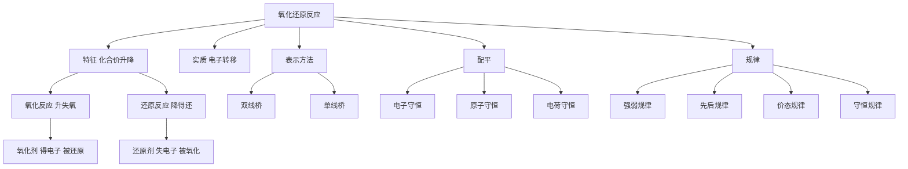

# 氧化还原反应总览

> [!abstract] 概览
> 氧化还原反应是高中化学**贯穿始终的灵魂理论**，也是所有元素化学反应的"神经系统"。凡有**元素化合价升降**的反应都是氧化还原反应——从燃烧、金属冶炼，到原电池、电解、物质的制备，几乎无处不在。
>
> 本章四个层次：
> 1. **基本概念**——化合价升降与氧化/还原、氧化剂/还原剂、双线桥与单线桥；
> 2. **氧化剂与还原剂**——常见氧化剂/还原剂、氧化性还原性强弱比较、中间价态的两性；
> 3. **方程式配平**——电子守恒配平、缺项配平、离子方程式配平；
> 4. **反应规律**——强弱规律、先后规律、价态规律、守恒规律及其应用。
>
> 氧化还原是高考的**必考主干**，选择题（概念判断、强弱比较）与非选择题（配平、计算、综合推断）都会出现。

## 本章结构

- [[01-氧化还原基本概念]]：化合价升降、氧化/还原、氧化剂/还原剂、双线桥与单线桥、与四大基本反应类型的关系
- [[02-氧化剂与还原剂]]：常见氧化剂/还原剂、氧化性还原性强弱比较、中间价态、歧化与归中
- [[03-氧化还原方程式配平]]：配平原则与步骤、电子守恒法、缺项配平、离子方程式配平
- [[04-氧化还原反应的规律]]：强弱、先后、价态、守恒四大规律及其应用

## 学习目标

1. 能从**化合价升降**的角度判断氧化还原反应，准确说出氧化剂、还原剂、氧化产物、还原产物。
2. 会用**双线桥**、**单线桥**表示电子转移的方向与数目。
3. 熟记常见氧化剂与还原剂，会**比较氧化性、还原性的强弱**。
4. 掌握电子守恒配平法，能完成缺项配平（补 $\ce{H2O}$、$\ce{H+}$、$\ce{OH-}$）与离子方程式配平。
5. 理解并应用氧化还原的**四大规律**（强弱、先后、价态、守恒），会计算转移电子数。

## 核心知识框架

> [!tip] 记忆口诀
> **"升失氧、降得还"**——化合价升高、失电子、被氧化、作还原剂；化合价降低、得电子、被还原、作氧化剂。即"**升失氧还**（升价失电子被氧化是还原剂）、**降得还氧**（降价得电子被还原是氧化剂）"。

## 概念家族对照速查表

以 $\ce{Fe2O3 + 3CO ->[高温] 2Fe + 3CO2}$ 为例：

| 概念 | 对应物质 | 化合价变化 | 电子得失 |
| --- | --- | --- | --- |
| 氧化剂 | $\ce{Fe2O3}$（$\ce{Fe^{+3}}$） | 降低 | 得电子 |
| 还原剂 | $\ce{CO}$（$\ce{C^{+2}}$） | 升高 | 失电子 |
| 氧化产物 | $\ce{CO2}$（$\ce{C^{+4}}$） | 还原剂被氧化的产物 | — |
| 还原产物 | $\ce{Fe}$（$\ce{Fe^{0}}$） | 氧化剂被还原的产物 | — |

## 常见氧化剂与还原剂强弱序

**氧化性**：$\ce{KMnO4(酸性) > Cl2 > Br2 > Fe^3+ > I2 > S > Cu^2+ > H+}$
**还原性**：$\ce{S^2- > SO3^2- > I- > Fe^2+ > Br- > Cl-}$

> [!note] 判据
> 强弱比较最可靠的方法："强氧化剂 + 强还原剂 → 弱还原产物 + 弱氧化产物"，即 **氧化性：氧化剂 > 氧化产物；还原性：还原剂 > 还原产物**。

## 高考考点提示

| 考点 | 常见考法 | 对应笔记 |
| --- | --- | --- |
| 氧化还原判断 | 判断反应是否为氧化还原、找出氧化剂/还原剂 | [[01-氧化还原基本概念]] |
| 电子转移表示 | 双线桥、单线桥，计算转移电子数 | [[01-氧化还原基本概念]]、[[03-氧化还原方程式配平]] |
| 强弱比较 | 依据反应比较氧化性/还原性强弱 | [[02-氧化剂与还原剂]]、[[04-氧化还原反应的规律]] |
| 方程式配平 | 非选择题配平、缺项配平 | [[03-氧化还原方程式配平]] |
| 综合计算 | 转移电子数、氧化产物/还原产物定量 | [[04-氧化还原反应的规律]] |

## 易错总提醒

> [!warning] 本章高频易错点
> - 氧化还原反应的判据是**化合价升降**，不是"有无氧参加"。
> - "氧化剂被还原，还原剂被氧化"——被氧化/被还原描述的是**物质自身**发生的变化，与"作氧化剂/还原剂"不要搞反。
> - 同一元素可能既作氧化剂又作还原剂（**歧化反应**，如 $\ce{Cl2 + H2O}$）。
> - 有单质参加或生成的化合/分解反应才是氧化还原，不是全部。
> - 电子守恒是配平与计算的核心：$n_{\text{失电子}}=n_{\text{得电子}}$。

## 与其他知识关联

- 氧化还原与 [[01-物质分类与转化/02-物质的转化]] 中四大基本反应类型交叉：置换必为氧化还原、复分解必非氧化还原。
- 离子反应中的氧化还原型共存、氧化还原离子方程式，见 [[02-离子反应/02-离子反应与离子方程式]]、[[02-离子反应/03-离子共存与离子检验]]。
- 强弱规律、电子守恒在后续电化学（原电池、电解池）中直接应用；金属冶炼、卤素单质置换等都依赖氧化还原强弱。
- 元素化学各章（钠、氯、铁、铝、硫、氮）的反应绝大多数是氧化还原，本章是分析这些反应的通用语言。

---
*返回 [[00-化学总览]]*
