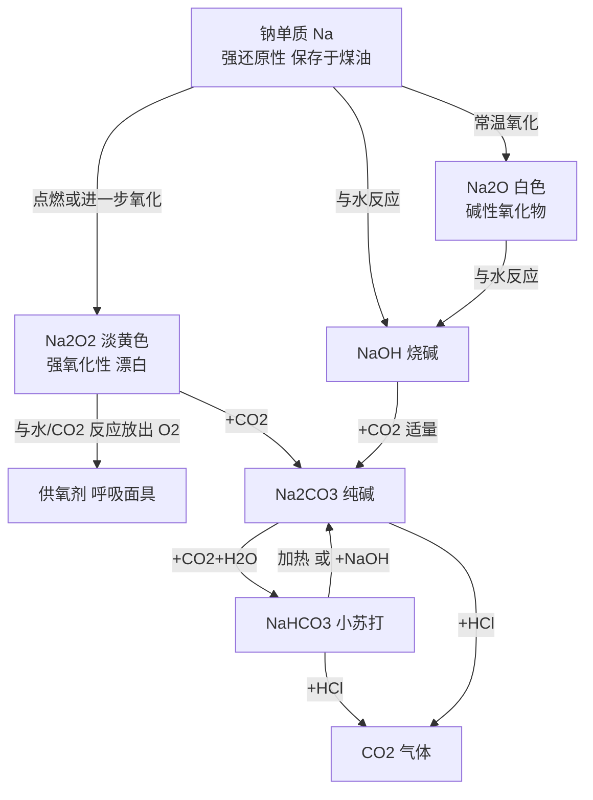

# 钠及其化合物总览

> [!abstract] 概览
> 钠是**碱金属**的代表元素，位于周期表第三周期第 IA 族，最外层只有 1 个电子，**失电子能力极强**，是典型的活泼金属。本章围绕"**钠单质 → 钠的氧化物 → 钠的盐**"三条线索展开：
>
> - **钠单质**：物理性质（银白色、质软、密度比水小）、化学性质（与 $\ce{O2}$、$\ce{Cl2}$、$\ce{H2O}$、盐溶液的反应）、保存方式、焰色试验；
> - **钠的氧化物**：$\ce{Na2O}$ 与 $\ce{Na2O2}$ 的组成与性质对比，重点掌握 $\ce{Na2O2}$ 的强氧化性、漂白性以及 $\ce{2Na2O2 + 2CO2 -> 2Na2CO3 + O2}$ 这一"供氧"反应；
> - **钠的盐**：$\ce{Na2CO3}$（纯碱/苏打）与 $\ce{NaHCO3}$（小苏打）的热稳定性、与酸/碱/盐的反应、相互转化与鉴别，并延伸至[[侯氏制碱法1|侯氏制碱法]]。
>
> 本章是"元素化学"的起点，也是高考**元素化合物综合题**与**化学实验（焰色试验、鉴别、除杂）**的高频考点，常与"物质的量计算""离子反应""氧化还原"交叉命题。

## 核心概念

| 物质 | 俗称 | 颜色/状态 | 关键性质 | 核心反应 |
| --- | --- | --- | --- | --- |
| $\ce{Na}$ | — | 银白色固体 | 强还原性，保存于煤油 | $\ce{2Na + 2H2O -> 2NaOH + H2 ^}$ |
| $\ce{Na2O}$ | — | 白色固体 | 碱性氧化物，遇水放热 | $\ce{Na2O + H2O -> 2NaOH}$ |
| $\ce{Na2O2}$ | 过氧化钠 | 淡黄色固体 | 强氧化性、漂白性 | $\ce{2Na2O2 + 2CO2 -> 2Na2CO3 + O2}$ |
| $\ce{NaOH}$ | 烧碱、火碱、苛性钠 | 白色固体 | 强碱，易潮解 | $\ce{2NaOH + CO2 -> Na2CO3 + H2O}$ |
| $\ce{Na2CO3}$ | 纯碱、苏打 | 白色粉末 | 热稳定，碱性强于小苏打 | $\ce{Na2CO3 + 2HCl -> 2NaCl + CO2 ^ + H2O}$ |
| $\ce{NaHCO3}$ | 小苏打 | 白色细小晶体 | 受热易分解，碱性较弱 | $\ce{2NaHCO3 \xrightarrow{\Delta} Na2CO3 + CO2 ^ + H2O}$ |

## 知识点列表

- [[01-钠单质]]：钠的物理性质、化学性质、保存与焰色试验
- [[02-钠的氧化物]]：$\ce{Na2O}$ 与 $\ce{Na2O2}$ 的对比、过氧化钠的强氧化性与漂白性
- [[03-碳酸钠与碳酸氢钠]]：热稳定性、与酸/碱/盐反应、相互转化、鉴别与侯氏制碱
- 延伸阅读：[[侯氏制碱法1]]、[[侯氏制碱法2]]、[[常见离子的检验方法]]

## 核心框架

## 核心方程式汇总

**钠单质**：
$$\ce{4Na + O2 -> 2Na2O}\qquad\ce{2Na + O2 \xrightarrow{\Delta} Na2O2}$$
$$\ce{2Na + 2H2O -> 2NaOH + H2 ^}$$

**钠的氧化物**：
$$\ce{Na2O + H2O -> 2NaOH}\qquad\ce{2Na2O2 + 2H2O -> 4NaOH + O2 ^}$$
$$\ce{2Na2O2 + 2CO2 -> 2Na2CO3 + O2}$$

**碳酸钠与碳酸氢钠（相互转化）**：
$$\ce{Na2CO3 + CO2 + H2O -> 2NaHCO3}$$
$$\ce{2NaHCO3 \xrightarrow{\Delta} Na2CO3 + CO2 ^ + H2O}$$
$$\ce{NaHCO3 + NaOH -> Na2CO3 + H2O}$$
$$\ce{Na2CO3 + 2HCl -> 2NaCl + CO2 ^ + H2O}$$

## 高考考点与易错点

> [!warning] 高频易错
> 1. **钠的保存**：保存在煤油中；不能保存在水或空气中。
> 2. **$\ce{Na2O}$（白色）与 $\ce{Na2O2}$（淡黄色）颜色区分**：常考颜色、电子式、与水/$\ce{CO2}$ 反应产物。
> 3. **$\ce{Na2O2}$ 中氧为 $-1$ 价**：与水、$\ce{CO2}$ 反应是歧化反应，既作氧化剂又作还原剂。
> 4. **钠不能置换盐溶液中的金属**：钠投入 $\ce{CuSO4}$ 溶液生成 $\ce{Cu(OH)2}$ 沉淀而非铜。
> 5. **碳酸钠与盐酸反应分两步**：向 $\ce{Na2CO3}$ 中滴盐酸先无气泡后产生气泡，滴加顺序不同现象不同。
> 6. **热稳定性**：$\ce{Na2CO3}$ 受热不分解，$\ce{NaHCO3}$ 受热分解；鉴别二者可加热或加 $\ce{CaCl2}$。
> 7. **焰色试验是物理变化**：观察钾需透过蓝色钴玻璃滤去钠的黄光。

## 学习建议与考查方式

- **命题角度**：钠及其化合物常以"实验现象描述 + 方程式书写 + 定量计算"综合题出现，如钠与水反应、$\ce{Na2O2}$ 供氧、碳酸钠盐酸滴加顺序等；
- **方程式要求**：熟练书写钠、$\ce{Na2O}$、$\ce{Na2O2}$、$\ce{NaOH}$、$\ce{Na2CO3}$、$\ce{NaHCO3}$ 之间的转化方程式（含离子方程式）；
- **计算抓手**：掌握 $n = \dfrac{m}{M}$ 与 $n = \dfrac{V}{V_m}$ 的联用，特别是 $\ce{Na2O2}$ 与 $\ce{CO2}$/$\ce{H2O}$ 反应的"气体体积减半、固体增重等于 CO+H2"差量规律；
- **实验与工业**：焰色试验操作、碳酸钠碳酸氢钠的鉴别与除杂、侯氏制碱流程，都是实验题与工业流程题的素材；
- **建议顺序**：先学 [[01-钠单质]] 建立钠的性质主线，再学 [[02-钠的氧化物]] 对比氧化物，最后学 [[03-碳酸钠与碳酸氢钠]] 掌握盐的转化网络，配合 [[06-物质的量/00-物质的量总览|物质的量]] 计算训练。

## 与其他知识关联

- 钠的强还原性、过氧化钠的氧化性属于"氧化还原反应"的典型应用（氧化还原理论见 [[00-化学总览]] 所述工具章节）；
- 钠与水反应、碳酸盐与酸反应的离子方程式属于"离子反应"范畴；
- 焰色试验检验 $\ce{Na+}$ 与 $\ce{K+}$，可对照 [[常见离子的检验方法]]；
- $\ce{Na2CO3}$/$\ce{NaHCO3}$ 的相互转化是后续"盐类水解""沉淀溶解平衡"的基础；
- 本章大量计算用到"物质的量"，与 [[06-物质的量/00-物质的量总览|物质的量]] 一章紧密衔接。

---
*返回 [[00-化学总览]]*
