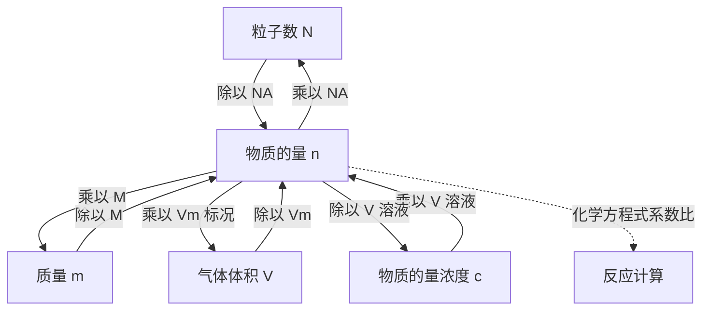

# 物质的量总览

> [!abstract] 概览
> **物质的量**是国际单位制中七个基本物理量之一，是连接**宏观**（质量、体积、浓度）与**微观**（分子、原子、离子等粒子数）的桥梁，也是高中化学计算的基石。本章围绕四组核心量展开：
>
> - **物质的量与摩尔质量**：$n = \dfrac{N}{N_A} = \dfrac{m}{M}$，阿伏伽德罗常数 $N_A = 6.02\times10^{23}\ \mathrm{mol^{-1}}$；
> - **阿伏伽德罗定律与气体摩尔体积**：$n = \dfrac{V}{V_m}$，标准状况下 $V_m = 22.4\ \mathrm{L/mol}$，同温同压下气体的体积比等于物质的量比；
> - **物质的量浓度与溶液配制**：$c = \dfrac{n}{V}$，一定物质的量浓度溶液的配制步骤与误差分析。
>
> 掌握"$n$ 是中心、四个公式互相换算"这一主线，化学方程式计算、元素化学计算就迎刃而解。

## 核心概念

| 物理量 | 符号 | 单位 | 定义/关系 |
| --- | --- | --- | --- |
| 物质的量 | $n$ | $\mathrm{mol}$ | 表示含有一定数目粒子的集合体 |
| 阿伏伽德罗常数 | $N_A$ | $\mathrm{mol^{-1}}$ | $N_A = 6.02\times10^{23}\ \mathrm{mol^{-1}}$ |
| 摩尔质量 | $M$ | $\mathrm{g/mol}$ | $M = \dfrac{m}{n}$，数值等于相对原子/分子质量 |
| 气体摩尔体积 | $V_m$ | $\mathrm{L/mol}$ | 标准状况下 $V_m = 22.4\ \mathrm{L/mol}$ |
| 物质的量浓度 | $c$ | $\mathrm{mol/L}$ | $c = \dfrac{n}{V}$ |

**核心公式网络**：
$$n = \dfrac{N}{N_A} = \dfrac{m}{M} = \dfrac{V}{V_m}\quad(\text{气体，标况})$$
$$c = \dfrac{n}{V}$$

## 知识点列表

- [[01-物质的量与摩尔质量]]：物质的量、阿伏伽德罗常数、摩尔质量及三者换算
- [[02-阿伏伽德罗定律与气体摩尔体积]]：气体摩尔体积、阿伏伽德罗定律及推论、平均摩尔质量
- [[03-物质的量浓度与溶液配制]]：物质的量浓度、稀释定律、一定物质的量浓度溶液的配制与误差分析
- 应用：元素化学中的定量计算（见 [[04-钠及其化合物/00-钠及其化合物总览|钠及其化合物]]、[[05-氯及其化合物/00-氯及其化合物总览|氯及其化合物]]）

## 核心框架

## 核心公式汇总

**物质的量与摩尔质量**：
$$n = \dfrac{N}{N_A},\qquad M = \dfrac{m}{n},\qquad n = \dfrac{m}{M}$$

**气体摩尔体积与阿伏伽德罗定律**：
$$n = \dfrac{V}{V_m}\qquad(\text{标准状况下 } V_m = 22.4\ \mathrm{L/mol})$$
同温同压下：$\dfrac{V_1}{V_2} = \dfrac{n_1}{n_2}$，$\dfrac{\rho_1}{\rho_2} = \dfrac{M_1}{M_2}$

**物质的量浓度**：
$$c = \dfrac{n}{V},\qquad c_1 V_1 = c_2 V_2\ (\text{稀释定律}),\qquad c = \dfrac{1000\rho w}{M}$$

**核心枢纽**：
$$n = \dfrac{N}{N_A} = \dfrac{m}{M} = \dfrac{V}{V_m}\qquad(\text{气体，标况})$$

## 高考考点与易错点

> [!warning] 高频易错
> 1. **摩尔质量有单位**（$\mathrm{g/mol}$），相对分子质量无单位，二者数值相同但意义不同。
> 2. **$N_A$ 有单位**（$\mathrm{mol^{-1}}$），近似值 $6.02\times10^{23}$。
> 3. **$22.4\ \mathrm{L/mol}$ 只适用于标准状况下的气体**：$\ce{H2O}$（液）、$\ce{SO3}$（固/液）、$\ce{CCl4}$（液）、乙醇、苯等不能套用。
> 4. **标准状况（0℃、101 kPa）≠ 常温常压（25℃、101 kPa）**。
> 5. **微粒种类要明确**：$1\ \mathrm{mol}\ \ce{O2}$ 含 $2\ \mathrm{mol}$ 氧原子；$1\ \mathrm{mol}\ \ce{H2O}$ 含 $10\ \mathrm{mol}$ 电子；$1\ \mathrm{mol}\ \ce{Na2O2}$ 含 $2\ \mathrm{mol}\ \ce{Na+}$ 和 $1\ \mathrm{mol}\ \ce{O2^{2-}}$。
> 6. **$c = n/V$ 中的 $V$ 是溶液体积**，不是溶剂体积。
> 7. **配制溶液误差**：未冷却就转移→偏高；定容俯视→偏高、仰视→偏低；未洗涤烧杯→偏低；摇匀后液面下降是正常现象，不能再加水。
> 8. **平均摩尔质量不是简单算术平均**：$\overline{M} = \dfrac{m_{\text{总}}}{n_{\text{总}}}$，按物质的量加权。

## 学习建议与考查方式

- **命题角度**：物质的量是高考"送分题"与"陷阱题"并存的章节——阿伏伽德罗常数（$N_A$）判断题几乎年年出现，涉及气体摩尔体积、微粒种类、电子/中子数、电解质电离等；
- **$N_A$ 判断题的答题策略**：逐项审查"是否标准状况""是否气体""微粒种类是否明确""是否涉及电离/水解""是否发生反应导致粒子数变化"；
- **计算套路**：以物质的量 $n$ 为枢纽，建立 $N$、$m$、$V$、$c$ 的换算网络；方程式计算按"写方程式 → 求已知量物质的量 → 按系数比换算 → 求目标量"四步走；
- **实验重点**：一定物质的量浓度溶液的配制（容量瓶使用、步骤、误差分析）是实验大题的高频考点；
- **建议顺序**：先学 [[01-物质的量与摩尔质量]] 掌握 $n$、$N_A$、$M$，再学 [[02-阿伏伽德罗定律与气体摩尔体积]] 攻克气体计算与推论，最后学 [[03-物质的量浓度与溶液配制]] 训练浓度计算与实验，并在 [[04-钠及其化合物/00-钠及其化合物总览|钠及其化合物]]、[[05-氯及其化合物/00-氯及其化合物总览|氯及其化合物]] 中反复应用。

## 与其他知识关联

- 物质的量是所有化学计算的"枢纽"：钠、氯等元素化学中的质量、体积、浓度计算都以 $n$ 为中心；
- 阿伏伽德罗常数与"摩尔"概念是理解微观粒子的基础，与后续"物质的量浓度""化学平衡（物质的量变化）"相关；
- 配制溶液实验与化学实验基本操作密切相关；
- 本章知识是全库 22 章的共同工具，见 [[00-化学总览]]。

---
*返回 [[00-化学总览]]*
