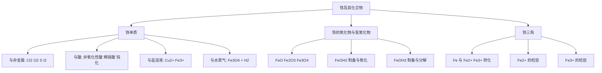

# 铁及其化合物总览

> [!abstract] 概览
> 本章以**铁**为核心，系统梳理铁的三种常见价态（$\ce{Fe^0}$、$\ce{Fe^{2+}}$、$\ce{Fe^{3+}}$）及其相互转化。铁是高中阶段最重要的**变价金属**，其"铁三角"转化关系是氧化还原反应知识的综合应用，也是高考选择题、实验题与流程题的高频考点。
>
> 学习主线：**铁单质（还原性）→ 铁的氧化物与氢氧化物（碱性氧化物/碱）→ 铁三角（$\ce{Fe \rightleftharpoons Fe^{2+} \rightleftharpoons Fe^{3+}}$ 的转化与检验）**。重点把握"价态—试剂—产物"的对应关系，尤其注意同一种物质与不同强弱氧化剂/还原剂反应时铁元素价态的变化。

## 章节地位与学习路径

- 本章属于必修一**元素化学**板块，是氧化还原反应、离子反应两大理论的具体应用。
- 铁是**变价金属**的典型代表，把"氧化性强弱决定产物价态"这一核心思想体现得淋漓尽致：
  - 强氧化剂（$\ce{Cl2}$、$\ce{O2}$、稀硝酸）把铁氧化到 $\ce{Fe^{3+}}$；
  - 弱氧化剂（$\ce{S}$、$\ce{I2}$、$\ce{Cu^{2+}}$、非氧化性酸）只能把铁氧化到 $\ce{Fe^{2+}}$。
- 与 04 章钠、08 章铝对比学习：钠（+1 价单一价态）、铝（+3 价单一价态、两性）、铁（变价）形成"金属元素"的完整认识。

## 知识结构

## 知识点导航

| 笔记 | 核心内容 | 入口 |
| --- | --- | --- |
| 01 铁单质 | 铁的物理性质、与非金属/酸/盐的反应、钝化、与水蒸气 | [[01-铁单质]] |
| 02 铁的氧化物与氢氧化物 | $\ce{FeO}$/$\ce{Fe2O3}$/$\ce{Fe3O4}$、$\ce{Fe(OH)2}$ 制备防氧化、$\ce{Fe(OH)3}$ | [[02-铁的氧化物与氢氧化物]] |
| 03 铁三角与亚铁离子铁离子转化 | $\ce{Fe}$/$\ce{Fe^{2+}}$/$\ce{Fe^{3+}}$ 转化、$\ce{Fe^{2+}}$/$\ce{Fe^{3+}}$ 检验 | [[03-铁三角与亚铁离子铁离子的转化]] |

## 核心框架：铁三角

铁的三种价态构成一个"三角"转化关系，这是本章的灵魂：

$$
\ce{Fe <-->[弱氧化剂][还原剂] Fe^{2+} <-->[强氧化剂][Fe、Cu、I^-、SO2等] Fe^{3+}}
$$

- **氧化性**：$\ce{Fe^{3+} > Cu^{2+} > Fe^{2+}}$，这是判断"谁氧化谁"的标尺。
- **还原性**：$\ce{Fe > Fe^{2+}}$。
- 归中反应：$\ce{Fe + 2Fe^{3+} -> 3Fe^{2+}}$（把 $\ce{Fe^{3+}}$ 还原为 $\ce{Fe^{2+}}$ 时常用铁粉）。

### 铁与不同试剂反应的产物对比（重点表格）

| 反应物 | 条件 | 产物中铁的价态 | 关键方程式 |
| --- | --- | --- | --- |
| $\ce{Fe}$ + $\ce{Cl2}$ | 点燃 | $+3$ | $\ce{2Fe + 3Cl2 \xrightarrow{\Delta} 2FeCl3}$ |
| $\ce{Fe}$ + $\ce{S}$ | 加热 | $+2$ | $\ce{Fe + S \xrightarrow{\Delta} FeS}$ |
| $\ce{Fe}$ + $\ce{O2}$ | 点燃 | $+\frac{8}{3}$ | $\ce{3Fe + 2O2 \xrightarrow{点燃} Fe3O4}$ |
| $\ce{Fe}$ + 盐酸 | 常温 | $+2$ | $\ce{Fe + 2H+ -> Fe^{2+} + H2 ^}$ |
| $\ce{Fe}$ + 稀硝酸（过量） | 常温 | $+3$ | $\ce{Fe + 4HNO3 -> Fe(NO3)3 + NO ^ + 2H2O}$ |
| $\ce{Fe}$ + 水蒸气 | 高温 | $+\frac{8}{3}$ | $\ce{3Fe + 4H2O(g) \xrightarrow{高温} Fe3O4 + 4H2}$ |

> [!tip] 记忆口诀
> 铁三角，变价王；弱氧化剂到二价，强氧化剂到三价；检验二价先加硫氰（$\ce{KSCN}$）无色，再加氯水变血红。

## 高考高频考点

1. 铁与 $\ce{Cl2}$、$\ce{S}$ 反应产物的价态差异及其原因（氧化性强弱）。
2. $\ce{Fe3O4}$ 的化合价组成（含 $\ce{Fe^{2+}}$ 和 $\ce{Fe^{3+}}$）及与盐酸的反应。
3. $\ce{Fe(OH)2}$ 制备时必须隔绝氧气的操作细节（新制溶液、煮沸、油封、滴管伸入液面下）。
4. $\ce{Fe^{2+}}$/$\ce{Fe^{3+}}$ 的检验（$\ce{KSCN}$、$\ce{NaOH}$）及干扰排除。
5. $\ce{FeCl3}$ 溶液刻蚀铜板（$\ce{2Fe^{3+} + Cu -> 2Fe^{2+} + Cu^{2+}}$）。
6. 保存 $\ce{FeSO4}$ 溶液加铁粉的目的（防止 $\ce{Fe^{2+}}$ 被氧化）。

## 常见题型与解题策略

| 题型 | 解题思路 |
| --- | --- |
| 铁与不同氧化剂反应 | 先判断氧化剂强弱：$\ce{Cl2}$/$\ce{O2}$/稀硝酸 → $+3$ 价；$\ce{S}$/$\ce{I2}$/$\ce{Cu^{2+}}$/$\ce{H+}$ → $+2$ 价 |
| $\ce{Fe3O4}$ 相关计算 | 看成 $\ce{FeO.Fe2O3}$，1 mol 含 $1$ mol $\ce{Fe^{2+}}$ + $2$ mol $\ce{Fe^{3+}}$ |
| $\ce{Fe(OH)2}$ 制备实验 | 围绕"隔绝氧气"四要素逐一排查选项 |
| $\ce{Fe^{2+}}$/$\ce{Fe^{3+}}$ 检验 | 先 $\ce{KSCN}$ 排除 $\ce{Fe^{3+}}$，再加氧化剂验证 $\ce{Fe^{2+}}$ |
| 铁与稀硝酸"量"问题 | 硝酸过量 → $\ce{Fe^{3+}}$；铁过量 → 归中成 $\ce{Fe^{2+}}$ |
| 流程题中铁的回收 | 常用 $\ce{Fe}$ 还原 $\ce{Fe^{3+}}$：$\ce{Fe + 2Fe^{3+} -> 3Fe^{2+}}$ |

## 易错提醒

> [!warning] 本章易错点速览
> 1. 铁与 $\ce{Cl2}$ 生成 $\ce{FeCl3}$，与 $\ce{S}$ 生成 $\ce{FeS}$——氧化剂强弱决定产物价态。
> 2. $\ce{Fe3O4}$ 中铁显 $+\frac{8}{3}$ 价，可看作 $\ce{FeO.Fe2O3}$（$1$ 个 $\ce{Fe^{2+}}$ + $2$ 个 $\ce{Fe^{3+}}$）。
> 3. $\ce{Fe(OH)2}$ 制备四要素：新制亚铁盐、煮沸除氧、滴管伸入液面下、油封。
> 4. 检验 $\ce{Fe^{2+}}$ 必须"先 $\ce{KSCN}$ 无色，后加氧化剂变红"。
> 5. 铁与水蒸气在高温下反应生成 $\ce{Fe3O4}$，不生成 $\ce{Fe(OH)3}$。
> 6. 常温下铁遇浓硫酸、浓硝酸钝化（化学变化），可盛装浓硝酸。

## 与其他知识关联

- 与 **氧化还原反应**：本章是"氧化性强弱决定产物价态"最典型的素材。
- 与 **离子反应**：所有铁三角转化都可写成离子方程式。
- 与 [[杂化轨道理论]]：铁配合物 $\ce{[Fe(CN)6]^{3-}}$、$\ce{[Fe(SCN)6]^{3-}}$ 的颜色可联系配位化学理解（选必二深化）。
- 与 [[常见离子的检验方法]]：$\ce{Fe^{2+}}$/$\ce{Fe^{3+}}$ 的检验是离子检验的重要组成部分。
- 与 **08 章铝及其化合物**：铝热反应正是利用铝的还原性冶炼铁，见 [[08-铝及其化合物与金属材料/00-铝及其化合物总览]]。

> [!quote] 个人理解
> 学铁这一章，不要死背方程式。抓住"**价态变化由氧化剂/还原剂强弱决定**"这一条主线，再配合"生成物中铁的价态 + 介质环境（酸/碱）"两个约束，几乎所有方程式都能自己写出来。

---
*返回 [[00-化学总览]]*
