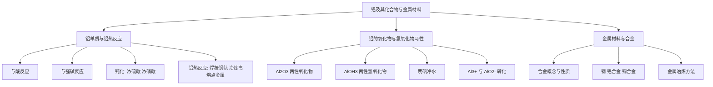

# 铝及其化合物与金属材料总览

> [!abstract] 概览
> 本章以**铝**为核心，重点掌握铝及其化合物（$\ce{Al}$、$\ce{Al2O3}$、$\ce{Al(OH)3}$）的**两性**——既能与酸反应，又能与强碱反应。同时介绍**铝热反应**（冶炼高熔点金属）、**明矾净水**（胶体吸附）以及**合金与金属材料**的概念。铝是高考"两性"考点的代名词，几乎每年必考。
>
> 学习主线：**铝单质（两性金属、铝热反应）→ 铝的氧化物与氢氧化物（两性）→ 金属材料与合金（应用）**。贯穿全章的思想是"**结构决定性质**"——$\ce{Al^{3+}}$ 与 $\ce{OH^-}$ 的计量关系决定沉淀的溶解。

## 章节地位与学习路径

- 本章属于必修一**元素化学**部分，与 04 章钠、07 章铁共同构成金属元素的主干知识。
- 铝的特殊性在于**两性**：它是唯一既与酸反应又与强碱反应生成氢气的常见金属。
- 与铁对比：铁是"变价"，铝是"两性"，钠是"活泼"。三者构成金属性质认识的三个维度。
- 金属材料与合金是必修二化学与可持续发展、选必一电化学的基础。

## 知识结构

## 知识点导航

| 笔记 | 核心内容 | 入口 |
| --- | --- | --- |
| 01 铝单质与铝热反应 | 铝的两性、钝化、铝热反应原理与应用 | [[01-铝单质与铝热反应]] |
| 02 铝的氧化物与氢氧化物两性 | $\ce{Al2O3}$/$\ce{Al(OH)3}$ 两性、制备、明矾净水 | [[02-铝的氧化物与氢氧化物两性]] |
| 03 金属材料与合金 | 合金概念与性质、常见合金、金属冶炼 | [[03-金属材料与合金]] |

## 核心框架：铝的两性

铝及其氧化物、氢氧化物都能与**酸**和**强碱**反应，构成完整的"两性"体系：

| 物质 | 与酸反应 | 与强碱反应 |
| --- | --- | --- |
| $\ce{Al}$ | $\ce{2Al + 6H+ -> 2Al^{3+} + 3H2 ^}$ | $\ce{2Al + 2OH^- + 2H2O -> 2AlO2^- + 3H2 ^}$ |
| $\ce{Al2O3}$ | $\ce{Al2O3 + 6H+ -> 2Al^{3+} + 3H2O}$ | $\ce{Al2O3 + 2OH^- -> 2AlO2^- + H2O}$ |
| $\ce{Al(OH)3}$ | $\ce{Al(OH)3 + 3H+ -> Al^{3+} + 3H2O}$ | $\ce{Al(OH)3 + OH^- -> AlO2^- + 2H2O}$ |

> [!tip] 记忆口诀
> 铝家三兄弟（$\ce{Al}$、$\ce{Al2O3}$、$\ce{Al(OH)3}$）都两性，与酸生成三价铝，与碱生成偏铝酸根（$\ce{AlO2^-}$）。记住"**酸出铝离子，碱出偏铝酸根**"。

### $\ce{Al^{3+}}$ 与 $\ce{AlO2^-}$ 的计量关系（图像题基础）

| 条件 | 反应 | 计量关系 |
| --- | --- | --- |
| 碱少量 | $\ce{Al^{3+} + 3OH^- -> Al(OH)3 v}$ | $\ce{n(Al^{3+}) : n(OH^-) = 1 : 3}$，沉淀最多 |
| 碱过量 | $\ce{Al^{3+} + 4OH^- -> AlO2^- + 2H2O}$ | $\ce{n(Al^{3+}) : n(OH^-) = 1 : 4}$，沉淀完全溶解 |
| 酸少量 | $\ce{AlO2^- + H+ + H2O -> Al(OH)3 v}$ | $\ce{n(AlO2^-) : n(H+) = 1 : 1}$ |
| 酸过量 | $\ce{AlO2^- + 4H+ -> Al^{3+} + 2H2O}$ | $\ce{n(AlO2^-) : n(H+) = 1 : 4}$ |

## 高考高频考点

1. 铝与强碱反应的正确方程式（注意水的参与，产物是 $\ce{NaAlO2}$）。
2. 铝热反应的原理、应用（焊接钢轨、冶炼 $\ce{V}$、$\ce{Cr}$、$\ce{Mn}$ 等高熔点金属）。
3. $\ce{Al(OH)3}$ 的两性及其制备（必须用氨水，不能用 $\ce{NaOH}$）。
4. $\ce{Al3+}$ 与 $\ce{OH^-}$ 的量关系图像（沉淀生成与溶解的计量关系）。
5. 明矾净水的原理（$\ce{Al^{3+}}$ 水解生成胶体，吸附悬浮杂质，不是 $\ce{Al^{3+}}$ 本身净水）。
6. 合金的性质（硬度大、熔点低）与金属冶炼方法（电解法、热还原法、热分解法）。

## 常见题型与解题策略

| 题型 | 解题思路 |
| --- | --- |
| 铝与酸/碱放氢比较 | 等量铝转移电子数相同 → 放氢量相等（$1 : 1$） |
| $\ce{Al(OH)3}$ 制备 | 首选"铝盐 + 氨水"，弱碱不溶 $\ce{Al(OH)3}$ |
| 铝热反应判断 | 铝只能冶炼活动性比铝弱的金属（$\ce{Mg}$ 不行） |
| 明矾净水 | 本质是 $\ce{Al^{3+}}$ 水解生成胶体的吸附，不能杀菌 |
| 沉淀量图像 | 沉淀最多 $\ce{n(Al^{3+}) : n(OH^-) = 1 : 3}$；完全溶解 $1 : 4$ |
| 金属冶炼方法 | 按活动性选电解法/热还原法/热分解法 |

## 易错提醒

> [!warning] 本章易错点速览
> 1. 铝与强碱反应必须写 $\ce{H2O}$ 参与：$\ce{2Al + 2OH^- + 2H2O -> 2AlO2^- + 3H2 ^}$。
> 2. $\ce{Al(OH)3}$ 只溶于强碱不溶于弱碱（氨水），制备必须用氨水。
> 3. 铝在常温下遇浓硫酸、浓硝酸钝化，但加热时剧烈反应。
> 4. 铝热反应的条件是"高温"，需镁条 + 氯酸钾引发，用于焊接钢轨、冶炼高熔点金属。
> 5. 明矾净水靠 $\ce{Al^{3+}}$ 水解生成胶体的吸附作用，不能杀菌消毒。
> 6. $\ce{Al^{3+}}$ 与 $\ce{AlO2^-}$ 因双水解不能大量共存。

## 与其他知识关联

- 与 **07 章铁及其化合物**：铝热反应正是 $\ce{Al}$ 还原 $\ce{Fe2O3}$ 冶炼铁，见 [[07-铁及其化合物/00-铁及其化合物总览]]。
- 与 **离子反应**：铝的两性反应、明矾净水都是离子方程式与水解的经典素材。
- 与 **物质结构与性质**：铝原子的 3s²3p¹ 结构与金属键决定其延展性、导电性，可在选必二深化。
- 与 [[杂化轨道理论]]：$\ce{AlCl3}$ 的 $\ce{sp^2}$ 杂化、$\ce{AlF6^{3-}}$ 配离子等可在选必二拓展。
- 与 **选必一水溶液**：$\ce{Al^{3+}}$ 的水解平衡、$\ce{AlO2^-}$ 与 $\ce{HCO3^-}$ 双水解是离子共存考点。

> [!quote] 个人理解
> 铝这一章最核心的一句话："**两性源于 $\ce{Al(OH)3}$ 既能酸式电离又能碱式电离**"。碱式电离：$\ce{Al(OH)3 \rightleftharpoons Al^{3+} + 3OH^-}$；酸式电离：$\ce{Al(OH)3 \rightleftharpoons H+ + AlO2^- + H2O}$。与酸作用促进碱式电离，与碱作用促进酸式电离，故既能溶于酸又能溶于强碱。

---
*返回 [[00-化学总览]]*
