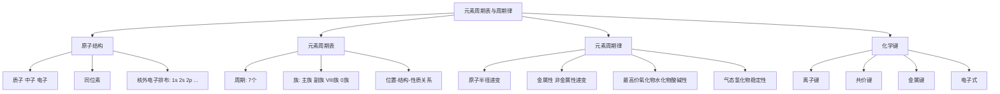

# 元素周期表与周期律总览

> [!abstract] 概览
> 本章是高中化学的**理论枢纽**，从微观的原子结构出发，认识元素周期表的结构，归纳元素性质随原子序数递增的**周期性变化规律**，最后上升到化学键（离子键、共价键、金属键）理解物质构成的本质。这一章把前面学过的钠、铝、铁、氯等元素统摄到一张"周期表"中，是推断题、选择题的必考内容。
>
> 学习主线：**原子结构（质子/中子/电子、核外电子排布）→ 元素周期表（周期、族）→ 元素周期律（半径、金属性、酸碱性、氢化物稳定性）→ 化学键（离子键/共价键/金属键）**。贯穿全章的思想是"**位置—结构—性质**"三位一体。

## 章节地位与学习路径

- 本章属于必修一**物质结构基础**，是连接必修一元素化学与选必二物质结构、选必三有机结构的桥梁。
- "位置—结构—性质"关系是推断题的灵魂：由位置推结构，由结构推性质。
- 化学键是理解"化学反应的本质是旧键断裂、新键形成"的基础，也是选必一反应热、选必二分子结构的起点。

## 知识结构

## 知识点导航

| 笔记 | 核心内容 | 入口 |
| --- | --- | --- |
| 01 原子结构 | 质子/中子/电子、质量数、同位素、核外电子排布 | [[01-原子结构]] |
| 02 元素周期表 | 周期、族、主族副族、位置—结构—性质 | [[02-元素周期表]] |
| 03 元素周期律 | 半径、金属性/非金属性、酸碱性、氢化物稳定性 | [[03-元素周期律]] |
| 04 化学键 | 离子键/共价键/金属键、电子式、$\ce{NaCl}$ 与 $\ce{HCl}$ 对比 | [[04-化学键]] |

## 核心框架：位置—结构—性质

**原子结构决定元素在周期表中的位置，位置决定元素性质**，三者互为推理依据：

| 关系 | 内容 |
| --- | --- |
| 原子结构 → 位置 | 电子层数 = 周期序数；最外层电子数 = 主族序数 |
| 原子结构 → 性质 | 最外层电子数决定得失电子能力（金属性/非金属性） |
| 位置 → 性质 | 同周期、同主族元素性质呈规律性递变 |

> [!tip] 记忆口诀
> 周期序数电子层，主族序数价电数；左金右非上非下金，半径同周左大右小、同族下大上小；金属看碱性强弱，非金属看氢化物稳定。

### 同周期与同主族递变对照表

| 性质 | 同周期（左→右） | 同主族（上→下） |
| --- | --- | --- |
| 原子半径 | 减小 | 增大 |
| 金属性 | 减弱 | 增强 |
| 非金属性 | 增强 | 减弱 |
| 最高价氧化物水化物碱性 | 减弱 | 增强 |
| 最高价氧化物水化物酸性 | 增强 | 减弱 |
| 气态氢化物稳定性 | 增强 | 减弱 |

> [!note] 记忆捷径
> "**周期律看最外层电子数变化**"：同周期最外层电子数从 $1\to 8$ 递增，得电子能力增强；同主族电子层数增多，半径增大，失电子能力增强。掌握这个本质，四条递变规律不必死记。

## 高考高频考点

1. 原子结构：质量数 $A = Z + N$，同位素的判断（如 $\ce{^{1}_{1}H}$、$\ce{^{2}_{1}H}$、$\ce{^{3}_{1}H}$）。
2. 核外电子排布规律与原子结构示意图。
3. 周期表结构：周期数、族序数与原子结构的对应关系。
4. 周期律：原子半径、金属性/非金属性、最高价氧化物水化物酸碱性、气态氢化物稳定性随原子序数的递变。
5. 元素推断题：利用"位置—结构—性质"反推元素。
6. 化学键类型判断与电子式书写，$\ce{NaCl}$ 与 $\ce{HCl}$ 的键型对比。

## 常见题型与解题策略

| 题型 | 解题思路 |
| --- | --- |
| 原子微粒数计算 | 原子：$Z$ = 电子数；离子：$Z$ = 电子数 ± 电荷数；$N = A - Z$ |
| 同位素判断 | 质子数相同、中子数不同，必须是"原子" |
| 位置推断 | 电子层数 → 周期，最外层电子数 → 主族；再套递变规律 |
| 周期律比较 | 同周期左→右：半径减小、非金属性增强；同主族上→下：金属性增强 |
| 酸碱性/稳定性比较 | 只比最高价含氧酸；稳定性与非金属性一致 |
| 化学键与电子式 | 离子化合物加括号标电荷，共价化合物画共用电子对 |

## 易错提醒

> [!warning] 本章易错点速览
> 1. 周期序数 = 电子层数，主族序数 = 最外层电子数，两者不能互换。
> 2. 比较酸性只比**最高价**氧化物水化物，如氯的最高价含氧酸是 $\ce{HClO4}$。
> 3. 氟无正价、氧无最高正价；最高正价 = 主族序数只对主族元素成立。
> 4. 同位素（原子层面）与同素异形体（单质层面）不要混淆。
> 5. 含离子键的一定是离子化合物，但含共价键的不一定是共价化合物（如 $\ce{NaOH}$）。
> 6. 熔融态导电的是离子化合物，共价化合物熔融态不导电（$\ce{NaCl}$ 与 $\ce{HCl}$ 的差异）。

## 与其他知识关联

- 前面的元素化学（[[07-铁及其化合物/00-铁及其化合物总览]]、[[08-铝及其化合物与金属材料/00-铝及其化合物总览]]）可在周期律视角下重新统摄理解。
- 核外电子排布、杂化轨道等微观理论在 [[杂化轨道理论]] 与选必二物质结构中深化。
- 化学键与反应热（断键吸热、成键放热）在选必一化学反应热效应中应用。
- 元素周期表是[[多晶型、手性与同分异构体]]等后续专题的背景知识。

> [!quote] 个人理解
> 元素周期律把 118 种元素从"杂乱的知识点"压缩成"一张表 + 几条递变规律"。学会用周期表"查"性质，比死记每个元素的性质高效得多。考试中大部分元素题，都能在周期表上"定位 + 比较"解决。

---
*返回 [[00-化学总览]]*
