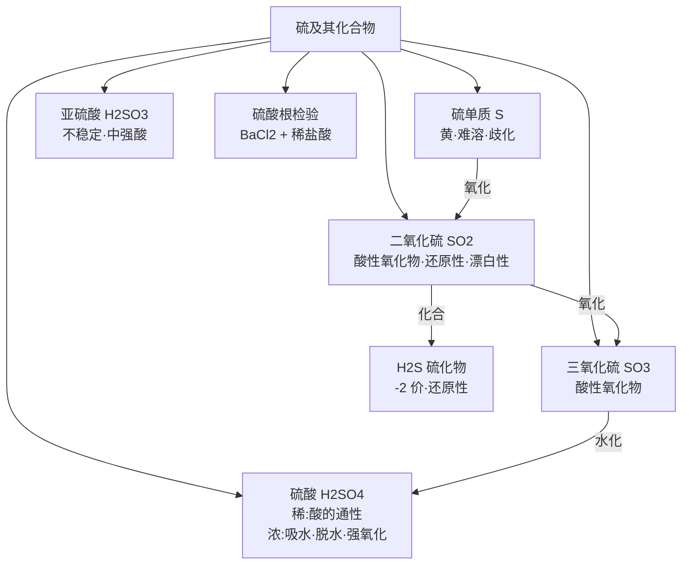

# 硫及其化合物总览

> [!abstract] 概览
> 硫是**氧族元素**（第 VIA 族）的代表元素，在必修一中与氯、氮、硅共同构成非金属元素化学的主干。本章围绕硫的**价态三角**（$\ce{-2 \to 0 \to +4 \to +6}$）展开：从硫单质出发，重点掌握 **$\ce{SO2}$**（酸性氧化物 + 还原性 + 弱氧化性 + 漂白性）、**稀硫酸与浓硫酸**（吸水性、脱水性、强氧化性）以及 **$\ce{SO4^{2-}}$ 的检验**。高考中本章常以**氧化还原反应、离子检验、物质性质综合**为背景命题，是最容易失分的基础章节之一。

## 知识网络

## 章节导航

| 笔记 | 内容要点 |
| --- | --- |
| [[10-硫及其化合物/01-硫单质\|01-硫单质]] | 物理性质、与金属/非金属反应、歧化反应、价态三角 |
| [[10-硫及其化合物/02-二氧化硫\|02-二氧化硫]] | 酸性氧化物、还原性、漂白性（与氯水区别）、$\ce{SO2}$ 检验 |
| [[10-硫及其化合物/03-浓硫酸\|03-浓硫酸]] | 稀硫酸三大性质、浓硫酸吸水性/脱水性/强氧化性、钝化 |
| [[10-硫及其化合物/04-硫酸根离子的检验\|04-硫酸根离子的检验]] | $\ce{BaCl2}$ + 稀盐酸、干扰离子排除、定量计算 |

## 核心框架：硫的价态三角

> [!important] 氧化还原主线
> 硫常见价态：$\ce{-2,\ 0,\ +4,\ +6}$，相邻价态间的物质不能发生**归中反应**，但可发生**歧化反应**（同价态歧化需"中间价态"）。
>
> - **还原性**（低价态 → 高价态）：$\ce{H2S / S / SO2}$ 均可被氧化剂氧化，如
>   $\ce{SO2 + Br2 + 2H2O -> 2HBr + H2SO4}$、
>   $\ce{2H2S + O2 -> 2S + 2H2O}$（不完全燃烧）。
> - **氧化性**（高价态 → 低价态）：浓 $\ce{H2SO4}$ 氧化 $\ce{Cu}$、$\ce{C}$ 等；$\ce{SO2}$ 的氧化性很弱，仅能氧化强还原剂（如 $\ce{H2S}$）。
> - **歧化**：$\ce{3S + 6NaOH ->[Δ] 2Na2S + Na2SO3 + 3H2O}$。
>
> 口诀：**"硫价三角，负零正四正六；低价显还原，高价显氧化；中间价态可漂白、可歧化。"**

## 高考命题热点

1. **$\ce{SO2}$ 的漂白性**与氯水漂白的**原理区别**（可逆结合 vs 不可逆氧化）。
2. **浓硫酸的三大特性**及"常温钝化 $\ce{Fe}$、$\ce{Al}$"的辨析。
3. **$\ce{SO4^{2-}}$ 检验**的规范操作：**先加稀盐酸、后加 $\ce{BaCl2}$**，注意排除 $\ce{Ag+}$、$\ce{CO3^{2-}}$、$\ce{SO3^{2-}}$ 干扰。
4. **酸性氧化物通性**的迁移：$\ce{SO2}$ 与 $\ce{CO2}$、$\ce{SiO2}$ 性质的比较。
5. **酸雨**的形成与防治（$\ce{SO2 -> H2SO3 -> H2SO4}$）。

## 重要方程式汇总

| 反应 | 方程式 | 类型 |
| --- | --- | --- |
| 硫与铜 | $\ce{2Cu + S ->[Δ] Cu2S}$ | 氧化还原（低价硫化物） |
| 硫的歧化 | $\ce{3S + 6NaOH ->[Δ] 2Na2S + Na2SO3 + 3H2O}$ | 歧化 |
| $\ce{SO2}$ 与溴水 | $\ce{SO2 + Br2 + 2H2O -> 2HBr + H2SO4}$ | 还原性 |
| $\ce{SO2}$ 与 $\ce{H2S}$ | $\ce{SO2 + 2H2S -> 3S + 2H2O}$ | 归中 |
| $\ce{SO2}$ 催化氧化 | $\ce{2SO2 + O2 <=>[催化剂][Δ] 2SO3}$ | 工业制硫酸 |
| 铜与浓硫酸 | $\ce{Cu + 2H2SO4(浓) ->[Δ] CuSO4 + SO2 ^ + 2H2O}$ | 浓硫酸强氧化性 |
| 碳与浓硫酸 | $\ce{C + 2H2SO4(浓) ->[Δ] CO2 ^ + 2SO2 ^ + 2H2O}$ | 浓硫酸强氧化性 |
| 硫酸根检验 | $\ce{Ba^{2+} + SO4^{2-} -> BaSO4 v}$ | 离子检验 |

## 常见易错点速记

> [!warning] 本章高频易错点
> 1. $\ce{S}$ 与 $\ce{O2}$ 只生成 $\ce{SO2}$，与过量无关。
> 2. $\ce{S}$ 与 $\ce{Fe}$、$\ce{Cu}$ 生成 **$\ce{FeS}$、$\ce{Cu2S}$**（低价），不是 $\ce{Fe2S3}$、$\ce{CuS}$。
> 3. $\ce{SO2}$ 使品红褪色（漂白性，可逆）vs 使溴水/酸性 $\ce{KMnO4}$ 褪色（还原性，不可逆）。
> 4. $\ce{SO2 + Cl2 + 2H2O -> 2HCl + H2SO4}$：$1:1$ 混合漂白性消失。
> 5. 浓硫酸"吸水（游离水）"与"脱水（有机物炭化）"是两回事。
> 6. 常温浓硫酸使 $\ce{Fe}$、$\ce{Al}$ 钝化，但加热会反应。
> 7. 检验 $\ce{SO4^{2-}}$：先加稀盐酸、再加 $\ce{BaCl2}$，慎用硝酸。

## 本章地位与衔接

- **前置基础**：氧化还原反应（03）中的"价态变化、氧化剂/还原剂判断"是理解硫元素性质的理论工具；离子反应（02）用于书写 $\ce{SO4^{2-}}$ 检验等方程式。
- **横向对比**：与氯（05）、氮（11）、硅（12）同属非金属，可对比"酸性氧化物、最高价含氧酸、氢化物、气体收集"等。
- **后续延伸**：硫的催化氧化（$\ce{SO2 -> SO3}$）是化学平衡（18）的典型可逆反应；硫酸型酸雨与环境保护属于必修二"化学与可持续发展"。

## 学习建议

> [!tip] 学习方法
> - 本章"物质多、反应多"，建议以**价态三角**为骨架，用**氧化还原理论**解释每一个反应，而不是死记方程式。
> - 将 $\ce{SO2}$ 与 $\ce{CO2}$、$\ce{Cl2}$ 做对比学习（[[10-硫及其化合物/02-二氧化硫|SO2 与 CO2/Cl2 鉴别]]），把"性质—检验—用途"串成一条线。
> - 检验类实验（如 [[10-硫及其化合物/04-硫酸根离子的检验|硫酸根检验]]）要与 [[常见离子的检验方法]] 结合复习，掌握"先排除干扰、再鉴定"的思路。

---
*返回 [[00-化学总览]]*
