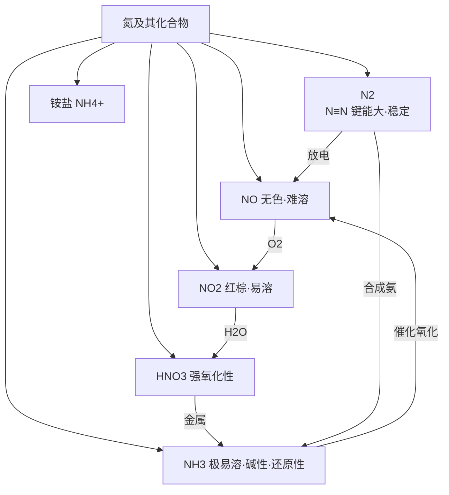

# 氮及其化合物总览

> [!abstract] 概览
> 氮是第 VA 族的代表元素，在必修一与硫、硅共同构成"非金属元素化学"的主干。本章围绕氮的**价态多变**（$\ce{-3 \to 0 \to +1 \to +2 \to +3 \to +4 \to +5}$）展开：$\ce{N2}$ 因 $\ce{N≡N}$ 键稳定而化学性质不活泼；$\ce{NO}$、$\ce{NO2}$ 是氮的两种重要氧化物；**氨气**（喷泉实验、极易溶于水、还原性、制取）与**铵盐**是重点；**硝酸**的强氧化性（浓稀不同、钝化）是高考难点。

## 知识网络

## 章节导航

| 笔记 | 内容要点 |
| --- | --- |
| [[11-氮及其化合物/01-氮气与氮的氧化物\|01-氮气与氮的氧化物]] | $\ce{N2}$ 稳定性、$\ce{NO/NO2}$ 性质、$\ce{3NO2 + H2O -> 2HNO3 + NO}$、溶于水计算 |
| [[11-氮及其化合物/02-氨与铵盐\|02-氨与铵盐]] | 喷泉实验、$\ce{NH3}$ 与水/酸反应、还原性、实验室制氨、铵盐 |
| [[11-氮及其化合物/03-硝酸\|03-硝酸]] | 强氧化性（与 $\ce{Cu}$ 浓稀不同）、钝化、不稳定性、硝酸盐 |

## 核心框架：氮的价态与常见物质

| 化合价 | 物质 | 性质要点 |
| --- | --- | --- |
| $\ce{-3}$ | $\ce{NH3}$、$\ce{NH4+}$ | 氨为碱性气体、还原性；铵盐受热分解、与碱反应 |
| $\ce{0}$ | $\ce{N2}$ | $\ce{N≡N}$ 键能大，常温稳定 |
| $\ce{+2}$ | $\ce{NO}$ | 无色、难溶、易被氧化为 $\ce{NO2}$ |
| $\ce{+4}$ | $\ce{NO2}$ | 红棕色、易溶、自身氧化还原 |
| $\ce{+5}$ | $\ce{HNO3}$、硝酸盐 | 强氧化性、不稳定性 |

> [!important] 氧化还原主线
> - **归中反应**：$\ce{3NO2 + H2O -> 2HNO3 + NO}$（$\ce{+4}$ 价 $\ce{N}$ 歧化为 $\ce{+5}$ 和 $\ce{+2}$）。
> - **氨的催化氧化**（工业制硝酸第一步）：$\ce{4NH3 + 5O2 ->[Pt][Δ] 4NO + 6H2O}$。
> - **合成氨**：$\ce{N2 + 3H2 <=>[高温高压][催化剂] 2NH3}$。
> - 低价氮（$\ce{NH3}$）显还原性，高价氮（$\ce{HNO3}$）显氧化性，中间价（$\ce{NO}$、$\ce{NO2}$）可发生歧化或归中。

## 高考命题热点

1. **喷泉实验**的原理与拓展（$\ce{NH3}$、$\ce{HCl}$ 等极易溶于水的气体）。
2. **$\ce{NO2}$ 溶于水的计算**：$\ce{3NO2 + H2O -> 2HNO3 + NO}$，及 $\ce{NO2}$、$\ce{NO}$、$\ce{O2}$ 混合气溶于水的"最终无剩余"组合。
3. **$\ce{NH3}$ 的制取**与**干燥**（碱石灰，不用浓硫酸、无水 $\ce{CaCl2}$）。
4. **硝酸的强氧化性**：浓稀硝酸与 $\ce{Cu}$ 反应的不同产物、钝化、硝酸盐受热分解规律。
5. **铵根 $\ce{NH4+}$ 的检验**（浓碱加热 + 湿润红色石蕊试纸变蓝）。

## 重要方程式汇总

| 反应 | 方程式 | 类型 |
| --- | --- | --- |
| 氮气与氧气 | $\ce{N2 + O2 ->[放电] 2NO}$ | 自然固氮 |
| 合成氨 | $\ce{N2 + 3H2 <=>[高温高压][催化剂] 2NH3}$ | 人工固氮 |
| $\ce{NO2}$ 溶于水 | $\ce{3NO2 + H2O -> 2HNO3 + NO}$ | 歧化 |
| 氨与水 | $\ce{NH3 + H2O <=> NH3·H2O <=> NH4+ + OH-}$ | 弱碱电离 |
| 氨与氯化氢 | $\ce{NH3 + HCl -> NH4Cl}$ | 白烟 |
| 氨的催化氧化 | $\ce{4NH3 + 5O2 ->[Pt][Δ] 4NO + 6H2O}$ | 工业制硝酸第一步 |
| 实验室制氨 | $\ce{2NH4Cl + Ca(OH)2 ->[Δ] CaCl2 + 2NH3 ^ + 2H2O}$ | 固固加热 |
| 铜与浓硝酸 | $\ce{Cu + 4HNO3(浓) -> Cu(NO3)2 + 2NO2 ^ + 2H2O}$ | 强氧化性 |
| 铜与稀硝酸 | $\ce{3Cu + 8HNO3(稀) -> 3Cu(NO3)2 + 2NO ^ + 4H2O}$ | 强氧化性 |
| 硝酸分解 | $\ce{4HNO3 ->[光照] 2H2O + 4NO2 ^ + O2 ^}$ | 不稳定性 |

## 常见易错点速记

> [!warning] 本章高频易错点
> 1. $\ce{HNO3}$ 的酸酐是 $\ce{N2O5}$，**不是 $\ce{NO2}$**。
> 2. 浓硝酸还原产物是 $\ce{NO2}$，稀硝酸还原产物是 $\ce{NO}$；硝酸与金属反应不放 $\ce{H2}$。
> 3. 常温浓硝酸、浓硫酸使 $\ce{Fe}$、$\ce{Al}$ 钝化；稀硝酸不能。
> 4. $\ce{NO}$ 用排水法收集，$\ce{NO2}$ 用向上排空气法收集。
> 5. 干燥 $\ce{NH3}$ 用碱石灰，不用浓硫酸、无水 $\ce{CaCl2}$。
> 6. 喷泉实验原理：气体极易溶于水 → 压强减小 → 形成喷泉。
> 7. 检验 $\ce{NH4+}$：加浓碱 + 加热 + 湿润红色石蕊试纸变蓝。

## 本章地位与衔接

- **前置基础**：氧化还原（03）与离子反应（02）是解释氨的还原性、硝酸强氧化性、$\ce{NH4+}$ 检验的工具；物质的量（06）用于氮氧化物溶于水的计算。
- **横向对比**：与氯（05）、硫（10）、硅（12）对比——氨（碱性气体）vs $\ce{HCl}$（酸性气体）、硝酸（强氧化性酸）vs 浓硫酸、氮氧化物 vs 硫氧化物。
- **后续延伸**：合成氨 $\ce{N2 + 3H2 <=> 2NH3}$ 是可逆反应、化学平衡（18）与工业条件选择的典型；硝酸型酸雨、氮循环属于必修二"化学与可持续发展"。

## 学习建议

> [!tip] 学习方法
> - 氮的价态多、物质多，建议用**价态轴**串起 $\ce{NH3 \to N2 \to NO \to NO2 \to HNO3}$ 的转化关系。
> - 把 $\ce{NH3}$ 与 $\ce{HCl}$、$\ce{H2S}$、$\ce{SO2}$ 等气体做对比（溶解性、酸碱性、还原性）。
> - 结合氧化还原理论理解浓稀硝酸产物的差异；结合实验理解喷泉现象。
> - 铵盐、硝酸盐的热分解规律可与 [[常见离子的检验方法]]、硫的硝酸盐知识对照学习。

---
*返回 [[00-化学总览]]*
