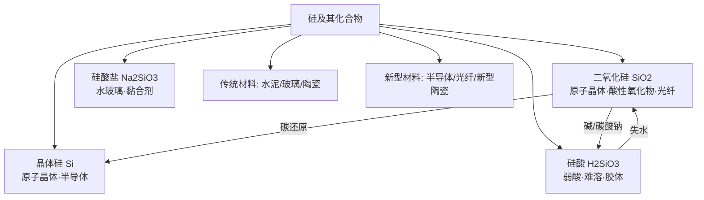

# 硅及其化合物总览

> [!abstract] 概览
> 硅是第 IVA 族的代表元素，地壳中含量**第二**（仅次于氧），主要以**化合态**存在。本章重点是：**晶体硅**（原子晶体、半导体、工业制硅）、**二氧化硅**（$\ce{SiO2}$ 的原子晶体结构、酸性氧化物通性与特性——与 $\ce{HF}$ 反应、与碱/$\ce{Na2CO3}$ 反应）以及**硅酸/硅酸盐**（水玻璃、水泥、玻璃、陶瓷）。硅及其化合物与"材料"联系紧密，是生产生活的考点。

## 知识网络

## 章节导航

| 笔记 | 内容要点 |
| --- | --- |
| [[12-硅及其化合物与非金属材料/01-硅单质与二氧化硅\|01-硅单质与二氧化硅]] | 晶体硅结构与性质、工业制硅、$\ce{SiO2}$ 结构/性质（$\ce{SiO2 + 4HF -> SiF4 + 2H2O}$）、用途 |
| [[12-硅及其化合物与非金属材料/02-硅酸盐与无机非金属材料\|02-硅酸盐与无机非金属材料]] | 硅酸钠、硅酸、硅酸盐组成表示、水泥/玻璃/陶瓷、新型材料 |

## 核心框架：硅的"结构—性质—用途"

| 物质 | 结构 | 性质 | 用途 |
| --- | --- | --- | --- |
| 晶体硅 $\ce{Si}$ | 原子晶体（$\ce{Si-Si}$ 共价键，正四面体） | 硬度大、熔点高；半导体性 | 芯片、太阳能电池、半导体器件 |
| 二氧化硅 $\ce{SiO2}$ | 原子晶体（$\ce{Si}$ 连 4 个 $\ce{O}$，$\ce{O}$ 连 2 个 $\ce{Si}$） | 熔点高、硬度大；酸性氧化物；与 $\ce{HF}$ 反应 | 光导纤维、石英玻璃 |
| 硅酸 $\ce{H2SiO3}$ | 不溶于水的弱酸 | 弱酸性、受热失水 | 硅胶（干燥剂）、催化剂载体 |
| 硅酸钠 $\ce{Na2SiO3}$ | 水溶液呈碱性 | 黏合、阻燃 | 水玻璃（黏合剂、防火剂） |

> [!important] 硅与非金属单质的主要不同
> - 碳、硅虽同族，但 **$\ce{SiO2}$ 是原子晶体**（熔点极高），而 $\ce{CO2}$ 是分子晶体（常温气态）。
> - 硅**没有"同素异形体"之丰富**（金刚石/石墨 vs 晶体硅）；碳可形成大量有机物，硅的氢化物（硅烷）不稳定。
> - 二氧化硅是酸性氧化物，但**不与水直接反应**，也不与盐酸、硝酸反应，只与 $\ce{HF}$ 及强碱、某些碱性氧化物/碳酸钠反应。

## 高考命题热点

1. **$\ce{SiO2}$ 与 $\ce{HF}$ 的反应**：$\ce{SiO2 + 4HF -> SiF4 ^ + 2H2O}$（刻蚀玻璃）。
2. **$\ce{SiO2}$ 的酸性氧化物通性**：与 $\ce{NaOH}$、$\ce{Na2CO3}$（高温）、$\ce{CaO}$ 反应。
3. **工业制硅**：$\ce{SiO2 + 2C ->[高温] Si + 2CO ^}$，及提纯过程。
4. **硅酸钠水溶液（水玻璃）**的性质与保存（不能盛于玻璃塞试剂瓶）。
5. **水泥、玻璃、陶瓷的原料与反应**（玻璃工业的两个重要反应）。
6. **新型无机非金属材料**：光导纤维（$\ce{SiO2}$）、半导体硅。

## 重要方程式汇总

| 反应 | 方程式 | 类型 |
| --- | --- | --- |
| 工业制粗硅 | $\ce{SiO2 + 2C ->[高温] Si + 2CO ^}$ | 还原 |
| 硅的提纯 | $\ce{Si + 2Cl2 ->[高温] SiCl4}$；$\ce{SiCl4 + 2H2 ->[高温] Si + 4HCl}$ | 化学提纯 |
| $\ce{SiO2}$ 与 $\ce{NaOH}$ | $\ce{SiO2 + 2NaOH -> Na2SiO3 + H2O}$ | 酸性氧化物 |
| $\ce{SiO2}$ 与 $\ce{HF}$ | $\ce{SiO2 + 4HF -> SiF4 ^ + 2H2O}$ | 特性（刻蚀玻璃） |
| $\ce{SiO2}$ 与 $\ce{Na2CO3}$ | $\ce{SiO2 + Na2CO3 ->[高温] Na2SiO3 + CO2 ^}$ | 玻璃工业 |
| 硅酸制备 | $\ce{Na2SiO3 + 2HCl -> H2SiO3 v + 2NaCl}$ | 强酸制弱酸 |
| 硅酸分解 | $\ce{H2SiO3 ->[Δ] SiO2 + H2O}$ | 不稳定性 |

## 常见易错点速记

> [!warning] 本章高频易错点
> 1. $\ce{SiO2}$ 是酸性氧化物，但**不与水反应**、不与盐酸/硝酸反应。
> 2. $\ce{SiO2}$ 只与 $\ce{HF}$ 反应：$\ce{SiO2 + 4HF -> SiF4 + 2H2O}$，$\ce{HF}$ 不能盛于玻璃容器。
> 3. 碱液（如 $\ce{NaOH}$）不能长期盛放于**玻璃塞**试剂瓶（$\ce{SiO2}$ 被腐蚀，瓶塞黏住）。
> 4. 光导纤维成分是 **$\ce{SiO2}$**，半导体/芯片用**晶体硅**，两者勿混。
> 5. 硅酸盐氧化物表示法只是"改写"，不代表真实组成（玻璃是混合物）。
> 6. 水玻璃是 $\ce{Na2SiO3}$ 的水溶液，属混合物；$\ce{H2SiO3}$ 的酸性弱于碳酸。

## 本章地位与衔接

- **前置基础**：物质分类（01）中的"氧化物/酸/盐"分类用于理解 $\ce{SiO2}$ 的酸性氧化物属性；元素周期表（09）中"同族元素性质递变"用于对比碳与硅。
- **横向对比**：$\ce{SiO2}$（原子晶体）vs $\ce{CO2}$（分子晶体）——结构决定性质；硅酸（弱酸）vs 碳酸；与硫（10）、氮（11）的氧化物对比。
- **后续延伸**：$\ce{SiO2}$ 的结构与性质在选必二"物质结构与性质"（21）中从晶体学角度深入；无机材料、光导纤维与科技前沿联系紧密。

## 学习建议

> [!tip] 学习方法
> - 对比学习：$\ce{CO2}$ 与 $\ce{SiO2}$（结构、溶解性、与碱反应、与 $\ce{HF}$ 反应）、金刚石与晶体硅（结构决定性质）。
> - 记住两条"反常"：$\ce{SiO2}$ 不与水反应、不与 $\ce{HCl/HNO3}$ 反应，但能与 $\ce{HF}$ 反应。
> - 玻璃/水泥/陶瓷三个工业的**原料**要分别记清，注意玻璃工业中 $\ce{Na2CO3}$、$\ce{CaCO3}$ 与 $\ce{SiO2}$ 的反应。
> - 与 $\ce{NaOH}$ 相关的"玻璃塞"问题，可结合 [[常见离子的检验方法]] 复习离子检验。

---
*返回 [[00-化学总览]]*
