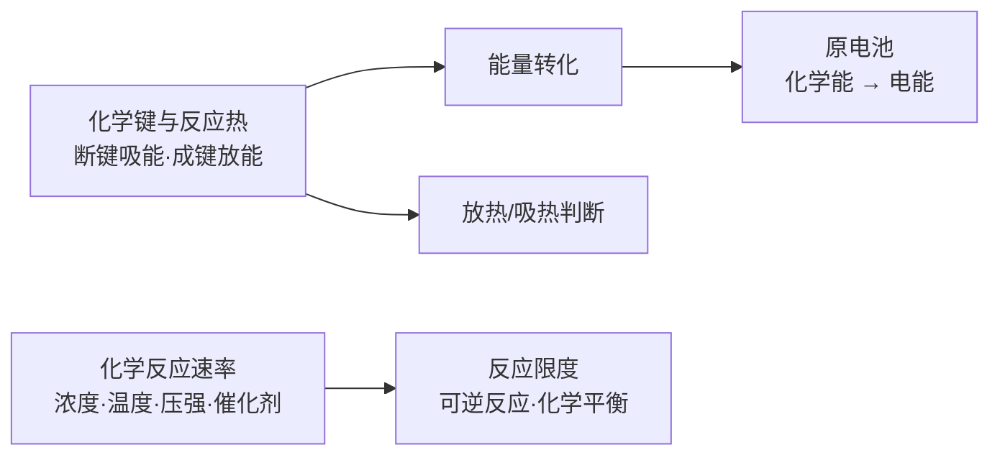

# 化学反应与能量总览

> [!abstract] 概览
> 本章是**人教版必修二（化学 2）**中从"物质怎么反应"深化到"反应为什么发生、进行得多快、能进行到什么程度"的章节。包含三大部分：**化学键与化学反应热**（能量视角：反应吸热还是放热）、**原电池与化学电池**（能量转化：化学能→电能）、**化学反应速率与限度**（动力学与平衡视角：反应快慢与反应限度）。
>
> 学习本章的核心线索是"**能量**"与"**限度**"两条主线：断键吸收能量、成键放出能量，能量差决定反应热；而反应能否进行、进行得多快、能进行到什么程度，则分别由能量、速率与平衡共同决定。本章知识是后续 [[00-化学总览]] 中选必一《化学反应原理》的热化学、电化学与化学平衡的入门基础。

## 学习地图

## 章节导航

| 笔记 | 主要内容 | 入口 |
| --- | --- | --- |
| 01 | 化学键与化学反应热：断键吸能、成键放能、放热/吸热判断、键能计算 | [[13-化学反应与能量必修二/01-化学键与化学反应热\|01-化学键与化学反应热]] |
| 02 | 原电池与化学电池：原电池原理、电极判断、电子流向与离子迁移、常见电池 | [[13-化学反应与能量必修二/02-原电池与化学电池\|02-原电池与化学电池]] |
| 03 | 化学反应速率与限度：速率概念与影响因素、可逆反应与化学平衡 | [[13-化学反应与能量必修二/03-化学反应速率与限度\|03-化学反应速率与限度]] |

## 核心概念

### 1. 能量主线：化学键与反应热

- 化学反应的本质是**旧化学键断裂**与**新化学键形成**。
- 断键**吸收**能量，成键**放出**能量；两者之差即反应的**能量变化**（反应热）。
- 放热反应 $\Delta H < 0$；吸热反应 $\Delta H > 0$。
- 反应热的大小可由**键能**计算：$\Delta H$ = 反应物键能总和 − 生成物键能总和。

### 2. 能量转化：原电池

- 原电池把**化学能**转化为**电能**，前提是发生**自发的氧化还原反应**。
- 负极发生**氧化反应、失电子**；正极发生**还原反应、得电子**（"负氧正还"）。
- 电子由负极经外电路流向正极；电解质溶液中阳离子向**正极**迁移、阴离子向**负极**迁移。

### 3. 动力学与平衡：速率与限度

- 化学反应速率表示反应进行的**快慢**，受浓度、温度、压强、催化剂、接触面积等因素影响。
- 可逆反应存在**限度**，达到**化学平衡**时正、逆反应速率相等，各物质浓度不再改变。

## 重点知识概览

### 放热反应与吸热反应（常见例子）

| 类型 | 判断 | 常见例子 |
| --- | --- | --- |
| 放热反应 | 反应物总能量 > 生成物总能量，$\Delta H < 0$ | 燃烧、中和反应、金属与酸反应、大多数化合反应、铝热反应 |
| 吸热反应 | 反应物总能量 < 生成物总能量，$\Delta H > 0$ | 大多数分解反应、$\ce{C + CO2 ->[高温] 2CO}$、$\ce{Ba(OH)2·8H2O + 2NH4Cl}$、碳与水的反应 |

### 原电池核心规律

- **负极**（较活泼金属）：$\ce{M - ne- -> M^{n+}}$，失电子，被氧化。
- **正极**（较不活泼金属或非金属导体）：阳离子（或 $\ce{O2}$）得电子，被还原。
- 电子流向：负极 → 外电路 → 正极；电流方向与之相反。
- 离子迁移：阳离子 → 正极；阴离子 → 负极。

### 影响反应速率的因素

- **内因**（决定因素）：反应物本身的性质。
- **外因**：浓度（增大加快）、温度（升高加快）、压强（对有气体参与的反应，增大加快）、催化剂（加快）、接触面积（增大加快）。

### 化学平衡标志（以 $\ce{N2 + 3H2 <=> 2NH3}$ 为例）

- $v_{正} = v_{逆}$（本质标志）。
- 各组分浓度、百分含量**保持不变**。
- 恒容时：混合气体总压强、平均摩尔质量不再改变（适用于 $\Delta n_{气} \neq 0$ 的反应）。

## 知识网络与学习建议

### 本章知识主线

1. **能量主线**：化学键断裂吸收能量 → 反应吸热/放热 → 能量可转化为电能（原电池）。
2. **动力学主线**：化学反应速率描述快慢 → 受浓度、温度、压强、催化剂、接触面积影响。
3. **限度主线**：可逆反应存在限度 → 化学平衡是动态平衡（$v_{正} = v_{逆}$）。

### 放热/吸热反应速记表

| 类型 | 常考标志反应 |
| --- | --- |
| 放热 | 燃烧、中和、活泼金属与酸、多数化合反应、铝热反应 |
| 吸热 | $\ce{C + CO2 ->[高温] 2CO}$、$\ce{Ba(OH)2·8H2O}$ 与 $\ce{NH4Cl}$、多数分解反应 |

### 原电池"四句话"

1. 负极氧化失电子；
2. 正极还原得电子；
3. 电子走外电路（负极→正极）；
4. 阳离子向正极、阴离子向负极。

### 平衡判断"两步走"

1. 看本质：同一物质 $v_{正} = v_{逆}$；
2. 看标志：能随反应变化的量不再改变（浓度、压强、平均摩尔质量等）。

### 学习建议

- 以"方程式"为载体：把每类反应（放热、吸热、电极反应、速率影响）的化学方程式写熟。
- 善用对比：放热 vs 吸热、负极 vs 正极、取代 vs 加成、盐析 vs 变性等，用表格对比记忆。
- 结合生活：电池、能源、有机食品等生活实例有助于理解抽象概念。

> [!tip] 后续衔接
> 本章的"能量、速率、限度"在选必一中系统化为热化学、化学反应速率与化学平衡，学习时打好基础可事半功倍。

## 易错提醒

> [!warning] 本章常见误区
> - 误以为"断键放出能量"❌ —— 断裂化学键需要**吸收**能量，形成化学键才**放出**能量。
> - 误以为"吸热反应一定需要加热才能发生"❌ —— 许多吸热反应（如 $\ce{Ba(OH)2·8H2O}$ 与 $\ce{NH4Cl}$ 的反应）在常温下即可进行。
> - 在原电池中误以为"阳离子移向负极"❌ —— 电解质溶液中阳离子移向**正极**（得电子的电极）。
> - 误以为"催化剂改变平衡位置或转化率"❌ —— 催化剂只改变达到平衡所需的时间，不改变平衡状态。
> - 误以为"单位时间内反应消耗量等于生成量就平衡"❌ —— 必须结合化学计量数判断正、逆速率是否真正相等。

## 与其他知识关联

- [[00-化学总览]]：本章属于必修二（化学 2）的核心章节，是选必一《化学反应原理》热化学、电化学、化学平衡的入门。
- [[燃烧热的计算]]：反应热的定量计算延伸，与本笔记 01 节的键能计算互补。
- [[化学反应平衡移动的影响因素]]：本章"反应限度"的深化，系统讲解勒夏特列原理与平衡移动。
- [[杂化轨道理论]]：从微观角度解释甲烷、乙烯等分子结构，可与有机部分配合学习。
- [[化学错题整理]]：可把本章易错点（原电池判断、吸放热判断）整理进错题本。

---
*返回 [[00-化学总览]]*
