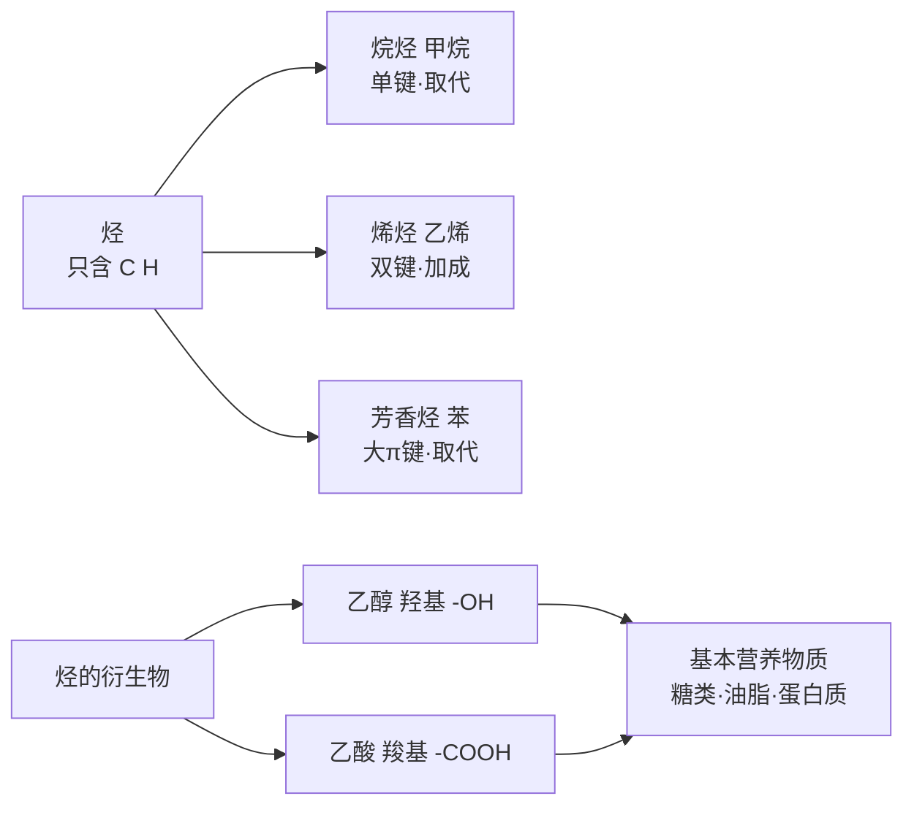
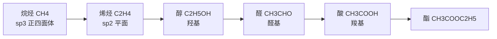

# 有机化合物总览

> [!abstract] 概览
> 本章是**人教版必修二（化学 2）**中有机化学的入门章节，从最简单的有机物——**甲烷**出发，认识**烷烃、烯烃、芳香烃**三大类烃，再学习**乙醇、乙酸**两类烃的衍生物，最后了解**糖类、油脂、蛋白质**等基本营养物质。全章贯穿"**结构决定性质、官能团决定化学特性**"的核心思想。
>
> 学习本章要抓住两条主线：一是**碳原子的成键特点**（碳原子可形成单键、双键、三键，可连成链状或环状）决定了有机物的多样性；二是**官能团**决定了化学性质（双键易加成、羟基/羧基参与特定反应）。

## 学习地图

## 章节导航

| 笔记 | 主要内容 | 入口 |
| --- | --- | --- |
| 01 | 甲烷与烷烃：正四面体结构、取代反应、烷烃通式 | [[14-有机化合物必修二/01-甲烷与烷烃\|01-甲烷与烷烃]] |
| 02 | 乙烯与烯烃：平面结构、加成反应、加聚反应 | [[14-有机化合物必修二/02-乙烯与烯烃\|02-乙烯与烯烃]] |
| 03 | 苯与芳香烃：平面正六边形、苯的取代反应 | [[14-有机化合物必修二/03-苯与芳香烃\|03-苯与芳香烃]] |
| 04 | 乙醇与乙酸：羟基与羧基、酯化反应 | [[14-有机化合物必修二/04-乙醇与乙酸\|04-乙醇与乙酸]] |
| 05 | 基本营养物质：糖类、油脂、蛋白质 | [[14-有机化合物必修二/05-基本营养物质\|05-基本营养物质]] |
| 06 | 同系物与同分异构体：概念辨析与书写 | [[14-有机化合物必修二/06-同系物与同分异构体\|06-同系物与同分异构体]] |

## 核心概念

### 1. 有机物的特点

- 含碳化合物（但 $\ce{CO}$、$\ce{CO2}$、碳酸盐等无机物除外）。
- 数目庞大、种类繁多：碳原子可与其他原子形成**稳定共价键**，且碳链可长可短、可直可环。
- 多数有机物：易燃、熔沸点低、难溶于水（但乙醇、乙酸、葡萄糖等溶于水）、反应慢且复杂、常伴随副反应。

### 2. 烃的分类

| 类别 | 代表物 | 结构特征 | 典型反应 |
| --- | --- | --- | --- |
| 烷烃 | 甲烷 $\ce{CH4}$ | 只含 $\ce{C-C}$、$\ce{C-H}$ 单键 | 取代反应 |
| 烯烃 | 乙烯 $\ce{CH2=CH2}$ | 含 $\ce{C=C}$ 双键 | 加成反应、氧化反应 |
| 芳香烃 | 苯 $\ce{C6H6}$ | 苯环大π键 | 取代反应（硝化、卤代） |

### 3. 官能团决定性质

- 乙烯的官能团是**碳碳双键**（易加成、易被氧化）。
- 乙醇的官能团是**羟基**（－OH，与钠反应、催化氧化）。
- 乙酸的官能团是**羧基**（－COOH，显酸性、可酯化）。

## 重点知识概览

### 有机反应"三兄弟"

| 反应类型 | 定义 | 代表反应 |
| --- | --- | --- |
| 取代反应 | 有机物分子中某原子/原子团被其他原子/原子团**替代** | $\ce{CH4 + Cl2 ->[光照] CH3Cl + HCl}$ |
| 加成反应 | 不饱和键断开，其他原子/原子团**直接结合** | $\ce{CH2=CH2 + Br2 -> CH2BrCH2Br}$ |
| 酯化反应 | 酸与醇生成酯和水的**取代**反应 | $\ce{CH3COOH + C2H5OH <=>[浓H2SO4,Δ] CH3COOC2H5 + H2O}$ |

### 空间结构记忆

- 甲烷：**正四面体**，键角 $109^\circ 28'$。
- 乙烯：**平面结构**，六个原子共面。
- 苯：**平面正六边形**，十二个原子共面，碳碳键介于单、双键之间。

## 知识网络与学习建议

### 有机化学的学习主线

1. **结构主线**：碳原子的成键特点（四价、可成单/双/三键、可成链/环）决定有机物种类繁多。
2. **官能团主线**：官能团决定化学性质——双键（加成、氧化）、羟基（与钠反应、氧化）、羧基（酸性、酯化）。
3. **反应类型主线**：取代、加成、加聚、酯化等反应类型是书写方程式的"工具箱"。

### 烃与烃的衍生物关系

（乙烯→乙醇→乙醛→乙酸→乙酸乙酯，是必修二最重要的"转化链"。）

### 常见官能团及其性质速记

| 官能团 | 代表物 | 典型性质 |
| --- | --- | --- |
| $\ce{C=C}$ 碳碳双键 | 乙烯 | 加成（溴水褪色）、氧化（高锰酸钾褪色）、加聚 |
| $\ce{-OH}$ 羟基 | 乙醇 | 与钠反应、催化氧化成乙醛 |
| $\ce{-COOH}$ 羧基 | 乙酸 | 酸性（强于碳酸）、酯化反应 |

### 学习方法建议

- 抓住"结构—性质—用途"三位一体，学新物质先画结构简式，再推性质。
- 方程式按"反应类型"归类记忆，如把 $\ce{CH4}$ 的取代、$\ce{CH2=CH2}$ 的加成、酯化反应放一起对比。
- 多写结构简式，注意碳原子四价、氢原子数是否正确。

> [!tip] 与生活联系
> 有机物就在身边：天然气（甲烷）、塑料（聚乙烯）、酒（乙醇）、醋（乙酸）、水果催熟（乙烯），学习时可联想生活场景加深印象。

## 易错提醒

> [!warning] 本章常见误区
> - 误以为"有机物都能燃烧生成 $\ce{CO2}$ 和 $\ce{H2O}$"❌ —— 多数有机物可燃，但含氯有机物燃烧产物复杂。
> - 误以为"苯使溴水/酸性高锰酸钾褪色是因为含双键"❌ —— 苯中无典型碳碳双键，不能使溴水、酸性高锰酸钾褪色。
> - 误以为"乙醇与钠反应是置换反应且生成 $\ce{NaOH}$"❌ —— 生成乙醇钠 $\ce{CH3CH2ONa}$ 和 $\ce{H2}$。
> - 误以为"酯化反应中浓硫酸只作催化剂"❌ —— 浓硫酸还起**吸水剂**作用，促进平衡正向移动。
> - 误以为"凡是含 $\ce{C}$、$\ce{H}$ 的都是烃"❌ —— 烃只含 C、H 两种元素，含 O、N 等元素的是烃的衍生物。

## 与其他知识关联

- [[00-化学总览]]：本部分是选必三《有机化学基础》的入门，后续会系统学习命名、反应类型与有机合成。
- [[杂化轨道理论]]：甲烷（$\ce{sp^3}$）、乙烯（$\ce{sp^2}$）、苯（$\ce{sp^2}$）的空间结构可用杂化理论解释。
- [[多晶型、手性与同分异构体]]：同分异构体概念的深化（手性异构等）。
- [[00-有机化合物总览]]：本总览即本章入口。

---
*返回 [[00-化学总览]]*
