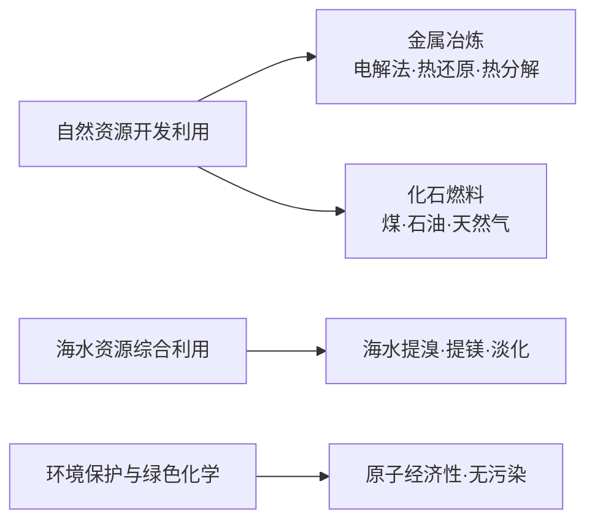

# 化学与可持续发展总览

> [!abstract] 概览
> 本章是**人教版必修二（化学 2）**的收尾章节，关注化学在**资源利用**与**环境保护**中的作用，体现"化学让生活更美好、让发展可持续"的理念。内容包括**自然资源的开发利用**（金属冶炼、煤石油天然气）、**海水资源的综合利用**（海水提溴、提镁、淡化）、**环境保护与绿色化学**（原子经济性、绿色化学原理）。
>
> 学习本章要抓住"**转化**"主线：把天然资源（矿石、煤、石油、海水）通过化学方法转化为可用的材料与能源，同时尽量减少对环境的破坏。化学方程式与流程分析是本章考查重点。

## 学习地图

## 章节导航

| 笔记 | 主要内容 | 入口 |
| --- | --- | --- |
| 01 | 自然资源的开发利用：金属冶炼方法、煤/石油/天然气的综合利用 | [[15-化学与可持续发展/01-自然资源的开发利用\|01-自然资源的开发利用]] |
| 02 | 海水资源的综合利用：海水提溴、提镁、海水淡化 | [[15-化学与可持续发展/02-海水资源的综合利用\|02-海水资源的综合利用]] |
| 03 | 环境保护与绿色化学：环境污染、原子经济性、绿色化学原理 | [[15-化学与可持续发展/03-环境保护与绿色化学\|03-环境保护与绿色化学]] |

## 核心概念

### 1. 金属冶炼的一般思路

- 金属在自然界中多以**化合态**存在（化合态/游离态）。
- 冶炼实质：把金属阳离子还原为金属单质，即 $\ce{M^{n+} + ne- -> M}$。
- 依据金属活动性顺序选择冶炼方法：
  - **电解法**：$\ce{K}$、$\ce{Ca}$、$\ce{Na}$、$\ce{Mg}$、$\ce{Al}$（很活泼金属，如电解熔融 $\ce{Al2O3}$、$\ce{MgCl2}$）。
  - **热还原法**：$\ce{Zn}$、$\ce{Fe}$、$\ce{Cu}$（用 $\ce{C}$、$\ce{CO}$、$\ce{H2}$、$\ce{Al}$ 等还原）。
  - **热分解法**：$\ce{Hg}$、$\ce{Ag}$（受热分解其氧化物）。

### 2. 化石燃料的综合利用

- **煤**：干馏（隔绝空气加热，化学变化）、气化、液化。
- **石油**：分馏（物理变化，利用沸点差异）、裂化、裂解。
- **天然气**：主要成分是甲烷 $\ce{CH4}$，是清洁能源。

### 3. 海水资源的综合利用

- 海水提溴：$\ce{Cl2}$ 氧化 $\ce{Br-}$ → 热空气吹出 → 还原吸收 → 再氧化富集。
- 海水提镁：石灰乳沉淀 $\ce{Mg(OH)2}$ → 加盐酸得 $\ce{MgCl2}$ → 电解熔融 $\ce{MgCl2}$。
- 海水淡化：蒸馏法、膜法（反渗透）等。

### 4. 绿色化学

- 核心思想：**原子经济性**——反应物中的原子全部转化为期望产物，实现"零排放"。
- 原子利用率 = $\dfrac{\text{期望产物的质量}}{\text{生成物总质量}} \times 100\%$。
- 理想反应（加成反应、化合反应）原子利用率可达 100%。

## 重点知识概览

### 金属冶炼方法与活动性对照

| 金属活动性 | 冶炼方法 | 实例 |
| --- | --- | --- |
| $\ce{K}$、$\ce{Na}$、$\ce{Mg}$、$\ce{Al}$ | 电解法 | 电解熔融 $\ce{NaCl}$、$\ce{MgCl2}$、$\ce{Al2O3}$ |
| $\ce{Zn}$、$\ce{Fe}$、$\ce{Sn}$、$\ce{Pb}$、$\ce{Cu}$ | 热还原法 | $\ce{Fe2O3 + 3CO ->[高温] 2Fe + 3CO2}$ |
| $\ce{Hg}$、$\ce{Ag}$ | 热分解法 | $\ce{2HgO ->[Δ] 2Hg + O2 ^}$ |

### 海水提溴核心反应

$$\ce{Cl2 + 2NaBr -> 2NaCl + Br2}$$

### 绿色化学原子经济性示例

加成反应、化合反应、加聚反应往往原子利用率高，属于绿色化学青睐的反应类型。

## 知识网络与学习建议

### 本章知识主线

1. **资源线**：金属矿物（冶炼）→ 化石燃料（煤、石油、天然气）→ 海水资源（提溴、提镁、淡化）。
2. **方法线**：分离提纯（分馏、过滤、结晶、蒸馏）与化学转化（氧化、还原、电解）。
3. **理念线**：合理利用资源 + 保护环境 = 可持续发展；绿色化学强调源头预防与原子经济性。

### 核心化学方程式速记

| 场景 | 反应 |
| --- | --- |
| 炼铁 | $\ce{Fe2O3 + 3CO ->[高温] 2Fe + 3CO2}$ |
| 电解炼镁 | $\ce{MgCl2 ->[电解] Mg + Cl2 ^}$ |
| 海水提溴 | $\ce{Cl2 + 2NaBr -> 2NaCl + Br2}$ |
| 石油分馏 | 物理变化（按沸点分离） |
| 煤干馏 | 化学变化（隔绝空气加热分解） |

### 金属冶炼方法选择口诀

"钾钙钠镁铝，电解来冶炼；锌铁锡铅铜，热还原法用；汞银氧化物，加热就能得。"

### 学习建议

- 本章是元素化合物与氧化还原知识的综合应用，复习时把必修一的金属、非金属性质结合进来。
- 流程题（提溴、提镁）要抓住"每个步骤的目的"，如富集、除杂、防副反应。
- 绿色化学与原子利用率是高频概念题，务必理解"原子经济性"与"产率"的区别。

> [!tip] 学科价值
> 化学不是污染的来源，而是解决环境问题的钥匙——通过原子经济性设计、清洁能源开发，化学能让发展更可持续。

## 易错提醒

> [!warning] 本章常见误区
> - "金属冶炼都是热还原法"❌ —— 活泼金属（$\ce{K}$–$\ce{Al}$）用电解法，不活泼金属（$\ce{Hg}$、$\ce{Ag}$）用热分解法。
> - "石油分馏是化学变化"❌ —— 分馏是利用沸点差的**物理变化**；裂化、裂解才是化学变化。
> - "煤的干馏是物理变化"❌ —— 干馏是隔绝空气加热的**化学变化**。
> - "海水提溴直接蒸馏海水得到溴"❌ —— 溴离子浓度太低，需先氧化、吹出、富集。
> - "绿色化学 = 治理污染"❌ —— 绿色化学强调**源头预防**（原子经济性），而不是先污染后治理。

## 与其他知识关联

- [[00-化学总览]]：本章是必修二的收尾，综合运用氧化还原、元素化合物等知识。
- [[侯氏制碱法1]]、[[侯氏制碱法2]]：我国化工生产的经典案例，体现资源综合利用。
- [[10-硫及其化合物/00-硫及其化合物总览\|硫及其化合物]]：煤、石油中含硫，燃烧产生 $\ce{SO2}$ 导致酸雨（与环境保护相关）。
- [[00-化学与可持续发展总览]]：本总览即本章入口。

---
*返回 [[00-化学总览]]*
