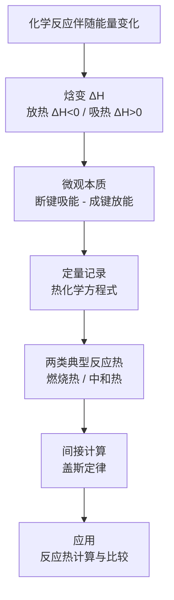

# 化学反应热效应总览

> [!abstract] 概览
> 本章是**选必一（化学反应原理）**的起点，把必修二中"化学反应伴随能量变化"的定性认识升级为**定量描述**：用**焓变 $\Delta H$** 定量表示反应热，用**热化学方程式**记录能量变化，用**燃烧热、中和热**刻画两类典型反应热，最后用**盖斯定律**实现反应热的间接计算。
>
> 核心问题只有一个：**一个化学反应吸收或放出多少热量，怎样书写、怎样计算？** 所有知识点都围绕"焓变 $\Delta H$ 的符号、数值、书写与计算"展开。

## 知识点列表

| 编号 | 笔记 | 核心内容 |
| --- | --- | --- |
| 01 | [[01-反应热与焓变]] | 反应热、放热/吸热、焓变 $\Delta H$ 的符号与意义、断键成键的微观解释、中和热测定实验 |
| 02 | [[02-热化学方程式与燃烧热]] | 热化学方程式书写规范、燃烧热定义、中和热定义与测定 |
| 03 | [[03-盖斯定律与反应热计算]] | 盖斯定律内容、叠加法、生成焓法、键能法、反应热计算综合 |

## 核心框架

## 本章主线

- **一条主线**：能量守恒。反应热 = 产物总能量 - 反应物总能量（宏观），也 = 断键吸收能量 - 成键放出能量（微观）。
- **一个定律**：盖斯定律（焓是状态函数，反应热与路径无关）——这是反应热计算的"万能钥匙"。
- **两种特殊反应热**：燃烧热（1 mol 燃料完全燃烧）与中和热（生成 1 mol 液态水），注意它们的前提条件与指定产物。

## 与其他知识关联

- 本章承接必修二"化学键与化学反应能量"的定性认识，并与选必一的[[00-化学总览|化学总览]]体系衔接。
- [[03-盖斯定律与反应热计算]] 与根目录的[[燃烧热的计算]]互为补充，后者给出了标准生成焓表的通用算法。
- 反应热的符号与热化学方程式书写，是后面[[00-化学平衡总览|化学平衡]]中"升温使平衡向吸热方向移动"的判断基础。

## 学习建议

> [!tip] 学习顺序
> 先建立 $\Delta H$ 的**符号直觉**（放热为负、吸热为正），再掌握热化学方程式的**书写规范**（状态、系数、单位），最后用盖斯定律反复练习计算。高考对本章的考查高度集中于"**给定几个反应求目标反应焓变**"，务必熟练叠加法。

> [!note] 与必修二的衔接
> 若对"化学键断裂吸热、形成放热"还不熟悉，建议先复习必修二"化学反应与能量"章节，再进入本部分。

---
*返回 [[00-化学总览]]*
