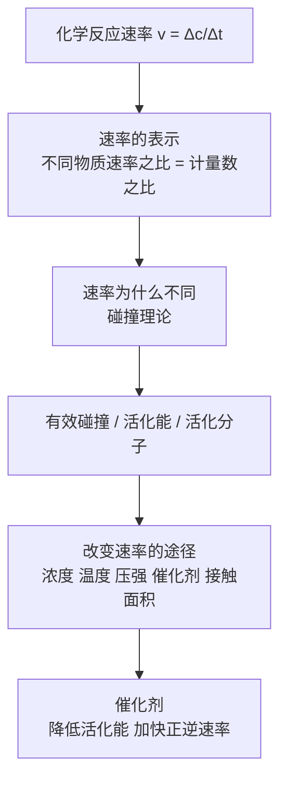

# 化学反应速率总览

> [!abstract] 概览
> 本章研究"**化学反应快不快、为什么快、怎么加快**"。核心概念是化学反应速率 $v = \dfrac{\Delta c}{\Delta t}$，核心方法是碰撞理论，核心应用是分析浓度、温度、压强、催化剂等对速率的影响。如果说热化学回答"反应放多少热"，速率就回答"反应进行得多快"。

## 知识点列表

| 编号 | 笔记 | 核心内容 |
| --- | --- | --- |
| 01 | [[01-化学反应速率概念与计算]] | 速率定义 $v=\Delta c/\Delta t$、单位、平均/瞬时速率、同一反应速率之比 = 化学计量数之比 |
| 02 | [[02-影响化学反应速率的因素]] | 内因（物质本性）、外因（浓度、温度、压强、催化剂、接触面积）对速率的影响 |
| 03 | [[03-碰撞理论活化能与催化剂]] | 有效碰撞、活化能、活化分子、基元反应、催化剂降低活化能的机理 |

## 核心框架

## 本章主线

- **一个公式**：$v = \dfrac{\Delta c}{\Delta t}$，注意平均速率、同一反应速率表示的可换算性。
- **一个理论**：碰撞理论。速率快慢由**单位体积内活化分子数**和**单位时间碰撞次数**（有效碰撞频率）决定。
- **一个核心应用**：浓度（增大单位体积活化分子数）、温度（增大活化分子百分数）、催化剂（降低活化能）、压强（对气体等效于改变浓度）、接触面积（增大碰撞概率）。

## 与其他知识关联

- 本章承接必修二"化学反应速率"的定性认识，是选必一[[00-化学平衡总览|化学平衡]]的动力学基础——平衡研究"进行到什么程度"，速率研究"进行得多快"。
- 碰撞理论与活化能概念，为解释 [[03-勒夏特列原理与平衡移动|化学平衡移动]] 中"催化剂不移动平衡、只缩短达平衡时间"提供微观依据。
- 速率方程 $v = k[A]^m[B]^n$（基元反应）与 [[02-化学平衡常数|化学平衡常数]] 的表达式形式相似，注意区分速率常数 $k$ 与平衡常数 $K$。

## 学习建议

> [!tip] 学习顺序
> 先掌握速率的**表示与换算**（01），再记忆影响因素的**定性规律**（02），最后用碰撞理论**解释**这些规律（03）。高考常以"曲线变化判断""表格数据处理""解释速率差异"为考查形式。

> [!note] 与后续章节的衔接
> 速率曲线（v-t 图）是判断平衡移动方向的工具，学习本章 01 时要熟悉"速率随条件改变的瞬间变化"的画法，为 [[04-等效平衡与平衡图像|平衡图像]] 打基础。

---
*返回 [[00-化学总览]]*
