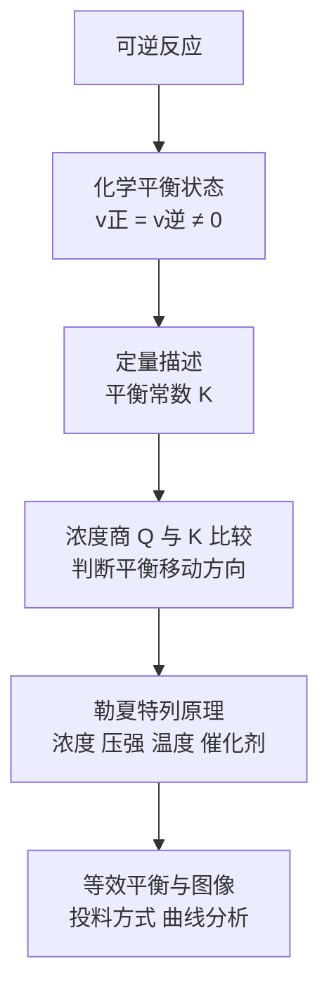

# 化学平衡总览

> [!abstract] 概览
> 本章研究"**一个可逆反应进行到什么程度、如何定量描述、如何人为调控**"。核心概念是**化学平衡状态**（$v_\text{正} = v_\text{逆} \neq 0$）与**化学平衡常数 $K$**（反应限度的定量标尺），核心规律是**勒夏特列原理**（平衡移动方向），核心技巧是**等效平衡**与**平衡图像**分析。这是选必一的理论核心，也是高考计算与图像题的重灾区。

## 知识点列表

| 编号 | 笔记 | 核心内容 |
| --- | --- | --- |
| 01 | [[01-化学平衡状态]] | 可逆反应、平衡状态定义与特征、平衡标志的判断 |
| 02 | [[02-化学平衡常数]] | $K$ 的定义与表达式、$K$ 只随温度变化、$Q$ 与 $K$ 比较、平衡转化率、三段式计算 |
| 03 | [[03-勒夏特列原理与平衡移动]] | 勒夏特列原理、浓度/压强/温度/催化剂对平衡的影响、惰性气体 |
| 04 | [[04-等效平衡与平衡图像]] | 等效平衡的三种类型、v-t/c-t/转化率曲线、"先拐先平"技巧 |

## 核心框架

## 本章主线

- **一个状态**：化学平衡是**动态平衡**——$v_\text{正} = v_\text{逆} \neq 0$，各物质浓度不再改变，但反应仍在进行。
- **一把尺子**：平衡常数 $K$ 只随温度变化，是判断反应限度的唯一定量标准；浓度商 $Q$ 与 $K$ 比较决定平衡移动方向。
- **一个原理**：勒夏特列原理——"改变影响平衡的一个条件，平衡向减弱这种改变的方向移动"，注意"减弱"不等于"消除"。
- **一类技巧**：等效平衡（投料方式换算）与平衡图像（v-t、c-t、转化率曲线）。

## 与其他知识关联

- 本章建立在 [[00-化学反应速率总览|化学反应速率]] 的基础上：$v_\text{正} = v_\text{逆}$ 是平衡的本质，速率变化曲线是判断平衡移动的工具。
- 平衡常数 $K$ 与 [[01-反应热与焓变|焓变 $\Delta H$]] 结合：温度改变 $K$ 的方向由吸放热决定（放热升温 $K$ 减小）。
- 根目录[[化学反应平衡移动的影响因素]]与本笔记 03 互为补充，后者更侧重综合应用的 $Q$ 与 $K$ 判定。
- 本章方法（三段式、$K$ 表达式）将延伸到选必一"水溶液中的离子平衡"（电离平衡、水解平衡与沉淀溶解平衡），可参阅 [[00-化学总览]] 中的章节导航。

## 学习建议

> [!tip] 学习顺序
> 先明确"什么是平衡状态、怎么判断"（01），再掌握 $K$ 的表达式与计算（02），然后理解勒夏特列原理的定性判断（03），最后攻克等效平衡与图像（04）。计算题务必熟练"起始-变化-平衡"三段式。

> [!note] 高考考向
> 高考常在**化学平衡常数计算**与**平衡图像**中设置区分度，需把 $K$、$Q$、转化率、平均摩尔质量等量结合起来，注意恒容/恒压、气体计量数等条件。

---
*返回 [[00-化学总览]]*
