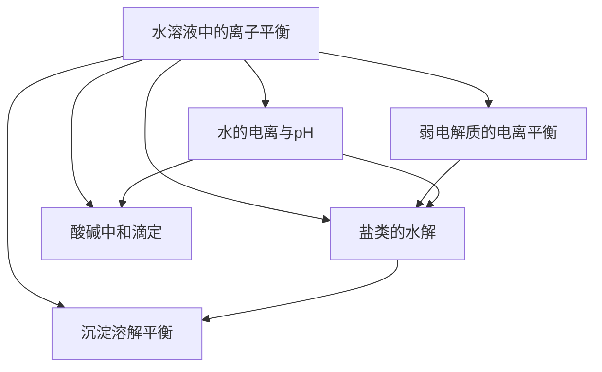

# 水溶液中的离子平衡总览

> [!abstract] 概览
> 本章（人教版选择性必修一第三章）研究**水溶液中离子的平衡体系**，是高中化学"化学平衡"理论在溶液体系中的系统应用。核心思路是：**弱电解质的电离、水的电离、盐类的水解、难溶电解质的沉淀溶解**四种平衡相互制约、共同存在于同一溶液中，一切判断都归结为比较**平衡常数**与**浓度商**（或离子积）的大小。
>
> 全章按"**一种平衡（电离）→ 溶剂自身的平衡（水的电离）→ 电离的逆过程（水解）→ 固液平衡（沉淀溶解）→ 定量测定（滴定）**"的逻辑展开，五个知识点层层递进。难点集中在**离子浓度大小比较**与**三大守恒关系式**的书写，这两类题型高考必考、失分率极高。

## 核心框架

## 知识点导航

| 编号 | 笔记 | 核心内容 |
| --- | --- | --- |
| 01 | [[01-电离平衡与弱电解质]] | 强弱电解质、电离度、$K_a/K_b$、同离子效应、稀释定律 |
| 02 | [[02-水的电离与pH]] | $K_w$ 的温度依赖、$pH$ 定义与计算、酸碱混合、稀释 |
| 03 | [[03-盐类的水解]] | "谁弱谁水解"规律、水解方程式、三大守恒、离子浓度比较 |
| 04 | [[04-沉淀溶解平衡]] | $K_{sp}$、$Q$ 与 $K_{sp}$、沉淀转化、分步沉淀 |
| 05 | [[05-酸碱中和滴定]] | 滴定原理、指示剂选择、滴定曲线、误差分析 |

## 知识主线

- **平衡本源**：弱电解质的电离平衡（$K_a/K_b$）与盐类的水解平衡本质上是同一个平衡的两个方向——电离是"弱酸/弱碱 + 水"方向，水解是"盐的离子 + 水"方向。凡是会电离（或会水解）的粒子，其浓度变化都遵循"**先看能否反应，再看平衡移动**"。
- **定量的核心**：四个常数——水的离子积 $K_w$、电离常数 $K_a/K_b$、水解常数 $K_h$、溶度积 $K_{sp}$——都是温度的函数。通过它们可以把"定性判断"升华为"定量计算"。
- **比较的抓手**：离子浓度大小比较的通用步骤是：①写出溶液中存在的全部粒子；②判断水解与电离的相对强弱；③写出三大守恒关系式（电荷守恒、物料守恒、质子守恒）；④结合具体浓度关系逐一排序。

## 学习建议

> [!tip] 学习方法
> 1. 先把 [[01-电离平衡与弱电解质]] 中的 $K_a$、电离度、稀释规律吃透，因为它是水解、滴定计算的底层工具；
> 2. 学 [[03-盐类的水解]] 时，重点练"**三大守恒关系式**"的书写——这是全章最值分的题型；
> 3. 学 [[04-沉淀溶解平衡]] 时，把所有判断统一到"$Q$ 与 $K_{sp}$ 比较"这一条主线上；
> 4. 学 [[05-酸碱中和滴定]] 时，把"指示剂变色范围"与"pH 突跃"结合理解，误差分析要分清"测量结果偏高/偏低"。

> [!note] 与其他知识的关系
> 本套平衡思想与 [[化学反应平衡移动的影响因素]] 一脉相承：电离平衡、水解平衡、沉淀溶解平衡都是化学平衡，都服从勒夏特列原理。电解质概念与电离方程式可参考根目录 [[一、物质的分类及转化1.电解质与电离方程式]]；溶液中的离子检验可参考 [[常见离子的检验方法]]。

## 易错总提示

> [!warning] 全章高频失分点
> - **$K_w$ 只看温度**：任何水溶液中（包括酸、碱、盐溶液）$K_w$ 都只随温度变化，酸碱稀释不能改变 $K_w$。
> - **"强酸强碱"没有水解**：只有弱离子的盐才水解，$Cl^-$、$Na^+$、$NO_3^-$ 等强离子既不水解也不水解促电离。
> - **水解方程式一般写可逆符号**：只有完全双水解（如 $Al^{3+}$ 与 $CO_3^{2-}$）才写"$=$"并打气体/沉淀箭头。
> - **比较离子浓度先定主次**：盐溶液中"未水解的离子"通常最多，"水解产生的 $H^+/OH^-$"最少，切勿把数量级颠倒。

---
*返回 [[00-化学总览]]*
