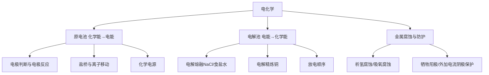

# 电化学总览

> [!abstract] 概览
> 本章（人教版选择性必修一第四章）研究**化学能与电能的相互转化**：**原电池**把化学能转化为电能，**电解池**把电能转化为化学能，两者合称"两池"。核心主线是"**氧化还原反应 + 电子转移方向 + 离子移动方向**"。金属腐蚀的本质是自发进行的原电池反应（微电池），防护则反其道而行——让金属作阴极或作原电池正极。
>
> 全章按"**原电池 → 化学电源 → 电解池 → 金属腐蚀与防护**"展开。书写电极反应式（配平、介质参与）与判断电极名称是全章的重难点，贯穿始终的分析工具是"**负极（阳极）氧化、正极（阴极）还原**"。

## 核心框架

## 知识点导航

| 编号 | 笔记 | 核心内容 |
| --- | --- | --- |
| 01 | [[01-原电池]] | 原电池原理、电极判断、电极反应书写、盐桥、化学电源 |
| 02 | [[02-电解池]] | 电解原理、电解熔融 NaCl/食盐水/精炼铜、放电顺序 |
| 03 | [[03-金属腐蚀与防护]] | 析氢腐蚀、吸氧腐蚀、牺牲阳极保护、外加电流阴极保护 |

## 知识主线

- **电子流向决定一切**：原电池中电子从**负极**流出、经外电路回到**正极**；电解池中电子从**电源负极**流出到阴极，从阳极流回电源正极。记住"**负极失电子、阳极失电子**"。
- **离子移动方向**：溶液中阳离子移向"**得电子的一极**"——原电池正极（阴极）、电解池阴极；阴离子移向"**失电子的一极**"——原电池负极（阳极）、电解池阳极。
- **两大计算工具**：法拉第电子守恒——电极上转移电子数 $n(e^-)$ 与析出物质的物质的量成正比；结合 $\Delta G = -nFE$ 从热力学判断原电池能否工作。

## 学习建议

> [!tip] 学习方法
> 1. 先把 [[01-原电池]] 的电极判断与电极反应书写练熟——"**写电极反应先标化合价变化，缺啥补啥（$H_2O$、$H^+$、$OH^-$）**"；
> 2. 学 [[02-电解池]] 时抓住"**阳离子放电顺序**（$Ag^+ > Cu^{2+} > H^+ > Fe^{2+} > Zn^{2+}$）"与"**阴离子放电顺序**"，一切电解问题都靠它；
> 3. 学 [[03-金属腐蚀与防护]] 时，把吸氧腐蚀和析氢腐蚀当成两个"微电池"来理解，防护方法归结为"**让被保护金属作阴极**"。

> [!note] 与其他知识的关系
> 电化学的底层是**氧化还原反应**（得失电子、化合价升降）——可从必修一氧化还原与离子反应的角度加深理解。电化学计算中的电子守恒与 [[一、物质的分类及转化1.电解质与电离方程式]]、物质的量的计算结合；电解中涉及的平衡移动可联系 [[化学反应平衡移动的影响因素]]。

## 易错总提示

> [!warning] 全章高频失分点
> - **电极名称混淆**：原电池叫"正/负极"，电解池叫"阳/阴极"；但阳极一定发生氧化，负极一定发生氧化——"**负氧化、阳氧化**"。
> - **电极反应书写漏介质**：酸性介质不能出现 $OH^-$，碱性介质不能出现 $H^+$，水溶液中的电极反应要补 $H_2O$。
> - **电子不下水**：电子只能沿外电路（导线）流动，溶液中靠离子移动导电，不能写"电子从溶液中迁移"。
> - **盐桥的作用**：盐桥接通两池形成闭合回路、平衡电荷，使溶液保持电中性，是原电池能持续工作的关键。

---
*返回 [[00-化学总览]]*
