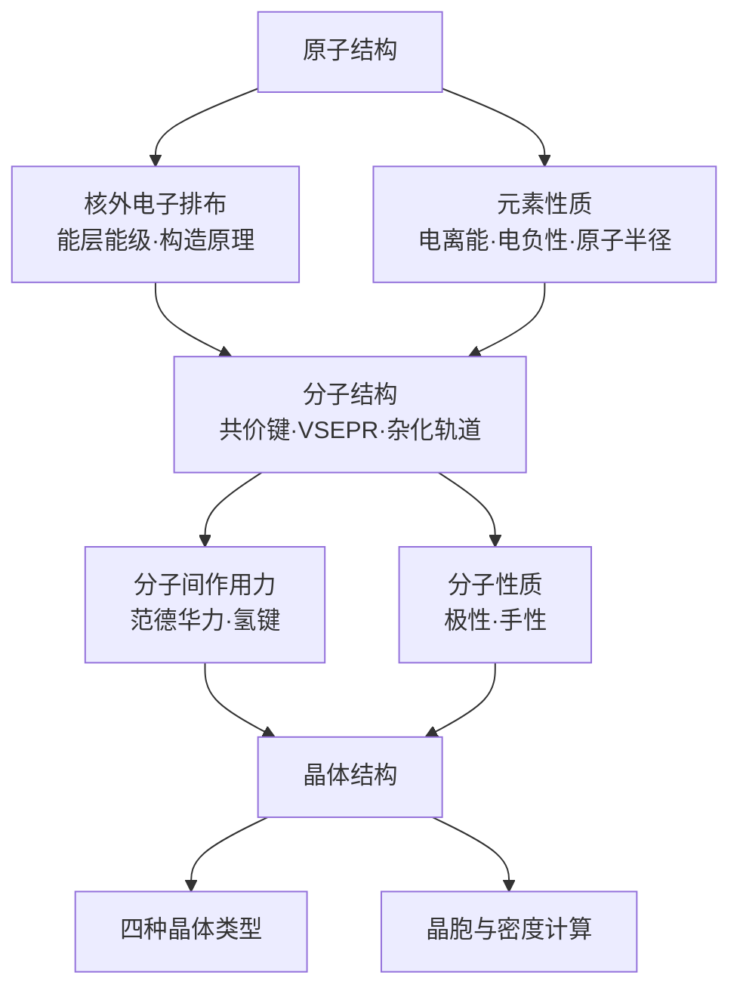

# 物质结构与性质（选必二）总览

> [!abstract] 概览
> 本册回答一个核心问题：**物质为什么具有这样的性质？** 主线是"**原子结构 → 分子结构 → 晶体结构**"三层递进。
>
> - **01 原子结构与性质**：核外电子排布规律（能层能级、构造原理、三大原理），以及由原子结构推出的**电离能、电负性、原子半径**等元素性质；
> - **02 分子结构与性质**：共价键（σ/π）、键参数、VSEPR 与杂化轨道、配合物、分子间作用力（范德华力/氢键）、分子的极性与手性；
> - **03 晶体结构与性质**：分子晶体、共价晶体、离子晶体、金属晶体的结构微粒与物理性质对比，以及晶胞与密度的定量计算。
>
> 学习时始终抓住"**结构决定性质、性质反映结构**"，并主动与必修二的元素周期律、选必一的能量观念相互印证。

## 章节导航

| 笔记 | 内容 |
| --- | --- |
| [[21-物质结构与性质选必二/01-原子结构与性质\|01-原子结构与性质]] | 能层能级、构造原理、泡利/洪特/能量最低原理、基态与激发态、电离能、电负性、对角线规则 |
| [[21-物质结构与性质选必二/02-分子结构与性质\|02-分子结构与性质]] | 共价键 σ/π、键参数、VSEPR、杂化轨道、配合物、范德华力与氢键、分子极性、手性 |
| [[21-物质结构与性质选必二/03-晶体结构与性质\|03-晶体结构与性质]] | 四种晶体类型与比较、晶胞均摊法、密度与阿伏加德罗常数计算 |

## 核心框架

## 知识主线

### 一、原子结构与性质（01）
- **核外电子排布**：能层（K、L、M、N…）→ 能级（s、p、d、f）→ 原子轨道；按构造原理顺序填充：$1s\,2s\,2p\,3s\,3p\,4s\,3d\,4p\,5s\,4d\,5p\,6s\,4f\,5d\,6p\cdots$。
- **三大原理**：泡利不相容原理、洪特规则、能量最低原理；注意洪特规则特例（半充满、全充满更稳定，如 $\ce{Cr}$、$\ce{Cu}$）。
- **基态与激发态**：基态电子排布是能量最低的排布，激发态可跃迁产生**吸收光谱/发射光谱**。
- **元素性质**：第一电离能、电负性、原子半径的周期性规律及反常（ⅡA 与 ⅢA、ⅤA 与 ⅥA 的电离能反常）；对角线规则（$\ce{Li}$–$\ce{Mg}$、$\ce{Be}$–$\ce{Al}$、$\ce{B}$–$\ce{Si}$）。

### 二、分子结构与性质（02）
- **共价键**：σ 键（头碰头重叠）与 π 键（肩并肩重叠）；单键为 1 个 σ 键，双键为 1σ+1π，三键为 1σ+2π。
- **键参数**：键能、键长、键角，三者共同决定分子稳定性与空间构型。
- **VSEPR 与杂化**：价层电子对数决定空间构型；$sp^3$（四面体）、$sp^2$（平面三角形）、$sp$（直线形）杂化与 σ 键数+孤对电子对数对应。
- **配合物**：配位键、配位数，如 $[\ce{Cu(NH3)4}]^{2+}$、$[\ce{Fe(SCN)}]^{2+}$。
- **分子间作用力**：范德华力（弱，随相对分子质量增大而增大）、氢键（X—H···Y，比范德华力强，比化学键弱，导致熔沸点反常升高、水分子缔合）。
- **分子的极性**：正负电荷中心是否重合；**手性分子**：与镜像不能重叠。

### 三、晶体结构与性质（03）
- **四种晶体**：分子晶体（冰、干冰）、共价晶体（金刚石、$\ce{SiO2}$）、离子晶体（$\ce{NaCl}$）、金属晶体（$\ce{Fe}$、$\ce{Cu}$）。
- **晶胞与密度**：均摊法计算晶胞粒子数；$\rho=\dfrac{Z\cdot M}{N_A\cdot V}$。

## 章节要点速览

### 01 原子结构与性质——必背清单
- **构造原理顺序**：$1s\,2s\,2p\,3s\,3p\,4s\,3d\,4p\,5s\,4d\,5p\,6s\,4f\,5d\,6p$；注意"先填 4s 后填 3d，书写先 3d 后 4s"。
- **能级容纳电子数**：$s=2$、$p=6$、$d=10$、$f=14$。
- **三大原理**：泡利（每轨道 2 电子自旋相反）、洪特（等价轨道分占且自旋平行；$d^5/d^{10}$、$p^3/p^6$ 半满/全满特例）、能量最低。
- **特例元素**：$\ce{Cr}$：$3d^5 4s^1$；$\ce{Cu}$：$3d^{10} 4s^1$。
- **电离能反常**：ⅡA、ⅤA 高于相邻元素（$I_1(\ce{Be})>I_1(\ce{B})$，$I_1(\ce{N})>I_1(\ce{O})$，$I_1(\ce{Mg})>I_1(\ce{Al})$）。
- **电负性**：$\ce{F}$ 最大；同周期增大、同族减小。
- **对角线规则**：$\ce{Li}$–$\ce{Mg}$、$\ce{Be}$–$\ce{Al}$、$\ce{B}$–$\ce{Si}$。

### 02 分子结构与性质——必背清单
- **σ/π 键**：单键 1σ，双键 1σ+1π，三键 1σ+2π；π 键易断（加成）。
- **键参数**：键能、键长、键角；键长越短键能越大。
- **VSEPR**：价层电子对数 = σ 键数 + 孤对电子对数；孤对电子斥力更大，键角被压缩（$\ce{NH3}$ 107.3°、$\ce{H2O}$ 104.5°）。
- **杂化**：$sp$（直线 180°，如 $\ce{CO2}$）、$sp^2$（平面三角形 120°，如 $\ce{BF3}$、$\ce{C2H4}$）、$sp^3$（四面体 109.5°，如 $\ce{CH4}$、$\ce{NH3}$、$\ce{H2O}$）。
- **配合物**：中心原子 + 配体 + 外界；$[\ce{Cu(NH3)4}]^{2+}$、$[\ce{Fe(SCN)}]^{2+}$、$[\ce{Ag(NH3)2}]^{+}$。
- **分子间作用力**：范德华力随相对分子质量增大而增大；氢键（N、O、F 与 H）使 $\ce{H2O}$、$\ce{HF}$、$\ce{NH3}$ 沸点反常升高。
- **手性**：手性碳连 4 个不同基团，如乳酸中的手性碳。

### 03 晶体结构与性质——必背清单
- **四种晶体**：分子晶体（范德华力/氢键）、共价晶体（共价键，巨分子）、离子晶体（离子键）、金属晶体（金属键）。
- **熔沸点**：共价晶体 > 离子晶体 > 分子晶体（一般）；分子晶体中含氢键者反常升高。
- **均摊法**：顶点 1/8、棱 1/4、面 1/2、体心 1。
- **典型晶胞**：$\ce{NaCl}$（$Z=4$）、$\ce{CsCl}$（$Z=1$）、金刚石（$Z=8$）。
- **密度计算**：$\rho=\dfrac{Z\cdot M}{N_A\cdot V}$。

## 常见考点与高考链接

> [!note] 高考命题角度
> - **原子结构**：电子排布式书写、$I_1$ 反常、电负性比较（选择题与填空第一问高频）。
> - **分子结构**：杂化方式 + 空间构型判断、σ/π 键数目、氢键对性质的影响（综合大题必考）。
> - **晶体结构**：均摊法数微粒、密度/晶胞参数计算、四种晶体性质比较（计算压轴）。
> - 常与选必三有机结合：有机分子中 C 的杂化（$\ce{CH3CH2OH}$ 为 $sp^3$、醛基碳为 $sp^2$、炔碳为 $sp$）。

## 学习建议

> [!tip] 学习顺序
> 01 → 02 → 03 严格递进：不懂核外电子排布，就无法理解电离能与电负性；不懂共价键与杂化，就无法解释配合物与手性；不懂分子间作用力，就无法比较各种晶体的熔沸点。
>
> 建议结合 [[杂化轨道理论]] 独立专题笔记深入理解 $sp^3/sp^2/sp$ 杂化的几何来源，用 [[多晶型、手性与同分异构体]] 区分"晶体层级的差异"与"分子层级的差异"。

## 常见误区提醒

> [!warning] 本册最易混淆的三组概念
> 1. **电离能 vs 电负性**：电离能是"气态原子失去电子的能力"，电负性是"吸引成键电子的能力"，两者趋势相似但含义不同。
> 2. **σ 键 vs π 键**：多重键只含 1 个 σ 键；π 键不能绕轴旋转、易断裂，是烯/炔能加成的根本原因。
> 3. **氢键 vs 化学键**：氢键属于分子间作用力，强度弱于化学键；$\ce{H2O}$、$\ce{HF}$、$\ce{NH3}$ 沸点反常升高的原因正是氢键。
> 4. **分子晶体 vs 共价晶体**：$\ce{SiO2}$ 是共价晶体（巨分子），不存在独立 $\ce{SiO2}$ 分子；$\ce{CO2}$（干冰）才是分子晶体。
> 5. **均摊法取数**：$\ce{NaCl}$ 晶胞 $Z=4$、$\ce{CsCl}$ 晶胞 $Z=1$，密度计算别代错。

## 与其他知识的关联

- 与 **必修二**：元素周期表与周期律（章节 09）是"结论"，本册给出"微观解释"。
- 与 **选必一**：晶体场/配位场中的能量概念、水的离子积中氢键的解释。
- 与 **选必三**：有机分子中碳的杂化方式直接决定官能团的空间结构与反应性。
- 专题笔记：[[杂化轨道理论]]、[[多晶型、手性与同分异构体]]。

---
*返回 [[00-化学总览]]*
