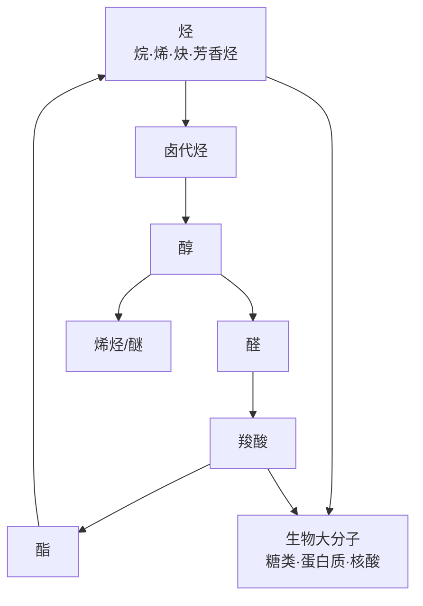

# 有机化学基础（选必三）总览

> [!abstract] 概览
> 本册系统研究含碳化合物的结构与转化，主线是"**结构 → 性质 → 转化 → 合成**"。
>
> - **01 有机物的结构特点与命名**：碳的四价、官能团识别、系统命名法、同分异构体书写；
> - **02 烃（烷、烯、炔与芳香烃）**：脂肪烃与芳香烃的制备与性质；
> - **03 烃的衍生物**：卤代烃、醇、酚、醛、酮、羧酸、酯与油脂的转化网络；
> - **04 有机合成与推断**：官能团转化路线、逆合成分析与推断策略；
> - **05 生物大分子**：糖类、蛋白质（氨基酸）、核酸。
>
> 学习时建议以"**官能团**"为线索，把反应归纳为"官能团的引入、转化、消除"，最终能画出完整的转化关系网。

## 章节导航

| 笔记 | 内容 |
| --- | --- |
| [[22-有机化学基础选必三/01-有机物的结构特点与命名\|01-有机物的结构特点与命名]] | 官能团、系统命名法、同分异构体书写、碳骨架 |
| [[22-有机化学基础选必三/02-烃烷烯炔与芳香烃\|02-烃（烷烯炔与芳香烃）]] | 烷烃取代、烯烃/炔烃加成、乙炔制备、苯与苯的同系物 |
| [[22-有机化学基础选必三/03-烃的衍生物卤代烃醇酚醛酮羧酸酯\|03-烃的衍生物]] | 卤代烃、醇、酚、醛、酮、羧酸、酯、油脂的转化 |
| [[22-有机化学基础选必三/04-有机合成与推断\|04-有机合成与推断]] | 官能团转化路线、逆合成分析、推断方法 |
| [[22-有机化学基础选必三/05-生物大分子糖类蛋白质核酸\|05-生物大分子]] | 糖类、蛋白质与氨基酸、核酸 |

## 核心框架

## 知识主线

### 一、有机物结构特点与命名（01）
- **碳四价**：碳原子形成 4 个共价键，可连成链状、环状，故有机物种类繁多。
- **官能团**：决定有机物化学性质的原子或原子团，如 $\ce{C=C}$、$\ce{C≡C}$、$\ce{-X}$、$\ce{-OH}$、$\ce{-CHO}$、$\ce{-COOH}$、$\ce{-COOR}$、$\ce{-NO2}$、$\ce{-NH2}$。
- **系统命名法**：选主链（最长碳链）、编号（近官能团一端）、写名称（取代基位次+名称）。
- **同分异构体**：碳链异构、位置异构、官能团异构、顺反异构、对映异构（手性）。

### 二、烃（02）
- **烷烃**：只含单键，饱和烃，性质稳定，特征反应为**取代反应（卤代）**，还可氧化（燃烧）、裂化。
- **烯烃**：含 $\ce{C=C}$，特征反应为**加成反应**（加卤素、$\ce{H2}$、$\ce{HX}$、$\ce{H2O}$）、加聚、氧化（使 $\ce{KMnO4}$ 褪色）。
- **炔烃**：含 $\ce{C≡C}$，乙炔由电石与水制取，能加成、氧化。
- **芳香烃**：苯（平面正六边形，介于单双键之间，难加成、易取代），苯的同系物受侧链影响可被氧化。

### 三、烃的衍生物（03）
- **卤代烃**：$\ce{-X}$，水解（NaOH 水溶液，得醇）与消去（NaOH 醇溶液，得烯）。
- **醇**：$\ce{-OH}$，氧化（得醛/酮）、消去（得烯）、与酸酯化、与金属钠反应。
- **酚**：$\ce{-OH}$ 直接连苯环，弱酸性、与 $\ce{FeCl3}$ 显色、苯环上易取代（邻对位）。
- **醛**：$\ce{-CHO}$，银镜反应、与新制 $\ce{Cu(OH)2}$ 反应、催化加氢还原。
- **酮**：$\ce{C=O}$ 连接两个烃基，不发生银镜反应，可加氢还原为醇。
- **羧酸**：$\ce{-COOH}$，酸性、与醇酯化。
- **酯**：$\ce{-COOR}$，水解（酸性水解可逆、碱性水解彻底）。
- **油脂**：高级脂肪酸甘油酯，水解生成高级脂肪酸与甘油，可氢化（硬化）。

### 四、有机合成与推断（04）
- 常见转化链：**卤代烃 → 醇 → 醛 → 羧酸 → 酯**。
- 碳链增长：卤代烃与 $\ce{NaCN}$、加成；碳链缩短：氧化、裂化。
- **逆合成分析**：从目标产物倒推所需原料与反应条件。
- 推断题策略：抓官能团特征反应、相对分子质量、不饱和度、光谱信息。

### 五、生物大分子（05）
- **糖类**：单糖（葡萄糖、果糖）、二糖（蔗糖、麦芽糖）、多糖（淀粉、纤维素）。
- **蛋白质**：氨基酸通过脱水缩合形成肽键；两性、水解、盐析与变性。
- **核酸**：核苷酸聚合而成，储存遗传信息。

## 章节要点速览

### 01 结构特点与命名——必背清单
- **碳四价**：连 4 个共价键；单/双/三键决定杂化（$sp^3/sp^2/sp$）。
- **常见官能团**：$\ce{C=C}$、$\ce{C≡C}$、$\ce{-X}$、$\ce{-OH}$（醇/酚）、$\ce{-CHO}$、$\ce{-CO-}$、$\ce{-COOH}$、$\ce{-COOR}$、$\ce{-NO2}$、$\ce{-NH2}$。
- **命名**：选最长含官能团主链 → 编号（官能团位次最小）→ 写名称（位次+名称）。
- **同分异构体**：碳链异构、位置异构、官能团异构、顺反异构、对映异构（手性）。
- **常考数目**：$\ce{C4H10}$ 2 种、$\ce{C5H12}$ 3 种、$\ce{C4H9Cl}$ 4 种。

### 02 烃——必背清单
- **烷烃**：取代（光照卤代）、燃烧、裂化；不能使溴水/KMnO4 褪色。
- **烯烃**：加成（$\ce{Br2}$、$\ce{H2}$、$\ce{HX}$、$\ce{H2O}$）、加聚、氧化（使溴水与 KMnO4 褪色）。
- **炔烃**：$\ce{CaC2 + 2H2O -> Ca(OH)2 + CH≡CH\uparrow}$；加成分两步。
- **苯**：大 π 键，易取代（硝化/卤代/磺化）难加成；不能使溴水褪色（萃取）。
- **苯的同系物**：侧链被氧化，使酸性 $\ce{KMnO4}$ 褪色（苯不能）。

### 03 烃的衍生物——必背清单
- **卤代烃**：NaOH 水溶液→水解（醇）；NaOH 醇溶液→消去（烯）。
- **醇**：伯醇氧化→醛、仲醇→酮、叔醇不氧化；消去成烯；酯化。
- **酚**：弱酸性、$\ce{FeCl3}$ 显紫色、浓溴水白色沉淀。
- **醛**：银镜反应、新制 $\ce{Cu(OH)2}$ 砖红色、加氢还原成醇。
- **酮**：无还原性，不与银氨/氢氧化铜反应；加氢成醇。
- **羧酸**：酸性（与 $\ce{NaHCO3}$ 出气）、酯化（酸脱羟基醇脱氢）。
- **酯**：酸性水解可逆、碱性水解彻底（皂化）。
- **油脂**：甘油三酯，水解得高级脂肪酸+甘油，可氢化硬化。

### 04 有机合成与推断——必背清单
- **转化主线**：$\ce{R-X -> R-OH -> R-CHO -> R-COOH -> R-COOR'}$。
- **链增长**：卤代烃与 $\ce{NaCN}$、不饱和烃加成、聚合。
- **逆合成**：从目标产物倒推前体，在官能团处断键。
- **推断信息**：不饱和度、$M_r$、特征反应、核磁共振氢谱（峰数=等效氢种类，面积比=氢数比）。

### 05 生物大分子——必背清单
- **糖类**：葡萄糖（多羟基醛，能银镜）、蔗糖（无还原性）、麦芽糖（有还原性）、淀粉（碘变蓝）、纤维素；水解最终产物葡萄糖。
- **蛋白质**：氨基酸两性、肽键缩合、水解；盐析（可逆物理）vs 变性（不可逆化学）；浓硝酸变黄、灼烧焦羽毛味。
- **核酸**：核苷酸聚合，DNA/RNA，碱基互补配对。

## 常见考点与高考链接

> [!note] 高考命题角度
> - **选择题**：官能团性质判断、同分异构体计数、反应类型判断、实验现象。
> - **合成题**：给原料与目标产物写路线（常考卤代烃→醇→醛→酸→酯链），要求注明反应条件。
> - **推断题**：由分子式、特征反应、氢谱推断结构，或由转化关系图补写物质与反应。
> - 常与选必二结合：判断分子中碳的杂化方式与分子空间构型。

## 常见误区提醒

> [!warning] 本册最易混淆的五组概念
> 1. **卤代烃水解 vs 消去**：NaOH 水溶液→醇，NaOH 醇溶液→烯，溶剂是决定因素。
> 2. **醛 vs 酮**：醛能银镜、与新制 $\ce{Cu(OH)2}$ 反应；酮不能。
> 3. **盐析 vs 变性**：盐析可逆（物理）、变性不可逆（化学，重金属盐/高温/强酸碱）。
> 4. **蔗糖 vs 麦芽糖**：蔗糖无还原性，麦芽糖有还原性（能银镜）。
> 5. **苯 vs 苯的同系物**：苯不能使酸性 $\ce{KMnO4}$ 褪色，甲苯等因侧链能被氧化而褪色。
> 6. **酯化反应断键**：酸脱羟基、醇脱氢，水中的氧来自羧酸。

## 学习建议

> [!tip] 学习顺序
> 01（结构命名）→ 02（烃）→ 03（衍生物）→ 04（合成推断）→ 05（生物大分子）。前三章是"官能团化学"，第四章是综合运用，第五章是延伸应用。
>
> 建议把重点反应的"条件、产物、现象"做成转化图：每个官能团记清楚"怎么来、怎么走、和谁反应"。相关专题可参考 [[多晶型、手性与同分异构体]] 区分同分异构类型。

## 与其他知识的关联

- 与 **必修二有机化合物（章节 14）**：甲烷、乙烯、苯的入门知识在此深化。
- 与 **[[21-物质结构与性质选必二/02-分子结构与性质\|分子结构与性质]]**：碳的 $sp^3/sp^2/sp$ 杂化决定有机分子构型，如 $\ce{CH3CH2OH}$ 中碳为 $sp^3$。
- 与 **[[杂化轨道理论]]**：解释乙烯、乙炔、苯的平面/直线结构。
- 与 **[[多晶型、手性与同分异构体]]**：区分结构异构、顺反异构与手性异构。

---
*返回 [[00-化学总览]]*
