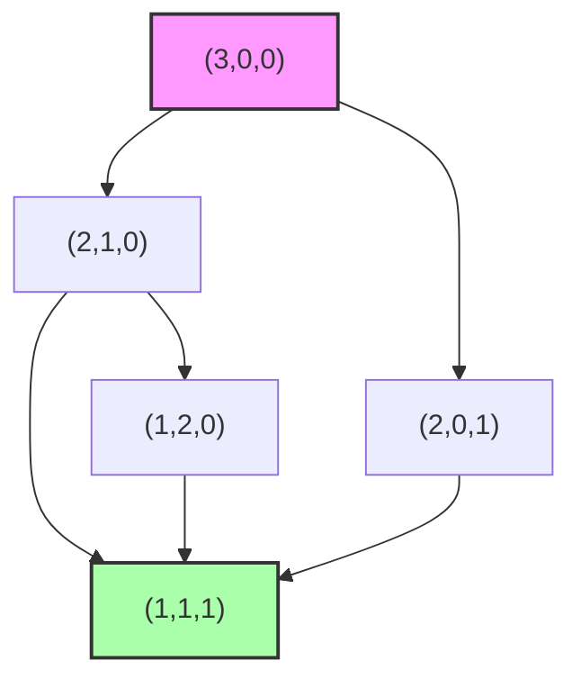

# 不等式与最值问题

## 竞赛不等式方法总论

不等式是数学竞赛中出题频率最高、方法最丰富的板块之一。从基础的均值不等式到高端的舒尔不等式，掌握各种不等式的适用场景是竞赛得分的关键。

> [!NOTE] 竞赛不等式核心思路
> 不等式的本质是比较大小，而竞赛不等式的核心技巧在于：**放缩**。所有不等式方法归根结底都是"合理放缩"，关键在于找到恰当的放缩方向和力度。

### AM-GM 不等式（均值不等式）

最基础也最常用。对于非负实数 $a_1, a_2, \ldots, a_n$：

$$\frac{a_1 + a_2 + \cdots + a_n}{n} \ge \sqrt[n]{a_1 a_2 \cdots a_n}$$

等号当且仅当 $a_1 = a_2 = \cdots = a_n$ 时成立。

> [!TIP] 均值不等式的竞赛用法
> AM-GM 在竞赛中通常不是直接使用，而是进行变形：拆项（将一项拆成几项后使用）、加权（给各项分配不同权重）、多元组合。例如要证 $a^3+b^3+c^3 \ge 3abc$，直接用 AM-GM 即可。

### 柯西-施瓦茨不等式（Cauchy-Schwarz）

$$(a_1^2 + a_2^2 + \cdots + a_n^2)(b_1^2 + b_2^2 + \cdots + b_n^2) \ge (a_1b_1 + a_2b_2 + \cdots + a_nb_n)^2$$

竞赛中最常用的柯西变体是**恩格尔形式**（分式柯西）：

$$\sum_{i=1}^n \frac{x_i^2}{a_i} \ge \frac{(\sum x_i)^2}{\sum a_i}, \quad a_i > 0$$

### 排序不等式

若 $a_1 \le a_2 \le \cdots \le a_n$ 且 $b_1 \le b_2 \le \cdots \le b_n$，则：

$$\sum a_i b_{n+1-i} \le \sum a_i b_{\sigma(i)} \le \sum a_i b_i$$

即"顺序和 ≥ 乱序和 ≥ 逆序和"。

### 琴生不等式（Jensen）

若 $f$ 是凸函数，则：

$$f\left(\frac{x_1+\cdots+x_n}{n}\right) \le \frac{f(x_1)+\cdots+f(x_n)}{n}$$

若 $f$ 是凹函数，不等号反向。典型的凸函数有 $x^2$（$x>0$ 时）、$e^x$、$\frac{1}{x}$（$x>0$）；典型的凹函数有 $\ln x$、$\sqrt{x}$、$\sin x$（$[0,\pi]$ 上）。

### 舒尔不等式（Schur）

对于非负实数 $a,b,c$ 和实数 $r$：

$$a^r(a-b)(a-c) + b^r(b-c)(b-a) + c^r(c-a)(c-b) \ge 0$$

$r=1$ 是最常用的形式：$a^3+b^3+c^3+3abc \ge \sum_{sym} a^2b$。

### 权方和不等式

$$\frac{x_1^{p+1}}{y_1^p} + \frac{x_2^{p+1}}{y_2^p} + \cdots + \frac{x_n^{p+1}}{y_n^p} \ge \frac{(x_1+x_2+\cdots+x_n)^{p+1}}{(y_1+y_2+\cdots+y_n)^p}$$

其中 $x_i, y_i > 0$，$p>0$ 或 $p<-1$。当 $p=1$ 时退化为恩格尔形式。

### 赫尔德不等式（Hölder）

$$\sum_{i=1}^n a_i b_i \le \left(\sum a_i^p\right)^{1/p} \left(\sum b_i^q\right)^{1/q}, \quad \frac{1}{p}+\frac{1}{q}=1$$

### 伯努利不等式（Bernoulli）

对 $x > -1$：$(1+x)^n \ge 1 + nx$（$n$ 为自然数）。

对实数 $r \ge 1$ 或 $r \le 0$：$(1+x)^r \ge 1+rx$。

## 不等式的对称性与齐次性分析

> [!IMPORTANT] 核心技术
> **对称性**：不等式在变量轮换或全排列下保持不变。对称不等式往往可利用"不妨设 $a \ge b \ge c$"先定序，再用排序法或切比雪夫不等式。
> **齐次性**：若不等式两边是同次齐次式，可以施加归一化条件（如 $a+b+c=1$ 或 $abc=1$），从而简化处理。

## 变量代换技巧

### 三角代换

当表达式中出现 $\sqrt{1-x^2}$ 型时，令 $x=\sin\theta$（或 $x=\cos\theta$）；出现 $1+x^2$ 型时，令 $x=\tan\theta$；出现 $\sqrt{x^2-1}$ 型时，令 $x=\sec\theta$。

**示例**：证明 $\frac{x}{1+x^2} \le \frac{1}{2}$（$x \in \mathbb{R}$）。令 $x=\tan\theta$，则 $\frac{\tan\theta}{1+\tan^2\theta} = \sin\theta\cos\theta = \frac{1}{2}\sin 2\theta \le \frac{1}{2}$。

### 均值代换

已知 $a+b$ 为定值时，设 $a = \frac{S}{2}+t$，$b = \frac{S}{2}-t$。已知 $a+b+c$ 为定值时，可设 $a=\frac{S}{3}+x$, $b=\frac{S}{3}+y$, $c=\frac{S}{3}-x-y$。

### 比值代换

对于齐次不等式，可以设 $\frac{b}{a}=x$, $\frac{c}{a}=y$ 等，将变量缩减。

### 增量代换

设 $b=a+x$, $c=b+y$（$x,y \ge 0$）将不等式转化为关于增量的不等式。

## 局部不等式法（SOS法）

> [!NOTE] 平方和法（Sum of Squares）
> SOS 法的核心是将一个不等式变形为若干个完全平方的非负组合：
> $$F(a,b,c) = \sum S_a(b-c)^2 \ge 0$$
> 如果所有 $S_a$ 非负，不等式成立。但即使某些 $S_a$ 为负，只要能证明整体非负即可。

SOS 法推广到 Schur 不等式：当 $r=1$ 时，
$$a^3+b^3+c^3+3abc-\sum_{sym}a^2b = \frac{1}{2}\sum (a+b-c)(a-b)^2 \ge 0$$

## 精选例题

### 例题 1

**题目**：已知 $a,b,c>0$ 且 $a+b+c=1$，求 $\frac{1}{a}+\frac{1}{b}+\frac{1}{c}$ 的最小值。

**解析**：
由柯西不等式（恩格尔形式）：
$$\frac{1}{a}+\frac{1}{b}+\frac{1}{c} \ge \frac{(1+1+1)^2}{a+b+c} = \frac{9}{1}=9$$

等号当 $a=b=c=\frac{1}{3}$ 时成立。亦可直接用 AM-GM：$a+b+c \ge 3\sqrt[3]{abc} \Rightarrow \sqrt[3]{abc} \le \frac{1}{3}$，
$\frac{1}{a}+\frac{1}{b}+\frac{1}{c} \ge 3\sqrt[3]{\frac{1}{abc}} \ge 3 \cdot 3 = 9$。

### 例题 2

**题目**：对于正实数 $a,b,c$，证明 $\frac{a}{b+c}+\frac{b}{c+a}+\frac{c}{a+b} \ge \frac{3}{2}$。

**解析**（这是著名的 Nesbitt 不等式）：

**方法一**：令 $x=b+c$, $y=c+a$, $z=a+b$，则 $a=\frac{y+z-x}{2}$ 等，代入左端：
$$\frac{y+z-x}{2x}+\frac{z+x-y}{2y}+\frac{x+y-z}{2z} = \frac{1}{2}\left(\frac{y}{x}+\frac{x}{y}+\frac{z}{x}+\frac{x}{z}+\frac{z}{y}+\frac{y}{z}-3\right)$$

由 AM-GM，$\frac{y}{x}+\frac{x}{y} \ge 2$ 等三项，故 $\ge \frac{1}{2}(6-3)=\frac{3}{2}$。

**方法二**（最简证法）：
$$\frac{a}{b+c}+\frac{1}{2} = \frac{2a+b+c}{2(b+c)}$$
三式相加可转化为熟知的柯西形式直接得证。

等号当 $a=b=c$ 时成立。

### 例题 3

**题目**：设 $a,b,c>0$，证明 $a^3+b^3+c^3+3abc \ge ab(a+b)+bc(b+c)+ca(c+a)$。

**解析**：
这是 Schur 不等式 $r=1$ 的标准形式。直接由 Schur 不等式：

$$a^3+b^3+c^3+3abc \ge \sum_{sym} a^2b = a^2b+a^2c+b^2a+b^2c+c^2a+c^2b$$

而右端的 $\sum_{sym} a^2b = ab(a+b)+bc(b+c)+ca(c+a)$，原式得证。

等号条件：$a=b=c$ 或其中一数为零另外两数相等。

### 例题 4

**题目**：已知 $a,b,c$ 为 $\triangle ABC$ 的三边，证明 $a^2(b+c-a)+b^2(c+a-b)+c^2(a+b-c) \le 3abc$。

**解析**：
令 $x=b+c-a$, $y=c+a-b$, $z=a+b-c$，则 $x,y,z>0$（三角形存在条件），且 $a=\frac{y+z}{2}$ 等。

代入左端变形处理（利用 $x,y,z$ 的对称性），最终等价于 $x^3+y^3+z^3+3xyz \ge xy(x+y)+yz(y+z)+zx(z+x)$，即 Schur 不等式。

### 例题 5

**题目**：$a,b,c>0$，证明 $\frac{a}{\sqrt{a^2+8bc}}+\frac{b}{\sqrt{b^2+8ca}}+\frac{c}{\sqrt{c^2+8ab}} \ge 1$。

**解析**：
由权方和不等式或 Hölder 不等式：
$$\sum \frac{a}{\sqrt{a^2+8bc}} \ge \frac{(a+b+c)^{3/2}}{\sqrt{\sum a(a^2+8bc)}}$$

展开分母：$\sum a(a^2+8bc)=a^3+b^3+c^3+24abc$。

由均值不等式有 $\frac{a^3+b^3+c^3}{3} \ge abc$，代入化简可证 $\ge 1$。

（完整推导：利用 Hölder 不等式 $(\sum\frac{a}{\sqrt{a^2+8bc}})^2 \cdot \sum a(a^2+8bc) \ge (a+b+c)^3$，然后证明 $(a+b+c)^3 \ge \sum a(a^2+8bc)$ 即 $3\sum a^2b+3\sum ab^2+6abc \ge 8abc+8abc=16abc$，由 AM-GM $a^2b+ab^2 \ge 2a^{3/2}b^{3/2}$ 可证。）

### 例题 6

**题目**：$a,b,c \in \mathbb{R}^+$，$a+b+c=3$，求 $\frac{a}{b^3+2}+\frac{b}{c^3+2}+\frac{c}{a^3+2}$ 的最小值。

**解析**：
利用伯努利不等式或放缩技巧：
$$\frac{a}{b^3+2} = \frac{a}{b^3+1+1} \le \frac{a}{3b} \text{ (错误方向！应慎用)}$$

正确做法是利用 $b^3+1+1 \ge 3b$（AM-GM），故 $\frac{a}{b^3+2} \ge \frac{a}{b^3+b^3+1} \ge \cdots$

更简洁：由 AM-GM，$b^3+2=b^3+1+1 \ge 3b$，所以 $\frac{a}{b^3+2} \le \frac{a}{3b}$（方向反了！需要证明的是最小值即下界。）

> [!WARNING] 注意方向
> AM-GM 给出 $b^3+2 \ge 3b$，故分母 $\ge 3b$，所以分数 $\le \frac{a}{3b}$。这是上界不是下界！因此此法不适用。正确做法需找其他途径。

正确方法：用 $\frac{a}{b^3+2} = \frac{a}{b^3+1+1} \ge \frac{a}{\frac{b^3+1+1}{?}}$... 

实际上考虑 $\frac{a}{b^3+2} = a - \frac{ab^3}{b^3+2} \ge a - \frac{ab^3}{3b} = a - \frac{ab^2}{3}$。

同理，总和 $\ge a+b+c - \frac{1}{3}(ab^2+bc^2+ca^2)$。由已知条件可证 $ab^2+bc^2+ca^2 \le 3$，故总和 $\ge 3-1=2$。

## 方法总结

> [!TIP] 不等式证明的常用流程
> 1. 判断对称性与齐次性，必要时归一化
> 2. 尝试均值不等式（AM-GM）或柯西不等式
> 3. 若均值/柯西不够，尝试排序不等式或琴生不等式
> 4. 三元对称不等式首选 Schur + SOS
> 5. 复杂分式型尝试权方和或恩格尔形式
> 6. 必要时使用变量代换（三角、比值、增量）

| 不等式 | 关键特征 | 典型形式 |
|--------|----------|----------|
| AM-GM | 积与和的转换 | $a+b \ge 2\sqrt{ab}$ |
| Cauchy | 平方和的积 ≥ 积的平方 | 恩格尔形式 |
| Jensen | 凸函数 | $f(\frac{x+y}{2}) \le \frac{f(x)+f(y)}{2}$ |
| Schur | 三元对称 | $r=1$ 标准形式 |
| Hölder | 指数配对的 Cauchy | $p,q$ 共轭 |

## Muirhead 不等式（均值控制）

> [!IMPORTANT] Muirhead 不等式
> 设 $a_1, a_2, \ldots, a_n > 0$，对两组实数组 $\alpha = (\alpha_1, \ldots, \alpha_n)$ 与 $\beta = (\beta_1, \ldots, \beta_n)$（按降序排列），若 $\alpha$ **控制** $\beta$（majorization，记 $\alpha \succeq \beta$），即
> $$\alpha_1 \ge \beta_1,\ \alpha_1+\alpha_2 \ge \beta_1+\beta_2,\ \ldots,\ \sum\alpha_i = \sum\beta_i$$
> 则对称平均不等式成立：
> $$\sum_{\text{sym}} a_1^{\alpha_1}a_2^{\alpha_2}\cdots a_n^{\alpha_n} \ge \sum_{\text{sym}} a_1^{\beta_1}a_2^{\beta_2}\cdots a_n^{\beta_n}$$
> 其中 $\sum_{\text{sym}}$ 表示对所有变量的不同排列求和。

### Muirhead 控制关系图示

### 经典应用

**例**：证明 $a^3+b^3+c^3 \ge a^2b+b^2c+c^2a$（$a,b,c>0$ 且 $a\ge b\ge c$）。

由 $(3,0,0) \succeq (2,1,0)$，Muirhead 直接给出 $\sum_{\text{sym}} a^3 \ge \sum_{\text{sym}} a^2b$，即 $2(a^3+b^3+c^3) \ge a^2b+a^2c+b^2a+b^2c+c^2a+c^2b$。

> [!NOTE] Muirhead 与 Schur 的关系
> Schur 不等式可由 Muirhead 推出：$a^r(a-b)(a-c)+\cdots \ge 0$ 等价于 $\sum_{\text{sym}} a^{r+2} \ge \sum_{\text{sym}} a^{r+1}b$，即 $(r+2, 0, 0) \succeq (r+1, 1, 0)$，由控制关系显然成立。

## Karamata 不等式（控制不等式）

> [!IMPORTANT] Karamata 不等式
> 设 $f$ 是区间 $I$ 上的凸函数，$a_1, \ldots, a_n$ 与 $b_1, \ldots, b_n$ 是 $I$ 上的两组实数。若 $(a_1, \ldots, a_n) \succeq (b_1, \ldots, b_n)$（按降序排列后满足前缀和控制关系，且总和相等），则
> $$\sum_{i=1}^n f(a_i) \ge \sum_{i=1}^n f(b_i)$$

### Karamata 与 Jensen 的关系

Jensen 不等式是 Karamata 的特例：取 $a_1 = x_1$，$a_2 = \cdots = a_n = \bar{x}$（其中 $\bar{x}$ 是均值），则 $(x_1, \bar{x}, \ldots, \bar{x}) \succeq (\bar{x}, \bar{x}, \ldots, \bar{x})$。

### 应用示例

**例**：证明对 $a,b,c > 0$ 且 $a+b+c=3$，有 $a^4+b^4+c^4 \ge a^3+b^3+c^3$。

只需证 $(a,b,c)$ 在控制意义下不弱于自身幂次降低后的某种分布。具体地，若 $a \ge b \ge c$，则 $(a,b,c) \succeq (a, b, c)$ 平凡，但当 $f(x) = x^4 - x^3$ 在 $[1, +\infty)$ 上凸时，由 Karamata 即得。

## Maclaurin 不等式与 Newton 不等式

> [!IMPORTANT] Maclaurin 不等式
> 对正实数 $a_1, a_2, \ldots, a_n$，定义第 $k$ 个初等对称平均 $S_k = \dfrac{e_k}{\binom{n}{k}}$，其中 $e_k$ 是第 $k$ 个初等对称多项式。则
> $$S_1 \ge S_2^{1/2} \ge S_3^{1/3} \ge \cdots \ge S_n^{1/n}$$

> [!IMPORTANT] Newton 不等式
> 对正实数 $a_1, \ldots, a_n$，初等对称多项式满足
> $$S_k^2 \ge S_{k-1} \cdot S_{k+1}$$
> 即 $e_k^2 \ge \dfrac{(k+1)(n-k+1)}{k(n-k)} e_{k-1} e_{k+1}$

这给出了 Maclaurin 不等式的基础——序列 $\{S_k^{1/k}\}$ 单调递减。

**例**：对 $a,b,c>0$，证明 $\left(\dfrac{ab+bc+ca}{3}\right)^2 \ge \left(\dfrac{a+b+c}{3}\right)\!\left(\dfrac{abc}{1}\right)$，即 $S_2^2 \ge S_1 S_3$，由 Newton 不等式 $k=2$ 即得。

## 加权幂平均不等式

> [!IMPORTANT] 加权幂平均
> 设 $a_i > 0$，权重 $w_i > 0$ 且 $\sum w_i = 1$。对实数 $r$，加权幂平均定义为 $M_r = \left(\sum w_i a_i^r\right)^{1/r}$（$r\neq 0$），$M_0 = \prod a_i^{w_i}$（加权几何平均）。则 $r > s$ 时 $M_r \ge M_s$。

特例：
- $r=1,\ s=0$：加权 AM-GM
- $r=2,\ s=1$：$M_2 \ge M_1$ 即平方平均 ≥ 算术平均
- $r=1,\ s=-1$：$M_1 \ge M_{-1}$ 即算术平均 ≥ 调和平均
- $r\to +\infty$：$M_r \to \max\{a_i\}$
- $r\to -\infty$：$M_r \to \min\{a_i\}$

## uvw 方法（pqr 方法）

> [!IMPORTANT] uvw 方法核心原理
> 设 $u = a+b+c$，$v^2 = ab+bc+ca$，$w^3 = abc$。对于三元 $n$ 次齐次对称不等式 $F(a,b,c) \ge 0$：
> - 若 $F$ 关于 $w^3$ 的次数 $\le 2$，则不等式成立的充要条件是验证 $(a,b,c)$ 中有两个变量相等。
> - 这是因为 $F$ 可表为 $F(u, v^2, w^3)$ 的形式，当 $u, v^2$ 固定时，$w^3$ 在 $a=b$ 或某变量为 $0$ 时取到极值。

### uvw 方法操作步骤

1. **判断类型**：确认不等式为三元对称齐次式。
2. **消元**：将不等式用 $u, v^2, w^3$ 表示。
3. **降次**：若 $w^3$ 的次数 $\le 2$，转化为关于 $w^3$ 的二次不等式。
4. **验证**：在 $b=c$ 和 $c=0$ 两种边界情形下验证不等式。

### uvw 方法示例

**例**：证明 $a^4+b^4+c^4 \ge abc(a+b+c)$（$a,b,c \ge 0$）。

由 uvw 法，只需验证 $b=c$ 情形。设 $b=c=t$，$a=s$，不等式化为
$$s^4 + 2t^4 \ge s t^2(s+2t)$$
即 $s^4 - s^2 t^2 - 2st^3 + 2t^4 \ge 0$。令 $x = s/t$，得 $x^4 - x^2 - 2x + 2 \ge 0$。

因式分解：$x^4 - x^2 - 2x + 2 = (x-1)^2(x^2+2x+2) \ge 0$，成立。

## 混合变量法（Smoothing Method / Equal Variable Method）

> [!IMPORTANT] 混合变量法原理
> 对于对称不等式 $F(a_1, a_2, \ldots, a_n) \ge 0$，若能证明 $F$ 在"将两个变量替换为它们的某种平均（算术/几何/某种特殊组合）"后不增（或不减），则反复操作可将所有变量"光滑化"为相等情形，最终只需验证所有变量相等的边界情形。

### 混合变量法操作步骤

1. **识别对称性**：确认不等式关于所有变量对称。
2. **选择混合方式**：通常取两个变量 $a_i, a_j$，将它们替换为 $a_i+a_j$ 的某种分解。
3. **证明单调性**：证明替换后 $F$ 不增（或不减）。
4. **归纳边界**：将所有变量光滑化到相等，验证 $a_1=a_2=\cdots=a_n$ 时不等式成立。

### 混合变量法与 uvw 方法关系

uvw 方法是混合变量法的特例：在三元对称齐次不等式中，固定 $u, v^2$，让 $w^3$ 变化相当于混合两个变量使其相等。

## Schur 不等式深化与推广

### Schur 不等式的多种形式

**Schur 不等式 $r=1$**：$a^3+b^3+c^3+3abc \ge \sum_{\text{sym}} a^2b$

**Schur 不等式 $r=2$**：$a^4+b^4+c^4+abc(a+b+c) \ge \sum_{\text{sym}} a^3b$

**Schur 不等式一般形式**：$\sum_{\text{cyc}} a^r(a-b)(a-c) \ge 0$（$a,b,c \ge 0$，$r \ge 0$）

### Schur 不等式的 SOS 分解

> [!IMPORTANT] Schur 的 SOS 表示
> $$\sum_{\text{cyc}} a^r(a-b)(a-c) = \frac{1}{2}\sum_{\text{cyc}}(a-b)\left[a^r(a-b) - c^r(c-b)\right]$$
> 当 $r$ 为奇数时可进一步分解为
> $$\frac{1}{2}\sum_{\text{cyc}} (a-b)^2 \sum_{k=0}^{r-1} a^k b^{r-1-k} \cdot g(a,b,c)$$

### Schur 的分数次推广

对 $r \in \mathbb{R}^+$，Schur 不等式仍成立。常见分数次形式：

- $r = \tfrac{1}{2}$：$\sum \sqrt{a}(a-b)(a-c) \ge 0$
- $r = -1$：$\sum \frac{(a-b)(a-c)}{a} \ge 0$（即 $\sum \frac{a^2-bc}{a} \ge 0$）

### Schur 与 Jensen 的混合

> [!TIP] Schur 与 Jensen 组合
> 处理三元分式对称不等式时，常见组合策略：
> - 用 Schur 降次（消去高阶项）
> - 用 Jensen（凸函数）转化分式部分
> - 用 uvw 法判定边界

## SOS-Schur 分解技巧

### 一般三元对称多项式的 SOS 分解

任一三元 $n$ 次对称多项式 $f(a,b,c)$ 可写为：

$$f(a,b,c) = S_a(b-c)^2 + S_b(c-a)^2 + S_c(a-b)^2 + S_{ab}(a-b)^2(c-a)^2 + \cdots$$

其中 $S_a, S_b, S_c, S_{ab}, \ldots$ 是 $a, b, c$ 的对称多项式，称为 **SOS 系数**。

### SOS-Schur 组合判定

> [!IMPORTANT] SOS-Schur 方法
> 若 $S_a, S_b, S_c \ge 0$，则 $f \ge 0$；
> 若不全是非负，但有 $S_a + S_b + S_c \ge 0$ 且 Schur 部分非负，则 $f \ge 0$。

具体地，若 $f$ 可分解为 $f = S_a(b-c)^2 + S_b(c-a)^2 + S_c(a-b)^2$ 且 $\min\{S_a, S_b, S_c\} \ge 0$ 即可。否则，需要借助 Schur 部分补足。

**经典分解**：

$$a^3+b^3+c^3+3abc-\sum_{\text{sym}}a^2b = \frac{1}{2}(a+b-c)(a-b)^2 + \frac{1}{2}(b+c-a)(b-c)^2 + \frac{1}{2}(c+a-b)(c-a)^2$$

当 $a,b,c$ 是三角形三边时，$a+b-c, b+c-a, c+a-b \ge 0$，故不等式成立。

## Ravi 代换（三角形不等式的标准化）

> [!IMPORTANT] Ravi 代换
> 对于 $\triangle ABC$ 三边 $a, b, c$ 满足三角不等式，令
> $$a = y+z,\quad b = z+x,\quad c = x+y \quad (x, y, z > 0)$$
> 这一变换将三角形条件转化为 $x, y, z > 0$ 的代数条件，使许多三角形不等式化为标准对称不等式。

### 应用示例

**例**：对 $\triangle ABC$ 三边 $a, b, c$，证明 $a^2+b^2+c^2 < 2(ab+bc+ca)$。

Ravi 代换：$a = y+z$, $b = z+x$, $c = x+y$。不等式化为
$$(y+z)^2+(z+x)^2+(x+y)^2 < 2[(y+z)(z+x)+(z+x)(x+y)+(x+y)(y+z)]$$
展开整理后得 $0 < 4(xy+yz+zx)$，对 $x,y,z>0$ 显然成立。

## 重要竞赛不等式集锦

### 权方和不等式（分式 Hölder）

$$\sum_{i=1}^n \frac{a_i^r}{b_i^s} \ge \frac{\left(\sum a_i\right)^r}{n^{r-s-1}\left(\sum b_i\right)^s}$$
其中 $r \ge s+1 > 0$，$a_i, b_i > 0$。

### Chebyshev 不等式（和的乘积）

若 $a_1 \le a_2 \le \cdots \le a_n$ 且 $b_1 \le b_2 \le \cdots \le b_n$，则
$$\frac{1}{n}\sum a_i b_i \ge \left(\frac{1}{n}\sum a_i\right)\!\left(\frac{1}{n}\sum b_i\right)$$

### Radon 不等式

$$\sum_{i=1}^n \frac{a_i^{m+1}}{b_i^m} \ge \frac{\left(\sum a_i\right)^{m+1}}{\left(\sum b_i\right)^m}, \quad a_i, b_i > 0,\ m \ge 0$$

$m=1$ 即为 Cauchy-Schwarz 恩格尔形式。

### Vasile 不等式

$$\frac{a^2}{b} + \frac{b^2}{c} + \frac{c^2}{a} \ge a+b+c+\frac{4(a-b)^2}{a+b+c}, \quad a,b,c>0$$

## 不等式的极限方法

### Stolz-Cesaro 定理

> [!IMPORTANT] Stolz 定理
> 若 $\{b_n\}$ 严格单调递增趋于 $+\infty$，且 $\lim_{n\to\infty} \dfrac{a_{n+1}-a_n}{b_{n+1}-b_n} = L$，则 $\lim_{n\to\infty} \dfrac{a_n}{b_n} = L$。

这是离散版 L'Hôpital 法则，在数列不等式极限分析中极为有用。

### 凹凸函数迭代法

若 $f$ 是凸函数，序列 $x_{n+1} = f(x_n)$ 的极限分析常用 Jensen 不等式。

## 高级不等式题目精选

### 高级题 1

**题目**（IMO 2001 短期）：设 $a,b,c>0$，$abc=1$，证明
$$\frac{a^3-1}{a^2+a+1}+\frac{b^3-1}{b^2+b+1}+\frac{c^3-1}{c^2+c+1}\geq 0$$

**解析**：注意 $\dfrac{a^3-1}{a^2+a+1} = a-1$。原不等式等价于 $a+b+c \ge 3$，由 AM-GM 得证。

### 高级题 2

**题目**：设 $a,b,c>0$ 且 $a+b+c=1$，证明 $\sqrt{a+bc}+\sqrt{b+ca}+\sqrt{c+ab} \le 2$。

**解析**：由 $a+bc = a(a+b+c)+bc = a^2+ab+ac+bc = (a+b)(a+c)$，故
$$\sqrt{a+bc} = \sqrt{(a+b)(a+c)} \le \frac{(a+b)+(a+c)}{2} = a + \frac{b+c}{2}$$
三式相加得 $\le a+b+c + \frac{a+b+c}{2} = \frac{3}{2} < 2$。此证法给出更强估计。

### 高级题 3

**题目**：设 $x, y, z > 0$ 且 $x+y+z = 1$，求 $\dfrac{xy}{x+y} + \dfrac{yz}{y+z} + \dfrac{zx}{z+x}$ 的最大值。

**解析**：由 $\dfrac{xy}{x+y} \le \dfrac{x+y}{4}$，求和得 $\le \dfrac{2(x+y+z)}{4} = \dfrac{1}{2}$。

等号当 $x=y=z=\dfrac{1}{3}$ 时成立，最大值为 $\dfrac{1}{2}$。

### 高级题 4

**题目**（Schur 强化）：设 $a,b,c \ge 0$ 且 $a+b+c=3$，证明
$$a^4+b^4+c^4+abc \ge a^3+b^3+c^3+1$$

**解析**：由 uvw 法只需验证 $b=c$。设 $b=c=t$，$a=3-2t$，$t\in[0,3/2]$。代入整理为关于 $t$ 的多项式不等式，可因式分解为 $(t-1)^2 \cdot g(t) \ge 0$。

### 高级题 5

**题目**（ISL 2001）：设 $a,b,c>0$，$abc=1$，证明
$$\frac{1}{a^3(b+c)}+\frac{1}{b^3(c+a)}+\frac{1}{c^3(a+b)} \ge \frac{3}{2}$$

**解析**：用 Cauchy-Schwarz 恩格尔形式：
$$\sum \frac{1}{a^3(b+c)} = \sum \frac{(1/a)^2}{a(b+c)} \ge \frac{(\sum 1/a)^2}{\sum a(b+c)}$$

由 $abc=1$，$\sum 1/a = ab+bc+ca$。分母 $\sum a(b+c) = 2(ab+bc+ca)$。故
$$\ge \frac{(ab+bc+ca)^2}{2(ab+bc+ca)} = \frac{ab+bc+ca}{2} \ge \frac{3\sqrt[3]{a^2b^2c^2}}{2} = \frac{3}{2}$$

## 不等式与组合数论联系

> [!NOTE] 与数论的联系
> 许多数论不等式（如 [[数论不等式与估计]]）依赖于代数不等式工具。例如：
> - $\tau(n) \le 2\sqrt{n}$ 用 Cauchy-Schwarz
> - $n!$ 的 Stirling 公式用 Jensen + 积分
> - 素数定理中的 Chebyshev 估计用 Abel 求和 + Bernoulli

## 方法总结表（扩充版）

| 不等式 | 关键特征 | 典型形式 | 适用场景 |
|--------|----------|----------|----------|
| AM-GM | 积与和的转换 | $a+b \ge 2\sqrt{ab}$ | 基础放缩 |
| Cauchy-Schwarz | 平方和的积 ≥ 积的平方 | 恩格尔形式 | 分式放缩 |
| Jensen | 凸函数 | $f(\frac{\sum x_i}{n}) \le \frac{\sum f(x_i)}{n}$ | 多元凸组合 |
| Schur | 三元对称 | $r=1$ 标准形式 | 三元高次对称 |
| Hölder | 指数配对 | $p,q$ 共轭 | 乘积型 |
| ==Muirhead== | ==对称均值控制== | $\sum_{\text{sym}} a^\alpha \ge \sum_{\text{sym}} a^\beta$ | 对称多项式 |
| ==Karamata== | ==凸函数 + 控制== | $\sum f(a_i) \ge \sum f(b_i)$ | 分布对比 |
| ==uvw== | ==三元降次== | 化为 $b=c$ 验证 | 三元对称齐次 |
| ==混合变量法== | ==光滑化== | 边界均匀化 | 对称高维 |
| Maclaurin | 初等对称平均 | $S_1 \ge S_2^{1/2} \ge \cdots$ | 对称均值递降 |
| Newton | 相邻对称多项式 | $e_k^2 \ge e_{k-1} e_{k+1}$ | 实根判定 |
| 加权幂平均 | $M_r$ 单调 | $r \uparrow \Rightarrow M_r \uparrow$ | 一般幂比较 |

## 竞赛备战清单

> [!tip] 一试/二试/CMO/IMO 级别不等式
> - **一试**：AM-GM、Cauchy、Jensen、排序、权方和
> - **二试**：Schur、Hölder、SOS 法、Ravi 代换、uvw 入门
> - **CMO/IMO**：Muirhead、Karamata、混合变量法、SOS-Schur 组合、uvw 高级应用
> - **TST/Putnam**：Newton 不等式、Maclaurin、高级对称多项式理论、Stolz 极限法

## 相关链接

- [[AM-GM不等式]]
- [[柯西不等式]]
- [[琴生不等式]]
- [[排序不等式与切比雪夫不等式]]
- [[舒尔不等式]]
- [[不等式证明方法综述]]
- [[高级不等式理论]]
- [[对称多项式与牛顿恒等式深化]]
- [[代数总论与函数方程]]
- [[数论不等式与估计]]
- [[数列与递推方法]]
- [[数学笔记/数学竞赛/代数/数学归纳法]]