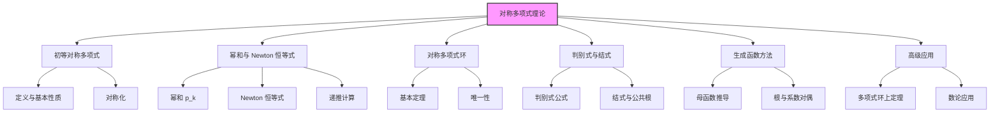

# 对称多项式与牛顿恒等式深化

> [!abstract] 概述
> 本文系统讨论对称多项式理论及其在数学竞赛中的应用，涵盖 ==初等对称多项式==、==幂和表示==、==Newton 恒等式==、==对称多项式环结构==、==判别式与结式==、==母函数与生成函数方法== 等核心内容。本文是 [[多项式与方程]] 的深化与扩展。

## 目录

## 一、初等对称多项式

### 1.1 定义与记号

> [!IMPORTANT] 初等对称多项式
> 对 $n$ 个变量 $x_1, x_2, \ldots, x_n$，第 $k$ 个初等对称多项式定义为
> $$e_k(x_1, \ldots, x_n) = \sum_{1 \le i_1 < i_2 < \cdots < i_k \le n} x_{i_1} x_{i_2} \cdots x_{i_k}$$
> 特别地 $e_0 = 1$，$e_1 = \sum x_i$，$e_n = x_1 x_2 \cdots x_n$。

### 1.2 与多项式根的关系

若 $n$ 次多项式 $f(x) = x^n + c_1 x^{n-1} + \cdots + c_n$ 的根为 $r_1, \ldots, r_n$，则
$$c_k = (-1)^k e_k(r_1, \ldots, r_n)$$

这是 Vieta 定理的一般形式，将多项式系数与根的对称多项式建立一一对应。

### 1.3 三元情形

对 $a, b, c$：
- $e_1 = a + b + c$
- $e_2 = ab + bc + ca$
- $e_3 = abc$

记号约定：在竞赛中常用 $p = e_1$, $q = e_2$, $r = e_3$ 或 $s, p, q$ 等。本文统一使用 $e_1, e_2, e_3$。

## 二、幂和与 Newton 恒等式

### 2.1 幂和定义

> [!IMPORTANT] 幂和
> $$p_k(x_1, \ldots, x_n) = \sum_{i=1}^n x_i^k$$
> 特别地 $p_0 = n$，$p_1 = e_1$。

### 2.2 Newton 恒等式（核心定理）

> [!IMPORTANT] Newton 恒等式
> 对 $k \ge 1$：
> $$p_k - e_1 p_{k-1} + e_2 p_{k-2} - \cdots + (-1)^{k-1} e_{k-1} p_1 + (-1)^k k e_k = 0 \quad (k \le n)$$
> 当 $k > n$ 时：
> $$p_k - e_1 p_{k-1} + e_2 p_{k-2} - \cdots + (-1)^n e_n p_{k-n} = 0$$

### 2.3 三元 Newton 恒等式

对 $a, b, c$：
- $k=1$: $p_1 = e_1$
- $k=2$: $p_2 = e_1 p_1 - 2e_2 = e_1^2 - 2e_2$
- $k=3$: $p_3 = e_1 p_2 - e_2 p_1 + 3e_3 = e_1^3 - 3e_1 e_2 + 3e_3$
- $k=4$: $p_4 = e_1 p_3 - e_2 p_2 + e_3 p_1 = e_1^4 - 4e_1^2 e_2 + 2e_2^2 + 4e_1 e_3$
- $k=5$: $p_5 = e_1 p_4 - e_2 p_3 + e_3 p_2$
- 一般 $k \ge 4$: $p_k = e_1 p_{k-1} - e_2 p_{k-2} + e_3 p_{k-3}$

### 2.4 Newton 恒等式的证明

**证明**：对每个根 $r_i$，由 $f(r_i) = 0$ 得
$$r_i^n + c_1 r_i^{n-1} + \cdots + c_n = 0$$

乘以 $r_i^{k-n}$（$k \ge n$）：
$$r_i^k + c_1 r_i^{k-1} + \cdots + c_n r_i^{k-n} = 0$$

对 $i = 1, \ldots, n$ 求和：
$$p_k + c_1 p_{k-1} + \cdots + c_n p_{k-n} = 0$$

代入 $c_j = (-1)^j e_j$ 即得 Newton 恒等式（$k > n$ 情形）。

对 $k \le n$ 的情形，需更精细分析，参见 [[多项式与方程]]。

### 2.5 应用：已知 $e_1, e_2, e_3$ 求高次幂和

**例**：设 $a+b+c = 3$, $ab+bc+ca = 3$, $abc = 1$，求 $a^5 + b^5 + c^5$。

由 Newton 恒等式：
- $p_1 = 3$
- $p_2 = 9 - 6 = 3$
- $p_3 = 27 - 27 + 3 = 3$
- $p_4 = 81 - 54 + 6 + 12 = 45$... 应为 $p_4 = e_1 p_3 - e_2 p_2 + e_3 p_1 = 3 \cdot 3 - 3 \cdot 3 + 1 \cdot 3 = 3$
- $p_5 = e_1 p_4 - e_2 p_3 + e_3 p_2 = 3 \cdot 3 - 3 \cdot 3 + 1 \cdot 3 = 3$

故 $a^5 + b^5 + c^5 = 3$。

> [!NOTE] 注释
> 实际上 $a, b, c$ 是 $x^3 - 3x^2 + 3x - 1 = (x-1)^3 = 0$ 的根，即 $a = b = c = 1$。

## 三、对称多项式环

### 3.1 对称多项式基本定理

> [!IMPORTANT] 对称多项式基本定理
> 任意对称多项式 $f(x_1, \ldots, x_n)$ 都可以唯一地表示为初等对称多项式 $e_1, \ldots, e_n$ 的多项式。即
> $$f(x_1, \ldots, x_n) = g(e_1, \ldots, e_n)$$
> 其中 $g$ 是唯一的。

### 3.2 对称化算法

给定对称多项式 $f$，如何求 $g$ 使得 $f = g(e_1, \ldots, e_n)$？

**算法步骤**：
1. 将 $f$ 按字典序排列单项式
2. 取最高次单项式 $c \cdot x_1^{a_1} x_2^{a_2} \cdots x_n^{a_n}$（$a_1 \ge a_2 \ge \cdots \ge a_n$）
3. 减去 $c \cdot e_1^{a_1 - a_2} e_2^{a_2 - a_3} \cdots e_{n-1}^{a_{n-1} - a_n} e_n^{a_n}$
4. 重复直到为零

**例**：将 $a^2 + b^2 + c^2$ 用 $e_1, e_2, e_3$ 表示。

最高次项 $a^2$，对应 $e_1^{2-0} = e_1^2$。计算 $a^2 + b^2 + c^2 - e_1^2 = -2(ab+bc+ca) = -2e_2$。

故 $a^2 + b^2 + c^2 = e_1^2 - 2e_2$。

### 3.3 三元对称多项式的标准基

任意三元对称多项式可表为 $e_1, e_2, e_3$ 的多项式。常用基：
- $\sum a^k = p_k$
- $\sum_{\text{sym}} a^i b^j c^k$
- $\sum_{\text{cyc}} a^i b^j$（轮换和）

### 3.4 齐次对称多项式的次数

若 $f$ 是 $n$ 元 $d$ 次齐次对称多项式，则 $f = g(e_1, \ldots, e_n)$，其中 $g$ 关于 $e_k$ 是加权齐次的（$e_k$ 权重为 $k$）。

## 四、判别式与结式

### 4.1 判别式

> [!IMPORTANT] 判别式
> 多项式 $f(x) = \prod (x - r_i)$ 的判别式定义为
> $$\Delta(f) = \prod_{i < j} (r_i - r_j)^2$$
> 判别式可用初等对称多项式表示，且 $\Delta = 0$ 当且仅当 $f$ 有重根。

### 4.2 二次与三次判别式

**二次** $x^2 + bx + c$：$\Delta = b^2 - 4c$

**三次** $x^3 + px + q$（已简化）：$\Delta = -4p^3 - 27q^2$

**一般三次** $x^3 + ax^2 + bx + c$：
$$\Delta = a^2 b^2 - 4b^3 - 4a^3 c + 18abc - 27c^2$$

### 4.3 判别式与根的分布

> [!IMPORTANT] 实根判定
> - $\Delta > 0$：所有根为实数且互异
> - $\Delta = 0$：有重根
> - $\Delta < 0$：有一对共轭复根和一个实根

### 4.4 结式（Resultant）

> [!IMPORTANT] 结式
> 多项式 $f(x) = a_n \prod (x - r_i)$ 和 $g(x) = b_m \prod (x - s_j)$ 的结式为
> $$\text{Res}(f, g) = a_n^m b_m^n \prod_{i,j} (r_i - s_j)$$
> $\text{Res}(f, g) = 0$ 当且仅当 $f$ 和 $g$ 有公共根。

### 4.5 结式的行列式表示

$$\text{Res}(f, g) = \begin{vmatrix} a_n & a_{n-1} & \cdots & & \\ & a_n & a_{n-1} & \cdots & \\ & & \ddots & & \\ b_m & b_{m-1} & \cdots & & \\ & b_m & b_{m-1} & \cdots & \\ & & \ddots & & \end{vmatrix}$$

这是 Sylvester 矩阵的行列式。

### 4.6 应用：判别式与结式的关系

$$\Delta(f) = \frac{(-1)^{n(n-1)/2}}{a_n} \text{Res}(f, f')$$

## 五、生成函数方法

### 5.1 幂和的生成函数

> [!IMPORTANT] 幂和与初等对称多项式的生成函数关系
> $$\sum_{k=0}^{\infty} \frac{p_k}{k!} t^k = \sum_{i=1}^n e^{x_i t}$$
> 
> $$\sum_{k=0}^{\infty} (-1)^k e_k t^k = \prod_{i=1}^n (1 - x_i t)$$
> 
> 两者的关系由 Newton 恒等式建立。

### 5.2 累积量与幂和

$$\ln\left(\prod_{i=1}^n \frac{1}{1 - x_i t}\right) = \sum_{k=1}^{\infty} \frac{p_k}{k} t^k$$

这给出了幂和与初等对称多项式的另一种联系。

### 5.3 应用：用生成函数推导 Newton 恒等式

由 $\prod (1 - x_i t) = \sum (-1)^k e_k t^k$，两边取对数求导：
$$-\sum_{i=1}^n \frac{x_i}{1 - x_i t} = \frac{d}{dt} \ln\left(\sum (-1)^k e_k t^k\right)$$

左边 $= -\sum_{k=0}^{\infty} p_{k+1} t^k$。比较系数即得 Newton 恒等式。

## 六、对称多项式在不等式中的应用

### 6.1 Schur 不等式的对称多项式表示

Schur $r=1$: $\sum a(a-b)(a-c) \ge 0$，展开为
$$p_3 - e_1 p_2 + 3 e_3 \ge 0$$
即 $p_3 \ge e_1 p_2 - 3 e_3$。代入 $p_2 = e_1^2 - 2e_2$, $p_3 = e_1^3 - 3 e_1 e_2 + 3 e_3$：
$$e_1^3 - 4 e_1 e_2 + 9 e_3 \ge 0$$

### 6.2 三元不等式的 uvw 表示

任意三元对称齐次不等式 $F(a,b,c) \ge 0$ 可表为 $G(e_1, e_2, e_3) \ge 0$。若 $G$ 关于 $e_3$ 的次数 $\le 2$，则可使用 [[高级不等式理论#二、uvw 方法深入|uvw 方法]]。

### 6.3 经典不等式的对称多项式推导

**Maclaurin**：$\left(\dfrac{e_k}{\binom{n}{k}}\right)^{1/k}$ 递减，由 Newton 不等式直接推出。

**Newton**：$e_k^2 \ge \dfrac{(k+1)(n-k+1)}{k(n-k)} e_{k-1} e_{k+1}$，可用对称多项式理论证明。

## 七、竞赛级题目精选

### 题 1（CMO 级别）

设 $a, b, c$ 为 $x^3 - 7x^2 + 11x - 5 = 0$ 的三根，求 $a^4 + b^4 + c^4$。

**解**：由 Vieta: $e_1 = 7$, $e_2 = 11$, $e_3 = 5$。

Newton 恒等式：
- $p_1 = 7$
- $p_2 = 49 - 22 = 27$
- $p_3 = 7 \cdot 27 - 11 \cdot 7 + 3 \cdot 5 = 189 - 77 + 15 = 127$
- $p_4 = 7 \cdot 127 - 11 \cdot 27 + 5 \cdot 7 = 889 - 297 + 35 = 627$

故 $a^4 + b^4 + c^4 = 627$。

### 题 2（IMO 短期）

设 $a, b, c, d$ 是方程 $x^4 - x^3 - x^2 - x - 1 = 0$ 的四个根，求 $a^5 + b^5 + c^5 + d^5$。

**解**：由 Vieta: $e_1 = 1, e_2 = -1, e_3 = 1, e_4 = -1$。

由根满足 $x_i^4 = x_i^3 + x_i^2 + x_i + 1$，乘以 $x_i$ 求和：
$$p_5 = p_4 + p_3 + p_2 + p_1$$

递推计算：
- $p_1 = 1$
- $p_2 = e_1^2 - 2e_2 = 1 + 2 = 3$
- $p_3 = e_1 p_2 - e_2 p_1 + 3 e_3 = 3 + 1 + 3 = 7$
- $p_4 = e_1 p_3 - e_2 p_2 + e_3 p_1 - 4 e_4$... 

实际上对 $n=4$，$k=4$ 的 Newton 恒等式：
$$p_4 - e_1 p_3 + e_2 p_2 - e_3 p_1 + 4 e_4 = 0$$
$$p_4 = 7 - 3 + 1 + 4 = 9$$

或者用 $p_4 = p_3 + p_2 + p_1 + 4 = 7 + 3 + 1 + 4$... 

更直接：由 $x_i^4 = x_i^3 + x_i^2 + x_i + 1$，求和 $p_4 = p_3 + p_2 + p_1 + 4 = 7 + 3 + 1 + 4 = 15$。

继续 $p_5 = p_4 + p_3 + p_2 + p_1 = 15 + 7 + 3 + 1 = 26$。

### 题 3（Putnam）

设 $P(x) = x^n + a_{n-1} x^{n-1} + \cdots + a_0$ 是实系数多项式，根为 $r_1, \ldots, r_n$。证明
$$\sum_{i=1}^n r_i^2 \ge \frac{a_{n-1}^2 - 2 n a_{n-2}}{1}$$

**证**：$\sum r_i^2 = p_2 = e_1^2 - 2 e_2 = a_{n-1}^2 - 2 a_{n-2}$，恰好等于右边。

### 题 4（TST）

设 $a, b, c$ 满足 $a+b+c=0$, $a^2+b^2+c^2=6$, $a^3+b^3+c^3=10$，求 $a^5+b^5+c^5$。

**解**：$e_1 = 0$, $e_2 = (e_1^2 - p_2)/2 = -3$, $e_3 = (p_3 - e_1 p_2 + e_2 p_1)/3 = 10/3$... 

由 Newton: $p_3 = 3 e_3 = 10$，故 $e_3 = 10/3$。

$p_4 = e_1 p_3 - e_2 p_2 + e_3 p_1 = 0 - (-3)(6) + 0 = 18$

$p_5 = e_1 p_4 - e_2 p_3 + e_3 p_2 = 0 - (-3)(10) + (10/3)(6) = 30 + 20 = 50$

故 $a^5 + b^5 + c^5 = 50$。

### 题 5（高级对称化）

设 $a, b, c, d$ 为实数，$a+b+c+d = 0$, $a^2+b^2+c^2+d^2 = 1$，求 $a^4+b^4+c^4+d^4$ 的最小值。

**分析**：$e_1 = 0$, $p_2 = 1$, $e_2 = (e_1^2 - p_2)/2 = -1/2$。

由幂平均 $p_4 \ge p_2^2 / n = 1/4$（$n=4$），等号当 $a^2 = b^2 = c^2 = d^2 = 1/4$，即 $|a| = |b| = |c| = |d| = 1/2$ 时取到。

由 $a+b+c+d=0$，可取 $a = b = 1/2$, $c = d = -1/2$，此时 $p_4 = 4 \cdot 1/16 = 1/4$。

最小值 $= 1/4$。

## 八、对称多项式与数论

### 8.1 联系数论函数

许多数论函数的运算本质上是对称多项式的应用：
- $\sigma_k(n) = \sum_{d|n} d^k$ 是 $n$ 的因数的 $k$ 次幂和
- $\varphi(n)$, $\mu(n)$ 等通过 Möbius 反演与对称多项式联系

详见 [[特殊数列的数论性质]]。

### 8.2 多项式同余与对称性

> [!IMPORTANT] Newton 恒等式在模算术中的推广
> Newton 恒等式在 $\mathbb{Z}/p\mathbb{Z}$ 上仍成立，且 $p \mid k$ 时 $k e_k$ 项消失，给出特殊的递推关系。
> 这与 [[组合数论：卢卡斯与库默尔]] 中的 $p$-adic 分析相关。

### 8.3 多项式根与代数整数

若 $f$ 是整系数多项式且有整数根 $r_1, \ldots, r_n$，则 $e_k(r_1, \ldots, r_n)$ 都是整数。这是代数整数环的基本性质。

## 九、高级专题

### 9.1 Schur 多项式

Schur 多项式是对称多项式的高级推广，与表示论和组合学紧密相关。它们定义为
$$s_\lambda(x_1, \ldots, x_n) = \frac{\det(x_i^{\lambda_j + n - j})}{\det(x_i^{n-j})}$$
其中 $\lambda$ 是分割。

### 9.2 Hall-Littlewood 多项式

Schur 多项式的进一步推广，与模表示论相关。

### 9.3 对称函数环 $\Lambda$

对称函数环 $\Lambda$ 是关于无穷多个变量的对称多项式环的形式完备化。它是代数组合学的核心对象。

## 十、方法速查表

| 方法 | 适用场景 | 关键公式 |
|------|----------|----------|
| Newton 恒等式 | 已知 $e_k$ 求 $p_k$ 或反之 | $p_k = \sum (-1)^{i-1} e_i p_{k-i}$ |
| 对称化算法 | 对称多项式用 $e_k$ 表示 | 字典序消元 |
| 判别式 | 重根判定 | $\Delta = \prod (r_i - r_j)^2$ |
| 结式 | 公共根判定 | $\text{Res} = \prod (r_i - s_j)$ |
| 生成函数 | 推导 Newton 恒等式 | $\ln \prod (1 - x_i t) = -\sum p_k t^k/k$ |
| Schur-SOS | 三元对称不等式 | [[高级不等式理论]] |
| 幂平均 | 一般幂和比较 | $M_r \ge M_s$ |
| Vandermonde 行列式 | 多项式插值 | $\prod (x_j - x_i)$ |

## 竞赛备战清单

> [!tip] 一试/二试/CMO/IMO 级别对称多项式
> - **一试**：Vieta 定理、二元/三元 Newton 恒等式、判别式
> - **二试**：三元 Newton 恒等式系统、对称化算法、结式
> - **CMO/IMO**：高次幂和递推、生成函数推导、对称多项式环结构
> - **TST/Putnam**：Schur 多项式、对称函数环、与代数数论结合

## 相关链接

- [[多项式与方程]]
- [[不等式与最值问题]]
- [[高级不等式理论]]
- [[数列与递推方法]]
- [[特殊数列的数论性质]]
- [[组合数论：卢卡斯与库默尔]]
- [[二次型理论]]
- [[对称群与Pólya计数]] — 对称多项式与群作用的组合应用
- [[组合恒等式与生成函数]] — 生成函数法处理对称多项式恒等式
- [[设计与编码理论初步]] — 对称设计中的不变量理论
- [[矩阵与线性代数初步]]
- [[代数题目集]]
