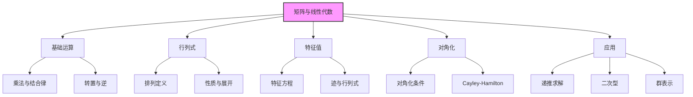

# 矩阵与线性代数初步

> [!abstract] 概述
> 本文系统介绍矩阵与线性代数在数学竞赛中的应用，包括 ==矩阵运算与行列式==、==特征值与特征向量==、==矩阵对角化==、==Cayley-Hamilton 定理==、==线性递推的矩阵法==、==二次型==、==群与表示初步== 等。本文是 [[数列与递推方法]] 和 [[迭代与函数方程]] 中矩阵方法的深化。

## 目录

## 一、矩阵基础

### 1.1 矩阵定义与运算

> [!IMPORTANT] 矩阵基础
> - **加法**：对应元素相加
> - **数乘**：每个元素乘以标量
> - **乘法**：$(AB)_{ij} = \sum_k A_{ik} B_{kj}$，注意 ==不满足交换律==
> - **转置**：$A^T$ 满足 $(A^T)_{ij} = A_{ji}$
> - **单位矩阵** $I$：$AI = IA = A$

### 1.2 矩阵乘法的性质

- **结合律**：$(AB)C = A(BC)$
- **分配律**：$A(B+C) = AB + AC$
- **转置**：$(AB)^T = B^T A^T$
- ==不满足交换律==：$AB \neq BA$（一般情况下）
- ==不满足消去律==：$AB = AC$ 不蕴含 $B = C$（除非 $A$ 可逆）

### 1.3 逆矩阵

> [!IMPORTANT] 逆矩阵
> 方阵 $A$ 可逆当且仅当 $\det A \neq 0$。逆矩阵满足 $A A^{-1} = A^{-1} A = I$。
> - $(AB)^{-1} = B^{-1} A^{-1}$
> - $(A^{-1})^T = (A^T)^{-1}$
> - $(A^{-1})^{-1} = A$

### 1.4 矩阵与分式线性变换

> [!IMPORTANT] 矩阵与分式线性变换对应
> 矩阵 $M = \begin{pmatrix} a & b \\ c & d \end{pmatrix}$ 对应分式线性变换 $f(x) = \dfrac{ax+b}{cx+d}$。
> - 矩阵乘法对应变换复合：$f \circ g \leftrightarrow MN$
> - 行列式 $|M| = ad - bc \neq 0$ 时变换可逆
> - $M$ 与 $kM$（$k \neq 0$）对应同一变换

这一对应在 [[迭代与函数方程]] 中处理分式线性迭代时极为重要。

## 二、行列式

### 2.1 行列式的定义

> [!IMPORTANT] 行列式
> $n$ 阶方阵 $A = (a_{ij})$ 的行列式
> $$\det A = \sum_{\sigma \in S_n} \text{sgn}(\sigma) \prod_{i=1}^n a_{i, \sigma(i)}$$
> 其中 $S_n$ 是 $n$ 阶对称群，$\text{sgn}(\sigma)$ 是排列的符号。

### 2.2 行列式的性质

1. **转置不变**：$\det A^T = \det A$
2. **行/列线性**：某行乘 $k$，行列式乘 $k$
3. **行/列可加**：拆分某行可拆分行列式
4. **行/列交换**：交换两行，行列式变号
5. **行/列倍加**：某行加另一行的 $k$ 倍，行列式不变
6. **乘积**：$\det(AB) = \det A \cdot \det B$
7. **三角矩阵**：$\det = $ 对角元素之积

### 2.3 二阶与三阶行列式

$$\begin{vmatrix} a & b \\ c & d \end{vmatrix} = ad - bc$$

$$\begin{vmatrix} a & b & c \\ d & e & f \\ g & h & i \end{vmatrix} = aei + bfg + cdh - ceg - bdi - afh$$

### 2.4 Vandermonde 行列式

> [!IMPORTANT] Vandermonde 行列式
> $$V(x_1, \ldots, x_n) = \begin{vmatrix} 1 & x_1 & x_1^2 & \cdots & x_1^{n-1} \\ 1 & x_2 & x_2^2 & \cdots & x_2^{n-1} \\ \vdots & & & & \vdots \\ 1 & x_n & x_n^2 & \cdots & x_n^{n-1} \end{vmatrix} = \prod_{1 \le i < j \le n} (x_j - x_i)$$

### 2.5 应用：Lagrange 插值的矩阵解释

Lagrange 插值本质上是求解 Vandermonde 方程组 $V \vec{c} = \vec{y}$，其中 $\vec{c}$ 是多项式系数。详见 [[多项式与方程]]。

## 三、特征值与特征向量

### 3.1 定义

> [!IMPORTANT] 特征值与特征向量
> 对方阵 $A$，若存在非零向量 $\vec{v}$ 和标量 $\lambda$ 使 $A\vec{v} = \lambda \vec{v}$，则称 $\lambda$ 为 $A$ 的特征值，$\vec{v}$ 为对应的特征向量。

### 3.2 特征方程

$\det(A - \lambda I) = 0$ 是 $A$ 的特征方程。对 $n$ 阶矩阵，这是 $\lambda$ 的 $n$ 次多项式。

### 3.3 迹与行列式

> [!IMPORTANT] 迹与特征值
> - $\text{tr}(A) = \sum \lambda_i$（特征值之和）
> - $\det A = \prod \lambda_i$（特征值之积）

### 3.4 二阶矩阵的特征值

$A = \begin{pmatrix} a & b \\ c & d \end{pmatrix}$ 的特征方程：
$$\lambda^2 - (a+d)\lambda + (ad - bc) = 0$$

即 $\lambda^2 - \text{tr}(A) \lambda + \det(A) = 0$。

### 3.5 应用：Fibonacci 数列的矩阵解法

设 $F_{n+1} = F_n + F_{n-1}$，写作矩阵形式：
$$\begin{pmatrix} F_{n+1} \\ F_n \end{pmatrix} = \begin{pmatrix} 1 & 1 \\ 1 & 0 \end{pmatrix} \begin{pmatrix} F_n \\ F_{n-1} \end{pmatrix}$$

记 $M = \begin{pmatrix} 1 & 1 \\ 1 & 0 \end{pmatrix}$，则
$$\begin{pmatrix} F_{n+1} \\ F_n \end{pmatrix} = M^n \begin{pmatrix} F_1 \\ F_0 \end{pmatrix} = M^n \begin{pmatrix} 1 \\ 0 \end{pmatrix}$$

$M$ 的特征值：$\lambda^2 - \lambda - 1 = 0$，$\lambda = \dfrac{1 \pm \sqrt{5}}{2}$（黄金比例 $\phi$ 与 $\hat\phi$）。

对角化 $M = P D P^{-1}$，其中 $D = \text{diag}(\phi, \hat\phi)$，得
$$M^n = P \begin{pmatrix} \phi^n & 0 \\ 0 & \hat\phi^n \end{pmatrix} P^{-1}$$

最终 $F_n = \dfrac{\phi^n - \hat\phi^n}{\sqrt{5}}$。详见 [[数列与递推方法]]。

## 四、矩阵对角化

### 4.1 对角化条件

> [!IMPORTANT] 可对角化条件
> $n$ 阶矩阵 $A$ 可对角化当且仅当 $A$ 有 $n$ 个线性无关的特征向量。等价地：
> - $A$ 有 $n$ 个不同的特征值，或
> - 每个特征值的几何重数等于代数重数

### 4.2 对角化过程

1. 求 $A$ 的特征值 $\lambda_1, \ldots, \lambda_n$
2. 对每个 $\lambda_i$，求特征向量 $\vec{v}_i$
3. 构造 $P = (\vec{v}_1, \ldots, \vec{v}_n)$
4. 则 $A = P D P^{-1}$，其中 $D = \text{diag}(\lambda_1, \ldots, \lambda_n)$
5. $A^n = P D^n P^{-1}$

### 4.3 Cayley-Hamilton 定理

> [!IMPORTANT] Cayley-Hamilton 定理
> 方阵 $A$ 满足其特征方程。即若 $p(\lambda) = \det(\lambda I - A) = \lambda^n + c_{n-1}\lambda^{n-1} + \cdots + c_0$，则
> $$p(A) = A^n + c_{n-1} A^{n-1} + \cdots + c_0 I = 0$$

**应用**：可以用低次幂表示高次幂。例如 $A^2 = 3A - 2I$，则 $A^n$ 可表为 $A$ 与 $I$ 的线性组合。

### 4.4 应用：常系数线性递推的矩阵解法

设有 $k$ 阶常系数线性递推
$$a_{n+k} = c_1 a_{n+k-1} + c_2 a_{n+k-2} + \cdots + c_k a_n$$

将其写为矩阵形式
$$\begin{pmatrix} a_{n+k} \\ a_{n+k-1} \\ \vdots \\ a_{n+1} \end{pmatrix} = \begin{pmatrix} c_1 & c_2 & \cdots & c_k \\ 1 & 0 & \cdots & 0 \\ \vdots & & \ddots & \\ 0 & \cdots & 1 & 0 \end{pmatrix} \begin{pmatrix} a_{n+k-1} \\ a_{n+k-2} \\ \vdots \\ a_n \end{pmatrix}$$

记此矩阵为 $M$（==友矩阵== / Companion matrix），则
$$\vec{a}_n = M^n \vec{a}_0$$

对 $M$ 对角化即可求得通项。$M$ 的特征方程恰好是递推的特征方程。

## 五、二次型

### 5.1 二次型定义

> [!IMPORTANT] 二次型
> 二次型是形如 $Q(\vec{x}) = \vec{x}^T A \vec{x} = \sum_{i,j} a_{ij} x_i x_j$ 的二次齐次多项式，其中 $A$ 是对称矩阵。

### 5.2 矩阵表示

$$Q(x, y) = ax^2 + 2bxy + cy^2 = \begin{pmatrix} x & y \end{pmatrix} \begin{pmatrix} a & b \\ b & c \end{pmatrix} \begin{pmatrix} x \\ y \end{pmatrix}$$

### 5.3 标准化

> [!IMPORTANT] 二次型的对角化
> 通过正交变换 $\vec{x} = P\vec{y}$（$P$ 是正交矩阵），可将二次型化为标准形
> $$Q = \lambda_1 y_1^2 + \lambda_2 y_2^2 + \cdots + \lambda_n y_n^2$$
> 其中 $\lambda_i$ 是 $A$ 的特征值。

### 5.4 正定性

> [!IMPORTANT] 正定判定
> 二次型 $Q$ 正定（$Q > 0$ 对所有 $\vec{x} \neq 0$）当且仅当：
> - 所有特征值 $> 0$，或
> - 所有顺序主子式 $> 0$（Sylvester 判定）

### 5.5 应用：二次型与不等式

**例**：证明 $a^2 + b^2 + c^2 \ge ab + bc + ca$。

考虑二次型 $Q = a^2 + b^2 + c^2 - ab - bc - ca$，对应矩阵
$$A = \begin{pmatrix} 1 & -1/2 & -1/2 \\ -1/2 & 1 & -1/2 \\ -1/2 & -1/2 & 1 \end{pmatrix}$$

特征值 $\lambda_1 = 0$（对应 $\vec{v}_1 = (1,1,1)$），$\lambda_2 = \lambda_3 = 3/2$（二重）。故 $Q$ 半正定，$Q \ge 0$。

### 5.6 二次数论联系

二次型理论在数论中研究整数表示问题：哪些整数 $n$ 可表为 $Q(\vec{x}) = n$（$\vec{x} \in \mathbb{Z}^n$）？详见 [[二次型理论]]。

## 六、矩阵在数论中的应用

### 6.1 矩阵的模算术

矩阵运算在 $\mathbb{Z}/m\mathbb{Z}$ 上仍成立。许多数论问题用矩阵表示后变得简洁。

**例**：Fibonacci 数列模 $m$ 的周期（Pisano 周期）可通过矩阵 $M = \begin{pmatrix} 1 & 1 \\ 1 & 0 \end{pmatrix}$ 在 $\mathbb{Z}/m\mathbb{Z}$ 上的阶刻画。

### 6.2 矩阵与生成函数

数列 $\{a_n\}$ 的生成函数 $A(x) = \sum a_n x^n$ 在线性递推下可由矩阵表示：
$$A(x) = \frac{P(x)}{Q(x)}$$
其中 $Q(x) = 1 - c_1 x - c_2 x^2 - \cdots - c_k x^k$，$P$ 由初始条件决定。

### 6.3 矩阵与组合计数

> [!IMPORTANT] 转移矩阵法
> 图的邻接矩阵 $A$ 满足：$(A^n)_{ij}$ = 从 $i$ 到 $j$ 长度为 $n$ 的路径数。这是 [[组合数论：卢卡斯与库默尔|组合计数]] 的重要工具。

## 七、群与表示初步

### 7.1 群的定义

> [!IMPORTANT] 群
> 集合 $G$ 配合运算 $\cdot$ 构成群，若满足：
> 1. 封闭性：$a, b \in G \Rightarrow a \cdot b \in G$
> 2. 结合律：$(a \cdot b) \cdot c = a \cdot (b \cdot c)$
> 3. 单位元：存在 $e$ 使 $e \cdot a = a \cdot e = a$
> 4. 逆元：对每个 $a$ 存在 $a^{-1}$ 使 $a \cdot a^{-1} = e$

### 7.2 矩阵群

- **一般线性群 $GL_n(\mathbb{R})$**：所有 $n$ 阶可逆实矩阵
- **特殊线性群 $SL_n(\mathbb{R})$**：行列式为 $1$ 的矩阵
- **正交群 $O(n)$**：$A^T A = I$
- **特殊正交群 $SO(n)$**：$SO(n) = O(n) \cap SL_n(\mathbb{R})$，旋转群

### 7.3 群在分式线性变换中的应用

二阶可逆矩阵在等价关系 $A \sim kA$（$k \neq 0$）下的等价类构成 ==射影线性群 $PGL_2(\mathbb{R})$==，对应所有实分式线性变换。详见 [[迭代与函数方程]]。

### 7.4 群表示论

群的表示是将群元素映射为矩阵，使得群运算对应矩阵乘法。这是 [[复数与向量方法]] 中 Fourier 变换和单位根理论的抽象框架。

## 八、高级专题

### 8.1 Jordan 标准型

不可对角化的矩阵可通过相似变换化为 Jordan 标准型：
$$J = \begin{pmatrix} J_1 & & \\ & J_2 & \\ & & \ddots \end{pmatrix}, \quad J_i = \begin{pmatrix} \lambda_i & 1 & & \\ & \lambda_i & \ddots & \\ & & \ddots & 1 \\ & & & \lambda_i \end{pmatrix}$$

### 8.2 奇异值分解（SVD）

任意矩阵 $A$ 可分解为 $A = U \Sigma V^T$，其中 $U, V$ 是正交矩阵，$\Sigma$ 是对角矩阵。

### 8.3 最小多项式

使 $m(A) = 0$ 的最低次多项式 $m(\lambda)$ 称为 $A$ 的最小多项式。最小多项式整除特征多项式。

## 九、竞赛级题目精选

### 题 1（Fibonacci 矩阵）

设 $F_n$ 是 Fibonacci 数列，证明 $F_{n+1} F_{n-1} - F_n^2 = (-1)^n$。

**证明**：矩阵 $M = \begin{pmatrix} 1 & 1 \\ 1 & 0 \end{pmatrix}$，$M^n = \begin{pmatrix} F_{n+1} & F_n \\ F_n & F_{n-1} \end{pmatrix}$。

取行列式：$\det(M^n) = (\det M)^n = (-1)^n$，即 $F_{n+1} F_{n-1} - F_n^2 = (-1)^n$。$\square$

### 题 2（CMO 级别，递推矩阵）

设 $a_{n+2} = 6 a_{n+1} - 9 a_n$，$a_0 = 1$, $a_1 = 6$，求 $a_n$ 通项。

**解**：友矩阵 $M = \begin{pmatrix} 6 & -9 \\ 1 & 0 \end{pmatrix}$，特征方程 $\lambda^2 - 6\lambda + 9 = 0$，$\lambda = 3$（二重）。

此时 $M$ 不可对角化（仅一个特征向量），用 Jordan 标准型：
$$M = P \begin{pmatrix} 3 & 1 \\ 0 & 3 \end{pmatrix} P^{-1}$$
$$M^n = P \begin{pmatrix} 3^n & n \cdot 3^{n-1} \\ 0 & 3^n \end{pmatrix} P^{-1}$$

最终 $a_n = (1+n) \cdot 3^n$。

### 题 3（Putnam，矩阵不等式）

证明对任意实矩阵 $A \in \mathbb{R}^{n \times n}$，$|\text{tr}(A)| \le \sqrt{n \cdot \text{tr}(A^T A)}$。

**证明**：$A$ 的奇异值 $\sigma_1, \ldots, \sigma_n$ 满足 $\sum \sigma_i^2 = \text{tr}(A^T A)$。$|\text{tr}(A)| \le \sum |\lambda_i| \le \sum \sigma_i$，由 Cauchy-Schwarz $\le \sqrt{n \sum \sigma_i^2}$。

### 题 4（二次型优化）

设 $a^2 + b^2 + c^2 = 1$，求 $Q = 5a^2 + 5b^2 + 5c^2 + 2ab + 2bc + 2ca$ 的最大值。

**解**：$Q = \vec{x}^T A \vec{x}$，$A = \begin{pmatrix} 5 & 1 & 1 \\ 1 & 5 & 1 \\ 1 & 1 & 5 \end{pmatrix}$。

特征值：$\lambda_1 = 7$（$\vec{v} = (1,1,1)$），$\lambda_2 = \lambda_3 = 4$（二重）。

最大值 $= 7$，在 $a = b = c = 1/\sqrt{3}$ 时取得。

### 题 5（ISL，群论与组合）

设 $G$ 是 $n$ 阶有限群，$S \subseteq G$ 是生成集。证明任意 $g \in G$ 可表为 $S$ 中元素长度 $\le n-1$ 的乘积。

**分析**：考虑 Cayley 图，利用群作用和轨道公式。

## 十、方法速查表

| 方法 | 适用场景 | 关键公式 |
|------|----------|----------|
| 矩阵对角化 | 求 $M^n$ | $M = P D P^{-1}$ |
| Cayley-Hamilton | 矩阵多项式归约 | $p(M) = 0$ |
| Vandermonde 行列式 | 多项式插值 | $\prod (x_j - x_i)$ |
| 友矩阵 | 线性递推 | $\vec{a}_n = M^n \vec{a}_0$ |
| 二次型对角化 | 二次型优化 | $Q = \sum \lambda_i y_i^2$ |
| 正定判定 | 不等式证明 | 特征值/主子式 |
| Jordan 标准型 | 不可对角化情形 | $J = \bigoplus J_i$ |
| 转移矩阵法 | 组合计数 | $(A^n)_{ij}$ = 路径数 |

## 竞赛备战清单

> [!tip] 一试/二试/CMO/IMO 级别矩阵与线性代数
> - **一试**：二阶矩阵运算、行列式、线性方程组、简单特征值
> - **二试**：三阶行列式、Vandermonde、矩阵对角化、Fibonacci 矩阵法
> - **CMO/IMO**：Cayley-Hamilton、友矩阵、Jordan 标准型、二次型
> - **TST/Putnam**：群表示论、SVD、矩阵不等式、矩阵与组合数论结合

## 相关链接

- [[数列与递推方法]]
- [[迭代与函数方程]]
- [[多项式与方程]]
- [[不等式与最值问题]]
- [[二次型理论]]
- [[对称多项式与牛顿恒等式深化]]
- [[复数与向量方法]]
- [[高级图论与网络流]] — 矩阵树定理、邻接矩阵谱、LGV 引理与路径计数
- [[计数原理与方法]] — LGV 引理与行列式计数、Burnside 引理
- [[对称群与Pólya计数]] — 群表示论与循环指标
- [[设计与编码理论初步]] — Hadamard 矩阵与关联矩阵的秩
- [[组合恒等式与生成函数]] — 转移矩阵法与生成函数
- [[代数总论与函数方程]]
- [[代数题目集]]
