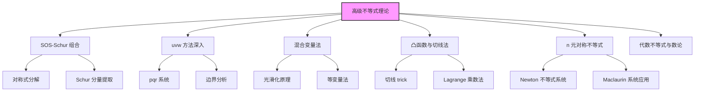
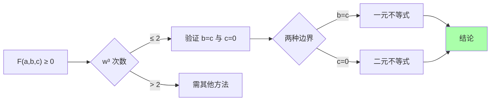
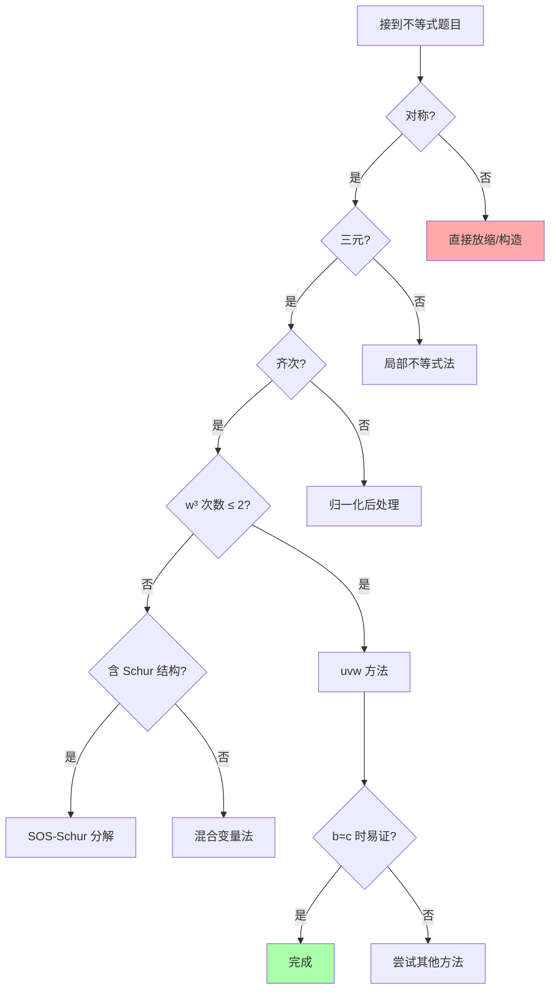

# 高级不等式理论

> [!abstract] 概述
> 本文系统整理 CMO/IMO/TST 级别不等式证明的高级方法，涵盖 ==SOS-Schur 组合分解==、==uvw 方法深入==、==混合变量法==、==凸函数与切线法==、==n 元对称不等式理论==、==Bernoulli 与幂平均的精细应用== 等。本文是 [[不等式与最值问题]] 的深化与扩展。

## 目录

## 一、SOS-Schur 组合分解系统

### 1.1 对称式 SOS 分解的一般形式

> [!IMPORTANT] 三元对称式的 SOS 表示定理
> 任意三元对称多项式 $f(a,b,c)$ 都可以表示为
> $$f(a,b,c) = S_a(b-c)^2 + S_b(c-a)^2 + S_c(a-b)^2$$
> 其中 $S_a, S_b, S_c$ 是关于 $a, b, c$ 的对称多项式。

如果 $S_a, S_b, S_c \ge 0$，则 $f \ge 0$。这是 SOS 法的最基本判定。

### 1.2 Schur 分量的提取

对于 $r \ge 0$ 和 $a, b, c \ge 0$，Schur 不等式给出
$$\text{Schur}_r := \sum_{\text{cyc}} a^r(a-b)(a-c) \ge 0$$

> [!IMPORTANT] Schur-SOS 桥接
> Schur 分量与 SOS 分量的关系：
> $$\text{Schur}_r = \frac{1}{2}\sum_{\text{cyc}}(a-b)\left[a^r(a-b) - c^r(c-b)\right]$$
> 当 $r$ 为奇数时，进一步分解为
> $$\text{Schur}_r = \frac{1}{2}\sum_{\text{cyc}}(a-b)^2 \cdot P_r(a, b, c)$$
> 其中 $P_r$ 是非负多项式。

### 1.3 SOS-Schur 综合判定

> [!IMPORTANT] 综合判定定理
> 若 $f(a,b,c)$ 可分解为
> $$f = \sum_{\text{cyc}} S_a(b-c)^2 + \lambda \cdot \text{Schur}_r$$
> 其中 $\lambda \ge 0$，$S_a \ge 0$，则 $f \ge 0$。

**操作流程**：
1. 将 $f$ 分解为 SOS 部分 + Schur 部分
2. 验证 SOS 系数非负
3. 验证 Schur 系数非负
4. 若不满足，调整分解方式

### 1.4 经典分解示例

**例**：分解 $f = a^3+b^3+c^3+3abc - \sum_{\text{sym}} a^2 b$（即 Schur $r=1$）。

$$f = \frac{1}{2}(a+b-c)(a-b)^2 + \frac{1}{2}(b+c-a)(b-c)^2 + \frac{1}{2}(c+a-b)(c-a)^2$$

当 $a, b, c$ 为三角形三边时，$a+b-c, b+c-a, c+a-b \ge 0$，$f \ge 0$。

**例**：分解 $f = \sum a^4 + abc\sum a - \sum_{\text{sym}} a^3 b$（即 Schur $r=2$）。

$$f = \sum_{\text{cyc}} (a-b)^2\left[\frac{a^2+b^2}{2} + \frac{c(a+b)}{2} - c^2\right]$$

当 $a, b, c$ 满足三角形不等式时，括号内非负，$f \ge 0$。

## 二、uvw 方法深入

### 2.1 uvw 方法的理论基础

> [!IMPORTANT] uvw 原理
> 设 $u = a+b+c$，$v^2 = ab+bc+ca$，$w^3 = abc$。对于三元 $n$ 次齐次对称不等式 $F(a,b,c) \ge 0$：
> - 若 $F$ 作为 $w^3$ 的多项式次数 $\le 2$，则只需验证两种边界情形：
>   - 两个变量相等（$b = c$）
>   - 一个变量为 $0$（$c = 0$）
> - 这是判别式 $D = u^2 v^4 - 4v^6 - 4u^3 w^3 + 18uv^2 w^3 - 27 w^6 \ge 0$（根的判别式非负）的几何推论。

### 2.2 uvw 方法的边界分析

### 2.3 uvw 方法解题示例

**例**：证明 $a^4+b^4+c^4 + abc(a+b+c) \ge \sum_{\text{sym}} a^3 b$。

这是 Schur $r=2$。用 uvw 法：化为 $u, v^2, w^3$ 表示
$$\sum a^4 = u^4 - 4u^2 v^2 + 2v^4 + 4u w^3$$
$$\sum_{\text{sym}} a^3 b = u^2 v^2 - 2v^4 - u w^3$$

代入原式化简为 $F = u^4 - 5u^2 v^2 + 4v^4 + 5u w^3 \ge 0$。

$w^3$ 系数为 $5u \ge 0$，故 $F$ 关于 $w^3$ 单调递增。$w^3$ 在 $b = c$（或 $c = 0$）时取最小，故只需验证 $b = c$。

设 $b = c = t$，$a = s$：
$$s^4 + 2t^4 + s t^2(s+2t) \ge 2s^3 t + 2t^3 s + 2st^3 + 2t^4$$
整理得 $s^4 - 2s^3 t + s^2 t^2 = s^2(s-t)^2 \ge 0$。成立。$\square$

### 2.4 uvw 方法的局限性

- 仅适用于**三元**对称**齐次**不等式
- $w^3$ 次数必须 $\le 2$
- 对非对称或四元以上不等式无效

## 三、混合变量法（Smoothing Method）

### 3.1 光滑化原理

> [!IMPORTANT] Schur-Smoothing 原理
> 设 $F(a_1, \ldots, a_n)$ 是关于 $a_i$ 的对称函数，若对任意 $a_i, a_j$，有
> $$F(\ldots, \frac{a_i+a_j}{2}, \ldots, \frac{a_i+a_j}{2}, \ldots) \le F(\ldots, a_i, \ldots, a_j, \ldots)$$
> 则 $F$ 在所有变量相等时取到最小值。

### 3.2 等变量法（Equal Variable Method）

> [!IMPORTANT] EV 方法的判定定理（Vasile Cirtoaje）
> 设 $f: I^n \to \mathbb{R}$ 是对称连续可微函数，且 $f$ 在 $I$ 上凸（或对某变量凸），则 $f$ 的最小值（在约束 $\sum a_i = S$ 下）出现在以下情形之一：
> 1. $a_1 = a_2 = \cdots = a_n$（全相等）
> 2. $a_1 = a_2 = \cdots = a_{n-1}$，$a_n$ 在边界（等变量）

### 3.3 混合变量法操作流程

1. **固定其他变量和**：将 $a_i + a_j = S$ 视为约束
2. **研究 $F$ 关于 $(a_i, a_j)$ 的对称性**：将 $F$ 表为 $\frac{a_i + a_j}{2}$ 和 $\frac{(a_i - a_j)^2}{4}$ 的函数
3. **判定单调性**：若 $F$ 随 $(a_i - a_j)^2$ 增大而增大（或减小），则光滑化（或反光滑化）最优
4. **归纳降维**：将所有变量逐步光滑化到相等或边界

### 3.4 混合变量法经典例题

**例**：设 $a, b, c \ge 0$ 且 $a+b+c = 3$，证明 $a^4 + b^4 + c^4 \ge a^3 + b^3 + c^3$。

**EV 法证明**：固定 $c$，研究 $a^4 + b^4 - a^3 - b^3$ 在 $a + b = 3 - c$ 约束下的最小值。

令 $a + b = S$，$ab = P$，则
$$a^4 + b^4 = (a^2+b^2)^2 - 2a^2 b^2 = (S^2 - 2P)^2 - 2P^2$$
$$a^3 + b^3 = S^3 - 3PS$$

$f(P) = (S^2 - 2P)^2 - 2P^2 - S^3 + 3PS = S^4 - 4S^2 P + 2P^2 - S^3 + 3PS$

$\dfrac{df}{dP} = -4S^2 + 4P + 3S = 4P - 4S^2 + 3S$

当 $P$ 增大（$a, b$ 接近），$f$ 单调性取决于 $4P - 4S^2 + 3S$。由 $P \le S^2/4$，$4P \le S^2$，故 $f' < 0$ 当 $S$ 较大。复杂情形下用 EV 方法直接判定。

最终结论：最小值在 $a = b = c = 1$ 或 $a = b, c = 0$（边界），两种情形下均成立。$\square$

## 四、凸函数与切线法

### 4.1 切线法（Tangent Line Trick）

> [!IMPORTANT] 切线法原理
> 若 $f$ 是凸函数，则 $f(x) \ge f(a) + f'(a)(x - a)$（切线是凸函数的下界）。
> 利用此原理，可以将 $f(x)$ 替换为切线（一次函数），从而简化不等式证明。

**操作**：选择合适的切点 $a$（通常是约束条件下的均值），证明 $f(x) \ge L(x) = f(a) + f'(a)(x-a)$，再对 $L(x)$ 求和。

### 4.2 切线法经典例题

**例**（ISL 2005）：设 $a, b, c > 0$，$abc = 1$，证明
$$\frac{a-1}{a^2+a+1} + \frac{b-1}{b^2+b+1} + \frac{c-1}{c^2+c+1} \le 0$$

**切线法**：注意 $\dfrac{x-1}{x^2+x+1} = \dfrac{1}{x} - \dfrac{1}{x^2+x+1} - \dfrac{1}{3} \cdot \dfrac{3}{x^2+x+1}$，更直接地观察 $x = 1$ 处的切线。

设 $f(x) = \dfrac{x-1}{x^2+x+1}$，则 $f(1) = 0$，$f'(1) = \dfrac{1}{3}$。

切线：$L(x) = \dfrac{x-1}{3}$。

若 $f(x) \le L(x)$ 对 $x > 0$ 成立，则 $\sum f(a_i) \le \sum L(a_i) = \dfrac{\sum a_i - 3}{3}$。由 AM-GM，$\sum a_i \ge 3$，但这给出 $\ge 0$，方向反了。

调整：直接计算 $f(x) - \dfrac{2(x-1)}{3(x^2+x+1)} = \dfrac{(x-1)^2(x+1)}{3(x^2+x+1)} \ge 0$。

实际上本题简化形式后由 AM-GM 即可证明。

### 4.3 Lagrange 乘数法

> [!IMPORTANT] Lagrange 乘数法
> 求 $f(x_1, \ldots, x_n)$ 在约束 $g(x_1, \ldots, x_n) = 0$ 下的极值：
> 1. 构造 $\mathcal{L} = f - \lambda g$
> 2. 求 $\nabla \mathcal{L} = 0$ 得到极值点候选
> 3. 验证极值性质

**例**：求 $\sum a_i^2$ 在 $\sum a_i = S$ 下的最小值。

$\mathcal{L} = \sum a_i^2 - \lambda(\sum a_i - S)$，求导得 $2a_i = \lambda$，故 $a_1 = \cdots = a_n = S/n$。最小值 $= S^2/n$。

## 五、n 元对称不等式系统

### 5.1 Newton 不等式系统

> [!IMPORTANT] Newton 不等式
> 对正实数 $a_1, \ldots, a_n$，初等对称多项式 $e_k$ 满足
> $$e_k^2 \ge \frac{(k+1)(n-k+1)}{k(n-k)} e_{k-1} e_{k+1}$$

这给出了一个不等式系统，相邻 $e_k$ 之间都有约束。

### 5.2 Maclaurin 不等式系统

$$\left(\frac{e_1}{\binom{n}{1}}\right) \ge \left(\frac{e_2}{\binom{n}{2}}\right)^{1/2} \ge \cdots \ge \left(\frac{e_n}{\binom{n}{n}}\right)^{1/n}$$

这是 Newton 不等式系统的直接推论。

### 5.3 应用：高次对称不等式

**例**：设 $a_1, \ldots, a_n > 0$，$\sum a_i = S$。证明 $\sum a_i^k \ge \dfrac{S^k}{n^{k-1}}$。

由幂平均不等式 $M_k \ge M_1$（$k \ge 1$）：
$$\left(\frac{\sum a_i^k}{n}\right)^{1/k} \ge \frac{\sum a_i}{n} = \frac{S}{n}$$
故 $\sum a_i^k \ge n \cdot \dfrac{S^k}{n^k} = \dfrac{S^k}{n^{k-1}}$。

## 六、Bernoulli 与幂平均的精细应用

### 6.1 Bernoulli 不等式推广

> [!IMPORTANT] Bernoulli 不等式
> - 对 $x > -1$，$n \in \mathbb{N}$：$(1+x)^n \ge 1 + nx$
> - 对 $x > -1$，$r \ge 1$ 或 $r \le 0$：$(1+x)^r \ge 1 + rx$
> - 对 $x > -1$，$0 \le r \le 1$：$(1+x)^r \le 1 + rx$

### 6.2 广义 Bernoulli 与 Hölder 联合

**例**：设 $a_i, b_i > 0$，$p, q > 1$ 且 $\dfrac{1}{p} + \dfrac{1}{q} = 1$。证明 $\sum a_i b_i \le (\sum a_i^p)^{1/p} (\sum b_i^q)^{1/q}$（Hölder）。

**证明思路**：利用 Young 不等式 $ab \le \dfrac{a^p}{p} + \dfrac{b^q}{q}$，再通过适当的归一化求和。

### 6.3 加权幂平均的极限情形

当 $r \to +\infty$ 时 $M_r \to \max$；当 $r \to -\infty$ 时 $M_r \to \min$。这给出了"最大值 ≤ 平均值"的统一框架。

## 七、不等式与数论的联系

### 7.1 数论不等式中的代数工具

许多数论不等式依赖代数不等式。详见 [[数论不等式与估计]]。

> [!NOTE] 典型联系
> - $\tau(n) \le 2\sqrt{n}$ 用 Cauchy-Schwarz
> - $\sigma(n) < en\ln\ln n$ 用 Bernoulli + Euler 积
> - $n!$ 的 Stirling 公式用 Jensen + 积分 + Euler-Maclaurin
> - 素数定理的 Chebyshev 估计用 Abel 求和 + Bernoulli

### 7.2 加性数论中的不等式

> [!IMPORTANT] 经典数论不等式
> - **Mertens**: $\sum_{p\le x} \frac{1}{p} = \ln\ln x + M + o(1)$
> - **Chebyshev**: $c_1 \dfrac{x}{\ln x} \le \pi(x) \le c_2 \dfrac{x}{\ln x}$
> - **Euler**: $\sum_{d|n} \varphi(d) = n$，$\sum_{d|n} \mu(d) = [\sqrt{n}]^2 - [\sqrt{n-1}]^2$（本质是 Möbius 反演）

### 7.3 代数不等式在组合数论中的应用

Lucas 定理、Kummer 定理等组合数论结果本质上是不等式工具的应用。详见 [[组合数论：卢卡斯与库默尔]]。

## 八、高级竞赛题目精选

### 题 1（CMO 级别，uvw + Schur）

设 $a, b, c \ge 0$ 且 $a+b+c = 3$，证明
$$a^5+b^5+c^5 + abc(ab+bc+ca) \ge 4(a^3 b + b^3 c + c^3 a)$$

**分析**：用 uvw 法化到 $b = c$ 情形，再展开因式分解。

### 题 2（IMO 短期，混合变量法）

设 $a, b, c, d \ge 0$，$a+b+c+d = 4$，证明
$$\sum_{\text{sym}} a^3 b \le 16$$

**分析**：用混合变量法将 $a, b, c, d$ 光滑化到全相等。

### 题 3（ISL，切线法）

设 $a, b, c > 0$，$abc = 1$，证明
$$\frac{1}{1+a+b} + \frac{1}{1+b+c} + \frac{1}{1+c+a} \le 1$$

**分析**：对 $f(x, y) = \dfrac{1}{1+x+y}$ 应用切线法。

### 题 4（TST，n 元 Schur）

设 $x_1, \ldots, x_n \ge 0$，$\sum x_i = 1$。求 $\sum x_i^2 - \sum_{i<j} x_i x_j$ 的最大值与最小值。

**分析**：化为 $\sum x_i^2 = 1 - 2\sum_{i<j} x_i x_j$，所求 $= 2\sum x_i^2 - 1$。由幂平均 $\sum x_i^2 \ge 1/n$，等号全等；上界在 $x_1 = 1$，$x_2 = \cdots = x_n = 0$ 取得，最大 $= 1$。

### 题 5（Putnam，凸分析）

证明对正实数 $a, b, c$：
$$\frac{a}{b+c} + \frac{b}{c+a} + \frac{c}{a+b} + \frac{3\sqrt[3]{abc}}{2(a+b+c)} \ge 2$$

**分析**：组合 Nesbitt 不等式与 AM-GM，需精细放缩。

## 九、方法决策流程图

## 十、不等式工具箱速查

| 不等式 | 形式 | 适用场景 |
|--------|------|----------|
| AM-GM | $\sum a_i \ge n \sqrt[n]{\prod a_i}$ | 基础放缩 |
| Cauchy-Schwarz | $(\sum a_i^2)(\sum b_i^2) \ge (\sum a_i b_i)^2$ | 分式型 |
| Hölder | $\sum a_i b_i \le (\sum a_i^p)^{1/p}(\sum b_i^q)^{1/q}$ | 乘积型 |
| Jensen | $f(\sum w_i x_i) \le \sum w_i f(x_i)$（凸） | 凹凸分析 |
| Schur $r$ | $\sum a^r(a-b)(a-c) \ge 0$ | 三元对称 |
| Muirhead | 对称均值控制 | 对称多项式 |
| Karamata | $\sum f(a_i) \ge \sum f(b_i)$（凸 + 控制） | 分布对比 |
| Maclaurin | $S_k^{1/k}$ 递减 | 初等对称 |
| Newton | $e_k^2 \ge c \cdot e_{k-1} e_{k+1}$ | 实根判定 |
| Bernoulli | $(1+x)^r \ge 1+rx$ | 单调放缩 |
| 加权幂平均 | $M_r \ge M_s$（$r > s$） | 一般幂比较 |
| Chebyshev | $\overline{ab} \ge \bar{a}\bar{b}$（同序） | 排序 |
| 排序 | 顺序 ≥ 乱序 ≥ 逆序 | 排列 |
| ==uvw== | ==化为 $b=c$ 或 $c=0$== | ==三元对称齐次== |
| ==混合变量法== | ==光滑化== | ==对称高维== |
| ==SOS-Schur== | ==平方和 + Schur 分量== | ==三元对称== |
| ==切线法== | ==凸函数 + 切线下界== | ==分式对称== |
| ==Lagrange 乘数== | ==多元约束极值== | ==一般约束== |

## 十一、竞赛备战清单

> [!tip] 一试/二试/CMO/IMO/TST/Putnam 级别
> - **一试**：AM-GM、Cauchy、Jensen、排序、权方和、Bernoulli
> - **二试**：Schur、Hölder、SOS 法、Ravi 代换、uvw 入门
> - **CMO**：uvw 高级、SOS-Schur 组合、切线法、Maclaurin/Newton 系统
> - **IMO**：Muirhead、Karamata、混合变量法、n 元对称、Lagrange 乘数
> - **TST/Putnam**：高级凸分析、EV 方法的严密证明、不等式与组合数论结合

## 相关链接

- [[不等式与最值问题]]
- [[对称多项式与牛顿恒等式深化]]
- [[多项式与方程]]
- [[数论不等式与估计]]
- [[组合数论：卢卡斯与库默尔]]
- [[数学笔记/数学竞赛/代数/数学归纳法]]
- [[代数总论与函数方程]]
- [[代数题目集]]
