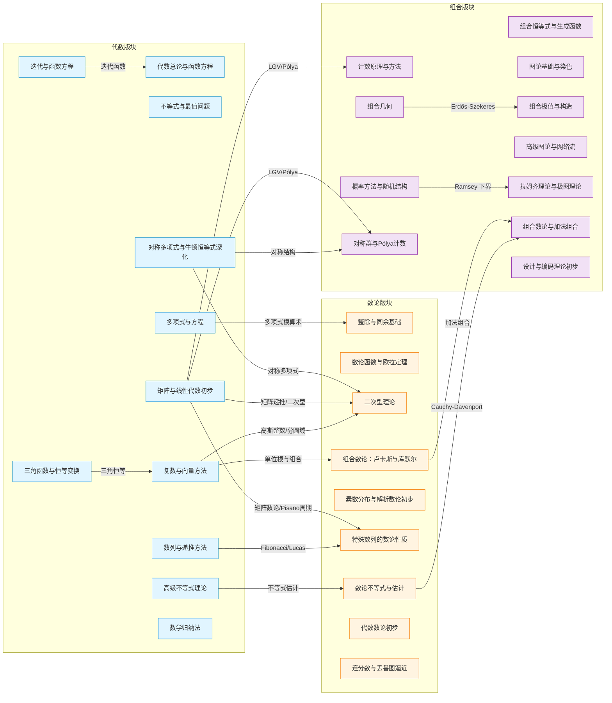

# 高中数学竞赛大纲

## 一、竞赛体系概述

全国高中数学联赛（高联）是选拔 IMO 国家队的重要环节，分为一试和二试，同一天进行。

> [!note] 考试结构速览
> | 项目 | 一试 | 二试 |
> |------|------|------|
> | 时间 | 120 分钟 | 150 分钟 |
> | 题型 | 8 填空 + 3 解答 | 4 道解答 |
> | 满分 | 120 分 | 180 分 |
> | 难度 | 高考加深 | 竞赛专项 |

**一试**考察高考内容深化：集合与函数、三角函数、数列、不等式、解析几何、立体几何、排列组合与概率、复数与向量、导数。**二试**考察四大版块：代数、平面几何、数论、组合数学（每题 40～50 分）。

> [!important] 关键认知
> 一试是「入场券」——一试达到省一等奖线，二试成绩才会计入排名。一试保稳，二试拉分。

---

## 二、一试知识范围

### 2.1 集合与简易逻辑
- 集合运算与容斥原理：$|A \cup B \cup C| = \sum|A| - \sum|A \cap B| + |A \cap B \cap C|$
- 充分/必要/充要条件的判断；命题四种形式及等价关系

### 2.2 函数
- 定义域与值域求法；单调性、奇偶性 $f(-x)=\pm f(x)$、周期性 $f(x+T)=f(x)$、对称性
- 反函数存在条件（一一映射），图像关于 $y=x$ 对称
- 幂函数 $y=x^\alpha$、指数 $y=a^x$、对数 $y=\log_a x$ 的图像与方程
- 函数方程初步：代入法与换元法

### 2.3 三角函数
- $\sin^2\theta+\cos^2\theta=1$；和差角、倍角公式：$\sin(\alpha\pm\beta)=\sin\alpha\cos\beta\pm\cos\alpha\sin\beta$，$\cos2\alpha=\cos^2\alpha-\sin^2\alpha$
- 正弦定理 $\frac{a}{\sin A}=2R$，余弦定理 $a^2=b^2+c^2-2bc\cos A$；面积 $S=\frac{1}{2}ab\sin C$，海伦公式

### 2.4 数列
- 等差等比通项与求和；一阶递推 $a_{n+1}=pa_n+q$；二阶线性递推特征根法
- 裂项相消、分组求和、错位相减；数学归纳法

> [!tip] 一试高频考点
> 递推求通项 + 不等式放缩求和是压轴题常见组合。

### 2.5 不等式
- 均值：$\frac{2}{1/a+1/b}\leq\sqrt{ab}\leq\frac{a+b}{2}\leq\sqrt{\frac{a^2+b^2}{2}}$（调 ≤ 几 ≤ 算 ≤ 平）
- 柯西：$(\sum a_i^2)(\sum b_i^2)\geq(\sum a_i b_i)^2$；排序不等式；比较法/分析法/综合法/放缩法

### 2.6 解析几何
- 直线与圆：$(x-a)^2+(y-b)^2=r^2$；椭圆 $\frac{x^2}{a^2}+\frac{y^2}{b^2}=1$；双曲线 $\frac{x^2}{a^2}-\frac{y^2}{b^2}=1$，渐近线 $y=\pm\frac{b}{a}x$
- 抛物线 $y^2=2px$；统一极坐标方程 $\rho=\frac{ep}{1-e\cos\theta}$

### 2.7 立体几何
- 线面平行/垂直判定；空间角（线线角、线面角、二面角）
- 法向量求二面角 $\cos\theta=\frac{|\vec{n}_1\cdot\vec{n}_2|}{|\vec{n}_1||\vec{n}_2|}$；点面距 $d=\frac{|\vec{PA}\cdot\vec{n}|}{|\vec{n}|}$

### 2.8 排列组合与概率
- $A_n^m=\frac{n!}{(n-m)!}$，$C_n^m=\frac{n!}{m!(n-m)!}$；二项式定理 $(a+b)^n=\sum C_n^k a^{n-k}b^k$
- 古典概型、条件概率 $P(B|A)=\frac{P(AB)}{P(A)}$、期望 $E(X)$ 与方差 $D(X)$

### 2.9 复数与向量
- 复数 $z=a+bi=r(\cos\theta+i\sin\theta)$；棣莫弗公式 $(\cos\theta+i\sin\theta)^n=\cos n\theta+i\sin n\theta$
- 模长为距离、辐角为旋转；向量数量积与坐标运算

### 2.10 导数及其应用
- $f'(x_0)$ 为切线斜率；$f'(x)>0$ 递增，$f'(x)<0$ 递减；$f'(x_0)=0$ 且符号变号判极值
- 恒成立问题转化为函数最值

---

## 三、二试知识范围

### 3.1 代数

> [!note] 代数在二试中的地位
> 通常为第一题（约 40 分），系统训练后最易稳定得分，也是其他版块的数学工具基础。

> [!tip] 代数笔记体系（11 篇）
> 基础工具：[[代数总论与函数方程]] | [[不等式与最值问题]] | [[数列与递推方法]] | [[数学归纳法]]
> 核心深化：[[多项式与方程]] | [[复数与向量方法]] | [[三角函数与恒等变换]] | [[迭代与函数方程]]
> 高档专题：[[高级不等式理论]] | [[对称多项式与牛顿恒等式深化]] | [[矩阵与线性代数初步]]

#### 不等式
- **舒尔**：$a,b,c\geq0$，$\sum a^r(a-b)(a-c)\geq0$（详见 [[不等式与最值问题]]、[[高级不等式理论]]）
- **排序**（深化）、**琴生**：凸函数 $f(\frac{\sum x_i}{n})\leq\frac{\sum f(x_i)}{n}$
- **权方和**、**赫尔德**：$\sum a_i b_i\leq(\sum a_i^p)^{1/p}(\sum b_i^q)^{1/q}$，$\frac{1}{p}+\frac{1}{q}=1$；**反柯西（Aczél）**
- **Muirhead**（对称均值）、**Karamata**（凸序）、**Maclaurin**、**Newton** 不等式
- **uvw 方法**、**混合变量法（EV 法）**、**SOS-Schur 分解**、**切线 trick**、**Lagrange 乘数法**
- 技巧：「$1$ 的代换」、齐次化、变量代换、局部不等式、调整法、Ravi 代换

#### 数列与递推
- 特征根法：$a_{n+2}=pa_{n+1}+qa_n$，$x^2-px-q=0$；不同根 $a_n=A\alpha^n+B\beta^n$，重根 $a_n=(A+Bn)\alpha^n$
- 不动点法：$a_{n+1}=\frac{pa_n+q}{ra_n+s}$，解 $x=\frac{px+q}{rx+s}$；桥函数法；母函数 $G(x)=\sum a_n x^n$
- 矩阵法：递推 $\vec{v}_{n+1}=A\vec{v}_n$ 通项 $\vec{v}_n=A^n\vec{v}_0$，对角化 + Cayley-Hamilton（详见 [[矩阵与线性代数初步]]）

#### 函数方程
- 柯西方程：$f(x+y)=f(x)+f(y)\to f(x)=cx$；$f(x+y)=f(x)f(y)\to f(x)=a^x$；$f(xy)=f(x)+f(y)\to f(x)=\log_a x$
- 代入法（特殊值）、换元法、极限法、P(x,y) 符号系统
- 单射/满射/双射判定，迭代理论与桥函数（详见 [[代数总论与函数方程]]、[[迭代与函数方程]]）

#### 多项式与复数
- 韦达定理；拉格朗日插值；单位根 $\omega^n=1$；牛顿公式（详见 [[多项式与方程]]、[[对称多项式与牛顿恒等式深化]]）
- 复数模长不等式 $|z_1+z_2|\leq|z_1|+|z_2|$；复数与几何变换（详见 [[复数与向量方法]]）
- **Newton 恒等式系统**：$p_k - e_1 p_{k-1} + e_2 p_{k-2} - \cdots + (-1)^{k-1} k e_k = 0$
- **判别式与结式**：判别式 $\Delta = a_n^{2n-2}\prod_{i<j}(r_i-r_j)^2$；Sylvester 矩阵；实根判定
- **高斯整数** $\mathbb{Z}[i]$、**分圆域** $\mathbb{Q}(\omega)$、**DFT** 在组合恒等式中的应用

### 3.2 平面几何

> [!note] 平面几何的特点
> 唯一不依赖代数计算的纯推理版块，讲究辅助线与定理熟练度，通常为第二题。

#### 五心与欧拉线
- 重心 $G$（$AG:GD=2:1$）、外心 $O$（$OA=R$）、内心 $I$（到三边 $r$）、垂心 $H$、旁心
- **欧拉线**：$O,G,H$ 共线且 $OG:GH=1:2$

#### 核心定理
- **塞瓦**：$AD,BE,CF$ 共点 ⇔ $\frac{BD}{DC}\cdot\frac{CE}{EA}\cdot\frac{AF}{FB}=1$
- **梅涅劳斯**：$D,E,F$ 共线 ⇔ $\frac{BD}{DC}\cdot\frac{CE}{EA}\cdot\frac{AF}{FB}=-1$
- **托勒密**：圆内接四边形 $AC\cdot BD=AB\cdot CD+AD\cdot BC$
- **西姆松**：外接圆上一点在三边投影共线
- **圆幂定理**：$PA\cdot PB=|PO^2-R^2|$；**根轴**

#### 几何变换
- 平移、旋转、反射；位似（中心 $O$，比 $k$）；反演 $OP\cdot OP'=R^2$（保角性，过反演中心的圆→直线）

### 3.3 数论

> [!note] 数论的特点
> 「看起来简单，做起来难」，核心在于同余工具的熟练运用。

> [!tip] 数论笔记体系（12 篇）
> 基础工具：[[整除与同余基础]] | [[数论函数与欧拉定理]] | [[不定方程与丢番图方程]] | [[二次剩余与阶]]
> 进阶深化：[[同余方程进阶与Hensel引理]] | [[连分数与丢番图逼近]] | [[代数数论初步]]
> 高档专题：[[二次型理论]] | [[组合数论：卢卡斯与库默尔]] | [[素数分布与解析数论初步]] | [[特殊数列的数论性质]] | [[数论不等式与估计]]

#### 整除与同余
- **裴蜀定理**：$\exists x,y$ 使 $ax+by=\gcd(a,b)$
- 同余：$a\equiv b,\ c\equiv d\pmod{m}$ → $a\pm c\equiv b\pm d$，$ac\equiv bd$
- **中国剩余定理**：互素模数下同余方程组在模 $\prod m_i$ 下有唯一解
- **Hensel 引理**：$\mathbb{Z}_p$ 上解的提升（详见 [[同余方程进阶与Hensel引理]]）

#### 重要定理
- **费马小定理**：$a^{p-1}\equiv1\pmod{p}$（$p$ 素数，$\gcd(a,p)=1$）
- **欧拉定理**：$a^{\varphi(m)}\equiv1\pmod{m}$（$\gcd(a,m)=1$）
- **威尔逊定理**：$p$ 素数 ⇔ $(p-1)!\equiv-1\pmod{p}$
- **Lucas 定理**、**Kummer 定理**（详见 [[组合数论：卢卡斯与库默尔]]）

#### 二次剩余与不定方程
- 勒让德符号 $\left(\frac{a}{p}\right)$；二次互反律；**Jacobi 符号**
- $ax+by=c$ 有解 ⇔ $\gcd(a,b)\mid c$
- 勾股方程：$x=k(m^2-n^2),y=2kmn,z=k(m^2+n^2)$
- 佩尔方程 $x^2-Dy^2=1$；无穷递降法；**连分数**解法（详见 [[连分数与丢番图逼近]]）
- **二次型理论**：$ax^2+bxy+cy^2=n$ 的整数解，类数公式（详见 [[二次型理论]]）

#### 数论函数与解析数论
- $\varphi(n)=n\prod_{p\mid n}(1-\frac{1}{p})$；$\mu(n)$ 与莫比乌斯反演；积性函数
- **Mertens 函数** $M(x)=\sum_{n\le x}\mu(n)$；**Chebyshev 函数** $\psi(x)$
- **素数定理** $\pi(x)\sim\dfrac{x}{\ln x}$（详见 [[素数分布与解析数论初步]]）
- **数论不等式**：$n$ 与 $\varphi(n)$、$d(n)$、$\sigma(n)$ 的精细估计（详见 [[数论不等式与估计]]）

#### 特殊数列的数论性质
- **Fibonacci 数列**：$F_p\equiv\left(\frac{5}{p}\right)\pmod{p}$（Lucas 1878）
- **Lucas 数列**：$U_n(P,Q),V_n(P,Q)$ 与 Levi ben Gerson 同余
- **整点计数**、**Blichfeldt 定理**、**Minkowski 定理**（详见 [[特殊数列的数论性质]]）

#### 代数数论联系
- **代数整数**、**有理素数在代数整数环中的分解**
- **二次域** $\mathbb{Q}(\sqrt{D})$ 的类数；**Pell 方程**与连分数（详见 [[代数数论初步]]、[[连分数与丢番图逼近]]）

### 3.4 组合数学

> [!note] 组合数学的特点
> 灵活度最高，考查构造与极端思维。通常为第四题，区分顶尖选手。

> [!tip] 组合笔记体系（11 篇）
> 基础工具：[[计数原理与方法]] | [[组合恒等式与生成函数]] | [[图论基础与染色]] | [[组合极值与构造]]
> 高档专题：[[高级图论与网络流]] | [[拉姆齐理论与极图理论]] | [[组合几何]] | [[概率方法与随机结构]] | [[对称群与Pólya计数]] | [[组合数论与加法组合]] | [[设计与编码理论初步]]

#### 计数原理
- 加法/乘法原理；容斥原理（奇加偶减）；鸽巢原理（$n+1$→至少一巢 $2$ 只，$mn+1$→至少一巢 $m+1$ 只）
- **Möbius 反演**（偏序集上）、**符号反转对合（SRI）**、**Lindström–Gessel–Viennot 引理**、**Burnside 引理**（详见 [[计数原理与方法]]）
- 错位排列、圆排列、可重组合（星条法）；映射计数法

#### 组合恒等式与生成函数
- $C_n^k=C_n^{n-k}$；范德蒙 $\sum C_m^k C_n^{r-k}=C_{m+n}^r$；吸收恒等式 $k\binom{n}{k}=n\binom{n-1}{k-1}$
- **普通型生成函数 OGF**、**指数型生成函数 EGF**、**Dirichlet 生成函数 DGF**
- **Lagrange 反演公式**、**指数公式**（标号结构计数）、**多元生成函数**、**Snake Oil 方法**（详见 [[组合恒等式与生成函数]]）
- 卡特兰数 $C_n = \frac{1}{n+1}\binom{2n}{n}$；Motzkin 数；Bell 数

#### 图论基础
- 欧拉图（所有顶点度偶数）；哈密顿图（Dirac/Ore 定理）；二部图；染色 $\chi(G)$；握手引理 $\sum\deg(v)=2|E|$
- 树（$n-1$ 条边、至少两片叶子）；Vizing 定理（边色数）；四色定理
- Ramsey 数 $R(s,t)$（详见 [[图论基础与染色]]）

#### 组合极值与构造
- 极端原理、调整法；构造与反例；双计数法
- **Turán 定理**（禁 $K_{r+1}$ 最大边数）、**Mantel 定理**（禁 $K_3$）、**Sperner 定理**（反链）
- **Erdős–Ko–Rado 定理**（相交族）、**概率方法初探**（详见 [[组合极值与构造]]）
- 组合几何：凸包、Erdős–Szekeres、覆盖与划分

#### 高级图论与网络流
- **Hall 婚姻定理**、**König 定理**（最大匹配=最小点覆盖）、**Menger 定理**、**Tutte 1-因子定理**
- **最大流最小割定理**、Ford-Fulkerson 算法
- **平面图**：Euler 公式 $V-E+F=2$、Kuratowski 定理、对偶图
- **连通度**：$\kappa(G) \le \lambda(G) \le \delta(G)$（Whitney 定理）（详见 [[高级图论与网络流]]）

#### 拉姆齐理论与极图理论
- **Ramsey 数**：$R(s,t) \le \binom{s+t-2}{s-1}$（Erdős–Szekeres 上界）；$R(k,k) > c \cdot k 2^{k/2}$（概率下界）
- **Schur 定理**、**多色 Ramsey 数**、**Happy Ending 问题**、**Erdős–Szekeres 单调子序列**
- **Turán 定理**、**Erdős–Stone 定理**、**Erdős–Simonovits 稳定性**
- **Szemerédi 正则引理**、三角形计数引理、Roth 定理图论证明思路（详见 [[拉姆齐理论与极图理论]]）

#### 组合几何
- **凸性**：Carathéodory、Radon、**Helly 定理**
- **Sylvester–Gallai 定理**、对偶形式
- **Erdős–Szekeres 凸多边形定理**（$ES(n) \le \binom{2n-4}{n-2}+1$，下界 $2^{n-2}+1$）
- **Szemerédi–Trotter 定理**（点线关联）、Erdős 单位距离问题、直线配置（详见 [[组合几何]]）

#### 概率方法与随机结构
- **Markov/Chebyshev/Chernoff 不等式**；第二矩方法
- **Erdős 概率方法**：$R(k,k) > 2^{k/2}$（1947）；alteration 方法
- **Lovász 局部引理（LLL）**：超图着色应用
- **随机图 $G(n,p)$**：团数 $\sim 2\log_2 n$、相变现象（详见 [[概率方法与随机结构]]）

#### 对称群与 Pólya 计数
- **群作用**：轨道、稳定子、轨道-稳定子定理
- **Burnside 引理**、**Pólya 计数定理**、**循环指标** $Z(G)$
- **循环群 $C_n$、二面体群 $D_n$、立方体/四面体旋转群**的循环指标
- 项链、手镯、立方体染色计数（详见 [[对称群与Pólya计数]]）

#### 组合数论与加法组合
- **Schur 定理**、**Van der Waerden 定理**（$W(k,r)$）、**Szemerédi 定理**（密度版）
- **Sidon 集**（$B_2$ 集）、**Sum-Free 集**、**$B_h$ 集**
- **Cauchy–Davenport 定理**、**Plünnecke–Ruzsa 不等式**、**Freiman 定理**
- **Erdős–Ginzburg–Ziv 定理**：任意 $2n-1$ 整数中必有 $n$ 个和被 $n$ 整除（详见 [[组合数论与加法组合]]）

#### 设计与编码理论
- **BIBD $(v, k, \lambda)$**、Fisher 不等式 $b \ge v$、对称设计
- **Steiner 系统** $S(t, k, v)$、Fano 平面 $S(2,3,7)$、Witt 设计 $S(5,8,24)$
- **有限射影平面**、**Bruck–Ryser–Chowla 定理**
- **Hadamard 矩阵**、**Hamming 码**、Singleton/Hamming 界（详见 [[设计与编码理论初步]]）

---

## 四、四大版块的关系与交叉

> [!important] 版块交叉融合是近年命题趋势

| 交叉领域 | 示例 | 涉及版块 | 笔记链接 |
|----------|------|----------|----------|
| 解析法处理几何 | 向量/复数/坐标系证明几何定理 | 代数 + 几何 | [[复数与向量方法]] |
| 数论中的代数 | 同余方程、多项式在 $\mathbb{Z}_p$ 上的性质 | 代数 + 数论 | [[多项式与方程]] + [[同余方程进阶与Hensel引理]] |
| 对称多项式与数论 | Newton 恒等式 + 二次型 | 代数 + 数论 | [[对称多项式与牛顿恒等式深化]] + [[二次型理论]] |
| 矩阵递推与数论 | Fibonacci 矩阵 + Pisano 周期 | 代数 + 数论 | [[矩阵与线性代数初步]] + [[特殊数列的数论性质]] |
| 不等式与数论估计 | Schur + 数论函数估计 | 代数 + 数论 | [[高级不等式理论]] + [[数论不等式与估计]] |
| 复数与组合 | 单位根 + 组合恒等式 | 代数 + 组合 | [[复数与向量方法]] + [[组合恒等式与生成函数]] |
| 生成函数与组合 | 代数方法推导组合恒等式 | 代数 + 组合 | [[组合恒等式与生成函数]] |
| 组合数论 | 抽屉原理在整数问题中的应用 | 组合 + 数论 | [[组合数论：卢卡斯与库默尔]] |
| 拉姆齐理论 | 充分大结构中必存在有序子结构 | 组合 + 图论 | [[图论基础与染色]] |
| 组合与代数 | 矩阵树定理、LGV 引理、Pólya 计数 | 代数 + 组合 | [[矩阵与线性代数初步]] + [[计数原理与方法]] |
| 组合与几何 | Erdős–Szekeres、组合几何 | 几何 + 组合 | [[几何不等式与极值]] + [[组合几何]] |
| 组合与数论（加法组合） | Schur、Van der Waerden、Sidon | 组合 + 数论 | [[组合数论与加法组合]] + [[组合数论：卢卡斯与库默尔]] |
| 概率方法与图论 | 随机图、Ramsey 下界 | 组合 + 概率 | [[概率方法与随机结构]] + [[拉姆齐理论与极图理论]] |
| 设计与代数 | Hadamard 矩阵、有限域上码 | 代数 + 组合 | [[矩阵与线性代数初步]] + [[设计与编码理论初步]] |

- 向量法、复数法、坐标法是平面几何三大解析利器
- 同余方程本质是环 $\mathbb{Z}/m\mathbb{Z}$ 上的方程
- 生成函数将离散数列映射为连续函数
- 拉姆齐理论在数论（范德瓦尔登定理）和组合题中均有体现
- **矩阵方法**已成为处理线性递推与图论计数的核心工具
- **对称多项式**将多项式根的理论与判别式、结式联系起来，是多项式与数论的桥梁

---

## 五、备考策略与推荐学习路径

### 阶段一：夯实基础
掌握一试体系（函数综合、数列递推、解析几何），不等式专题（均值、柯西、排序），规范数学归纳法与反证法。

> [!tip] 参考笔记
> [[不等式证明方法综述]] | [[求和式的计算方式]]

### 阶段二：专攻四大版块
代数（不等式深化、特征根/不动点、函数方程）、平面几何（五心、塞瓦/梅涅劳斯/托勒密、几何变换）、数论（同余、费马/欧拉定理、不定方程）、组合（容斥/鸽巢、恒等式、图论）。

> [!tip] 参考笔记
> [[平面几何定律集]] | [[三角形五心与欧拉线]] | [[不等式与最值问题]] | [[数论函数与欧拉定理]]

### 阶段三：综合训练
真题模拟（近 5～10 年），跨版块训练（代数解几何、组合数论），归纳题型框架。

> [!tip] 参考笔记
> [[代数题目集]] | [[几何题目集]] | [[数论题目集]] | [[组合数学题目集]] | [[高级不等式理论]] | [[对称多项式与牛顿恒等式深化]] | [[矩阵与线性代数初步]]

### 阶段三.5：高档专题突破（CMO/TST/IMO 冲刺）

> [!important] 高档竞赛核心专题
> - **代数方向**：[[高级不等式理论]]（SOS-Schur/uvw/混合变量法）、[[对称多项式与牛顿恒等式深化]]（Newton 恒等式/判别式/结式）、[[矩阵与线性代数初步]]（对角化/Cayley-Hamilton/Jordan 标准型）、[[迭代与函数方程]]（分式线性迭代/桥函数）
> - **数论方向**：[[二次型理论]]（类数公式/局部-全局原理）、[[组合数论：卢卡斯与库默尔]]（组合恒等式模素数）、[[素数分布与解析数论初步]]（素数定理/Chebyshev 估计）、[[特殊数列的数论性质]]（Fibonacci/Lucas 数列）、[[数论不等式与估计]]（$n$ 与 $\varphi,d,\sigma$ 的精细估计）
> - **组合方向**：[[高级图论与网络流]]（Hall/Tutte/最大流最小割）、[[拉姆齐理论与极图理论]]（Turán/Szemerédi 正则引理）、[[组合几何]]（Helly/Sylvester-Gallai）、[[概率方法与随机结构]]（Erdős 概率法/LLL）、[[对称群与Pólya计数]]（Burnside/Pólya）、[[组合数论与加法组合]]（Schur/Van der Waerden/EGZ）、[[设计与编码理论初步]]（BIBD/Steiner/Hamming 码）
> - **跨版块**：复数法处理几何（[[复数与向量方法]]）、矩阵法处理递推（[[矩阵与线性代数初步]]）、生成函数处理组合（[[组合恒等式与生成函数]]）

### 阶段四：冲刺提升
薄弱版块补强、限时训练（150 分钟/4 题）、心理素质与节奏把控。

---

## 六、推荐学习顺序

1. **代数不等式** — 最基础工具，贯穿所有版块（[[不等式与最值问题]] → [[高级不等式理论]]）
2. **数列与递推** — 为函数方程铺垫（[[数列与递推方法]] → [[矩阵与线性代数初步]]）
3. **函数方程** — 与递推思想一脉相承（[[代数总论与函数方程]] → [[迭代与函数方程]]）
4. **多项式与对称多项式** — 代数核心深化（[[多项式与方程]] → [[对称多项式与牛顿恒等式深化]]）
5. **复数与三角** — 几何与代数的桥梁（[[复数与向量方法]] → [[三角函数与恒等变换]]）
6. **数学归纳法** — 贯穿所有版块的证明工具（[[数学归纳法]]）
7. **平面几何** — 独立体系，前期可专注投入
8. **数论基础** — 同余运算需积累手感（[[整除与同余基础]] → [[数论函数与欧拉定理]] → [[不定方程与丢番图方程]] → [[二次剩余与阶]]）
9. **数论进阶** — 二次型与组合数论（[[二次型理论]] → [[组合数论：卢卡斯与库默尔]] → [[同余方程进阶与Hensel引理]]）
10. **数论高档** — 解析数论与代数数论（[[素数分布与解析数论初步]] → [[特殊数列的数论性质]] → [[数论不等式与估计]] → [[连分数与丢番图逼近]] → [[代数数论初步]]）
11. **组合计数** — 与代数排列组合衔接（[[计数原理与方法]] → [[组合恒等式与生成函数]] → [[对称群与Pólya计数]]）
12. **图论与网络流** — 基础到高级（[[图论基础与染色]] → [[高级图论与网络流]]）
13. **Ramsey 与极图** — 拉姆齐与极图理论（[[拉姆齐理论与极图理论]] → [[概率方法与随机结构]]）
14. **组合几何与构造** — 几何与极值（[[组合极值与构造]] → [[组合几何]]）
15. **组合数论与设计** — 加法组合与设计（[[组合数论与加法组合]] → [[设计与编码理论初步]]）

> [!note] 灵活调整
> 平面几何和数论与代数依赖弱，可在代数基础完成后任意切入。

---

## 七、知识图谱总览

### 代数（11 篇）
> **基础工具**：[[代数总论与函数方程]] | [[不等式与最值问题]] | [[数列与递推方法]] | [[数学归纳法]]
>
> **核心深化**：[[多项式与方程]] | [[复数与向量方法]] | [[三角函数与恒等变换]] | [[迭代与函数方程]]
>
> **高档专题**：[[高级不等式理论]] | [[对称多项式与牛顿恒等式深化]] | [[矩阵与线性代数初步]]

### 几何
> [[平面几何核心定理]] | [[三角形与圆]] | [[几何变换与作图]] | [[解析几何方法]] | [[立体几何与空间向量]] | [[几何不等式与极值]]

### 数论（12 篇）
> **基础工具**：[[整除与同余基础]] | [[数论函数与欧拉定理]] | [[不定方程与丢番图方程]] | [[二次剩余与阶]]
>
> **进阶深化**：[[同余方程进阶与Hensel引理]] | [[连分数与丢番图逼近]] | [[代数数论初步]]
>
> **高档专题**：[[二次型理论]] | [[组合数论：卢卡斯与库默尔]] | [[素数分布与解析数论初步]] | [[特殊数列的数论性质]] | [[数论不等式与估计]]

### 组合（11 篇）
> **基础工具**：[[计数原理与方法]] | [[组合恒等式与生成函数]] | [[图论基础与染色]] | [[组合极值与构造]]
>
> **高档专题**：[[高级图论与网络流]] | [[拉姆齐理论与极图理论]] | [[组合几何]] | [[概率方法与随机结构]] | [[对称群与Pólya计数]] | [[组合数论与加法组合]] | [[设计与编码理论初步]]

### 题目集
> [[代数题目集]] | [[几何题目集]] | [[数论题目集]] | [[组合数学题目集]]

### 跨版块知识关联图

---

> [!quote] 最后的话
> 数学竞赛之路，贵在坚持与反思。每一道做不出来的题，都是通往更高水平的阶梯。

*—— 整理于 2026 年 6 月*