# 数论不等式与估计（Number Theoretic Inequalities & Estimates）

> [!abstract] 核心定位
> 数论不等式与渐近估计是高联二试、TST、Putnam、IMO 等竞赛的核心工具，涵盖素数计数估计、阶乘与二项式系数的渐近、整除计数的上下界、数论函数阶的估计、$p$-adic 赋值的平均值等。本笔记系统介绍 Stirling 公式、Chebyshev 估计、Mertens 估计、Erdős 上界、Vinogradov 记号、$O, o, \asymp, \sim$ 关系，以及它们在解决存在性、计数与渐近问题中的应用，与 [[素数分布与解析数论初步]]、[[数论函数与欧拉定理]]、[[组合数论：卢卡斯与库默尔]] 形成完整估计工具体系。

---

## 一、渐近记号

### 1.1 基本定义

> [!important] 渐近记号
> 设 $f, g: \mathbb{N} \to \mathbb{R}_{\ge 0}$。
> - **大 $O$**：$f(n) = O(g(n))$ 若存在常数 $C$ 使 $|f(n)| \le C g(n)$（$n \ge n_0$）
> - **小 $o$**：$f(n) = o(g(n))$ 若 $\lim_{n \to \infty} f(n)/g(n) = 0$
> - **等价 $\sim$**：$f(n) \sim g(n)$ 若 $\lim f(n)/g(n) = 1$
> - **同阶 $\asymp$ / $\Theta$**：$f = \Theta(g)$ 若 $f = O(g)$ 且 $g = O(f)$
> - **$\Omega$**：$f = \Omega(g)$ 若 $g = O(f)$
> - **Vinogradov 记号**：$f \ll g$ 等价于 $f = O(g)$

> [!example] 记号应用
> - $\pi(x) \sim x / \ln x$（素数定理）
> - $\pi(x) = x/\ln x + O(x/\ln^2 x)$（更精细）
> - $\ln n! = n \ln n - n + O(\ln n)$（Stirling）

### 1.2 运算法则

- $O(f) + O(g) = O(f + g) = O(\max(f, g))$
- $O(f) \cdot O(g) = O(fg)$
- $o(f) \cdot g = o(fg)$
- 若 $f \sim g$，$h \sim k$，则 $fh \sim gk$

---

## 二、Stirling 公式

### 2.1 阶乘的渐近

> [!important] Stirling 公式
> $$n! \sim \sqrt{2\pi n} \left(\frac{n}{e}\right)^n$$
>
> 更精细：
> $$n! = \sqrt{2\pi n} \left(\frac{n}{e}\right)^n \left(1 + \frac{1}{12n} + \frac{1}{288n^2} - \cdots\right)$$

**对数形式**：
$$\ln(n!) = n \ln n - n + \frac{1}{2} \ln(2\pi n) + O(1/n)$$

> [!example] 计算
> $10! = 3628800$。Stirling 给 $\sqrt{20\pi} (10/e)^{10} \approx 7.927 \cdot 4.540 \times 10^5 / 10^4 \approx 3598698 / 1 \approx 3598698$。误差约 $0.83\%$。

### 2.2 二项式系数的渐近

> [!important] 中心二项式系数
> $$\binom{2n}{n} \sim \frac{4^n}{\sqrt{\pi n}}$$

> [!example] 验证
> $\binom{10}{5} = 252$。$4^5 / \sqrt{5\pi} = 1024/3.963 \approx 258.4$。误差约 $2.5\%$。

### 2.3 Stirling 数的渐近

- $n! = \sqrt{2\pi n} (n/e)^n (1 + O(1/n))$
- $\binom{n}{k} \sim \dfrac{n^k}{k!}$（$k$ 固定，$n \to \infty$）

---

## 三、素数计数不等式

### 3.1 Chebyshev 界

> [!important] Chebyshev 上下界
> 对 $x \ge 2$：
> $$\frac{7}{8} \cdot \frac{x}{\ln x} < \pi(x) < \frac{9}{4} \cdot \frac{x}{\ln x}$$（粗略）
>
> 更精确：对充分大 $x$，$0.92 x/\ln x \le \pi(x) \le 1.11 x/\ln x$。

### 3.2 Bertrand 假设的应用

> [!important] Bertrand 应用
> 对 $n \ge 1$，存在素数 $p$，$n < p \le 2n$。这给出 $p_n \le 2^n$（粗略）的递推。

### 3.3 第 $n$ 个素数的估计

> [!important] $p_n$ 的渐近
> $$p_n \sim n \ln n$$
>
> 上下界（Rosser, 1938）：
> $$n \ln n + n \ln\ln n - n < p_n < n \ln n + n \ln\ln n$$（$n \ge 6$）

> [!example] 计算 $p_{100}$
> $100 \ln 100 \approx 460.5$，$100 \ln\ln 100 \approx 153.2$。预测 $p_{100} \in (460.5 - 100 + 153.2, 460.5 + 153.2) = (513.7, 613.7)$。实际 $p_{100} = 541$ ✓

---

## 四、整除计数的估计

### 4.1 $d(n)$ 的上界

> [!important] $d(n)$ 上界
> $$d(n) \le 2\sqrt{n}$$
>
> 更强：$d(n) = O(n^\epsilon)$（对任意 $\epsilon > 0$）
>
> 最强（Wigert, 1907）：$\limsup_{n \to \infty} \dfrac{\ln d(n) \ln\ln n}{\ln n} = \ln 2$

> [!example] $d(720)$
> $720 = 2^4 \cdot 3^2 \cdot 5$，$d(720) = 5 \cdot 3 \cdot 2 = 30$。$2\sqrt{720} \approx 53.7$，故 $d(720) < 53.7$ ✓

### 4.2 $d(n)$ 的平均值

> [!important] Dirichlet 公式
> $$\sum_{n \le x} d(n) = x \ln x + (2\gamma - 1) x + O(\sqrt{x})$$
>
> 即 $d(n)$ 的平均值 $\sim \ln n$。

### 4.3 $\varphi(n)$ 的下界

> [!important] $\varphi(n)$ 下界
> 对 $n \ge 3$：
> $$\varphi(n) > \frac{n}{e^\gamma \ln\ln n + 3/\ln\ln n}$$
>
> 特别地，$\varphi(n) \gg n / \ln\ln n$。
>
> 对素数 $p$：$\varphi(p) = p - 1 \sim p$。
>
> 平均：$\dfrac{1}{n} \sum_{k \le n} \varphi(k) \sim \dfrac{6}{\pi^2} n$（即 $\dfrac{1}{\zeta(2)} n$）。

### 4.4 $\sigma(n)$ 的估计

> [!important] $\sigma(n)$ 上界
> $$\sigma(n) < e^\gamma n \ln\ln n + O(n)$$（Gronwall, 1913）
>
> 即 $\limsup \sigma(n)/(n \ln\ln n) = e^\gamma$。

> [!example] 完全数与 Gronwall
> 完全数 $n$ 满足 $\sigma(n) = 2n$，$2n/(n \ln\ln n) = 2/\ln\ln n \to 0$，故完全数"远小于" Gronwall 上界。

---

## 五、$p$-adic 赋值的平均

### 5.1 $v_p(n!)$ 的估计

> [!important] $v_p(n!)$ 估计
> $$v_p(n!) = \frac{n}{p - 1} + O(\ln n / \ln p)$$
>
> 更精确：$v_p(n!) = \dfrac{n - s_p(n)}{p - 1}$，其中 $0 \le s_p(n) \le (p-1)(1 + \log_p n)$。

### 5.2 $\operatorname{lcm}(1, 2, \ldots, n)$ 的渐近

> [!important] $\psi(x)$ 与 $\operatorname{lcm}$
> $$\ln \operatorname{lcm}(1, 2, \ldots, n) = \psi(n) \sim n$$（素数定理等价）

> [!example] $\operatorname{lcm}(1, \ldots, 10) = 2520$
> $\ln 2520 \approx 7.83$。$10 = 10$，相对误差 $21.7\%$，$n$ 小时不准。

### 5.3 $n!$ 的素因子幂次

> [!important] $n!$ 中 $p$ 的幂次总和
> $$\sum_{p \le n} v_p(n!) \ln p = \ln(n!)$$
>
> 由 Stirling：$\ln(n!) \sim n \ln n$。结合 $v_p(n!) \approx n/(p-1)$：
> $$\sum_{p \le n} \frac{n \ln p}{p - 1} \sim n \ln n$$
> 即 $\sum_{p \le n} \dfrac{\ln p}{p} \sim \ln n$（Mertens 型公式）。

---

## 六、二次剩余与原根的估计

### 6.1 最小二次非剩余

> [!important] 最小二次非剩余 $n_p$
> 设 $p$ 为奇素数，$n_p$ 是模 $p$ 最小正二次非剩余。
>
> - 上界：$n_p \ll p^{1/(4\sqrt{e}) + \epsilon}$（Burgess, 1957）
> - GRH 下：$n_p \ll (\ln p)^2$

> [!example] 小例子
> $p = 7$：二次剩余 $1, 2, 4$，非剩余 $3, 5, 6$，最小 $n_7 = 3$。
> $p = 23$：平方 $1, 4, 9, 16, 2, 13, 3, 18, 12, 8, 6$，非剩余最小 $n_{23} = 5$。

### 6.2 最小原根

> [!important] 最小原根 $g_p$
> 模 $p$ 最小原根 $g_p$ 满足 $g_p \ll p^{1/4 + \epsilon}$（Burgess）。GRH 下 $g_p \ll (\ln p)^6$。

### 6.3 二次剩余分布

> [!important] 二次剩余平衡
> 模素数 $p$ 的二次剩余与非剩余各占一半（[[二次剩余与阶]]）。即
> $$\sum_{a=1}^{p-1} \left(\frac{a}{p}\right) = 0$$
>
> 更精细：$\left|\sum_{a=1}^{N} \left(\dfrac{a}{p}\right)\right| \ll \sqrt{p} \ln p$（Pólya-Vinogradov 不等式）。

---

## 七、模 $m$ 的阶的估计

### 7.1 平均阶

> [!important] 阶的平均
> $$\frac{1}{\varphi(m)} \sum_{\substack{a \le m \\ \gcd(a, m) = 1}} \operatorname{ord}_m(a) \asymp m$$
>
> 即模 $m$ 的元素阶平均值与 $m$ 同阶。

### 7.2 大阶元素的存在

> [!important] Artin 猜想
> 除少数例外（$-1$ 和非平方整数），每个整数 $a$ 是无穷多素数 $p$ 的原根。

> [!note] Hooley 证明（GRH 下）
> Hooley（1967）在 GRH 下证明 Artin 猜想。无条件下仍开放。

---

## 八、组合数论的估计

### 8.1 $r_2(n)$ 与 $r_4(n)$ 的渐近

> [!important] 平方和表示数渐近
> - $r_2(n) = 4 \sum_{d \mid n} \chi_4(d) = O(n^\epsilon)$
> - 平均：$\sum_{n \le x} r_2(n) \sim \pi x$（圆内整点数）
> - $r_4(n) = 8 \sigma(n) - 32\sigma(n/4)$（精确）
> - 平均：$\sum_{n \le x} r_4(n) \sim \pi^2 x^2 / 2$

### 8.2 整点问题

> [!important] Gauss 圆问题
> $$N(x) = \#\{(a, b) \in \mathbb{Z}^2 : a^2 + b^2 \le x\} = \pi x + O(x^{1/2})$$
>
> 最佳上界：$O(x^{0.63})$（Huxley, 2003）。猜想 $O(x^{1/2 + \epsilon})$。

> [!important] Dirichlet 除数问题
> $$\sum_{n \le x} d(n) = x \ln x + (2\gamma - 1) x + \Delta(x)$$
> $\Delta(x) = O(x^{1/2})$（Dirichlet），最佳 $O(x^{0.31})$（Huxley）。猜想 $\Delta = O(x^{1/4 + \epsilon})$。

### 8.3 表和问题

> [!important] Waring 问题
> 对每个 $k \ge 2$，存在 $g(k)$ 使得每个正整数是 $g(k)$ 个 $k$ 次幂之和。
> - $g(2) = 4$（Lagrange 四平方和）
> - $g(3) = 9$（Wieferich, Kempner）
> - $g(4) = 19$（Balasubramanian, 1986）

---

## 九、典型例题

> [!example] 例 1：用 Stirling 估计 $n!$
> 估计 $100!$。
>
> **解**：$\ln(100!) = 100 \ln 100 - 100 + 0.5 \ln(200\pi) \approx 460.5 - 100 + 3.30 = 363.8$。$100! \approx e^{363.8} \approx 9.33 \times 10^{157}$。
> 实际 $100! \approx 9.3326 \times 10^{157}$ ✓

> [!example] 例 2：中心二项式系数
> 估计 $\binom{2n}{n}$ 在 $n = 50$ 时的值。
>
> **解**：$\binom{100}{50} \approx 4^{50}/\sqrt{50\pi} \approx 1.2677 \times 10^{30} / 12.53 \approx 1.012 \times 10^{29}$。实际 $\binom{100}{50} \approx 1.0089 \times 10^{29}$ ✓

> [!example] 例 3：$d(n)$ 上界应用
> 证明 $n = \operatorname{lcm}(1, 2, \ldots, k)$ 时 $d(n) \ge 2^{\pi(k)}$。
>
> **解**：$n = \prod_{p \le k} p^{v_p(n!)}$（其中 $v_p(n!) = \lfloor\log_p k\rfloor$）。$d(n) = \prod (v_p + 1) \ge \prod 2 = 2^{\pi(k)}$。

> [!example] 例 4：$\varphi$ 下界
> 证明 $\varphi(n) \ge \sqrt{n/2}$（$n \ge 2$）。
>
> **解**：$n = \prod p_i^{a_i}$，$\varphi(n) = n \prod (1 - 1/p_i)$。
> 若 $n$ 含 $2$：$\varphi(n) \ge n \cdot 1/2 \cdot \prod_{p_i \ge 3}(1 - 1/p_i) \ge n/2 \cdot \prod_{p \ge 3} (1 - 1/p^2) = n/2 \cdot (4/\pi^2) / (1 - 1/4) = n/2 \cdot 4/(3\pi^2/4) \cdot \ldots$（细节略）。
>
> 直接用 $\varphi(n) \varphi(\text{rad}(n)) \le n$ 与 $\varphi(n) \ge \sqrt{n}$ 当 $n$ 是 $2$ 或素数幂的乘积。完整证明需 [[数论函数与欧拉定理]] 的精细分析。

> [!example] 例 5：素数倒数和
> 证明 $\sum_{p \le x} 1/p < \ln\ln x + 1$。
>
> **解**：Mertens 公式 $\sum_{p \le x} 1/p = \ln\ln x + M + o(1)$，$M \approx 0.2615$。故 $\sum_{p \le x} 1/p < \ln\ln x + 0.27 + o(1) < \ln\ln x + 1$（$x$ 充分大）。

> [!example] 例 6：Gauss 圆问题
> 估计 $\#\{(a, b) \in \mathbb{Z}^2 : a^2 + b^2 \le 100\}$。
>
> **解**：$\pi \cdot 100 = 314.16$。误差 $O(\sqrt{100}) = O(10)$。预测 $\approx 314 \pm 10$。
> 实际计数：$317$（圆内整点）。✓

> [!example] 例 7：除数问题
> 估计 $\sum_{n=1}^{100} d(n)$。
>
> **解**：$100 \ln 100 + (2\gamma - 1) \cdot 100 = 460.5 + 0.154 \cdot 100 = 475.9$。实际：$d(1) + d(2) + \cdots + d(100) = 1 + 2 + 2 + 3 + 2 + 4 + \cdots = 482$。误差 $O(\sqrt{100}) = O(10)$，符合。

> [!example] 例 8：Pisano 周期估计
> 证明 Fibonacci 模 $m$ 的 Pisano 周期 $\pi(m) \le 6m$。
>
> **解**：对素数 $p$，$\pi(p) \le p^2 - 1$（粗略，因 $\mathbb{F}_{p^2}^*$ 阶 $p^2 - 1$ 含 $\sqrt 5$）。对 $m = \prod p_i^{a_i}$，$\pi(m) = \operatorname{lcm}(\pi(p_i^{a_i}))$。结合 $\pi(p^a) \le p^{a-1} \pi(p)$，得 $\pi(m) \le 6m$（精确常数见 Wall 1960）。

> [!example] 例 9：Burgess 应用
> 求模 $101$ 的最小二次非剩余。
>
> **解**：Burgess 给 $n_{101} \ll 101^{1/(4\sqrt e) + \epsilon} \approx 101^{0.152} \approx 2.94$。即 $n_{101} \le 3$。
>
> 验证：$1^2 = 1$（剩余），$2^2 = 4$（剩余），$3^2 = 9$（剩余），$\ldots$，$50^2 \bmod 101$ 给所有 $50$ 个剩余。$2$ 是剩余？$\left(\dfrac{2}{101}\right) = (-1)^{(101^2-1)/8} = (-1)^{1275} = -1$。故 $2$ 是非剩余，$n_{101} = 2$ ✓

> [!example] 例 10：Mertens 第三定理
> 验证 $\prod_{p \le 1000} (1 - 1/p) \approx e^{-\gamma}/\ln 1000$。
>
> **解**：$e^{-\gamma} \approx 0.5615$，$\ln 1000 \approx 6.908$。预测 $0.5615/6.908 \approx 0.0813$。
> 实际：$\prod_{p \le 1000} (1 - 1/p) \approx 0.0805$。✓

---

## 十、与竞赛的联系

### 10.1 一试常见

- Stirling 公式估计阶乘与二项式
- $d(n)$ 的初等上界 $d(n) \le 2\sqrt n$
- Bertrand 假设在存在性证明中
- $\pi(x)$ 粗估

### 10.2 二试与 TST

- Chebyshev 估计证明 $\binom{2n}{n}$ 的下界
- $\varphi(n)$ 下界与 $n^\epsilon$ 比较
- $r_2, r_4$ 表示数估计
- Mertens 型公式应用

### 10.3 高级竞赛

- Burgess 上界与二次非剩余
- Gauss 圆问题与除数问题的误差
- Waring 问题的存在性证明
- Artin 原根猜想的条件应用

---

## 十一、知识链接

- [[素数分布与解析数论初步]] — $\pi(x), \theta(x), \psi(x)$ 的渐近是本笔记的核心估计
- [[数论函数与欧拉定理]] — $\varphi, d, \sigma, \mu$ 的阶与平均
- [[组合数论：卢卡斯与库默尔]] — 二项式系数、Catalan 数的渐近
- [[整除与同余基础]] — $v_p$ 赋值与整除计数的初等估计
- [[二次剩余与阶]] — 最小非剩余、原根、Pólya-Vinogradov
- [[特殊数列的数论性质]] — $n!$ 与超阶乘的 Stirling 估计
- [[高级不等式理论]] — 数论估计常依赖 Schur、Hölder、Chebyshev 等代数不等式工具
- [[不等式与最值问题]] — AM-GM、Cauchy、Jensen 在数论估计中的基础应用
- [[对称多项式与牛顿恒等式深化]] — Newton 恒等式在 $p_k(n)$ 估计中的应用

---

## 十二、mermaid 图：估计工具层级

```mermaid
graph TD
    A[数论估计]
    
    A --> B[渐近记号]
    B --> C[大 O / 小 o]
    B --> D[同阶 Θ / 等价 ~]
    B --> E[Vinogradov <<]
    
    A --> F[阶乘与组合]
    F --> G[Stirling 公式]
    F --> H[中心二项式系数]
    F --> I[Stirling 数]
    
    A --> J[素数计数]
    J --> K[Chebyshev 上下界]
    J --> L[Bertrand 假设]
    J --> M[素数定理 PNT]
    J --> N[RH 与误差项]
    
    A --> O[数论函数]
    O --> P[d n 上界]
    O --> Q[φ n 下界]
    O --> R[σ n 上界 Gronwall]
    O --> S[平均阶 Dirichlet]
    
    A --> T[p-adic 估计]
    T --> U[v_p n! Legendre]
    T --> V[lcm 1...n 渐近]
    T --> W[∑ v_p ln p = ln n!]
    
    A --> X[整点与表和]
    X --> Y[Gauss 圆问题]
    X --> Z[Dirichlet 除数问题]
    X --> AA[Waring 问题]
    
    A --> BB[二次剩余与原根]
    BB --> CC[最小非剩余 Burgess]
    BB --> DD[最小原根]
    BB --> EE[Pólya-Vinogradov]
    BB --> FF[Artin 猜想 GRH]
```

---

## 十三、附录：常用渐近公式速查表

| 量 | 渐近 | 备注 |
|:---|:---|:---|
| $n!$ | $\sqrt{2\pi n}(n/e)^n$ | Stirling |
| $\binom{2n}{n}$ | $4^n / \sqrt{\pi n}$ | 中心二项式 |
| $\pi(x)$ | $x / \ln x$ | PNT |
| $p_n$ | $n \ln n$ | 第 $n$ 素数 |
| $\theta(x) = \sum_{p \le x} \ln p$ | $x$ | Chebyshev 第一函数 |
| $\psi(x) = \sum_{p^k \le x} \ln p$ | $x$ | Chebyshev 第二函数 |
| $\operatorname{lcm}(1, \ldots, n)$ | $e^n$ | 等价于 PNT |
| $\sum_{n \le x} d(n)$ | $x \ln x + (2\gamma-1)x$ | Dirichlet 除数问题 |
| $\sum_{n \le x} \varphi(n)$ | $3x^2/\pi^2$ | 即 $x^2/(2\zeta(2))$ |
| $\sum_{p \le x} 1/p$ | $\ln\ln x + M$ | $M \approx 0.2615$ |
| $\prod_{p \le x}(1 - 1/p)$ | $e^{-\gamma}/\ln x$ | Mertens 第三 |
| $\sum_{a=1}^{p-1} (a/p)$ | $0$ | 精确 |
| $\sum_{a=1}^{N} (a/p)$ | $O(\sqrt p \ln p)$ | Pólya-Vinogradov |
| $n_p$ 最小非剩余 | $O(p^{1/(4\sqrt e) + \epsilon})$ | Burgess |
| $g_p$ 最小原根 | $O(p^{1/4 + \epsilon})$ | Burgess |
| $d(n)$ | $O(n^\epsilon)$ | Wigert: $\limsup = \ln 2$ |
| $\varphi(n)$ | $\gg n / \ln\ln n$ | 下界 |
| $\sigma(n)$ | $\le e^\gamma n \ln\ln n$ | Gronwall |
| $\#\{(a,b) \in \mathbb{Z}^2 : a^2+b^2 \le x\}$ | $\pi x$ | Gauss 圆 |
| $\pi_2(x) = \#\{p, p+2 \le x\}$ | $\sim 2C_2 x/\ln^2 x$ | 双生素数猜想（GRH 或 Hardy-Littlewood） |

% 注：双生素数常数 $C_2 = \prod_{p > 2} (1 - 1/(p-1)^2) \approx 0.6602$。表中 $\pi_2$ 渐近为 Hardy-Littlewood 猜想，未证。
