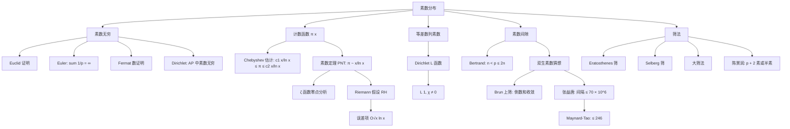

# 素数分布与解析数论初步（Prime Distribution & Analytic Number Theory）

> [!abstract] 核心定位
> 素数分布是数论中既深刻又优美的主题。Euclid 证明素数无穷，Euler 用 $\sum 1/p$ 发散给出第二个证明，Chebyshev、Riemann、Hadamard、de la Vallée-Poussin 等用解析方法建立了素数定理。本笔记系统介绍素数分布的核心定理、$\zeta$ 函数、Dirichlet 素数定理、筛法入门，以及它们在高联二试、TST、Putnam 等高档次竞赛中的应用，与 [[数论函数与欧拉定理]]、[[组合数论：卢卡斯与库默尔]]、[[数论不等式与估计]] 紧密相连。

---

## 一、素数无穷性

### 1.1 Euclid 证明

> [!important] Euclid 定理
> 素数有无穷多个。

**证明**：假设素数有限 $p_1, p_2, \ldots, p_n$。考虑 $N = p_1 p_2 \cdots p_n + 1$。$N$ 不能被任何 $p_i$ 整除（余数均为 $1$），故 $N$ 要么本身是素数，要么有不在列表中的素因子，矛盾。

### 1.2 Euler 证明（发散级数）

> [!important] Euler 定理
> $$\sum_{p \text{ 素}} \frac{1}{p} = +\infty$$

**证明**：用 Euler 乘积
$$\sum_{n=1}^{\infty} \frac{1}{n} = \prod_{p} \frac{1}{1 - p^{-1}}$$
左边发散（调和级数）。若 $\sum 1/p$ 收敛，则 $\prod (1 - 1/p)^{-1}$ 收敛，矛盾。

> [!note] Euler 证明的深化
> $\sum_{p \le x} 1/p = \ln \ln x + M + o(1)$，其中 $M$ 是 Meissel-Mertens 常数 $\approx 0.2615$。这给出素数密度的精确渐近。

### 1.3 其它证明

> [!important] Fermat 数证明
> Fermat 数 $F_n = 2^{2^n} + 1$ 满足 $\gcd(F_m, F_n) = 1$（$m \ne n$）。每个 $F_n$ 至少有一个素因子，这些素因子互不相同，故素数无穷。

> [!important] 递推证明
> 定义 $a_1 = 2$，$a_{n+1} = a_1 a_2 \cdots a_n + 1$。$\gcd(a_i, a_j) = 1$，每个 $a_n$ 至少一个素因子，素数无穷。

> [!important] Dirichlet 素数定理（1837）
> 对互素的正整数 $a, q$（$\gcd(a, q) = 1$），等差数列 $a, a+q, a+2q, \ldots$ 中含有无穷多个素数。

这是素数分布的高峰之一，证明需要 $L$ 函数理论。

---

## 二、Euler 乘积与 $\zeta$ 函数

### 2.1 $\zeta$ 函数定义

> [!important] Riemann $\zeta$ 函数
> $$\zeta(s) = \sum_{n=1}^{\infty} \frac{1}{n^s} \quad (\operatorname{Re} s > 1)$$

**收敛性**：当 $\operatorname{Re} s > 1$ 时绝对收敛，且可解析延拓到 $\mathbb{C} \setminus \{1\}$（$s = 1$ 为简单极点，留数 $1$）。

### 2.2 Euler 乘积

> [!important] Euler 乘积
> 对 $\operatorname{Re} s > 1$：
> $$\zeta(s) = \prod_{p} \frac{1}{1 - p^{-s}}$$

**证明**：$\dfrac{1}{1 - p^{-s}} = 1 + p^{-s} + p^{-2s} + \cdots$。乘积展开后由 [[整除与同余基础]] 中的算术基本定理（每个 $n$ 唯一分解）即得。

**对数导数**：
$$-\frac{\zeta'(s)}{\zeta(s)} = \sum_{n=1}^{\infty} \frac{\Lambda(n)}{n^s}$$
其中 $\Lambda(n)$ 是 von Mangoldt 函数（$n = p^k$ 时 $\Lambda(n) = \ln p$，否则 $0$）。

### 2.3 $\zeta$ 在整数点的值

> [!important] $\zeta(2k)$ 的 Euler 公式
> $$\zeta(2) = \frac{\pi^2}{6},\quad \zeta(4) = \frac{\pi^4}{90},\quad \zeta(6) = \frac{\pi^6}{945},\quad \zeta(2k) = (-1)^{k+1} \frac{B_{2k} (2\pi)^{2k}}{2 (2k)!}$$
> 其中 $B_{2k}$ 是 Bernoulli 数。

> [!note] $\zeta(3)$ 的 Apéry 值
> $\zeta(3) \approx 1.2020569$。Apéry（1978）证明 $\zeta(3)$ 是无理数。$\zeta(5), \zeta(7), \ldots$ 的有理性至今未解决。

> [!example] Euler 求 $\zeta(2)$
> 用 $\sin x / x$ 的无穷乘积：
> $$\frac{\sin x}{x} = \prod_{n=1}^{\infty} \left(1 - \frac{x^2}{n^2 \pi^2}\right)$$
> 比较 $x^2$ 系数：$-1/6 = -\sum 1/(n^2 \pi^2)$，故 $\zeta(2) = \pi^2/6$。

---

## 三、Chebyshev 估计与素数定理

### 3.1 素数计数函数

> [!important] $\pi(x)$ 定义
> $$\pi(x) = \#\{p \le x : p \text{ 素}\}$$

### 3.2 Chebyshev 估计

> [!important] Chebyshev 定理（1848）
> 存在常数 $c_1, c_2 > 0$ 使得对充分大 $x$：
> $$c_1 \frac{x}{\ln x} \le \pi(x) \le c_2 \frac{x}{\ln x}$$
>
> Chebyshev 取 $c_1 \approx 0.92$，$c_2 \approx 1.11$。

**证明思路**：用二项式系数 $\binom{2n}{n}$ 介于 $4^n/(2n+1)$ 与 $4^n$ 之间，结合其素因子分布得到 $\pi(x)$ 的上下界。

### 3.3 素数定理（PNT）

> [!important] 素数定理（Hadamard, de la Vallée-Poussin, 1896）
> $$\pi(x) \sim \frac{x}{\ln x} \quad (x \to \infty)$$
>
> 等价地：$\pi(x) \sim \operatorname{Li}(x) = \int_2^x \dfrac{dt}{\ln t}$（对数积分）。

**证明核心**：$\zeta(s)$ 在 $\operatorname{Re} s \ge 1$ 上无零点（除了 $s = 1$ 的简单极点），由此推出 $\psi(x) \sim x$，进而 $\pi(x) \sim x / \ln x$。其中 $\psi(x) = \sum_{p^k \le x} \ln p$ 是 Chebyshev 函数。

> [!note] PNT 的等价形式
> - $\psi(x) \sim x$（Chebyshev 第二函数的渐近）
> - $\theta(x) = \sum_{p \le x} \ln p \sim x$
> - $\pi(x) \sim x / \ln x$
> - $p_n \sim n \ln n$（第 $n$ 个素数的渐近）

### 3.4 误差项与 Riemann 假设

> [!important] Riemann 假设（RH）
> $\zeta(s)$ 的所有非平凡零点都位于直线 $\operatorname{Re} s = 1/2$ 上。

**RH 与 PNT 误差**：RH 等价于
$$\pi(x) = \operatorname{Li}(x) + O(\sqrt{x} \ln x)$$

目前最佳无条件结果：$\pi(x) = \operatorname{Li}(x) + O(x \exp(-c \sqrt{\ln x}))$（Vinogradov-Korobov）。

> [!example] 计算 $p_n$
> 第 $1000$ 个素数约为 $1000 \ln 1000 \approx 6908$。实际 $p_{1000} = 7919$。
> 第 $10^6$ 个素数约为 $10^6 \ln 10^6 \approx 13.8 \times 10^6$。实际 $p_{10^6} = 15485863$。

---

## 四、Bertrand 假设

> [!important] Bertrand 假设（Chebyshev 证明, 1852）
> 对任意整数 $n \ge 1$，存在素数 $p$ 满足 $n < p \le 2n$。

**证明思路**：用 $\binom{2n}{n}$ 的素因子分析。$\binom{2n}{n}$ 中的素因子 $p$ 满足 $p \le 2n$。如果所有素因子 $p \le n$，则 $\binom{2n}{n}$ 太小，矛盾。

> [!example] Bertrand 假设应用
> $n = 10$：素数 $11, 13, 17, 19$ 在 $(10, 20)$ 内。$n = 100$：素数 $101, 103, \ldots, 199$ 在 $(100, 200)$ 内（共 $21$ 个）。

> [!note] 加强形式
> - Nagura（1952）：$n \ge 25$ 时 $(n, 1.2n)$ 中有素数
> - 现代：对任意 $\epsilon > 0$，$n$ 充分大时 $(n, (1+\epsilon) n)$ 中有素数（PNT 推论）

---

## 五、Dirichlet 级数与 $L$ 函数

### 5.1 Dirichlet 特征

> [!important] Dirichlet 特征
> 模 $q$ 的 Dirichlet 特征 $\chi: \mathbb{Z} \to \mathbb{C}$ 满足：
> 1. $\chi(n) = 0$ 当 $\gcd(n, q) > 1$，否则 $|\chi(n)| = 1$
> 2. 完全积性：$\chi(mn) = \chi(m) \chi(n)$
> 3. 周期性：$\chi(n + q) = \chi(n)$

**主特征** $\chi_0$：$\chi_0(n) = 1$ 当 $\gcd(n, q) = 1$，否则 $0$。

**例子**：模 $4$ 有两个特征
- $\chi_0$：主特征
- $\chi_4$（非主）：$\chi_4(n) = \begin{cases} 1 & n \equiv 1 \pmod 4 \\ -1 & n \equiv 3 \pmod 4 \\ 0 & n \text{ 偶} \end{cases}$

### 5.2 Dirichlet $L$ 函数

> [!important] Dirichlet $L$ 函数
> $$L(s, \chi) = \sum_{n=1}^{\infty} \frac{\chi(n)}{n^s} = \prod_p \frac{1}{1 - \chi(p) p^{-s}} \quad (\operatorname{Re} s > 1)$$

**关键性质**：
- 主特征：$L(s, \chi_0) = \zeta(s) \prod_{p \mid q} (1 - p^{-s})$
- 非主特征：$L(s, \chi)$ 可解析延拓到整个 $\mathbb{C}$，且在 $s = 1$ 处**不**为零（$L(1, \chi) \ne 0$）

### 5.3 Dirichlet 素数定理证明

**关键步骤**：
1. 用特征正交性提取等差数列的素数贡献：
$$\sum_{\substack{p \le x \\ p \equiv a \pmod q}} \frac{1}{p^s} = \frac{1}{\varphi(q)} \sum_\chi \overline{\chi(a)} \sum_p \frac{\chi(p)}{p^s}$$
2. 主特征项发散（类似 Euler 证明）
3. 非主特征项收敛（因 $L(1, \chi) \ne 0$）
4. 故等差数列中的素数倒数和发散，特别有无穷多

> [!example] 计算 $L(1, \chi_4)$
> $L(1, \chi_4) = \sum_{n=1}^{\infty} \dfrac{\chi_4(n)}{n} = 1 - 1/3 + 1/5 - 1/7 + \cdots = \pi/4$（Leibniz 公式）。
>
> 由此 $\sum_{p \equiv 1 \!\!\pmod 4} 1/p$ 与 $\sum_{p \equiv 3 \!\!\pmod 4} 1/p$ 均发散。

---

## 六、素数分布的精细结果

### 6.1 算术级数中的素数定理

> [!important] 算术级数 PNT
> 对 $\gcd(a, q) = 1$：
> $$\pi(x; q, a) := \#\{p \le x : p \equiv a \pmod q\} \sim \frac{1}{\varphi(q)} \cdot \frac{x}{\ln x}$$

意义：素数在简化剩余类中均匀分布。

### 6.2 等差数列素数的常数偏差

> [!note] Chebyshev 偏差
> Chebyshev 注意到 $3 \pmod 4$ 的素数似乎比 $1 \pmod 4$ 多（"Chebyshev 偏差"）。Littlewood 证明 $\pi(x; 4, 3) - \pi(x; 4, 1)$ 的符号变化无穷多次，但首次符号反转出现在极大数（Rubinstein-Sarnak 估计为 $\sim 10^{312}$）。

### 6.3 素数间隙

> [!important] 素数间隙
> 相邻素数差 $g_n = p_{n+1} - p_n$。
> - 上界：$g_n = O(p_n^{0.525})$（Baker-Harman-Pintz, 2001）
> - 平均：$g_n \sim \ln p_n$（PNT 推论）
> - 下界：$\liminf g_n / \ln p_n = 0$（Erdős, 1935）；更精细 $\liminf (p_{n+1} - p_n) \le 246$（Polymath 8, 2014，基于张益唐 2013 突破）

> [!note] 双生素数猜想
> 存在无穷多对素数 $(p, p+2)$。至今未证。Zhang (2013) 证明存在无穷多对素数差 $\le 70 \times 10^6$，Maynard-Tao 改进至 $\le 246$。

### 6.4 素数定理中的奇点

> [!note] Skewes 数
> 假设 RH，$\pi(x) < \operatorname{Li}(x)$ 的首个反例小于 $e^{e^{e^{79.9}}}$；不假设 RH，小于 $e^{e^{e^{e^{7.705}}}}$。这些"Skewes 数"曾是数学中最大的具体数。

---

## 七、筛法简介

### 7.1 Eratosthenes 筛

> [!important] Eratosthenes 筛法
> 列出 $2, 3, \ldots, N$。从 $2$ 开始，删除所有 $2$ 的倍数（保留 $2$）；下一个未删的数是 $3$，删除所有 $3$ 的倍数；继续直到 $\sqrt{N}$。剩余的都是素数。

**复杂度**：$O(N \ln \ln N)$。

### 7.2 Selberg 筛与 Brun 筛

> [!important] Brun 定理（1919）
> $$\sum_{p, p+2 \text{ 均素}} \left(\frac{1}{p} + \frac{1}{p+2}\right) < \infty$$
>
> 特别地，双生素数倒数和收敛（与单素数倒数和发散对比）。

这是 Brun 上筛的应用，说明双生素数"稀少"。

### 7.3 大筛法

> [!important] 大筛法（Linnik, 1941）
> 设 $\mathcal{A}$ 是整数集，$P$ 是素数集。大筛法给出 $|\mathcal{A}|$ 被 $\{p \in P\}$ 上各剩余类分布的约束：
> $$\sum_{p \in P, p \le Q} p \sum_{a=1}^{p-1} \left|S(\mathcal{A}; p, a) - \frac{|\mathcal{A}|}{p}\right|^2 \le (N + Q^2) |\mathcal{A}|$$
> 其中 $S(\mathcal{A}; p, a) = \#\{n \in \mathcal{A} : n \equiv a \pmod p\}$。

大筛法是 Bombieri-Vinogradov 定理的基础，是解析数论的核心工具。

### 7.4 陈景润定理

> [!important] 陈景润定理（1973）
> 存在无穷多个素数 $p$ 使得 $p + 2$ 是**素数或半素数**（两素数之积）。

这是筛法理论的巅峰成果之一。

---

## 八、模形式与 $\zeta$ 函数的零点

### 8.1 函数方程

> [!important] $\zeta$ 的函数方程
> 完整化 $\xi(s) = \dfrac{1}{2} s(s-1) \pi^{-s/2} \Gamma(s/2) \zeta(s)$ 满足
> $$\xi(s) = \xi(1 - s)$$
>
> 即 $\zeta(s) = 2^s \pi^{s-1} \sin\!\left(\frac{\pi s}{2}\right) \Gamma(1-s) \zeta(1-s)$。

### 8.2 平凡零点与非平凡零点

> [!important] $\zeta$ 的零点
> - **平凡零点**：$s = -2, -4, -6, \ldots$（由 $\sin$ 因子产生）
> - **非平凡零点**：位于临界带 $0 < \operatorname{Re} s < 1$ 内

**Riemann-von Mangoldt 公式**：非平凡零点数 $N(T) = \dfrac{T}{2\pi} \ln \dfrac{T}{2\pi} - \dfrac{T}{2\pi} + O(\ln T)$。

### 8.3 BSD 猜想与模形式

椭圆曲线的 $L$ 函数与模形式的 $L$ 函数相关（Wiles-Taylor 的模性定理，证明 Fermat 大定理的关键）。Birch-Swinneryer-Dyer 猜想将椭圆曲线的有理点群与 $L(E, s)$ 在 $s = 1$ 处的零点阶数联系起来。

---

## 九、典型例题

> [!example] 例 1：$\pi(x)$ 估计
> 估计 $\pi(100)$ 与 $\pi(1000)$。
>
> **解**：$x / \ln x$：$\pi(100) \approx 100/\ln 100 \approx 21.7$（实际 $25$）；$\pi(1000) \approx 1000/\ln 1000 \approx 144.8$（实际 $168$）。
>
> 用 $\operatorname{Li}(x) = \int_2^x dt / \ln t$ 更精确：$\operatorname{Li}(100) \approx 30$，$\operatorname{Li}(1000) \approx 178$。

> [!example] 例 2：Bertrand 应用
> 证明 $n \ge 2$ 时 $n!$ 与 $(n+1)!$ 之间有素数。
>
> **解**：由 Bertrand，$(n+1)!$ 与 $2(n+1)!$ 间有素数 $p$。$p > (n+1)! > n!$。或者直接用 $n < p \le 2n$（其中 $n$ 换成 $n!$）：存在素数 $p$ 使 $n! < p \le 2 n!$，而 $2 n! \le (n+1)!$（当 $n \ge 2$）。

> [!example] 例 3：Euler 乘积应用
> 证明 $\zeta(2) = \pi^2/6$ 推出 $1 + 1/4 + 1/9 + \cdots = \pi^2/6$。
>
> **解**：$\zeta(2) = \sum 1/n^2 = \pi^2/6$，由 Euler 乘积 $\zeta(2) = \prod_p 1/(1 - 1/p^2) = \prod_p p^2/(p^2 - 1)$。故
> $$\prod_p \frac{p^2}{p^2 - 1} = \frac{\pi^2}{6}$$
> 这是"素数的几何级数乘积 = $\pi^2/6$"的深刻结论。

> [!example] 例 4：素数倒数和发散
> 证明 $\sum_p 1/p = \infty$ 推出素数无穷。
>
> **解**：若素数有限，则 $\sum_p 1/p$ 有限，矛盾。故素数无穷。

> [!example] 例 5：特征与 $L$ 函数
> 计算 $L(1, \chi_{-4})$，其中 $\chi_{-4}(n) = \left(\dfrac{-4}{n}\right) = \left(\dfrac{-1}{n}\right)$（即 $1, -1, 0$ 取决于 $n \bmod 4$）。
>
> **解**：$L(1, \chi_{-4}) = 1 - 1/3 + 1/5 - 1/7 + \cdots = \arctan(1) = \pi/4$。
>
> 这是 Leibniz 公式，给出了 $\pi$ 的简单级数表示。

> [!example] 例 6：等差数列中的素数
> 求 $1 \pmod 4$ 与 $3 \pmod 4$ 中不超过 $100$ 的素数个数比。
>
> **解**：$1 \pmod 4$：$5, 13, 17, 29, 37, 41, 53, 61, 73, 89, 97$ 共 $11$ 个（加 $2$ 不算 $4k+1$ 或 $4k+3$）。
> $3 \pmod 4$：$3, 7, 11, 19, 23, 31, 43, 47, 59, 67, 71, 79, 83$ 共 $13$ 个。
> $3 \pmod 4$ 略多，体现 Chebyshev 偏差。

> [!example] 例 7：素数定理的等价
> 证明 $\theta(x) \sim x \iff \pi(x) \sim x / \ln x$。
>
> **解**：$\theta(x) = \sum_{p \le x} \ln p$。用 Abel 求和：
> $$\theta(x) = \pi(x) \ln x - \int_2^x \frac{\pi(t)}{t} dt$$
> 若 $\pi(x) \sim x/\ln x$，则 $\theta(x) \sim x - \int_2^x (1/\ln t) dt \sim x$。反之类似。

> [!example] 例 8：双生素数倒数和
> 已知 $\sum_{p, p+2 \text{ 素}} (1/p + 1/(p+2)) < \infty$（Brun）。求前几项和的近似值。
>
> **解**：双生素数对 $(3, 5), (5, 7), (11, 13), (17, 19), (29, 31), (41, 43), \ldots$
> 前 $6$ 对贡献：$1/3 + 1/5 + 1/5 + 1/7 + 1/11 + 1/13 + 1/17 + 1/19 + 1/29 + 1/31 + 1/41 + 1/43 \approx 0.333 + 0.2 + 0.2 + 0.143 + 0.091 + 0.077 + 0.059 + 0.053 + 0.034 + 0.032 + 0.024 + 0.023 \approx 1.27$
>
> Brun 常数 $B_2 \approx 1.90216$。

> [!example] 例 9：Mertens 定理
> Mertens 第三定理：$\prod_{p \le x} (1 - 1/p) \sim e^{-\gamma} / \ln x$，其中 $\gamma$ 是 Euler-Mascheroni 常数。
>
> 验证：$x = 100$，$e^{-\gamma} \approx 0.5615$，$\ln 100 \approx 4.605$，预测 $0.5615/4.605 \approx 0.122$。实际：$\prod_{p \le 100} (1 - 1/p) \approx 0.120$。✓

---

## 十、与竞赛的联系

### 10.1 一试常见

- 调和级数与素数倒数和的发散
- $\zeta(2) = \pi^2/6$ 的应用
- Bertrand 假设在存在性问题中的应用

### 10.2 二试与 TST

- $\pi(x)$ 估计证明不等式（如 $n! < n^n$ 的反例分析）
- Dirichlet 素数定理在等差数列问题中的应用
- 用 Chebyshev 估计证明素数无穷

### 10.3 高级竞赛

- RH 与素数分布的初等推论
- 筛法在计数问题中的应用
- 模形式与分拆数 $p(n)$ 的 Ramanujan 同余

---

## 十一、知识链接

- [[数论函数与欧拉定理]] — $\varphi, \mu, \Lambda$ 等函数的解析性质
- [[组合数论：卢卡斯与库默尔]] — 分拆数 $p(n)$ 与 Ramanujan 同余
- [[整除与同余基础]] — 算术基本定理是 Euler 乘积的基础
- [[二次型理论]] — 类数公式中的 $L$ 函数
- [[同余方程进阶与Hensel引理]] — $p$-adic $L$ 函数与解析延拓
- [[代数数论初步]] — Dedekind $\zeta$ 函数与类数公式

---

## 十二、mermaid 图：素数分布核心结构

---

## 十三、附录：常用 $\zeta$ 函数值与常数

| 函数值 | 数值 |
|:---|:---|
| $\zeta(2)$ | $\pi^2/6 \approx 1.6449$ |
| $\zeta(3)$ | $\approx 1.2021$（Apéry 常数，无理数） |
| $\zeta(4)$ | $\pi^4/90 \approx 1.0823$ |
| $\zeta(6)$ | $\pi^6/945 \approx 1.0173$ |
| $\zeta(1/2)$ | $\approx -1.4604$ |
| $\zeta(-1)$ | $-1/12$（Ramanujan 求和基础） |
| $\zeta(-2n)$ | $0$（平凡零点） |
| Euler 常数 $\gamma$ | $\approx 0.5772$ |
| Meissel-Mertens 常数 | $\approx 0.2615$ |
| Brun 常数 $B_2$ | $\approx 1.9022$ |
| $\operatorname{Li}(100)$ | $\approx 30$ |
| $\operatorname{Li}(1000)$ | $\approx 178$ |

% 注：$\zeta(-1) = -1/12$ 在解析延拓意义下成立，是弦理论与 Ramanujan 求和的关键。
