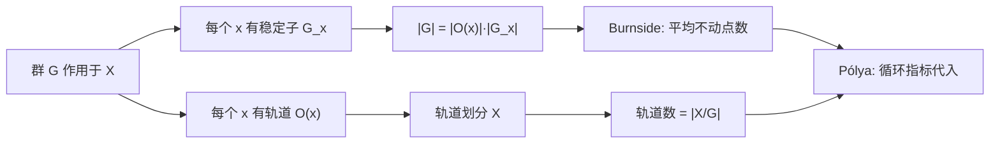
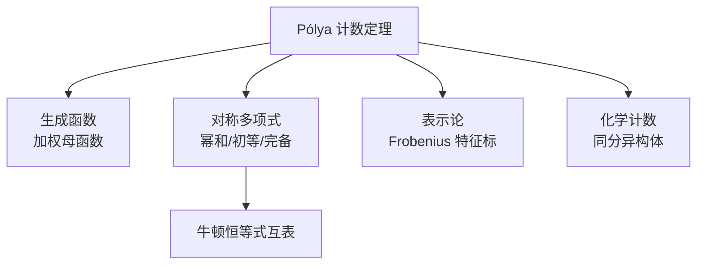

# 对称群与 Pólya 计数定理

## 引言

在组合计数中，常会遇到「本质不同」的计数问题：用若干颜色染项链的珠子，旋转后相同的算同一种；染立方体的六个面，旋转后重合的算同一种；长度为 $n$ 的字符串在循环移位下视为等价……这些问题的共同结构是：**一个群 $G$ 作用在某个「染色方案」集合 $X$ 上，要求计算轨道数 $|X/G|$**。

> [!abstract] 核心思想
> 将「本质不同」视为群作用下的「不等价」，把朴素的 $|X|$ 计数转化为对**轨道数** $|X/G|$ 的计数。Burnside 引理与 Pólya 定理正是实现这一转化的两把利器。

> [!info] 历史脉络
> - **Redfield (1927)**：最早使用「双重计数」技巧处理循环指标类问题，但论文长期被忽视。
> - **Pólya (1937)**：独立且系统地建立了一般理论，发表于 *Acta Mathematica*，影响深远，故今多称 **Pólya 计数定理**。
> - 现代教材常将二者并称为 **Redfield–Pólya 定理**。

前置阅读：[[计数原理与方法]] | [[组合恒等式与生成函数]]

---

## 一、群作用基础

> [!info] 群作用的定义
> 设 $G$ 为群，$X$ 为集合。称 $G$ **作用**于 $X$，若存在映射 $G \times X \to X$（记 $(g,x) \mapsto g \cdot x$），满足：
> 1. **单位元**：$e \cdot x = x$，$\forall x \in X$；
> 2. **相容性**：$g \cdot (h \cdot x) = (gh) \cdot x$，$\forall g, h \in G, x \in X$。

直观地，每个 $g \in G$ 给出 $X$ 上的一个置换，且 $g \mapsto (x \mapsto g \cdot x)$ 是 $G$ 到 $\mathrm{Sym}(X)$ 的群同态。

> [!info] 轨道与稳定子
> - **轨道**：$O(x) = \{g \cdot x : g \in G\}$，即 $x$ 在群作用下能到达的所有位置。轨道构成 $X$ 的一个划分。
> - **稳定子**：$G_x = \{g \in G : g \cdot x = x\}$，即所有「固定」$x$ 的群元。$G_x$ 是 $G$ 的子群。

> [!abstract] 轨道-稳定子定理
> 对任意 $x \in X$，
> $$|G| = |O(x)| \cdot |G_x|.$$
> 即「群的大小 = 轨道大小 × 稳定子大小」。

> [!tip] 证明思路
> 建立双射 $G/G_x \to O(x)$，$g G_x \mapsto g \cdot x$。需验证该映射良定义且为双射——关键在于 $g \cdot x = h \cdot x \iff h^{-1}g \in G_x$。这与 [[计数原理与方法]] 中「以等价类为单位的计数」一脉相承。

> [!example] 例1：$S_n$ 作用于 $\{1,2,\ldots,n\}$
> 取 $G = S_n$，作用为 $\sigma \cdot i = \sigma(i)$。对任意 $i$，轨道 $O(i) = \{1,\ldots,n\}$（$S_n$ 可迁），稳定子 $G_i \cong S_{n-1}$（置换其余 $n-1$ 个元素）。于是 $|S_n| = n \cdot |S_{n-1}| = n \cdot (n-1)! = n!$，与已知吻合。

---

## 二、Burnside 引理

### 2.1 共轭类与不动点

对 $g \in G$，记 $g$ 的**不动点集**为
$$X^g = \{x \in X : g \cdot x = x\}.$$
Burnside 的关键洞察是：轨道数等于「所有群元不动点数的平均值」。

> [!abstract] Burnside 引理
> 设有限群 $G$ 作用于有限集 $X$，则轨道数（即不等价类数）为
> $$|X/G| = \frac{1}{|G|} \sum_{g \in G} |X^g|.$$

### 2.2 证明（双计数法）

> [!note] 证明要点
> 双计数集合 $S = \{(g, x) : g \in G,\ x \in X,\ g \cdot x = x\}$。
> - **按 $g$ 计数**：$|S| = \sum_{g \in G} |X^g|$。
> - **按 $x$ 计数**：$|S| = \sum_{x \in X} |G_x|$。
>
> 由轨道-稳定子定理，$|G_x| = |G|/|O(x)|$。对同一轨道内所有 $x$，$|O(x)|$ 相同，故
> $$\sum_{x \in X} |G_x| = \sum_{\text{轨道 } O} \sum_{x \in O} \frac{|G|}{|O|} = \sum_{\text{轨道 } O} |G| = |G| \cdot |X/G|.$$
> 两式相等即得 Burnside 引理。这与 [[计数原理与方法]] 中的双计数技巧一脉相承。

### 2.3 例题

> [!example] 例2：正方形 4 顶点三染色
> 用 3 种颜色染正方形 4 个顶点，旋转后重合视为同一种，求不同染色数。
>
> > [!success]- 解析
> > 旋转群 $G = C_4 = \{e, r_{90}, r_{180}, r_{270}\}$，$|G|=4$。逐个计算 $|X^g|$：
> > - $e$：所有 $3^4 = 81$ 种染色都固定。
> > - $r_{90}, r_{270}$：四顶点必须同色，故 $|X^g| = 3$。
> > - $r_{180}$：对顶点同色，$|X^g| = 3^2 = 9$。
> >
> > 由 Burnside：
> > $$|X/G| = \frac{1}{4}(81 + 3 + 9 + 3) = \frac{96}{4} = 24.$$

> [!example] 例3：$k$ 色项链（仅旋转等价）
> 用 $k$ 种颜色染 $n$ 颗珠子的项链，仅旋转等价（不含翻转），求不同项链数。
>
> > [!success]- 解析
> > 旋转群 $C_n$，元素为旋转 $j$ 位（$j=0,\ldots,n-1$）。旋转 $j$ 位将 $n$ 个位置分成 $\gcd(n,j)$ 个长为 $n/\gcd(n,j)$ 的循环，故 $|X^g| = k^{\gcd(n,j)}$。于是
> > $$|X/C_n| = \frac{1}{n}\sum_{j=0}^{n-1} k^{\gcd(n,j)}.$$
> > 按 $d = \gcd(n,j)$ 分类，使得 $\gcd(n,j)=d$ 的 $j$ 共有 $\varphi(n/d)$ 个（$d\mid n$），代换 $d \to n/d$ 得
> > $$\boxed{|X/C_n| = \frac{1}{n}\sum_{d\mid n} \varphi(d)\, k^{n/d}.}$$
> > 此即项链计数公式。如 $n=6,\ k=2$：$\frac{1}{6}(\varphi(1)2^6 + \varphi(2)2^3 + \varphi(3)2^2 + \varphi(6)2^1) = \frac{1}{6}(64+8+8+4)=14$。

---

## 三、循环指标与 Pólya 计数定理

### 3.1 置换的循环型

> [!info] 循环型 (cycle type)
> $g \in S_n$ 的循环型记作 $1^{c_1(g)} 2^{c_2(g)} \cdots n^{c_n(g)}$，其中 $c_i(g)$ 为 $g$ 中长为 $i$ 的循环个数。满足 $\sum_{i=1}^{n} i\, c_i(g) = n$。循环总数记 $c(g) = c_1(g) + \cdots + c_n(g)$。

> [!tip] 不动点与循环型
> 当 $g$ 作用在染色集合 $X = \{1,\ldots,n\} \to \{1,\ldots,k\}$ 上时，$g$ 固定一个染色当且仅当**每个循环内部颜色相同**。故 $|X^g| = k^{c(g)}$。这是从 Burnside 到 Pólya 的关键一步。

### 3.2 循环指标

> [!abstract] 循环指标 (cycle index)
> 设 $G$ 作用于 $n$ 元集，$G$ 的循环指标定义为多元多项式
> $$Z(G; x_1, x_2, \ldots, x_n) = \frac{1}{|G|} \sum_{g \in G} x_1^{c_1(g)} x_2^{c_2(g)} \cdots x_n^{c_n(g)}.$$
> 它是群 $G$ 的「对称指纹」——编码了 $G$ 中各循环型的分布。

### 3.3 Pólya 计数定理

> [!abstract] Pólya 定理（无权版）
> 用 $k$ 种颜色染 $X$ 中 $n$ 个元素，在群 $G$ 作用下不等价的染色数为
> $$|X/G| = Z(G; \underbrace{k, k, \ldots, k}_{n}) = \frac{1}{|G|}\sum_{g \in G} k^{c(g)}.$$

> [!abstract] Pólya 定理（加权版 / 生成函数版）
> 设颜色集合为 $\{1,\ldots,k\}$，颜色 $i$ 权重为 $w_i$。对染色 $f: X \to \{1,\ldots,k\}$，定义权 $W(f) = \prod_{x \in X} w_{f(x)}$。则按轨道求和的权母函数为
> $$\sum_{\text{轨道 } O} W(O) = Z\!\left(G;\ \sum_i w_i,\ \sum_i w_i^2,\ \ldots,\ \sum_i w_i^n\right).$$
> 若令所有 $w_i = 1$，即得无权版。加权版可同时统计「各颜色用量固定」的染色数——只需提取对应项的系数。

### 3.4 例题

> [!example] 例4：项链与手镯（含翻转）
> 用 2 色染 6 颗珠子的手镯（旋转 **且** 翻转等价），求不同方案数。
>
> > [!success]- 解析
> > 手镯对称群为二面体群 $D_6$（$|D_6|=12$）。代入后文第四节 $D_6$ 的循环指标并令 $x_i = 2$：
> > $$Z(D_6) = \frac{1}{12}\big(x_1^6 + 3 x_1^2 x_2^2 + 4 x_2^3 + 2 x_3^2 + 2 x_6\big),$$
> > $$|X/D_6| = \frac{1}{12}(2^6 + 3\cdot 2^4 + 4\cdot 2^3 + 2\cdot 2^2 + 2\cdot 2) = \frac{156}{12} = 13.$$
> > 对比仅旋转的项链数为 $14$，翻转使 $000111$ 与 $111000$ 这类对合并，减少 $1$ 类，恰为 $13$。

---

## 四、典型群作用与循环指标

### 4.1 循环群 $C_n$（项链旋转）

> [!info] $Z(C_n)$
> $$Z(C_n) = \frac{1}{n}\sum_{d\mid n} \varphi(d)\, x_d^{\,n/d}.$$
> 推导：旋转 $j$ 位的循环型仅由 $d = n/\gcd(n,j)$ 决定，循环型为 $d^{n/d}$，对应群元数为 $\varphi(d)$。

### 4.2 二面体群 $D_n$（手镯，含翻转）

> [!info] $Z(D_n)$
> $$Z(D_n) = \frac{1}{2} Z(C_n) + R(n),$$
> 其中翻转贡献
> $$R(n) = \begin{cases} \dfrac{1}{2}\, x_1\, x_2^{(n-1)/2}, & n \text{ 奇},\\[6pt] \dfrac{1}{4}\!\left(x_1^2\, x_2^{(n-2)/2} + x_2^{n/2}\right), & n \text{ 偶}. \end{cases}$$
> - $n$ 奇：每条翻转轴过 1 顶点 + 其余配对，循环型 $1^1 2^{(n-1)/2}$。
> - $n$ 偶：一半轴过对顶点（$1^2 2^{(n-2)/2}$），一半轴过对边中点（$2^{n/2}$）。

### 4.3 立方体旋转群（24 阶）

> [!info] 立方体旋转群的共轭类
> | 类 | 元素数 | 作用循环型（面 / 顶点） |
> |---|---|---|
> | 恒等 | $1$ | 面 $1^6$；顶点 $1^8$ |
> | 面 $90°/270°$ | $6$ | 面 $1^2 4^1$；顶点 $4^2$ |
> | 面 $180°$ | $3$ | 面 $1^2 2^2$；顶点 $2^4$ |
> | 体对角线 $120°/240°$ | $8$ | 面 $3^2$；顶点 $1^2 3^2$ |
> | 对棱 $180°$ | $6$ | 面 $2^3$；顶点 $2^4$ |

> [!abstract] 立方体旋转群循环指标
> - **作用于 6 面**：
> $$Z = \frac{1}{24}\!\left(x_1^6 + 6 x_1^2 x_4 + 3 x_1^2 x_2^2 + 8 x_3^2 + 6 x_2^3\right).$$
> - **作用于 8 顶点**：
> $$Z = \frac{1}{24}\!\left(x_1^8 + 6 x_4^2 + 9 x_2^4 + 8 x_1^2 x_3^2\right).$$

### 4.4 正四面体旋转群（12 阶）

> [!abstract] 四面体旋转群循环指标（作用于 4 顶点）
> $$Z = \frac{1}{12}\!\left(x_1^4 + 8 x_1 x_3 + 3 x_2^2\right).$$
> 共轭类：恒等（$1$）、绕顶点-对面中心 $120°/240°$（$8$，循环型 $1^1 3^1$）、绕对棱中点 $180°$（$3$，循环型 $2^2$）。

> [!example] 例5：立方体六面 $k$ 染色
> 求用 $k$ 色染立方体六面（旋转等价）的不等价方案数，并算 $k=3$。
>
> > [!success]- 解析
> > 代入 $x_i = k$：
> > $$|X/G| = \frac{1}{24}\!\left(k^6 + 3 k^4 + 12 k^3 + 8 k^2\right).$$
> > $k=3$：$\frac{1}{24}(729 + 243 + 324 + 72) = \frac{1368}{24} = 57$。

---

## 五、竞赛应用

### 5.1 染色计数的一般流程

> [!tip] 解题范式
> 1. **识别对称群** $G$（旋转？翻转？全对称？）；
> 2. **写出循环指标** $Z(G)$（或直接用 Burnside 逐元算不动点）；
> 3. **代入颜色数** $k$（无权）或**代入权母函数**（加权，统计用量）；
> 4. 化简得轨道数。

> [!warning] 常见错误
> - **群选错**：项链题误用 $D_n$（多算了翻转）、手镯题误用 $C_n$（漏算翻转）。务必先确认「能否翻转」。
> - **漏除 $|G|$**：Burnside 是「平均」不动点数，忘除 $|G|$ 会得放大 $|G|$ 倍的错答。
> - **循环型写错**：立方体 $180°$ 面旋转作用于顶点是 $2^4$（4 对），而非 $2^2$；作用于面才是 $1^2 2^2$。同一群在不同作用对象上循环型不同，切勿混用。
> - **加权与无权混淆**：加权 Pólya 代入 $\sum w_i^j$，无权版代入 $k$；统计「用量固定」必须用加权版并提系数。

### 5.2 与图染色的对比

> [!note] Pólya vs 图色数
> - **Pólya 计数**：颜色分配**自由**，关心「等价类个数」，对称来自几何群的**置换**作用。
> - **图染色（色数）**：颜色分配受**邻接约束**（相邻不同色），关心「最少颜色数」或「合法染色数」，见 [[图论基础与染色]]。
> 二者本质不同：Pólya 无约束但计等价类，图染色有约束但不（一定）计等价。竞赛中偶尔叠加——既受邻接约束又计对称等价——此时需先用容斥/色多项式算合法染色，再商去群作用。

### 5.3 例题

> [!example] 例6：圆排列双色染色（旋转 + 翻转）
> 用红、蓝两色染 $n$ 颗珠子的手镯，证明不同方案数为
> $$\frac{1}{2}\!\left[\frac{1}{n}\sum_{d\mid n}\varphi(d)\,2^{n/d}\right] + \begin{cases} 2^{(n-1)/2}, & n\text{ 奇},\\ 2^{n/2-1} + 2^{n/2-1}, & n\text{ 偶}. \end{cases}$$
>
> > [!success]- 解析
> > 由 $Z(D_n)$ 代 $x_i = 2$：
> > - 旋转部分：$\frac{1}{2n}\sum_{d\mid n}\varphi(d)\,2^{n/d}$。
> > - $n$ 奇：翻转贡献 $\frac{1}{2}\cdot n \cdot 2^{(n+1)/2}/2n = 2^{(n-1)/2}$（每翻转固定 $2^{(n+1)/2}$ 染色，共 $n$ 条轴，再除 $2n$）。
> > - $n$ 偶：两类翻转各 $n/2$ 条，贡献 $\frac{1}{2n}\!\left[\frac{n}{2}\cdot 2^{n/2+1} + \frac{n}{2}\cdot 2^{n/2}\right] = 2^{n/2-1} + 2^{n/2-1}$。

> [!example] 例7：IMO 1997 第 5 题的群作用思想（点集划分）
> 该届第 5 题探讨整数对 $(a,b)$ 满足 $a^{b^2}=b^a$ 的求解。其背后蕴含的「**对参数空间作对称划分、只计代表元**」的思路，与群作用计数同源：当变量间存在对称（如交换 $a \leftrightarrow b$、或在循环群下调位），可先按对称类归并、再对每类作规范化处理。
>
> > [!success]- 思路
> > - **归并对称类**：将解按某种等价关系（此题为大小序 $a \le b$ vs $a > b$）分两类，避免重复枚举。
> > - **每类规范化**：$a \le b$ 时由 $a^{b^2} = b^a$ 得 $a^b \le b$，强约束下迅速定位 $a=1$；$a > b$ 时令 $a = k b^2$ 降阶为 $k = b^{k-2}$。
> > - **对应到群作用**：群作用计数中「先求轨道代表、再对代表计数」与「先分对称类、再逐类求解」结构一致。最终解为 $(a,b) \in \{(1,1),(16,2),(27,3)\}$。
> > 这一思想在处理「循环排列」「可重排列」「点集在对称群下划分」等竞赛题时尤为有效：识别对称 → 写出群 → 计代表元。

---

## 六、综合例题

> [!example] 例8：$4\times 4$ 棋盘双色染色（仅旋转等价）
> 用黑白两色染 $4\times 4$ 棋盘的 16 格，旋转后重合视为同一种，求不等价方案数。
>
> > [!success]- 解析
> > 旋转群 $C_4$ 作用于 16 格，逐元分析循环型：
> > - $e$：$1^{16}$，贡献 $2^{16} = 65536$。
> > - $r_{90}, r_{270}$：4 个长 4 循环，循环型 $4^4$，各贡献 $2^4 = 16$。
> > - $r_{180}$：8 个长 2 循环，循环型 $2^8$，贡献 $2^8 = 256$。
> >
> > 由 Pólya：
> > $$|X/C_4| = \frac{1}{4}(65536 + 256 + 16 + 16) = \frac{65824}{4} = 16456.$$
> > 若进一步计入 4 条翻转轴（扩为 $D_4$，8 元），结果为 $8548$。

> [!example] 例9：立方体顶点三染色
> 用 3 色染立方体 8 顶点（旋转等价），求不等价方案数。
>
> > [!success]- 解析
> > 用第四节立方体顶点循环指标，代 $x_i = 3$：
> > $$|X/G| = \frac{1}{24}\!\left(3^8 + 6\cdot 3^2 + 9\cdot 3^4 + 8\cdot 3^2\cdot 3^2\right).$$
> > 逐项：$3^8 = 6561$；$6\cdot 9 = 54$；$9\cdot 81 = 729$；$8\cdot 9\cdot 9 = 648$。
> > $$|X/G| = \frac{6561 + 54 + 729 + 648}{24} = \frac{7992}{24} = 333.$$

---

## 七、延伸

> [!note] Pólya 与生成函数
> 加权 Pólya 定理的权母函数 $Z(G; \sum w_i, \sum w_i^2, \ldots)$ 本身即一种**特殊生成函数**：它把「轨道」编码为多项式系数。这与 [[组合恒等式与生成函数]] 中「序列 $\to$ 函数」的母函数思想完全一致——只是此处「指数」记录的是循环长度，「系数」记录的是轨道权重。提取 $x_1^{a_1}\cdots x_k^{a_k}$ 的系数，即可读出「恰用 $a_i$ 个颜色 $i$」的轨道数。

> [!note] 与对称多项式的联系
> 循环指标 $Z(G)$ 是变量 $x_1,\ldots,x_n$ 上的多项式，且在 $S_n$ 共轭下表现良好，与**对称多项式**理论天然耦合。例如幂和对称函数 $p_k = \sum w_i^k$ 正是加权 Pólya 代入的「原子」。由此可借助 [[对称多项式与牛顿恒等式深化]] 中的牛顿恒等式 $p_k, e_k, h_k$ 互表，把循环指标在不同基下转换，揭示计数与表示论的深层联系（Frobenius 特征标对应）。

> [!info] 应用：化学同分异构体计数
> Pólya 定理的最早应用之一即化学中**同分异构体计数**：将分子骨架（如苯环、烷烃碳架）的对称群作为 $G$，把「挂原子团」视为染色，循环指标直接给出异构体数。例如 $C_n H_{2n+2}$ 烷烃的取代异构体计数、苯环二取代/三取代位置异构体数等，均可由 Pólya 一键给出——这正是 Pólya 1937 年原论文的动机之一。

---

## 相关链接

- [[计数原理与方法]]
- [[组合恒等式与生成函数]]
- [[图论基础与染色]]
- [[高级图论与网络流]]
- [[对称多项式与牛顿恒等式深化]]
- [[矩阵与线性代数初步]]
