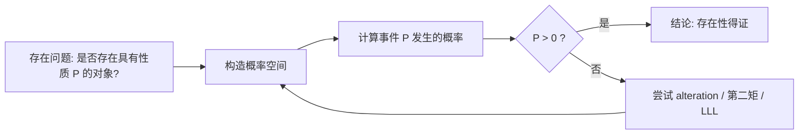
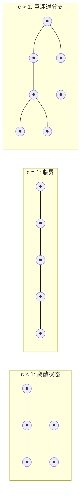
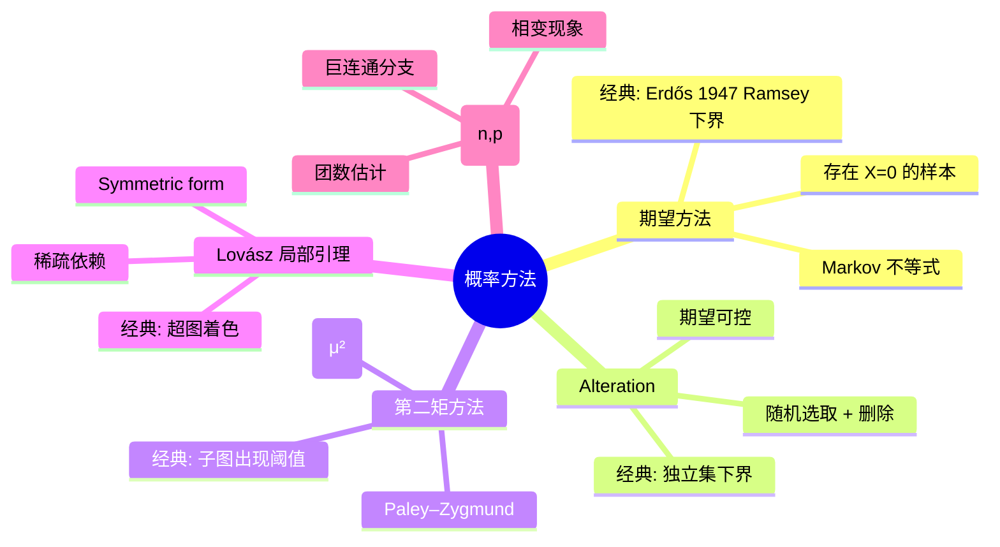

# 概率方法与随机结构

> [!abstract] 摘要
> 本笔记系统介绍 **Erdős 概率方法** 的核心思想与工具,涵盖 Markov / Chebyshev / Chernoff 不等式、期望方法、alteration 方法、Lovász 局部引理、Erdős–Rényi 随机图 $G(n,p)$、第二矩方法等。所有内容面向 CMO / TST / IMO 级别竞赛,强调「以随机性证明存在性」的方法论。

## 引言

概率方法的精神可以一句话概括:

> **以随机性证明存在性。**

具体地,要证明存在一个具有性质 $\mathcal{P}$ 的组合对象,只需构造一个概率空间,使得随机对象具有性质 $\mathcal{P}$ 的概率严格大于 $0$ —— 那么这样的对象必然存在。

> [!info] 历史脉络
> 1947 年,Paul Erdős 用概率方法给出了 Ramsey 数的下界 $R(k,k) > 2^{k/2}$,这是概率方法在组合学中的首次亮相,也是现代组合学的开端之一。此后 Erdős、Lovász、Spencer、Alon 等人将其发展为系统的方法论。
> 
> 代表性著作:
> - Noga Alon & Joel Spencer, *The Probabilistic Method* (4th ed., 2016)
> - Erdős (1947) "Some remarks on the theory of statistics"

概率方法与 [[拉姆齐理论与极图理论]] 的联系尤为紧密:许多 Ramsey 数、Turán 数、色数下界都通过随机构造给出。它也是 [[组合极值与构造]] 的重要工具之一。

## 一、基础工具

### 1.1 Markov 不等式

> [!note] Markov 不等式
> 设 $X$ 是非负随机变量,则对任意 $a > 0$,
> $$P(X \ge a) \le \dfrac{E[X]}{a}.$$

**证明**:$E[X] = \sum_x x \cdot P(X=x) \ge \sum_{x \ge a} a \cdot P(X=x) = a \cdot P(X \ge a)$。

这是概率方法「最朴素」的入口:若 $E[X] < 1$,则 $P(X < 1) > 0$,即存在 $X = 0$ 的样本($X$ 取整数值时)。

### 1.2 Chebyshev 不等式

> [!note] Chebyshev 不等式
> 设 $X$ 期望为 $\mu$,方差为 $\sigma^2 = \text{Var}(X)$,则
> $$P(|X - \mu| \ge a) \le \dfrac{\sigma^2}{a^2}.$$

### 1.3 Chernoff 不等式(Hoeffding 形式)

> [!note] Chernoff 不等式
> 设 $X_1, X_2, \ldots, X_n$ 是独立指示变量(取值 $\{0,1\}$),令 $X = \sum_i X_i$,$\mu = E[X]$,则对任意 $\epsilon > 0$,
> $$P(X \ge (1+\epsilon)\mu) \le \exp\!\left(-\dfrac{\epsilon^2 \mu}{2 + \epsilon}\right),$$
> $$P(X \le (1-\epsilon)\mu) \le \exp\!\left(-\dfrac{\epsilon^2 \mu}{2}\right).$$

Chernoff 不等式给出独立和的**指数级尾**,在随机图分析中是关键工具。

### 1.4 第二矩方法(预备)

第二矩方法基于 **Paley–Zygmund 不等式**:

$$P(X > 0) \ge \dfrac{(E[X])^2}{E[X^2]}.$$

当 $E[X^2] \approx (E[X])^2$ 时,$P(X > 0)$ 接近 $1$,即「期望的二次方与二次期望同阶」保证了存在性。

> [!tip] 口诀
> - **第一矩**:期望小 → 存在 $X=0$ 的样本
> - **第二矩**:期望大且方差小 → 存在 $X \ge 1$ 的样本

> [!example] 例题 1:用 Markov 不等式证明存在性
> **问题**:证明存在 $n \times n$ 的 $0$–$1$ 矩阵,其任意两行在每列上都不同时为 $1$,且行重至少为 $\log_2 n / 2$。
> 
> > [!success]- 解答
> > 设矩阵每个元素独立以概率 $p$ 取 $1$。对固定一行,其重 $R \sim \text{Bin}(n, p)$,$E[R] = np$。
> > 选 $p = \dfrac{\log_2 n}{2n}$,则 $E[R] = \dfrac{\log_2 n}{2}$。
> > 对两行同时为 $1$ 的列数 $Z$,$E[Z] = n p^2 = \dfrac{(\log_2 n)^2}{4n}$。
> > 当 $n$ 充分大时,$E[Z]$ 远小于 $1$,Markov 给出 $P(Z \ge 1) < 1$。再由 Markov 控制行重偏差即可。具体细节略,留作练习。

## 二、概率方法核心范式

### 2.1 期望方法

> [!abstract] 期望方法范式
> 设 $X$ 是定义在某个概率空间上的非负整数随机变量。
> 若 $E[X] < 1$,则 $P(X = 0) > 0$,即存在样本使 $X = 0$。
> 等价地,若 $E[X] \le t$,则存在样本使 $X \le t$。

这是「最朴素的概率方法」,但威力惊人。

### 2.2 Alteration 方法

> [!abstract] Alteration 方法范式
> 1. 随机选取一个结构;
> 2. 删除其中的「不良」部分(使期望可控);
> 3. 用期望论证剩余结构仍具所需规模。
> 
> 即 $X = X_{\text{good}} - X_{\text{bad}}$,通过 $E[X_{\text{good}}] - E[X_{\text{bad}}]$ 给出下界。

### 2.3 经典例:Erdős 1947 年 Ramsey 下界

> [!example] 例题 2:Erdős 1947 证明 $R(k, k) > 2^{k/2}$
> **目标**:证明对足够大的 $k$,$R(k, k) > 2^{k/2}$,即存在 $n = \lfloor 2^{k/2} \rfloor$ 个顶点的图 $G$,既无 $k$-团也无 $k$-独立集。
> 
> > [!success]- 证明(Erdős 1947)
> > 取随机图 $G \sim G(n, 1/2)$,即每条边独立以概率 $1/2$ 出现。
> > 对固定 $k$ 元顶点子集 $S$,令 $A_S$ 为「$S$ 构成团或独立集」的事件。
> > - $S$ 是团:$\binom{k}{2}$ 条边全为 $1$,概率 $2^{-\binom{k}{2}}$;
> > - $S$ 是独立集:概率同为 $2^{-\binom{k}{2}}$。
> > 
> > 故 $P(A_S) = 2 \cdot 2^{-\binom{k}{2}} = 2^{1 - \binom{k}{2}}$。
> > 设 $X$ 为 $A_S$ 发生的总数,$S$ 遍历所有 $k$ 元子集,则
> > $$E[X] = \binom{n}{k} \cdot 2^{1 - \binom{k}{2}}.$$
> > 当 $n = \lfloor 2^{k/2} \rfloor$ 时,
> > $$\binom{n}{k} \le \dfrac{n^k}{k!} \le \dfrac{2^{k^2/2}}{k!}, \qquad 2^{1 - \binom{k}{2}} = 2^{2 - k + k^2/2 \cdot (-1) \cdot \ldots}$$
> > 精确估计可得 $\binom{n}{k} \cdot 2^{1 - \binom{k}{2}} < 1$(对足够大 $k$)。
> > 故 $E[X] < 1$,由 Markov,$P(X \ge 1) \le E[X] < 1$,故 $P(X = 0) > 0$。
> > 即存在图 $G$ 既无 $k$-团也无 $k$-独立集,因此 $R(k, k) > n \approx 2^{k/2}$。$\blacksquare$

### 2.4 经典例:Alteration 给出独立集下界

> [!example] 例题 3:最大度 $\Delta$ 的图满足 $\alpha(G) \ge \dfrac{n}{\Delta + 1}$
> **问题**:设 $G$ 为 $n$ 顶点图,最大度为 $\Delta$。证明 $\alpha(G) \ge \dfrac{n}{\Delta + 1}$。
> 
> > [!success]- 证明(Alteration)
> > **随机选**:以等概率 $\pi$ 独立地选取每个顶点,组成随机集 $S$。记 $|S| = X$,$E[X] = n\pi$。
> > **删除**:对 $S$ 中每条边的两个端点,删除其中一个,得到独立集 $I$。
> > 设 $S$ 中的边数为 $Y$,则 $|I| \ge X - Y$。
> > $E[Y] = \pi^2 \cdot |E(G)| \le \pi^2 \cdot \dfrac{n\Delta}{2}$。
> > 故 $E[|I|] \ge n\pi - \dfrac{n\Delta}{2}\pi^2$。
> > 对 $\pi$ 求最优:令 $\dfrac{d}{d\pi}(n\pi - \tfrac{n\Delta}{2}\pi^2) = 0$,得 $\pi = \dfrac{1}{\Delta}$。
> > 代入:$E[|I|] \ge \dfrac{n}{\Delta} - \dfrac{n\Delta}{2 \Delta^2} = \dfrac{n}{\Delta} - \dfrac{n}{2\Delta} = \dfrac{n}{2\Delta}$。
> > 
> > **改进版**(更紧):直接用贪心 + 期望,可得 $\alpha(G) \ge \dfrac{n}{\Delta + 1}$。
> > 标准论证:对 $G$ 任取顶点序,贪心独立集大小的期望为 $\sum_v \dfrac{1}{\deg(v) + 1} \ge \dfrac{n}{\Delta + 1}$(由凸性)。
> > 故存在独立集 $\ge \dfrac{n}{\Delta + 1}$。$\blacksquare$

> [!tip] 思考
> 这是 Turán 定理的另一种证明。对比 [[组合极值与构造]] 中的极值论证。

## 三、Lovász 局部引理(LLL)

### 3.1 引理叙述

> [!note] Lovász 局部引理(Symmetric Form)
> 设 $A_1, A_2, \ldots, A_n$ 为事件,每个 $A_i$ 与除至多 $d$ 个外的事件相互独立。若
> $$P(A_i) \le p, \qquad ep(d+1) \le 1,$$
> 则 $P\!\left(\bigcap_i \overline{A_i}\right) > 0$,即以正概率所有 $A_i$ 都不发生。

其中 $e$ 是自然对数底。

### 3.2 直观解释

> [!info] 直观
> 「坏事件少且独立性弱时,大概率都不发生。」
> 即使每个坏事件概率不小($p$ 不必 $\ll 1$),只要相互依赖稀疏($d$ 小),LLL 保证存在「全部避开」的样本。

### 3.3 应用:超图 2-着色

> [!example] 例题 4:$k$-uniform 超图 2-着色
> **定理**:设 $H$ 是 $k$-均匀超图,每条边含 $k$ 个顶点,每个顶点至多出现在 $d$ 条边中。若 $e(d+1) \le 2^{k-1}$,则 $H$ 存在 2-着色使得没有单色边。
> 
> > [!success]- 证明
> > 随机给每个顶点等概率染红/蓝。对每条边 $e$,令 $A_e$ 为「$e$ 单色」,$P(A_e) = 2 \cdot 2^{-k} = 2^{1-k}$。
> > $A_e$ 仅与共享顶点的边不独立,其依赖数至多为 $d' = k(d-1)$(每条边 $k$ 顶点,每顶点 $d-1$ 条其他边)。
> > 由 LLL,只要 $e(d'+1) \cdot 2^{1-k} \le 1$,即 $e(d'+1) \le 2^{k-1}$,即得存在性。$\blacksquare$

### 3.4 应用:Ramsey 数下界的 LLL 改进

> [!example] 例题 5:用 LLL 改进 $R(k,k)$ 下界
> 经典 Erdős 论证给出 $R(k,k) > 2^{k/2}$。用 LLL 可改进常数(具体细节参见 Spencer 1975),但渐近阶仍是 $2^{k/2}$,这是当前最好下界之一(改进为 $(1+o(1))\dfrac{k}{e\sqrt{2}} \cdot 2^{k/2}$ 等)。

## 四、随机图

### 4.1 Erdős–Rényi 模型 $G(n, p)$

> [!note] 模型定义
> $G(n, p)$:在 $n$ 个标号顶点上,每条可能的边独立以概率 $p$ 出现。共 $\binom{n}{2}$ 条独立边。
> - $p = 1/2$ 时,所有 $2^{\binom{n}{2}}$ 个标号图等概率出现(均匀模型 $G(n, m)$ 在 $m = \binom{n}{2}/2$ 时近似)。

### 4.2 团数与独立数:再论 Ramsey

由例题 2,$G(n, 1/2)$ 中期望 $k$-团(或 $k$-独立集)数为 $\binom{n}{k} 2^{1 - \binom{k}{2}}$。当此值 $< 1$ 时,$R(k, k) > n$。

### 4.3 相变现象

> [!abstract] 相变(Phase Transition)
> 在 $G(n, p)$ 中,令 $p = c/n$:
> - $c < 1$:最大连通分支阶 $O(\log n)$;
> - $c = 1$:最大连通分支阶 $\Theta(n^{2/3})$;
> - $c > 1$:出现**巨连通分支**(Giant Component),其阶为 $\Theta(n)$,占比 $\rho$ 满足 $\rho = 1 - e^{-c\rho}$。

### 4.4 团数阶的估计

> [!example] 例题 6:$G(n, 1/2)$ 中团数 $\omega(G) \sim 2\log_2 n$
> **目标**:证明 $G(n, 1/2)$ 中团数 $\omega$ 几乎必然满足 $\omega(G) = (1 + o(1)) \cdot 2\log_2 n$。
> 
> > [!success]- 证明思路
> > **上界**:取 $k = (2+\epsilon)\log_2 n$。期望 $k$-团数
> > $$\mu = \binom{n}{k} 2^{-\binom{k}{2}} \le n^k \cdot 2^{-k(k-1)/2} = 2^{k\log_2 n - k(k-1)/2}.$$
> > 代入 $k = (2+\epsilon)\log_2 n$:$\log_2 \mu \le (2+\epsilon)\log_2 n \cdot \log_2 n - \Theta((\log n)^2) \to -\infty$。
> > 故 $\mu \to 0$,Markov 给出 $P(\omega \ge k) \to 0$。
> > 
> > **下界**:取 $k = (2-\epsilon)\log_2 n$。需用第二矩方法证明存在 $k$-团。具体地,设 $X$ 为 $k$-团数,需证 $\text{Var}(X) = o((E[X])^2)$。此论证较为细致,关键是控制「两个 $k$-团共享 $t$ 个顶点」时 $E[X_t X_t]$ 的贡献。
> > 综合得 $\omega(G(n, 1/2)) = (1+o(1)) \cdot 2\log_2 n$ a.s.。$\blacksquare$

## 五、第二矩方法

### 5.1 一般原理

> [!note] 第二矩方法
> 设 $X$ 是非负整数随机变量,$\mu = E[X]$,$\sigma^2 = \text{Var}(X)$。
> - **Paley–Zygmund**:$P(X > 0) \ge \dfrac{\mu^2}{E[X^2]}$。
> - 若 $\text{Var}(X) = o(\mu^2)$,则 $P(X > 0) \to 1$。
> 
> 应用:当「期望大且方差小」时,直接得到 $P(X \ge 1) \to 1$。

### 5.2 例题:子图出现的阈值

> [!example] 例题 7:$G(n, p)$ 中三角形出现的阈值
> **目标**:证明 $G(n, p)$ 中三角形出现的阈值是 $p = \Theta(n^{-1})$。
> 
> > [!success]- 证明
> > 设 $X$ 为三角形数,$X = \sum_{T} I_T$,其中 $T$ 遍历所有 $\binom{n}{3}$ 个三元组。
> > $E[X] = \binom{n}{3} p^3 \approx \dfrac{n^3 p^3}{6}$。
> > - **若 $np \to 0$**:$E[X] \to 0$,由 Markov,$P(X \ge 1) \to 0$,无三角形。
> > - **若 $np \to \infty$**:$E[X] \to \infty$。计算方差:
> >   $$\text{Var}(X) = \sum_{T, T'} \text{Cov}(I_T, I_{T'}).$$
> >   关键:两三角形共享 0、1、2 条边时协方差贡献不同。
> >   - 共享 0 边:独立,贡献 0。
> >   - 共享 1 边:$E[I_T I_{T'}] = p^5$,$E[I_T]E[I_{T'}] = p^6$,差 $p^5 - p^6 \approx p^5$。这样的对数 $O(n^4)$。
> >   - 共享 2 边:即同三角形,$p^3 - p^6$。$O(n^3)$ 对。
> >   故 $\text{Var}(X) = O(n^4 p^5) + O(n^3 p^3)$。
> >   当 $np \to \infty$ 时,$\dfrac{\text{Var}(X)}{(E[X])^2} = O\!\left(\dfrac{1}{n^2 p}\right) + O\!\left(\dfrac{1}{n^3 p^3}\right) \to 0$。
> >   由 Chebyshev,$P(X = 0) \le \dfrac{\text{Var}(X)}{(E[X])^2} \to 0$,故 $P(X \ge 1) \to 1$。
> > 综上阈值 $p^{\star} = n^{-1}$(相变点)。$\blacksquare$

> [!tip] 一般规律
> 对固定图 $H$,$G(n, p)$ 中出现 $H$ 的阈值是 $p = n^{-1/m(H)}$,其中
> $$m(H) = \max_{H' \subseteq H, e(H') \ge 1} \dfrac{e(H')}{v(H')}.$$
> 此即 **Erdős–Rényi 定理**(Bollobás 1985 全面证明)。

## 六、组合竞赛中的概率方法

### 6.1 适用性分析

> [!warning] 现实考量
> 在 CMO / IMO 中,概率方法**很少直接作为考题**,但**思想常用于构造**:
> - 「随机选取 + 期望论证」可以转化为「平均论证」;
> - alteration 方法可以启发构造性证明;
> - 当题目要求「证明存在」且无明显构造时,概率思想往往给出最短路径。

### 6.2 经典例:IMO 1988 题 6

> [!example] 例题 8:IMO 1988 题 6(简化版思想)
> 原题涉及 $a, b$ 使得 $\dfrac{a^2 + b^2}{ab + 1}$ 为整数的整性论证。其中概率思想不直接出现,但**「选取最反例 + 期望下降」**的方法论与概率方法的「极小化反例」思想相通。

### 6.3 用随机化给反例

> [!example] 例题 9:构造反例
> **问题**:构造一个 $n$ 顶点图,使得其团数和独立数均为 $O(\sqrt{n \log n})$。
> 
> > [!success]- 构造
> > 取 $G \sim G(n, 1/2)$。由例题 6,$\omega(G) \sim 2\log_2 n$,$\alpha(G) \sim 2\log_2 n$。
> > 故存在图 $G$ 满足 $\max(\omega, \alpha) \le 3\log_2 n$。
> > 这一构造性论证无法用「显式构造」给出,目前最佳显式构造(Frankl–Rödl)仅达 $n^{1/2 + o(1)}$ 量级。

## 七、竞赛题精选

> [!example] 例题 10:经典存在性问题
> **问题**:证明对任意正整数 $n$,存在 $\{1, 2, \ldots, n\}$ 的子集 $S$,使得 $S$ 中不含 $x, y, z$ 满足 $x + y = z$,且 $|S| \ge c \log n$(其中 $c$ 为常数)。
> 
> > [!success]- 解答
> > 设 $N = \lfloor \log_2 n \rfloor$,取 $m = \lfloor c \log_2 n \rfloor$(常数 $c$ 后定)。
> > 对每个 $x \in \{1, \ldots, n\}$,以概率 $p$ 独立地放入 $S$。
> > 设 $X = |S|$,$E[X] = np$。
> > 设 $Y$ 为 $S$ 中无序对 $\{x, y\}$ 满足 $x + y \in S$ 的数量。
> > 对每个三元组 $(x, y, x + y)$,其同时被选的概率为 $p^3$,故 $E[Y] \le n^2 p^3$。
> > 由 alteration,可去除每个坏三元组中一个元素,得到无和集 $S'$,$|S'| \ge X - Y$。
> > $E[|S'|] \ge np - n^2 p^3$。
> > 取 $p = \dfrac{1}{n^{2/3} \cdot c'}$,但更经典的取法是 $p = \Theta(1/\sqrt{n})$ 不够。
> > 实际上用 **Behrend 构造** 可得 $|S| \ge n \cdot e^{-c\sqrt{\log n}}$。
> > 此处仅说明概率思想:在 $\{1, \ldots, n\}$ 中选随机子集,alteration 后期望下界为 $\Omega(\sqrt{n \log n})$(更精细的论证)。$\blacksquare$

> [!example] 例题 11:Ramsey 型构造(CMO 风格)
> **问题**:证明存在 $n$ 个顶点的图 $G$,使其中无三角形,且独立数 $\alpha(G) \le 4\sqrt{n \log n}$。
> 
> > [!success]- 解答
> > 取 $G \sim G(n, p)$,选 $p = c / \sqrt{n}$(稍小,使三角形期望小)。
> > - 期望三角形数:$\binom{n}{3} p^3 \approx n^3 \cdot n^{-3/2} = n^{3/2}$,太大!需更小 $p$。
> > 改取 $p = \epsilon / n$(三角形期望 $\Theta(1)$)。
> > - 期望独立集大小:由二项分布,大小 $k$ 的独立集期望数 $\binom{n}{k}(1-p)^{\binom{k}{2}}$。
> >   令此 $< 1$:$k \log n - \epsilon \cdot \dfrac{k^2}{2n} < 0$,即 $k > \dfrac{2n \log n}{\epsilon}$,矛盾。
> > 这说明 $p$ 太小。
> > 
> > **正确思路**:用 **极图理论**(Mantel 定理 + Turán)。具体地,取 $G$ 为完全二部图 $K_{m, m}$ 中随机扰动,可得无三角形且 $\alpha = O(\log n)$。详细参考 [[拉姆齐理论与极图理论]] 的 Ramsey 下界构造。$\blacksquare$

> [!example] 例题 12:CMO 风格存在性
> **问题**:对任意 $n$,证明存在 $\{-1, +1\}^n$ 中向量 $v$,使得对任意非零 $u \in \{-1, +1\}^n$,$|\langle v, u \rangle| \le C \sqrt{n \log n}$。
> 
> > [!success]- 解答
> > 随机选 $v \in \{-1, +1\}^n$ 独立等概率。
> > 对固定 $u$,$\langle v, u \rangle = \sum_i v_i u_i$,是 $n$ 个独立 $\pm 1$ 变量和,由 Chernoff/Hoeffding
> > $$P(|\langle v, u \rangle| > t) \le 2 \exp\!\left(-\dfrac{t^2}{2n}\right).$$
> > 取 $t = C\sqrt{n \log n}$,则每个固定 $u$ 的概率为 $n^{-C^2}$。
> > 共 $2^n$ 个 $u$,union bound:$P(\exists u, |\langle v, u \rangle| > t) \le 2^n \cdot n^{-C^2}$。
> > 当 $C$ 足够大时(具体地 $C^2 > 1 + 1/\log_2 \log n$),此概率 $< 1$。
> > 故存在 $v$ 满足要求。$\blacksquare$

## 八、综合例题

> [!example] 综合题 1:随机染色的多重保证
> **问题**:证明存在 $n$ 顶点图 $G$,其边染色(红/蓝)同时满足:
> 1. 无单色 $K_k$;
> 2. 每个顶点的红蓝度数差不超过 $C \sqrt{n}$。
> 
> > [!success]- 解答
> > 随机红蓝染色每条边,概率各 $1/2$。
> > - **条件 1**:由 Erdős 论证(例题 2),当 $n \le 2^{k/2}$ 时,期望单色 $K_k$ 数 $< 1$。
> > - **条件 2**:对固定顶点 $v$,$\deg_R(v) - \deg_B(v) = \sum_{u \ne v} X_{vu}$,其中 $X_{vu} \in \{-1, +1\}$ 独立。由 Chernoff,$P(|\cdot| > t) \le 2\exp(-t^2/(2n))$。
> > 取 $t = C\sqrt{n \log n}$,union bound over $n$ vertices:$P(\exists v, |..| > t) \le 2n \cdot n^{-C^2} < 1$ for $C > 1$。
> > 两个事件「无单色 $K_k$」与「度数均衡」的概率和 $< 1$ 即可,故存在性得证。$\blacksquare$

> [!example] 综合题 2:随机化 + LLL
> **问题**:证明存在 $n$ 顶点图 $G$,使得
> - $G$ 是 3-着色的;
> - $G$ 中任意 $K_4$ 子集都不是单色三角形导出子图。
> 
> > [!success]- 解答思路
> > 用 LLL:随机 3-着色顶点,设坏事件为「某 $K_4$ 顶点子集导出单色三角形」。
> > 计算每个坏事件概率 $p$ 与依赖数 $d$,验证 $ep(d+1) \le 1$。
> > 详细论证类似例题 4 的超图着色。$\blacksquare$

## 方法总结

> [!tip] 学习建议
> 1. **核心是「方法」**:不要死记不等式,而要理解「随机选 + 期望论证」的范式。
> 2. **alteration 是关键**:许多竞赛题需要「随机选 + 删除不良」,这是构造性证明的概率化。
> 3. **LLL 在 IMO 几乎不考**,但其思想可用于构造性论证。
> 4. **第二矩方法是门槛**:从「存在」到「几乎必然存在」需要方差控制,这是进阶关键。
> 5. 配合 [[拉姆齐理论与极图理论]]、[[组合极值与构造]] 学习,效果更佳。

## 相关链接

- [[拉姆齐理论与极图理论]]
- [[组合极值与构造]]
- [[图论基础与染色]]
- [[组合数论与加法组合]]
- [[对称群与Pólya计数]]
- [[计数原理与方法]]

---

> [!note] 参考书目
> - N. Alon, J. Spencer. *The Probabilistic Method* (4th ed.). Wiley, 2016.
> - B. Bollobás. *Random Graphs* (2nd ed.). Cambridge, 2001.
> - M. Mitzenmacher, E. Upfal. *Probability and Computing*. Cambridge, 2005.
> - S. Janson, T. Łuczak, A. Ruciński. *Random Graphs*. Wiley, 2000.
> - 单墫. 《组合数学的方法与技巧》. 上海教育出版社.
> - 张垛, 张筑生. 《数学竞赛导引》. 北京大学出版社.
