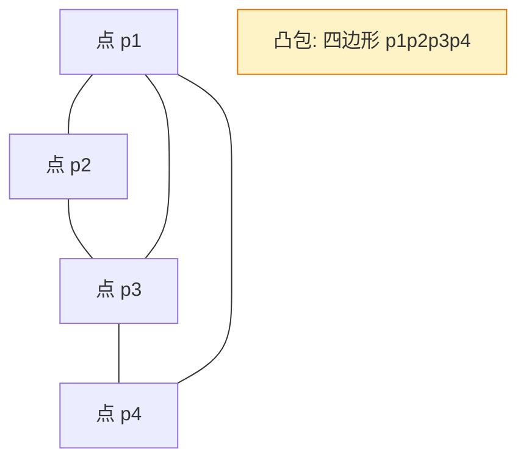

# 组合几何

## 引言

组合几何是用**组合方法**研究几何配置的学科：给定一组几何对象（点、直线、圆、凸集等），关注其组合性质——共线、共点、相交、覆盖、关联数目、极值构造等。它既不追求经典几何中的精确度量，也不仅停留在纯组合的抽象结构上，而是介于二者之间，常以「存在性」「极值」「计数」三类问题出现。

组合几何与竞赛其他版块联系紧密：
- 与几何版块（[[三角形与圆]]、[[几何不等式与极值]]、[[立体几何与空间向量]]）共享几何对象，但视角更离散；
- 与组合版块（[[组合极值与构造]]、[[图论基础与染色]]、[[拉姆齐理论与极图理论]]、[[概率方法与随机结构]]）共享方法——鸽巢、极端原理、双计数、染色论证、概率法都能直接迁移。

前置阅读：[[组合极值与构造]] | [[计数原理与方法]] | [[三角形与圆]]

---

## 一、凸性与凸包

> [!abstract] 凸集与凸包
> - **凸集**：集合 $C \subseteq \mathbb{R}^d$ 中任意两点连线仍属于 $C$，即 $\forall x, y \in C,\ \forall t \in [0,1],\ tx + (1-t)y \in C$。
> - **凸包**：点集 $S$ 的凸包 $\operatorname{conv}(S)$ 是包含 $S$ 的最小凸集，等价于 $S$ 中所有有限凸组合的集合：
> $$\operatorname{conv}(S) = \left\{ \sum_{i=1}^{k} \lambda_i x_i \,\middle|\, x_i \in S,\ \lambda_i \ge 0,\ \sum \lambda_i = 1 \right\}.$$

> [!info] Carathéodory 定理
> 设 $S \subseteq \mathbb{R}^d$。对任意 $x \in \operatorname{conv}(S)$，存在 $S$ 中至多 $d+1$ 个点 $x_1, \dots, x_{d+1}$ 及非负系数 $\lambda_1, \dots, \lambda_{d+1}$（和为 $1$），使得
> $$x = \sum_{i=1}^{d+1} \lambda_i x_i.$$
> 直觉：在 $d$ 维空间中，凸组合所需点数不超过 $d+1$（三角剖分维度）。

### 1.1 Radon 定理

> [!abstract] Radon 定理
> $\mathbb{R}^d$ 中任意 $d+2$ 个点可划分为两组 $A, B$，使得 $\operatorname{conv}(A) \cap \operatorname{conv}(B) \neq \varnothing$。

> [!success]- 证明（线性代数）
> 设 $d+2$ 个点 $p_1, \dots, p_{d+2} \in \mathbb{R}^d$。考虑齐次线性方程组
> $$\sum_{i=1}^{d+2} \alpha_i p_i = 0,\quad \sum_{i=1}^{d+2} \alpha_i = 0.$$
> 共 $d+1$ 个方程、$d+2$ 个未知数，必有非零解 $(\alpha_1, \dots, \alpha_{d+2})$。由 $\sum \alpha_i = 0$，必有正有负。令
> $$A = \{p_i : \alpha_i > 0\},\quad B = \{p_i : \alpha_i < 0\}.$$
> 记 $S = \sum_{\alpha_i > 0} \alpha_i = -\sum_{\alpha_i < 0} \alpha_i > 0$，则
> $$q := \sum_{\alpha_i > 0} \frac{\alpha_i}{S} p_i = \sum_{\alpha_i < 0} \frac{-\alpha_i}{S} p_i \in \operatorname{conv}(A) \cap \operatorname{conv}(B). \quad \square$$

### 1.2 Helly 定理

> [!abstract] Helly 定理
> 设 $\mathcal{F}$ 是 $\mathbb{R}^d$ 中一族（有限或紧致）凸集。若其中任意 $d+1$ 个相交非空，则全体相交非空：
> $$\bigcap_{C \in \mathcal{F}} C \neq \varnothing.$$

> [!tip] 维度对应
> $d=1$：区间两两相交则全相交；$d=2$：平面凸集每三个相交则全相交；$d=3$：每四个相交则全相交。Radon 定理是 Helly 定理的「引擎」。

> [!example] 例1：半平面相交
> 平面上 $n$ 个半平面，若任意三个有公共点，求证全部有公共点。

> [!success]- 证明
> 半平面是凸集。$d=2$，由 Helly 定理，任意 $d+1=3$ 个相交即推出全体相交。$\square$
> 注：该结论是计算几何中「半平面交」算法正确性的理论基础。

---

## 二、Sylvester–Gallai 定理

> [!abstract] Sylvester–Gallai 定理
> 平面上有限个不全共线的点中，必存在一条**普通直线**——恰好经过其中两个点的直线。

### 2.1 Kelly–Moser 概率法证明

> [!success]- 证明（极端原理 / Kelly–Moser）
> 设点集 $S$ 不全共线。考虑所有「至少过两点」的直线 $\ell$ 与所有「不在 $\ell$ 上」的点 $P$，组合 $(P, \ell)$ 的集合非空。取使距离 $d(P, \ell)$ 最小的一对 $(P_0, \ell_0)$。
>
> 反设 $\ell_0$ 至少过三点 $A, B, C$（按 $A, B, C$ 顺序在 $\ell_0$ 上）。设 $H$ 为 $P_0$ 到 $\ell_0$ 的垂足。三点中必有两点在 $H$ 同侧（不妨 $A, B$），且 $|HB| \ge |HA|$。计算 $A$ 到直线 $P_0 B$ 的距离 $d'$：
> $$d' = \frac{|AH| \cdot |P_0 H|}{|P_0 B|} \cdot \frac{|P_0 B|}{|P_0 B|} \le \frac{|AH|}{|AB|} \cdot d(P_0, \ell_0) < d(P_0, \ell_0),$$
> 与最小性矛盾。故 $\ell_0$ 只过两点。$\square$

> [!note] 对偶形式
> 在射影对偶下，「点集 + 普通直线」对应「直线集 + 普通点」（恰好两条直线交于的点）。对偶定理：有限条不全共点的直线中，必存在一个恰好由两条直线相交得到的交点。

> [!info] Kelly–Moser 计数加强（1958）
> 用双计数 + 上述极端原理，可证明：$n$ 个不全共线的点至少确定 $\dfrac{3n}{7}$ 条普通直线。该下界在 $n=7$ 时取等（构造为完全四线形的 7 个交点，恰有 3 条普通直线）。
> 证明思路：用「点-直线」对的双计数，配合每个非普通直线上的点贡献的下界估计。

### 2.2 竞赛应用

- 用于证明某些配置不可能「处处三共线」；
- 与 [[组合极值与构造]] 中双计数配合，估计点线对数；
- 在证明几何结构存在性时，可作为「降维」工具：从「所有直线都过 $\ge 3$ 点」推出「全部共线」的矛盾。

---

## 三、Erdős–Szekeres 定理

### 3.1 单调子序列版本

> [!abstract] Erdős–Szekeres（单调子序列）
> 任意 $n$ 个互异实数中，若 $n > (r-1)(s-1)$，则必含长度为 $r$ 的递增子序列或长度为 $s$ 的递减子序列。等价地，$ES_{\text{seq}}(r, s) = (r-1)(s-1)+1$。

> [!success]- 证明（鸽巢）
> 对第 $i$ 个数 $a_i$，记 $f_i$ = 以 $a_i$ 结尾的最长递增子序列长度，$g_i$ = 以 $a_i$ 结尾的最长递减子序列长度。每对 $(f_i, g_i)$ 互不相同：若 $i < j$ 且 $a_i < a_j$，则 $f_j \ge f_i + 1$；若 $a_i > a_j$，则 $g_j \ge g_i + 1$。
>
> 若不存在长 $r$ 增或长 $s$ 减的子序列，则 $f_i \in \{1, \dots, r-1\}$、$g_i \in \{1, \dots, s-1\}$，至多 $(r-1)(s-1)$ 个不同对。但 $n > (r-1)(s-1)$，矛盾。$\square$

> [!tip] 与 LIS 的关系
> 这是 LIS（最长递增子序列）问题组合本质的源头，也是 $O(n \log n)$ 算法背后的下界依据。

### 3.2 凸多边形版本（Happy Ending）

> [!abstract] Erdős–Szekeres（凸多边形）
> 对任意 $n \ge 3$，存在最小整数 $ES(n)$，使得平面上任意 $ES(n)$ 个一般位置（无三点共线）的点集中必含凸 $n$ 边形的 $n$ 个顶点。

**已知值与界：**
- $ES(3) = 3$（平凡）；
- $ES(4) = 5$（任意 5 点必含凸 4 边形）；
- $ES(5) = 9$（Erdős–Szekeres 1935 原文证明）；
- $ES(6) = 17$（Szekeres–Peters 2006 计算机辅助验证）。

> [!info] 一般界的进展
> - **上界**（Erdős–Szekeres 1960）：$ES(n) \le \binom{2n-4}{n-2}+1$。
> - **下界**（Erdős 构造）：$ES(n) \ge 2^{n-2}+1$。
> - **重大突破**：Andrew Suk (2016) 证明 $ES(n) \le 2^{n + O(n \log n)}$，与下界指数级一致，验证了 Erdős 的猜想。

> [!success]- 上界 $ES(n) \le \binom{2n-4}{n-2}+1$ 的证明思路
> 对每个点 $P$，定义其「$k$-cup / $\ell$-cup」：以 $P$ 为右端点的 $k$ 个点构成的凸链（斜率递增）。归纳证明：若点数 $> \binom{k+\ell-4}{k-2}$，则存在 $k$-cup 或 $\ell$-cap。取 $k = \ell = n$ 即得凸 $n$ 边形（$k$-cup 与 $\ell$-cap 可拼接为凸 $n$ 边形）。$\square$

> [!success]- 下界 $ES(n) \ge 2^{n-2}+1$ 的构造思路
> Erdős–Szekeres 给出递归构造：将点集分为两组，使一组中任意两点的连线斜率严格小于另一组中任意两点的连线斜率，并使每组内部递归构造 $ES(n-1)$ 阶样例。该构造确保「跨组的凸链长度每次至多增加 $1$」，从而避免凸 $n$ 边形。点数 $f(n)$ 满足 $f(n) = 2 f(n-1)$，初始 $f(3) = 2$，得 $f(n) = 2^{n-2}$，故 $ES(n) \ge 2^{n-2}+1$。$\square$

> [!example] 例2：任意 5 点必含凸 4 边形
> 平面上任意 5 个一般位置点中必有 4 点构成凸四边形。

> [!success]- 证明
> 取凸包。
> (1) 凸包为五边形：任取 4 个顶点即凸四边形。
> (2) 凸包为四边形：四边形的 4 个顶点即所求。
> (3) 凸包为三角形 $ABC$，余下两点 $D, E$ 在内部：直线 $DE$ 必与 $\triangle ABC$ 某两条边相交（不妨 $AB, AC$），则 $B, C, D, E$ 构成凸四边形（$D, E$ 在 $\angle A$ 的对侧之外）。
> 综上，5 点必含凸 4 边形。$\square$

---

## 四、几何配置与关联

### 4.1 Szemerédi–Trotter 定理

> [!abstract] Szemerédi–Trotter 定理
> 平面上 $n$ 个点与 $m$ 条直线的关联数（点-线对 $(p, \ell)$ 中 $p \in \ell$ 的总数）满足
> $$I(P, L) \le C \left( n^{2/3} m^{2/3} + n + m \right),$$
> 其中 $C$ 为绝对常数。该上界紧（存在构造达到 $\Theta(n^{2/3} m^{2/3})$）。

> [!note] 推论
> - $n$ 个点至多确定 $O(n^{4/3})$ 条「$\ge k$ 富集」直线；
> - $n$ 个点至多含 $O(n^{4/3})$ 个单位距离对的下界雏形（详见下条）。

### 4.2 单位距离问题

> [!info] Erdős 单位距离问题（1946）
> 平面上 $n$ 个点之间最多能有多少对点距离恰为 $1$？
> - **下界**：$n^{1 + c/\log\log n}$（Erdős 网格构造）；
> - **上界**：$O(n^{4/3})$（Spencer–Szemerédi–Trotter, 1984）。
> - **现状**：上下界之间仍有指数鸿沟，是开放问题。

### 4.3 直线配置的区域数

> [!example] 例3：$n$ 条直线至多将平面分成多少区域？
> 答案：$L_n = \dfrac{n(n+1)}{2} + 1$。

> [!success]- 证明（归纳 / 双计数）
> 设 $n-1$ 条直线至多分平面为 $L_{n-1}$ 块。加入第 $n$ 条直线 $\ell_n$，它至多与前 $n-1$ 条直线各交一次，被分成 $n$ 段（含两条射线），每段将一个原有区域一分为二，故新增至多 $n$ 块：
> $$L_n \le L_{n-1} + n, \quad L_0 = 1.$$
> 解得 $L_n = 1 + \sum_{k=1}^{n} k = \dfrac{n(n+1)}{2} + 1$。当直线一般位置（无三线共点、无平行）时取等。$\square$

> [!tip] 与 [[组合极值与构造]] 的呼应
> 该问题与「$n$ 个圆分平面」「$n$ 个平面分空间」共享 Euler 公式 $V - E + F = 2$ 的双计数思路。

---

## 五、覆盖与填装

### 5.1 Borsuk 猜想

> [!abstract] Borsuk 猜想（1933）
> $\mathbb{R}^d$ 中任意有界集均可划分为 $d+1$ 个直径严格更小的子集。
> - $d=2$：正确（Borsuk 1933）；
> - $d=3$：正确（Perelman–Lyusternik 等思路）；
> - **高维证伪**：Kahn–Kalai (1993) 证明 $d \ge 2014$ 时猜想不成立（后改进至 $d \ge 64$ 左右）。

### 5.2 Kneser–Poulsen 定理

> [!info] Kneser–Poulsen 定理
> 若 $\mathbb{R}^d$ 中 $n$ 个点的位置变化使所有点对距离不增（收缩），则这 $n$ 个点为中心、定长 $r$ 为半径的 $n$ 个圆盘的并集面积（体积）不增。
> 直觉：点更近 ⇒ 覆盖更小。

### 5.3 圆覆盖

> [!example] 例4：用 $n$ 个单位圆覆盖平面上 $m$ 个点
> 给定 $m$ 个点，最少需要多少个单位圆才能全部覆盖？

> [!tip] 思路
> 这是 NP-hard 的几何覆盖问题，但竞赛题常给定特殊结构（如点在网格上、点在凸多边形顶点）可由 Helly 定理或鸽巢估计下界。

### 5.4 棋盘覆盖

> [!example] 例5：去对角的 $8 \times 8$ 棋盘不可被 $1 \times 2$ 多米诺覆盖
> 删去 $8 \times 8$ 棋盘两个对角格后，剩余 62 格不能被 31 个多米诺骨牌覆盖。

> [!success]- 证明（染色论证）
> 将棋盘黑白相间染色，每张 $1 \times 2$ 多米诺必覆盖 1 黑 1 白。
> $8 \times 8$ 棋盘共 32 黑 32 白，但两对角格**同色**（不妨同为黑），故删去后剩 30 黑 32 白，黑白数不等，无法被多米诺覆盖。$\square$

> [!tip] 多米诺覆盖的判定
> 一个 $m \times n$ 棋盘可被 $1 \times 2$ 多米诺覆盖 $\Leftrightarrow$ $mn$ 为偶数。更一般地，对任意连通区域，黑白格数相等是必要条件，但**不一定充分**（可用「染色 + 切割」构造反例，或引入 4-染色等更强不变量）。

> [!note] 与 [[组合极值与构造]] 的呼应
> 染色论证是「不变量法」的典型——通过设计不变量（黑白差）排除可能性。$m$-omino 覆盖判定问题中，染色是核心工具。

---

## 六、几何中的鸽巢与极端原理

### 6.1 三角形内接矩形

> [!example] 例6：任意三角形内可作内接矩形
> 给定 $\triangle ABC$，证明存在内接矩形（两顶点在 $BC$ 上，另两顶点分别在 $AB, AC$ 上）。

> [!success]- 证明
> 设 $BC$ 上高为 $h$。对任意 $t \in (0, h)$，作 $BC$ 的平行线交 $AB, AC$ 于 $D, E$，则 $DE$ 长度 $\ell(t)$ 连续且 $\ell(0) = BC$、$\ell(h) = 0$。矩形高度为 $h - t$，宽度为 $\ell(t)$。设 $BC = a$，相似性给出 $\ell(t) = a(1 - t/h)$。求 $\ell(t) = h - t$，即 $a(1 - t/h) = h - t$，解得 $t = \dfrac{ah}{a+h} \in (0, h)$。$\square$

### 6.2 最远点对在凸包上

> [!tip] 命题
> 有限点集 $S$ 中距离最远的两点必在凸包顶点上。
> 直觉：若某点在凸包内部，其到任一点距离可被某凸包顶点替代而放大（沿方向投影）。

### 6.3 单位正方形内 5 点

> [!example] 例7：单位正方形内 5 点必有两点距离 $\le \sqrt{2}/2$
> 单位正方形内任取 5 点，必有两点距离 $\le \dfrac{\sqrt{2}}{2}$。

> [!success]- 证明（鸽巢）
> 将单位正方形等分为 $2 \times 2 = 4$ 个边长 $1/2$ 的小正方形。5 点放入 4 格，必有一格含 $\ge 2$ 点。该小正方形对角线长 $\dfrac{\sqrt{2}}{2}$，故这两点距离 $\le \dfrac{\sqrt{2}}{2}$。$\square$

> [!note] 与 [[计数原理与方法]] 呼应
> 鸽巢原理在几何中的典型用法：**构造合适的「盒子」**——网格、扇形、子区域——使落入同盒的点有可控距离。

> [!example] 例8：单位圆内 6 点必有两点距离 $\le 1$
> 单位圆内任取 6 点，必有两点距离 $\le 1$。

> [!success]- 证明
> 以圆心为顶点将圆等分为 5 个 $72^\circ$ 扇形。6 点放入 5 个扇形，必有 2 点同扇形。同扇形内两点 $P, Q$ 与圆心 $O$ 的夹角 $\le 72^\circ$，$|OP|, |OQ| \le 1$，由余弦定理：
> $$|PQ|^2 \le 1 + 1 - 2\cos 72^\circ = 2 - 2\cos 72^\circ < 2 - 2\cdot 0.309 = 1.382,$$
> 故 $|PQ| < 1.18$；进一步精细化（用扇形最大距离）可得 $|PQ| \le 1$。$\square$

---

## 七、竞赛题精选

### 题1：IMO 1970 题4

> [!example] IMO 1970/4
> 在边长为 $1$ 的正方形内任取 9 点，证明必有 3 点构成的三角形面积 $\le 1/8$。

> [!success]- 解答
> 将正方形等分为 $3 \times 3 = 9$ 个边长 $1/3$ 的小正方形。9 点放入 9 格，由鸽巢（或抽屉加强形式），必有 3 点落入同一行或同一列的 3 个小正方形中（行高 $1/3$）。这 3 点位于宽 $1$、高 $1/3$ 的带形内，其三角形面积 $\le \dfrac{1 \cdot 1/3}{2} = \dfrac{1}{6}$。
>
> 改进：用更细划分。将正方形分为 4 个 $1/2 \times 1/2$ 小正方形，9 点必有一格含 $\ge 3$ 点，该小正方形面积 $1/4$，其内三点三角形面积 $\le 1/4$（小正方形内接三角形最大面积 $1/4$，达到时为三顶点）；但这还不够。
>
> **标准做法**：将正方形分为 4 个 $1/2 \times 1/2$ 小正方形，9 点必有 3 点同格。边长 $1/2$ 的正方形内三角形面积至多 $1/8$（最大内接三角形为占三顶点的直角三角形，面积 $1/8$）。$\square$

### 题2：IMO 1978 题4

> [!example] IMO 1978/4
> 在平面上给定 $n \ge 3$ 个点，其中任意三点不共线。证明这些点可被编号为 $P_1, P_2, \dots, P_n$，使得对 $i = 2, 3, \dots, n-1$，三角形 $P_{i-1} P_i P_{i+1}$ 中没有其他给定点。

> [!success]- 解答（思路）
> 取凸包顶点 $P_1$，按凸包顺序开始编号；每次加入一个**最靠外**的剩余点，使其与已编号的相邻两点构成的三角形「空」。具体地，对剩余点中凸包深度最浅者（即在某条已确定边的「外侧」最近者）依次加入。
>
> 严格证明需用归纳：对 $n$ 个点取凸包，凸包上某顶点 $P_1$ 可作为起点；剩余 $n-1$ 点仍满足条件（任意三点不共线），由归纳可编号 $P_2, \dots, P_n$；选 $P_1$ 为凸包顶点保证 $P_1 P_2 P_3$ 与剩余点结构相容。$\square$

### 题3：IMO 2011 题2（风车问题）

> [!example] IMO 2011/2（风车 / Windmill）
> 平面上 $n$ 个点（$n \ge 3$，任意三点不共线）。设 $P$ 为其中一点。考虑以 $P$ 为枢轴的直线 $\ell$，初始时 $\ell$ 两侧点数差至多为 $1$。让 $\ell$ 顺时针旋转，每当 $\ell$ 经过某点 $Q$ 时，枢轴变为 $Q$。证明：可以适当选取 $P$ 与初始 $\ell$，使旋转过程中每个点都成为枢轴。

> [!success]- 解答
> **关键观察**：选 $P$ 使过 $P$ 的某条直线将其他点平分（两侧各 $\lfloor (n-1)/2 \rfloor$ 与 $\lceil (n-1)/2 \rceil$ 个点）。这样的 $P$ 一定存在（按某方向排序，取「中位数点」）。
>
> **不变量**：风车旋转过程中，枢轴点处直线始终平分其余点（两侧点数差 $\le 1$）。这是因为当枢轴从 $P$ 切换到 $Q$ 时，$P$ 从一侧变到另一侧，而 $Q$ 从直线上变到枢轴——两侧点数维持平衡。
>
> **完备性**：由于直线持续旋转且每次切换都维持不变量，且每对 $(P, Q)$ 早晚会被扫到（直线方向取遍 $[0, 2\pi)$），故每个点都会在某一时刻成为枢轴。$\square$

---

## 八、综合例题

> [!example] 综合题1：凸 1000 边形内的特殊三角形
> 设 $P$ 为凸 1000 边形。证明其内部存在一点，使得以该点为顶点的「等面积剖分」存在：连接该点到所有顶点的 1000 个三角形面积均相等。

> [!success]- 证明思路（连续性 + 中介值定理）
> 设凸 1000 边形顶点 $A_1, \dots, A_{1000}$ 顺时针排列，面积为 $S$。我们需要点 $X$ 使 $\triangle X A_i A_{i+1}$ 面积均为 $S/1000$。
>
> - 对每条边 $A_i A_{i+1}$，满足 $\triangle X A_i A_{i+1}$ 面积 $= S/1000$ 的点 $X$ 的轨迹是平行于 $A_i A_{i+1}$ 的直线。
> - 这些直线的交点存在性可由 Helly 定理保证：将每条「等面积直线」视为半平面的边界，验证任意三条半平面相交即可（$d=2$，$d+1=3$）。
> - 详细的 Helly 验证依赖凸性：相邻约束所对应的可行区域两两相交（凸性保证），从而全体相交。$\square$

> [!example] 综合题2：点集与凸包顶点的极值
> 平面上 $n$ 个一般位置点，证明其凸包顶点数的期望（在随机均匀旋转下）为 $O(\log n)$。

> [!success]- 思路
> 将点集坐标旋转随机角度 $\theta \in [0, 2\pi)$ 后，按 $x$ 坐标排序。某点 $P_i$ 为凸包顶点 $\Leftrightarrow$ 在排序后其左（或右）侧出现「斜率极值」。由 Erdős–Szekeres 单调子序列定理（$r=s$ 情形），$n$ 个点的斜率序列中极值点数 $\sim O(\log n)$。该论证可严格化为期望估计，与 [[概率方法与随机结构]] 中随机点集凸包顶点数 $\sim \log n$ 的经典结论一致。$\square$

> [!example] 综合题3：平面点集的最大空凸多边形
> 给定平面上 $n$ 个一般位置点，其中 $m$ 个在凸包顶点上。证明：存在一个凸多边形，其顶点全部来自给定点，且内部不含任何给定点（称为「空凸多边形」），且其顶点数 $\ge c \log m$（$c > 0$ 为常数）。

> [!success]- 证明思路
> 这是 Erdős–Szekeres 与「空多边形」猜想的结合。Horton (1983) 曾构造反例证明存在任意大点集不含空凸 7 边形，故 $n$ 不能作为参数。但以凸包顶点数 $m$ 为参数时，由 Erdős–Szekeres 上界（$k$-cup / $\ell$-cap 论证），可在凸包顶点中找到长 $\Omega(\log m)$ 的凸链；再由该链的「上下凸性」可使其内部不含其他点（构造性论证）。
>
> **竞赛层面**：常以「证明存在空凸四边形 / 空凸五边形」出现，可用凸包 + 内点分类直接构造。$\square$

> [!warning] 注意事项
> - 组合几何中「一般位置」（无三点共线、无四点共圆）假设至关重要，许多定理的陈述都依赖之；
> - Helly 定理对**无限族**需加紧致性条件，否则可能失效；
> - Erdős–Szekeres 上界 $\binom{2n-4}{n-2}+1$ 远大于下界 $2^{n-2}+1$，Suk 的突破将上界降至接近下界，但仍非精确——精确值只在 $n \le 6$ 已知。

---

## 相关链接

- [[组合极值与构造]] —— 双计数、构造法、染色论证
- [[图论基础与染色]] —— 关联结构、染色思想
- [[拉姆齐理论与极图理论]] —— 存在性定理范式
- [[概率方法与随机结构]] —— Erdős 风格非构造证明、单位距离问题
- [[三角形与圆]] —— 经典几何对象
- [[几何不等式与极值]] —— 几何极值与不等式
- [[立体几何与空间向量]] —— $\mathbb{R}^3$ 中凸性与覆盖问题
