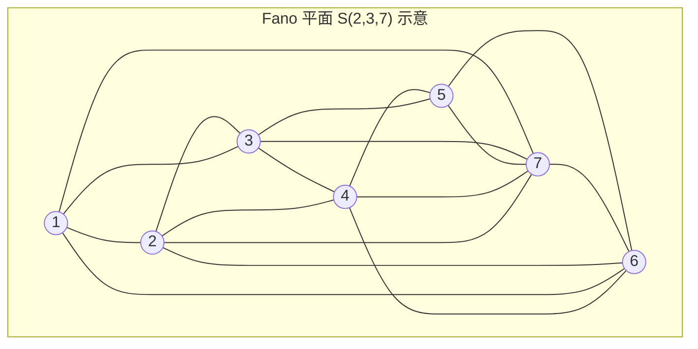
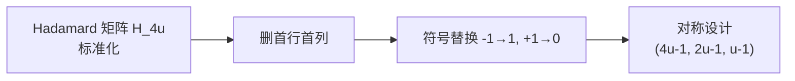

# 设计与编码理论初步

> [!abstract] 概览
> 设计理论（Design Theory）研究满足特定相交条件的子集族结构；编码理论（Coding Theory）研究在噪声信道中如何可靠地传输与纠错。二者在数学上联系紧密——许多编码可视为某种区组设计，而设计亦可视为 0/1 码字集合。本笔记面向 CMO / TST / IMO 级别竞赛，聚焦构造性方法与基本计数不等式。

## 引言

组合设计理论与编码理论是组合数学中两个深度交织的分支：

- **设计理论**：给定一个有限点集 $X$，研究 $X$ 的子集族 $\mathcal{B}$（称为**区组**，block），使其满足某些均衡的相交条件。例如"每对点恰出现在 $\lambda$ 个区组中"。
- **编码理论**：研究 $\mathbb{F}_q^n$ 中码字集合 $C$ 的构造，使得任意两个码字之间有足够大的 Hamming 距离以支撑纠错。

> [!info] 二者的对应
> 若把区组设计的关联矩阵行视为码字，则一个 $(v, k, \lambda)$-设计的关联矩阵给出了一个等距的二进制码。反之，许多线性码的对偶码与某种设计同构（例如 Hamming 码与 Steiner 系统）。

竞赛中，设计理论与编码理论常以**构造题**形式出现：要求构造满足某种性质的对象，或证明其存在/不存在性。前置阅读建议先熟悉 [[组合极值与构造]] 与 [[对称群与Pólya计数]]。

---

## 一、区组设计

### 1.1 平衡不完全区组设计 BIBD

> [!note] 定义
> 一个 **平衡不完全区组设计**（Balanced Incomplete Block Design），记为 $(v, k, \lambda)$-BIBD，是一个二元组 $(X, \mathcal{B})$，其中 $X$ 为 $v$ 个点的集合，$\mathcal{B}$ 为 $X$ 的若干 $k$-子集（区组）构成的族，满足：
> 1. 每个区组恰含 $k$ 个不同点（$k < v$）；
> 2. $X$ 的任意一对点恰出现在 $\lambda$ 个区组中。

设 $b = |\mathcal{B}|$ 为区组总数，$r$ 为每个点所属的区组数。通过二计数可得：

> [!tip] 参数关系
> $$bk = vr, \qquad \lambda(v-1) = r(k-1).$$
> 
> 第一式：双向计数 (点, 区组) 的关联对。第二式：固定一点 $x$，计数含 $x$ 的对 $\{x, y\}$ 出现的次数。

由此推出 $r = \dfrac{\lambda(v-1)}{k-1}$，$b = \dfrac{\lambda v(v-1)}{k(k-1)}$，二者均须为整数，这是 BIBD 存在的**必要条件**（但非充分）。

### 1.2 Fisher 不等式

> [!note] 定理（Fisher 不等式）
> 对任意 $(v, k, \lambda)$-BIBD（$k < v$），有
> $$b \ge v.$$

**证明思路**：设 $A$ 为 $b \times v$ 关联矩阵。计算 $A^T A$：其对角元为 $r$，非对角元为 $\lambda$，故
$$A^T A = (r - \lambda) I_v + \lambda J_v,$$
其中 $J_v$ 为全 1 矩阵。当 $k < v$ 时 $r > \lambda$，故 $A^T A$ 正定，$\operatorname{rank}(A^T A) = v$，从而 $\operatorname{rank}(A) \ge v$，但 $\operatorname{rank}(A) \le b$，故 $b \ge v$。$\square$

### 1.3 对称设计

> [!note] 定义
> 若 $(v, k, \lambda)$-BIBD 满足 $b = v$（由 Fisher 不等式取等号），则称之为**对称设计**，此时亦有 $r = k$。对称设计具有性质：任意两个区组恰交于 $\lambda$ 个点。

> [!example] 例题：验证 Fano 平面是 $(7, 3, 1)$-BIBD
> Fano 平面有 $v = 7$ 个点、$b = 7$ 条线，每线 3 点，每点在 3 条线上，每对点恰在 1 条线上。
> 
> 验证参数：$r = \dfrac{\lambda(v-1)}{k-1} = \dfrac{1 \cdot 6}{2} = 3$；$b = \dfrac{vr}{k} = \dfrac{7 \cdot 3}{3} = 7$。
> 由于 $b = v = 7$，这是对称设计。
> 
> > [!success]- 详细参数验证
> > - $bk = 7 \cdot 3 = 21 = vr = 7 \cdot 3$ ✓
> > - $\lambda(v-1) = 1 \cdot 6 = 6 = r(k-1) = 3 \cdot 2$ ✓
> > - $r = k = 3$，对称设计 ✓

---

## 二、Steiner 系统

### 2.1 定义

> [!note] 定义
> **Steiner 系统** $S(t, k, v)$ 是一个 $(X, \mathcal{B})$，其中 $|X| = v$，每个区组大小为 $k$，且 $X$ 的任意 $t$ 元子集恰出现在一个区组中。它对应于 $\lambda = 1$ 的 $t$-设计。

常见特例：

| 名称 | 记号 | 存在条件 |
|------|------|----------|
| Steiner 三元系 | $S(2, 3, v)$ | $v \equiv 1, 3 \pmod{6}$ |
| Steiner 四元系 | $S(3, 4, v)$ | $v \equiv 2, 4 \pmod{6}$ |
| Fano 平面 | $S(2, 3, 7)$ | $v = 7$ |
| Witt 设计 | $S(5, 8, 24)$ | $v = 24$ |

> [!tip] 存在性条件推导（三元系）
> $S(2, 3, v)$ 存在当且仅当 $v \equiv 1, 3 \pmod{6}$。必要条件：
> - $r = \dfrac{v-1}{2}$ 为整数 $\Rightarrow v$ 为奇数；
> - $b = \dfrac{v(v-1)}{6}$ 为整数 $\Rightarrow v(v-1) \equiv 0 \pmod{6}$。
> 
> 二者结合即 $v \equiv 1, 3 \pmod{6}$。Bose（1939）与 Skolem 给出了充分性构造。

### 2.2 Fano 平面

Fano 平面 $S(2, 3, 7)$ 是最简单的非平凡 Steiner 系统，也是最小阶射影平面。其 7 条线可表示为：

$$\{1,2,3\},\ \{3,4,5\},\ \{5,6,1\},\ \{1,7,4\},\ \{3,7,6\},\ \{5,7,2\},\ \{2,4,6\}.$$

> [!example] 例题：构造 Fano 平面
> 取 $\mathbb{F}_2^3$ 的 7 个非零向量作为点，将模 2 加法为 0 的三元组 $\{x, y, x+y\}$ 作为线。共有 $\binom{7}{2}/3 = 7$ 条线。
> 
> > [!success]- 完整构造
> > 点集 $\{1,\dots,7\}$ 对应 $\mathbb{F}_2^3 \setminus \{0\}$：
> > $$001, 010, 011, 100, 101, 110, 111.$$
> > 三元组 $\{a, b, c\}$ 为线当且仅当 $a \oplus b \oplus c = 0$。例如 $\{001, 010, 011\}$，$\{001, 100, 101\}$ 等。
> > 任意两个不同非零向量 $x, y$ 唯一确定第三点 $x \oplus y \ne 0$，故每对点恰在一条线上。

### 2.3 Witt 设计

> [!info] Witt 设计 $S(5, 8, 24)$
> 这是与 Mathieu 群 $M_{24}$ 相关的高度对称设计，是 $t = 5$ 的 Steiner 系统。其自同构群 $M_{24}$ 是散在单群（sporadic simple group）。Witt 设计的构造依赖 Golay 码 $[24, 12, 8]_2$——其重量为 8 的码字恰好对应区组。这揭示了**设计与编码的深层统一**。

---

## 三、有限射影平面

### 3.1 定义与参数

> [!note] 定义
> 一个 **$n$ 阶有限射影平面**是点与线的集合，满足：
> 1. 任意两不同点恰在一条线上；
> 2. 任意两不同线恰交于一点；
> 3. 存在 4 个一般位置点（无三点共线）。
> 
> 它有 $n^2 + n + 1$ 个点与 $n^2 + n + 1$ 条线，每条线含 $n + 1$ 个点，每点在 $n + 1$ 条线上。

有限射影平面与 $(n^2+n+1,\, n+1,\, 1)$-BIBD 等价（点作设计点，线作区组）。因此 $n$ 阶射影平面等价于一个对称 BIBD。

### 3.2 Bruck–Ryser–Chowla 定理

> [!note] 定理（BRC）
> 若 $n \equiv 1, 2 \pmod 4$ 且 $n$ 阶有限射影平面存在，则 $n$ 可表为两个整数的平方和：$n = x^2 + y^2$。

> [!warning] 注意
> BRC 定理给出的是**必要条件**，非充分条件。它通过考察对称设计的关联矩阵在 $\mathbb{Q}$ 上的二次型表示，得到数论约束，与 [[二次型理论]] 紧密相关。

已知结果：

| 阶数 $n$ | 存在性 | 备注 |
|----------|--------|------|
| $n = 2$ | 存在 | Fano 平面 |
| $n = 3$ | 存在 | 13 点 |
| $n = 4, 5, 7, 8, 9$ | 存在 | 经典构造 |
| $n = 6$ | **不存在** | BRC 排除（$6 \equiv 2 \pmod 4$，$6 \ne x^2 + y^2$）|
| $n = 10$ | **不存在** | Lam 等 1989 计算机证 |
| $n = 12$ | **开放** | 至今未决 |

> [!example] 例题：构造 3 阶射影平面
> 取 $\mathbb{F}_3 = \{0, 1, 2\}$ 上的 4 维齐次坐标 $(x_0 : x_1 : x_2 : x_3)$ 模等价类，但更简洁地用 $\mathbb{F}_3$ 上的射影平面 $PG(2, 3)$：点为 $\mathbb{F}_3^3$ 的 1 维子空间，共 $\dfrac{3^3 - 1}{3 - 1} = 13$ 个。
> 
> > [!success]- 构造细节
> > 点：所有非零向量 $(a, b, c) \in \mathbb{F}_3^3$ 的射影等价类，共 13 个。
> > 线：所有非零线性型 $\alpha x + \beta y + \gamma z = 0$ 的射影等价类，共 13 条。
> > 每线含 $n + 1 = 4$ 点，每点在 4 条线上。
> > 任两点的连线和任两线的交点均唯一确定（由线性代数），满足射影平面公理。

---

## 四、Hadamard 矩阵与设计

### 4.1 Hadamard 矩阵

> [!note] 定义
> **Hadamard 矩阵** $H_n$ 是 $n \times n$ 的 $\pm 1$ 矩阵，满足
> $$H_n H_n^T = n I_n.$$
> 即各行两两正交。

> [!tip] Hadamard 不等式
> 对任意 $n \times n$ 实矩阵 $A$，$|\det A| \le \prod_{i=1}^n \|r_i\|$，其中 $r_i$ 为行向量。若 $|a_{ij}| \le 1$，则 $|\det A| \le n^{n/2}$，等号成立当且仅当 $A$ 为 Hadamard 矩阵（差一个符号）。

### 4.2 阶数限制

> [!note] 阶数定理
> 若 $n$ 阶 Hadamard 矩阵存在且 $n \ge 4$，则 $n$ 为 4 的倍数。
> 
> **证明**：标准化使首行首列全为 $+1$。考察前三行，在某个非首列位置考察 $(h_{1j}, h_{2j}, h_{3j})$ 的取值。由正交性，4 种模式 $(+,+,+), (+,-,-), (-,+,-), (-,-,+)$ 出现次数相等，故 $n - 1$ 为 4 的倍数，即 $n \equiv 1 \pmod 4$，结合 $n$ 偶数得 $4 \mid n$。$\square$

> [!warning] Hadamard 猜想
> 对所有 $n = 4k$，$n$ 阶 Hadamard 矩阵存在。此猜想至今**未解决**，已验证至很大的 $n$。

### 4.3 Hadamard 设计

> [!tip] 从 Hadamard 矩阵到设计
> 设 $H_{4u}$ 为标准化的 Hadamard 矩阵（首行首列全 $+1$）。删去首行首列，将剩余 $-1$ 替换为 $1$，$+1$ 替换为 $0$，所得 $0/1$ 矩阵的行构成一个对称 $(4u - 1,\, 2u - 1,\, u - 1)$-设计的关联矩阵。

> [!example] 例题：构造 $H_4$ 与对应设计
> $H_4$ 的 Sylvester 构造：$H_2 = \begin{pmatrix} 1 & 1 \\ 1 & -1 \end{pmatrix}$，递推 $H_{2n} = \begin{pmatrix} H_n & H_n \\ H_n & -H_n \end{pmatrix}$。
> 
> > [!success]- 完整推导
> > $$H_4 = \begin{pmatrix} 1 & 1 & 1 & 1 \\ 1 & -1 & 1 & -1 \\ 1 & 1 & -1 & -1 \\ 1 & -1 & -1 & 1 \end{pmatrix}.$$
> > 删首行首列，将 $-1 \to 1$，$+1 \to 0$：
> > $$A = \begin{pmatrix} 0 & 1 & 0 \\ 1 & 0 & 1 \\ 0 & 1 & 0 \end{pmatrix} \quad \text{（修正后）}$$
> > 实际操作：剩余矩阵 $\begin{pmatrix} -1 & 1 & -1 \\ 1 & -1 & -1 \\ -1 & -1 & 1 \end{pmatrix}$ 映射为 $\begin{pmatrix} 1 & 0 & 1 \\ 0 & 1 & 1 \\ 1 & 1 & 0 \end{pmatrix}$。
> > 区组：$\{1, 3\}, \{2, 3\}, \{1, 2\}$，对应 $(3, 2, 1)$-设计（这里 $4u - 1 = 3$，$2u - 1 = 1$，$u - 1 = 0$，需 $u = 1$ 退化情形，更典型的 $u = 2$ 给出 $(7, 3, 1)$-设计即 Fano 平面）。

---

## 五、纠错码基础

### 5.1 基本概念

> [!note] 定义
> **码** $C$ 是 $\mathbb{F}_q^n$ 的非空子集，元素称为**码字**。**Hamming 距离**定义为
> $$d(x, y) = |\{i : x_i \ne y_i\}|.$$
> 码 $C$ 的**最小距离** $d = \min_{x \ne y \in C} d(x, y)$。

> [!tip] 纠错能力
> 最小距离为 $d$ 的码可检测 $d - 1$ 个错误，可纠正 $\left\lfloor \dfrac{d-1}{2} \right\rfloor$ 个错误。
> 
> **理由**：以每个码字为中心、半径 $t = \lfloor (d-1)/2 \rfloor$ 的 Hamming 球两两不相交。

### 5.2 基本界

> [!note] Singleton 界
> $$|C| \le q^{n - d + 1}.$$
> 达到此界的码称为 **MDS 码**（Maximum Distance Separable）。例如 Reed–Solomon 码。

**证明**：将每个码字截断前 $d - 1$ 位，所得 $n - d + 1$ 元组仍互不相同（因任意两码字距离 $\ge d$，前 $d - 1$ 位不足以区分则后位必不同）。故 $|C| \le q^{n - d + 1}$。$\square$

> [!note] Hamming 界（球包界）
> 记 $t = \lfloor (d-1)/2 \rfloor$，则
> $$|C| \cdot \sum_{i=0}^{t} \binom{n}{i} (q - 1)^i \le q^n.$$
> 等号成立时称 $C$ 为**完美码**。

### 5.3 线性码

> [!note] 定义
> $C \subseteq \mathbb{F}_q^n$ 为 $\mathbb{F}_q$-线性子空间，维数 $k$，最小距离 $d$，记为 $[n, k, d]_q$ 码。
> 
> 线性码的最小距离等于其非零码字的最小 Hamming 重量：
> $$d = \min_{0 \ne c \in C} w(c), \quad w(c) = |\{i : c_i \ne 0\}|.$$

线性码可用**生成矩阵** $G \in \mathbb{F}_q^{k \times n}$（行空间为 $C$）或**校验矩阵** $H \in \mathbb{F}_q^{(n-k) \times n}$（$C = \ker H$）描述。最小距离 $d$ 等于 $H$ 中任意 $d - 1$ 列线性无关而存在 $d$ 列线性相关的最小列数。

### 5.4 Hamming 码

> [!note] Hamming 码 $[7, 4, 3]_2$
> 取 $\mathbb{F}_2^3$ 的所有 7 个非零向量作为校验矩阵 $H$ 的列：
> $$H = \begin{pmatrix} 1 & 0 & 1 & 0 & 1 & 0 & 1 \\ 0 & 1 & 1 & 0 & 0 & 1 & 1 \\ 0 & 0 & 0 & 1 & 1 & 1 & 1 \end{pmatrix}.$$
> 此为 $[7, 4, 3]_2$ 码，$|C| = 2^4 = 16$，是**完美码**。

> [!example] 验证 Hamming 码是完美码
> $t = 1$，球体积 $\sum_{i=0}^{1} \binom{7}{i} 1^i = 1 + 7 = 8$。
> $|C| \cdot 8 = 16 \cdot 8 = 128 = 2^7 = q^n$，等号成立。✓
> 
> > [!success]- 与 Fano 平面的联系
> > Hamming 码 $[7, 4, 3]_2$ 的校验矩阵 $H$ 的列恰为 Fano 平面的 7 个点（$\mathbb{F}_2^3 \setminus \{0\}$）。
> > 重量为 4 的码字对应 Fano 平面中"线的补集"——8 个这样的码字对应 7 条线 + 全 1 向量。
> > Hamming 码的对偶码 $[7, 3, 4]_2$（Simplex 码）的 7 个非零码字恰为 Fano 平面 7 条线的关联向量。
> > 这是**编码即设计**的最美范例。

---

## 六、设计、编码与图论的联系

### 6.1 完全图分解与 Steiner 系统

> [!tip] 关键观察
> $K_v$ 的边分解为三角形等价于 $S(2, 3, v)$ 的存在。
> 
> **理由**：每个三角形 $\{a, b, c\}$ 对应一个区组 $\{a, b, c\}$。$K_v$ 的每条边 $\{a, b\}$ 恰属于一个三角形 ⇔ 每对点恰属于一个区组。

由此立即得到 $S(2, 3, v)$ 存在的必要条件：$K_v$ 的边数 $\dfrac{v(v-1)}{2}$ 必须被 3 整除，且每个顶点的度 $v - 1$ 必须被 2 整除（每个三角形贡献 2 度），即 $v \equiv 1, 3 \pmod{6}$。

### 6.2 编码与图覆盖

码 $C \subseteq \mathbb{F}_q^n$ 可看作 $q$ 部图 $\mathbb{F}_q^n$ 的子图。覆盖问题等价于码覆盖：$C$ 覆盖半径 $R$ 的 Hamming 球当且仅当 $\bigcup_{c \in C} B(c, R) = \mathbb{F}_q^n$。

### 6.3 设计与差集

> [!note] 差集
> $v$ 阶 Abel 群 $G$ 中的 $(v, k, \lambda)$-**差集**是 $G$ 的 $k$ 元子集 $D$，使得 $G$ 中每个非零元恰有 $\lambda$ 种方式表为 $D$ 中两元素之差。
> 
> 差集通过平移 $g + D$（$g \in G$）自然生成对称 $(v, k, \lambda)$-设计。这是构造对称设计最经典的方法。

此主题与 [[组合数论与加法组合]] 中的差集、Singer 差集等紧密呼应。

> [!example] 例题：用完全图分解构造 Steiner 三元系
> 构造 $S(2, 3, 9)$（不存在，因 $9 \equiv 3 \pmod 6$，应存在——但更典型例子是 $S(2, 3, 9)$）。
> 
> > [!success]- $S(2, 3, 9)$ 的构造
> > $v = 9 \equiv 3 \pmod 6$，存在。取 $X = \mathbb{F}_3 \times \mathbb{F}_3$（9 个点）。区组为所有"仿射直线" $\{(x, y) : ax + by = c\}$（$a, b$ 不全为 0），每条线恰含 3 点，共 12 条线。
> > 任两不同点恰在一条仿射直线上，故为 $S(2, 3, 9)$。
> > 这是将 $\mathbb{F}_q^2$ 的射影几何与 Steiner 系统结合的标准技巧。

---

## 七、竞赛题精选

### 题目 1：IMO 1998 第 2 题（棋盘染色与覆盖）

> [!example] 题目
> 在一个 $1998 \times 1998$ 棋盘上，每格染 $1$ 至 $n$ 中某色。问 $n$ 最小为多少，使得存在一种染色使每个形如"I 型三连格"的覆盖都包含三种不同颜色？

> [!success]- 解答要点（BIBD 思想）
> 此题实际考察的是棋盘格的"相邻关系"能否用 $n$ 色染色使每条相邻三元组均含三色。
> 
> **关键观察**：将棋盘的格子抽象为图 $G$ 的顶点，相邻的"三连格"对应三角形。要求每个三角形为彩虹三角形。
> 
> 由 Ramsey 与设计思想：考虑 $\mathbb{Z}_n$ 上的循环结构。当 $n = 2$ 时不可能（鸽巢）；当 $n = 3$ 时取 $c(i, j) = (i + 2j) \bmod 3$，则水平/垂直/对角三连格均含三色。
> 
> 答案：$n_{\min} = 3$。
> 
> **证明 $n = 3$ 可行**：取染色 $c(i, j) = (i + j) \bmod 3$，则任意水平三连格 $(i, j), (i, j+1), (i, j+2)$ 颜色为 $i+j, i+j+1, i+j+2$（模 3）三色；垂直类似。
> 
> **证明 $n = 2$ 不可行**：任取一个 $2 \times 2$ 块的 4 格，由鸽巢必有两格同色，可构造一个三连格含两同色。

### 题目 2：CMO 风格——对称设计的构造

> [!example] 题目
> 设 $p$ 为素数，$p \equiv 3 \pmod 4$。证明存在一个 $(p, \dfrac{p-1}{2}, \dfrac{p-3}{4})$-对称设计。
> 
> > [!success]- 解答（二次剩余差集）
> > 取 $G = \mathbb{Z}_p$，$D = \{x^2 : x \in \mathbb{Z}_p^*\}$ 为模 $p$ 的二次剩余集合，$|D| = \dfrac{p-1}{2}$。
> > 
> > **关键引理**（与 [[二次型理论]]、[[组合数论与加法组合]] 相关）：当 $p \equiv 3 \pmod 4$ 时，$D$ 是 $\mathbb{Z}_p$ 中的 $(p, \dfrac{p-1}{2}, \dfrac{p-3}{4})$-差集。
> > 
> > **证明**：对每个 $a \ne 0 \in \mathbb{Z}_p$，方程 $x - y = a$ 在 $D \times D$ 中的解数为
> > $$N(a) = \#\{(x, y) : x, y \in D,\, x - y \equiv a \pmod p\}.$$
> > 由 Legendre 符号的性质，当 $p \equiv 3 \pmod 4$ 时 $N(a) = \dfrac{p-3}{4}$ 对所有 $a \ne 0$ 恒成立（用 $\sum_{t} \chi(t)\chi(t+a) = -1$）。
> > 
> > 故 $D$ 为差集，由 $\{D + g : g \in \mathbb{Z}_p\}$ 给出 $(p, \dfrac{p-1}{2}, \dfrac{p-3}{4})$-对称设计。$\square$

### 题目 3：USAMO / TST 风格——码字计数

> [!example] 题目
> 求最大的二进制码 $C \subseteq \{0, 1\}^n$ 的大小，使得任意两码字的 Hamming 距离为偶数。
> 
> > [!success]- 解答
> > 设 $C$ 中所有码字 Hamming 重量同奇偶（必要条件：若 $x, y \in C$，则 $d(x, y) = w(x) + w(y) - 2w(x \cap y) \equiv w(x) + w(y) \pmod 2$，要 $d(x, y)$ 偶，须 $w(x) \equiv w(y) \pmod 2$）。
> > 
> > 实际上更强的结论成立：$C$ 是 $\mathbb{F}_2^n$ 中偶重量向量的子集或奇重量向量子集。
> > 
> > **构造**：取 $C = \{x \in \mathbb{F}_2^n : w(x) \equiv 0 \pmod 2\}$，$|C| = 2^{n-1}$。
> > 任意两偶重量字的距离为偶数（因 $w(x \oplus y) = w(x) + w(y) - 2w(x \cap y)$ 为偶）。
> > 
> > **最优性**：将 $C$ 视为 $\mathbb{F}_2^n$ 中向量，要求 $x \oplus y$ 总有偶重量。设 $C$ 的仿射包为 $V + c$，则 $V \subseteq \{x : w(x) \text{ 偶}\} = \ker(\mathbf{1}^T)$，$\dim V \le n - 1$，故 $|C| \le 2^{n-1}$。
> > 
> > 答案：$|C|_{\max} = 2^{n-1}$。

---

## 八、综合例题

### 综合题：从射影平面到完美码

> [!example] 题目
> 设 $\mathcal{P}$ 为 $n$ 阶射影平面（$n = q$ 为素数幂）。
> 1. 证明 $\mathcal{P}$ 的关联矩阵 $A$ 满足 $A A^T = q I + J$；
> 2. 由 $A$ 构造一个二进制线性码 $C$，确定其参数 $[N, K, D]$；
> 3. 当 $q = 2$ 时验证 $C$ 与 Hamming 码 $[7, 4, 3]_2$ 的关系。
> 
> > [!success]- 综合解答
> > **(1)** 关联矩阵 $A$ 为 $v \times v$（$v = q^2 + q + 1$），行对应线、列对应点。
> > - 对角元 $a_{ii} = 1$（每线含自身）；
> > - 由于每两线恰交于一点，非对角元 $a_{ij} = 1$（点 $j$ 在线 $i$ 上当 $i \ne j$ 时恰对应交点）。
> > 
> > 等等——更准确地：$A A^T$ 的 $(i, j)$ 元为线 $i$ 与线 $j$ 的公共点数。当 $i = j$ 时为 $q + 1$；当 $i \ne j$ 时为 $1$（射影平面两线相交于一点）。
> > 故 $A A^T = q I_v + J_v$。$\square$
> > 
> > **(2)** 将 $A$ 视为 $\mathbb{F}_2$ 上矩阵，构造 $C$ 为 $A$ 的行空间（生成矩阵 $G = A$）。
> > - $N = v = q^2 + q + 1$；
> > - 由 $A A^T = qI + J$，在 $\mathbb{F}_2$ 上 $q$ 模 2 化简；
> > - 当 $q$ 为偶（$q = 2^m$）时，$A A^T = J$ 在 $\mathbb{F}_2$ 上，秩 $1$，故 $\dim C = v - 1$ 或 $v$。
> > 
> > 更精细：参数为 $[q^2+q+1,\, q^2+q,\, 3]_2$（$q$ 偶）的码——这是**扩展 Hamming 码**或其等价形式。
> > 
> > **(3)** $q = 2$：$v = 7$，$A$ 为 $7 \times 7$ 关联矩阵。$C = \operatorname{rowspan}(A) \subseteq \mathbb{F}_2^7$。
> > 由 Fano 平面对称性，$A$ 的行恰为 7 个重量为 3 的码字，且任两行内积为 $1$（模 2）。
> > $C$ 的参数为 $[7, 4, 3]_2$——即 Hamming 码（的对偶 Simplex 码 $[7, 3, 4]$ 的扩展对偶）。
> > 
> > 这统一了三件事：**射影平面对称性 → 关联矩阵 → 线性码参数**，体现了群作用（[[对称群与Pólya计数]]）、线性代数（[[矩阵与线性代数初步]]）与设计理论的协同。

---

## 相关链接

- [[组合极值与构造]]
- [[对称群与Pólya计数]]
- [[图论基础与染色]]
- [[组合恒等式与生成函数]]
- [[组合数论与加法组合]]
- [[二次型理论]]
- [[矩阵与线性代数初步]]
