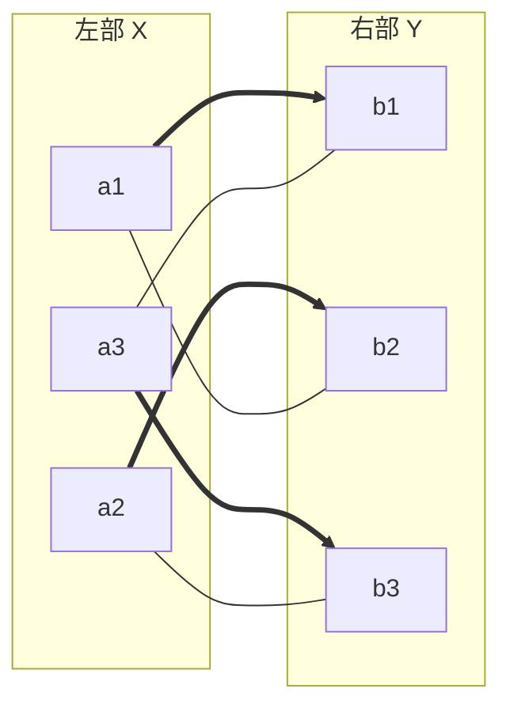
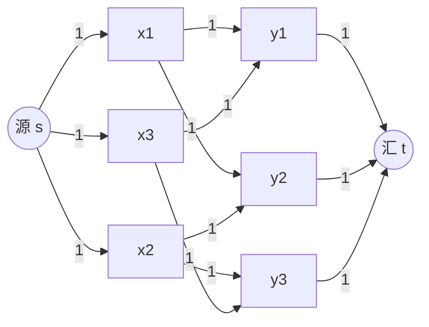

# 高级图论与网络流

## 引言

进阶图论是 CMO、TST 乃至 IMO 中区分顶尖选手的核心模块。与基础图论相比，本章聚焦于**结构定理**（Hall、Kőnig、Tutte、Menger、Kuratowski）与**优化建模**（最大流最小割）。许多看似与图无关的竞赛题，一旦建立图模型便可一击即中；而网络流则将「匹配」「覆盖」「分割」三大主题统一为同一框架。

本章建议在掌握 [[图论基础与染色]] 的基本概念（度、路径、二部图、树、染色）后阅读，并与 [[组合极值与构造]] 中的极值思想相互印证。

---

## 一、匹配理论

> [!abstract] 匹配的基本概念
> 设 $G = (V, E)$。一个**匹配 (Matching)** $M \subseteq E$ 是一组两两不共享端点的边。
> - **完美匹配 (Perfect Matching)**：$G$ 的每个顶点都被 $M$ 覆盖（即 $|M| = |V|/2$）。
> - **最大匹配 (Maximum Matching)**：边数最多的匹配，记 $\nu(G)$。
> - **极大匹配 (Maximal Matching)**：不能再添加边的匹配（局部极大，未必最大）。
> - **交替路 / 增广路**：交替经过「非匹配边—匹配边」的路；两端均为未匹配点的交替路称为**增广路**。

> [!tip] 图示说明
> 粗边 `==>` 为匹配边，细边 `---` 为非匹配边。图中三条粗边构成一个完美匹配。

### 1.1 Hall 婚姻定理

> [!abstract] Hall 婚姻定理 (1935)
> 设 $G = (X, Y, E)$ 为二部图。$G$ 中存在覆盖 $X$ 中所有顶点的匹配，**当且仅当**对任意 $S \subseteq X$，有
> $$|N(S)| \geq |S|,$$
> 其中 $N(S)$ 为 $S$ 中所有顶点的邻居之并。此条件称为 **Hall 条件**。

> [!note] 证明思路（极小反例法）
> **必要性**：若匹配覆盖 $X$，则 $S$ 中每个顶点需匹配到 $N(S)$ 中互不相同的顶点，故 $|N(S)| \geq |S|$。
> **充分性**：取满足 Hall 条件但无完美匹配的「极小」图 $G$（顶点数最少）。
> 1. **情形一**：对任意非空真子集 $\varnothing \neq S \subsetneq X$，$|N(S)| > |S|$（严格 Hall）。任取一边 $xy$，删去 $x, y$ 后剩余图仍满足严格 Hall（因每个 $S$ 的邻居至多减少 $1$），由极小性存在匹配，加上 $xy$ 即得。
> 2. **情形二**：存在 $\varnothing \neq S \subsetneq X$ 使 $|N(S)| = |S|$（紧 Hall）。由极小性，$S$ 与 $N(S)$ 之间存在匹配。对剩余部分 $X' = X \setminus S$、$Y' = Y \setminus N(S)$，验证 Hall 条件：若某 $T \subseteq X'$ 有 $|N_{Y'}(T)| < |T|$，则 $N_Y(S \cup T) = N(S) \cup N_{Y'}(T)$，$|N_Y(S \cup T)| \leq |S| + |N_{Y'}(T)| < |S| + |T| = |S \cup T|$，与 $G$ 满足 Hall 矛盾。故 $X'$ 与 $Y'$ 也可匹配，拼接即得。$\square$

### 1.2 Kőnig 定理

> [!abstract] Kőnig 定理（匹配与点覆盖）
> 在二部图 $G$ 中，**最大匹配的边数 = 最小点覆盖的顶点数**：
> $$\nu(G) = \tau(G).$$

> [!note] 证明要点
> $\nu \leq \tau$ 显然（点覆盖须覆盖匹配中每条边，故至少 $\nu$ 个点）。反向构造：取最大匹配 $M$，从所有未匹配点出发沿交替路标记可达点集 $Z$（在 $X$ 中走非匹配边，在 $Y$ 中走匹配边）。令
> $$T = (X \setminus Z) \cup (Y \cap Z),$$
> 可验证 $T$ 是点覆盖且 $|T| = |M|$，故 $\tau \leq \nu$。$\square$

### 1.3 Menger 定理

> [!abstract] Menger 定理（点版本）
> 设 $u, v$ 为 $G$ 中不相邻顶点。$u$ 与 $v$ 之间**顶点不交**路径的最大条数，等于**分离 $u, v$**（删去后 $u, v$ 不连通）所需的最少顶点数。

> [!abstract] Menger 定理（边版本）
> 设 $u \neq v$。$u$ 与 $v$ 之间**边不交**路径的最大条数，等于分离 $u, v$ 所需的最少边数。

> [!tip] 与网络流的联系
> Menger 定理可由最大流最小割定理推出：将每条边容量设为 $1$（边版本）或将每个内部顶点拆为「入点—出点」容量 $1$ 的结构（点版本），则最大流 = 不交路径数，最小割 = 分离集大小。

### 1.4 Tutte 1-因子定理

> [!abstract] Tutte 定理 (1947)
> 图 $G$ 存在完美匹配，**当且仅当**对任意 $S \subseteq V$，有
> $$o(G - S) \leq |S|,$$
> 其中 $o(H)$ 表示图 $H$ 中**奇数阶连通分量**（奇分支）的个数。

> [!warning] 应用策略
> - **证无完美匹配**：构造一个 $S$ 使 $o(G - S) > |S|$（找反例集合）。
> - **证有完美匹配**：验证所有 $S$ 均满足 $o(G-S) \leq |S|$（常结合奇偶性与度数条件）。
> - Tutte 定理是 Hall 定理从二部图到一般图的推广，竞赛中多用于「完美配对」型问题。

### 例题：Hall 定理深化应用

> [!example] 例1：度数条件保证完美匹配
> 设二部图 $G = (X, Y, E)$，$|X| = |Y| = n$，且每个顶点度数 $\geq n/2$。证明 $G$ 有完美匹配。
> （本题为 [[图论基础与染色]] 例 7 的深化：将「均匀认识 $k$ 个」推广为「度数下界」。）
>
> > [!success]- 解答
> > 由 Hall 定理，只需证对任意 $S \subseteq X$，$|N(S)| \geq |S|$。
> >
> > **情形一**：$|S| \leq n/2$。$S$ 中每个顶点度数 $\geq n/2$，而 $|S| \leq n/2$，故 $|N(S)| \geq n/2 \geq |S|$。
> >
> > **情形二**：$|S| > n/2$。反设 $|N(S)| < |S|$，则 $|Y \setminus N(S)| = n - |N(S)| > n - |S|$。任取 $y \in Y \setminus N(S)$，$y$ 的所有邻居均在 $X \setminus S$ 中（因 $y \notin N(S)$），故 $\deg(y) \leq |X \setminus S| = n - |S| < n/2$，与 $\deg(y) \geq n/2$ 矛盾。
> >
> > 故 Hall 条件成立，$G$ 有完美匹配。$\square$

---

## 二、网络流基础

> [!abstract] 流网络
> 一个**流网络** $N = (V, E, s, t, c)$ 由有向图 $(V, E)$、源点 $s$、汇点 $t$、容量函数 $c: E \to \mathbb{R}_{\geq 0}$ 构成。一个**流** $f: E \to \mathbb{R}_{\geq 0}$ 满足：
> 1. **容量约束**：$0 \leq f(e) \leq c(e)$；
> 2. **守恒约束**：对每个内部顶点 $v \neq s, t$，$\sum_{e \in \delta^+(v)} f(e) = \sum_{e \in \delta^-(v)} f(e)$。
>
> 流的**值** $|f| = \sum_{e \in \delta^+(s)} f(e) - \sum_{e \in \delta^-(s)} f(e)$。

> [!info] 割 (Cut)
> 一个 **$s$-$t$ 割** 是顶点集的一个划分 $V = S \cup T$（$s \in S, t \in T$），其**容量**为
> $$c(S, T) = \sum_{e: \text{tail} \in S,\, \text{head} \in T} c(e).$$

> [!tip] 图示：二部图匹配的流模型
> 上图将二部图匹配建模为流网络：$s \to X$ 容量 $1$，$X \to Y$ 容量 $1$（原边），$Y \to t$ 容量 $1$。整数最大流恰好对应最大匹配。

### 2.1 最大流最小割定理

> [!abstract] 最大流最小割定理 (Ford–Fulkerson, 1956)
> 在任一流网络中，**最大流的值 = 最小割的容量**：
> $$\max_f |f| = \min_{S,T} c(S, T).$$

> [!note] 证明思路（增广路 + 割给出上界）
> 1. **割给上界**：对任意割 $(S, T)$，$|f| = \sum_{e: S \to T} f(e) - \sum_{e: T \to S} f(e) \leq \sum_{e: S \to T} c(e) = c(S, T)$。故 $\max |f| \leq \min c(S, T)$。
> 2. **增广路达上界**：若当前流 $f$ 无 $s$-$t$ 增广路，令 $S$ 为从 $s$ 出发在残量网络中可达的点集，$T = V \setminus S$。则 $(S, T)$ 是割且每条 $S \to T$ 的边饱和（$f = c$）、每条 $T \to S$ 的边流为 $0$，故 $|f| = c(S, T)$。此时流即最大流。$\square$

### 2.2 Ford–Fulkerson 算法

> [!tip] 算法思想
> 1. 初始化零流 $f = 0$。
> 2. 在残量网络中寻找 $s$-$t$ 增广路 $P$。
> 3. 沿 $P$ 增广（推送瓶颈容量），更新残量网络。
> 4. 重复直到无增广路。由上述定理，此时即为最大流。
>
> 若所有容量为整数，则每次增广至少增加 $1$，算法有限步终止（Edmonds–Karp 用 BFS 找最短增广路，复杂度 $O(|V| \cdot |E|^2)$）。

### 例题：用最大流建模二部图匹配

> [!example] 例2：最大流 = 最大匹配
> 证明：二部图 $G = (X, Y, E)$ 的最大匹配数 $\nu(G)$ 等于相应流网络的最大流。
>
> > [!success]- 解答
> > 构造流网络：添加源 $s$、汇 $t$；$s \to x$（$\forall x \in X$）容量 $1$，$x \to y$（原边）容量 $1$，$y \to t$（$\forall y \in Y$）容量 $1$。
> >
> > **整数流对应匹配**：由整数流定理（ capacities 为整数时存在整数最大流），最大流可取整数。每条 $s \to x$ 边流量 $\leq 1$，故每个 $x$ 至多匹配一次；同理每个 $y$ 至多匹配一次。流量为 $k$ 的整数流恰对应 $k$ 条匹配边。
> >
> > 故 $\nu(G) = \max |f|$。结合 Kőnig 定理 $\nu = \tau$ 与最大流最小割定理，可得二部图中 $\tau = \nu = \min c(S, T)$，三定理在此统一。$\square$

---

## 三、平面图

> [!abstract] 平面图
> 图 $G$ 称为**平面图**，若可将其画在平面上使边除端点外互不相交。这样的画法称为**平面嵌入**。

### 3.1 Euler 公式

> [!abstract] Euler 公式
> 对连通平面图 $G$（平面嵌入），设 $V, E, F$ 分别为顶点数、边数、面数（含外部面），则
> $$V - E + F = 2.$$

> [!note] 证明要点（归纳法）
> 对边数归纳。若 $G$ 是树（$E = V - 1$），则 $F = 1$（仅外部面），$V - (V-1) + 1 = 2$ ✓。
> 若 $G$ 含圈，删去圈上一条边 $e$：$V$ 不变，$E$ 减 $1$，$F$ 减 $1$（合并两个面），$V - E + F$ 不变。由归纳假设成立。$\square$

> [!abstract] 平面图的边数上界
> 对 $V \geq 3$ 的简单平面图：
> $$E \leq 3V - 6.$$
> 进一步，若 $G$ 不含三角形（如二部平面图），则 $E \leq 2V - 4$。

> [!note] 证明
> 每个面至少由 $3$ 条边围成，每条边至多属于 $2$ 个面，故 $3F \leq 2E$。代入 Euler 公式 $F = 2 - V + E$：$3(2 - V + E) \leq 2E$，即 $E \leq 3V - 6$。
> 若无三角形，每个面至少 $4$ 条边：$4F \leq 2E$，得 $E \leq 2V - 4$。$\square$

### 3.2 Kuratowski 定理

> [!abstract] Kuratowski 定理 (1930)
> 图 $G$ 是平面图，**当且仅当** $G$ 不含 $K_5$ 或 $K_{3,3}$ 的**细分**（subdivision，即在某些边上插入度数为 $2$ 的点）。

> [!warning] 竞赛意义
> Kuratowski 定理给出平面性的完整刻画，但竞赛中更常用的是其**推论**：含 $K_5$ 或 $K_{3,3}$ 细分的图必非平面。配合边数上界 $E \leq 3V - 6$，可快速判定非平面性。

### 3.3 对偶图

> [!info] 对偶图
> 平面图 $G$ 的**对偶图** $G^*$：$G$ 的每个面对应 $G^*$ 的一个顶点，$G$ 的每条边 $e$ 对应 $G^*$ 中连接 $e$ 两侧面的一条边。性质：$(G^*)^* \cong G$（连通时），$|V(G^*)| = F(G)$，$|E(G^*)| = E(G)$。

### 例题：证明 $K_5$ 与 $K_{3,3}$ 非平面

> [!example] 例3：$K_5$ 与 $K_{3,3}$ 的非平面性
> 证明完全图 $K_5$ 与完全二部图 $K_{3,3}$ 均非平面图。
>
> > [!success]- 解答
> > **$K_5$**：$V = 5$，$E = 10$。若平面，$E \leq 3V - 6 = 9$，但 $10 > 9$，矛盾。
> >
> > **$K_{3,3}$**：$V = 6$，$E = 9$。$K_{3,3}$ 是二部图，不含三角形，故若平面则 $E \leq 2V - 4 = 8$，但 $9 > 8$，矛盾。$\square$
> >
> > 这两个图正是 Kuratowski 定理中的「禁用子图」，是所有非平面图的「极小障碍」。

---

## 四、图的连通度

> [!abstract] 连通度
> - **点连通度** $\kappa(G)$：使 $G$ 不连通（或变为单点）所需删除的最少顶点数。完全图 $K_n$ 约定 $\kappa = n - 1$。
> - **边连通度** $\lambda(G)$：使 $G$ 不连通所需删除的最少边数。
> - **最小度** $\delta(G) = \min_v \deg(v)$。

> [!abstract] Whitney 定理 (1932)
> 对任意图 $G$：
> $$\kappa(G) \leq \lambda(G) \leq \delta(G).$$

> [!note] 证明
> **$\lambda \leq \delta$**：删去最小度顶点的所有关联边即可使其孤立，故 $\lambda \leq \delta$。
> **$\kappa \leq \lambda$**：设 $F$ 为最小边割（$|F| = \lambda$），$F$ 将 $G$ 分为 $A, B$ 两部。$F$ 中每条边在 $A$ 侧有一端点，记这些端点集为 $A_F \subseteq A$。删去 $A_F$ 后 $A \setminus A_F$ 与 $B$ 间无边相连（$F$ 的边全被删去），故 $G - A_F$ 不连通（当 $A \setminus A_F \neq \varnothing$），从而 $\kappa \leq |A_F| \leq |F| = \lambda$。（完全图情形直接验证等号。）$\square$

> [!info] $k$-连通图
> 图 $G$ 称为 **$k$-连通**，若 $\kappa(G) \geq k$，即删去任意 $k - 1$ 个顶点后仍连通，且 $|V| > k$。

> [!note] Menger 定理的连通度刻画
> 以下等价：
> 1. $G$ 是 $k$-连通的（$\kappa(G) \geq k$）；
> 2. 任意两个不同顶点 $u, v$ 之间存在至少 $k$ 条顶点不交路径（当 $u, v$ 不相邻时）；
> 3. 任意两个不同顶点 $u, v$ 之间存在至少 $k$ 条内部顶点不交路径。
>
> 这是 Menger 定理的全局形式，将局部的不交路径数与全局连通度统一。

---

## 五、竞赛中的图论建模

> [!tip] 建模心法
> 竞赛中图论建模的核心：将研究对象抽象为**顶点**，关系抽象为**边**，进而利用匹配、流、染色、连通性等定理。关键在于「看出」隐藏的图结构。

### 5.1 IMO 1964 题4 —— Ramsey 型团划分

> [!example] IMO 1964 P4
> $17$ 人互相通信，每对通信者只讨论三个话题之一。证明：存在三人两两通信讨论同一话题。
>
> > [!success]- 建模与证明
> > 将 $17$ 人建模为 $K_{17}$ 的顶点，每条边按讨论话题染红/蓝/绿三色。需证存在单色三角形。
> >
> > 任取顶点 $v$，$v$ 与 $16$ 人通信，由鸽巢原理至少 $\lceil 16/3 \rceil = 6$ 条同色边（设为红色，连向 $A = \{a_1, \ldots, a_6\}$）。
> > - 若 $A$ 中任两点间为红边，则与 $v$ 构成红色三角形；
> > - 否则 $A$ 中所有边仅用蓝、绿两色，由 $R(3,3) = 6$（见 [[图论基础与染色]] 例 4），$A$ 中存在单色三角形。
> >
> > 故总存在单色三角形。$\square$（此即 $R(3,3,3) \leq 17$。）

### 5.2 Hall 定理应用 —— 正则二部图完美匹配

> [!example] 例4：$k$-正则二部图的完美匹配
> 设 $G = (X, Y, E)$ 为 $k$-正则二部图（每个顶点度数恰为 $k$），$|X| = |Y|$。证明 $G$ 有完美匹配。
>
> > [!success]- 解答（Hall 定理）
> > 首先由握手定理 $k|X| = |E| = k|Y|$，故 $|X| = |Y|$。
> > 对任意 $S \subseteq X$，$S$ 发出的总边数为 $k|S|$，全部落入 $N(S)$。而 $N(S)$ 中每个顶点度数为 $k$，故 $k|N(S)| \geq k|S|$，即 $|N(S)| \geq |S|$。
> > 由 Hall 定理，存在覆盖 $X$ 的匹配；又 $|X| = |Y|$，此匹配即完美匹配。$\square$
> >
> > **推论**：$k$-正则二部图可分解为 $k$ 个完美匹配之和（反复抽取完美匹配），这给出 Kőnig 边染色定理 $\chi'(G) = \Delta(G)$（二部图情形）的证明。

### 5.3 IMO 2005 题6 —— 二部图计数建模

> [!example] IMO 2005 P6
> 数学竞赛有 $6$ 道题。任意两道题被超过 $\tfrac{2}{5}$ 的选手都做出。无人做出全部 $6$ 题。证明：至少有 $2$ 名选手各恰好做出 $5$ 题。
>
> > [!success]- 建模与证明要点
> > 将选手与题目建模为二部图：选手 $p$ 与题目 $j$ 连边当且仅当 $p$ 做出 $j$。设选手数为 $n$，$c_{ij}$ 为做出第 $i, j$ 题的选手数。
> >
> > 条件 $c_{ij} > 2n/5$（整数）给出 $c_{ij} \geq \lfloor 2n/5 \rfloor + 1$，从而
> > $$\sum_{i < j} c_{ij} \geq 15\!\left(\left\lfloor \tfrac{2n}{5} \right\rfloor + 1\right).$$
> > 另一方面，做出 $k$ 题的选手对 $\sum c_{ij}$ 贡献 $\binom{k}{2}$。设做出 $5$ 题者 $a$ 人，无人做出 $6$ 题，$k \leq 4$ 时 $\binom{k}{2} \leq 6$，故
> > $$\sum_{i<j} c_{ij} \leq 10a + 6(n - a) = 6n + 4a.$$
> > 结合两式：$6n + 4a \geq 15(\lfloor 2n/5 \rfloor + 1)$。按 $n \bmod 5$ 分情况验证，可推出 $a \geq 2$。$\square$
> >
> > > [!warning] 关键细节
> > > 当 $n \equiv 2 \pmod{5}$ 时下界最紧（$\sum c_{ij} \geq 6n + 3$），需额外利用「$a = 1$ 时上界恰为 $6n + 4$ 且各 $c_{ij}$ 取等要求所有非 $5$ 题选手恰做 $4$ 题」的结构矛盾来排除。完整论证见 IMO 2005 官方解答。

---

## 六、综合例题

### 6.1 Petersen 定理（Tutte 定理的典范应用）

> [!example] 例5：Petersen 定理
> 证明：每个无桥的 $3$-正则图（每个顶点度数恰为 $3$）存在完美匹配。
>
> > [!success]- 解答（Tutte 定理）
> > 需证对任意 $S \subseteq V$，$o(G - S) \leq |S|$。设 $C_1, \ldots, C_m$ 为 $G - S$ 的全部奇分支（$m = o(G - S)$）。
> >
> > **每个奇分支与 $S$ 之间的边数为奇数**：$C_i$ 是奇数阶的 $3$-正则子图（在 $G$ 中），其顶点度数之和为 $3|C_i|$（奇数）。内部边贡献 $2|E(C_i)|$（偶数），故连向 $S$ 的边数 $t_i = 3|C_i| - 2|E(C_i)|$ 为奇数。
> >
> > **无桥保证 $t_i \geq 3$**：若 $t_i = 1$，该单条边是桥（删去后 $C_i$ 与 $G$ 其余部分分离），与无桥矛盾。故 $t_i \geq 3$（奇数且 $\neq 1$）。
> >
> > **计数**：所有奇分支连向 $S$ 的边数 $\sum t_i \geq 3m$。这些边均连入 $S$，而 $S$ 中顶点度数为 $3$，故 $\sum t_i \leq 3|S|$。因此 $3m \leq 3|S|$，即 $o(G - S) = m \leq |S|$。
> >
> > 由 Tutte 定理，$G$ 有完美匹配。$\square$

### 6.2 运输可行性（最大流与 Hall 的统一）

> [!example] 例6：运输问题可行性判定
> 有 $n$ 个仓库（仓库 $i$ 存货 $a_i$ 吨）与 $m$ 个商店（商店 $j$ 需求 $b_j$ 吨），$\sum a_i \geq \sum b_j$。仓库 $i$ 到商店 $j$ 有线路当且仅当 $(i,j) \in E$（容量无限）。给出所有需求可被满足的充要条件。
>
> > [!success]- 解答（最大流最小割 / Hall 推广）
> > 建立流网络：源 $s \to$ 仓库 $i$ 容量 $a_i$；仓库 $i \to$ 商店 $j$ 容量 $\infty$（若有线路）；商店 $j \to$ 汇 $t$ 容量 $b_j$。所有需求满足 $\iff$ 最大流 $= \sum b_j$。
> >
> > 由最大流最小割定理，最大流 $= \sum b_j$ 当且仅当**任意割容量 $\geq \sum b_j$**。考察割 $(S, T)$：令 $S$ 中的仓库集为 $W$、商店集为 $C$，则割容量为 $\sum_{i \notin W} a_i + \sum_{j \in C} b_j + \infty$（若存在 $i \in W, j \notin C$ 的线路则无穷）。为使割有限，需 $N(W) \subseteq C$。此时割容量 $= \sum_{i \notin W} a_i + \sum_{j \in C} b_j \geq \sum b_j$，即
> > $$\sum_{j \notin C} b_j \leq \sum_{i \notin W} a_i, \quad \forall\, W \subseteq \{1,\ldots,n\},\; C \supseteq N(W).$$
> > 取 $C = N(W)$ 得充要条件：
> > $$\boxed{\sum_{j \notin N(W)} b_j \leq \sum_{i \notin W} a_i, \quad \forall\, W \subseteq \{1,\ldots,n\}.}$$
> > 这正是 Hall 条件的「带容量」推广——任一组商店的需求不能超过与之相连的仓库的总供给。$\square$

### 6.3 棋盘覆盖（匹配与染色的交汇）

> [!example] 例7：残缺棋盘的多米诺覆盖
> $8 \times 8$ 棋盘删去两个对角格子，能否用 $31$ 块 $1 \times 2$ 多米诺骨牌完全覆盖？
>
> > [!success]- 解答（染色 + 匹配）
> > 将棋盘黑白染色（相邻格异色），则每块多米诺骨牌恰覆盖一黑一白。
> >
> > $8 \times 8$ 棋盘共 $32$ 黑 $32$ 白。两个对角格同色（设为同黑），删去后剩 $30$ 黑 $32$ 白，黑白数不等。
> >
> > **图论视角**：将格子建模为顶点，相邻格连边，得二部图（黑格一部、白格一部）。多米诺覆盖 $\iff$ 完美匹配。但两部顶点数不等（$30 \neq 32$），不可能有完美匹配。
> >
> > 更进一步，取 $S$ = 全部黑格，$|N(S)| \leq 32$ 但 $|S| = 30$……此处 Hall 条件虽满足，但完美匹配要求 $|S| = |Y|$，而 $30 \neq 32$ 直接排除。$\square$
> >
> > > [!tip] 深入思考
> > > 若删去的两格异色（一黑一白），则黑白数相等，覆盖**可能**但**未必**可行——需进一步验证 Hall 条件。这是从「必要」到「充分」的典型跃迁，需借助 Tutte 定理或具体构造。

---

## 相关链接

- [[图论基础与染色]] — 图的基本概念、二部图、染色、Ramsey 理论（本章前置）
- [[组合极值与构造]] — 极值图论与构造方法（与连通度、平面图边界相关）
- [[计数原理与方法]] — 鸽巢、容斥、双计数（网络流与匹配的计数基础）
- [[拉姆齐理论与极图理论]] — Ramsey 数、Turán 定理、极图（团划分与禁用子图）
- [[概率方法与随机结构]] — 随机图、概率方法（连通度与匹配的存在性证明）
- [[矩阵与线性代数初步]] — 邻接矩阵、关联矩阵、线性代数方法（谱图论基础）
