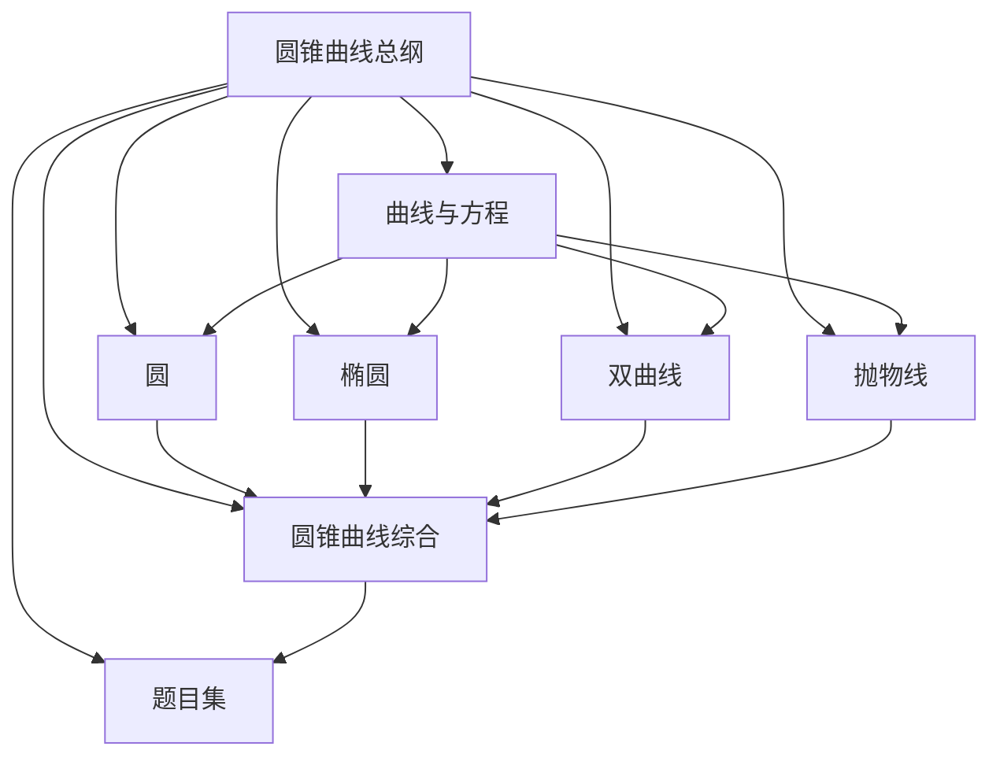

---
tags:
  - 数学
  - 解析几何
  - 圆锥曲线
  - MOC
author: wym
date: 2026-07-07
aliases:
  - 圆锥曲线总纲
  - Conic Sections MOC
---

# 圆锥曲线 (Conic Sections) — 总纲

圆锥曲线是解析几何的核心内容，也是高中数学最具区分度的压轴板块。它通过代数方程研究几何曲线的性质，将函数、方程、不等式、向量等工具融为一体，是连接初等几何与高等数学的重要桥梁。本总纲作为 MOC (Map of Content)，旨在梳理圆锥曲线知识体系的全貌，提供导航入口与学习路径。

---

## 知识结构关系图

> [!abstract] 结构说明
> 「曲线与方程」是理论基础，为圆、椭圆、双曲线、抛物线提供统一的代数方法框架。四种曲线各自独立又相互关联，最终汇聚于「圆锥曲线综合」进行统一研究，并落实到「题目集」实战训练。

---

## 子文件索引

### [[曲线与方程]]
基础篇，涵盖轨迹方程的常见求法（直接法、定义法、代入法、参数法、交轨法）、参数方程与普通方程的互化、极坐标与直角坐标的转换。这是进入圆锥曲线世界的"钥匙"——理解曲线与方程的关系，才能用代数工具精确刻画几何对象。

### [[圆]]
圆是最简单的二次曲线，也是理解其他圆锥曲线的起点。内容包括：圆的标准方程与一般方程、点与圆/直线与圆/圆与圆的位置关系、切线方程与弦长公式、圆系方程、阿波罗尼斯圆。掌握圆的代数处理方式，为后续椭圆的学习铺平道路。

### [[椭圆]]
椭圆是高考考查频率最高的圆锥曲线。内容包括：第一定义与第二定义的统一、标准方程的推导与几何性质、离心率与准线、焦点三角形的周长与面积公式、点差法（中点弦问题）、切线方程与切点弦、光学性质及其应用。椭圆中的许多方法与结论可直接类比到双曲线。

### [[双曲线]]
双曲线与椭圆共享相似的代数结构，但因定义中的"差"而表现出截然不同的几何形态。内容包括：两种定义形式、标准方程与几何性质、渐近线的求法与意义、共轭双曲线与等轴双曲线、焦点三角形面积公式、切线方程与光学性质。注意与椭圆公式中的符号差异（$a^2+b^2$ vs $a^2-b^2$）。

### [[抛物线]]
抛物线是 $e=1$ 的特殊情况，具有独特的几何性质，也是高考中运算量相对友好的曲线。内容包括：四种标准方程（开口朝右/左/上/下）的统一理解、焦点与准线、焦半径公式、焦点弦的定值性质（端点坐标积、倒数和等）、切线方程、光学性质（平行光聚集到焦点）。

### [[圆锥曲线综合]]
将四种曲线统一在"第二定义"的框架下，建立统一理论。内容包括：圆锥曲线的统一定义与极坐标方程、极点与极线理论、仿射变换（将椭圆转化为圆）、定点定值问题的系统解法、圆锥曲线与直线的综合问题。这是从"分别学习"到"融会贯通"的关键一步。

### [[题目集]]
精选 50+ 道题目，按照难度递进编排：基础巩固 → 高考真题 → 综合压轴 → 竞赛拓展。每道题配有完整解答过程与思路分析，覆盖定点定值、最值范围、存在性探究等核心题型。建议在学完各篇理论后，逐层推进练习。

---

## 学习路径建议

> [!tip] 推荐学习顺序
> 1. **基础阶段**：[[曲线与方程]] → [[圆]]
>    - 先掌握曲线方程的基本思想，再以圆为第一个具体对象，建立代数方法处理几何问题的直觉。
> 2. **核心阶段**：[[椭圆]] → [[双曲线]] → [[抛物线]]
>    - 按此顺序学习，椭圆内容最丰富，双曲线可类比椭圆但注意差异，抛物线相对独立且运算量较轻。
> 3. **提高阶段**：[[圆锥曲线综合]]
>    - 在掌握三种曲线后，用统一定义、极点极线、仿射变换等工具进行拔高，形成统一视角。
> 4. **练习阶段**：[[题目集]]
>    - 从基础题到压轴题逐步推进，建议每学完一类曲线就做对应题目，综合篇留到最后。

> [!warning] 注意
> - 椭圆与双曲线公式容易混淆，学习时建议对比记忆，尤其注意 $a, b, c$ 的关系差异。
> - 点差法是解决中点弦问题的利器，务必熟练掌握。
> - 不要死记硬背结论，理解推导过程才能真正在考场上灵活运用。

---

## 外部笔记链接导航

以下笔记与圆锥曲线有密切联系，可作为交叉参考：

- [[../直线/直线的方程与线性代数表示]] — 直线方程的各种形式及其线性代数本质，是联立直线与圆锥曲线的基础
- [[../直线/点到直线、曲线、平面、曲面的距离]] — 距离公式的系统总结，涉及焦点弦、焦半径等距离计算
- [[../其他/极坐标与参数方程]] — 圆锥曲线的极坐标统一方程 $\rho = \dfrac{ep}{1-e\cos\theta}$，以及参数方程形式
- [[../其他/空间解析几何基础]] — 空间中的二次曲面（椭球面、双曲面、抛物面）与平面圆锥曲线的联系
- [[../../向量/向量]] — 向量法在轨迹方程、定比分点、垂直平行判定中的应用
- [[../../平面几何/平面几何定律集]] — 圆锥曲线光学性质的几何证明，以及相关平面几何定理
- [[../../微积分/微积分]] — 曲率、弧长、面积等微积分概念在圆锥曲线中的应用

---

## 核心公式速览

> [!info] 椭圆核心公式
> - 标准方程：$\displaystyle\frac{x^2}{a^2}+\frac{y^2}{b^2}=1 \quad (a>b>0)$
> - 离心率：$e=\dfrac{c}{a},\; c^2=a^2-b^2,\; 0<e<1$
> - 通径：$\dfrac{2b^2}{a}$
> - 焦半径：$|MF_1|=a+ex_0,\; |MF_2|=a-ex_0$
> - 焦点三角形面积：$S=b^2\tan\dfrac{\theta}{2}$
> - 点差法斜率：$k=-\dfrac{b^2x_0}{a^2y_0}$
> - 切线：$\displaystyle\frac{x_0x}{a^2}+\frac{y_0y}{b^2}=1$

> [!info] 双曲线核心公式
> - 标准方程：$\displaystyle\frac{x^2}{a^2}-\frac{y^2}{b^2}=1 \quad (a>0,b>0)$
> - 离心率：$e=\dfrac{c}{a},\; c^2=a^2+b^2,\; e>1$
> - 渐近线：$y=\pm\dfrac{b}{a}x$
> - 通径：$\dfrac{2b^2}{a}$
> - 焦点三角形面积：$S=b^2\cot\dfrac{\theta}{2}$
> - 点差法斜率：$k=\dfrac{b^2x_0}{a^2y_0}$
> - 切线：$\displaystyle\frac{x_0x}{a^2}-\frac{y_0y}{b^2}=1$

> [!info] 抛物线核心公式
> - 标准方程：$y^2=2px \quad (p>0)$
> - 离心率：$e=1$
> - 焦点：$F(\frac{p}{2},0)$，准线：$x=-\frac{p}{2}$
> - 通径：$2p$
> - 焦半径：$|MF|=x_0+\dfrac{p}{2}$
> - 焦点弦性质：$x_1x_2=\dfrac{p^2}{4},\; y_1y_2=-p^2,\; \dfrac{1}{|FA|}+\dfrac{1}{|FB|}=\dfrac{2}{p}$
> - 切线：$y_0y=p(x+x_0)$

> [!info] 通用公式
> - 弦长：$|AB|=\sqrt{1+k^2}\cdot|x_1-x_2|=\sqrt{1+k^2}\cdot\dfrac{\sqrt{\Delta}}{|A|}$
> - 统一定义：$\dfrac{|MF|}{d(M,l)}=e$，极坐标形式 $\rho=\dfrac{ep}{1-e\cos\theta}$

---

## 重要概念速查表

| 概念 | 椭圆 | 双曲线 | 抛物线 |
|:---|:---|:---|:---|
| **第一定义** | $\|MF_1\|+\|MF_2\|=2a$ | $\|\|MF_1\|-\|MF_2\|\|=2a$ | $\|MF\|=d(M,l)$ |
| **标准方程** | $\dfrac{x^2}{a^2}+\dfrac{y^2}{b^2}=1$ | $\dfrac{x^2}{a^2}-\dfrac{y^2}{b^2}=1$ | $y^2=2px$ |
| **$a,b,c$ 关系** | $a^2=b^2+c^2$ | $c^2=a^2+b^2$ | — |
| **离心率 $e$** | $0<e<1$ | $e>1$ | $e=1$ |
| **渐近线** | 无 | $y=\pm\dfrac{b}{a}x$ | 无 |
| **通径** | $\dfrac{2b^2}{a}$ | $\dfrac{2b^2}{a}$ | $2p$ |
| **焦点三角形面积** | $b^2\tan\dfrac{\theta}{2}$ | $b^2\cot\dfrac{\theta}{2}$ | — |
| **光学性质** | 一焦点出发的光线经椭圆反射后过另一焦点 | 一焦点出发的光线经双曲线反射后，反射光反向延长线过另一焦点 | 平行于对称轴的光线经抛物线反射后汇于焦点 |
| **对称性** | 关于 $x$ 轴、$y$ 轴、原点 | 关于 $x$ 轴、$y$ 轴、原点 | 仅关于对称轴 |
| **顶点数** | 4 个 | 2 个 | 1 个 |

---

> [!quote] 圆锥曲线是解析几何皇冠上的明珠，它用代数之精确刻画几何之美妙。掌握它，不仅是应试的需要，更是通往更高数学殿堂的阶梯。