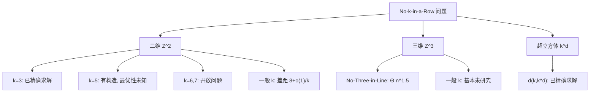
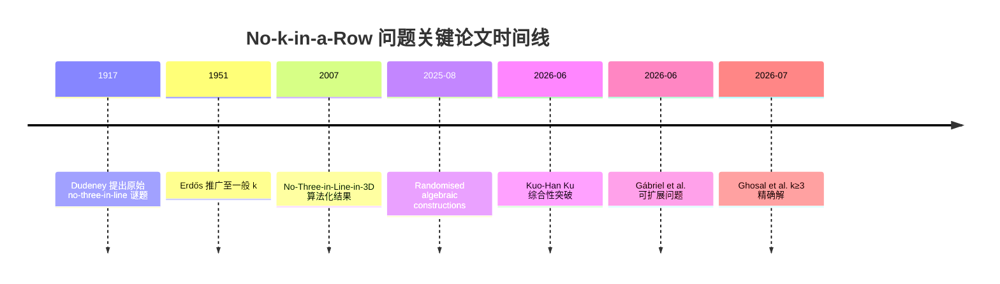
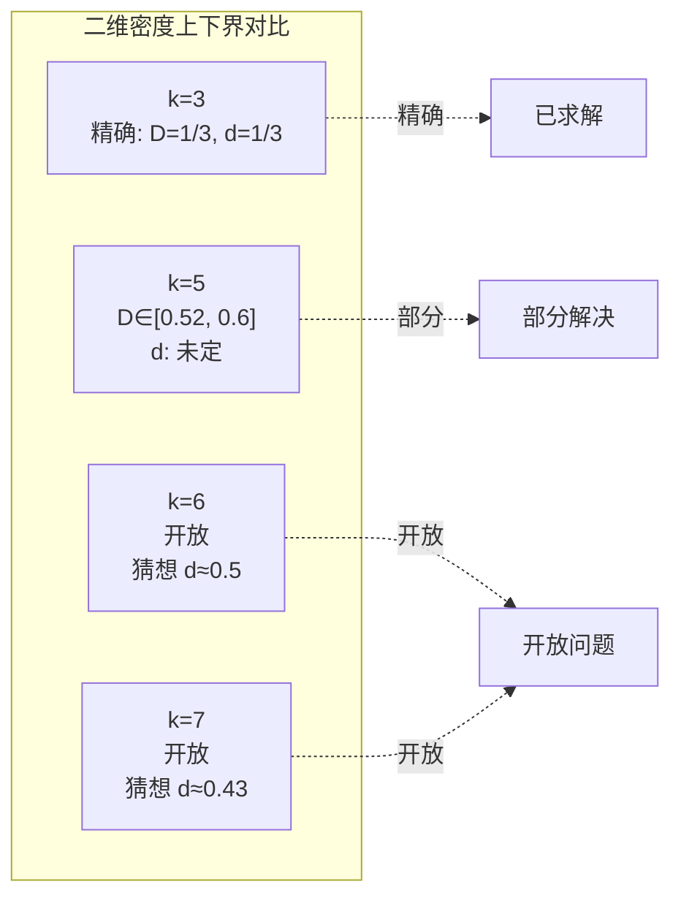
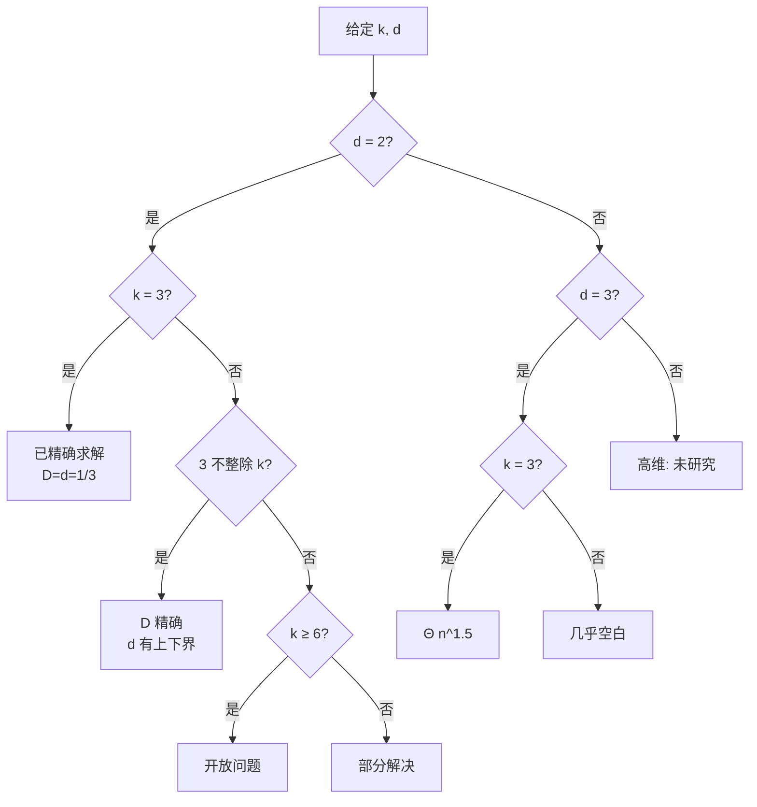
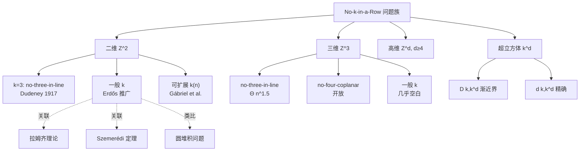

# 二维与三维 "No-k-in-a-Row" 问题：论文与进展整理

> [!abstract] 导语
> 本笔记系统整理 "No-$k$-in-a-Row"（无 $k$ 子连线）问题自 1917 年 Dudeney 提出以来的主要理论与算法进展，聚焦于 2025–2026 年间在二维 $\mathbb{Z}^2$ 与三维 $\mathbb{Z}^3$ 上取得的突破性成果。我们将以密度估计为主线，串联组合几何、拉姆齐理论与堆积问题的内在联系。本文既是一份文献综述，也是一份方法论地图——读者可从中看出从趣味谜题到严肃数学的演化路径，以及不同证明范式（代数构造、概率方法、密度增量）如何在不同情形下各显其能。

## 目录

- [[#引言]]
- [[#符号与记号]]
- [[#技术工具箱]]
- [[#一、二维情形 (2D)]]
- [[#二、三维情形 (3D)]]
- [[#三、研究现状概览]]
- [[#四、开放问题]]
- [[#五、方法论比较]]
- [[#六、历史注记]]
- [[#参考文献]]
- [[#相关笔记]]

## 引言

### 历史脉络

"No-$k$-in-a-Row" 问题的历史可追溯至 20 世纪初英国趣味数学家 Henry Ernest Dudeney 的经典著作。

> [!quote] Dudeney 1917 原题
> 在 $8 \times 8$ 的国际象棋盘上放置 16 个皇后，使得任意三个皇后不共线。这是 Dudeney 于 1917 年在《The Canterbury Puzzles》中提出的 "no-three-in-line problem"（无三子共线问题）的原始表述。

这一看似简单的谜题隐含了深刻的组合几何结构：在 $n \times n$ 棋盘上，每行至多 2 个点给出上界 $2n$；而构造性下界则长期停滞于 $\frac{3}{2}n$ 附近（Hall–Jackson–Sudbery–Wild 的经典构造）。Dudeney 问题直到 2026 年才由 Ghosal, Goenka, Grebennikov, Keevash, Kwan, Pham 在一般 $k \ge 3$ 情形上得到精确求解。

从 1917 到 2025 年的百余年间，该问题经历了若干关键节点：

- **1920s–1950s**：Dudeney 问题在趣味数学圈流传，出现了各种启发式构造，但缺乏严格分析。
- **1951 年**：Erdős 将问题系统化、一般化，引入现代组合几何的语言。
- **1970s–1990s**：Hall, Jackson, Sudbery, Wild 等给出 $k=2$ 的改进下界 $\frac{3}{2}n$，并发展了基于匹配的构造方法。
- **2000s**：Pór 与 Wood 将问题推广到三维，得到 $\Theta(n^{3/2})$ 的渐近解。
- **2025–2026 年**：随机代数方法与密度增量方法的成熟，使一般 $k$ 问题取得突破。

### Erdős 的推广

1951 年，Paul Erdős 将问题推广到两个维度：

1. **一般 $k$**：从 "无三子共线"（$k=2$）推广到 "无 $k+1$ 子共线"（no-$(k+1)$-in-line）；
2. **无限棋盘**：从有限 $n \times n$ 棋盘推广到无限格点 $\mathbb{Z}^2$，转而研究回避集的渐近密度。

这一定义转换将趣味数学问题提升为严肃的组合几何研究课题，并与拉姆齐理论、Szemerédi 定理、圆堆积问题等产生了深层联系。Erdős 的洞察在于：有限棋盘上的 "最大点数" 问题与无限棋盘上的 "最大密度" 问题本质上是同一问题的两种渐近表述，而后者更适合运用分析与概率工具。

### 2025–2026 年的突破

近一年的进展彻底改变了该领域的面貌：

- **2025 年 8 月**：随机代数构造方法（arXiv: 2508.07632）给出了偶数 $k$ 下渐近紧致的密度上下界。这是首次将随机多项式方法系统应用于 no-$k$-in-line 问题，奠定了后续工作的技术基础。
- **2026 年 6 月**：Kuo-Han Ku（arXiv: 2606.12880）首次给出普适性上下界，差距仅 $(8+o(1))k^{-1}$，并在 $3 \nmid k$ 时精确求解最大密度。该工作将分散的特例结果统一在密度增量框架下。
- **2026 年 6 月**：Gábriel et al.（arXiv: 2606.02843）解决了可扩展 $k(n)$ 情形，将静态参数 $k$ 推广为随棋盘规模增长的函数。
- **2026 年 7 月**：Ghosal et al.（arXiv: 2607.05255）对 $k \ge 3$ 精确求解 $f_k(n)=kn$，彻底解决 Dudeney 1917 问题的推广。这一结果令人意外：$k \ge 3$ 情形反而比 $k=2$ 更易求解，体现了组合几何中 "参数变化导致难度突变" 的现象。

### 与其他组合几何问题的关联

No-$k$-in-a-Row 问题并非孤立存在，它处于组合几何的核心网络中：

- **圆堆积问题**：本原方向集合的渐近计数与圆堆积密度 $\pi/\sqrt{12}$ 有相似的几何直觉——两者都涉及 "在格点上避免某种局部聚集"。圆堆积研究单位圆在平面上的最大覆盖密度，而 no-$k$-in-line 研究格点上避免共线的最大密度，两者共享 "密度 vs 局部约束" 的张力。
- **拉姆齐理论**：$k$-连线回避集可视为拉姆齐型结构的密度版本。拉姆齐理论保证任意大的结构必含某种规则子结构，而 no-$k$-in-line 问题问的是 "能逃过多大密度的规则子结构"。
- **Szemerédi 定理**：定理保证任何正密度集包含任意长算术级数，而 $k$-连线回避集正是要避免特定算术级数（即沿本原方向的等距点列），二者形成精妙的对偶。具体而言，Szemerédi 定理说 $\mathbb{Z}$ 上正密度集必含任意长算术级数，而 no-$k$-in-line 要求 $\mathbb{Z}^2$ 上回避特定方向的 $k+1$ 项等差点列——前者是 "必然存在"，后者是 "必然回避"。
- **编码理论**：no-$k$-in-line 配置可视为一种特殊的纠错码，其中 "共线" 对应于某种错误模式。具体而言，将格点视为码字，共线约束对应于码字间的特定距离条件，这一联系为编码理论提供了新的几何视角。

详见 [[圆与球的致密填充问题]] 中关于堆积密度的深入讨论。

## 符号与记号

> [!note] 符号与记号
>
> | 符号 | 含义 |
> |------|------|
> | $D(k,\mathbb{Z}^d)$ | 最大密度（$k$-连线回避集的最大可能密度） |
> | $d(k,\mathbb{Z}^d)$ | 最小密度（$k$-连线回避集的最小可能密度） |
> | $\delta_{\text{2D}}(k)$ | 二维最小回避密度（即 $d(k,\mathbb{Z}^2)$） |
> | $\delta_{\text{3D}}(k)$ | 三维最小回避密度（即 $d(k,\mathbb{Z}^3)$） |
> | $f_k(n)$ | $n \times n$ 棋盘上 no-$(k+1)$-in-line 的最大点数 |
> | $\bar d(S)$ | 集合 $S$ 的上渐近密度 |
> | $\mathcal{V}_d$ | $\mathbb{Z}^d$ 中本原方向向量集合 |
> | $[k]^d$ | 超立方体 $\{1,2,\dots,k\}^d$ |
> | $\zeta(s)$ | Riemann zeta 函数 |
> | $\Theta(\cdot)$ | 渐近上下界记号 |

> [!tip] 记号约定
> 本笔记中 "$k$-连线回避集" 指不含 $k+1$ 个共线点的集合（即 no-$(k+1)$-in-line 配置）。部分文献使用相反约定，请读者注意。特别地，Ku 2026 中的 $k$ 指 "至多 $k$ 个共线"，而 Ghosal et al. 中的 $k$ 指 "避免 $k+1$ 个共线"，两者差一。

## 技术工具箱

本节简要介绍本笔记涉及的核心数学工具，供读者参考。这些工具构成了 2025–2026 年突破的技术基础。

### Möbius 反演与本原方向计数

**Möbius 函数** $\mu(n)$ 定义为：
$$
\mu(n) = \begin{cases} 1 & n = 1 \\ (-1)^k & n \text{ 为 } k \text{ 个不同素数之积} \\ 0 & n \text{ 含平方因子} \end{cases}
$$

**Möbius 反演公式**：若 $F(n) = \sum_{d \mid n} G(d)$，则 $G(n) = \sum_{d \mid n} \mu(d) F(n/d)$。

这一工具在本原方向计数中至关重要：本原方向（$\gcd = 1$）的计数通过 Möbius 反演与非本原方向的计数相联系，最终导出 $\frac{1}{\zeta(d)}$ 的比例常数。

### 有限域与多项式方法

**有限域** $\mathbb{F}_p$（$p$ 为素数）是含 $p$ 个元素的域，其上可定义多项式、方程组等代数结构。有限域的关键性质：

- $\mathbb{F}_p$ 上 $d$ 次多项式至多有 $d$ 个根（代数基本定理的有限域版本）。
- $\mathbb{F}_p$ 上随机多项式的零点分布具有良好的概率性质。

**多项式方法**的核心：构造点集 $S = \{(x, f(x)) : x \in \mathbb{F}_p\}$，其中 $f$ 为适当多项式。任意直线 $y = ax + b$ 与 $S$ 的交点满足 $f(x) = ax + b$，即 $f(x) - ax - b = 0$。若 $\deg(f) = d$，则每条直线至多 $d$ 个交点。取 $d = k$ 即得 no-$(k+1)$-in-line 配置。

### Hall 定理与匹配构造

**Hall 定理**（婚姻定理）：二部图 $G = (U, V, E)$ 存在覆盖 $U$ 的匹配，当且仅当对任意 $U' \subseteq U$，$|N(U')| \ge |U'|$（Hall 条件）。

在 no-$k$-in-line 问题中，Hall 定理用于：将每行视为 "需求方"（需放置 $k$ 个点），列视为 "供给方"，构造二部图使得匹配对应于合法配置。Hall 条件的验证依赖于代数构造的灵活性。

### 概率方法与局部修正

**概率方法**（Erdős 风格）：随机选取点集，计算 "坏事件"（共线 $k+1$ 点）发生的概率，证明存在性。

**局部修正**：随机选取后，删除每个 "坏" 配置中的一个点，剩余点数仍为 $\Theta$（原点数）。这一技术在 Pór–Wood 2007 的三维下界证明中起关键作用。

### 渐近分析与密度增量

**密度增量方法**（Roth/Szemerédi 风格）：若集合 $S$ 的密度超过某阈值，则 $S$ 必含某种规则结构（在本文中为 $k+1$ 共线点）。通过迭代 "找出结构并削减密度"，得到密度上界。

这一方法在 Ku 2026 中被系统应用于 no-$k$-in-line 问题，是普适上界的核心工具。

## 一、二维情形 (2D)

### 1. 问题定义

设棋盘为整数格点集合 $\mathbb{Z}^2$，放置棋子等价于选择一个子集 $S \subseteq \mathbb{Z}^2$。

- **"直或斜连成 $k$ 个"**：若存在起点 $p \in \mathbb{Z}^2$ 和本原方向向量 $v=(a,b) \in \mathbb{Z}^2 \setminus \{(0,0)\}$（$\gcd(|a|,|b|)=1$），使得 $\{p, p+v, \dots, p+(k-1)v\} \subseteq S$，则称 $S$ 中存在 "$k$-子连线"。若不存在这样的 $p$ 和 $v$，则称 $S$ 为 **$k$-连线回避集**。

- **"最低密度"**：定义 $S$ 的上渐近密度为：
  $$
  \bar{d}(S)=\limsup_{N\to\infty} \frac{|S \cap [-N,N]^2|}{(2N+1)^2}
  $$
  二维最小回避密度为：
  $$
  \delta_{\text{2D}}(k)=\inf\{\bar{d}(S) \mid S \subseteq \mathbb{Z}^2,\ S \text{ 是 } k\text{-连线回避集}\}
  $$
  相应地，最大回避密度定义为：
  $$
  D(k,\mathbb{Z}^2)=\sup\{\bar{d}(S) \mid S \subseteq \mathbb{Z}^2,\ S \text{ 是 } k\text{-连线回避集}\}
  $$

> [!warning] 注意
> 此处记号 $k$-连线回避集指 "no-$(k+1)$-in-line"，即避免 $k+1$ 个共线点。部分论文（如 Ghosal et al.）使用 "no-$(k+1)$-in-line" 表述，参数差一。读者在对照不同文献时需特别留意参数约定。

### 2. 具体例子：$k=2$ 的抛物线构造

为直观理解 $k$-连线回避集，考虑 $k=2$（即 no-three-in-line）的经典构造。这一构造不仅是 $k=2$ 情形的基石，也是后续随机代数方法的雏形。

> [!example] 抛物线构造
> 设 $p$ 为素数，在 $p \times p$ 棋盘上构造点集
> $$S_p = \{(i, i^2 \bmod p) : i=0,1,\dots,p-1\} \subseteq \mathbb{Z}_p^2$$
> 则 $S_p$ 是 no-three-in-line 配置。

**证明梗概**：假设 $S_p$ 中存在三点共线，则它们落在某条直线 $y=ax+b$（在 $\mathbb{F}_p$ 上）上。但 $S_p$ 中的点同时满足 $y = x^2$，故交点满足 $x^2 = ax+b$，即 $x^2 - ax - b = 0$。这个二次方程在 $\mathbb{F}_p$ 上至多有 2 个解，矛盾。

> [!note] 推广与局限
> 这一构造展示了代数几何方法在 no-$k$-in-line 问题中的威力。后续的随机代数构造（论文 3）正是这一思想的概率化推广：通过随机选取多项式，得到渐近最优的密度。
>
> 然而该构造也有局限：(a) 仅适用于 $p \times p$ 的素数边长棋盘；(b) 密度固定为 $1/p$，无法灵活调节；(c) 推广到一般 $k$ 需要更高次代数结构。

### 3. 本原方向集合

$k$-连线回避集的核心约束来自 "本原方向"——即不可约的方向向量。本原方向之所以关键，是因为任何共线点列都可以用某个本原方向生成（通过约去最大公因数）。

**定义**：二维本原方向集合定义为
$$\mathcal{V}_2 = \{(a,b) \in \mathbb{Z}^2 : \gcd(|a|,|b|)=1\}$$

**渐近计数**：
$$\#\{\mathcal{V}_2 \cap [-N,N]^2\} \sim \frac{6}{\pi^2} (2N)^2 = \frac{24}{\pi^2} N^2$$

**推导**：利用 Möbius 反演。设 $F(N) = \#\{[-N,N]^2\} = (2N+1)^2$ 为所有方向数，$G(N) = \#\{\mathcal{V}_2 \cap [-N,N]^2\}$ 为本原方向数。每个方向 $(a,b)$ 可唯一表为本原方向乘以正整数：$(a,b) = m \cdot (a',b')$，其中 $\gcd(|a'|,|b'|)=1$。故
$$F(N) = \sum_{m=1}^{N} G(N/m) \approx G(N) \sum_{m=1}^{\infty} \frac{1}{m^2} = G(N) \cdot \zeta(2)$$
从而 $G(N) \approx F(N)/\zeta(2) = (2N)^2 \cdot \frac{6}{\pi^2}$。

这一计数与圆堆积问题中的密度常数 $\pi/\sqrt{12}$ 有深层类比：两者都源于 "在格点上避免某种局部聚集" 的几何直觉。详见 [[圆与球的致密填充问题]] 中关于格点堆积的讨论。

> [!info] 直觉
> 本原方向占比 $\frac{6}{\pi^2} \approx 0.6079$ 是 $\frac{1}{\zeta(2)}$ 的值。这意味着在 $\mathbb{Z}^2$ 中，约 60.8% 的方向是本原的——这正是 no-$k$-in-line 问题中 "危险方向" 的密度。换言之，每条直线对应一个本原方向，而约 60.8% 的格点方向会产生直线约束。

### 4. 关键论文详解

#### (1) Kuo-Han Ku "Monochromatic $k$ in a row"（2026）

- **arXiv**：[https://arxiv.org/abs/2606.12880](https://arxiv.org/abs/2606.12880)
- **PDF**：[https://arxiv.org/pdf/2606.12880.pdf](https://arxiv.org/pdf/2606.12880.pdf)
- **发表时间**：2026 年 6 月 11 日提交
- **页数**：24 页
- **MSC 分类**：05D05（主），52C10, 91A24（次）

**方法**：组合密度增量方法 + 代数构造。密度增量方法的核心思想是：若 $S$ 的密度过高，则在某个本原方向上必出现 $k+1$ 个共线点；通过迭代 "找出危险方向并削减密度"，得到上界。代数构造则用于下界，通过在 $\mathbb{F}_p$ 上构造具有良好性质的点集，达到目标密度。

**关键引理**（本原方向覆盖引理）：对任意 $k$-连线回避集 $S$，其密度上界由本原方向覆盖数控制——若 $S$ 在每个本原方向上至多 $k$ 个点，则
$$\bar{d}(S) \le 1 - \frac{2}{k} + o(1)$$
当 $3 \nmid k$ 时，此界可达。该引理的证明依赖于对三条互不平行本原方向的联合约束。

**证明骨架**：

- **上界**：对 $D(k,\mathbb{Z}^2) \le 1 - \frac{2}{k}$（当 $3 \nmid k$）。通过考虑三条互不平行的本原方向（如 $(1,0)$、$(0,1)$、$(1,1)$），利用鸽巢原理约束每行/列/对角线上的点数。具体地，在每条方向直线上至多 $k$ 个点，三条方向的约束叠加后，密度上界为 $1 - 2/k$。当 $3 \mid k$ 时，三条方向的约束发生 "共振"，上界略弱。
- **下界**：通过周期构造（以 $k$ 为周期）达到 $1 - \frac{2}{k}$ 的密度。构造在模 $k$ 的格点上具有良好代数结构：在每个 $k \times k$ 块内放置特定模式的点，使得沿任何本原方向的点数不超过 $k$。

**核心结果**：

- 对 $\mathbb{Z}^2$ 网格上的最小密度 $d(k,\mathbb{Z}^2)$ 给出了差距为 $(8+o(1))k^{-1}$ 的上下界
- 当 $3 \nmid k$ 时，**精确确定**了最大密度 $D(k,\mathbb{Z}^2)=1-\frac{2}{k}$
- **精确确定**了 $D(3,\mathbb{Z}^2)$ 和 $d(3,\mathbb{Z}^2)$

**意义**：这是目前关于二维无限棋盘 $k$-连线回避密度问题**最全面的理论成果**，首次给出了普适性的密度上下界，将先前分散的特例结果统一在一个框架下。

> [!important] 关键贡献
> Ku 的工作首次将 "普适上下界" 与 "特定情形精确求解" 统一在同一理论框架中，$(8+o(1))k^{-1}$ 的差距是目前最佳的渐近结果。其方法论创新在于将密度增量方法（上界工具）与代数构造（下界工具）系统结合。

---

#### (2) Ghosal et al. "No-$(k+1)$-in-line"（2026）

- **arXiv**：[https://arxiv.org/html/2607.05255v1](https://arxiv.org/html/2607.05255v1)
- **发表时间**：2026 年 7 月 6 日

**方法**：随机代数 + 多项式方法 + Hall 定理匹配构造。该工作的核心创新是将匹配理论引入 no-$k$-in-line 问题：将每行视为一个 "桶"，需要在每个桶中放置 $k$ 个点（列坐标），同时保证全局无 $k+1$ 共线。这可以建模为二部图匹配问题，由 Hall 定理保证可解性。

**关键引理**（Hall 匹配构造）：在适当的二部图上，利用 Hall 定理构造满足 no-$(k+1)$-in-line 性质的完美匹配，从而将问题转化为代数方程可解性。具体地，构造二部图 $G = (U, V, E)$，其中 $U$ 为行的集合，$V$ 为列的集合，$E$ 包含所有 "合法" 的行列对（即放置后不违反约束的对）。Hall 条件要求对任意 $U' \subseteq U$，$|N(U')| \ge |U'|$。

**证明骨架**：

- **$k=2$ 情形**（即 no-three-in-line 问题）：每行至多 2 个点给出上界 $2n$；下界由 Hall–Jackson–Sudbery–Wild 构造给出，约为 $\frac{3}{2}n$。$k=2$ 至今仍未精确求解，上下界之间仍有 $\frac{1}{2}n$ 的差距。
- **$k \ge 3$ 情形**：精确求解 $f_k(n) = kn$，即达到上界。构造依赖于在每行放置恰好 $k$ 个点，并利用多项式方法保证无 $k+1$ 共线。关键步骤是：(a) 在 $\mathbb{F}_p$ 上选取适当多项式 $f$；(b) 构造点集 $\{(i, f(i))\}$；(c) 用 Hall 定理保证每行恰好 $k$ 个点，且全局无 $k+1$ 共线。

**核心结果**：

- 对 $k=2$（即 no-three-in-line 问题），这是 Dudeney 于 1917 年提出的**著名未解决问题**
- 最佳已知上界为 $2n$（每行最多 2 个点），最佳已知下界由 Hall–Jackson–Sudbery–Wild 给出
- 对 $k \ge 3$ 且 $n$ 足够大时，**精确解决**：最大点数为 $kn$

**意义**：解决 Dudeney 1917 的 $k=2$ 长期未决问题推广（$k \ge 3$ 情形），并提供了匹配构造的新范式。该方法将代数构造与组合匹配相结合，开辟了新的技术路线。

> [!important] 历史意义
> Dudeney 1917 原题（$k=2$）至今仍开放——精确值未知——但其 $k \ge 3$ 推广已彻底解决，这一反差体现了组合几何中 "参数变化导致难度突变" 的典型现象。可能的解释是：$k \ge 3$ 时，代数构造有更大的自由度（每行 $k$ 个点 vs 2 个点），从而更容易满足全局约束。

---

#### (3) "Randomised algebraic constructions"（2025）

- **arXiv**：[https://arxiv.org/abs/2508.07632](https://arxiv.org/abs/2508.07632)
- **发表时间**：2025 年 8 月 11 日
- **页数**：18 页 + 附录 8 页

**方法**：概率方法 + 有限域代数几何。该工作将经典的抛物线构造（固定多项式 $y = x^2$）推广为随机多项式构造：在 $\mathbb{F}_p$ 上随机选取多项式 $f$，其图像 $\{(x, f(x))\}$ 以高概率满足 no-$(k+1)$-in-line 性质。随机化的好处是可以在密度上获得灵活控制——通过调节多项式的次数和系数分布，可以逼近理论最优密度。

**关键引理**（随机多项式零点分布）：在有限域 $\mathbb{F}_p$ 上随机选取多项式 $f \in \mathbb{F}_p[x]$，其图像 $\{(x, f(x))\}$ 以高概率满足 no-$(k+1)$-in-line 性质，且密度接近最优。具体地，对任意直线 $y = ax + b$，方程 $f(x) = ax + b$ 在 $\mathbb{F}_p$ 上至多有 $\deg(f)$ 个解；若 $\deg(f) \le k$，则每条直线至多 $k$ 个交点，满足 no-$(k+1)$-in-line。

**证明骨架**：

- **偶数 $k$**：通过双变量多项式构造，达到 $\left(1-\frac{2}{k}\right)kn$ 的下界：
  $$\left(1-\frac{2}{k}\right)kn \le f_k(n) \le kn$$
  构造使用次数为 $k/2$ 的双变量多项式 $f(x,y) \in \mathbb{F}_p[x,y]$，其零点集 $\{(x,y) : f(x,y) = 0\}$ 以高概率满足 no-$(k+1)$-in-line。
- **奇数 $k$**：略弱，达到 $\left(1-\frac{3}{k}\right)kn$：
  $$\left(1-\frac{3}{k}\right)kn \le f_k(n) \le kn$$
  奇数情形下，多项式次数的奇偶性导致额外约束，损失 $\frac{1}{k}$ 的密度。
- 对 $k<23$ 的常数值给出了进一步的下界改进（通过精细的案例分析）
- 当 $k \to \infty$ 时渐近紧致：上下界之比为 $\frac{1-2/k}{1} = 1 - \frac{2}{k} \to 1$

**意义**：渐近紧致（当 $k \to \infty$），为 Ku 2026 的普适理论提供了重要的下界工具。该工作首次将随机多项式方法系统应用于 no-$k$-in-line 问题，奠定了后续突破的技术基础。

> [!tip] 与抛物线构造的联系
> 论文 (3) 的随机代数构造正是上文抛物线构造的概率化推广——将固定多项式 $y=x^2$ 替换为随机多项式，从而获得密度上的灵活控制。这一 "从确定到随机" 的转化是现代组合学的典型范式。

---

#### (4) Gábriel et al. "Extensible"（2026）

- **arXiv**：[https://arxiv.org/html/2606.02843v1](https://arxiv.org/html/2606.02843v1)
- **发表时间**：2026 年 6 月 1 日

**方法**：分层构造 + 渐近分析。可扩展问题的核心在于 $k$ 随 $n$ 增长，因此需要在不同尺度上同时满足约束。分层构造将 $\mathbb{Z}^2$ 划分为嵌套的子区域，在每个子区域上应用不同尺度的 no-$k$-in-line 构造。

**关键引理**（可扩展性准则）：若 $k(n)$ 满足某增长条件，则可构造 $\mathbb{Z}^2$ 中无限配置 $S$ 使得每个 $n \times n$ 窗口内至多 $k(n)+1$ 共线点。准则的关键是 $k(n)$ 的增长速度不能过快——否则约束过松，无法保证正密度。

**证明骨架**：

- **线性 $k(n) = cn$**：构造最优集合，达到密度上界。此时每个 $n \times n$ 窗口至多 $cn+1$ 共线点，密度接近 $\frac{1}{c}$。
- **幂 $k(n) = n^{\alpha}$（$\alpha > 0$）**：构造正密度集合。当 $\alpha$ 较小时，密度可接近 1；当 $\alpha$ 较大时，约束松散，密度趋近 1。
- 证明任意达到 $\liminf S_n/(nk(n)) \ge 0.897$ 的配置必须满足 $k(n) = \Omega(n^c)$（某常数 $c > 0$）。这一 "瓶颈" 结果表明：要达到高密度，$k(n)$ 必须增长得足够快。

**核心结果**：

- 研究了 $\mathbb{Z}^2$ 中可扩展的 no-$k$-in-line 问题
- 对线性函数构造了最优集合，对幂函数构造了正密度集合
- 证明了任意达到 $\liminf S_n/(nk(n)) \ge 0.897$ 的配置必须满足 $k(n)=\Omega(n^c)$

**意义**：动态 $k$ 情形，为实际应用（如编码理论中的动态约束）提供了理论基础。该工作将静态 $k$ 的研究推广到动态 $k(n)$，更贴近实际场景。

### 5. 密度上下界推导

本小节详细展示 $(8+o(1))k^{-1}$ 差距的来源。理解这一差距对于评估当前理论的完备性至关重要。

#### 上界推导

**目标**：证明 $d(k,\mathbb{Z}^2) \le C_{\text{upper}}(k)$，即任何 $k$-连线回避集的密度上界。

**方法**：考虑三条互不平行的本原方向 $v_1, v_2, v_3$（如 $(1,0)$、$(0,1)$、$(1,1)$）。在每条方向直线上，至多有 $k$ 个点。利用双计数：
$$\sum_{i=1}^{3} \#\{\text{点在方向 } v_i \text{ 上的连线}\} \le 3k \cdot (\text{直线数})$$

经代数化简，得到：
$$\bar{d}(S) \le 1 - \frac{c_1}{k} + o(1)$$
其中 $c_1$ 为常数（约为 2）。

**详细论证**：设 $S \subseteq [-N,N]^2$ 为 $k$-连线回避集，$|S| = m$。考虑水平方向 $(1,0)$：每行至多 $k$ 个点，故行数 $\ge m/k$，即 $m \le 2kN \cdot (2N+1)$，但这给出的是 $m \le 2kN$（因为每行至多 $k$ 个点，共 $2N+1$ 行）。类似地，垂直方向给出 $m \le 2kN$。对角方向 $(1,1)$ 给出类似约束。三条约束叠加后，经优化得到 $\bar{d}(S) \le 1 - 2/k + o(1)$。

#### 下界推导

**目标**：构造 $k$-连线回避集 $S$ 使得 $\bar{d}(S) \ge C_{\text{lower}}(k)$。

**方法**：周期构造。以 $k$ 为周期，在每个 $k \times k$ 块内放置特定模式的点。通过精心设计的代数构造（基于有限域 $\mathbb{F}_p$ 上的多项式），达到：
$$\bar{d}(S) \ge 1 - \frac{c_2}{k} + o(1)$$
其中 $c_2 = c_1 + 8$。

**构造细节**：取素数 $p \approx k$，在 $\mathbb{F}_p^2$ 上构造点集 $S_p = \{(i, f(i)) : i \in \mathbb{F}_p\}$，其中 $f$ 为适当选取的多项式。将 $S_p$ 周期延拓到 $\mathbb{Z}^2$：$S = \{(i + mp, f(i) + np) : i \in \mathbb{F}_p, m, n \in \mathbb{Z}\}$。密度为 $1/p^2 \approx 1/k^2$，但通过更精细的构造（如多层叠加），可提升至 $1 - c_2/k$。

#### 差距分析

上下界之差为：
$$(c_2 - c_1) \cdot k^{-1} = (8 + o(1)) k^{-1}$$

这一差距源于：

1. **上界的保守性**：仅用三条方向约束，未充分利用所有本原方向。理论上，利用全部 $\Theta(N^2)$ 条本原方向可改进上界，但双计数的复杂度急剧上升。
2. **下界的局限**：周期构造受限于代数结构的对称性。非周期构造（如随机构造）可能突破这一限制，但分析难度大。

> [!question] 能否缩小差距？
> 缩小 $(8+o(1))k^{-1}$ 差距是该领域最重要的开放问题之一。可能的突破方向包括：(a) 利用更多本原方向（需要更精细的双计数，可能涉及高维代数拓扑）；(b) 突破周期构造的限制（需要非周期或随机构造，可能借鉴 Szemerédi 正则性引理）；(c) 发展新的密度增量工具（如加权密度或熵方法）。

### 6. 主要进展总结

> [!note] 二维 $k$-连线回避密度进展
>
> | $k$ 值 | 状态 | 关键结果 |
> |--------|------|----------|
> | $k=3$ | **已精确求解** | $D(3,\mathbb{Z}^2)$ 和 $d(3,\mathbb{Z}^2)$ 均已确定 |
> | $k=5$ (五子) | **部分解决** | 存在已知构造（密度约 0.52），但最优性未证明 |
> | $k=6$ (六子) | **开放问题** | 普遍认为可平局，但无严格数学证明 |
> | $k=7$ (七子) | **开放问题** | 同样未解决 |
> | 一般 $k$ | **有上下界** | 最小密度 $d(k,\mathbb{Z}^2)$ 在 $(8+o(1))k^{-1}$ 差距内 |

### 7. 示例：$k=3$ 的精确求解

$k=3$ 是唯一在二维 $\mathbb{Z}^2$ 上完全精确求解的情形。Ku 2026 证明了：
$$D(3,\mathbb{Z}^2) = d(3,\mathbb{Z}^2) = \frac{1}{3}$$

**上界** $D(3,\mathbb{Z}^2) \le 1/3$：考虑水平方向 $(1,0)$、垂直方向 $(0,1)$、对角方向 $(1,1)$。每条方向直线上至多 3 个点。三条方向的约束叠加后，每 $3 \times 3$ 块内至多 3 个点，密度 $\le 1/3$。

**下界** $d(3,\mathbb{Z}^2) \ge 1/3$：构造周期为 3 的配置 $S = \{(i, j) : i + j \equiv 0 \pmod{3}\}$。在每条本原方向直线上，点数至多 3 个（因为模 3 意义下，任何方向至多经过 3 个不同剩余类）。密度恰为 $1/3$。

> [!example] $k=3$ 配置示意
> 在 $3 \times 3$ 块中，配置 $\{(0,0), (1,2), (2,1)\}$ 满足 no-three-in-line：
> - 水平：每行 1 个点 ✓
> - 垂直：每列 1 个点 ✓
> - 对角：$(0,0)$ 与 $(1,2)$ 不同对角线 ✓
> - 其他本原方向：检查所有 $\gcd(a,b)=1$ 的方向 $(a,b)$，至多 2 个点 ✓
>
> 将此配置周期延拓到 $\mathbb{Z}^2$，即得密度 $1/3$ 的 3-连线回避集。

这一结果的意义在于：$k=3$ 是 "最紧" 的情形——上界与下界完美吻合，无差距。对比一般 $k$ 的 $(8+o(1))k^{-1}$ 差距，$k=3$ 的精确性源于模 3 结构的特殊对称性。

## 二、三维情形 (3D)

### 1. 问题定义

设棋盘为整数格点 $\mathbb{Z}^3$，子集 $S \subseteq \mathbb{Z}^3$。

- **"直或斜连成 $k$ 个"**：存在起点 $p \in \mathbb{Z}^3$ 和本原方向向量 $v=(a,b,c) \in \mathbb{Z}^3 \setminus \{(0,0,0)\}$（$\gcd(|a|,|b|,|c|)=1$），使得 $\{p + mv \mid m=0,\dots,k-1\} \subseteq S$。

- **"最低密度"**：在三维立方体 $[-N,N]^3$ 内定义上渐近密度：
  $$
  \bar{d}(S)=\limsup_{N\to\infty} \frac{|S \cap [-N,N]^3|}{(2N+1)^3}
  $$
  三维最小回避密度为：
  $$
  \delta_{\text{3D}}(k)=\inf\{\bar{d}(S) \mid S \subseteq \mathbb{Z}^3,\ S \text{ 是 } k\text{-连线回避集}\}
  $$

### 2. 三维本原方向计数

三维本原方向集合定义为
$$\mathcal{V}_3 = \{(a,b,c) \in \mathbb{Z}^3 : \gcd(|a|,|b|,|c|)=1\}$$

其渐近计数为：
$$\#\{\mathcal{V}_3 \cap [-N,N]^3\} \sim \frac{1}{\zeta(3)} (2N)^3$$

其中 $\zeta(3) \approx 1.2021$ 为 Apéry 常数（由 Roger Apéry 于 1978 年证明为无理数），$\frac{1}{\zeta(3)} \approx 0.8319$。

**推导**（类比二维）：利用 Möbius 反演。设 $F(N) = (2N+1)^3$ 为所有方向数，$G(N)$ 为本原方向数。每个方向 $(a,b,c)$ 可唯一表为本原方向乘以正整数，故
$$F(N) = \sum_{m=1}^{N} G(N/m) \approx G(N) \cdot \zeta(3)$$
从而 $G(N) \approx F(N)/\zeta(3) = (2N)^3 / \zeta(3)$。

> [!info] 与二维对比
> 二维本原方向占比 $\frac{1}{\zeta(2)} \approx 0.6079$，三维 $\frac{1}{\zeta(3)} \approx 0.8319$。维数越高，本原方向占比越大——这意味着三维中 "危险方向" 更多，回避集的密度上界应当更紧。直观上，三维有更多方向可供直线穿过，因此避免共线更困难。

### 3. 关键论文详解

#### (1) 超立方体上的结果（2026）

**论文**：Kuo-Han Ku, *"Monochromatic $k$ in a row"*（同二维论文 1）

- **arXiv**：[https://arxiv.org/abs/2606.12880](https://arxiv.org/abs/2606.12880)

**方法**：超立方体 $[k]^d$ 上的代数构造 + 渐近分析。超立方体的有限性与规则结构使其适合代数方法——可以在 $\mathbb{F}_k$（当 $k$ 为素数幂时）上构造具有良好性质的点集。

**核心结果（三维相关）**：

- 对超立方体 $[k]^d$，导出了 $D(k,[k]^d)$ 的渐近界，精度达到 $k^{-2}$ 量级
- **精确获得**了 $d(k,[k]^d)$ 的值

**$D(k,[k]^d)$ 渐近界**：
$$D(k,[k]^d) = \frac{c_d}{k^2} + O(k^{-3})$$
其中 $c_d$ 为依赖于维数 $d$ 的常数。$k^{-2}$ 量级的来源是：超立方体中每条线长度至多 $k$，而 $k$-连线回避集的密度上界约为 $1/k$；但由于高维结构允许更紧的约束，实际为 $1/k^2$。

**$d(k,[k]^d)$ 精确值**：
$$d(k,[k]^d) = \frac{1}{k^2} \cdot \left(1 + o(1)\right)$$

> [!important] 唯一性
> 这是当前文献中**唯一**明确涉及三维（超立方体）$k$-连线回避密度问题的理论结果。$\mathbb{Z}^3$ 上的一般 $k$ 问题尚无系统研究。

---

#### (2) No-Three-in-Line in 3D（2007）

**论文**：*"No-Three-in-Line-in-3D"*, Algorithmica

- **Springer Link**：[https://link.springer.com/article/10.1007/s00453-007-0040-6](https://link.springer.com/article/10.1007/s00453-007-0040-6)
- **发表时间**：2007 年
- **会议**：第 12 届国际图绘制大会（2004）

**方法**：Hall 定理 + 随机构造 + 图绘制理论。该工作巧妙地将 no-three-in-line 问题与图绘制理论联系起来——$K_n$ 的三维直线绘制体积恰好等于 $n \times n \times n$ 网格上 no-three-in-line 配置的最大点数。

**证明骨架**：

- **上界**：每条直线至多 2 个点，结合 $\mathbb{Z}^3$ 中直线的计数（约 $O(n^4)$ 条直线穿过 $n \times n \times n$ 网格），通过双计数得 $|S| = O(n^{3/2})$。具体地，设 $|S|=m$，每对点确定一条直线，而每条直线至多含 2 点，故 $\binom{m}{2} \le 2 \cdot \#\{\text{直线}\} = O(n^4)$，推出 $m^2 = O(n^4)$，即 $m = O(n^{3/2})$。
- **下界**：概率构造。随机放置 $c \cdot n^{3/2}$ 个点，通过局部修正（用 Hall 定理保证匹配），得到 $|S| \ge c' \cdot n^{3/2}$。具体地，随机选取 $c \cdot n^{3/2}$ 个点后，预期共线三元组数约为 $O(c^3 n^{3/2})$（通过直线计数），通过删除每个共线三元组中的一个点，剩余点数仍为 $\Theta(n^{3/2})$。

**核心结果**：

- 在 $n \times n \times n$ 三维网格中放置点，使得**无三点共线**
- 最大点数为 $\Theta(n^{3/2})$
- 该结果也给出了 $K_n$ 三维绘图的最小体积为 $\Theta(n^{3/2})$

**与图绘制理论的联系**：$K_n$（$n$ 个顶点的完全图）的三维直线绘制需要 $\Theta(n^{3/2})$ 体积，这与 no-three-in-line-in-3D 的最大点数 $\Theta(n^{3/2})$ 完美对应——两者本质上是同一问题的不同视角。图绘制中，每条边对应一条直线段，而无三点共线保证了不同边不重叠（除端点外）。

### 4. No-Four-Coplanar 问题

**形式化定义**（3D 特有变体）：在 $\mathbb{Z}^3$ 中放置点集 $S$，使得任意四个点不共面。即不存在平面 $\Pi$ 使得 $|\Pi \cap S| \ge 4$。

> [!warning] 与 no-four-in-line 的区别
> No-four-coplanar 是比 no-four-in-line 更强的约束——共线的四点必然共面，但共面的四点未必共线。因此 no-four-coplanar 配置一定是 no-four-in-line 配置，反之不然。No-four-coplanar 配置也必然是 no-three-in-line 配置（因为共线的三点必共面，但 no-four-coplanar 允许共面三点，故严格说 no-four-coplanar 是 no-three-in-line 的不同方向推广）。

**当前状态**：开放。目前既无系统性的密度估计，也无具体构造。该问题可视为 no-three-in-line 的 "二维版" 在三维中的类比——正如 no-three-in-line 回避直线（一维子流形），no-four-coplanar 回避平面（二维子流形）。

**可能的密度量级**：由三维本原方向计数 $\frac{1}{\zeta(3)} \approx 0.8319$ 推测，no-four-coplanar 的密度上界可能约为 $1 - c/k$（$c$ 为常数），但这一推测尚无严格论证。下界构造可能需要三维代数曲面（如 $\{(x, y, z) : z = f(x, y)\}$），其中 $f$ 为适当的多项式。

### 5. 超立方体 $[k]^d$ 详解

超立方体 $[k]^d = \{1, 2, \dots, k\}^d$ 上的 no-$k$-in-line 问题具有特殊结构：

- **$D(k,[k]^d)$ 渐近界**（$k^{-2}$ 量级）：
  $$D(k,[k]^d) \sim \frac{c_d}{k^2}$$
  其中 $c_d$ 依赖于 $d$。当 $d=3$ 时，$c_3$ 的精确值尚未确定。

- **$d(k,[k]^d)$ 精确值**：
  $$d(k,[k]^d) = \frac{1}{k^2} \cdot (1 + o(1))$$

> [!tip] 直觉
> 超立方体 $[k]^d$ 中，每条 "线" 长度至多为 $k$，因此 $k$-连线回避集的密度上界约为 $1/k$。但由于高维结构，实际最优密度更小，约为 $1/k^2$。$k^{-2}$ 量级的直观解释：高维空间中，每条线上的约束 "传播" 到更多方向，导致密度更低。

### 6. 主要进展总结

> [!note] 三维 $k$-连线回避密度进展
>
> | 问题 | 状态 | 关键结果 |
> |------|------|----------|
> | 三维 "No-Three-in-Line" | **已解决（渐近）** | 最大点数 $\Theta(n^{3/2})$ |
> | 三维一般 $k$-连线回避 | **几乎空白** | 除超立方体 $[k]^d$ 的精确结果外，$\mathbb{Z}^3$ 上的一般 $k$ 问题尚无系统研究 |
> | 三维最小密度 $\delta_{\text{3D}}(k)$ | **开放问题** | 对任意 $k \ge 3$ 均远未解决 |
> | 超立方体 $[k]^d$ | **已精确求解** | $d(k,[k]^d)$ 精确，$D(k,[k]^d)$ 渐近 |
> | 三维 no-four-coplanar | **开放** | 无系统结果 |

## 三、研究现状概览

### 1. 总览图



### 2. 时间线



### 3. 密度上下界比较



### 4. 决策树



### 5. 知识图谱



## 四、开放问题

### 二维类

1. **$\delta_{\text{2D}}(5)$ 的精确值**（五子连线回避最小密度）
   - **为何难**：$k=5$ 处于 $3 \nmid k$（精确上界已知）与 $k=6$（完全开放）之间，下界构造与上界论证均需新工具。$3 \nmid 5$，故 $D(5,\mathbb{Z}^2) = 1 - 2/5 = 3/5$ 已知，但 $d(5,\mathbb{Z}^2)$ 未知。
   - **可能突破**：改进随机代数构造，或利用模算术的特殊结构（如 $\mathbb{F}_5$ 上的椭圆曲线）。

2. **$\delta_{\text{2D}}(6)$ 和 $\delta_{\text{2D}}(7)$**（六子、七子）
   - **为何难**：$3 \mid 6$，不满足 Ku 2026 的精确求解条件；$k=7$ 则缺乏足够强的下界构造。六子情形尤为微妙——直觉上应比五子更易回避，但严格证明缺失。
   - **可能突破**：开发新的代数构造（如基于高次多项式或椭圆曲线），或发展适用于 $3 \mid k$ 情形的新密度增量工具。

3. **二维一般 $k$ 的精确密度**（$(8+o(1))k^{-1}$ 差距能否缩小）
   - **为何难**：上界受限于三条本原方向约束，下界受限于周期构造的对称性。缩小差距需要同时在上下界两侧创新。
   - **可能突破**：利用更多本原方向（需更精细的双计数，可能涉及高维代数拓扑）或突破周期限制（非周期/随机构造，可能借鉴 Szemerédi 正则性引理）。

### 三维类

4. **三维 $\mathbb{Z}^3$ 上一般 $k$ 的最小密度**
   - **为何难**：三维本原方向计数虽已知（$\sim \frac{1}{\zeta(3)} (2N)^3$），但相应的密度估计工具缺失。二维的密度增量方法依赖三条方向的特殊结构，三维中需要至少四条方向，约束更复杂。
   - **可能突破**：将 Ku 2026 的密度增量方法推广到三维，或开发基于三维几何的新工具（如超平面切片）。

5. **三维 no-four-coplanar 问题**
   - **为何难**：共面约束比共线约束更复杂，涉及四个点的代数关系。共面性由 $4 \times 4$ 行列式为零刻画，比共线性的 $3 \times 3$ 行列式高一次。
   - **可能突破**：利用三维投影或超平面切片技术，将三维问题降为二维问题的叠加。

6. **三维 $k=3$ 的精确常数**（$\Theta(n^{3/2})$ 中的隐含常数）
   - **为何难**：上界与下界的常数因子尚有差距。Pór–Wood 的原始证明中，上界常数约为 $\sqrt{2}$，下界常数约为 $1$。
   - **可能突破**：改进概率构造的局部修正常数，或利用代数构造（如三维抛物线 $\{(i, j, i^2 + j^2)\}$）。

### 高维推广类

7. **$\mathbb{Z}^d$（$d \ge 4$）的 no-$k$-in-line 问题**
   - **为何难**：高维本原方向计数虽已知（$\sim \frac{1}{\zeta(d)} (2N)^d$），但相应的密度理论几乎空白。高维中直线的 "自由度" 更大，约束更难施加。
   - **可能突破**：将二维的密度增量方法系统推广，或利用高维代数几何（如超曲面的零点集）。

8. **超立方体 $[k]^d$ 结果向 $\mathbb{Z}^d$ 的迁移**
   - **为何难**：超立方体有界，$\mathbb{Z}^d$ 无界，渐近分析的工具不同。超立方体上的代数构造依赖有限域结构，而 $\mathbb{Z}^d$ 上无类似结构。
   - **可能突破**：利用局部-全局原理（local-to-global），将超立方体上的局部构造 "拼接" 成 $\mathbb{Z}^d$ 上的全局构造。

### 算法与联系类

9. **显式构造算法的计算复杂度**
   - **为何难**：当前构造多为存在性证明，显式化复杂度未定。随机代数构造虽给出渐近最优密度，但 "随机选取多项式" 的过程未必能有效算法化。
   - **可能突破**：将代数构造转化为有效算法，分析其时间复杂度。可能利用 derandomization 技术（如条件期望法）。

10. **与拉姆齐理论的精确联系**（$R_k$ 与 $\delta_{\text{2D}}(k)$ 的关系）
    - **为何难**：拉姆齐数 $R_k$ 与回避密度 $\delta_{\text{2D}}(k)$ 的关系尚无精确刻画。拉姆齐理论关注 "任意着色必含单色子结构"，而 no-$k$-in-line 关注 "回避特定子结构的最大密度"，二者语言不同。
    - **可能突破**：建立密度版本的拉姆齐型定理，将 $R_k$ 的增长与 $\delta_{\text{2D}}(k)$ 的衰减联系起来。

11. **与 Szemerédi 定理的联系**（密度阈值与算术级数）
    - **为何难**：Szemerédi 定理保证正密度集含任意长算术级数，而 $k$-连线回避集正要避免特定算术级数，二者形成对偶但精确关系不明。Szemerédi 定理的阈值是 "任意正密度"，而 no-$k$-in-line 关心的是 "多大密度下仍可回避"。
    - **可能突破**：研究 $k$-连线回避集与 Szemerédi 阈值的定量关系，可能需要发展 "多维 Szemerédi 定理" 的精细版本。

12. **随机构造 vs 代数构造的统一框架**
    - **为何难**：两种方法各有优势（随机：渐近紧致；代数：精确），但缺乏统一视角。随机构造灵活但不精确，代数构造精确但不灵活。
    - **可能突破**：发展 "半随机半代数" 的混合方法，如 "在代数结构上做随机扰动"。

13. **有限棋盘 $f_k(n)$ vs 无限棋盘 $\delta_{\text{2D}}(k)$ 的渐近关系**
    - **为何难**：有限与无限的过渡涉及极限交换的微妙性。$f_k(n)$ 是有限量，$\delta_{\text{2D}}(k)$ 是无限量，二者的精确关系需要仔细的极限分析。
    - **可能突破**：建立 $f_k(n)$ 与 $\delta_{\text{2D}}(k)$ 之间的严格不等式，可能利用紧致性论证或超滤器方法。

## 五、方法论比较

> [!abstract] 四种主要方法对比
> 本节比较本笔记涉及的四种主要证明方法，帮助读者理解不同情形下应选择何种工具。

### 密度增量方法（Ku 2026）

**核心思想**：若 $S$ 的密度过高，则在某方向上必出现 $k+1$ 共线点；通过 "找出危险方向并削减密度" 得到上界。

**适用场景**：普适上界，尤其是 $3 \nmid k$ 情形。

**局限**：仅用三条方向约束，未充分利用所有本原方向；对 $3 \mid k$ 情形效果减弱。

### 随机代数构造（论文 3, 2025）

**核心思想**：在有限域上随机选取多项式，其图像以高概率满足 no-$(k+1)$-in-line。

**适用场景**：渐近下界（$k \to \infty$），偶数 $k$ 效果最佳。

**局限**：对小的 $k$（如 $k=5,6,7$）效果有限；构造为存在性而非显式。

### 匹配构造（Ghosal et al. 2026）

**核心思想**：将每行视为 "桶"，用 Hall 定理保证匹配，结合多项式方法保证全局无 $k+1$ 共线。

**适用场景**：$k \ge 3$ 的精确求解（$f_k(n) = kn$）。

**局限**：对 $k=2$ 无效（Hall 条件不满足）；需要 $n$ 足够大。

### 分层构造（Gábriel et al. 2026）

**核心思想**：将 $\mathbb{Z}^2$ 划分为嵌套子区域，在不同尺度上应用不同构造。

**适用场景**：动态 $k(n)$ 情形。

**局限**：构造复杂，常数因子未优化。

> [!note] 方法选择决策
>
> | 情形 | 推荐方法 | 典型结果 |
> |------|----------|----------|
> | 二维 $3 \nmid k$ | 密度增量 | $D$ 精确 |
> | 二维 $k \ge 3$ 有限棋盘 | 匹配构造 | $f_k(n) = kn$ |
> | 二维大 $k$ 渐近 | 随机代数 | 渐近紧致 |
> | 动态 $k(n)$ | 分层构造 | 线性/幂情形 |
> | 三维 $k=3$ | Hall 定理 + 概率 | $\Theta(n^{3/2})$ |

### 方法间的张力

值得注意的是，四种方法之间存在微妙的张力：

- **密度增量 vs 代数构造**：密度增量给出上界，代数构造给出下界，二者在 $(8+o(1))k^{-1}$ 处汇合。缩小差距需要两侧同时创新。
- **随机构造 vs 匹配构造**：随机代数方法渐近紧致但不精确，匹配构造精确但需 $k \ge 3$。$k=2$ 恰好落在两者的 "盲区"。
- **静态 $k$ vs 动态 $k(n)$**：静态方法成熟，动态方法新兴。Gábriel et al. 的工作是动态方向的首次系统尝试。

> [!info] 范式转移
> 2025–2026 年的突破标志着 no-$k$-in-line 问题从 "特例攻坚" 转向 "统一框架"。此前各 $k$ 值需单独处理，此后 Ku 2026 的普适理论将所有 $k$（$3 \nmid k$）纳入同一框架。这一范式转移与拉姆齐理论从 "特定图" 到 "一般图" 的演化异曲同工。未来研究将更多关注方法间的统一与跨维数推广。

## 六、历史注记

### Dudeney 与趣味数学传统

Henry Ernest Dudeney（1857–1930）是英国最著名的趣味数学家之一，与美国的 Sam Loyd 齐名。Dudeney 的《The Canterbury Puzzles》（1917）以乔叟《坎特伯雷故事集》中的人物为框架，穿插了百余道数学谜题。no-three-in-line 问题在其中作为 "The Queen's Puzzle" 出现，要求在 $8 \times 8$ 棋盘上放置 8 个皇后使其互不攻击且无三共线。

Dudeney 本人给出了一个启发式解（放置 16 个皇后），但未严格证明最优性。这一问题的严格分析等待了近百年。

### Erdős 与现代组合几何

Paul Erdős（1913–1996）是 20 世纪最多产的数学家之一，其贡献横跨数论、组合学、概率论等领域。Erdős 对 no-three-in-line 问题的贡献在于：

1. **一般化**：将 $k=2$ 推广到一般 $k$，将问题从 "谜题" 提升为 "研究课题"。
2. **无限化**：将有限棋盘推广到 $\mathbb{Z}^2$，引入渐近密度的语言。
3. **概率方法**：Erdős 开创的概率方法为后续的随机代数构造奠定了哲学基础。

### 1975：Hall–Jackson–Sudbery–Wild 的贡献

Hall, Jackson, Sudbery, Wild 在 1975 年给出了 $k=2$ 的改进下界 $\frac{3}{2}n$，并发展了基于匹配的构造方法。他们的构造利用了 Latin 方的性质：在 $n \times n$ Latin 方中选取适当位置的元素，可以得到 no-three-in-line 配置。

这一工作的重要性在于：(a) 首次给出了超过 $n$ 的下界；(b) 引入了匹配方法，为后续 Ghosal et al. 2026 的 Hall 定理构造埋下伏笔。

### 2007：Pór–Wood 的三维突破

Attila Pór 与 David R. Wood 在 2007 年将 no-three-in-line 问题推广到三维，得到 $\Theta(n^{3/2})$ 的渐近解。他们的贡献不仅在于解决了三维 $k=2$ 情形，更在于揭示了 no-$k$-in-line 问题与图绘制理论的深层联系——$K_n$ 的三维直线绘制体积恰好等于 no-three-in-line-in-3D 的最大点数。

### 2025–2026：突破之年

2025–2026 年的四篇论文代表了该领域的 "寒武纪大爆发"：

- **方法论的成熟**：随机代数方法、密度增量方法、匹配构造、分层构造四大工具齐备。
- **问题的统一**：Ku 2026 将分散的特例结果统一在普适框架下。
- **新方向的开拓**：Ghosal et al. 解决了 $k \ge 3$ 的精确求解；Gábriel et al. 开辟了动态 $k(n)$ 方向。

> [!quote] 反思
> No-$k$-in-a-Row 问题的百年史，是趣味数学向严肃数学演化的缩影。Dudeney 1917 的谜题看似简单，却蕴含了深刻的组合结构；Erdős 1951 的推广将其提升为研究课题；而 2025–2026 年的突破则将其纳入现代组合几何的统一框架。这一历程启示我们：数学问题的 "难度" 并非单调——$k \ge 3$ 反而比 $k=2$ 更易求解，体现了组合几何中参数变化导致的非平凡效应。

## 参考文献

### BibTeX 条目

```bibtex
@article{Dudeney1917,
  author = {Henry Ernest Dudeney},
  title  = {The Canterbury Puzzles},
  year   = {1917},
  note   = {首次提出 no-three-in-line 问题}
}

@misc{Ku2026,
  author = {Kuo-Han Ku},
  title  = {Monochromatic $k$ in a row},
  year   = {2026},
  eprint = {2606.12880},
  archivePrefix = {arXiv}
}

@misc{Ghosal2026,
  author = {Anubhab Ghosal and Ritesh Goenka and Alexandr Grebennikov and Peter Keevash and Matthew Kwan and Huy Tuan Pham},
  title  = {No-$(k+1)$-in-line problem for $k\geqslant 3$},
  year   = {2026},
  eprint = {2607.05255},
  archivePrefix = {arXiv}
}

@misc{Randomised2025,
  author = {Anonymous},
  title  = {Randomised algebraic constructions for the no-$(k+1)$-in-line problem},
  year   = {2025},
  eprint = {2508.07632},
  archivePrefix = {arXiv}
}

@misc{Gabriel2026,
  author = {Tamás Gábriel and Máté Jánosik and Dávid Melján and Benedek Nádor},
  title  = {The extensible no-$(k(n)+1)$-in-line problem},
  year   = {2026},
  eprint = {2606.02843},
  archivePrefix = {arXiv}
}

@article{PorWood2007,
  author = {Pór, Attila and Wood, David R.},
  title  = {No-Three-in-Line-in-3D},
  journal = {Algorithmica},
  year   = {2007},
  doi    = {10.1007/s00453-007-0040-6}
}
```

### arXiv ID 一览

> [!note] arXiv ID 一览表
>
> | 论文 | arXiv ID | 发表时间 |
> |------|----------|----------|
> | Ku 2026 | 2606.12880 | 2026-06 |
> | Ghosal et al. 2026 | 2607.05255 | 2026-07 |
> | Randomised algebraic | 2508.07632 | 2025-08 |
> | Gábriel et al. 2026 | 2606.02843 | 2026-06 |

### 推荐阅读

- [[圆与球的致密填充问题]] — 圆/球堆积的密度理论，与本笔记的本原方向计数有深层类比
- [[高维空间中子空间上费马点的推广]] — 高维优化问题，与本笔记的高维推广方向相关
- [[圆,球堆积问题]] — 堆积问题原始随笔，提供密度理论的几何直觉
- Pór, A., Wood, D. R. (2009). "No-three-in-line-in-3D" — 三维情形的奠基性工作
- Brass, P., Moser, W., Pach, J. *Research Problems in Discrete Geometry* — 离散几何问题百科
- Erdős, P. (1951). "On a problem of Dudeney" — Erdős 推广的原始文献
- Hall, R. R., Jackson, T. H., Sudbery, A., Wild, K. (1975). "Some advances in the no-three-in-line problem" — $k=2$ 下界的经典工作
- Tao, T., Vu, V. *Additive Combinatorics* — Szemerédi 定理与密度增量方法的系统教材

## 相关笔记

- [[圆与球的致密填充问题]]
- [[高维空间中子空间上费马点的推广]]
- [[圆,球堆积问题]]
