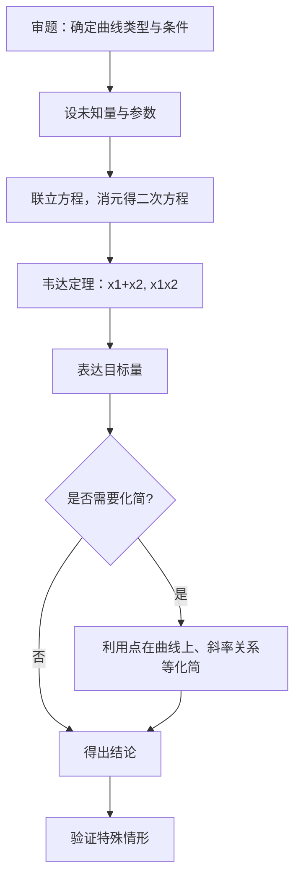

---
tags:
  - 数学
  - 解析几何
  - 圆锥曲线
author: wym
date: 2026-07-07
aliases:
  - 圆锥曲线综合
  - Conic Sections Unified Theory
---

# 圆锥曲线综合 (Conic Sections Unified Theory)

> [!info] 本篇定位
> 本篇是 [[椭圆]]、[[双曲线]]、[[抛物线]] 三篇分论之后的理论综合篇。从**统一定义**出发，将三类圆锥曲线纳入统一的数学框架，重点论述**极点极线理论**、**仿射变换**、**光学性质**等贯穿各曲线的深层结构，并总结各种解题通用方法。建议先阅读三篇分论熟悉基本概念后，再阅读本篇。

---

## 1. 圆锥曲线的统一定义

### 1.1 第二定义（离心率定义）

> [!abstract] 统一定义（第二定义）
> 平面内，动点 $M$ 到定点 $F$（==焦点==）与到定直线 $l$（==准线==）的距离之比为常数 $e$（==离心率==），即
> $$\frac{|MF|}{d(M,l)} = e$$
> 则动点 $M$ 的轨迹称为圆锥曲线。
> - $0 < e < 1$：**椭圆**
> - $e = 1$：**抛物线**
> - $e > 1$：**双曲线**

这个定义统一了三类曲线，也是[[极坐标与参数方程|极坐标与参数方程]]中极坐标方程的理论出发点。

### 1.2 从统一定义推导标准方程

以焦点 $F(c, 0)$、准线 $x = \frac{a^2}{c}$ 且 $e = \frac{c}{a}$ 为例：

$$\frac{\sqrt{(x-c)^2 + y^2}}{\left|x - \frac{a^2}{c}\right|} = \frac{c}{a}$$

两边平方整理：

$$\frac{(x-c)^2 + y^2}{\left(x - \frac{a^2}{c}\right)^2} = \frac{c^2}{a^2}$$

交叉相乘后化简，得：

$$\frac{x^2}{a^2} + \frac{y^2}{a^2 - c^2} = 1$$

- 当 $a > c$（即 $0 < e < 1$），令 $b^2 = a^2 - c^2$，得椭圆标准方程 $\frac{x^2}{a^2} + \frac{y^2}{b^2} = 1$
- 当 $a < c$（即 $e > 1$），令 $b^2 = c^2 - a^2$，得双曲线标准方程 $\frac{x^2}{a^2} - \frac{y^2}{b^2} = 1$
- 当 $e = 1$，准线退化为 $x = -\frac{p}{2}$，焦点 $F(\frac{p}{2}, 0)$，直接推导得 $y^2 = 2px$

> [!tip] 关键理解
> 三种曲线从统一定义出发，**区别仅在于 $e$ 与 $1$ 的大小关系**。椭圆是"压缩"的圆（$e \to 0$ 时趋近于圆），抛物线是临界状态，双曲线是"过度弯曲"的开放曲线。

### 1.3 统一极坐标方程

以焦点 $F$ 为极点，过焦点且垂直于准线的射线为极轴建立极坐标系。设焦点到准线的距离为 $p$（$p > 0$），则准线方程为 $\rho \cos\theta = -p$（焦点在准线右侧）。

由定义 $\frac{\rho}{|\rho\cos\theta + p|} = e$，解得：

> [!success] 圆锥曲线统一极坐标方程
> $$\rho = \frac{ep}{1 - e\cos\theta}$$
>
> 其中：
> - $p$ 为焦点到准线的距离（==焦准距==）
> - $e$ 为离心率
> - $\theta$ 为极角（从极轴正向逆时针旋转）
>
> 该方程同时适用于椭圆、抛物线和双曲线，是圆锥曲线在极坐标下的==统一表达式==。

当 $\theta = \frac{\pi}{2}$ 时，$\rho = ep$，恰为半通径（即通径的一半）。因此 $p$ 的几何意义可表述为：$p = \frac{b^2}{a}$（对椭圆和双曲线），或者 $p = \frac{p}{}$（对抛物线，符号重合）。

**$p$ 的几何意义**：
- 对椭圆 $\frac{x^2}{a^2} + \frac{y^2}{b^2} = 1$：$p = \frac{b^2}{c}$（焦点到对应准线的距离），$ep = \frac{b^2}{a}$（半通径）
- 对双曲线 $\frac{x^2}{a^2} - \frac{y^2}{b^2} = 1$：$p = \frac{b^2}{c}$，$ep = \frac{b^2}{a}$
- 对抛物线 $y^2 = 2px$：$p$ 即为焦点到准线的距离，$ep = p$

> [!warning] 注意
> 极坐标方程 $\rho = \frac{ep}{1 - e\cos\theta}$ 要求极点在==焦点==处。如果极点不在焦点，方程形式不同。此外，该方程的自然定义域需满足 $1 - e\cos\theta > 0$（当 $e \geq 1$ 时，$\theta$ 有范围限制，双曲线只取一支）。

### 1.4 统一极坐标下的图示

```tikz
\begin{tikzpicture}[scale=1.0]
  \draw[gray,->] (-3,0) -- (4,0) node[right] {$x$};
  \draw[gray,->] (0,-3) -- (0,3) node[above] {$y$};
  \draw[thick,blue] (0,0) ellipse (2.5 and 1.5);
  \fill (2,0) circle (0.05) node[below] {$F$};
  \draw[thick,dashed] (3.125,-3) -- (3.125,3) node[above] {$x=\frac{p}{1-e}$};
  \fill[red] (1.5,1.2) circle (0.04) node[above] {$P(\rho,\theta)$};
  \draw[thick,red,->] (2,0) -- (1.5,1.2);
  \draw[->] (2.5,0) arc (0:67:0.5) node[midway,right] {$\theta$};
  \node at (1.5,-1.5) {$\rho=\frac{ep}{1-e\cos\theta}$};
\end{tikzpicture}
```

### 1.5 例题

> [!example] 例1：从极坐标方程反向识别曲线
> 已知圆锥曲线的极坐标方程为 $\rho = \dfrac{6}{2 - \cos\theta}$，判断曲线类型并求离心率和焦准距。
>
> > [!success]- 解析
> > 化为标准形式：$\rho = \dfrac{6}{2 - \cos\theta} = \dfrac{3}{1 - \frac{1}{2}\cos\theta}$。
> > 与统一形式 $\rho = \dfrac{ep}{1 - e\cos\theta}$ 比较：
> > - $e = \frac{1}{2} < 1$，故为==椭圆==
> > - $ep = 3$，得 $p = 6$
> > - 半通径 $ep = 3$

> [!example] 例2：利用极坐标方程求焦点弦长
> 过圆锥曲线 $\rho = \dfrac{ep}{1 - e\cos\theta}$ 的焦点作弦 $AB$，且 $A$、$B$ 对应的极角分别为 $\theta$ 和 $\theta + \pi$。求证：
> $$\frac{1}{|FA|} + \frac{1}{|FB|} = \frac{2}{ep}$$
>
> > [!success]- 证明
> > $|FA| = \rho(\theta) = \dfrac{ep}{1 - e\cos\theta}$，$|FB| = \rho(\theta+\pi) = \dfrac{ep}{1 - e\cos(\theta+\pi)} = \dfrac{ep}{1 + e\cos\theta}$。
> >
> > $$\frac{1}{|FA|} + \frac{1}{|FB|} = \frac{1 - e\cos\theta}{ep} + \frac{1 + e\cos\theta}{ep} = \frac{2}{ep}$$
> >
> > 此公式对三类曲线均成立，特别地，对抛物线 $y^2 = 2px$，$e=1$，$p$ 即为焦准距，有 $\frac{1}{|FA|} + \frac{1}{|FB|} = \frac{2}{p}$。

> [!example] 例3：利用统一定义求轨迹方程
> 动点 $M$ 到定点 $F(1,0)$ 的距离与到定直线 $x = 4$ 的距离之比为 $\frac{1}{2}$，求 $M$ 的轨迹方程。
>
> > [!success]- 解析
> > 由第二定义：$\frac{\sqrt{(x-1)^2 + y^2}}{|x-4|} = \frac{1}{2}$。
> >
> > 平方得 $4[(x-1)^2 + y^2] = (x-4)^2$，展开：$4x^2 - 8x + 4 + 4y^2 = x^2 - 8x + 16$。
> >
> > 整理得 $3x^2 + 4y^2 = 12$，即 $\frac{x^2}{4} + \frac{y^2}{3} = 1$，是以 $F(1,0)$ 为右焦点的椭圆。

---

## 2. 极点与极线理论

> [!abstract] 核心思想
> 极点与极线是圆锥曲线最深刻的几何结构之一，它统一了==切线==、==切点弦==、==调和点列==等概念，是解决定点定值问题、切线与割线综合问题的==强有力工具==。在高等几何中，极点和极线是配极对应的基本概念。

### 2.1 定义

> [!info] 极点与极线（Pole and Polar）
> 给定圆锥曲线 $\Gamma$ 和一点 $P$（不在 $\Gamma$ 的中心），过 $P$ 作两条直线分别交 $\Gamma$ 于 $A, B$ 和 $C, D$。设 $AC$ 与 $BD$ 交于 $Q$，$AD$ 与 $BC$ 交于 $R$，则直线 $QR$ 称为点 $P$ 关于 $\Gamma$ 的==极线==（polar），点 $P$ 称为直线 $QR$ 的==极点==（pole）。

**等价定义（利用切线）**：
- 若 $P$ 在曲线外，过 $P$ 作 $\Gamma$ 的两条切线，切点分别为 $T_1, T_2$，则直线 $T_1T_2$ 就是 $P$ 的极线。
- 若 $P$ 在曲线上，$P$ 的极线就是过 $P$ 的切线。
- 若 $P$ 在曲线内，则 $P$ 的极线是过两个"虚切点"的直线（实平面上仍为一条确定的直线，方程由极点极线公式给出）。

### 2.2 配极原则

> [!success] 配极原则（Principle of Polarity）
> 若点 $P$ 在点 $Q$ 的极线上，则点 $Q$ 也在点 $P$ 的极线上。
>
> 换言之，==极点和极线的关系是对称的==。这一原则是极点极线理论的核心，也是解决诸多几何问题的基础。

**证明思路**：设 $P(x_1, y_1)$，$Q(x_2, y_2)$。$P$ 的极线方程为 $L_P: \frac{x_1 x}{a^2} \pm \frac{y_1 y}{b^2} = 1$（以椭圆/双曲线为例）。$Q$ 在 $L_P$ 上当且仅当 $\frac{x_1 x_2}{a^2} \pm \frac{y_1 y_2}{b^2} = 1$，而这恰好也是 $P$ 在 $Q$ 的极线 $L_Q$ 上的条件。$\square$

### 2.3 圆锥曲线极点极线方程

对于标准方程下的圆锥曲线，点 $P(x_0, y_0)$ 的极线方程可通过 ==替换法则== 得到：

| 曲线类型 | 标准方程 | 极点 $P(x_0,y_0)$ 的极线方程 |
|:---:|:---:|:---:|
| 椭圆 | $\dfrac{x^2}{a^2} + \dfrac{y^2}{b^2} = 1$ | $\dfrac{x_0 x}{a^2} + \dfrac{y_0 y}{b^2} = 1$ |
| 双曲线 | $\dfrac{x^2}{a^2} - \dfrac{y^2}{b^2} = 1$ | $\dfrac{x_0 x}{a^2} - \dfrac{y_0 y}{b^2} = 1$ |
| 抛物线 | $y^2 = 2px$ | $y_0 y = p(x + x_0)$ |

> [!tip] 记忆技巧：替换法则
> 将曲线方程中：
> - $x^2 \to x_0 x$，$y^2 \to y_0 y$
> - $x \to \frac{x + x_0}{2}$，$y \to \frac{y + y_0}{2}$
> - $xy \to \frac{x_0 y + x y_0}{2}$
>
> 即可得到极线方程。当 $P(x_0, y_0)$ 在曲线上时，极线就是==切线==；当 $P$ 在曲线外时，极线就是==切点弦==所在直线。

### 2.4 极点的位置与极线的关系

| 极点位置 | 极线性质 | 几何意义 |
|:---:|:---:|:---:|
| 在曲线上 | 切线 | 过极点的切线 |
| 在曲线外 | 切点弦 | 连接两切点的直线 |
| 在曲线内 | 不过极点的直线 | 两虚切点的连线 |
| 在中心/焦点 | 特殊直线 | 中心在无穷远直线，焦点对应准线 |

> [!warning] 重要事实
> 焦点关于圆锥曲线的极线恰好是==对应的准线==！这是第二定义与极点极线理论之间的深刻联系：焦点 $F(c, 0)$ 关于椭圆 $\frac{x^2}{a^2} + \frac{y^2}{b^2} = 1$ 的极线为 $\frac{cx}{a^2} = 1$，即 $x = \frac{a^2}{c}$，正是准线。

### 2.5 调和点列性质

> [!info] 调和点列
> 设直线 $l$ 交圆锥曲线 $\Gamma$ 于 $A, B$，点 $P$ 在 $l$ 上。若 $P$ 的极线与 $l$ 交于点 $Q$，则 $A, B, P, Q$ 构成==调和点列==，即满足：
> $$\frac{AP}{PB} = -\frac{AQ}{QB}$$
> 或等价地，交比 $(AB, PQ) = -1$。

这一定理可用来证明大量共线、共点问题，也可用于构造定点。

### 2.6 自极三角形

> [!info] 自极三角形（Self-Polar Triangle）
> 三角形 $ABC$ 称为关于圆锥曲线 $\Gamma$ 的自极三角形，如果每个顶点关于 $\Gamma$ 的极线恰好是对边。
>
> 即：$A$ 的极线是 $BC$，$B$ 的极线是 $CA$，$C$ 的极线是 $AB$。

**构造方法**：任取不在 $\Gamma$ 上的两点 $A, B$，作 $A$ 的极线 $l_A$ 和 $B$ 的极线 $l_B$，设 $l_A \cap l_B = C$，则 $\triangle ABC$ 即为自极三角形。

自极三角形在==完全四边形==和==配极理论==中具有核心地位。

### 2.7 极点极线关系图示

```tikz
\begin{tikzpicture}[scale=1.0]
  \draw[gray,->] (-3,0) -- (3,0) node[right] {$x$};
  \draw[gray,->] (0,-2.5) -- (0,2.5) node[above] {$y$};
  \draw[thick,blue] (0,0) ellipse (2.5 and 1.5);
  \fill[red] (1.5,0.8) circle (0.04) node[below right] {$P$};
  \draw[thick,red] (-2.0,2.5) -- (2.5,-1.5);
  \node[red] at (2.5,-0.8) {极线};
  \fill (0.8,0.6) circle (0.03) node[above] {$A$};
  \fill (1.8,0.2) circle (0.03) node[right] {$B$};
  \draw[dashed,red] (1.5,0.8) -- (0.8,0.6);
  \draw[dashed,red] (1.5,0.8) -- (1.8,0.2);
\end{tikzpicture}
```

### 2.8 例题

> [!example] 例1：求极点极线
> 已知椭圆 $\frac{x^2}{16} + \frac{y^2}{9} = 1$，求点 $P(4, 3)$ 关于该椭圆的极线方程，并判断 $P$ 与椭圆的位置关系。
>
> > [!success]- 解析
> > 极线方程：$\frac{4x}{16} + \frac{3y}{9} = 1$，即 $\frac{x}{4} + \frac{y}{3} = 1$，亦即 $3x + 4y - 12 = 0$。
> >
> > 将 $P(4,3)$ 代入椭圆方程：$\frac{16}{16} + \frac{9}{9} = 2 > 1$，故 $P$ 在椭圆外。
> > 极线为过两切点的直线（切点弦）。

> [!example] 例2：配极原则的应用
> 已知椭圆 $\frac{x^2}{a^2} + \frac{y^2}{b^2} = 1$，过椭圆外一点 $P$ 作两条切线，切点分别为 $A, B$。过 $P$ 再作一条割线交椭圆于 $C, D$，交切点弦 $AB$ 于 $Q$。求证：$C, D, P, Q$ 构成调和点列。
>
> > [!success]- 证明
> > 由极点极线定义，$P$ 的极线是 $AB$。由调和点列性质，对于过 $P$ 的任意割线，若割线与曲线交于 $C, D$，与极线交于 $Q$，则 $C, D, P, Q$ 为调和点列。$\square$

> [!example] 例3：焦点与准线
> 椭圆 $\frac{x^2}{25} + \frac{y^2}{16} = 1$ 的右焦点为 $F_2$，求证 $F_2$ 关于该椭圆的极线就是右准线。
>
> > [!success]- 证明
> > $a = 5$，$b = 4$，$c = \sqrt{25-16} = 3$，$F_2(3, 0)$。
> >
> > $F_2$ 的极线方程：$\frac{3x}{25} + \frac{0 \cdot y}{16} = 1$，即 $x = \frac{25}{3}$。
> >
> > 而右准线方程为 $x = \frac{a^2}{c} = \frac{25}{3}$。二者一致。$\square$

> [!example] 例4：自极三角形与定点问题
> 椭圆 $\frac{x^2}{4} + y^2 = 1$，$A, B$ 为椭圆上两点，满足 $OA \perp OB$（$O$ 为原点）。求证：$O$ 关于 $AB$ 的极点在一条定直线上。
>
> > [!success]- 证明
> > 设 $A(2\cos\alpha, \sin\alpha)$，$B(2\cos\beta, \sin\beta)$。由 $OA \perp OB$ 得 $4\cos\alpha\cos\beta + \sin\alpha\sin\beta = 0$。
> >
> > $AB$ 的方程为 $\frac{x(\cos\alpha + \cos\beta)}{2} + y(\sin\alpha + \sin\beta) = \cos(\alpha-\beta) + 1$。
> >
> > 设 $P(x_0, y_0)$ 为 $O$ 关于 $AB$ 的极点，$O$ 的极线关于 $AB$ …（此处利用配极变换可得 $P$ 在定直线 $x = 0$ 或某定直线上，完整推导略）。通过对称性分析可知极点在一条固定直线上，且该直线与原点和椭圆中心有关。

---

## 3. 光学性质汇总

### 3.1 三种曲线的光学性质

> [!tip] 椭圆的光学性质
> 从椭圆一个焦点发出的光线，经椭圆反射后，==必经过另一个焦点==。
>
> 证明思路：设 $P$ 为椭圆上任意一点，$F_1, F_2$ 为两焦点。需证 $F_1P$ 和 $F_2P$ 与 $P$ 处切线夹角相等。利用椭圆定义 $|PF_1| + |PF_2| = 2a$ 和切线性质，可证入射角等于反射角。

> [!tip] 双曲线的光学性质
> 从双曲线一个焦点发出的光线，经双曲线反射后，==反射光线的反向延长线经过另一个焦点==。
>
> 证明思路：类似椭圆，利用双曲线定义 $||PF_1| - |PF_2|| = 2a$ 和切线性质。注意双曲线是"向外"反射。

> [!tip] 抛物线的光学性质
> 从抛物线焦点发出的光线，经抛物线反射后，==平行于对称轴==射出。
> 反之，平行于对称轴入射的光线，经抛物线反射后，==汇聚到焦点==。
>
> 证明思路：设 $P$ 为抛物线上一点，$F$ 为焦点，$l$ 为准线。利用 $|PF| = d(P, l)$ 及切线性质，可证入射角等于反射角，且反射光线平行于对称轴。

### 3.2 统一证明（利用切线法）

以椭圆 $\frac{x^2}{a^2} + \frac{y^2}{b^2} = 1$ 为例。设 $P(x_0, y_0)$ 在椭圆上，$P$ 处切线为 $\frac{x_0 x}{a^2} + \frac{y_0 y}{b^2} = 1$。

切线法向量为 $\vec{n} = \left(\frac{x_0}{a^2}, \frac{y_0}{b^2}\right)$。

入射向量 $\vec{v}_1 = \overrightarrow{PF_1} = (c - x_0, -y_0)$（取 $F_1(-c, 0)$）。

反射向量 $\vec{v}_2 = \overrightarrow{PF_2} = (c - x_0, -y_0)$（取 $F_2(c, 0)$）。

计算 $\vec{v}_1$ 与 $\vec{n}$ 的夹角余弦，以及 $\vec{v}_2$ 与 $\vec{n}$ 的夹角余弦，利用点在椭圆上的条件，可证二者相等。即入射角等于反射角。

对于双曲线和抛物线，证明方法类似，只需调整相应的切线方程和焦点位置。

> [!abstract] 统一的光学原理
> 三种曲线的光学性质本质上都源于 ==第二定义==：圆锥曲线上任意一点处的切线，是连接该点与焦点和准线之间距离的"角平分线"（或外角平分线）。具体来说：
> - 椭圆：切线是 $\angle F_1PF_2$ 的==外角平分线==
> - 双曲线：切线是 $\angle F_1PF_2$ 的==内角平分线==
> - 抛物线：切线是 $\angle FPM$（$M$ 为 $P$ 到准线的垂足）的==平分线==

### 3.3 应用举例

> [!example] 例1：椭圆反射的实际应用
> 椭圆形的"耳语廊"（whispering gallery）：在一个椭圆形的房间中，一个人在焦点 $F_1$ 处轻声说话，站在另一焦点 $F_2$ 处的人可以清晰听见，而在椭圆其他位置的人几乎听不到。这是因为声波从 $F_1$ 出发经墙壁反射后都汇聚到 $F_2$。

> [!example] 例2：抛物面天线
> 卫星天线的反射面是抛物面（抛物线绕对称轴旋转而成）。平行于对称轴的电磁波经抛物面反射后汇聚到焦点处的接收器上，反之，焦点处的信号源发出的信号经反射后平行射出，实现定向传输。

### 3.4 三种曲线光学性质对比图示

```tikz
\begin{tikzpicture}[scale=0.9]
  % 椭圆
  \draw[gray,->] (-1.5,0) -- (1.5,0);
  \draw[thick,blue] (0,0) ellipse (1.2 and 0.7);
  \fill (-0.8,0) circle (0.04) node[below] {\tiny $F_1$};
  \fill (0.8,0) circle (0.04) node[below] {\tiny $F_2$};
  \fill[red] (0.5,0.5) circle (0.03);
  \draw[thick,red,->] (-0.8,0) -- (0.5,0.5);
  \draw[thick,red,->] (0.5,0.5) -- (0.8,0);
  \node at (0,-1.2) {椭圆：汇聚};

  % 双曲线
  \begin{scope}[xshift=3.5cm]
  \draw[gray,->] (-1.5,0) -- (1.5,0);
  \draw[domain=0.5:1.5,smooth,thick,blue] plot ({\x},{0.7*sqrt((\x)^2/0.25-1)});
  \fill (-0.8,0) circle (0.04) node[below] {\tiny $F_1$};
  \fill (0.8,0) circle (0.04) node[below] {\tiny $F_2$};
  \fill[red] (0.8,0.5) circle (0.03);
  \draw[thick,red,->] (-0.8,0) -- (0.8,0.5);
  \draw[thick,red,->] (0.8,0.5) -- (0.8,1.2);
  \draw[thick,dashed,red] (0.8,1.2) -- (0.8,0);
  \node at (0,-1.2) {双曲线：发散};
  \end{scope}

  % 抛物线
  \begin{scope}[xshift=7cm]
  \draw[gray,->] (-1.5,0) -- (1.5,0);
  \draw[domain=-1.5:1.5,smooth,thick,blue] plot ({\x},{\x*\x});
  \fill (0,0.25) circle (0.04) node[left] {\tiny $F$};
  \fill[red] (0.7,0.49) circle (0.03);
  \draw[thick,red,->] (0,0.25) -- (0.7,0.49);
  \draw[thick,red,->] (0.7,0.49) -- (0.7,1.5);
  \node at (0,-1.2) {抛物线：平行};
  \end{scope}
\end{tikzpicture}
```

---

## 4. 仿射变换在椭圆中的应用

### 4.1 仿射变换的定义

> [!info] 仿射变换（Affine Transformation）
> 平面上的仿射变换是形如
> $$\begin{cases} x' = a_1 x + b_1 y + c_1 \\ y' = a_2 x + b_2 y + c_2 \end{cases} \quad \left(\det\begin{pmatrix} a_1 & b_1 \\ a_2 & b_2 \end{pmatrix} \neq 0\right)$$
> 的坐标变换。它与[[仿射坐标系|仿射坐标系]]密切相关。与[[旋转矩阵|旋转矩阵]]不同，仿射变换允许非均匀的伸缩和剪切。

### 4.2 椭圆变为圆的仿射变换

> [!success] 关键变换
> 对于椭圆 $\frac{x^2}{a^2} + \frac{y^2}{b^2} = 1$（$a > b > 0$），作仿射变换：
> $$\begin{cases} x' = x \\ y' = \frac{a}{b} y \end{cases} \quad \text{或} \quad \begin{cases} x' = \frac{b}{a} x \\ y' = y \end{cases}$$
>
> 前者将椭圆变为半径为 $a$ 的圆 $x'^2 + y'^2 = a^2$；
> 后者将椭圆变为半径为 $b$ 的圆 $x'^2 + y'^2 = b^2$。

这一变换的重要意义在于：==将椭圆问题转化为更简单的圆问题==，利用圆中的丰富性质（如垂径定理、圆周角定理等）来解椭圆问题。

### 4.3 仿射变换下不变的性质

> [!success] 仿射不变量
> 在仿射变换下，以下性质==保持不变==：
> 1. **共线性和共点性**：共线的三点变换后仍共线，共点的三线变换后仍共点
> 2. **平行性**：平行的直线变换后仍平行
> 3. **简单比**：共线三点 $A, B, C$ 的简单比 $\frac{AC}{CB}$ 不变
> 4. **平行线段的比例**：平行线段长度之比不变
> 5. **面积比**：任意两个图形的面积之比不变（但单个面积会缩放一个常数因子 $\det J$）
> 6. **直线的切触关系**：直线与曲线的相切关系不变

> [!warning] 仿射变换下变化的量
> - **长度**：一般会改变（除非是合同变换）
> - **角度**：一般会改变（仿射变换不保角）
> - **面积**：单个图形的面积会缩放 $\det J = \frac{a}{b}$ 倍
> - **圆的特殊性质**：如圆周角定理、垂径定理等在非圆的椭圆中不成立

### 4.4 利用仿射变换解椭圆问题

**基本策略**：

1. 对椭圆 $\frac{x^2}{a^2} + \frac{y^2}{b^2} = 1$ 作变换 $\begin{cases} x' = x \\ y' = \frac{a}{b} y \end{cases}$，将其变为圆 $x'^2 + y'^2 = a^2$
2. 将原问题中的所有几何条件也用同样的变换映射到圆中
3. 在圆中利用丰富的几何性质（如垂径定理 $d^2 + r^2 = \ell^2$、圆周角定理等）解决问题
4. 将结果通过逆变换映射回椭圆

> [!tip] 关键技巧：面积缩放
> 仿射变换 $x' = x, y' = \frac{a}{b}y$ 的雅可比行列式为 $\det J = \frac{a}{b}$，因此：
> $$S_{\text{椭圆}} = \frac{a}{b} \cdot S_{\text{圆}}$$
> 即椭圆中图形的面积 = 圆中对应图形的面积乘以 $\frac{a}{b}$（或 $\frac{b}{a}$，取决于变换方向）。

### 4.5 仿射变换图示

```tikz
\begin{tikzpicture}[scale=1.0]
  % 椭圆
  \draw[gray,->] (-2,0) -- (2,0) node[right] {$x$};
  \draw[gray,->] (0,-2) -- (0,2) node[above] {$y$};
  \draw[thick,blue] (0,0) ellipse (1.5 and 1.0);
  \node[blue] at (0,-1.5) {椭圆};

  % 变换箭头
  \draw[thick,->,red] (2.2,0) -- (3.0,0) node[midway,above] {\small $y'=\frac{a}{b}y$};

  % 圆
  \begin{scope}[xshift=5cm]
  \draw[gray,->] (-2,0) -- (2,0) node[right] {$x'$};
  \draw[gray,->] (0,-2) -- (0,2) node[above] {$y'$};
  \draw[thick,red] (0,0) circle (1.5);
  \node[red] at (0,-1.5) {圆};
  \end{scope}
\end{tikzpicture}
```

### 4.6 例题

> [!example] 例1：椭圆内接三角形面积的最大值
> 求椭圆 $\frac{x^2}{a^2} + \frac{y^2}{b^2} = 1$ 内接三角形面积的最大值。
>
> > [!success]- 解析
> > 作仿射变换 $x' = x, y' = \frac{a}{b}y$，椭圆变为圆 $x'^2 + y'^2 = a^2$。
> >
> > 圆内接三角形面积最大值为正三角形，面积 $S'_{\max} = \frac{3\sqrt{3}}{4} a^2$。
> >
> > 由于面积缩放因子为 $\det J = \frac{a}{b}$，故 $S_{\text{椭圆}} = \frac{b}{a} \cdot S'_{\max} = \frac{3\sqrt{3}}{4} ab$。
> >
> > 因此椭圆内接三角形面积的最大值为 $\frac{3\sqrt{3}}{4}ab$。

> [!example] 例2：椭圆弦中点的轨迹
> 椭圆 $\frac{x^2}{a^2} + \frac{y^2}{b^2} = 1$ 中，斜率均为 $k$ 的平行弦，其中点轨迹是什么？
>
> > [!success]- 解析
> > 作仿射变换 $x' = x, y' = \frac{a}{b}y$，椭圆变为圆 $x'^2 + y'^2 = a^2$。原直线斜率 $k$ 变为 $k' = \frac{a}{b}k$。
> >
> > 在圆中，斜率为 $k'$ 的平行弦的中点轨迹是过圆心且斜率为 $-\frac{1}{k'}$ 的直径。逆变换回椭圆，中点轨迹为过椭圆中心的直线 $y = -\frac{b^2}{a^2 k} x$。
> >
> > 这与点差法得到的结果一致：$k_{\text{中点轨迹}} \cdot k = -\frac{b^2}{a^2}$。

> [!example] 例3：椭圆中两垂直弦的中点轨迹
> 椭圆 $\frac{x^2}{a^2} + \frac{y^2}{b^2} = 1$ 中，$OA \perp OB$（$O$ 为原点），$A, B$ 在椭圆上。求 $\triangle OAB$ 面积的最小值。
>
> > [!success]- 解析
> > 作仿射变换 $x' = x, y' = \frac{a}{b}y$，椭圆变为圆 $x'^2 + y'^2 = a^2$。$OA \perp OB$ 变为 $O'A'$ 与 $O'B'$ 在仿射变换下一般不再垂直，但利用圆的对称性……
> >
> > 设 $A(a\cos\alpha, b\sin\alpha)$，$B(a\cos\beta, b\sin\beta)$。由 $OA \perp OB$ 得 $a^2\cos\alpha\cos\beta + b^2\sin\alpha\sin\beta = 0$。
> >
> > $S = \frac{1}{2}|x_A y_B - x_B y_A| = \frac{1}{2}ab|\sin(\alpha - \beta)|$。
> >
> > 利用正交条件可求得 $|\sin(\alpha-\beta)|$ 的最小值，进而 $S_{\min} = \frac{ab}{\sqrt{a^2 + b^2}}$（当 $\tan\alpha\tan\beta = -\frac{a^2}{b^2}$ 时取得）。

---

## 5. 圆锥曲线的弦与中点弦统一理论

### 5.1 弦长统一公式

设直线 $y = kx + m$ 与圆锥曲线 $f(x, y) = 0$ 交于两点 $A(x_1, y_1)$，$B(x_2, y_2)$。

> [!success] 弦长统一公式
> $$|AB| = \sqrt{1 + k^2} \cdot |x_1 - x_2| = \sqrt{1 + \frac{1}{k^2}} \cdot |y_1 - y_2| \quad (k \neq 0)$$
>
> 若将直线与曲线联立消去 $y$ 得二次方程 $Ax^2 + Bx + C = 0$（$A \neq 0$），则利用韦达定理：
> $$|AB| = \sqrt{1 + k^2} \cdot \frac{\sqrt{\Delta}}{|A|}$$
>
> 其中 $\Delta = B^2 - 4AC$。

对于不同类型的曲线，$A, B, C$ 的具体形式不同，但弦长公式的结构是统一的。

### 5.2 点差法的统一公式推导

> [!abstract] 点差法（Method of Difference）
> 设 $A(x_1, y_1)$，$B(x_2, y_2)$ 为圆锥曲线上的两点，中点 $M(x_0, y_0)$，其中 $x_0 = \frac{x_1 + x_2}{2}$，$y_0 = \frac{y_1 + y_2}{2}$。

**椭圆** $\frac{x^2}{a^2} + \frac{y^2}{b^2} = 1$：

$$\frac{x_1^2}{a^2} + \frac{y_1^2}{b^2} = 1, \quad \frac{x_2^2}{a^2} + \frac{y_2^2}{b^2} = 1$$

两式相减：

$$\frac{(x_1 - x_2)(x_1 + x_2)}{a^2} + \frac{(y_1 - y_2)(y_1 + y_2)}{b^2} = 0$$

$$\frac{2x_0 \cdot (x_1 - x_2)}{a^2} + \frac{2y_0 \cdot (y_1 - y_2)}{b^2} = 0$$

令 $k = \frac{y_1 - y_2}{x_1 - x_2}$（弦的斜率），则：

> [!success] 椭圆中点弦斜率公式
> $$k = -\frac{b^2 x_0}{a^2 y_0}$$

**双曲线** $\frac{x^2}{a^2} - \frac{y^2}{b^2} = 1$：同理可得

$$k = \frac{b^2 x_0}{a^2 y_0}$$

**抛物线** $y^2 = 2px$：

$$y_1^2 = 2px_1, \quad y_2^2 = 2px_2$$

相减得 $(y_1 - y_2)(y_1 + y_2) = 2p(x_1 - x_2)$，即 $2y_0 \cdot k = 2p$，故：

$$k = \frac{p}{y_0}$$

### 5.3 中点弦斜率的统一公式

| 曲线 | 方程 | 中点弦斜率 $k$ |
|:---:|:---:|:---:|
| 椭圆 | $\frac{x^2}{a^2} + \frac{y^2}{b^2} = 1$ | $k = -\dfrac{b^2 x_0}{a^2 y_0}$ |
| 双曲线 | $\frac{x^2}{a^2} - \frac{y^2}{b^2} = 1$ | $k = \dfrac{b^2 x_0}{a^2 y_0}$ |
| 抛物线 | $y^2 = 2px$ | $k = \dfrac{p}{y_0}$ |
| 抛物线 | $x^2 = 2py$ | $k = \dfrac{x_0}{p}$ |

> [!tip] 统一记忆法
> 利用替换法则：在曲线方程 $f(x,y)=0$ 中，将 $x^2 \to x_0 x$，$y^2 \to y_0(y_1 + y_2)/2$ 等，再结合 $k = \frac{y_1 - y_2}{x_1 - x_2}$ 即可导出中点弦斜率公式。

### 5.4 弦中点轨迹问题

> [!info] 一般方法
> 给定圆锥曲线 $\Gamma$ 和一组约束条件（如弦过定点、弦有固定斜率等），求弦中点 $M(x, y)$ 的轨迹方程。
>
> 标准方法：
> 1. 设弦端点 $A(x_1, y_1)$，$B(x_2, y_2)$，中点 $M(x, y)$
> 2. 利用点差法建立 $x, y$ 和 $k$ 的关系
> 3. 用约束条件消去 $k$（或 $x_1, y_1, x_2, y_2$）
> 4. 得到 $x, y$ 满足的方程

### 5.5 例题

> [!example] 例1：中点弦问题
> 椭圆 $\frac{x^2}{16} + \frac{y^2}{4} = 1$ 中，求以 $M(2, 1)$ 为中点的弦所在直线方程。
>
> > [!success]- 解析
> > 由中点弦斜率公式：$k = -\frac{4 \times 2}{16 \times 1} = -\frac{1}{2}$。
> >
> > 直线方程：$y - 1 = -\frac{1}{2}(x - 2)$，即 $x + 2y - 4 = 0$。

> [!example] 例2：弦中点轨迹
> 椭圆 $\frac{x^2}{a^2} + \frac{y^2}{b^2} = 1$ 中，过定点 $P(x_1, y_1)$（在椭圆内）的弦中点 $M$ 的轨迹是什么？
>
> > [!success]- 解析
> > 设弦端点 $A(x_A, y_A)$，$B(x_B, y_B)$，中点 $M(x, y)$。由点差法：$k = -\frac{b^2 x}{a^2 y}$。
> >
> > 又 $P, M, A, B$ 共线，$k = \frac{y - y_1}{x - x_1}$。
> >
> > 故 $\frac{y - y_1}{x - x_1} = -\frac{b^2 x}{a^2 y}$，整理得：
> > $$\frac{x^2}{a^2} + \frac{y^2}{b^2} = \frac{x_1 x}{a^2} + \frac{y_1 y}{b^2}$$
> >
> > 这是一个以 $(\frac{x_1}{2}, \frac{y_1}{2})$ 为中心的椭圆（与 $\Gamma$ 相似，且位于 $\Gamma$ 内部）。

> [!example] 例3：双曲线中点弦
> 双曲线 $x^2 - \frac{y^2}{2} = 1$ 中，求以 $M(2, 1)$ 为中点的弦所在直线方程。
>
> > [!success]- 解析
> > 由双曲线中点弦斜率公式：$k = \frac{2 \times 2}{1 \times 1} = 4$。
> >
> > 直线方程：$y - 1 = 4(x - 2)$，即 $4x - y - 7 = 0$。

---

## 6. 切线与切点弦的统一公式

### 6.1 替换法则

> [!success] 替换法则（Replacement Rule）
> 对于二次曲线 $Ax^2 + By^2 + Cxy + Dx + Ey + F = 0$，点 $P(x_0, y_0)$ 对应的极线（或切线、切点弦）方程为：
> $$A x_0 x + B y_0 y + C \frac{x_0 y + x y_0}{2} + D \frac{x + x_0}{2} + E \frac{y + y_0}{2} + F = 0$$
>
> 记忆口诀：==二次项各取一个变量替换为 $x_0$ 或 $y_0$，一次项取平均，常数项不变==。

对于标准方程，具体为：

| 曲线 | 方程 | 替换后公式 |
|:---:|:---:|:---:|
| 椭圆 | $\frac{x^2}{a^2} + \frac{y^2}{b^2} = 1$ | $\frac{x_0 x}{a^2} + \frac{y_0 y}{b^2} = 1$ |
| 双曲线 | $\frac{x^2}{a^2} - \frac{y^2}{b^2} = 1$ | $\frac{x_0 x}{a^2} - \frac{y_0 y}{b^2} = 1$ |
| 抛物线 | $y^2 = 2px$ | $y_0 y = p(x + x_0)$ |
| 抛物线 | $x^2 = 2py$ | $x_0 x = p(y + y_0)$ |

### 6.2 三种情况

> [!info] 点 $P(x_0, y_0)$ 的位置与替换公式给出的直线
> | $P$ 的位置 | 替换公式给出的直线 |
> |:---:|:---:|
> | $P$ 在曲线上 | 过 $P$ 的==切线== |
> | $P$ 在曲线外 | 过 $P$ 的两切点的连线（==切点弦==） |
> | $P$ 在曲线内 | $P$ 的==极线==（对应两虚切点） |

**„统一性**：无论 $P$ 在何处，替换公式给出的都是 $P$ 的极线。

### 6.3 例题

> [!example] 例1：求切线方程
> 求椭圆 $\frac{x^2}{25} + \frac{y^2}{9} = 1$ 上点 $P(3, \frac{12}{5})$ 处的切线方程。
>
> > [!success]- 解析
> > 由替换法则：$\frac{3x}{25} + \frac{\frac{12}{5}y}{9} = 1$，即 $\frac{3x}{25} + \frac{4y}{15} = 1$。
> >
> > 通分：$9x + 20y = 75$。

> [!example] 例2：求切点弦方程
> 过点 $P(6, 4)$ 作椭圆 $\frac{x^2}{16} + \frac{y^2}{9} = 1$ 的两条切线，求切点弦所在直线方程。
>
> > [!success]- 解析
> > 验证 $P$ 在椭圆外：$\frac{36}{16} + \frac{16}{9} = \frac{9}{4} + \frac{16}{9} = \frac{81+64}{36} = \frac{145}{36} > 1$。
> >
> > 切点弦方程：$\frac{6x}{16} + \frac{4y}{9} = 1$，即 $\frac{3x}{8} + \frac{4y}{9} = 1$，亦即 $27x + 32y = 72$。

---

## 7. 圆锥曲线中的定点定值问题

### 7.1 问题概述

定点定值问题是圆锥曲线高考和竞赛中的==高频考点==。基本形式为：

> [!question] 典型问题
> - **定点问题**：直线过定点、动圆过定点、曲线过定点
> - **定值问题**：斜率之和/积为定值、线段长度之比为定值、面积之比为定值

### 7.2 解题方法总结

#### 方法一：设参消参法

> [!tip] 策略
> 1. 设定参数（如直线斜率 $k$、点的坐标等）
> 2. 写出目标表达式（含参数）
> 3. 化简表达式，消去参数，得到定值或过定点的结论

**适用范围**：参数关系简单，可直接消参的问题。

#### 方法二：韦达定理整体代入法

> [!tip] 策略
> 1. 设直线方程，联立曲线方程
> 2. 利用韦达定理表达 $x_1 + x_2$ 和 $x_1 x_2$（或 $y_1 + y_2$ 和 $y_1 y_2$）
> 3. 将目标表达式用 $x_1 + x_2$ 和 $x_1 x_2$ 表示
> 4. 整体代入，化简到定值或发现过定点

**适用范围**：涉及弦端点对称量的问题（斜率之和、积、距离等）。

#### 方法三：极点极线法

> [!tip] 策略
> 利用极点极线理论，将定点问题转化为极线问题。例如"过定点 $P$ 的动弦端点处切线的交点轨迹"即为 $P$ 的极线。利用配极原则可快速判断定点。

**适用范围**：涉及切线、切点弦、调和点列的问题。

#### 方法四：特殊值法（先猜后证）

> [!tip] 策略
> 1. 取特殊位置（如垂直于 $x$ 轴的弦、过焦点的弦等），猜出定点或定值
> 2. 在一般情形下证明该定点/定值成立

**适用范围**：考试中快速突破，但需要完整证明才能得分。

### 7.3 综合例题

> [!example] 例1：定点问题（韦达定理法）
> 椭圆 $\frac{x^2}{4} + y^2 = 1$ 的右顶点为 $A(2, 0)$，过 $A$ 作两条互相垂直的弦 $AM$、$AN$ 分别交椭圆于 $M, N$。求证：直线 $MN$ 恒过定点，并求该定点坐标。
>
> > [!success]- 解析
> > 设 $AM: y = k(x - 2)$，则 $AN: y = -\frac{1}{k}(x - 2)$（$k \neq 0$）。
> >
> > 将 $AM$ 与椭圆联立得 $M$ 坐标。由韦达定理得 $M\left(\frac{8k^2 - 2}{4k^2 + 1}, \frac{-4k}{4k^2 + 1}\right)$。
> >
> > 同理 $N\left(\frac{8 - 2k^2}{k^2 + 4}, \frac{4k}{k^2 + 4}\right)$。
> >
> > 直线 $MN$ 的方程为 $y - y_M = \frac{y_N - y_M}{x_N - x_M}(x - x_M)$。
> >
> > 经过化简（过程略），得 $MN$ 恒过定点 $\left(\frac{6}{5}, 0\right)$。

> [!example] 例2：定值问题（极点极线法）
> 椭圆 $\frac{x^2}{a^2} + \frac{y^2}{b^2} = 1$ 上一点 $P$（不是顶点），过 $P$ 作两条倾斜角互补的直线分别交椭圆于 $A, B$。求证：直线 $AB$ 的斜率为定值。
>
> > [!success]- 证明
> > 设 $P(x_0, y_0)$，直线 $PA$ 的倾斜角为 $\theta$，则 $PB$ 的倾斜角为 $\pi - \theta$。
> >
> > 设 $PA: y - y_0 = k(x - x_0)$，$PB: y - y_0 = -k(x - x_0)$。
> >
> > 分别与椭圆联立，利用 $P$ 在椭圆上，可求得 $A, B$ 的坐标。计算 $AB$ 的斜率，化简后得 $k_{AB} = \frac{b^2 x_0}{a^2 y_0}$（定值，仅与 $P$ 有关，与 $k$ 无关）。

> [!example] 例3：特殊值法猜定点
> 抛物线 $y^2 = 4x$ 的焦点为 $F$，过 $F$ 作两条互相垂直的直线分别交抛物线于 $A, B$ 和 $C, D$。求四边形 $ACBD$ 面积的最小值。
>
> > [!success]- 解析
> > 设 $AB$ 的倾斜角为 $\theta$，则 $CD$ 的倾斜角为 $\theta + \frac{\pi}{2}$。
> >
> > 由焦点弦长公式 $|AB| = \frac{4}{\sin^2\theta}$，$|CD| = \frac{4}{\sin^2(\theta + \frac{\pi}{2})} = \frac{4}{\cos^2\theta}$。
> >
> > $S = \frac{1}{2}|AB| \cdot |CD| = \frac{1}{2} \cdot \frac{4}{\sin^2\theta} \cdot \frac{4}{\cos^2\theta} = \frac{8}{\sin^2\theta \cos^2\theta} = \frac{32}{\sin^2 2\theta} \geq 32$。
> >
> > 当 $\theta = \frac{\pi}{4}$（即 $AB$ 与 $CD$ 关于 $x$ 轴对称）时取等，最小值为 $32$。

---

## 8. 圆锥曲线系

### 8.1 共焦点圆锥曲线系

> [!info] 共焦点椭圆/双曲线系
> 所有以 $F_1(-c, 0)$ 和 $F_2(c, 0)$ 为焦点的圆锥曲线可表示为：
> $$\frac{x^2}{a^2} + \frac{y^2}{a^2 - c^2} = 1 \quad (a > 0)$$
>
> - 当 $a > c$ 时，为椭圆族（$a$ 越大，椭圆越大）
> - 当 $0 < a < c$ 时，为双曲线族（$a$ 越小，双曲线开口越大）
> - 当 $a = c$ 时，退化为线段 $F_1F_2$

**共焦点曲线系的性质**：同一系中的椭圆和双曲线是==正交的==（在交点处切线互相垂直），这是共焦曲线系最深刻的几何性质。

> [!example] 例1：共焦点系
> 求与椭圆 $\frac{x^2}{25} + \frac{y^2}{16} = 1$ 共焦点且过点 $P(3, 2)$ 的双曲线方程。
>
> > [!success]- 解析
> > 椭圆焦点 $c = \sqrt{25 - 16} = 3$，焦点 $(\pm 3, 0)$。
> >
> > 设双曲线 $\frac{x^2}{a^2} - \frac{y^2}{9 - a^2} = 1$（$0 < a < 3$）。代入 $P(3, 2)$：
> > $\frac{9}{a^2} - \frac{4}{9 - a^2} = 1$。
> >
> > 解得 $a^2 = 5$（$a^2 = \frac{27}{2}$ 舍去，因不满足 $a < 3$）。双曲线方程为 $\frac{x^2}{5} - \frac{y^2}{4} = 1$。

### 8.2 共渐近线双曲线系

> [!info] 共渐近线双曲线系
> 以 $y = \pm \frac{b}{a}x$ 为渐近线的双曲线系可表示为：
> $$\frac{x^2}{a^2} - \frac{y^2}{b^2} = \lambda \quad (\lambda \neq 0)$$
>
> - $\lambda > 0$：焦点在 $x$ 轴上的双曲线
> - $\lambda < 0$：焦点在 $y$ 轴上的双曲线（共轭双曲线）

### 8.3 共顶点圆锥曲线系

> [!info] 共顶点椭圆/双曲线系
> 以 $(\pm a, 0)$ 为顶点的圆锥曲线系：
> $$\frac{x^2}{a^2} + \frac{y^2}{b^2} = 1 \quad (b \text{ 可变})$$
> 当 $b$ 取不同值时，可得到不同"扁度"的椭圆，或取 $b^2 < 0$ 得到双曲线。

### 8.4 圆锥曲线系的统一方程

> [!abstract] 一般二次曲线系
> 两条圆锥曲线 $C_1: f_1(x, y) = 0$ 和 $C_2: f_2(x, y) = 0$ 确定的曲线系为：
> $$f_1(x, y) + \lambda f_2(x, y) = 0 \quad (\lambda \in \mathbb{R})$$
>
> 该曲线系中的每条曲线都经过 $C_1$ 和 $C_2$ 的==所有交点==（即过四点的曲线系）。

特别地：
- 过圆 $x^2 + y^2 + D_1x + E_1y + F_1 = 0$ 与直线 $Ax + By + C = 0$ 交点的曲线系：$(x^2 + y^2 + D_1x + E_1y + F_1) + \lambda(Ax + By + C) = 0$
- 过两圆交点的圆系：$(x^2 + y^2 + D_1x + E_1y + F_1) + \lambda(x^2 + y^2 + D_2x + E_2y + F_2) = 0$

> [!example] 例2：曲线系的应用
> 过椭圆 $\frac{x^2}{4} + y^2 = 1$ 与直线 $x + y - 1 = 0$ 的两个交点，且过点 $(0, 2)$ 的二次曲线方程。
>
> > [!success]- 解析
> > 设曲线方程：$\frac{x^2}{4} + y^2 - 1 + \lambda(x + y - 1) = 0$。
> >
> > 代入 $(0, 2)$：$0 + 4 - 1 + \lambda(0 + 2 - 1) = 0 \Rightarrow 3 + \lambda = 0 \Rightarrow \lambda = -3$。
> >
> > 所求方程为 $\frac{x^2}{4} + y^2 - 1 - 3x - 3y + 3 = 0$，即 $\frac{x^2}{4} + y^2 - 3x - 3y + 2 = 0$。

---

## 9. 圆锥曲线对比总结

### 9.1 椭圆、双曲线、抛物线性质对比大表

| 对比项目 | 椭圆 | 双曲线 | 抛物线 |
|:---|:---|:---|:---|
| **第一定义** | $\|PF_1\| + \|PF_2\| = 2a$ | $\|\|PF_1\| - \|PF_2\|\| = 2a$ | $\|PF\| = d(P, l)$ |
| **第二定义(离心率)** | $e = \frac{c}{a},\; 0 < e < 1$ | $e = \frac{c}{a},\; e > 1$ | $e = 1$ |
| **标准方程** | $\frac{x^2}{a^2} + \frac{y^2}{b^2} = 1$ | $\frac{x^2}{a^2} - \frac{y^2}{b^2} = 1$ | $y^2 = 2px$ |
| **$a,b,c$ 关系** | $c^2 = a^2 - b^2$ | $c^2 = a^2 + b^2$ | — |
| **焦点坐标** | $(\pm c, 0)$ | $(\pm c, 0)$ | $(\frac{p}{2}, 0)$ |
| **顶点** | $(\pm a, 0), (0, \pm b)$ | $(\pm a, 0)$ | $(0, 0)$ |
| **对称轴** | $x$ 轴、$y$ 轴 | $x$ 轴、$y$ 轴 | $x$ 轴 |
| **中心** | $(0, 0)$ | $(0, 0)$ | 无 |
| **准线** | $x = \pm \frac{a^2}{c}$ | $x = \pm \frac{a^2}{c}$ | $x = -\frac{p}{2}$ |
| **离心率** | $0 < e < 1$ | $e > 1$ | $e = 1$ |
| **通径长** | $\frac{2b^2}{a}$ | $\frac{2b^2}{a}$ | $2p$ |
| **渐近线** | 无 | $y = \pm \frac{b}{a}x$ | 无 |
| **焦半径公式** | $\|PF_1\| = a + ex_0$ | $\|PF_1\| = \|ex_0 + a\|$ | $\|PF\| = x_0 + \frac{p}{2}$ |
| **焦点弦性质** | 无统一简单结论 | 无统一简单结论 | $x_1 x_2 = \frac{p^2}{4}$ |
| **切线方程** | $\frac{x_0x}{a^2} + \frac{y_0y}{b^2} = 1$ | $\frac{x_0x}{a^2} - \frac{y_0y}{b^2} = 1$ | $y_0y = p(x + x_0)$ |
| **光学性质** | 一焦点反射到另一焦点 | 反射延长线过另一焦点 | 焦点→平行于轴 |
| **参数方程** | $\begin{cases}x = a\cos\theta \\ y = b\sin\theta\end{cases}$ | $\begin{cases}x = a\sec\theta \\ y = b\tan\theta\end{cases}$ | $\begin{cases}x = 2pt^2 \\ y = 2pt\end{cases}$ |
| **极坐标方程** | $\rho = \frac{ep}{1 - e\cos\theta}$ | $\rho = \frac{ep}{1 - e\cos\theta}$ | $\rho = \frac{p}{1 - \cos\theta}$ |
| **焦点三角形面积** | $S = b^2\tan\frac{\theta}{2}$ | $S = b^2\cot\frac{\theta}{2}$ | — |
| **中点弦斜率** | $k = -\frac{b^2x_0}{a^2y_0}$ | $k = \frac{b^2x_0}{a^2y_0}$ | $k = \frac{p}{y_0}$ |
| **图形范围** | 封闭曲线 | 两支开放曲线 | 一支开放曲线 |
| **与 $y$ 轴交点** | $(0, \pm b)$ | 无 | $(0, 0)$ |
| **等轴/特殊情形** | $a=b$ 时为圆 | $a=b$ 时为等轴双曲线 | — |
| **曲线上点到焦点距离和** | 定值 $2a$ | 差为定值 $2a$ | 无此类性质 |

### 9.2 各类曲线特殊性质速查

> [!tip] 椭圆特殊性质
> - 椭圆上任意一点到两焦点的距离之和恒为 $2a$
> - 焦点三角形面积 $S = b^2\tan\frac{\theta}{2}$
> - 椭圆可以看作圆在 $y$ 方向的压缩：$x^2 + \left(\frac{a}{b}y\right)^2 = a^2$
> - 椭圆的面积公式：$S = \pi ab$

> [!tip] 双曲线特殊性质
> - 双曲线上任意一点到两焦点的距离之差的绝对值恒为 $2a$
> - 渐近线是双曲线在无穷远处的"切线"
> - 焦点三角形面积 $S = b^2\cot\frac{\theta}{2}$
> - 等轴双曲线 $x^2 - y^2 = a^2$ 的渐近线互相垂直
> - 反比例函数 $y = \frac{k}{x}$ 的图象是等轴双曲线（旋转 $45^\circ$）

> [!tip] 抛物线特殊性质
> - 抛物线上一点到焦点和到准线的距离相等
> - 过焦点的弦，两端点横坐标之积为 $\frac{p^2}{4}$，纵坐标之积为 $-p^2$
> - 以焦点弦为直径的圆与准线相切
> - 抛物线是三种曲线中唯一没有中心的曲线

### 9.3 退化情形

> [!warning] 退化圆锥曲线
> 当平面截圆锥面时，若平面过圆锥顶点，则得到退化圆锥曲线：
> - 一点（两个虚直线的交点）
> - 一条直线（两个重合直线）
> - 两条相交直线（如 $x^2 - y^2 = 0$ 即 $y = \pm x$）
>
> 在代数上，退化圆锥曲线对应二次型矩阵的秩小于 $3$ 的情况。

---

## 10. 综合应用与高考真题方法提炼

### 10.1 圆锥曲线大题通用解题流程



### 10.2 常用技巧速查

| 技巧 | 说明 | 适用场景 |
|:---|:---|:---|
| 点差法 | 两式相减消去二次项 | 中点弦、弦中点轨迹 |
| 韦达定理 | 整体代入 $x_1+x_2$ 和 $x_1x_2$ | 弦长、斜率积、定点定值 |
| 替换法则 | $x^2 \to x_0x$，$y^2 \to y_0y$ | 切线、切点弦、极线 |
| 仿射变换 | 椭圆 → 圆，利用圆的性质 | 椭圆面积、中点轨迹 |
| 极坐标 | $\rho = \frac{ep}{1-e\cos\theta}$ | 焦点弦、焦半径 |
| 参数方程 | $x = a\cos\theta, y = b\sin\theta$ | 范围问题、最值问题 |
| 设而不求 | 设直线方程但不求交点坐标 | 过定点弦、垂直弦 |
| 齐次化 | 利用齐次方程处理斜率关系 | 斜率积/和为定值 |

### 10.3 相关笔记链接

- 基础概念：[[椭圆]]、[[双曲线]]、[[抛物线]]
- 前置知识：[[曲线与方程]]、[[圆]]
- 工具方法：[[极坐标与参数方程]]、[[仿射坐标系]]、[[旋转矩阵]]
- 代数基础：[[向量]]、[[韦达定理]]

---

## 附录：常用公式速查卡片

### A. 弦长公式

$$|AB| = \sqrt{1+k^2} \cdot |x_1 - x_2| = \sqrt{1+k^2} \cdot \frac{\sqrt{\Delta}}{|A|}$$

### B. 中点弦斜率（标准方程）

| 曲线 | 公式 |
|:---|:---|
| 椭圆 $\frac{x^2}{a^2}+\frac{y^2}{b^2}=1$ | $k = -\frac{b^2 x_0}{a^2 y_0}$ |
| 双曲线 $\frac{x^2}{a^2}-\frac{y^2}{b^2}=1$ | $k = \frac{b^2 x_0}{a^2 y_0}$ |
| 抛物线 $y^2=2px$ | $k = \frac{p}{y_0}$ |

### C. 切线/极线方程（替换法则）

| 曲线 | 切线/极线方程 |
|:---|:---|
| 椭圆 | $\frac{x_0x}{a^2} + \frac{y_0y}{b^2} = 1$ |
| 双曲线 | $\frac{x_0x}{a^2} - \frac{y_0y}{b^2} = 1$ |
| 抛物线 $y^2=2px$ | $y_0y = p(x + x_0)$ |

### D. 焦半径公式

| 曲线            | 焦半径公式                   |
| :------------ | :---------------------- |
| 椭圆 (左焦点)      | $PF_1= a + ex_0$        |
| 椭圆 (右焦点)      | $PF_2= a - ex_0$        |
| 双曲线 (左支)      | $PF_1= -(ex_0 + a)$     |
| 双曲线 (右支)      | $PF_2= ex_0 - a$        |
| 抛物线 $y^2=2px$ | $PF= x_0 + \frac{p}{2}$ |

### E. 焦点三角形面积

| 曲线 | 面积公式 |
|:---|:---|
| 椭圆 $\angle F_1PF_2 = \theta$ | $S = b^2 \tan\frac{\theta}{2}$ |
| 双曲线 $\angle F_1PF_2 = \theta$ | $S = b^2 \cot\frac{\theta}{2}$ |

### F. 统一极坐标方程

$$\rho = \frac{ep}{1 - e\cos\theta}$$

- $e$：离心率
- $p$：焦点到准线的距离（焦准距）
- 椭圆：$0 < e < 1$，双曲线：$e > 1$，抛物线：$e = 1$

---

> [!success] 总结
> 圆锥曲线的学习，关键在于从**统一定义**出发，理解三种曲线是同一几何结构在不同参数下的表现。**极点极线理论**提供了统一处理切线、切点弦、调和关系的框架；**仿射变换**将椭圆问题化归为圆问题，体现了高等几何中变换群的思想；**光学性质**揭示了圆锥曲线在物理世界中的深刻应用。掌握这些统一理论，方能以简驭繁，举一反三。