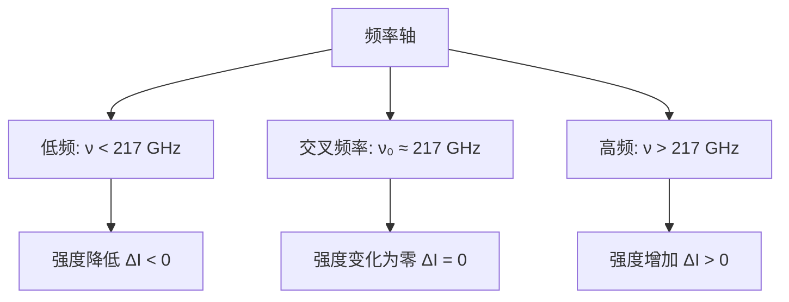

# SZ效应

## 概述

Sunyaev-Zel'dovich效应（简称SZ效应）是宇宙微波背景辐射（CMB）光子与星系团中热电子发生逆康普顿散射导致的频谱畸变现象。这一效应由苏联物理学家Rashid Sunyaev和Yakov Zel'dovich在1970年代首次预言，现已成为研究星系团物理和宇宙学参数的重要工具。

> [!info] 核心概念
> SZ效应描述了CMB光子穿过星系团时与热电子相互作用的过程。通过[[汤姆孙散射]]，光子从电子获得能量，导致CMB频谱发生特征性畸变。

SZ效应的独特之处在于其**与红移无关**的特性，这使得我们能够探测到极高红移的星系团，为研究宇宙早期结构形成提供了重要窗口。结合[[宇宙学观测]]和[[相对论观测]]，SZ效应已成为现代天体物理学中不可或缺的研究手段。

## 一、物理机制

### 1.1 基本过程

SZ效应的物理本质是逆康普顿散射过程。当CMB光子穿过星系团时，会与星系团内温度高达$10^7-10^8$ K的热电子发生相互作用。

具体过程可分为以下几个步骤：

1. **CMB光子进入星系团**：温度为$T_{\text{CMB}} \approx 2.725$ K的CMB光子从宇宙深处传播而来
2. **与热电子发生汤姆孙散射**：星系团内充满温度极高的热等离子体，电子温度$T_e \sim 10^7-10^8$ K
3. **光子获得能量**：由于电子温度远高于光子温度，通过逆康普顿散射，光子从电子获得能量
4. **频谱发生畸变**：光子频率向高频移动，导致CMB频谱偏离黑体谱

> [!note] 汤姆孙散射
> 汤姆孙散射是低能光子与自由电子的弹性散射过程。在SZ效应中，虽然电子是相对论性的，但光子能量仍远小于电子静止能量，因此可以用汤姆孙散射截面描述。

### 1.2 能量转移

在逆康普顿散射过程中，光子能量的变化取决于电子的温度和速度分布。

**电子温度范围**：
$$T_e \sim 10^7 - 10^8 \text{ K}$$

对应的电子热速度为：
$$\frac{v}{c} \sim \sqrt{\frac{kT_e}{m_e c^2}} \sim 0.01 - 0.1$$

**单次散射的能量变化**：
对于非相对论性电子，单次散射中光子能量的相对变化为：
$$\frac{\Delta E}{E} \approx \frac{4kT_e}{m_e c^2}$$

其中：
- $k$是玻尔兹曼常数
- $m_e$是电子质量
- $c$是光速

**多次散射的累积效应**：
如果光子经历$N$次散射，总能量的相对变化为：
$$\frac{\Delta E}{E} \approx N \cdot \frac{4kT_e}{m_e c^2}$$

散射次数$N$由光学深度$\tau$决定：
$$\tau = n_e \sigma_T L$$

其中$n_e$是电子数密度，$\sigma_T$是汤姆孙散射截面，$L$是星系团的特征尺度。

> [!warning] 相对论性修正
> 当电子温度$T_e > 10^8$ K时，电子速度接近光速，需要考虑相对论性修正。此时能量转移公式需要包含高阶项。

### 1.3 频谱特征

SZ效应导致的CMB强度变化具有特征性的频谱依赖关系，这是识别SZ信号的关键特征。

**低频区域**（$\nu < 217$ GHz）：
- CMB强度**降低**
- 表现为"冷斑"
- 温度变化：$\Delta T/T \approx -2y$

**高频区域**（$\nu > 217$ GHz）：
- CMB强度**增加**
- 表现为"热斑"
- 温度变化为正

**交叉频率**：
$$\nu_0 \approx 217 \text{ GHz}$$

在这个频率处，SZ效应导致的强度变化为零，即$\Delta I = 0$。

频谱特征函数$f(x)$的具体形式为：
$$f(x) = \frac{x e^x}{e^x - 1} \left[ x \coth\left(\frac{x}{2}\right) - 4 \right] - 2$$

其中$x = \frac{h\nu}{kT_{\text{CMB}}}$是无量纲频率参数。

> [!tip] 观测意义
> 频谱特征是区分SZ效应和其他天体物理信号（如射电源、尘埃辐射）的关键。通过多频率观测，可以有效分离SZ信号。

## 二、热SZ效应

### 2.1 Kompaneets方程

Kompaneets方程是描述光子分布函数在热电子气体中演化的基本方程，由A.S. Kompaneets在1957年推导。

**光子分布函数的演化**：
$$\frac{\partial n}{\partial t} = \frac{kT_e}{m_e c^2} \frac{n_e \sigma_T c}{\nu^2} \frac{\partial}{\partial \nu} \left[ \nu^4 \left( n + \nu^3 \frac{\partial n}{\partial \nu} \right) \right]$$

其中$n(\nu, t)$是光子数密度分布函数。

**无量纲形式**：
引入无量纲变量$x = \frac{h\nu}{kT_{\text{CMB}}}$和$y = \int \frac{kT_e}{m_e c^2} n_e \sigma_T c \, dt$，方程简化为：
$$\frac{\partial n}{\partial y} = \frac{1}{x^2} \frac{\partial}{\partial x} \left[ x^4 \left( \frac{\partial n}{\partial x} + n + n^2 \right) \right]$$

**物理意义**：
- 右边第一项：自发辐射和受激辐射
- 右边第二项：康普顿散射导致的频率扩散
- 右边第三项：受激散射项

> [!important] 近似条件
> Kompaneets方程的推导基于以下假设：
> 1. 非相对论性电子：$kT_e \ll m_e c^2$
> 2. 光子能量远小于电子能量：$h\nu \ll m_e c^2$
> 3. 各向同性分布
> 4. 单次散射能量变化小：$\Delta \nu / \nu \ll 1$

### 2.2 y参数

康普顿$y$参数是描述SZ效应强度的关键物理量，定义为：

$$y = \int \frac{kT_e}{m_e c^2} n_e \sigma_T \, dl$$

**物理含义**：
- $y$参数表示光子穿过星系团时获得的平均能量分数
- 积分沿视线方向进行
- 无量纲参数

**典型值**：
对于典型的星系团：
- 电子温度：$T_e \sim 5 \times 10^7$ K
- 电子密度：$n_e \sim 10^{-3}$ cm$^{-3}$
- 星系团尺度：$L \sim 1$ Mpc

计算得到：
$$y \sim 10^{-4}$$

**y参数的分布**：
在星系团内部，$y$参数通常呈现以下分布特征：
- 中心区域：$y$值最大，可达$10^{-4}$
- 向外逐渐减小
- 在$r \sim r_{500}$处降至$10^{-5}$量级

> [!note] y参数与红移
> 由于$y$参数是沿视线方向的积分量，不依赖于光子的初始频率，因此SZ效应本身与红移无关。这使得SZ效应能够探测高红移星系团。

### 2.3 强度变化

SZ效应导致的CMB强度变化可以表示为：

$$\frac{\Delta I}{I} = y \cdot f(x)$$

其中$f(x)$是频谱形状函数：

$$f(x) = \frac{x e^x}{e^x - 1} \left[ x \coth\left(\frac{x}{2}\right) - 4 \right] - 2$$

**低频近似**（$x \ll 1$，即$h\nu \ll kT_{\text{CMB}}$）：
$$f(x) \approx -2$$

因此：
$$\frac{\Delta T}{T} \approx -2y$$

**高频近似**（$x \gg 1$）：
$$f(x) \approx x - 4$$

此时强度变化为正。

**完整频谱曲线**：
通过数值计算可以得到完整的$f(x)$曲线，其特征包括：
- 在$x \approx 3.92$（对应$\nu \approx 217$ GHz）处$f(x) = 0$
- 最小值出现在$x \approx 1.6$处
- 高频端单调上升

### 2.4 观测特征

**温度变化**：
在低频观测中（如30 GHz），SZ效应表现为CMB温度的降低：
$$\frac{\Delta T}{T} \approx -2y \sim -2 \times 10^{-4}$$

对应的绝对温度变化：
$$\Delta T \sim -0.5 \text{ mK}$$

**与红移无关**：
这是SZ效应最重要的特性之一。由于$y$参数是沿视线方向的积分量，不依赖于CMB光子的初始频率，因此：
- 低红移星系团和高红移星系团的SZ信号强度相同（假设$y$参数相同）
- 可以探测到$z > 1$的星系团
- 为研究宇宙早期结构形成提供了独特窗口

**角直径分布**：
SZ信号的角直径取决于星系团的物理大小和距离：
- 近邻星系团：角直径较大（$\sim 10'$-$30'$）
- 高红移星系团：角直径较小（$\sim 1'$-$5'$）

> [!warning] 观测挑战
> 虽然SZ效应与红移无关，但高红移星系团的角直径小，需要高角分辨率的观测设备。此外，高红移星系团的$y$参数可能较小，增加了探测难度。

## 三、运动学SZ效应

### 3.1 物理机制

运动学SZ效应（kinematic SZ effect, kSZ）是由星系团整体运动引起的CMB频谱畸变。

**物理图像**：
- 星系团相对于CMB静止参考系具有本动速度$v$
- 由于多普勒效应，散射光子的频率发生变化
- 导致CMB温度的额外变化

**与热SZ的区别**：
- 热SZ：由电子的热运动引起，与温度相关
- 运动学SZ：由星系团的整体运动引起，与速度相关

### 3.2 数学描述

运动学SZ效应导致的温度变化为：

$$\frac{\Delta T}{T} = -\tau \frac{v_r}{c}$$

其中：
- $\tau = \int n_e \sigma_T \, dl$是汤姆孙光学深度
- $v_r$是星系团沿视线方向的径向速度
- $c$是光速

**符号约定**：
- $v_r > 0$：星系团远离观测者（红移方向）
- $v_r < 0$：星系团朝向观测者运动（蓝移方向）

**与热SZ的比较**：
- 热SZ：$\Delta T/T \sim -2y \sim -2 \times 10^{-4}$
- 运动学SZ：$\Delta T/T \sim -\tau(v_r/c) \sim -10^{-5} \times 10^{-3} \sim -10^{-6}$

运动学SZ信号比热SZ信号小约两个数量级。

**频谱特征**：
运动学SZ效应的频谱形状与CMB黑体谱相同，即：
$$\frac{\Delta I}{I} \propto \frac{\partial B_\nu(T)}{\partial T}$$

这与热SZ效应的频谱形状不同，是区分两者的关键。

### 3.3 观测难度

运动学SZ效应的观测面临多重挑战：

**信号微弱**：
- 幅度仅为热SZ的1%左右
- 需要极高的灵敏度和精度

**与热SZ的分离**：
- 两者频谱形状不同，但需要宽频率覆盖
- 需要精确的仪器校准

**前景污染**：
- 银河系前景辐射
- 射电源和尘埃源
- 其他星系团的SZ信号

**观测策略**：
为探测运动学SZ效应，通常采用以下策略：
1. **多频率观测**：覆盖90-300 GHz范围
2. **高灵敏度**：达到$\mu$K级别的灵敏度
3. **大样本统计**：通过叠加多个星系团提高信噪比
4. **精确的前景去除**：使用多组件分离技术

> [!tip] 最新进展
> 近年来，通过叠加数百个星系团的观测数据，已经实现了对运动学SZ效应的统计探测。这为研究星系团速度场和大尺度结构提供了新的工具。

## 四、SZ效应的观测

### 4.1 首次探测

**理论预言**：
- 1969年：Sunyaev和Zel'dovich首次提出SZ效应的理论
- 1970年代：详细计算了SZ效应的频谱特征和幅度
- 预言了热SZ和运动学SZ两种成分

**首次观测**：
- 1978年：Gull和Northover在36 GHz观测到Coma星系团的SZ信号
- 1980年代：多个团队确认了SZ效应的存在
- 1990年代：开始系统性观测星系团样本

**早期挑战**：
- 仪器灵敏度不足
- 角分辨率有限
- 前景去除困难
- 需要长时间的积分观测

### 4.2 主要观测设备

**空间观测**：

*Planck卫星*（2009-2013）：
- 欧洲空间局（ESA）发射
- 频率覆盖：30-857 GHz（9个频段）
- 角分辨率：5'-33'（取决于频率）
- 探测到约1000个星系团的SZ信号
- 发布了全天的SZ星系团目录

**地面观测**：

*ACT（Atacama Cosmology Telescope）*：
- 位于智利阿塔卡马沙漠
- 频率：148 GHz和218 GHz
- 角分辨率：1.4'和1.0'
- 已探测到数百个星系团
- 持续观测中

*SPT（South Pole Telescope）*：
- 位于南极
- 频率：95、150、220 GHz
- 角分辨率：1.0'-1.7'
- 已完成多次巡天
- 探测到大量星系团

*ALMA（Atacama Large Millimeter/submillimeter Array）*：
- 干涉阵列，最高角分辨率可达0.01'
- 用于详细研究单个星系团的SZ效应
- 可分辨星系团内部结构

**未来设备**：
- CMB-S4：下一代地面CMB观测项目
- Simons Observatory：正在建设中的CMB望远镜
- LiteBIRD：计划中的空间CMB观测卫星

### 4.3 SZ星系团目录

**Planck SZ目录**：
- 第一版（2011年）：189个星系团
- 第二版（2013年）：853个星系团
- 最终版（2016年）：1213个星系团
- 红移范围：$0.01 < z < 0.9$
- 是目前最大的SZ星系团目录

**SPT星系团目录**：
- SPT-SZ样本：377个星系团
- 覆盖面积：2500平方度
- 深度达到$z \sim 1.5$

**ACT星系团目录**：
- ACTPol样本：数百个星系团
- 多个天区覆盖
- 与光学和X射线巡天交叉认证

**目录特点**：
- SZ探测对星系团质量敏感
- 倾向于探测质量大、温度高的星系团
- 与X射线选择样本互补
- 为宇宙学研究提供重要样本

## 五、宇宙学应用

### 5.1 哈勃常数测量

SZ效应结合X射线观测可以提供独立的距离测量，从而测定哈勃常数$H_0$。

**基本原理**：
- SZ效应测量$y$参数：$y \propto \int n_e T_e \, dl$
- X射线观测测量表面亮度：$S_X \propto \int n_e^2 \Lambda(T_e) \, dl$
- 结合两者可以解出星系团的物理尺寸
- 结合角直径得到角直径距离$D_A$

**距离-红移关系**：
通过测量不同红移处的角直径距离，可以约束宇宙学参数：
$$D_A(z) = \frac{c}{1+z} \int_0^z \frac{dz'}{H(z')}$$

**H_0的测量**：
- 利用低红移星系团的SZ-X射线分析
- 独立测定$H_0$，不依赖距离阶梯
- 当前结果：$H_0 \sim 67-73$ km/s/Mpc

**张力问题**：
- SZ-X射线测量倾向于较低的$H_0$值
- 与局部宇宙距离阶梯测量存在张力
- 可能暗示新物理或系统误差

> [!warning] 系统误差
> SZ-X射线测量$H_0$面临的主要系统误差包括：
> - 星系团气体分布的假设
> - 非热压力贡献
> - 团簇外介质的影响
> - X射线校准的不确定性

### 5.2 星系团质量函数

SZ效应是探测星系团质量函数的有力工具。

**质量-可观测关系**：
- SZ信号$Y$与星系团质量$M$相关：$Y \propto M^{5/3}$（自相似模型）
- 存在内禀散射：$\sigma_{\ln Y|M} \sim 0.2-0.3$
- 需要校准质量-可观测关系

**质量函数测量**：
星系团质量函数$n(M, z)$描述单位体积内质量在$M$到$M+dM$之间的星系团数目。

通过SZ巡天测量质量函数，可以约束：
- $\sigma_8$：物质密度涨落的幅度
- $\Omega_m$：物质密度参数

**宇宙学约束**：
- Planck SZ数据：$\sigma_8 \sim 0.75-0.80$，$\Omega_m \sim 0.28-0.32$
- 与CMB各向异性测量一致
- 提供独立的宇宙学约束

**与光学巡天的比较**：
- SZ探测对质量更敏感
- 不受投影效应影响
- 与红移关系弱，选择函数简单
- 与光学巡天互补

### 5.3 大尺度结构

SZ效应的功率谱包含大尺度结构的信息。

**SZ功率谱**：
SZ效应的角功率谱$C_\ell$描述SZ信号在不同角尺度上的涨落。

$$C_\ell^{SZ} = \int \frac{dz}{H(z)} \frac{W^2(z)}{D_A^2(z)} P_{yy}\left(k=\frac{\ell}{D_A}, z\right)$$

其中$P_{yy}$是$y$参数场的三维功率谱。

**功率谱特征**：
- 在$\ell \sim 3000$处达到峰值
- 幅度对$\sigma_8$敏感：$C_\ell \propto \sigma_8^7-8$
- 对$\Omega_m$也有较强依赖

**宇宙学参数约束**：
通过测量SZ功率谱，可以约束：
- $\sigma_8$：最敏感的参数
- $\Omega_m$：物质密度
- $n_s$：原初功率谱指数
- $w$：暗能量状态方程

**与其他探针的结合**：
- 与CMB初级各向异性结合
- 与重子声学振荡（BAO）结合
- 与弱引力透镜结合
- 打破参数简并

### 5.4 星系团物理

SZ效应为研究星系团内部物理提供了重要信息。

**电子温度分布**：
- 通过多频率SZ观测可以测量电子温度
- 温度分布反映星系团的热状态
- 可以探测温度不均匀性和湍流

**气体质量分数**：
- SZ信号与气体质量相关
- 结合总质量测量得到气体质量分数$f_{\text{gas}}$
- 典型值：$f_{\text{gas}} \sim 0.1-0.15$
- 与宇宙重子密度一致

**非热压力**：
- 星系团内可能存在湍流、磁场、宇宙线等非热成分
- 非热压力影响SZ信号的解释
- 需要结合X射线和引力透镜观测约束

**合并星系团**：
- 合并过程中电子温度分布不均匀
- SZ信号呈现复杂的空间结构
- 可以研究星系团动力学和能量注入

**冷却流问题**：
- 星系团中心可能存在冷却流
- SZ效应可以探测中心区域的温度结构
- 结合X射线观测研究反馈机制

## 六、SZ效应的扩展

### 6.1 运动学SZ效应的应用

尽管运动学SZ效应观测困难，但它提供了独特的物理信息。

**星系团速度场**：
- 运动学SZ直接测量星系团的径向速度
- 可以重建大尺度速度场
- 测试结构形成理论

**大尺度流动**：
- 探测超大尺度上的物质流动
- 检验宇宙学原理
- 寻找异常流动（dark flow）

**成团性研究**：
- 通过运动学SZ研究星系团的成团性
- 约束大尺度结构的形成
- 与数值模拟比较

**统计探测方法**：
由于单个星系团的运动学SZ信号微弱，通常采用统计方法：
- 叠加多个星系团的观测
- 利用功率谱分析
- 与星系巡天交叉相关

### 6.2 相对论性修正

对于高温星系团，需要考虑相对论性效应对SZ信号的修正。

**高温修正**：
当$kT_e \gtrsim 10$ keV时，非相对论性近似不再适用。

相对论性修正包括：
- 电子速度分布的相对论性修正
- 散射截面的相对论性修正
- 高阶康普顿散射项

**修正幅度**：
- 对于$T_e \sim 10$ keV的星系团，修正幅度约5-10%
- 对于$T_e \sim 20$ keV，修正可达20%以上
- 影响$y$参数的测量精度

**频谱形状变化**：
相对论性修正改变了SZ效应的频谱形状：
- 交叉频率向高频移动
- 频谱曲线的不对称性增加
- 需要更精确的频谱模型

**高精度观测需求**：
- 未来观测要求精度达到1%级别
- 必须考虑相对论性修正
- 需要发展更精确的理论模型

### 6.3 团簇外介质

SZ效应不仅限于星系团内部，还可以探测团簇外介质。

**温-热介质**：
- 星系团周围存在温度较低的温介质（$T \sim 10^5-10^7$ K）
- 这些介质的SZ信号较弱但空间延伸
- 可以研究星系团的外围结构

**宇宙重子普查**：
- 宇宙中大量重子存在于星系团外的温热介质中
- 通过SZ效应可以探测这些"失踪的重子"
- 解决宇宙重子预算问题

**纤维结构**：
- 大尺度结构的纤维中存在温热气体
- SZ效应可以探测纤维结构的信号
- 研究宇宙网的结构

**观测挑战**：
- 信号微弱：$y \sim 10^{-6}-10^{-7}$
- 空间延伸：需要大视场观测
- 前景污染严重
- 需要高灵敏度和精确的前景去除

**最新进展**：
- 通过叠加技术探测到星系团外围的SZ信号
- 发现星系团外的气体质量占总气体的30-50%
- 为宇宙重子普查提供了重要约束

## 延伸阅读

- [[汤姆孙散射]]：SZ效应的微观物理基础
- [[宇宙学观测]]：SZ效应在宇宙学研究中的应用
- [[相对论观测]]：相对论性效应对SZ信号的影响
- [[宇宙微波背景辐射]]：SZ效应的背景光源
- [[星系团物理]]：SZ效应的天体物理应用
- [[逆康普顿散射]]：SZ效应的物理机制
- [[Kompaneets方程]]：SZ效应的理论框架

## 参考文献

1. Sunyaev, R. A., & Zel'dovich, Y. B. (1970). Small-scale fluctuations in relic radiation. *Astrophysics and Space Science*, 7(2), 20-25.
2. Kompaneets, A. S. (1957). The establishment of thermal equilibrium between quanta and electrons. *Soviet Journal of Experimental and Theoretical Physics*, 4(5), 730-735.
3. Planck Collaboration. (2016). Planck 2015 results. XXII. The Sunyaev-Zeldovich catalogue. *Astronomy & Astrophysics*, 594, A22.
4. Carlstrom, J. E., Holder, G. P., & Reese, E. D. (2002). Galaxy clusters and the Sunyaev-Zeldovich effect. *Annual Review of Astronomy and Astrophysics*, 40, 643-680.
5. Mroczkowski, T., et al. (2019). Understanding the baryonic content of galaxy clusters through the Sunyaev-Zeldovich effect. *Space Science Reviews*, 215, 17.

%%
SZ效应是研究星系团和宇宙学的重要工具
与红移无关的特性使其能探测高红移星系团
SZ效应的多频段观测特征使其成为CMB研究中的关键课题
未来更高精度的观测将进一步拓展SZ效应的应用范围
%%
