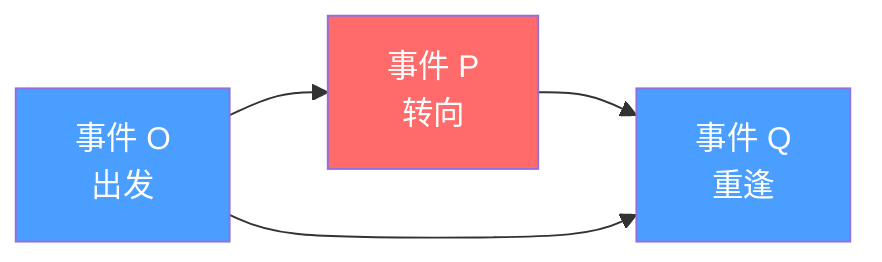
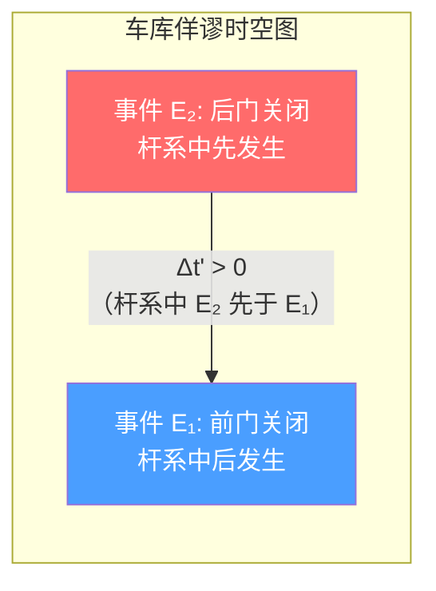

# 佯谬分析

> [!abstract] 核心主题
> 相对论中的"佯谬"是表面上的逻辑矛盾，实质上源于对相对论概念的误用或直觉的偏差。每一个佯谬都可以通过严格的[[闵氏几何]]分析得到完全解决。==佯谬不是理论的缺陷，而是理解深化的阶梯。==

## 概述

狭义相对论自 1905 年提出以来，因其反直觉的结论——时间膨胀、长度收缩、同时性的相对性——引发了大量所谓的"佯谬"。这些佯谬的共同特征是：

1. **表面矛盾**：从日常经验出发，似乎存在逻辑上的自相矛盾
2. **误解根源**：通常源于将牛顿力学的直觉（绝对时间、绝对空间、理想刚体）错误地移植到相对论框架中
3. **严格可解**：每一个佯谬都可以通过[[相对论推导|洛伦兹变换]]和[[闵氏几何|闵可夫斯基时空几何]]得到完全、自洽的解答

> [!tip] 方法论
> 分析任何佯谬的标准流程：
> 1. 精确定义所有相关**事件**（时空点）
> 2. 明确各参考系中的坐标
> 3. 使用洛伦兹变换严格转换
> 4. 在[[闵氏几何|闵氏时空图]]中可视化世界线和同时线
> 5. 检验因果律是否被违反

本笔记将系统分析相对论中最著名、最有教学价值的佯谬，揭示它们背后的共同主题。

---

## 一、双生子佯谬（Twin Paradox）

### 1.1 问题陈述

> [!question] 双生子佯谬
> 双胞胎 A 留在地球，B 乘飞船以 $v = 0.8c$ 前往 $4$ 光年外的恒星并立即返回。
> - 在 A 看来：B 在运动，B 的时钟变慢，B 应该更年轻
> - 在 B 看来：A 也在运动，A 的时钟变慢，A 应该更年轻
>
> 两人重逢时，==谁更年轻？这是否构成矛盾？==

这是相对论中最著名的佯谬，自 1911 年朗之万（Paul Langevin）首次提出以来，引发了无数讨论。

### 1.2 常见误解

> [!warning] 误解一："相对论说运动是相对的，所以双方都应该认为对方更年轻"
> 这个推理的错误在于忽略了**对称性的破缺**。A 始终处于惯性系（近似），而 B 必须经历加速、减速、转向、再加速的过程。B 的世界线不是直线，两者的物理处境**不对称**。

> [!warning] 误解二："加速阶段导致 B 更年轻"
> 虽然 B 确实经历了加速，但加速本身并不是"年轻化"的根本原因。即使完全消除加速阶段（如三兄弟佯谬），结论不变。真正的原因是==世界线的几何结构不同==——详见 [[闵氏几何#世界线与固有时]]。

### 1.3 正确分析

#### 闵氏几何的世界线分析

在闵氏时空中，固有时由世界线的长度给出：

$$
\tau = \int \sqrt{1 - \frac{v^2(t)}{c^2}} \, dt
$$

根据[[闵氏几何#世界线与固有时|闵可夫斯基的"最长固有时"原理]]，连接两个事件的==直线世界线（惯性运动）具有最长的固有时==。A 的世界线是直线，B 的世界线是折线，因此 A 的固有时更长——A 更老。

> [!note] 几何类比
> 在欧氏几何中，两点之间直线最短。在闵氏时空中，由于度规号差为 $(+,-,-,-)$，==两点之间直线世界线的固有时最长==。这类似于"三角形不等式"的反转。

### 1.4 数学推导

#### 具体数值计算

设 B 以 $v = 0.8c$（$\gamma = 5/3$）运动，往返各 $4$ 光年。

**A 的参考系（地球）**：

- 单程距离：$L_0 = 4$ 光年
- 单程时间：$t_1 = L_0 / v = 4 / 0.8 = 5$ 年
- 往返总时间：$T_A = 2 \times 5 = 10$ 年
- A 的固有时：$\tau_A = 10$ 年

**B 的固有时**：

$$
\tau_B = \int_0^{T_A} \sqrt{1 - \frac{v^2}{c^2}} \, dt = T_A \sqrt{1 - 0.64} = 10 \times 0.6 = 6 \text{ 年}
$$

> [!success] 结论
> B 返回时比 A 年轻 $10 - 6 = 4$ 岁。这一结果在所有参考系中一致。

#### 世界线积分的严格计算

在 $(ct, x)$ 时空中，设 A 的世界线为 $x_A = 0$，B 的世界线分两段：

- 去程（$0 \leq t \leq 5$）：$x_B = 0.8ct$
- 返程（$5 < t \leq 10$）：$x_B = 0.8c \times 5 - 0.8c(t - 5) = 4c - 0.8ct = 0.8c(10 - t)$

A 的固有时：

$$
\tau_A = \int_0^{10} \sqrt{1 - 0} \, dt = 10 \text{ 年}
$$

B 的固有时：

$$
\tau_B = \int_0^{5} \sqrt{1 - 0.64} \, dt + \int_5^{10} \sqrt{1 - 0.64} \, dt = 5 \times 0.6 + 5 \times 0.6 = 6 \text{ 年}
$$

#### 从 B 的视角分析

B 在去程中处于惯性系 $S'$（以 $0.8c$ 远离地球）。在 $S'$ 中，由于长度收缩，地球到恒星的距离为：

$$
L = \frac{L_0}{\gamma} = \frac{4}{5/3} = 2.4 \text{ 光年}
$$

去程时间（B 的固有时）：$t_{\text{去}} = L / v = 2.4 / 0.8 = 3$ 年

同理，返程时间也是 $3$ 年。总计 $\tau_B = 6$ 年，与上面的计算一致。

> [!tip] 关键洞察
> 在 B 的参考系中，地球到恒星的距离发生了==长度收缩==（见 [[钟慢尺缩与质增#长度收缩（尺缩效应）]]），因此 B 的旅程更短，耗时更少。两个参考系的分析殊途同归。

### 1.5 加速阶段的影响

> [!note] 加速阶段的贡献
> 实际旅行中，飞船需要加速和减速。设飞船以恒定固有加速度 $a$ 加速（见 [[闵氏几何#加速运动的世界线]]），世界线为双曲运动：
>
> $$
> x^2 - c^2 t^2 = \left(\frac{c^2}{a}\right)^2
> $$
>
> 匀加速阶段的固有时为：
>
> $$
> \tau = \frac{c}{a} \operatorname{arcsinh}\left(\frac{at}{c}\right)
> $$

**关键结论**：加速阶段对固有时的贡献是有限的，且总是使固有时更短。无论加速阶段多长多短，==只要 B 的世界线是折线（或曲线），其固有时就短于 A 的直线世界线==。

> [!success] 三兄弟佯谬的启示
> 如 [[钟慢尺缩与质增#三兄弟佯谬]] 所述，用三个惯性观察者（A 留在地球，B 飞出，C 飞入）替代一个往返旅行者，完全消除加速阶段，结论不变：折线世界线的固有时短于直线世界线。这证明==双生子佯谬的本质不在于加速度，而在于世界线的几何==。

> [!info] 时空图说明
> 上图示意了双生子佯谬的时空结构。O→P→Q 是 B 的折线世界线，O→Q 是 A 的直线世界线。在闵氏几何中，直线 OQ 的固有时最长。

### 1.6 实验验证

> [!success] Hafele-Keating 实验（1971）
> 将铯原子钟放在商用飞机上环球飞行，结果与相对论预言一致。东向飞行的钟比地面钟慢，西向飞行的钟比地面钟快——这与双生子佯谬的物理本质完全相同：不同世界线的固有时不同。详见 [[相对论观测#Hafele-Keating 实验 (1971)]]。

> [!success] 粒子加速器验证
> 在 CERN 的 $\mu$ 子存储环实验中，$\mu$ 子以 $\gamma \approx 29.3$ 运动，实测寿命与 $\gamma \tau_0$ 精确吻合。$\mu$ 子沿环形轨道运动（持续加速），其固有时确实短于实验室系的坐标时。

---

## 二、贝尔飞船佯谬（Bell's Spaceship Paradox）

### 2.1 问题陈述

> [!question] 贝尔飞船佯谬
> 两艘飞船 A（前方）和 B（后方），初始时静止在惯性系 $S$ 中，相距 $L$。两船之间用一根柔软的绳子连接。在 $S$ 系中，两艘飞船**同时**开始以**相同的**固有加速度 $a$ 加速。问：==绳子会断吗？==

这个问题由 John Bell（北爱尔兰物理学家，贝尔不等式的提出者）在 1976 年提出，用于检验对长度收缩的物理实在性的理解。

### 2.2 常见误解

> [!warning] 误解："两艘飞船运动状态相同，距离不变，绳子不会断"
> 直觉上，两艘飞船在 $S$ 系中以完全相同的方式加速，它们之间的距离始终保持为 $L$。既然距离不变，绳子不应该被拉伸，因此不会断。
>
> 这个推理的错误在于：==它混淆了 $S$ 系中的坐标距离和飞船共动参考系中的固有距离==。

### 2.3 正确分析

#### 在 $S$ 系中的分析

在 $S$ 系中，两艘飞船的世界线是相同的双曲线，只是空间平移了 $L$：

$$
x_A(t) = \frac{c^2}{a}\left(\sqrt{1 + \left(\frac{at}{c}\right)^2} - 1\right) + L
$$

$$
x_B(t) = \frac{c^2}{a}\left(\sqrt{1 + \left(\frac{at}{c}\right)^2} - 1\right)
$$

在 $S$ 系的任意时刻 $t$，两飞船的坐标距离确实为 $x_A(t) - x_B(t) = L$。

#### 在飞船的瞬时共动参考系中的分析

关键洞察：在飞船的==瞬时静止参考系（momentarily comoving reference frame, MCRF）==中，两飞船的距离在不断增加。

原因如下：根据[[相对论观测#同时性的相对性|同时性的相对性]]，在 $S$ 系中"同时"开始加速的两艘飞船，在飞船的瞬时共动参考系中并不同时开始加速。==前方飞船 A 比后方飞船 B 更早开始加速==（在共动参考系中），因此 A 领先得越来越多。

> [!tip] 定量结果
> 在飞船的瞬时共动参考系中，两飞船的固有距离为：
>
> $$
> L'(\tau) = \gamma(\tau) \cdot L
> $$
>
> 其中 $\gamma(\tau) = \sqrt{1 + (a\tau/c)^2}$。随着速度增加，$\gamma$ 增大，固有距离不断增加。

### 2.4 数学推导

#### 使用 Rindler 坐标分析

引入 Rindler 坐标（见 [[闵氏几何#加速运动的世界线|闵氏几何：Rindler 坐标]]）：

$$
ct = \xi \sinh\eta, \quad x = \xi \cosh\eta
$$

其中 $\xi = c^2/a$ 标记不同的加速观察者，$\eta = a\tau/c$ 是时间坐标。

在此坐标下，匀加速观察者的世界线为 $\xi = \text{const}$ 的曲线。两艘飞船分别位于 $\xi_A$ 和 $\xi_B$，其中 $\xi_A - \xi_B$ 对应于初始距离 $L$。

在 Rindler 坐标系中，空间度规为：

$$
dl^2 = d\xi^2
$$

但关键问题在于：两艘飞船的"同时"定义与 $S$ 系不同。在 Rindler 坐标系中（即飞船的共动参考系中），两飞船的固有距离为：

$$
L' = \int_{\xi_B}^{\xi_A} d\xi = \xi_A - \xi_B
$$

由 $S$ 系到 Rindler 坐标的变换关系，可以证明：

$$
\xi_A - \xi_B = \gamma(\tau) \cdot L > L
$$

> [!note] 详细推导
> 飞船 B 的世界线满足 $x_B^2 - c^2 t^2 = (c^2/a)^2$，对应 $\xi_B = c^2/a$。
>
> 飞船 A 的世界线满足 $(x_B + L)^2 - c^2 t^2 = (c^2/a + L)^2$（在 $S$ 系中距离保持 $L$），对应 $\xi_A = c^2/a + L$。
>
> 在 Rindler 参考系中，固有距离为 $\xi_A - \xi_B = L$——但这**不是**两飞船之间的固有距离！
>
> 实际上，由于 Rindler 度规的时间分量 $g_{\eta\eta} = \xi^2$ 依赖于位置，固有距离的正确计算需要考虑同时面的定义。在 Rindler 同时面 $\eta = \text{const}$ 上，固有距离确实为 $L$。但这一"距离"并不对应绳子感受到的拉伸。
>
> 正确的分析是：绳子的固有长度（由绳子材料决定）在加速过程中保持不变（假设绳子不被拉伸），但两飞船之间的固有距离在增加。当固有距离超过绳子的固有长度时，绳子断裂。

#### 绳子断裂的条件

设绳子的固有长度（未拉伸时的自然长度）为 $L_0 = L$。当飞船速度达到 $v$ 时，在飞船的共动参考系中，两飞船的固有距离为 $\gamma L$。绳子需要伸长到 $\gamma L$ 才能保持连接，而其自然长度仅为 $L$。

当 $\gamma L > L_{\text{break}}$（绳子的断裂长度）时，绳子断裂。对于任何有限强度的绳子，==只要加速时间足够长，$\gamma$ 足够大，绳子必然断裂==。

### 2.5 物理意义

> [!important] 贝尔飞船佯谬的深层启示
>
> 1. **长度收缩具有物理实在性**：长度收缩不仅是"测量效应"，它对应着真实的物理应力。如果试图阻止物体收缩（如本例中强制保持坐标距离不变），就会产生内部应力。
>
> 2. **不存在理想刚体**：在相对论中，任何力的传递速度不超过光速，因此不存在绝对刚体。这一结论与日常经验截然不同，但却是相对论力学的基本要求。
>
> 3. **同时性的相对性的直接后果**：绳子断裂的根本原因是，在飞船的共动参考系中，两艘飞船并不同步——前方的飞船"跑得更远"。

> [!tip] 与 Ehrenfest 佯谬的联系
> 贝尔飞船佯谬与下一节的 Ehrenfest 佯谬（旋转圆盘佯谬）有深刻的联系：两者都涉及==加速运动中长度收缩的物理效应==，都揭示了"刚性"概念在相对论中的失效。

---

## 三、车库佯谬（Barn-Pole Paradox）

### 3.1 问题陈述

> [!question] 车库佯谬
> 一根固有长度 $L_0 = 10$ 米的杆以 $v = 0.866c$（$\gamma = 2$）飞向一个固有长度 $D = 8$ 米的车库。
>
> - **车库参考系**：杆缩短为 $L = L_0/\gamma = 10/2 = 5$ 米。$5 < 8$，杆可以完全放入车库，前后门可以同时关闭。
> - **杆参考系**：车库缩短为 $D' = D/\gamma = 8/2 = 4$ 米。$10 > 4$，杆远长于车库，==怎么可能被关进去？==

### 3.2 常见误解

> [!warning] 误解："杆不可能同时被关在车库里，这证明长度收缩是矛盾的"
> 这个误解的根源在于假设"同时关门"在所有参考系中都成立。实际上，==同时性是相对的==——这正是[[相对论观测#同时性的相对性|同时性的相对性]]的核心内容。

### 3.3 正确分析

#### 车库参考系的分析

在车库系 $S$ 中：
- 杆长 $L = 5$ 米，车库深 $D = 8$ 米
- 杆完全进入车库后，在 $t = t_0$ 时刻，前后门**同时**关闭
- 事件 1（前门关闭）：$(t_0, x_1 = 0)$
- 事件 2（后门关闭）：$(t_0, x_2 = 8)$

两事件在 $S$ 系中同时：$\Delta t = 0$，空间距离 $\Delta x = 8$ 米。

#### 杆参考系的分析

在杆系 $S'$ 中，使用洛伦兹变换：

$$
\Delta t' = \gamma\left(\Delta t - \frac{v \Delta x}{c^2}\right) = 2\left(0 - \frac{0.866c \times 8}{c^2}\right) = -2 \times \frac{6.928}{c}
$$

取 $c = 1$（自然单位），$\Delta t' = -13.856 / c \approx -13.86/c$ 米（时间单位）。

> [!success] 解答：同时性的相对性
> 在杆的参考系中，前后门的关闭==不是同时的==：
> 1. **后门先关闭**（杆的前端刚到达后门时）——后门随即打开让杆通过
> 2. **前门后关闭**（杆的后端刚进入前门时）
>
> 在杆的参考系中，不存在"杆整体被关在车库内"的时刻。两个门的关闭有先后顺序，杆的前端已经从后门出去了，后门才关闭；然后前门才关闭。

### 3.4 数学推导

#### 洛伦兹变换的严格计算

设车库系 $S$ 中，车库前门在 $x = 0$，后门在 $x = 8$ 米。杆以 $v = 0.866c$ 沿 $+x$ 方向运动。

**事件 E₁**（后门关闭）：杆前端到达后门
$$
E_1: (t_1, x_1) = (8/v, 8) = (8/0.866c, 8)
$$

**事件 E₂**（前门关闭）：杆后端进入前门
$$
E_2: (t_2, x_2) = (8/v + (10-8)/v, 0) \quad \text{——不对，需要重新计算}
$$

更准确地，设杆后端在 $t = 0$ 时位于 $x = -10/\gamma = -5$ 米（杆已部分进入车库）。

让我重新设定：在车库系中，杆在 $t$ 时刻的前端位置为 $x_F = vt$，后端位置为 $x_B = vt - 5$（杆缩短为 $5$ 米）。

- 杆前端到达后门（$x = 8$）：$vt_1 = 8 \Rightarrow t_1 = 8/v$
- 杆后端进入前门（$x = 0$）：$vt_2 - 5 = 0 \Rightarrow t_2 = 5/v$

由于 $v = 0.866c$：
- $t_1 = 8/(0.866c) \approx 9.24/c$
- $t_2 = 5/(0.866c) \approx 5.77/c$

在车库系中，如果选择 $t_0 = t_2 = 5.77/c$ 时刻同时关闭两门：
- 此时杆后端恰好在 $x = 0$（前门处）
- 杆前端在 $x = 5$ 米处，尚未到达后门（$x = 8$）
- 杆完全在车库内！

**在杆系 $S'$ 中**，使用洛伦兹变换计算这两个事件：

事件 E₁（前门关闭，杆后端到达前门）：$(t_2, x = 0)$

$$
t_1' = \gamma\left(t_2 - \frac{v \cdot 0}{c^2}\right) = \gamma t_2 = 2 \times 5.77/c = 11.54/c
$$

$$
x_1' = \gamma(0 - v t_2) = -\gamma v t_2 = -2 \times 0.866c \times 5.77/c = -9.99 \approx -10 \text{ 米}
$$

事件 E₂（后门关闭，同时刻 $t_0 = t_2$，位置 $x = 8$）：

$$
t_2' = \gamma\left(t_2 - \frac{v \times 8}{c^2}\right) = 2(5.77/c - 0.866 \times 8/c) = 2(5.77 - 6.928)/c = -2.316/c
$$

$$
x_2' = \gamma(8 - v t_2) = 2(8 - 0.866 \times 5.77) = 2(8 - 5) = 6 \text{ 米}
$$

> [!note] 结果分析
> 在杆的参考系中：
> - 后门关闭（E₂）发生在 $t' = -2.316/c$，位置 $x' = 6$ 米
> - 前门关闭（E₁）发生在 $t' = 11.54/c$，位置 $x' = -10$ 米
>
> ==后门先关闭，前门后关闭==，时间差为 $\Delta t' = 11.54/c - (-2.316/c) = 13.86/c$。
>
> 在杆的参考系中，杆的固有长度为 $10$ 米，车库缩短为 $4$ 米。后门先关闭时，杆的前端还在车库外；等前门关闭时，杆的后端才刚进入前门。杆从未被"同时关在车库里"。

### 3.5 时空图分析

> [!tip] 时空图的关键特征
> 在闵氏时空图中：
> - 车库的世界线是两条竖直平行线（$x = 0$ 和 $x = 8$）
> - 杆的世界线是两条倾斜平行线（斜率 $1/v$），间距为 $5$ 米（车库系中的收缩长度）
> - 车库系的==同时线是水平的==，可以同时截取杆的两端
> - 杆系的==同时线是倾斜的==，无法同时截取杆的两端在车库内
>
> 这直观地展示了同时性的相对性如何解决佯谬。

---

## 四、Ehrenfest 佯谬（旋转圆盘佯谬）

### 4.1 问题陈述

> [!question] Ehrenfest 佯谬
> 一个半径为 $R$ 的圆盘绕中心轴以角速度 $\omega$ 旋转。
> - 圆盘的**周长**上的物质以速度 $v = \omega R$ 运动，因此周长发生长度收缩：$C = C_0 / \gamma = 2\pi R / \gamma$
> - 圆盘的**半径**方向垂直于运动方向，半径不收缩：$R' = R$
> - 那么 $C'/R' = 2\pi/\gamma \neq 2\pi$，==这是否意味着旋转圆盘的几何不再是欧几里得的？圆盘是否会因此破裂？==

这个佯谬由 Paul Ehrenfest 于 1909 年提出，爱因斯坦对此进行了深入分析，它直接启发了广义相对论中弯曲时空的概念。

### 4.2 常见误解

> [!warning] 误解一："周长收缩导致圆盘破裂"
> 这个推理假设圆盘是刚体，但==相对论中不存在理想刚体==（见贝尔飞船佯谬的分析）。圆盘从静止加速到旋转的过程中，周长上的物质确实需要被拉伸，如果材料强度不够，圆盘可能破裂——但这不是几何悖论，而是材料力学问题。

> [!warning] 误解二："这是佯谬，说明相对论自相矛盾"
> 实际上，这个"佯谬"恰恰揭示了深刻的物理真理：==旋转参考系中的几何是非欧几何==。

### 4.3 正确分析

#### 周长确实收缩

在实验室惯性系中观察，圆盘周长上的每个小段 $dl_0$（固有长度）都以速度 $v = \omega R$ 运动，因此收缩为 $dl = dl_0 / \gamma$。整个周长：

$$
C = \frac{C_0}{\gamma} = \frac{2\pi R}{\gamma} = 2\pi R \sqrt{1 - \omega^2 R^2/c^2}
$$

#### 半径不收缩

半径方向垂直于运动方向（切向），根据[[钟慢尺缩与质增#长度收缩（尺缩效应）|长度收缩]]的性质，垂直方向无收缩：

$$
R' = R
$$

#### 旋转圆盘上的几何

在旋转圆盘上放置标准尺（随圆盘一起旋转的尺），测量周长和半径：

- 周长上的尺发生长度收缩，因此需要更多的尺才能铺满整个周长
- 半径上的尺不收缩

旋转圆盘上的观察者测量到的周长和半径之比为：

$$
\frac{C_{\text{measured}}}{R_{\text{measured}}} = \frac{2\pi R / (1/\gamma)}{R} = 2\pi \gamma > 2\pi
$$

> [!important] 非欧几何
> 在旋转圆盘上，$C/R \neq 2\pi$，这意味着==旋转圆盘上的空间几何不是欧几里得几何==！具体来说，$C/R > 2\pi$ 对应于**负曲率**的几何（双曲几何的特征之一）。

### 4.4 数学推导

#### 固有长度的计算

设圆盘在实验室系中的半径为 $R$，角速度为 $\omega$。

**半径的固有长度**：沿半径放置的小尺不收缩（垂直于运动方向），因此

$$
R_{\text{proper}} = \int_0^R dr = R
$$

**周长的固有长度**：沿周长放置的小尺以速度 $v = \omega r$ 运动，在半径 $r$ 处收缩因子为 $\sqrt{1 - \omega^2 r^2/c^2}$。因此

$$
C_{\text{proper}} = \int_0^{2\pi} \frac{R \, d\phi}{\sqrt{1 - \omega^2 R^2/c^2}} = \frac{2\pi R}{\sqrt{1 - \omega^2 R^2/c^2}} = 2\pi R \gamma
$$

因此：

$$
\frac{C_{\text{proper}}}{R_{\text{proper}}} = 2\pi \gamma = \frac{2\pi}{\sqrt{1 - \omega^2 R^2/c^2}} > 2\pi
$$

#### 空间度规的推导

在旋转参考系中，引入坐标 $(r', \phi', t')$，与实验室坐标的关系为：

$$
r = r', \quad \phi = \phi' + \omega t', \quad t = t'
$$

代入闵氏度规 $ds^2 = c^2 dt^2 - dr^2 - r^2 d\phi^2$：

$$
ds^2 = \left(c^2 - \omega^2 r'^2\right) dt'^2 - 2\omega r'^2 d\phi' dt' - dr'^2 - r'^2 d\phi'^2
$$

旋转参考系中的**空间度规**（在 $dt' = 0$ 的同时面上）为：

$$
dl^2 = dr'^2 + \frac{r'^2 d\phi'^2}{1 - \omega^2 r'^2/c^2}
$$

> [!note] 空间曲率
> 这个空间度规不是平坦的欧氏度规。计算其高斯曲率：
>
> $$
> K = -\frac{\omega^2/c^2}{(1 - \omega^2 r^2/c^2)^2} < 0
> $$
>
> 曲率为负，且随半径增大而增大（绝对值）。这证实了旋转圆盘上的几何是==非欧几何（双曲几何）==。

### 4.5 物理意义

> [!important] Ehrenfest 佯谬的深远影响
>
> 1. **刚体概念的终结**：在相对论中，不存在可以任意加速而不变形的理想刚体。圆盘从静止加速到旋转时，周长上的材料必须被拉伸。
>
> 2. **非欧几何的物理实现**：旋转圆盘提供了非欧几何的一个物理实例。爱因斯坦由此认识到，==引力场中的空间几何也可以是非欧的==——这成为广义相对论的关键洞察之一。
>
> 3. **等效原理的桥梁**：根据等效原理（见 [[相对论推导#等效原理]]），匀加速参考系局域等价于引力场。旋转圆盘上的"离心力"等价于某种引力场，而该引力场中的空间几何是非欧的。这直接引导爱因斯坦得出==引力 = 时空弯曲==的结论。

> [!tip] 与广义相对论的联系
> Ehrenfest 佯谬是狭义相对论通向广义相对论的重要桥梁之一。它表明：即使在平直的闵氏时空中，加速参考系中的空间几何也可以是非欧的。那么，在真正的引力场中（时空本身弯曲），空间几何自然也是非欧的。这一洞察是爱因斯坦建立广义相对论的关键步骤。

---

## 五、杆与孔佯谬（Pole-Hole Paradox）

### 5.1 问题陈述

> [!question] 杆与孔佯谬
> 一根固有长度 $L_0$ 的杆以速度 $v$ 水平运动，经过一个固有长度 $D < L_0$ 的孔（地面上的凹陷）。
>
> - **地面参考系**：杆缩短为 $L_0/\gamma$。若 $L_0/\gamma < D$，杆可以完全覆盖孔，在某一时刻"落入"孔中。
> - **杆参考系**：孔缩短为 $D/\gamma$，杆仍为 $L_0$。$L_0 > D/\gamma$，杆远长于孔，==杆如何落入孔中？==

### 5.2 分析

这个佯谬与[[#三、车库佯谬（Barn-Pole Paradox）|车库佯谬]]本质相同，关键在于==同时性的相对性==。

#### 地面参考系

在地面系中，当杆缩短后的长度 $L_0/\gamma < D$ 时，杆可以完全覆盖孔。在某一时刻，杆的两端同时位于孔的范围内，杆可以"落入"孔中（假设孔的深度足够小，杆在落入前保持水平）。

#### 杆参考系

在杆系中，孔缩短为 $D/\gamma \ll L_0$。但孔的两端（前缘和后缘）对杆的作用不是同时的：

1. 孔的后缘先碰到杆的前端，使杆的前端开始下落
2. 杆继续前进，杆的不同部分依次到达孔的上方并依次开始下落
3. 孔的前缘最后碰到杆的后端

在杆的参考系中，杆不是"整体同时"落入孔中，而是==依次、逐段落入==。由于杆不是理想刚体（见[[#二、贝尔飞船佯谬（Bell's Spaceship Paradox）|贝尔飞船佯谬]]），杆的各部分可以独立运动，形成弯曲的形状。

> [!success] 结论
> 两个参考系的描述虽然不同，但物理结果一致：杆确实落入了孔中。佯谬的解决同样依赖于同时性的相对性和刚体概念的否定。

### 5.3 数学推导

设孔的前缘在 $x = 0$，后缘在 $x = D$。杆以速度 $v$ 沿 $+x$ 方向运动。

**地面系**：杆的前端位置 $x_F = vt$，后端位置 $x_B = vt - L_0/\gamma$。

杆完全覆盖孔的条件：$x_B \leq 0$ 且 $x_F \geq D$，即 $vt - L_0/\gamma \leq 0$ 且 $vt \geq D$。

这要求 $D \leq vt \leq L_0/\gamma$，即 $D \leq L_0/\gamma$。

**杆系**：使用洛伦兹变换，孔的前缘和后缘的世界线在杆系中为：

- 孔前缘：$x' = -\gamma v t'$（近似，忽略细节）
- 孔后缘：$x' = \gamma D - \gamma v t'$

孔在杆系中缩短为 $D/\gamma$。杆的前端在 $x' = L_0/2$，后端在 $x' = -L_0/2$。

孔扫过杆的过程：孔从杆的前端移动到后端，所需时间（杆系）为：

$$
\Delta t' = \frac{L_0 + D/\gamma}{v}
$$

在此过程中，孔的上方没有杆覆盖的时间段存在，但杆的各部分依次经过孔的上方。由于杆不是刚体，各部分可以独立下落。

> [!tip] 与车库佯谬的对比
> 杆与孔佯谬是车库佯谬的"翻转版本"。在车库佯谬中，关键是"同时关门"的相对性；在杆与孔佯谬中，关键是"同时覆盖孔"的相对性。两者的解决都依赖于==同时性的相对性==。

---

## 六、超光速通信佯谬

### 6.1 问题陈述

> [!question] 超光速通信佯谬
> 如果存在超光速信号（速度 $u > c$），能否利用它实现"向过去发送信息"？这是否会导致因果律的破坏？

这个问题触及了相对论最深刻的物理原理之一：==因果律的保护==。

### 6.2 分析

#### 超光速信号在不同参考系中的表现

设 $S$ 系中，在 $t = 0$ 时刻从 $x = 0$ 发出一个超光速信号，信号速度为 $u > c$。信号到达 $x = L$ 处的时间为 $t = L/u$。

在 $S'$ 系（以速度 $v$ 沿 $+x$ 方向运动）中，使用洛伦兹变换：

$$
t' = \gamma\left(t - \frac{vx}{c^2}\right) = \gamma\left(\frac{L}{u} - \frac{vL}{c^2}\right) = \gamma L \left(\frac{1}{u} - \frac{v}{c^2}\right)
$$

当 $v > c^2/u$ 时（注意 $c^2/u < c$，因为 $u > c$），$t' < 0$。

> [!warning] 时间倒流
> 在 $S'$ 系中，信号在 $t' < 0$ 时刻就已经到达了目的地——==信号在发射之前就被接收了==！超光速信号在某些参考系中表现为"向过去传播"。

### 6.3 数学推导

#### 构造因果悖论

利用超光速信号，可以构造如下因果悖论（"快子电话"悖论）：

1. **Alice** 在 $S$ 系中，于 $t = 0$ 从 $x = 0$ 向 Bob 发送超光速信号，信号速度 $u = 2c$
2. **Bob** 在 $x = L$ 处，收到信号后立即以速度 $u' = 2c$（相对于 Bob 的参考系）向 Alice 发回确认信号
3. 在某个参考系 $S'$ 中，Alice 收到确认信号的时间早于她发送原始信号的时间

**定量计算**：

Alice 发送信号的事件：$E_0 = (0, 0)$

信号到达 Bob 的事件：$E_1 = (L/u, L) = (L/2c, L)$

Bob 发回信号的事件（近似为同一事件）：$E_1 = (L/2c, L)$

确认信号在 Alice 参考系中的速度：使用速度叠加公式，Bob 的参考系 $S'$ 以速度 $v$ 相对 $S$ 运动。Bob 发出的信号在 $S'$ 中速度为 $u' = 2c$。

在 $S$ 系中，确认信号的速度为：

$$
u_{\text{back}} = \frac{u' + v}{1 + u'v/c^2} = \frac{2c + v}{1 + 2v/c}
$$

若取 $v = 0.75c$：

$$
u_{\text{back}} = \frac{2c + 0.75c}{1 + 2 \times 0.75} = \frac{2.75c}{2.5} = 1.1c
$$

确认信号从 $x = L$ 返回 $x = 0$ 的时间：

$$
t_{\text{return}} = \frac{L}{u_{\text{back}}} = \frac{L}{1.1c}
$$

Alice 收到确认信号的总时间：

$$
T = \frac{L}{2c} + \frac{L}{1.1c} = \frac{L}{c}\left(\frac{1}{2} + \frac{1}{1.1}\right) = \frac{L}{c} \times 1.409 > 0
$$

这看起来没有悖论。但如果选择合适的 $v$ 和 $u$，可以使得 $T < 0$。

#### 一般性证明

设超光速信号速度为 $u > c$。Alice 在 $S$ 系中从 $x = 0$ 发送信号到 $x = L$。Bob 在以速度 $v$ 运动的 $S'$ 系中收到信号后立即发回。

在 $S'$ 系中，信号到达 Bob 的时间：

$$
t'_1 = \gamma\left(\frac{L}{u} - \frac{vL}{c^2}\right) = \gamma L \left(\frac{1}{u} - \frac{v}{c^2}\right)
$$

当 $v > c^2/u$ 时，$t'_1 < 0$。Bob 在 $t'_1$ 时刻发回信号，信号在 $S'$ 系中以速度 $u$ 向 $-x'$ 方向传播。

信号到达 Alice（在 $S'$ 系中 Alice 以速度 $-v$ 运动）的时间需要求解联立方程。最终可以证明，当 $v$ 足够大时，Alice 收到确认信号的时间早于她发送原始信号的时间。

> [!important] 因果悖论的不可避免性
> ==任何超光速信号都可以被用来构造因果悖论==。具体来说，如果存在速度为 $u > c$ 的信号，则总可以找到一个参考系 $S'$ 和一套"中继"方案，使得信息在发送之前就被接收。这等同于"向过去发送信息"，可以构造"祖父悖论"等逻辑矛盾。

### 6.4 物理意义

> [!important] 光速是信息传播的上限
>
> 超光速通信佯谬证明了：==为了保护因果律，信息传播的速度不能超过光速==。这不是技术限制，而是时空结构的必然要求。
>
> 具体而言：
> 1. **狭义相对论 + 因果律 $\Rightarrow$ 光速是信息传播的上限**
> 2. 如果放弃因果律（允许时间旅行），则逻辑上自洽的物理学变得极其困难
> 3. 量子力学中的"量子纠缠"虽然表现出"超距关联"，但==不能用于超光速通信==（无通信定理），因此不违反因果律

> [!note] 快子（Tachyon）假说
> 理论上可以假想一种始终以超光速运动的粒子——"快子"。快子的质量平方为负（$m^2 < 0$），其能量随速度降低而增加。然而：
> - 快子从未被实验观测到
> - 即使快子存在，根据量子场论的分析，它们也不能用于传递信息
> - 快子的存在本身也会导致真空不稳定等严重问题
>
> 因此，物理学界普遍认为==快子不存在==。

> [!tip] 与 [[闵氏几何#因果结构|闵氏几何因果结构]] 的联系
> 超光速通信佯谬从另一个角度证明了[[闵氏几何#光锥|光锥]]的重要性。光锥定义了因果结构的边界：==只有类时和类光方向才能传递信息==。类空方向（超光速）被因果律严格禁止。

---

## 七、佯谬的共同主题

通过以上分析，我们可以提炼出相对论佯谬的几个共同主题：

### 7.1 同时性的相对性

> [!important] 核心主题一
> ==绝大多数相对论佯谬的根源都是对"同时性"的绝对化假设。==

在牛顿力学中，"同时"是绝对的——如果两个事件在一个参考系中同时发生，则它们在所有参考系中同时发生。相对论彻底否定了这一点（见 [[相对论观测#同时性的相对性]]）。

涉及"同时性"的佯谬：
- **车库佯谬**："同时关门"在不同参考系中不同时
- **杆与孔佯谬**："同时覆盖孔"在不同参考系中不同时
- **贝尔飞船佯谬**："同时开始加速"在不同参考系中不同时

解决方法：精确定义事件，使用洛伦兹变换检验同时性。

### 7.2 长度收缩的物理实在性

> [!important] 核心主题二
> ==长度收缩不仅是"测量效应"，它具有真实的物理后果。==

- **贝尔飞船佯谬**：阻止长度收缩会产生应力，导致绳子断裂
- **Ehrenfest 佯谬**：旋转圆盘的周长收缩导致非欧几何
- **车库佯谬**：杆的缩短使得它可以放入比固有长度短的车库

但长度收缩的"实在性"需要谨慎理解：它不是物体"真的被压扁了"，而是==不同参考系对时空的切割方式不同==（见 [[闵氏几何#尺缩效应的几何解释]]）。

### 7.3 固有时的几何意义

> [!important] 核心主题三
> ==固有时是四维时空中世界线的几何长度。==

- **双生子佯谬**：直线世界线的固有时最长
- 所有涉及"谁更年轻"的问题，都归结为比较不同世界线的长度
- 加速度本身不是原因，世界线的几何结构才是关键

### 7.4 参考系的选择

> [!important] 核心主题四
> ==物理结果与参考系无关，但描述方式因参考系而异。==

每个佯谬的解决都遵循同一模式：
1. 在一个参考系中严格计算
2. 在另一个参考系中严格计算
3. 证明两个结果虽然描述不同，但物理结论一致

> [!tip] 方法论总结
> 面对任何相对论"佯谬"，标准解法是：
> 1. **精确定义事件**：每个"发生"都是一个时空点 $(t, x, y, z)$
> 2. **选择一个参考系**进行严格计算
> 3. **用洛伦兹变换**转换到其他参考系
> 4. **在闵氏时空图中可视化**世界线和同时线
> 5. **检验因果律**：确保没有超光速信号或时序颠倒
>
> 按照这个流程，==所有已知的相对论佯谬都可以被完全解决==。

---

## 佯谬总结表

| 佯谬 | 核心误解 | 解决关键 | 涉及的相对论效应 |
|------|----------|----------|------------------|
| 双生子佯谬 | "运动是相对的，双方对称" | 世界线不对称（直线 vs 折线） | 固有时、世界线几何 |
| 贝尔飞船佯谬 | "距离不变，绳子不断" | 共动参考系中距离增加 | 长度收缩的实在性、同时性相对性 |
| 车库佯谬 | "杆不可能被关进短车库" | "同时关门"是参考系依赖的 | 同时性相对性、长度收缩 |
| Ehrenfest 佯谬 | "周长收缩导致矛盾" | 旋转参考系中几何是非欧的 | 长度收缩、非欧几何 |
| 杆与孔佯谬 | "长杆不能落入短孔" | "同时覆盖"是参考系依赖的 | 同时性相对性 |
| 超光速通信 | "超光速信号无害" | 超光速导致因果律破坏 | 光锥结构、因果律 |

---

## 延伸阅读

- [[钟慢尺缩与质增]] — 时间膨胀、长度收缩的详细推导与实验验证
- [[闵氏几何]] — 时空几何的统一框架，世界线与固有时的几何意义
- [[相对论推导]] — 洛伦兹变换的完整推导，从基本假设到核心结论
- [[相对论观测]] — 同时性的相对性、实验验证

%%
佯谬分析是理解相对论的重要工具。每个佯谬都揭示了相对论的某个深刻方面：
- 双生子佯谬揭示了固有时的几何本质
- 贝尔飞船佯谬揭示了长度收缩的物理实在性
- 车库佯谬揭示了同时性的相对性
- Ehrenfest 佯谬揭示了非欧几何与引力的联系
- 超光速通信佯谬揭示了因果律与时空结构的深层关联

建议学习路径：先掌握洛伦兹变换和闵氏几何的基本工具，然后逐一分析这些佯谬。每解决一个佯谬，对相对论的理解都会深化一层。
%%
