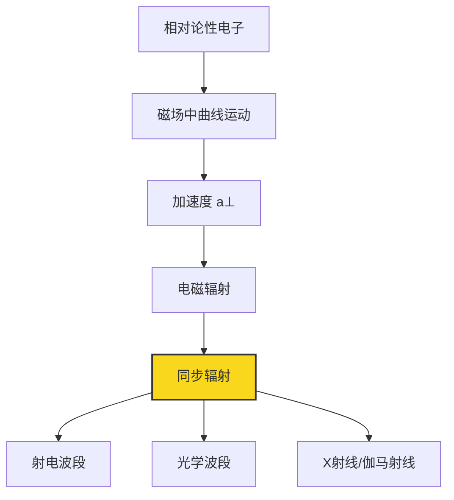
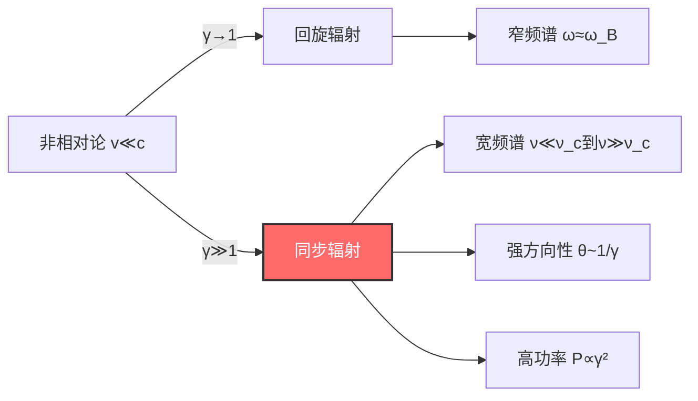
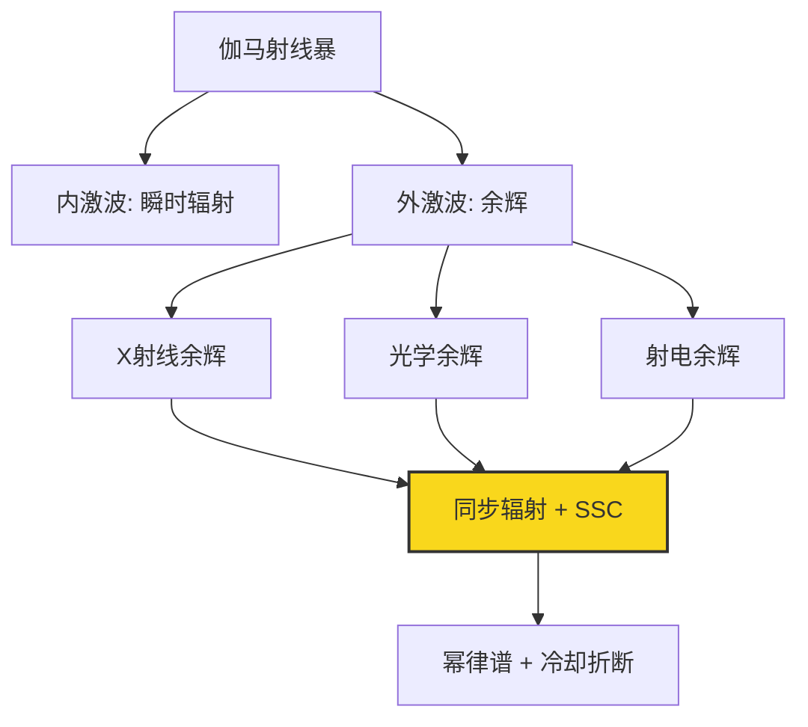

# 同步辐射

## 概述

==同步辐射（Synchrotron Radiation）==是相对论性带电粒子在磁场中做曲线运动时发出的电磁辐射。它是天体物理中最重要的非热辐射机制之一，广泛存在于从射电到伽马射线的各个波段。

> [!info] 核心概念
> 同步辐射的本质是**相对论性带电粒子在磁场中的加速辐射**。与热辐射不同，同步辐射是一种**非热辐射**机制，其频谱通常为幂律谱，且具有显著的偏振特性。

同步辐射最早于1947年在同步加速器实验中被观测到，因此得名。然而在天体物理中，这种辐射机制早在1950年代就被用来解释蟹状星云的连续辐射。如今，同步辐射已成为理解[[活动星系核物理|活动星系核]]、伽马射线暴、脉冲星风云等高能天体的关键工具。

从理论角度看，同步辐射的理论基础深深植根于狭义相对论的框架之中。粒子的相对论性运动需要用[[闵氏几何|闵氏时空]]的语言来描述，而辐射的传播和观测则涉及[[相对论观测|相对论观测效应]]。在低能极限下，同步辐射退化为回旋辐射，其散射过程可与[[汤姆孙散射|汤姆孙散射]]相联系。



---

## 一、基本原理

### 1.1 非相对论情况：回旋辐射

在讨论同步辐射之前，我们先从非相对论极限出发，理解带电粒子在磁场中的基本辐射行为——**回旋辐射（Cyclotron Radiation）**。

#### 带电粒子在磁场中的圆周运动

当一个电荷量为 $q$、质量为 $m$ 的带电粒子以速度 $\boldsymbol{v}$ 进入均匀磁场 $\boldsymbol{B}$ 时，它受到的洛伦兹力为：

$$
\boldsymbol{F} = q\boldsymbol{v} \times \boldsymbol{B}
$$

由于洛伦兹力始终垂直于速度方向，它不做功，只改变速度的方向而不改变速度的大小。将速度分解为平行于磁场的分量 $v_\parallel$ 和垂直于磁场的分量 $v_\perp$：

- $v_\parallel$ 分量不受磁场影响，粒子沿磁场方向做匀速运动
- $v_\perp$ 分量在洛伦兹力作用下做匀速圆周运动

因此，粒子的总体运动是**螺旋线运动**。

#### 回旋频率

对于纯圆周运动（$v_\parallel = 0$），向心力由洛伦兹力提供：

$$
\frac{mv_\perp^2}{r} = qv_\perp B
$$

由此得到回旋半径（拉莫尔半径）：

$$
r_L = \frac{mv_\perp}{qB}
$$

回旋角频率为：

$$
\boxed{\omega_B = \frac{qB}{mc}}
$$

（CGS高斯单位制下）或者在国际单位制中 $\omega_B = qB/m$。对应的回旋频率为 $\nu_B = \omega_B / (2\pi)$。

> [!note] 数值估计
> 对于电子在 $B = 1\,\text{G}$ 的磁场中，回旋频率为：
> $$\nu_B = \frac{eB}{2\pi m_e c} \approx 2.8 \times 10^6 \,\text{Hz} = 2.8\,\text{MHz}$$
> 这落在射电波段。

#### 拉莫尔公式

做加速运动的带电粒子会发出电磁辐射。在非相对论极限下（$v \ll c$），辐射总功率由**拉莫尔公式（Larmor Formula）**给出：

$$
\boxed{P = \frac{2q^2 a^2}{3c^3}}
$$

其中 $a$ 是粒子的加速度大小。对于圆周运动，$a = v_\perp^2 / r_L = \omega_B^2 r_L = v_\perp \omega_B$，代入得：

$$
P = \frac{2q^2}{3c^3} \cdot \frac{q^2 B^2 v_\perp^2}{m^2 c^2} = \frac{2q^4 B^2 v_\perp^2}{3m^2 c^5}
$$

> [!warning] 注意
> 拉莫尔公式仅在 $v \ll c$ 时成立。当粒子速度接近光速时，必须使用相对论性推广——**利纳尔-维谢尔势（Liénard-Wiechert potentials）**来描述辐射。

回旋辐射的频谱特征非常简单：辐射主要集中在回旋频率 $\nu_B$ 及其低次谐波处，频谱很窄。这是因为非相对论性圆周运动的加速度在一个回旋周期内是正弦变化的，本质上相当于一个振荡偶极子。

### 1.2 相对论效应

当粒子速度接近光速时，三个关键的相对论效应彻底改变了辐射的特征：

#### （1）质量增加（惯性增加）

相对论性粒子的有效惯性增大：

$$
m \to \gamma m = \frac{m}{\sqrt{1 - v^2/c^2}}
$$

其中 $\gamma = (1-\beta^2)^{-1/2}$ 是洛伦兹因子，$\beta = v/c$。这导致回旋频率降低：

$$
\omega = \frac{qB}{\gamma mc} = \frac{\omega_B}{\gamma}
$$

#### （2）相对论性多普勒效应与光束聚束

这是最关键的效应。相对论性粒子发出的辐射不再是各向同性的，而是集中在粒子运动方向上一个狭窄的锥形区域内。

> [!tip] 光束聚束效应
> 在粒子瞬时静止系中，辐射的角分布仍然近似为偶极辐射模式（$\propto \sin^2\theta'$）。但当我们通过洛伦兹变换回到实验室系时，由于[[相对论观测|相对论观测效应]]中的光行差效应，辐射被压缩到一个半角约为 $\theta \sim 1/\gamma$ 的狭窄前向锥内。

这意味着观测者只有在粒子运动方向几乎对准自己时才能看到辐射。由于粒子做圆周运动，观测者看到的是一系列短暂的脉冲，每个脉冲的持续时间约为：

$$
\Delta t \sim \frac{1}{\gamma^3 \omega_B}
$$

这个极短的脉冲宽度意味着辐射的频谱远远超出了回旋频率，延伸到了非常高的频率。

#### （3）辐射功率增强

相对论性版本的拉莫尔公式（利纳尔公式）为：

$$
P = \frac{2q^2}{3c^3} \gamma^4 \left(a_\perp^2 + \gamma^2 a_\parallel^2\right)
$$

对于磁场中的圆周运动，加速度完全垂直于速度（$a_\parallel = 0$），$a_\perp = v_\perp^2/r_L$，代入后得到：

$$
P = \frac{2q^4 B^2}{3m^2 c^3} \gamma^2 \beta_\perp^2
$$

与回旋辐射功率相比，同步辐射功率增强了 $\gamma^2$ 倍。对于 $\gamma \gg 1$ 的极端相对论粒子，这个增强因子是巨大的。



---

## 二、相对论电子在磁场中的运动

### 2.1 运动方程

考虑一个能量为 $E = \gamma m_e c^2$、动量为 $\boldsymbol{p} = \gamma m_e \boldsymbol{v}$ 的相对论性电子在均匀磁场 $\boldsymbol{B}$ 中的运动。

运动方程为：

$$
\frac{d\boldsymbol{p}}{dt} = \frac{q}{c}\boldsymbol{v} \times \boldsymbol{B}
$$

由于洛伦兹力不做功（$\boldsymbol{F} \cdot \boldsymbol{v} = 0$），粒子的能量 $E = \gamma m_e c^2$ 是守恒的（暂不考虑辐射损失），因此 $\gamma$ 为常数。

将速度分解为平行和垂直于磁场的分量：

- **平行方向**：$dp_\parallel/dt = 0$，故 $v_\parallel = \text{const}$
- **垂直方向**：粒子做匀速圆周运动

定义**投掷角（pitch angle）** $\alpha$ 为速度与磁场方向的夹角：

$$
\sin\alpha = \frac{v_\perp}{v}, \quad \cos\alpha = \frac{v_\parallel}{v}
$$

#### 拉莫尔半径

相对论性电子的拉莫尔半径为：

$$
\boxed{r_L = \frac{\gamma m_e c v_\perp}{eB} = \frac{\gamma m_e c^2 \beta_\perp}{eB} \approx \frac{\gamma m_e c^2}{eB} \sin\alpha}
$$

> [!example] 数值估计
> 对于 $\gamma = 10^4$ 的电子在 $B = 100\,\mu\text{G}$ 的磁场中：
> $$r_L \approx \frac{10^4 \times 8.2 \times 10^{-8}\,\text{erg}}{4.8 \times 10^{-10}\,\text{esu} \times 10^{-4}\,\text{G}} \approx 1.7 \times 10^{10}\,\text{cm} \approx 0.006\,\text{pc}$$
> 这远小于天体物理系统的典型尺度，因此电子被很好地"束缚"在磁力线附近。

### 2.2 能量损失

同步辐射导致电子不断损失能量。能量损失率为：

$$
\frac{dE}{dt} = -P = -\frac{4}{3}\sigma_T c \beta^2 \gamma^2 U_B \sin^2\alpha
$$

其中 $\sigma_T$ 是[[汤姆孙散射|汤姆孙截面]]，$U_B = B^2/(8\pi)$ 是磁场能量密度。

对于极端相对论电子（$\beta \approx 1$），并对投掷角取各向同性平均（$\langle\sin^2\alpha\rangle = 2/3$），得到：

$$
\left\langle\frac{dE}{dt}\right\rangle = -\frac{4}{3}\sigma_T c \gamma^2 U_B
$$

由于 $E = \gamma m_e c^2$，上式可以写为：

$$
\frac{d\gamma}{dt} = -\frac{4}{3}\frac{\sigma_T U_B}{m_e c}\gamma^2
$$

这是一个可分离变量的一阶常微分方程，其解为：

$$
\gamma(t) = \frac{\gamma_0}{1 + t/t_{\text{cool}}}
$$

其中初始洛伦兹因子为 $\gamma_0$，**冷却时标**为：

$$
\boxed{t_{\text{cool}} = \frac{3m_e c}{4\sigma_T U_B \gamma_0} = \frac{6\pi m_e c}{\sigma_T B^2 \gamma_0}}
$$

> [!important] 关键结论
> - 冷却时标与 $\gamma_0$ 成反比：能量越高的电子冷却越快
> - 冷却时标与 $B^2$ 成反比：磁场越强冷却越快
> - 当 $t \gg t_{\text{cool}}$ 时，$\gamma(t) \to 1/t$，电子能量与初始条件无关

---

## 三、同步辐射的功率

### 3.1 单电子总功率

单个相对论性电子在磁场中的同步辐射总功率为：

$$
\boxed{P_{\text{sync}} = \frac{4}{3}\sigma_T c \beta^2 \gamma^2 U_B \sin^2\alpha}
$$

其中各物理量的含义：

| 符号 | 含义 | 表达式 |
|------|------|--------|
| $\sigma_T$ | [[汤姆孙散射\|汤姆孙截面]] | $\frac{8\pi}{3}\left(\frac{e^2}{m_e c^2}\right)^2 = 6.65 \times 10^{-25}\,\text{cm}^2$ |
| $c$ | 光速 | $3 \times 10^{10}\,\text{cm/s}$ |
| $\gamma$ | 洛伦兹因子 | $(1-\beta^2)^{-1/2}$ |
| $U_B$ | 磁场能量密度 | $B^2/(8\pi)$ |
| $\alpha$ | 投掷角 | 速度与磁场的夹角 |

对于极端相对论电子（$\beta \approx 1$）和各向同性平均：

$$
\langle P_{\text{sync}} \rangle = \frac{4}{3}\sigma_T c \gamma^2 U_B
$$

> [!note] 与逆康普顿散射的类比
> 同步辐射功率的表达式与逆康普顿散射功率 $P_{\text{IC}} = \frac{4}{3}\sigma_T c \gamma^2 U_{\text{ph}}$ 在形式上完全类似，只需将磁场能量密度 $U_B$ 替换为辐射能量密度 $U_{\text{ph}}$。这一对称性深刻地反映了两种辐射机制的内在联系。详见[[汤姆孙散射]]。

### 3.2 辐射谱

同步辐射的频谱是其最显著的可观测特征之一。

#### 临界频率

单个电子的同步辐射频谱有一个特征频率——**临界频率**：

$$
\boxed{\nu_c = \frac{3}{2}\gamma^2 \nu_B \sin\alpha = \frac{3}{4\pi}\gamma^2 \frac{eB}{m_e c} \sin\alpha}
$$

数值上：

$$
\nu_c \approx 4.2 \times 10^6 \gamma^2 B \sin\alpha \;\text{Hz} \quad (B\text{ 以高斯为单位})
$$

> [!tip] 理解临界频率
> 临界频率的物理来源是脉冲宽度 $\Delta t \sim 1/(\gamma^3 \omega_B)$。根据傅里叶分析，一个持续时间为 $\Delta t$ 的脉冲，其频谱在 $\nu \sim 1/\Delta t \sim \gamma^3 \omega_B$ 处达到峰值。更精确的计算给出上面的系数 $3/2$ 和 $\sin\alpha$ 因子。

#### 频谱形状函数

单电子的同步辐射频谱可以表示为：

$$
P(\nu) = \frac{\sqrt{3}e^3 B \sin\alpha}{m_e c^2} F\left(\frac{\nu}{\nu_c}\right)
$$

其中 $F(x)$ 是**通用频谱形状函数**：

$$
F(x) = x \int_x^\infty K_{5/3}(\xi)\,d\xi
$$

$K_{5/3}$ 是修正贝塞尔函数。这个函数具有以下渐近行为：

- **低频极限**（$x = \nu/\nu_c \ll 1$）：

$$
F(x) \approx \frac{4\pi}{\sqrt{3}\,\Gamma(1/3)} x^{1/3} \approx 2.15\, x^{1/3}
$$

- **高频极限**（$x = \nu/\nu_c \gg 1$）：

$$
F(x) \approx \sqrt{\frac{\pi}{2}} x^{1/2} e^{-x}
$$

```mermaid
xy
    title "同步辐射频谱形状函数 F(x)"
    xlabel "ν/ν_c"
    ylabel "F(ν/ν_c)"
    range 0 5 0 2
    curve F(x)
        line blue 2
        data
            0.01, 0.46
            0.1, 0.99
            0.29, 1.33
            0.5, 1.25
            1.0, 0.85
            2.0, 0.26
            3.0, 0.05
            4.0, 0.007
```

> [!info] 频谱特征总结
> - 在 $\nu \ll \nu_c$ 时，$P_\nu \propto \nu^{1/3}$，频谱缓慢上升
> - 在 $\nu \sim \nu_c$ 处，频谱达到峰值
> - 在 $\nu \gg \nu_c$ 时，$P_\nu \propto \nu^{1/2} e^{-\nu/\nu_c}$，频谱指数截断

### 3.3 偏振特性

同步辐射是**高度偏振**的，这是它区别于其他辐射机制的重要特征。

#### 线偏振

对于单个电子，在粒子轨道平面内观测到的同步辐射是**完全线偏振**的，电场矢量在轨道平面内。在垂直于轨道平面的方向上，辐射是圆偏振的。

对于实际观测，由于我们通常分辨不清单个电子的轨道，观测到的是大量电子的统计平均。如果电子的投掷角分布是各向同性的，则观测到的同步辐射以**线偏振**为主。

#### 幂律分布电子的偏振度

对于幂律能谱 $N(E) \propto E^{-p}$ 的电子分布，同步辐射的线偏振度为：

$$
\boxed{\Pi = \frac{p+1}{p+7/3}}
$$

| 谱指数 $p$ | 偏振度 $\Pi$ |
|:-----------:|:------------:|
| 2.0 | 69% |
| 2.5 | 72% |
| 3.0 | 75% |
| 3.5 | 77% |

> [!note] 观测意义
> 典型的天体物理同步辐射源观测到线偏振度为 $10\%$-$70\%$。理论最大值约 $70\%$-$75\%$ 对应于 $p \sim 2$-$3$ 的幂律电子分布。实际偏振度低于理论值的原因包括：
> - 磁场方向不均匀（不同区域的偏振方向不同，导致退偏）
> - 法拉第退偏（Faraday depolarization）
> - 非同步辐射成分的混入

---

## 四、电子能谱的影响

### 4.1 幂律分布

天体物理中的相对论性电子通常具有**幂律能谱**：

$$
\boxed{N(E)\,dE = K E^{-p}\,dE \quad (E_{\min} \leq E \leq E_{\max})}
$$

其中 $K$ 是归一化常数，$p$ 是谱指数，$E_{\min}$ 和 $E_{\max}$ 分别是最低和最高电子能量。

> [!info] 幂律谱的起源
> 幂律电子能谱通常由**费米加速（Fermi acceleration）**机制产生。在激波加速（一阶费米加速）中，粒子反复穿越激波面，每次获得一定比例的能量增量。统计结果表明，加速后的粒子能谱天然地呈现幂律形式，谱指数取决于激波压缩比。

典型值：

- 射电星系喷流：$p \sim 2$-$3$
- 蟹状星云：$p \sim 1.5$-$2.5$
- 伽马射线暴余辉：$p \sim 2$-$3$

### 4.2 同步辐射谱

#### 从单电子到电子系综

单个电子的辐射集中在 $\nu_c(\gamma)$ 附近。对于幂律分布的电子系综，总辐射功率为：

$$
P_\nu = \int_{E_{\min}}^{E_{\max}} P(\nu, E) N(E)\,dE
$$

由于 $P(\nu, E)$ 在 $\nu \sim \nu_c(\gamma)$ 处有尖锐的峰值，我们可以用 $\delta$ 函数近似：

$$
P(\nu, E) \approx P_{\text{total}}(\gamma) \cdot \delta(\nu - \nu_c(\gamma))
$$

其中 $\nu_c(\gamma) \propto \gamma^2$，因此 $\gamma \propto \nu^{1/2}$。

代入幂律分布 $N(\gamma) \propto \gamma^{-p}$，得到：

$$
\boxed{P_\nu \propto \nu^{-\alpha}, \quad \alpha = \frac{p-1}{2}}
$$

这就是同步辐射的**幂律谱**。

> [!tip] 谱指数关系
> 辐射谱指数 $\alpha$ 与电子谱指数 $p$ 的关系：
> $$\alpha = \frac{p-1}{2} \quad \Longleftrightarrow \quad p = 2\alpha + 1$$
> 例如：$p = 3$ 的电子产生 $\alpha = 1$ 的辐射谱（即 $F_\nu \propto \nu^{-1}$）。

#### 严格推导

不使用 $\delta$ 函数近似，严格积分给出的结果在定性上完全一致。在 $\nu_c(E_{\min}) \ll \nu \ll \nu_c(E_{\max})$ 的频率范围内，谱确实是一个精确的幂律，谱指数同样为 $\alpha = (p-1)/2$。

### 4.3 能谱截断

实际电子能谱在低能和高能端都有截断，这会在同步辐射谱中留下可观测的特征。

#### 低能截断

当 $E_{\min}$ 对应的临界频率 $\nu_c(E_{\min})$ 落在观测频段内时，在 $\nu < \nu_c(E_{\min})$ 处频谱会变平或出现截断。

> [!note] 低能截断的观测
> 在射电波段，低能截断通常被自吸收效应掩盖（见下一节）。但在红外或光学波段，如果存在低能截断，可能观测到谱的"鼓包"特征。

#### 高能截断

高能截断可能由以下原因造成：

1. **辐射冷却限制**：电子在加速区域的驻留时间 $t_{\text{res}}$ 有限，最大能量由 $t_{\text{cool}}(\gamma_{\max}) = t_{\text{res}}$ 决定
2. **加速限制**：加速率与损失率平衡时的能量
3. **同步辐射极限**：当辐射光子的能量接近电子能量时，经典处理失效

高能截断在辐射谱中表现为指数截断：$F_\nu \propto \exp(-\nu/\nu_{\max})$。

---

## 五、同步辐射自吸收

### 5.1 吸收系数

同步辐射不仅会发射光子，也会吸收光子。低频光子更容易被吸收，因为低能电子对低频辐射的吸收截面更大。

自吸收系数 $\alpha_\nu$ 可以通过基尔霍夫定律从发射系数 $j_\nu$ 推导：

$$
\alpha_\nu = \frac{1}{4\pi} \cdot \frac{j_\nu}{B_\nu(T_{\text{eff}})} \quad \text{（形式上）}
$$

更严格地，通过考虑受激辐射（负吸收）和电子分布，可以得到：

$$
\alpha_\nu \propto \nu^{-(p+4)/2} B^{(p+2)/2}
$$

> [!warning] 物理意义
> 自吸收系数随频率的降低而急剧增大（$\alpha_\nu \propto \nu^{-(p+4)/2}$），这意味着低频光子在源内部就会被吸收。

### 5.2 谱的形状变化

定义**自吸收频率** $\nu_a$ 为光学深度 $\tau_\nu = \alpha_\nu R = 1$ 的频率（$R$ 为源的特征尺度）。

同步辐射自吸收源的频谱呈现两个截然不同的区域：

$$
\boxed{
I_\nu \propto \begin{cases}
\nu^{5/2} & (\nu < \nu_a, \;\text{自吸收区}) \\
\nu^{-\alpha} & (\nu > \nu_a, \;\text{光学薄区})
\end{cases}
}
$$

> [!important] 为什么是 $\nu^{5/2}$？
> 在光学厚区域（$\nu < \nu_a$），辐射趋近于"黑体"极限。但同步辐射的"黑体"不是普朗克谱，而是由源函数的频率依赖决定的。在低频极限下，源函数 $S_\nu = j_\nu/\alpha_\nu \propto \nu^{5/2}$，因此 $I_\nu \approx S_\nu \propto \nu^{5/2}$。

```mermaid
graph LR
    A[低频 ν < ν_a] -->|光学厚 τ≫1| B[I_ν ∝ ν^(5/2)]
    C[自吸收频率 ν_a] --> D[峰值]
    E[高频 ν > ν_a] -->|光学薄 τ≪1| F[I_ν ∝ ν^(-α)]
    B --- D --- F
    style D fill:#ff6b6b,stroke:#333,color:#fff
```

### 5.3 同步辐射自康普顿（SSC）

同步辐射产生的光子可以被同一批电子通过逆康普顿散射再次散射到更高能量。这个过程称为**同步辐射自康普顿散射（Synchrotron Self-Compton, SSC）**。

SSC 的重要性取决于同步辐射能量密度 $U_{\text{sync}}$ 与磁场能量密度 $U_B$ 的比值：

$$
\frac{P_{\text{SSC}}}{P_{\text{sync}}} \approx \frac{U_{\text{sync}}}{U_B}
$$

当 $U_{\text{sync}} \sim U_B$ 时，SSC 变得非常重要，会产生显著的 X 射线或伽马射线辐射。

> [!note] 与[[汤姆孙散射]]的联系
> SSC 过程本质上是同步辐射光子被相对论性电子的逆康普顿散射。在电子静止系中，这个过程可以近似为[[汤姆孙散射]]（当光子能量在电子静止系中远小于 $m_e c^2$ 时）。SSC 的详细理论需要结合[[闵氏几何|闵氏时空]]中的运动学分析。

---

## 六、同步辐射冷却

### 6.1 冷却时标

如前所述，同步辐射冷却时标为：

$$
\boxed{t_{\text{cool}} = \frac{6\pi m_e c}{\sigma_T B^2 \gamma} \approx 5 \times 10^8 \frac{1}{\gamma B^2} \;\text{s}}
$$

（$B$ 以高斯为单位）

| 场景 | $B$ (G) | $\gamma$ | $t_{\text{cool}}$ |
|------|:--------:|:--------:|:-----------------:|
| 射电瓣 | $10^{-5}$ | $10^4$ | $\sim 10^{14}$ s $\sim 3$ Myr |
| 蟹状星云 | $10^{-4}$ | $10^6$ | $\sim 5 \times 10^4$ s $\sim 14$ hr |
| 伽马射线暴 | $10^5$ | $10^5$ | $\sim 5 \times 10^{-12}$ s |

> [!tip] 冷却的物理意义
> 冷却时标决定了高能电子的"寿命"。在天体物理源中，如果电子是一次性加速的，那么经过时间 $t$ 后，只有 $\gamma < \gamma_{\text{break}}$ 的电子保持初始能量，其中 $\gamma_{\text{break}}$ 由 $t_{\text{cool}}(\gamma_{\text{break}}) = t$ 决定。

### 6.2 冷却-break

在连续注入电子的源中（如激波加速），稳态电子能谱为 $N(\gamma) \propto \gamma^{-p}$。但经过时间 $t$ 后，由于冷却效应：

- $\gamma < \gamma_{\text{break}}$：电子尚未显著冷却，保持注入谱 $\propto \gamma^{-p}$
- $\gamma > \gamma_{\text{break}}$：电子已冷却，能谱变陡为 $\propto \gamma^{-(p+1)}$

对应的辐射谱出现**冷却折断（cooling break）**：

$$
\boxed{
F_\nu \propto \begin{cases}
\nu^{-\alpha_1} & (\nu < \nu_{\text{cool}}) \\
\nu^{-\alpha_2} & (\nu > \nu_{\text{cool}})
\end{cases}
}
$$

其中 $\alpha_1 = (p-1)/2$，$\alpha_2 = p/2$，折断处谱指数变化：

$$
\Delta\alpha = \alpha_2 - \alpha_1 = \frac{1}{2}
$$

冷却频率 $\nu_{\text{cool}} = \nu_c(\gamma_{\text{break}})$ 随时间降低。

> [!important] 观测意义
> 冷却折断在伽马射线暴余辉的光变曲线和能谱中被广泛观测到。它是诊断源年龄和磁场强度的重要工具。

### 6.3 老化效应

对于一次性注入的电子群（如射电瓣中的电子），经过时间 $t$ 后：

- 高能电子优先冷却
- 有效最大能量 $\gamma_{\max}(t)$ 随时间降低
- 辐射谱在高能端变陡

具体地，冷却后的电子能谱为：

$$
N(\gamma, t) = N_0 \gamma^{-p} \exp\left(-\frac{t}{t_{\text{cool}}(\gamma)}\right)
$$

在 $\nu \gg \nu_c(\gamma_{\max}(t))$ 处，谱指数变为 $\alpha = (p+1)/2$，比原始谱陡了 $\Delta\alpha = 1/2$。

> [!note] 老化与观测
> "老化"效应导致射电星系射电瓣的频谱从核心到边缘逐渐变陡，这被称为**频谱老化（spectral aging）**。通过测量不同位置的谱指数，可以追踪电子从核心到瓣的输运历史。

---

## 七、天体物理应用

### 7.1 射电星系

射电星系是同步辐射最经典的天体物理应用之一。

#### 喷流中的同步辐射

射电星系（如 M87、Cygnus A）的**相对论性喷流**中含有大量 $\gamma \sim 10^3$-$10^5$ 的电子，在 $B \sim 10$-$100\,\mu\text{G}$ 的磁场中发出同步辐射。

观测特征：
- **射电波段**：幂律谱 $F_\nu \propto \nu^{-\alpha}$，$\alpha \sim 0.5$-$1.0$
- **偏振**：线偏振度 $10\%$-$50\%$
- **形态**：喷流呈准直结构，亮度不均匀

#### 射电瓣

喷流末端的**射电瓣（radio lobes）**是巨大的同步辐射结构，尺度可达数百 kpc：

- 电子能量：$\gamma \sim 10^3$-$10^5$
- 磁场：$B \sim 1$-$10\,\mu\text{G}$
- 总辐射功率：$10^{42}$-$10^{45}\,\text{erg/s}$
- 寿命：$\sim 10^7$-$10^8$ 年

> [!info] 最小能量条件
> 射电瓣的磁场强度通常通过**最小能量假设**来估计：当磁场能量和电子能量之和最小时，对应的磁场称为"最小能量磁场"或"等分磁场"。对于典型射电瓣，$B_{\min} \sim$ 几 $\mu\text{G}$。

### 7.2 类星体

类星体（Quasar）是光度最高的活动星系核，其同步辐射特征包括：

#### 宽频带辐射

类星体的同步辐射覆盖了从射电到光学甚至 X 射线的宽频带：

- **射电**：核区同步辐射，亮度温度可达 $10^{12}\,\text{K}$
- **光学-紫外**："大蓝包"（Big Blue Bump）的一部分可能来自同步辐射
- **X 射线**：部分类星体的 X 射线可能由 SSC 产生

#### 光学-射电相关

在一些类星体中，光学和射电波段的辐射存在相关性，暗示它们可能来自同一电子群的不同频段同步辐射。

> [!note] 与[[活动星系核物理]]的联系
> 类星体的统一模型认为，类星体、射电星系、BL Lac 天体等本质上是同一类天体的不同观测角度。同步辐射在统一模型中扮演着关键角色，详见[[活动星系核物理]]。

### 7.3 伽马射线暴

伽马射线暴（GRB）的**余辉**辐射被广泛认为主要由同步辐射产生。

#### 余辉中的同步辐射

GRB 余辉的标准模型（火球模型）中，相对论性激波加速电子产生同步辐射：

- **早期余辉**（X 射线、光学）：$\nu_m < \nu_{\text{cool}}$ 的情形
- **晚期余辉**（射电）：可能进入 $\nu_m > \nu_{\text{cool}}$ 的情形

其中 $\nu_m$ 是峰值频率，$\nu_{\text{cool}}$ 是冷却频率。

#### 多波段观测

GRB 余辉的多波段光变曲线展示了同步辐射的典型特征：



> [!tip] 观测诊断
> 通过拟合多波段光变曲线，可以同时约束以下物理参数：
> - 电子谱指数 $p$
> - 磁场能量占比 $\epsilon_B$
> - 电子能量占比 $\epsilon_e$
> - 环境密度 $n$
> - 总能量 $E$

### 7.4 脉冲星风云

#### 蟹状星云

蟹状星云（Crab Nebula）是最著名的脉冲星风云，也是同步辐射研究的"标准烛光"。

- **中心脉冲星**：PSR B0531+21，自转周期 33 ms
- **脉冲星风**：相对论性电子-正电子对，$\gamma \sim 10^4$-$10^9$
- **终止激波**：脉冲星风与星云介质相遇处，电子被进一步加速
- **磁场**：$B \sim 100$-$300\,\mu\text{G}$

蟹状星云的频谱从射电（$\sim 10\,\text{MHz}$）一直延伸到硬 X 射线（$\sim 100\,\text{keV}$），几乎完全由同步辐射主导。

> [!warning] 蟹状星云悖论
> 蟹状星云的能谱在射电波段 $\alpha \approx 0.3$，在光学波段 $\alpha \approx 0.4$。如果这是同一电子群的同步辐射，则需要 $p \approx 1.6$（射电）和 $p \approx 1.8$（光学）。但简单的激波加速理论预测 $p \geq 2$。这个矛盾被称为"蟹状星云悖论"，至今仍是活跃的研究课题。

#### 高能电子加速

脉冲星风云中的电子可以被加速到极高的能量：

- 光学同步辐射：$\gamma \sim 10^8$-$10^9$
- X 射线同步辐射：$\gamma \sim 10^9$
- 逆康普顿伽马射线：$\gamma \sim 10^9$-$10^{10}$

### 7.5 活动星系核

活动星系核（AGN）的辐射涉及多种同步辐射相关过程：

- **喷流同步辐射**：从射电到伽马射线的宽频辐射
- **SSC**：同步辐射光子被逆康普顿散射到 X 射线和伽马射线
- **外部康普顿**：同步辐射光子与外部辐射场（如宽线区、尘埃环）的逆康普顿散射
- **相对论性集束**：由于[[相对论观测|相对论观测效应]]，喷流中的同步辐射被多普勒增强

详细的讨论请参见[[活动星系核物理]]。

---

## 八、实验室同步辐射

### 8.1 同步辐射光源

同步辐射不仅是天体物理现象，也是重要的实验室工具。

#### 储存环中的电子

现代同步辐射光源使用**电子储存环**产生高强度的同步辐射：

- **电子能量**：$E \sim 1$-$8\,\text{GeV}$（$\gamma \sim 2000$-$16000$）
- **磁场**：由弯转磁铁、扭摆器（wiggler）和波荡器（undulator）提供
- **辐射特性**：
  - 高亮度（比 X 射线管高 $10^6$-$10^{12}$ 倍）
  - 宽频谱（从红外到硬 X 射线连续可调）
  - 高准直性（发散角 $\sim 1/\gamma \sim 10^{-4}$ rad）
  - 高偏振度（线偏振或圆偏振）
  - 脉冲时间结构（脉冲宽度 $\sim 10$-$100\,\text{ps}$）

#### 光源代际

| 代际 | 类型 | 亮度 (photons/s/mm²/mrad²/0.1%BW) |
|:----:|------|:--:|
| 第一代 | 高能物理对撞机兼用 | $\sim 10^8$ |
| 第二代 | 专用储存环 + 弯转磁铁 | $\sim 10^{10}$ |
| 第三代 | 专用储存环 + 波荡器 | $\sim 10^{18}$ |
| 第四代 | 自由电子激光（FEL） | $\sim 10^{33}$ |

### 8.2 应用

同步辐射光源在众多科学领域有广泛应用：

#### 材料科学
- X 射线衍射（XRD）：晶体结构分析
- X 射线吸收精细结构（XAFS）：局域结构探测
- 小角 X 射线散射（SAXS）：纳米结构表征

#### 生物成像
- 蛋白质晶体学：确定蛋白质三维结构
- 医学成像：高分辨率 X 射线成像
- 细胞成像：软 X 射线显微术

#### 光谱学
- 光电子能谱（XPS/ARPES）：电子结构研究
- 红外光谱：分子振动分析
- 拉曼光谱：化学组成分析

> [!info] 中国同步辐射光源
> 中国拥有合肥国家同步辐射实验室（NSRL，$E = 0.8\,\text{GeV}$）和上海光源（SSRF，$E = 3.5\,\text{GeV}$）。正在建设中的硬 X 射线自由电子激光（SXFEL）将成为第四代光源。

---

## 总结

> [!summary] 核心要点
> 1. 同步辐射是相对论性电子在磁场中的加速辐射
> 2. 总功率 $P \propto \gamma^2 B^2$
> 3. 临界频率 $\nu_c \propto \gamma^2 B$
> 4. 幂律电子分布产生幂律辐射谱，$\alpha = (p-1)/2$
> 5. 自吸收导致低频谱 $I_\nu \propto \nu^{5/2}$
> 6. 冷却导致谱折断，$\Delta\alpha = 0.5$
> 7. 高度线偏振，$\Pi \sim 70\%$

同步辐射将[[闵氏几何|狭义相对论]]的基本原理与天体物理观测紧密联系在一起。从射电星系到伽马射线暴，从蟹状星云到实验室光源，同步辐射为我们理解宇宙中的极端物理条件提供了不可替代的窗口。

---

## 延伸阅读

- [[汤姆孙散射]] — 低能光子与电子的弹性散射，SSC 的理论基础
- [[闵氏几何]] — 狭义相对论的几何表述，同步辐射的理论框架
- [[活动星系核物理]] — 同步辐射最重要的天体物理应用
- [[相对论观测]] — 多普勒效应和光行差，影响同步辐射的观测特征
- [[相对论专题]] — 相对论力学和电动力学的系统讨论

%%
同步辐射是天体物理中最重要的辐射机制之一
从射电到伽马射线，同步辐射无处不在
同步辐射的发现历史：1947年在通用电气的同步加速器上首次观测
天体物理中的首次应用：1953年解释蟹状星云辐射
关键公式：P = (4/3)σ_T c U_B γ² 和 ν_c = (3/2)γ²ν_B sinα
幂律谱指数关系：α = (p-1)/2
自吸收低频谱：I_ν ∝ ν^(5/2)
冷却折断：Δα = 0.5
%%
