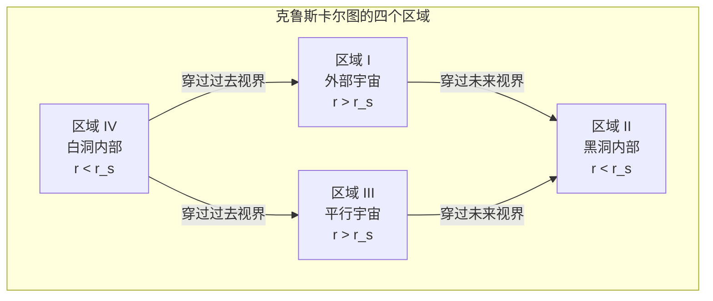
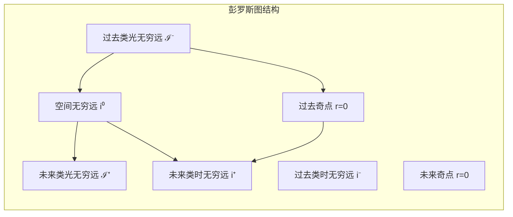

# 场方程与施瓦西解

> [!abstract] 概述
> 爱因斯坦场方程（Einstein Field Equations, EFE）是广义相对论的核心方程，它描述了物质和能量如何决定时空的弯曲方式。约翰·惠勒曾以一句话概括广义相对论的精髓：
> 
> > *"时空告诉物质如何运动；物质告诉时空如何弯曲。"*
> 
> 1915 年 11 月 25 日，爱因斯坦向普鲁士科学院提交了完整的场方程论文。仅仅一个月后，卡尔·施瓦西在俄国前线战壕中给出了场方程的第一个精确解——**施瓦西解**，描述球对称质量外部的时空几何。这一解预言了黑洞、引力红移等深刻物理现象，至今仍是引力物理的基石。
> 
> 本笔记从牛顿引力的局限出发，系统推导爱因斯坦场方程，详细求解施瓦西度规，并讨论其物理应用与 Extensions。前置知识参见 [[相对论推导]] 与 [[闵氏几何]]。

## 一、从牛顿引力到广义相对论

### 1.1 牛顿引力的局限

牛顿万有引力定律在宏观低速世界中取得了巨大成功，但它存在三个根本性困难，促使物理学家寻找更深刻的引力理论。

#### 1.1.1 超距作用问题

牛顿引力定律的数学形式为：

$$
\mathbf{F} = -\frac{GMm}{r^2}\hat{\mathbf{r}}
$$

对应的引力势满足**泊松方程**：

$$
\nabla^2 \Phi = 4\pi G \rho
$$

> [!warning] 超距作用的本质困难
> 泊松方程是一个**椭圆型偏微分方程**，其格林函数 $G(\mathbf{r}, \mathbf{r}') = -1/|\mathbf{r} - \mathbf{r}'|$ 是瞬时作用的。这意味着，如果太阳突然消失，地球将**立刻**感受到引力变化——这与狭义相对论中"信息传递速度不超过光速"的基本要求直接矛盾。
> 
> 在狭义相对论的框架中（参见 [[闵氏几何]]），物理定律应当用**双曲型偏微分方程**描述，其解以有限速度传播。牛顿引力方程不具备这种性质，因此它与相对论性因果结构不兼容。

#### 1.1.2 与狭义相对论的矛盾

狭义相对论（参见 [[相对论推导#一、洛伦兹变换的推导]]）揭示了时空的统一性，物理定律应当在洛伦兹变换下协变。然而牛顿引力理论存在以下矛盾：

1. **引力势 $\Phi$ 不是洛伦兹标量**：在洛伦兹变换下，$\Phi$ 不能单独构成四维矢量的分量或标量，它缺乏相对论性变换规则。
2. **质量密度的变换**：牛顿理论中的质量密度 $\rho$ 不是四维标量。在相对论中，能量密度是能量-动量张量 $T^{\mu\nu}$ 的一个分量 $T^{00}$，它在洛伦兹变换下与动量密度、应力等混合。
3. **力的概念过时**：狭义相对论中，力的概念被四维力和几何化的运动方程取代。引力不应被理解为一种"力"，而应被理解为时空几何的效应。

> [!note] 爱因斯坦的思考
> 爱因斯坦从 1907 年开始思考将引力纳入相对论框架的问题。他意识到，简单的"洛伦兹协变标量引力理论"（将 $\Phi$ 视为标量场）会导致与实验矛盾的结果——例如，它预言光线在引力场中不偏折（因为标量场与电磁场的迹 $T = 0$ 不耦合），而天文观测暗示引力确实影响光。

#### 1.1.3 水星近日点进动

水星轨道的近日点进动是牛顿引力最著名的异常。观测表明，水星近日点每世纪额外进动约 $43''$（角秒），无法用其他行星的摄动解释。

在牛顿力学框架中，一个受中心力 $F(r) = -GMm/r^2 + \delta F(r)$ 作用的粒子，其轨道进动角为：

$$
\Delta \varphi = -\frac{\partial}{\partial L}\left[2m \int_{r_{\min}}^{r_{\max}} \frac{\delta F(r)\, dr}{\sqrt{2m(E - V_{\text{eff}})}}\right] \cdot 2\pi
$$

> [!tip] 历史背景
> 1859 年，勒维耶发现水星近日点存在无法解释的每世纪 $38'' \pm 12''$ 的额外进动。此后数十年间，物理学家提出了各种假说： Vulcan 假说（假设存在一颗更靠近太阳的行星）、太阳扁率假说、修改引力平方反比律等，均未能成功。直到 1915 年爱因斯坦用广义相对论精确计算出 $43.03''$/世纪，这一百年难题才得以解决。详见 [[相对论观测]]。

### 1.2 等效原理的启示

等效原理是广义相对论的物理基石，它架起了从狭义相对论到弯曲时空的桥梁。

#### 1.2.1 弱等效原理：惯性质量 = 引力质量

牛顿第二定律和万有引力定律分别引入了两种质量：

- **惯性质量** $m_i$：$F = m_i a$，描述物体抵抗加速度的能力
- **引力质量** $m_g$：$F_g = m_g g$，描述物体感受引力的强度

弱等效原理（Weak Equivalence Principle, WEP）断言：

$$
m_i = m_g \quad \text{（对所有物体成立）}
$$

> [!note] 实验验证
> 厄特沃什实验（1890 年代）以 $10^{-9}$ 的精度验证了 $m_i/m_g$ 的普适性。现代的 Dicke 实验（1964）和 MICROSCOPE 卫星实验（2017）将精度推进到 $10^{-13}$ 至 $10^{-15}$ 量级。这一惊人的精确性暗示，惯性质量和引力质量的等价不是巧合，而是反映了某种深刻的物理原理。

弱等效原理的直接推论是：**所有物体在引力场中以相同的加速度下落**（伽利略的比萨斜塔实验）。这意味着引力效应在运动学上是普适的——它不依赖于物体的组成或内部结构。

#### 1.2.2 强等效原理：局部无法区分引力和加速度

爱因斯坦将弱等效原理推广为**强等效原理**（Einstein Equivalence Principle, EEP）：

> [!important] 爱因斯坦等效原理
> 在一个足够小的自由下落实验室中，**所有**物理定律（不仅是力学定律）的表现与在无引力的惯性系中完全相同。换言之，局部地，引力场与加速参考系不可区分。

这一原理的思想实验如下：

1. **封闭电梯中的观察者**无法通过任何局部实验区分：
   - 电梯静止在地球表面（受引力 $g$）
   - 电梯在无引力空间中以加速度 $g$ 加速

2. 反之，自由下落的电梯中的观察者**局部地**感受不到引力——这就是"失重"的本质。

> [!warning] "局部"一词的关键性
> 等效原理只在**局域**成立。真实的引力场存在**潮汐力**——不同位置的引力加速度不同。例如，地球引力场中两个自由下落的粒子会逐渐靠近（因为它们都朝向地心下落）。潮汐力是引力场**真正弯曲**的标志，无法通过坐标变换消除。
> 
> 数学上，潮汐力由**黎曼曲率张量** $R^\mu_{\ \nu\rho\sigma}$ 描述。如果黎曼张量为零，则时空是平直的，引力可以全局消除；如果黎曼张量非零，则时空是弯曲的，引力只能局部消除。

#### 1.2.3 引力是时空弯曲的表现

等效原理的最深刻推论是：**引力不是传统意义上的力，而是时空弯曲的几何效应**。

论证思路如下：

1. 等效原理告诉我们，自由下落的粒子沿着"直线"（测地线）运动
2. 但在坐标描述中，这些"直线"看起来是弯曲的（例如行星轨道）
3. 这种"弯曲"不能归因于某种力，因为所有物体以相同方式弯曲——这与力的概念矛盾
4. 唯一的解释是：**时空本身就是弯曲的**，粒子沿着弯曲时空中的"最直路径"运动

> [!tip] 从平直到弯曲
> 在 [[闵氏几何]] 中，平直时空的度规是 $\eta_{\mu\nu} = \text{diag}(1, -1, -1, -1)$。在弯曲时空中，度规推广为一般的位置函数 $g_{\mu\nu}(x)$。引力场的全部信息编码在度规场 $g_{\mu\nu}(x)$ 中——它是广义相对论的基本动力学变量。
> 
> 这一观点的革命性在于：牛顿理论中引力是背景时空中的力场 $\Phi(\mathbf{x})$；广义相对论中引力就是时空本身。没有"背景"和"力"的区分——度规既是舞台，也是演员。

## 二、爱因斯坦场方程的推导思路

### 2.1 场方程应满足的条件

爱因斯坦在 1912—1915 年间经历了漫长而曲折的探索。他明确知道场方程必须满足以下条件：

#### 2.1.1 广义协变性

> [!important] 广义协变原理
> 物理定律在**任意**坐标变换下保持形式不变。数学上，场方程必须是**张量方程**——方程两边都是同类型的张量。

这意味着方程中不应出现特殊的坐标系或度规分量。所有物理量都应以张量的形式出现，在坐标变换下按确定规则变换。这一要求排除了诸如 $\partial_\mu \partial_\nu \Phi = \cdots$ 这样只对特定坐标成立的方程。

#### 2.1.2 二阶偏微分方程

度规 $g_{\mu\nu}$ 是基本变量。类比于牛顿引力中 $\Phi$ 满足二阶方程 $\nabla^2 \Phi = 4\pi G\rho$，场方程应当对 $g_{\mu\nu}$ 是**二阶**偏微分方程。这意味着方程中 $g_{\mu\nu}$ 的最高阶导数是二阶导数。

> [!note] 为何是二阶？
> 高阶方程通常导致额外的自由度（鬼场）和不稳定性（Ostrogradsky 不稳定性）。二阶方程是物理上最自然的选择——它与经典力学中力由势的二阶导数决定（$\mathbf{F} = -\nabla \Phi$，而 $\Phi$ 满足二阶方程）相一致。

#### 2.1.3 能量-动量守恒

在狭义相对论中，能量和动量守恒表达为 $\partial_\mu T^{\mu\nu} = 0$。在弯曲时空中，这推广为**协变散度为零**：

$$
\nabla_\mu T^{\mu\nu} = 0
$$

场方程的几何侧也必须满足相同的守恒律。如果场方程形如 $H^{\mu\nu} = \kappa T^{\mu\nu}$，则必须有：

$$
\nabla_\mu H^{\mu\nu} \equiv 0
$$

这是一个**恒等式**（不依赖于场方程本身），类似于电磁学中 $\partial_\mu F^{\mu\nu} = j^\nu$ 自动蕴含 $\partial_\mu j^\mu = 0$（由 $F^{\mu\nu}$ 的反对称性保证）。

#### 2.1.4 牛顿极限下回到泊松方程

在弱场、低速、静态极限下，广义相对论必须退化为牛顿引力理论。这要求：

1. 度规接近闵氏度规：$g_{\mu\nu} = \eta_{\mu\nu} + h_{\mu\nu}$，$|h_{\mu\nu}| \ll 1$
2. 物质速度远小于光速：$v \ll c$
3. 场是静态的：$\partial_0 g_{\mu\nu} = 0$

在此极限下，测地线方程给出 $g_{00} \approx 1 + 2\Phi/c^2$，场方程应退化为 $\nabla^2 \Phi = 4\pi G\rho$。这一条件将确定场方程中的比例常数。

### 2.2 几何侧的构造

从度规 $g_{\mu\nu}$ 出发，可以系统地构造曲率张量。

#### 2.2.1 克里斯托费尔符号

度规的**一阶导数**构成克里斯托费尔符号（Christoffel symbols）：

$$
\Gamma^\lambda_{\mu\nu} = \frac{1}{2}g^{\lambda\rho}\left(\partial_\mu g_{\nu\rho} + \partial_\nu g_{\mu\rho} - \partial_\rho g_{\mu\nu}\right)
$$

> [!note] 克里斯托费尔符号的性质
> - $\Gamma^\lambda_{\mu\nu} = \Gamma^\lambda_{\nu\mu}$（对下指标对称）
> - **不是张量**：在坐标变换下，它多出一个二阶导数项。这正体现了等效原理——在任意一点都可以选择局部惯性系使得 $\Gamma^\lambda_{\mu\nu} = 0$。
> - 它是**协变导数**的核心：$\nabla_\mu V^\nu = \partial_\mu V^\nu + \Gamma^\nu_{\mu\lambda}V^\lambda$

#### 2.2.2 黎曼曲率张量

度规的**二阶导数**构成黎曼曲率张量（Riemann curvature tensor）：

$$
R^\rho_{\ \sigma\mu\nu} = \partial_\mu \Gamma^\rho_{\nu\sigma} - \partial_\nu \Gamma^\rho_{\mu\sigma} + \Gamma^\rho_{\mu\lambda}\Gamma^\lambda_{\nu\sigma} - \Gamma^\rho_{\nu\lambda}\Gamma^\lambda_{\mu\sigma}
$$

> [!important] 黎曼张量的物理意义
> 黎曼张量描述了**潮汐力**——即引力场的不可消除部分。考虑两个相邻的自由下落粒子，它们的相对加速度由**测地线偏离方程**给出：
> $$\frac{D^2 \xi^\mu}{d\tau^2} = -R^\mu_{\ \nu\rho\sigma} U^\nu \xi^\rho U^\sigma$$
> 其中 $\xi^\mu$ 是两粒子的间隔矢量，$U^\nu$ 是四维速度。黎曼张量非零意味着潮汐力的存在，即时空**真正弯曲**。

黎曼张量具有以下对称性：

| 对称性 | 表达式 |
|--------|--------|
| 反对称（前两个指标） | $R_{\rho\sigma\mu\nu} = -R_{\sigma\rho\mu\nu}$ |
| 反对称（后两个指标） | $R_{\rho\sigma\mu\nu} = -R_{\rho\sigma\nu\mu}$ |
| 对称（交换对） | $R_{\rho\sigma\mu\nu} = R_{\mu\nu\rho\sigma}$ |
| 第一比安基恒等式 | $R_{\rho\sigma\mu\nu} + R_{\rho\mu\nu\sigma} + R_{\rho\nu\sigma\mu} = 0$ |

在 $n$ 维时空中，黎曼张量有 $n^2(n^2-1)/12$ 个独立分量。在四维时空中，这给出 **20 个独立分量**。

#### 2.2.3 里奇张量与标量曲率

从黎曼张量通过缩并（contraction）可以得到更低阶的曲率量：

**里奇张量**（Ricci tensor）：

$$
R_{\mu\nu} = R^\lambda_{\ \mu\lambda\nu} = \partial_\lambda \Gamma^\lambda_{\nu\mu} - \partial_\nu \Gamma^\lambda_{\lambda\mu} + \Gamma^\lambda_{\lambda\rho}\Gamma^\rho_{\nu\mu} - \Gamma^\lambda_{\nu\rho}\Gamma^\rho_{\lambda\mu}
$$

里奇张量是对称张量 $R_{\mu\nu} = R_{\nu\mu}$，在四维时有 **10 个独立分量**。

**标量曲率**（Ricci scalar）：

$$
R = g^{\mu\nu}R_{\mu\nu}
$$

> [!note] 缩并的层次
> 从黎曼张量到爱因斯坦张量的构造过程，是一个逐步"压缩信息"的过程：
> $$R^\rho_{\ \sigma\mu\nu} \xrightarrow{\text{缩并}\ \rho,\mu} R_{\sigma\nu} \xrightarrow{\text{缩并}\ g^{\sigma\nu}} R$$
> 黎曼张量（20 个分量）→ 里奇张量（10 个分量）→ 标量曲率（1 个分量）。
> 
> 未被压缩的部分称为**外尔张量**（Weyl tensor）$C^\rho_{\ \sigma\mu\nu}$，它描述**真空中的曲率**——即没有物质存在时时空仍然可以弯曲（例如引力波）。在四维中，外尔张量有 10 个独立分量。

#### 2.2.4 爱因斯坦张量

现在我们有了曲率的"菜单"：$R_{\mu\nu}$、$R$、$g_{\mu\nu}$。我们需要构造一个满足 $\nabla_\mu H^{\mu\nu} \equiv 0$ 的二阶对称张量。

> [!important] 爱因斯坦张量的定义
> $$G_{\mu\nu} \equiv R_{\mu\nu} - \frac{1}{2}g_{\mu\nu}R$$
> 
> 爱因斯坦张量 $G_{\mu\nu}$ 是对称的（$G_{\mu\nu} = G_{\nu\mu}$），包含度规的二阶导数，并且——这是关键——它自动满足**缩并的比安基恒等式**：
> $$\nabla_\mu G^{\mu\nu} \equiv 0$$

#### 2.2.5 比安基恒等式的证明

> [!note] 缩并比安基恒等式（微分比安基恒等式）
> 完整的（第二次）比安基恒等式为：
> $$\nabla_\lambda R^\rho_{\ \sigma\mu\nu} + \nabla_\mu R^\rho_{\ \sigma\nu\lambda} + \nabla_\nu R^\rho_{\ \sigma\lambda\mu} = 0$$
> 
> 对此式进行指标缩并。首先令 $\rho = \mu$ 并求和：
> $$\nabla_\lambda R_{\sigma\nu} - \nabla_\mu R^\mu_{\ \sigma\nu\lambda} + \nabla_\nu R_{\sigma\lambda} = 0$$
> 
> 再令 $\sigma = \lambda$ 并缩并（乘以 $g^{\sigma\lambda}$）：
> $$\nabla_\sigma R^\sigma_{\ \nu} - \nabla_\mu R^\mu_{\ \nu} + \nabla_\nu R = 0$$
> 
> 注意 $R^\sigma_{\ \nu} = R_{\nu}^{\ \sigma} = R^\sigma_\nu$ 以及 $\nabla_\mu R^\mu_{\ \nu} = \nabla_\mu R^\mu_\nu$。利用里奇张量的对称性 $R_{\mu\nu} = R_{\nu\mu}$：
> $$\nabla_\mu R^\mu_{\ \nu} - \nabla_\mu R^\mu_{\ \nu} + \nabla_\nu R = 0$$
> 
> 等等，让我重新仔细做这个缩并。从 $\nabla_\lambda R_{\sigma\nu} - \nabla_\mu R^\mu_{\ \sigma\nu\lambda} + \nabla_\nu R_{\sigma\lambda} = 0$，乘以 $g^{\sigma\lambda}$：
> 
> $$\nabla^\sigma R_{\sigma\nu} - \nabla_\mu R^\mu_{\ \nu} + \nabla_\nu R = 0$$
> 
> 由于 $R^\mu_{\ \nu} = R_{\nu}^{\ \mu}$（里奇张量对称），第一项和第二项相同，因此：
> $$\nabla_\mu R^\mu_{\ \nu} = \frac{1}{2}\nabla_\nu R$$
> 
> 移项得：
> $$\nabla_\mu\left(R^\mu_{\ \nu} - \frac{1}{2}\delta^\mu_\nu R\right) = 0$$
> 
> 即 $\nabla_\mu G^\mu_{\ \nu} = 0$。$\blacksquare$

> [!tip] 唯一性
> 洛芙洛克定理（Lovelock's theorem, 1971）证明：在四维时空中，满足 (1) 是度规及其导数的函数、(2) 对称二阶张量、(3) 协变散度恒为零 这三个条件的，**只有**爱因斯坦张量 $G_{\mu\nu} = R_{\mu\nu} - \frac{1}{2}g_{\mu\nu}R$（加上可能的宇宙学常数项 $\Lambda g_{\mu\nu}$）。这赋予了爱因斯坦场方程独特的地位。

### 2.3 物质侧的构造

#### 2.3.1 能量-动量张量 $T_{\mu\nu}$

场方程的右边需要描述物质和能量的分布。在相对论中，这由**能量-动量张量**（energy-momentum tensor，又称应力-能量张量）$T_{\mu\nu}$ 描述。

> [!important] $T_{\mu\nu}$ 的物理含义
> 
> | 分量 | 物理意义 |
> |------|----------|
> | $T^{00}$ | 能量密度（包括静止质量能） |
> | $T^{0i} = T^{i0}$ | 动量密度 / 能量流密度 |
> | $T^{ij}$ | 应力张量（$i=j$ 为压强，$i\neq j$ 为剪切应力） |
> 
> 能量-动量张量是对称的：$T^{\mu\nu} = T^{\nu\mu}$（角动量守恒的要求）。

#### 2.3.2 各种物质的能量-动量张量

**理想流体**：

$$
T^{\mu\nu} = \left(\rho + \frac{p}{c^2}\right)U^\mu U^\nu - p\,g^{\mu\nu}
$$

其中 $\rho$ 是固有能量密度，$p$ 是压强，$U^\mu$ 是流体的四维速度。

**电磁场**：

$$
T^{\mu\nu} = \frac{1}{\mu_0}\left(F^{\mu\lambda}F^\nu_{\ \lambda} - \frac{1}{4}g^{\mu\nu}F_{\alpha\beta}F^{\alpha\beta}\right)
$$

**无碰撞粒子系（尘埃）**：

$$
T^{\mu\nu} = \rho\, U^\mu U^\nu
$$

这是理想流体在 $p = 0$ 时的特殊情况。

### 2.4 场方程的最终形式

综合以上分析，场方程的几何侧必须是 $G_{\mu\nu}$（或其加上 $\Lambda g_{\mu\nu}$），物质侧是 $T_{\mu\nu}$。因此：

> [!important] 爱因斯坦场方程
> $$G_{\mu\nu} + \Lambda g_{\mu\nu} = \frac{8\pi G}{c^4} T_{\mu\nu}$$
> 
> 展开写为：
> $$R_{\mu\nu} - \frac{1}{2}g_{\mu\nu}R + \Lambda g_{\mu\nu} = \frac{8\pi G}{c^4} T_{\mu\nu}$$
> 
> 其中：
> - $G$ 是牛顿引力常数
> - $c$ 是光速
> - $\kappa = 8\pi G/c^4 \approx 2.077 \times 10^{-43}\ \text{N}^{-1}$ 是爱因斯坦引力常数
> - $\Lambda$ 是宇宙学常数

#### 2.4.1 比例常数的确定

> [!note] 牛顿极限的匹配
> 在弱场、低速、静态极限下：
> 1. $g_{\mu\nu} = \eta_{\mu\nu} + h_{\mu\nu}$，$|h_{\mu\nu}| \ll 1$
> 2. 物质为低速尘埃：$T^{00} \approx \rho c^2$，其他分量可忽略
> 3. 静态条件：$\partial_0 h_{\mu\nu} = 0$
> 
> 场方程的 $00$ 分量给出：
> $$R_{00} - \frac{1}{2}g_{00}R = \frac{8\pi G}{c^4}T_{00}$$
> 
> 在弱场近似下，$R_{00} \approx -\frac{1}{2}\nabla^2 h_{00}$，$R \approx -R_{00} + R_{ii} \approx -R_{00}$（空间分量贡献小），因此：
> $$-\frac{1}{2}\nabla^2 h_{00} + \frac{1}{2}\cdot\frac{1}{2}\nabla^2 h_{00} = \frac{8\pi G}{c^4}\rho c^2$$
> 
> 化简得 $\nabla^2 h_{00} = -\frac{16\pi G}{c^4}\rho c^2 = -\frac{16\pi G}{c^2}\rho$。
> 
> 另一方面，由测地线方程在低速极限下得到 $h_{00} = 2\Phi/c^2$，其中 $\Phi$ 是牛顿引力势。代入：
> $$\nabla^2\left(\frac{2\Phi}{c^2}\right) = -\frac{16\pi G}{c^2}\rho \implies \nabla^2\Phi = -8\pi G\rho$$
> 
> 嗯，这里差了因子 2。让我重新仔细计算。
> 
> 实际上，在弱场近似下 $R \approx \nabla^2 h_{00}$（需要更仔细计算），而 $R_{00} \approx -\frac{1}{2}\nabla^2 h_{00}$。场方程的迹为 $-R + 4\Lambda = \frac{8\pi G}{c^4}T$。对于尘埃 $T = \rho c^2$。
> 
> 更直接的方法：利用场方程的等价形式
> $$R_{\mu\nu} = \frac{8\pi G}{c^4}\left(T_{\mu\nu} - \frac{1}{2}g_{\mu\nu}T\right) + \Lambda g_{\mu\nu}$$
> 
> 对于尘埃 $T_{\mu\nu} = \rho U_\mu U_\nu$，$T = \rho c^2$。$00$ 分量：
> $$R_{00} = \frac{8\pi G}{c^4}\left(\rho c^2 - \frac{1}{2}\cdot 1\cdot \rho c^2\right) = \frac{8\pi G}{c^4}\cdot\frac{\rho c^2}{2} = \frac{4\pi G}{c^2}\rho$$
> 
> 而 $R_{00} \approx -\frac{1}{2}\nabla^2 h_{00} = -\frac{1}{c^2}\nabla^2\Phi$。因此：
> $$-\frac{1}{c^2}\nabla^2\Phi = \frac{4\pi G}{c^2}\rho \implies \nabla^2\Phi = 4\pi G\rho$$
> 
> 这正是泊松方程！$\blacksquare$ 比例常数 $\kappa = 8\pi G/c^4$ 由此确定。

#### 2.4.2 宇宙学常数

> [!note] 宇宙学常数 $\Lambda$ 的历史
> 爱因斯坦于 1917 年引入 $\Lambda$ 以得到静态宇宙模型。1929 年哈勃发现宇宙膨胀后，爱因斯坦称引入 $\Lambda$ 是他"最大的错误"。然而 1998 年超新星观测发现宇宙加速膨胀，$\Lambda$ 作为**暗能量**的最简单模型重新回到物理学中心。
> 
> 现代观测给出 $\Lambda \approx 1.1 \times 10^{-52}\ \text{m}^{-2}$，对应的能量密度约为临界密度的 68%。

#### 2.4.3 场方程的等价形式

通过取迹（乘以 $g^{\mu\nu}$ 并求和），可以得到场方程的另一种有用形式：

$$
R = -\frac{8\pi G}{c^4}T + \frac{4\Lambda c^4}{c^4} = -\frac{8\pi G}{c^4}T + 4\Lambda
$$

代回原方程，得到**迹反转形式**：

$$
R_{\mu\nu} = \frac{8\pi G}{c^4}\left(T_{\mu\nu} - \frac{1}{2}g_{\mu\nu}T\right) + \Lambda g_{\mu\nu}
$$

在 $\Lambda = 0$ 的真空（$T_{\mu\nu} = 0$）中，场方程简化为：

$$
R_{\mu\nu} = 0
$$

> [!tip] 真空不等于平直
> 真空场方程 $R_{\mu\nu} = 0$ 并不意味着时空是平直的！它只要求**里奇张量**为零，但**黎曼张量**可以非零。外尔张量描述的"自由引力场"（潮汐力、引力波）在真空中依然存在。施瓦西解就是 $R_{\mu\nu} = 0$ 但 $R^\rho_{\ \sigma\mu\nu} \neq 0$ 的典型例子。

## 三、爱因斯坦-希尔伯特作用量

### 3.1 作用量的形式

爱因斯坦场方程可以从**变分原理**导出。定义**爱因斯坦-希尔伯特作用量**（Einstein-Hilbert action）：

> [!important] 爱因斯坦-希尔伯特作用量
> $$S = \frac{c^4}{16\pi G}\int R\sqrt{-g}\,d^4x + S_{\text{matter}}$$
> 
> 其中：
> - $R$ 是标量曲率
> - $g = \det(g_{\mu\nu})$ 是度规行列式
> - $\sqrt{-g}\,d^4x$ 是不变体积元（保证积分与坐标选择无关）
> - $S_{\text{matter}}$ 是物质场的作用量

> [!note] 为何是 $\sqrt{-g}$？
> 在弯曲时空中，坐标体积元 $d^4x$ 不是标量——它在坐标变换下会变化。为了构造不变积分，需要乘以 $\sqrt{-g}$。在坐标变换 $x \to x'$ 下，$d^4x' = |J|\,d^4x$（$J$ 是雅可比行列式），而 $\sqrt{-g'} = \sqrt{-g}/|J|$，因此 $\sqrt{-g'}\,d^4x' = \sqrt{-g}\,d^4x$ 是不变量。
> 
> 对于闵氏度规 $\eta_{\mu\nu} = \text{diag}(1,-1,-1,-1)$，$g = -1$，$\sqrt{-g} = 1$，体积元回到通常的 $d^4x$。

### 3.2 变分原理

对度规 $g^{\mu\nu}$ 进行变分 $\delta g^{\mu\nu}$，要求 $\delta S = 0$。

#### 3.2.1 引力部分的变分

$$
\delta S_G = \frac{c^4}{16\pi G}\int \delta\left(R\sqrt{-g}\right)d^4x = \frac{c^4}{16\pi G}\int \left(\delta R \cdot \sqrt{-g} + R \cdot \delta\sqrt{-g}\right)d^4x
$$

**第一项**：$\delta R$ 的计算

$$
\delta R = \delta(g^{\mu\nu}R_{\mu\nu}) = R_{\mu\nu}\delta g^{\mu\nu} + g^{\mu\nu}\delta R_{\mu\nu}
$$

关键的是，$g^{\mu\nu}\delta R_{\mu\nu}$ 可以写为全散度（Palatini 恒等式）：

$$
g^{\mu\nu}\delta R_{\mu\nu} = \nabla_\sigma\left(g^{\mu\nu}\delta\Gamma^\sigma_{\mu\nu} - g^{\mu\sigma}\delta\Gamma^\lambda_{\mu\lambda}\right) \equiv \nabla_\sigma v^\sigma
$$

由散度定理，这一项的积分贡献边界项。在变分原理中假设边界上 $\delta g^{\mu\nu} = 0$（或其导数为零），这一项消失。

> [!warning] 边界项问题
> 严格来说，爱因斯坦-希尔伯特作用量的变分需要添加**Gibbons-Hawking-York 边界项**：
> $$S_{\text{GHY}} = \frac{c^4}{8\pi G}\int_{\partial\mathcal{M}} K\sqrt{|h|}\,d^3y$$
> 其中 $K$ 是边界的 extrinsic curvature，$h$ 是诱导度规的行列式。这一项确保变分原理在固定边界度规（而非边界度规的导数）时是良定义的。这在黑洞热力学和量子引力中有重要应用。

**第二项**：$\delta\sqrt{-g}$ 的计算

利用行列式的变分公式 $\delta g = g \cdot g^{\mu\nu}\delta g_{\mu\nu}$，以及 $\delta g_{\mu\nu} = -g_{\mu\alpha}g_{\nu\beta}\delta g^{\alpha\beta}$：

$$
\delta\sqrt{-g} = \frac{1}{2\sqrt{-g}}\delta(-g) = \frac{-g}{2\sqrt{-g}}g^{\mu\nu}\delta g_{\mu\nu} = -\frac{1}{2}\sqrt{-g}\,g_{\mu\nu}\delta g^{\mu\nu}
$$

综合两项：

$$
\delta S_G = \frac{c^4}{16\pi G}\int \left(R_{\mu\nu} - \frac{1}{2}g_{\mu\nu}R\right)\delta g^{\mu\nu}\sqrt{-g}\,d^4x = \frac{c^4}{16\pi G}\int G_{\mu\nu}\,\delta g^{\mu\nu}\sqrt{-g}\,d^4x
$$

#### 3.2.2 物质部分的变分

物质作用量的变分**定义**了能量-动量张量：

$$
\delta S_{\text{matter}} = \frac{1}{2}\int T_{\mu\nu}\,\delta g^{\mu\nu}\sqrt{-g}\,d^4x
$$

> [!note] 能量-动量张量的定义
> 这实际上是能量-动量张量的**泛函定义**：
> $$T_{\mu\nu} = \frac{2}{\sqrt{-g}}\frac{\delta S_{\text{matter}}}{\delta g^{\mu\nu}}$$
> 这一定义自动保证 $\nabla_\mu T^{\mu\nu} = 0$（因为 $S_{\text{matter}}$ 在坐标变换下不变，而坐标变换等价于度规的特定变分 $\delta g^{\mu\nu} = \nabla^{(\mu}\xi^{\nu)}$）。

#### 3.2.3 场方程的导出

由 $\delta S = \delta S_G + \delta S_{\text{matter}} = 0$ 对任意 $\delta g^{\mu\nu}$ 成立，得到：

$$
\frac{c^4}{16\pi G}G_{\mu\nu} + \frac{1}{2}T_{\mu\nu} = 0
$$

等等，符号需要仔细处理。物质作用量变分的正确定义是：

$$
\delta S_{\text{matter}} = -\frac{1}{2c}\int T_{\mu\nu}\,\delta g^{\mu\nu}\sqrt{-g}\,d^4x
$$

（不同教材的符号约定可能不同。）最终得到：

$$
G_{\mu\nu} = \frac{8\pi G}{c^4}T_{\mu\nu}
$$

> [!tip] 作用量方法的优势
> 从作用量出发推导场方程有几个优势：
> 1. **自动保证守恒律**：由微分同胚不变性，$\nabla_\mu T^{\mu\nu} = 0$ 自动成立
> 2. **便于耦合物质场**：只需写出物质场的作用量，对度规变分即得 $T_{\mu\nu}$
> 3. **量子化的起点**：路径积分量子化直接从作用量出发
> 4. **修正理论的构造**：修改作用量（如 $f(R)$ 引力）即可得到修正的场方程

## 四、能量-动量张量

### 4.1 定义与物理意义

> [!important] 能量-动量张量的完整解读
> 能量-动量张量 $T^{\mu\nu}$ 是广义相对论中描述物质分布的核心物理量。它是一个对称的二阶张量，在四维时空中有 **10 个独立分量**：
> 
> $$T^{\mu\nu} = \begin{pmatrix} T^{00} & T^{01} & T^{02} & T^{03} \\ T^{10} & T^{11} & T^{12} & T^{13} \\ T^{20} & T^{21} & T^{22} & T^{23} \\ T^{30} & T^{31} & T^{32} & T^{33} \end{pmatrix} = \begin{pmatrix} \text{能量密度} & \text{能流}/c \\ \text{能流}/c & \text{应力张量} \end{pmatrix}$$
> 
> 守恒律 $\nabla_\mu T^{\mu\nu} = 0$ 包含四个方程，分别对应能量守恒（$\nu = 0$）和三个方向的动量守恒（$\nu = 1, 2, 3$）。

#### 4.1.1 能量条件

> [!note] 能量条件
> 物理上合理的物质应满足一定的**能量条件**：
> 
> | 能量条件 | 数学表述 | 物理含义 |
> |----------|----------|----------|
> | 弱能量条件 (WEC) | $T_{\mu\nu}U^\mu U^\nu \geq 0$ | 任何观测者测得的能量密度非负 |
> | 零能量条件 (NEC) | $T_{\mu\nu}k^\mu k^\nu \geq 0$（$k$ 为类光） | 沿光线的能量密度非负 |
> | 强能量条件 (SEC) | $(T_{\mu\nu} - \frac{1}{2}Tg_{\mu\nu})U^\mu U^\nu \geq 0$ | 引力总是吸引的 |
> | 主能量条件 (DEC) | WEC + $T^{\mu\nu}U_\nu$ 为非类空 | 能量流不超光速 |
> 
> 宇宙学常数 $\Lambda > 0$ 满足 WEC 和 NEC，但**违反 SEC**——这正是宇宙加速膨胀的原因。

### 4.2 理想流体的能量-动量张量

> [!important] 理想流体的 $T^{\mu\nu}$
> $$T^{\mu\nu} = \left(\rho + \frac{p}{c^2}\right)U^\mu U^\nu - p\,g^{\mu\nu}$$
> 
> 其中 $\rho$ 是固有能量密度（包含静止质量能 $\rho = \rho_0 c^2 + \varepsilon$，$\varepsilon$ 为内能密度），$p$ 是压强，$U^\mu$ 是流体四维速度。

#### 4.2.1 推导

在流体的**局部静止系**（local rest frame）中，$U^\mu = (c, 0, 0, 0)$。此时：

$$
T^{00} = \left(\rho + \frac{p}{c^2}\right)c^2 - p \cdot g^{00} = \rho c^2 + p - p = \rho c^2
$$

$$
T^{ij} = 0 - p \cdot g^{ij} = p\,\delta^{ij} \quad \text{（在局部惯性系中 } g^{ij} = -\delta^{ij}\text{）}
$$

等等，需要注意号差。在 $(+,-,-,-)$ 号差下，$g^{ij} = -\delta^{ij}$，因此 $T^{ij} = -p(-\delta^{ij}) = p\delta^{ij}$。这正是理想流体的应力张量——各向同性压强。

> [!tip] 物理意义
> - $T^{00} = \rho c^2$：静止系中的能量密度
> - $T^{0i} = 0$：静止系中无能量流（显然）
> - $T^{ij} = p\delta^{ij}$：各向同性压强
> 
> 注意 $\rho$ 包含**所有**形式的能量——静止质量能、热能、辐射能等。在广义相对论中，**压强也产生引力**（通过 $T = \rho c^2 - 3p$ 进入场方程的迹），这是与牛顿引力的重要区别。

### 4.3 电磁场的能量-动量张量

电磁场的能量-动量张量可以从麦克斯韦作用量变分得到：

$$
S_{\text{EM}} = -\frac{1}{4\mu_0}\int F_{\mu\nu}F^{\mu\nu}\sqrt{-g}\,d^4x
$$

对度规变分得到：

> [!tip] 电磁场的 $T^{\mu\nu}$
> $$T^{\mu\nu} = \frac{1}{\mu_0}\left(F^{\mu\lambda}F^\nu_{\ \lambda} - \frac{1}{4}g^{\mu\nu}F_{\alpha\beta}F^{\alpha\beta}\right)$$
> 
> 其迹 $T = T^\mu_{\ \mu} = 0$（在四维中），这是因为麦克斯韦作用量在四维中是**共形不变**的。

在局部惯性系中，$T^{00} = \frac{1}{2}\left(\varepsilon_0 E^2 + \frac{B^2}{\mu_0}\right)$ 正是电磁场的能量密度，$T^{0i} = (\mathbf{E}\times\mathbf{B})_i/\mu_0 c$ 是坡印廷矢量（能量流）除以 $c$。

## 五、施瓦西解

### 5.1 问题的提出

1916 年，卡尔·施瓦西在求解爱因斯坦场方程时，考虑了最简单也是最物理的情形：

> [!note] 施瓦西问题
> 求**球对称**、**静态**、**真空** ($T_{\mu\nu = 0}$) 的度规，且满足**渐近平直**条件（$r \to \infty$ 时度规趋于闵氏度规）。

这一问题的物理动机是描述**球对称质量外部**的时空——例如恒星、行星的外部引力场。

### 5.2 度规的假设

球对称度规的最一般形式可以写为：

$$
ds^2 = -A(r)c^2dt^2 + B(r)dr^2 + r^2(d\theta^2 + \sin^2\theta\,d\varphi^2)
$$

其中 $A(r)$ 和 $B(r)$ 是待定的径向函数。

> [!note] 为何可以这样写？
> 球对称性意味着度规在 $SO(3)$ 转动下不变。这要求角度部分必须是标准球面度规 $d\Omega^2 = d\theta^2 + \sin^2\theta\,d\varphi^2$，且系数只依赖于 $r$ 和 $t$。静态性（存在类时的时间 Killing 矢量场且超曲面正交）进一步要求系数不依赖于 $t$，且没有 $dt\,dr$ 交叉项（可通过坐标变换消除）。
> 
> 这里 $r$ 的定义是**面积半径**：半径为 $r$ 的球面面积为 $4\pi r^2$。这不等于到原点的固有距离。

### 5.3 求解过程

#### 5.3.1 计算克里斯托费尔符号

对于度规 $ds^2 = -Ac^2dt^2 + Bdr^2 + r^2d\Omega^2$，非零的克里斯托费尔符号为（记 $A' = dA/dr$，$B' = dB/dr$）：

$$
\Gamma^t_{tr} = \frac{A'}{2A}, \quad \Gamma^r_{tt} = \frac{A'c^2}{2B}, \quad \Gamma^r_{rr} = \frac{B'}{2B}
$$

$$
\Gamma^r_{\theta\theta} = -\frac{r}{B}, \quad \Gamma^r_{\varphi\varphi} = -\frac{r\sin^2\theta}{B}
$$

$$
\Gamma^\theta_{r\theta} = \frac{1}{r}, \quad \Gamma^\theta_{\varphi\varphi} = -\sin\theta\cos\theta
$$

$$
\Gamma^\varphi_{r\varphi} = \frac{1}{r}, \quad \Gamma^\varphi_{\theta\varphi} = \cot\theta
$$

#### 5.3.2 计算里奇张量

由克里斯托费尔符号计算里奇张量 $R_{\mu\nu} = \partial_\lambda\Gamma^\lambda_{\nu\mu} - \partial_\nu\Gamma^\lambda_{\lambda\mu} + \Gamma^\lambda_{\lambda\rho}\Gamma^\rho_{\nu\mu} - \Gamma^\lambda_{\nu\rho}\Gamma^\rho_{\lambda\mu}$，非零分量为：

$$
R_{tt} = \frac{A''}{2B}c^2 - \frac{A'}{4B}\left(\frac{B'}{B} + \frac{A'}{A}\right)c^2 + \frac{A'}{rB}c^2
$$

$$
R_{rr} = -\frac{A''}{2A} + \frac{A'}{4A}\left(\frac{B'}{B} + \frac{A'}{A}\right) + \frac{B'}{rB}
$$

$$
R_{\theta\theta} = 1 - \frac{1}{B} - \frac{r}{2B}\left(\frac{A'}{A} - \frac{B'}{B}\right)
$$

$$
R_{\varphi\varphi} = R_{\theta\theta}\sin^2\theta
$$

#### 5.3.3 真空场方程 $R_{\mu\nu} = 0$

**从 $R_{tt} = 0$ 和 $R_{rr} = 0$**：

将 $R_{tt}/(Ac^2) + R_{rr}/B = 0$（一个巧妙的线性组合），得到：

$$
\frac{A'}{Ar} + \frac{B'}{Br} = 0 \implies \frac{d}{dr}(\ln AB) = 0 \implies AB = \text{const}
$$

由渐近平直条件（$r \to \infty$ 时 $A \to 1$，$B \to 1$），得常数 $= 1$：

$$
\boxed{B(r) = \frac{1}{A(r)}}
$$

**代入 $R_{\theta\theta} = 0$**：

将 $B = 1/A$ 代入 $R_{\theta\theta} = 0$：

$$
1 - A - \frac{r}{2}\left(\frac{A'}{A}\cdot A - \frac{(-A'/A^2)}{1/A}\right) = 0
$$

化简：

$$
1 - A - rA' = 0 \implies \frac{d}{dr}(rA) = 1
$$

积分得：

$$
rA = r + C \implies A(r) = 1 + \frac{C}{r}
$$

其中 $C$ 是积分常数。

#### 5.3.4 确定积分常数

在弱场极限下，$g_{tt} = -A c^2 \approx -(1 + 2\Phi/c^2)c^2$，因此 $A \approx 1 + 2\Phi/c^2$。

与牛顿引力势 $\Phi = -GM/r$ 比较：

$$
1 + \frac{C}{r} = 1 - \frac{2GM}{c^2 r} \implies C = -\frac{2GM}{c^2} \equiv -r_s
$$

其中 $r_s = 2GM/c^2$ 就是**施瓦西半径**。

### 5.4 施瓦西度规

> [!important] 施瓦西度规（Schwarzschild metric）
> $$ds^2 = -\left(1 - \frac{r_s}{r}\right)c^2dt^2 + \left(1 - \frac{r_s}{r}\right)^{-1}dr^2 + r^2(d\theta^2 + \sin^2\theta\,d\varphi^2)$$
> 
> 其中 **施瓦西半径** 为：
> $$r_s = \frac{2GM}{c^2} \approx 2.953\ \text{km} \times \frac{M}{M_\odot}$$
> 
> 这里 $M$ 是中心质量，$M_\odot$ 是太阳质量。

> [!tip] 一些典型天体的施瓦西半径
> 
> | 天体 | 质量 | $r_s$ |
> |------|------|-------|
> | 地球 | $M_\oplus$ | $\approx 8.87\ \text{mm}$ |
> | 太阳 | $M_\odot$ | $\approx 2.95\ \text{km}$ |
> | 银河系中心黑洞 (Sgr A*) | $\approx 4 \times 10^6 M_\odot$ | $\approx 1.2 \times 10^7\ \text{km}$ |
> | M87* | $\approx 6.5 \times 10^9 M_\odot$ | $\approx 1.9 \times 10^{10}\ \text{km}$ |

### 5.5 物理意义

#### 5.5.1 时间膨胀效应

施瓦西度规中，静止观测者（$dr = d\theta = d\varphi = 0$）的固有时为：

$$
d\tau = \sqrt{1 - \frac{r_s}{r}}\,dt
$$

> [!note] 引力时间膨胀
> 坐标时 $t$ 是无穷远处观测者的时间。有限 $r$ 处的时钟走得**更慢**——因子 $\sqrt{1 - r_s/r} < 1$。这被称为**引力时间膨胀**。
> 
> 两个不同半径 $r_1$ 和 $r_2$ 处的时钟速率之比为：
> $$\frac{d\tau_1}{d\tau_2} = \sqrt{\frac{1 - r_s/r_1}{1 - r_s/r_2}}$$
> 
> 当 $r_1 \to r_s$ 时，$d\tau_1 \to 0$——在事件视界处，时间"停止"了（从远处观测者的角度看）。

#### 5.5.2 引力红移

从半径 $r_e$ 处发射频率为 $\nu_e$ 的光，在无穷远处接收到的频率为：

$$
\nu_\infty = \nu_e \sqrt{1 - \frac{r_s}{r_e}}
$$

由于 $\sqrt{1 - r_s/r_e} < 1$，接收到的频率**降低**——光向红端移动。

> [!tip] 引力红移公式
> $$z \equiv \frac{\lambda_\infty - \lambda_e}{\lambda_e} = \frac{\nu_e - \nu_\infty}{\nu_\infty} = \frac{1}{\sqrt{1 - r_s/r_e}} - 1 \approx \frac{GM}{c^2 r_e} \quad (\text{弱场近似})$$
> 
> 1960 年的 Pound-Rebka 实验在哈佛塔（高 22.6 m）上以 1% 的精度验证了引力红移。

#### 5.5.3 轨道运动

施瓦西时空中粒子的运动由测地线方程描述。利用守恒量（能量 $E$ 和角动量 $L$），可以将径向运动化为**有效势**问题：

$$
\frac{1}{2}\left(\frac{dr}{d\tau}\right)^2 + V_{\text{eff}}(r) = \frac{E^2}{2c^2}
$$

其中有效势为：

$$
V_{\text{eff}}(r) = \frac{1}{2}\left(1 - \frac{r_s}{r}\right)\left(c^2 + \frac{L^2}{r^2}\right)
$$

> [!note] 与牛顿有效势的比较
> $$V_{\text{eff}}^{\text{Newton}} = -\frac{GM}{r} + \frac{L^2}{2r^2}$$
> $$V_{\text{eff}}^{\text{GR}} = -\frac{GM}{r} + \frac{L^2}{2r^2} - \frac{GML^2}{c^2 r^3}$$
> 
> 第三项 $-GML^2/(c^2 r^3)$ 是广义相对论的修正。它在小 $r$ 处变得重要，导致：
> 1. **最内稳定圆轨道**（ISCO）：$r_{\text{ISCO}} = 3r_s = 6GM/c^2$
> 2. **不稳定圆轨道**：$r = 1.5 r_s$（光子球）
> 3. **近日点进动**（见下文）

## 六、事件视界与奇点

### 6.1 坐标奇点与物理奇点

施瓦西度规在两个地方出现"奇异"行为：

| 位置 | 表现 | 性质 |
|------|------|------|
| $r = r_s$ | $g_{tt} = 0$，$g_{rr} \to \infty$ | **坐标奇点**（可通过坐标变换消除） |
| $r = 0$ | 曲率标量发散 | **物理奇点**（不可消除） |

> [!important] 如何区分坐标奇点和物理奇点？
> 计算**曲率不变量**（标量）。如果在某点所有曲率标量都有限，则该点的奇异只是坐标选择造成的；如果曲率标量发散，则是真正的物理奇点。
> 
> 对于施瓦西解，**克雷奇曼标量**（Kretschmann scalar）为：
> $$K = R_{\mu\nu\rho\sigma}R^{\mu\nu\rho\sigma} = \frac{48 G^2 M^2}{c^4 r^6} = \frac{12 r_s^2}{r^6}$$
> 
> - 在 $r = r_s$ 处：$K = 12/r_s^4$，**有限** → 坐标奇点
> - 在 $r = 0$ 处：$K \to \infty$，**发散** → 物理奇点

### 6.2 事件视界

> [!important] 事件视界的定义
> **事件视界**是时空的边界，将其内部的事件与远处的观测者因果断开。数学上，它是"无法向未来类光无穷远发送信号"的区域的边界。
> 
> 对于施瓦西黑洞，事件视界位于 $r = r_s$。

#### 6.2.1 视界的性质

1. **单向膜**：物质和信号可以穿过视界向内进入，但**永远不能**从内部逃出。在视界内，$r$ 成为类时坐标（$g_{rr} < 0$），$t$ 成为类空坐标——向 $r = 0$ 运动如同向"未来"运动一样不可避免。

2. **面积定理**（Hawking 1971）：在经典广义相对论中（假设能量条件成立），事件视界的总面积永不减少：
   $$\delta A \geq 0$$
   这暗示视界面积与**熵**的深刻联系（黑洞热力学，见 [[黑洞物理]]）。

3. **表面引力**：视界的表面引力 $\kappa = c^4/(4GM)$ 在视界上为常数（零定理），类比于热力学中的温度。

> [!note] 冻结星佯谬
> 从远处观测者的角度看，物体接近视界时越来越慢，在 $r \to r_s$ 处似乎"冻结"了——坐标时 $t \to \infty$。但这只是坐标效应。对于下落的观测者自身，他在**有限固有时**内穿过视界，毫无特殊感觉（等效原理：局部来看，视界处的时空是平直的）。

### 6.3 奇点定理

> [!important] 彭罗斯-霍金奇点定理
> 在相当一般的条件下（能量条件成立、存在俘获面、适当的因果条件），广义相对论**必然**预言奇点的存在。
> 
> 彭罗斯（1965）证明：如果存在**俘获面**（trapped surface，即向外和向内的类光测地线都收敛的二维面），则时空必然包含**不完备的类光或类时测地线**——即奇点。
> 
> 霍金（1967）将类似论证应用于宇宙学：膨胀的宇宙必然起源于过去的奇点（大爆炸）。

> [!warning] 奇点的物理意义
> 奇点处曲率发散，物理定律失效。这通常被解释为广义相对论在极端条件下**不再适用**，需要量子引力理论来取代。正如惠勒所说："奇点处，物理学失去了预测能力。"
> 
> 彭罗斯的**宇宙审查假说**（Cosmic Censorship Hypothesis, 1969）猜想：所有物理过程产生的奇点都被事件视界包裹，不会裸露给外部观测者。如果这一假说成立，则奇点处的物理病态不会影响外部世界的可预测性。该假说至今未被证明或否证。

## 七、克鲁斯卡尔坐标

### 7.1 坐标奇点的消除

施瓦西坐标在 $r = r_s$ 处的奇异性可以通过坐标变换消除。最常用的是**克鲁斯卡尔-塞凯赖什坐标**（Kruskal-Szekeres coordinates）。

定义：

$$
U = -\exp\left(-\frac{c\tilde{t}}{2r_s}\right)\sqrt{\frac{r}{r_s} - 1}\ \exp\left(\frac{r}{2r_s}\right)
$$

$$
V = \exp\left(\frac{c\tilde{t}}{2r_s}\right)\sqrt{\frac{r}{r_s} - 1}\ \exp\left(\frac{r}{2r_s}\right)
$$

其中 $\tilde{t}$ 是乌龟坐标（tortoise coordinate）相关的时间：

$$
\tilde{t} = t + \frac{r_s}{c}\ln\left|\frac{r}{r_s} - 1\right|
$$

在克鲁斯卡尔坐标下，度规变为：

$$
ds^2 = \frac{4r_s^3}{r}\exp\left(-\frac{r}{r_s}\right)(-dV^2 + dU^2) + r^2 d\Omega^2
$$

> [!tip] 关键性质
> - 度规分量在 $r = r_s$ 处**完全正则**（非奇异）
> - $r$ 由隐式方程 $UV = (1 - r/r_s)\exp(r/r_s)$ 确定
> - 光线仍然沿 $45^\circ$ 线传播（$dV = \pm dU$），这与施瓦西坐标不同

### 7.2 克鲁斯卡尔图

克鲁斯卡尔图 $(U, V)$ 揭示了施瓦西时空的**最大解析延拓**结构。

> [!important] 四个区域的物理意义
> 
> | 区域 | 位置 | 物理含义 |
> |------|------|----------|
> | **I** | $U > 0, V < 0$（右外部） | 我们的外部宇宙 |
> | **II** | $U > 0, V > 0$（上内部） | 黑洞内部（穿过未来视界） |
> | **III** | $U < 0, V > 0$（左外部） | 平行宇宙（通过虫洞连接） |
> | **IV** | $U < 0, V < 0$（下内部） | 白洞内部（穿过过去视界） |

> [!note] 虫洞与爱因斯坦-罗森桥
> 在某一固定时刻 $t = \text{const}$，施瓦西时空的几何包含一个连接区域 I 和区域 III 的**虫洞**（wormhole），也称为**爱因斯坦-罗森桥**。但这个虫洞是**不可穿越的**——它在任何信号通过之前就已收缩。
> 
> 这一结构在 [[黑洞物理]] 中有进一步讨论。

### 7.3 彭罗斯图

> [!important] 共形紧化与彭罗斯图
> **彭罗斯图**（Penrose diagram）通过**共形紧化**将无穷远的时空压缩到有限图中，同时保持光锥结构（光线仍为 $45^\circ$ 线）。
> 
> 施瓦西黑洞的彭罗斯图如下：

> [!tip] 彭罗斯图的解读
> - **锯齿线**（顶部和底部）：$r = 0$ 的物理奇点
> - **$45^\circ$ 线**（中间交叉）：事件视界 $r = r_s$
> - **左侧和右侧三角形**：两个外部宇宙
> - **上方三角形**：黑洞内部（所有世界线终于奇点）
> - **下方三角形**：白洞内部（所有世界线始于奇点）
> 
> 彭罗斯图清晰地展示了因果结构：从区域 II（黑洞内部）出发的任何类时或类光曲线**必然**终于未来奇点，永远无法到达区域 I 的类光无穷远 $\mathscr{I}^+$。

## 八、施瓦西解的应用

### 8.1 水星近日点进动

在施瓦西时空中，粒子的轨道方程为：

$$
\frac{d^2u}{d\varphi^2} + u = \frac{GM}{L^2} + \frac{3GM}{c^2}u^2
$$

其中 $u = 1/r$，$L$ 是单位质量的角动量。右边最后一项 $\frac{3GM}{c^2}u^2$ 是广义相对论修正。

> [!note] 进动角的计算
> 将修正项视为微扰，用逐次逼近法求解。零级解为椭圆 $u_0 = \frac{GM}{L^2}(1 + e\cos\varphi)$。将 $u_0$ 代入修正项，得到一级修正方程。求解后发现，轨道不再闭合，近日点每转一圈进动：
> 
> $$\Delta\varphi = \frac{6\pi GM}{c^2 a(1-e^2)}$$
> 
> 对于水星：$a = 5.79 \times 10^{10}\ \text{m}$，$e = 0.2056$，$M = M_\odot$：
> $$\Delta\varphi = 5.02 \times 10^{-7}\ \text{rad/转} = 0.103''\ \text{/转}$$
> 
> 水星每世纪约转 415 转，因此：
> $$\Delta\varphi_{\text{世纪}} = 42.9''\ \text{/世纪}$$
> 
> 与观测值 $43'' \pm 0.1''$ 完美吻合！这是广义相对论最早的验证之一。

### 8.2 光线偏折

在施瓦西时空中，光子的轨道方程为（$ds^2 = 0$）：

$$
\frac{d^2u}{d\varphi^2} + u = \frac{3GM}{c^2}u^2
$$

（与粒子方程相比，缺少 $GM/L^2$ 项，因为光子的静止质量为零。）

> [!tip] 偏折角
> 用微扰法求解，得到光线经过质量 $M$ 附近（最近距离 $b$）时的偏折角：
> $$\delta = \frac{4GM}{c^2 b}$$
> 
> 对于掠过太阳表面的光线（$b = R_\odot$）：
> $$\delta = \frac{4 \times 6.674 \times 10^{-11} \times 1.989 \times 10^{30}}{(3 \times 10^8)^2 \times 6.96 \times 10^8} = 1.75''$$
> 
> 1919 年爱丁顿的日全食观测首次确认了这一预言，使爱因斯坦一夜成名。注意：牛顿理论（将光视为粒子）给出的偏折角恰好是此值的一半（$0.875''$），因为牛顿计算只考虑了空间弯曲的"一半"效应。

### 8.3 引力红移

如 5.5.2 节所述，施瓦西度规预言的引力红移为：

$$
z = \frac{1}{\sqrt{1 - r_s/r_e}} - 1 \approx \frac{GM}{c^2 r_e}
$$

> [!note] 实验验证
> - **Pound-Rebka 实验**（1960）：哈佛塔 22.6 m 高度差，精度 1%
> - **GP-A 实验**（1976）：火箭搭载氢原子钟到 10,000 km 高度，精度 $1.4 \times 10^{-4}$
> - **GPS 系统**：卫星钟每天比地面钟快约 $45\ \mu\text{s}$（引力红移）减去 $7\ \mu\text{s}$（狭义相对论时间膨胀），净效应约 $38\ \mu\text{s}$/天。如果不修正，定位误差将累积到约 10 km/天。

### 8.4 黑洞物理

施瓦西解是黑洞物理的起点。当恒星坍缩到其施瓦西半径以内时，形成**施瓦西黑洞**。

> [!important] 施瓦西黑洞的基本性质
> - **质量**：$M$（唯一的参数——"黑洞无毛"）
> - **事件视界**：$r = r_s = 2GM/c^2$
> - **奇点**：$r = 0$（类空奇点）
> - **温度**：$T_H = \hbar c^3 / (8\pi G M k_B)$（Hawking 辐射）
> - **熵**：$S = k_B A / (4 l_P^2)$（Bekenstein-Hawking 熵）
> 
> 其中 $A = 4\pi r_s^2$ 是视界面积，$l_P = \sqrt{\hbar G/c^3}$ 是普朗克长度。

> [!tip] 从施瓦西到克尔
> 真实的黑洞通常有角动量。旋转黑洞的度规由**克尔解**（Kerr solution）描述，它比施瓦西解复杂得多——具有能层（ergosphere）、内视界、环状奇点等结构。参见 [[黑洞物理]] 和 [[引力波与黑洞]]。

## 九、场方程的精确解概览

> [!note] 精确解的家族
> 爱因斯坦场方程是非线性偏微分方程组，精确解极为稀少。以下是一些重要的精确解：
> 
> | 解 | 对称性 | 物质 | 年份 |
> |---|--------|------|------|
> | 施瓦西解 | 球对称、静态 | 真空 | 1916 |
> | 雷斯纳-诺德斯特洛姆解 | 球对称、静态 | 真空 + 电磁场 | 1918 |
> | 克尔解 | 轴对称、稳态 | 真空 | 1963 |
> | 克尔-纽曼解 | 轴对称、稳态 | 真空 + 电磁场 | 1965 |
> | FRW 度规 | 均匀、各向同性 | 完美流体 | 1922 |
> | 德西特/反德西特 | 最大对称 | 真空 + $\Lambda$ | 1917 |
> | 引力波解 | 平面波对称 | 真空 | 1918 |
> 
> 其中施瓦西、克尔、雷斯纳-诺德斯特洛姆、克尔-纽曼构成**黑洞解家族**，描述了所有可能的稳态黑洞（"无毛定理"）。

## 延伸阅读

- [[相对论推导]] — 从洛伦兹变换到场方程的完整推导链
- [[闵氏几何]] — 平直时空的几何基础
- [[黑洞物理]] — 黑洞热力学、Hawking 辐射、信息悖论
- [[引力波与黑洞]] — 引力波物理与黑洞并合

---

> [!quote] 结语
> 爱因斯坦场方程 $G_{\mu\nu} = \frac{8\pi G}{c^4}T_{\mu\nu}$ 是物理学中最优美的方程之一。它用简洁的几何语言描述了引力——宇宙中最普遍却又最微弱的力。施瓦西解作为场方程的第一个精确解，不仅解释了水星近日点进动和光线偏折，更预言了黑洞这一宇宙中最极端的天体。
> 
> 从 1915 年到今天，广义相对论经受住了每一次实验检验——从引力红移到引力波，从水星轨道到黑洞照片。正如爱丁顿所说："我相信，没有任何物理理论能像广义相对论那样，由如此少的人经过如此多的努力而建立起来，却具有如此惊人的预测能力。"

%%
场方程是广义相对论的巅峰成就
施瓦西解是第一个精确解
从牛顿到爱因斯坦，引力的几何化是物理学史上最伟大的概念革命之一
%%
