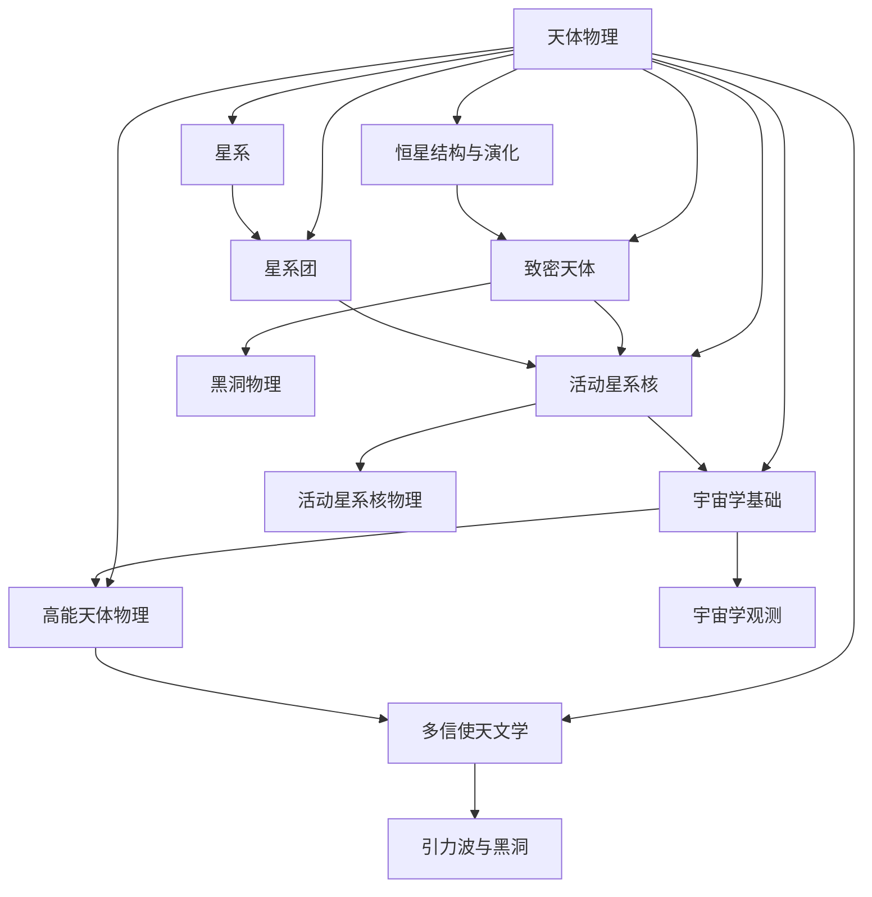
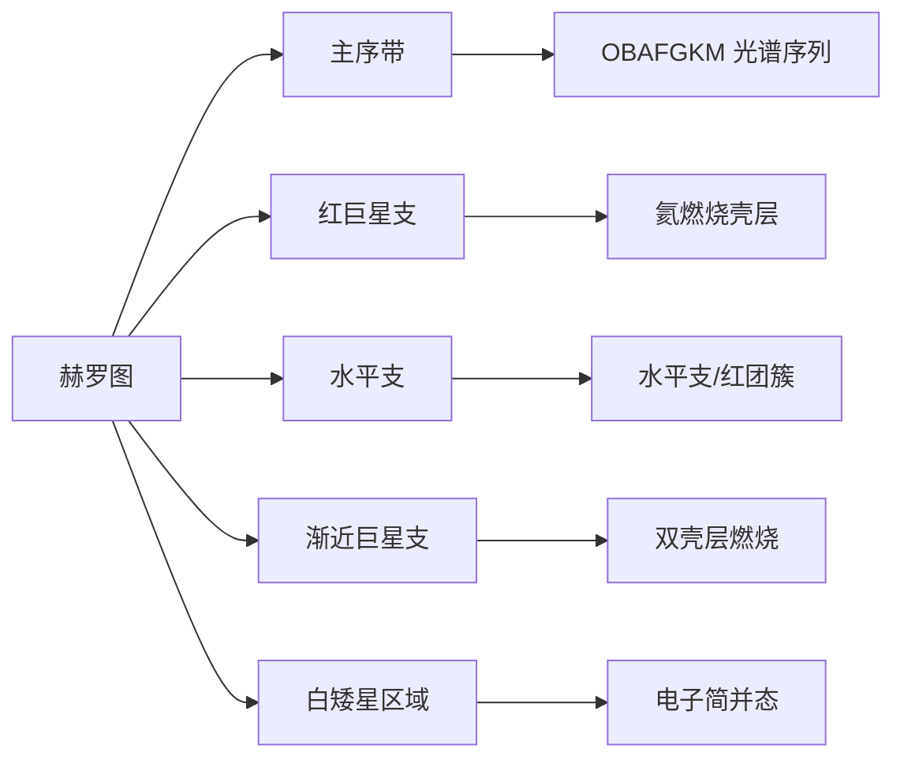
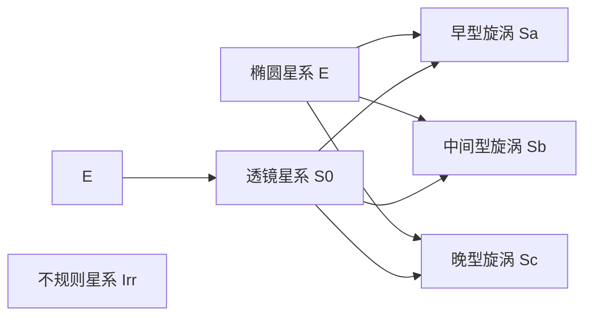

# 天体物理

> [!abstract] 概述
> 天体物理（Astrophysics）是==应用物理学原理研究天体和宇宙的科学==。它将物理学的基本定律——从量子力学到广义相对论——应用于宇宙中各种天体系统的研究，涵盖恒星、星系、星系团、致密天体以及宇宙本身的起源、演化与命运。
>
> 天体物理是物理学最宏大的应用领域：从微观的核反应（恒星能源）到宏观的引力理论（宇宙演化），==物理定律无处不在==。

## 专题地图

## 核心概念速览

| 概念 | 核心公式 | 含义 | 备注 |
|------|----------|------|------|
| 金斯质量 | $M_J = \left(\frac{5k_BT}{Gm}\right)^{3/2}\left(\frac{3}{4\pi\rho}\right)^{1/2}$ | 分子云坍缩的最小质量 | [[#1.1 恒星形成]] |
| 质光关系 | $L \propto M^{3.5}$ | 主序星光度与质量的关系 | [[#1.2 主序星]] |
| 钱德拉塞卡极限 | $M_{Ch} \approx 1.44\,M_\odot$ | 白矮星最大质量 | [[#2.1 白矮星]] |
| 史瓦西半径 | $r_s = \frac{2GM}{c^2}$ | 黑洞事件视界半径 | [[#2.3 黑洞]] |
| 弗里德曼方程 | $H^2 = \frac{8\pi G}{3}\rho - \frac{kc^2}{a^2} + \frac{\Lambda c^2}{3}$ | 宇宙演化的基本方程 | [[#6.1 弗里德曼方程]] |
| 哈勃定律 | $v = H_0 d$ | 宇宙膨胀的观测基础 | [[#6.4 观测证据]] |
| 引力波应变 | $h \sim \frac{2G\ddot{Q}}{c^4 r}$ | 引力波的强度估计 | [[#8.2 引力波]] |

---

## 一、恒星结构与演化

> [!info] 引言
> 恒星是宇宙中最基本的发光天体，理解恒星的形成、演化和死亡是天体物理的核心任务之一。恒星的一生可以用==引力与核能的对抗==来概括：引力试图压缩恒星，而核反应产生的能量则抵抗引力坍缩。

### 1.1 恒星形成

#### 分子云坍缩

恒星诞生于==巨分子云==（Giant Molecular Cloud, GMC）中。GMC 的典型参数为：

- 温度：$T \sim 10\text{--}50\,\text{K}$
- 数密度：$n \sim 10^2\text{--}10^3\,\text{cm}^{-3}$
- 质量：$M \sim 10^4\text{--}10^6\,M_\odot$
- 尺度：$L \sim 10\text{--}100\,\text{pc}$

分子云的坍缩条件由**金斯不稳定性**决定。当分子云的质量超过金斯质量时，引力将克服热压力，导致云团坍缩。

#### 金斯质量

金斯质量的推导基于**维里定理**。考虑一个均匀密度 $\rho$、温度 $T$ 的气体球，其引力势能与热动能分别为：

$$
|E_\text{grav}| = \frac{3}{5}\frac{GM^2}{R}
$$

$$
E_\text{thermal} = \frac{3}{2}Nk_BT = \frac{3}{2}\frac{M}{\mu m_H}k_BT
$$

当 $|E_\text{grav}| > 2E_\text{thermal}$ 时，云团不稳定，发生坍缩。由此得到金斯质量：

$$
\boxed{M_J = \left(\frac{5k_BT}{G\mu m_H}\right)^{3/2}\left(\frac{3}{4\pi\rho}\right)^{1/2}}
$$

> [!example] 数值估计
> 对于 $T = 20\,\text{K}$，$n = 10^3\,\text{cm}^{-3}$ 的典型分子云：
> $$M_J \sim 10^2\text{--}10^3\,M_\odot$$
> 这与观测到的恒星团块质量一致。

#### 原恒星阶段

分子云坍缩后进入**原恒星**（protostar）阶段：

1. **自由坍缩阶段**：云团近似自由落体坍缩，时标为
   $$t_\text{ff} = \sqrt{\frac{3\pi}{32G\rho}} \sim 10^6\,\text{yr}$$

2. **吸积阶段**：中心形成致密核，周围形成吸积盘，物质通过盘落到原恒星上

3. **林忠四郎演化**（Hayashi track）：原恒星在赫罗图上沿几乎垂直的轨迹向主序移动，此时恒星完全对流

4. **亨耶迹**（Henyey track）：质量较大的原恒星在赫罗图上近似水平移动，此时辐射传能逐渐取代对流

> [!note] 关键物理
> 原恒星阶段的核心温度不足以点燃氢燃烧（$T < 10^7\,\text{K}$），恒星的辐射能量来源于==引力势能的释放==（开尔文-亥姆霍兹机制）。

### 1.2 主序星

#### 氢燃烧

当恒星核心温度达到 $T_c \sim 10^7\,\text{K}$ 时，氢燃烧开始，恒星进入**主序**（Main Sequence）阶段。氢燃烧有两种机制：

**质子-质子链**（pp chain）：
$$4^1\text{H} \to {}^4\text{He} + 2e^+ + 2\nu_e + 26.7\,\text{MeV}$$

pp 链在 $T \lesssim 1.5 \times 10^7\,\text{K}$ 时占主导，是太阳等低质量恒星的主要能源。

**CNO 循环**：
$$12\text{C} \xrightarrow{4p} 12\text{C} + {}^4\text{He} + 26.7\,\text{MeV}$$

CNO 循环的温度敏感性远高于 pp 链（$\epsilon \propto T^{18}$ vs. $\epsilon \propto T^4$），在 $T \gtrsim 1.5 \times 10^7\,\text{K}$ 时占主导，是大质量恒星的主要能源。

#### 质光关系

主序星的==质光关系==是天体物理中最重要的经验关系之一：

$$\boxed{L \propto M^{\alpha}, \quad \alpha \approx 3.5}$$

这个关系可以从简单的量纲分析得到理解。假设恒星处于流体静力学平衡和热平衡，通过辐射传能，可以导出：

$$L \sim \frac{M^3}{\kappa} \cdot \frac{\mu^4}{1}$$

其中 $\kappa$ 为不透明度。对于大多数主序星，$\kappa$ 变化不大，因此 $L \propto M^{3\text{--}4}$。

> [!tip] 物理意义
> 质光关系意味着大质量恒星虽然燃料更多，但消耗速率远高于小质量恒星。一颗 $10\,M_\odot$ 的恒星光度约为太阳的 $10^4$ 倍，其主序寿命仅为 $\sim 10^7\,\text{yr}$，而太阳的主序寿命约为 $10^{10}\,\text{yr}$。

#### 赫罗图

**赫罗图**（Hertzsprung-Russell Diagram, HRD）是天体物理中最重要的诊断工具之一。它以恒星的光度（或绝对星等）为纵轴，以表面温度（或光谱型、色指数）为横轴。

主序星在赫罗图上形成一条从左上（高温高光度）到右下（低温低光度）的带状结构。==主序带的位置和宽度包含了恒星年龄、化学成分、对流超调等重要信息==。

### 1.3 恒星演化

#### 红巨星阶段

当核心的氢耗尽后，恒星离开主序，进入**红巨星**阶段：

1. **氢壳层燃烧**：核心收缩升温，周围的氢壳层被点燃
2. **包层膨胀**：外壳膨胀冷却，恒星半径增大 $10\text{--}100$ 倍
3. **表面温度下降**：$T_\text{eff} \sim 3000\text{--}5000\,\text{K}$，呈红色

#### 氦燃烧

当核心温度达到 $T \sim 10^8\,\text{K}$ 时，氦燃烧通过**3α 过程**开始：

$$3\,{}^4\text{He} \to {}^{12}\text{C} + \gamma + 7.275\,\text{MeV}$$

> [!warning] 氦闪
> 对于 $M \lesssim 2\,M_\odot$ 的低质量恒星，氦核心是简并态的。由于简并物质的比热为负，氦燃烧的启动是==热失控==的，产生**氦闪**（helium flash）——在几分钟内释放 $10^{10}\,L_\odot$ 的能量，但大部分被用于解除简并，表面几乎观测不到。

#### 晚期演化

大质量恒星（$M \gtrsim 8\,M_\odot$）经历连续的核燃烧阶段：

$$\text{H} \to \text{He} \to \text{C} \to \text{Ne} \to \text{O} \to \text{Si} \to \text{Fe}$$

每个阶段持续的时间越来越短：

| 燃烧阶段 | 温度（$10^9\,\text{K}$） | 持续时间 |
|----------|------------------------|----------|
| 氢燃烧 | 0.04 | $\sim 10^7\,\text{yr}$ |
| 氦燃烧 | 0.2 | $\sim 10^6\,\text{yr}$ |
| 碳燃烧 | 0.8 | $\sim 10^3\,\text{yr}$ |
| 氖燃烧 | 1.5 | $\sim 1\,\text{yr}$ |
| 氧燃烧 | 2.0 | $\sim 6\,\text{mon}$ |
| 硅燃烧 | 3.5 | $\sim 1\,\text{day}$ |

> [!important] 铁核的形成
> ${}^{56}\text{Fe}$ 是结合能最高的核素。当核心形成铁核后，==进一步的核反应不再释放能量==。铁核的增长导致引力坍缩不可避免，最终引发**核心坍缩超新星**（Core-Collapse Supernova）。

### 1.4 恒星死亡

恒星死亡后的残骸类型取决于其核心质量：

| 初始质量 | 残骸类型 | 典型质量 | 支撑机制 |
|----------|----------|----------|----------|
| $M < 8\,M_\odot$ | 白矮星 | $\sim 0.6\,M_\odot$ | 电子简并压 |
| $8 < M < 25\,M_\odot$ | 中子星 | $\sim 1.4\,M_\odot$ | 中子简并压 |
| $M > 25\,M_\odot$ | 黑洞 | $\sim 3\text{--}30\,M_\odot$ | 无（事件视界） |

---

## 二、致密天体

> [!info] 引言
> 致密天体是恒星演化末期的产物，其物质处于极端条件下——密度可达 $10^{15}\,\text{g/cm}^3$，磁场可达 $10^{15}\,\text{G}$。研究致密天体需要==量子力学、狭义相对论和广义相对论==的综合运用。

### 2.1 白矮星

#### 电子简并压

白矮星由==电子简并压==支撑。根据泡利不相容原理，费米子不能占据相同的量子态。在极端高密度下，电子被压缩到动量空间的高能态，产生巨大的压力。

非相对论性简并电子气的压强为：

$$
P = \frac{(3\pi^2)^{2/3}\hbar^2}{5m_e}n_e^{5/3} \propto \rho^{5/3}
$$

极端相对论性情况下：

$$
P = \frac{(3\pi^2)^{1/3}\hbar c}{4}n_e^{4/3} \propto \rho^{4/3}
$$

#### 钱德拉塞卡极限

> [!quote] 钱德拉塞卡（1931）
> 当白矮星质量增大时，电子越来越接近相对论性极限。在极端相对论情况下，$P \propto \rho^{4/3}$，而流体静力学平衡要求 $P \propto \rho^{4/3}$，两者恰好匹配——这意味着==存在一个最大质量==。

通过求解相对论性简并电子气的流体静力学平衡方程（即**钱德拉塞卡方程**），得到白矮星的最大质量：

$$
\boxed{M_{Ch} = \frac{5.83}{\mu_e^2}M_\odot \approx 1.44\,M_\odot}
$$

其中 $\mu_e$ 为每个电子对应的核子数（对于碳/氧白矮星，$\mu_e = 2$）。

#### 质量-半径关系

白矮星有一个反直觉的==质量-半径关系==：

$$
R \propto M^{-1/3}
$$

质量越大的白矮星，半径反而越小！这是因为更大的质量需要更高的简并压来支撑，电子被压缩到更高的动量态。

典型白矮星参数：
- 质量：$M \sim 0.5\text{--}1.0\,M_\odot$
- 半径：$R \sim 0.01\,R_\odot \sim R_\oplus$（地球大小）
- 密度：$\rho \sim 10^6\,\text{g/cm}^3$
- 表面重力：$\log g \sim 7\text{--}9$

### 2.2 中子星

#### 中子简并压

当恒星核心质量超过钱德拉塞卡极限时，电子被压入质子形成中子（逆β衰变）：

$$
e^- + p \to n + \nu_e
$$

中子星由==中子简并压==和强核力排斥支撑。

#### 典型参数

中子星是宇宙中==最致密的可见天体==：

| 参数 | 典型值 |
|------|--------|
| 质量 | $M \sim 1.4\,M_\odot$（观测范围 $1.0\text{--}2.3\,M_\odot$） |
| 半径 | $R \sim 10\,\text{km}$ |
| 密度 | $\rho \sim 10^{14}\text{--}10^{15}\,\text{g/cm}^3$（核密度） |
| 表面磁场 | $B \sim 10^{8}\text{--}10^{15}\,\text{G}$ |
| 自转周期 | $P \sim 1\,\text{ms}\text{--}10\,\text{s}$ |
| 表面逃逸速度 | $v_\text{esc} \sim 0.3\text{--}0.5\,c$ |

> [!note] TOV 极限
> 中子星的最大质量由**奥本海默-沃尔科夫方程**（Tolman-Oppenheimer-Volkoff equation）决定：
> $$\frac{dP}{dr} = -\frac{G(\rho + P/c^2)(m + 4\pi r^3 P/c^2)}{r^2(1 - 2Gm/rc^2)}$$
> 这是广义相对论框架下的流体静力学平衡方程。中子星的最大质量取决于核物质状态方程，目前估计 $M_\text{TOV} \sim 2.0\text{--}2.5\,M_\odot$。

#### 脉冲星

**脉冲星**是旋转的中子星，其强磁场和快速自转产生沿磁轴发射的电磁辐射束。由于磁轴与自转轴不重合，辐射束在空间中扫过，当它指向地球时，我们就能观测到周期性的脉冲信号。

脉冲星的自转减慢率（$\dot{P}$）可以用来估计其表面磁场：

$$
B \sim 3.2 \times 10^{19}\sqrt{P\dot{P}}\,\text{G}
$$

其中 $P$ 以秒为单位。

> [!tip] 毫秒脉冲星
> 毫秒脉冲星（$P \sim 1\text{--}10\,\text{ms}$）是==再循环脉冲星==——它们通过吸积伴星物质被加速到极快自转。毫秒脉冲星的自转稳定性可与原子钟媲美，被用于引力波探测和广义相对论检验。

### 2.3 黑洞

黑洞是广义相对论预言的最极端的天体。其基本特征由**无毛定理**描述：黑洞仅由==质量 $M$、自旋 $a$、电荷 $Q$==三个参数完全确定。

#### 恒星质量黑洞

- 质量范围：$M \sim 3\text{--}100\,M_\odot$
- 形成方式：大质量恒星核心坍缩
- 观测方式：X 射线双星（如 Cyg X-1）、引力波事件

#### 超大质量黑洞

- 质量范围：$M \sim 10^6\text{--}10^{10}\,M_\odot$
- 位置：几乎所有大质量星系的中心
- 观测方式：活动星系核、恒星动力学、事件视界望远镜（EHT）

> [!example] 银河系中心
> 银河系中心存在一个质量为 $M \sim 4 \times 10^6\,M_\odot$ 的超大质量黑洞——**人马座 A***（Sgr A*）。通过追踪 S2 等恒星的轨道运动，2020 年诺贝尔物理学奖授予了 Reinhard Genzel 和 Andrea Ghez。

黑洞的详细物理参见 [[黑洞物理]]。

---

## 三、星系

> [!info] 引言
> 星系是宇宙中==引力束缚的基本单元==，由恒星、气体、尘埃和暗物质组成。一个典型的星系包含 $10^9\text{--}10^{12}$ 颗恒星，质量范围从矮星系的 $10^7\,M_\odot$ 到巨椭圆星系的 $10^{13}\,M_\odot$。

### 3.1 星系分类

#### 哈勃序列

哈勃（1926）提出的星系分类方案——**哈勃音叉图**——至今仍是星系形态学的基础：

#### 椭圆星系（E）

- 形态：光滑、无结构、椭球形
- 分类：E0（圆）到 E7（最扁）
- 特征：老年恒星为主，气体含量低，恒星形成已停止
- 质量：$10^7\text{--}10^{13}\,M_\odot$
- 亮度轮廓：Sérsic 轮廓 $I(R) \propto \exp\left[-b_n\left(R/R_e\right)^{1/n}\right]$

#### 旋涡星系（S）

- 形态：盘状结构 + 旋臂 + 中心核球
- 分类：Sa（大核球、紧缠旋臂）→ Sc（小核球、松散旋臂）
- 特征：盘中有活跃恒星形成，旋臂是密度波
- 太阳位于银河系的猎户臂上，距银心约 $8\,\text{kpc}$

#### 不规则星系（Irr）

- 形态：无规则结构
- 特征：丰富气体，活跃恒星形成
- 典型例子：大麦哲伦云（LMC）、小麦哲伦云（SMC）

### 3.2 星系动力学

#### 旋转曲线

旋涡星系的==旋转曲线==是暗物质存在的最直接证据之一。

根据开普勒定律，如果星系的质量集中在可见物质范围内，旋转速度应在边缘处下降：

$$
v(r) = \sqrt{\frac{GM(r)}{r}}
$$

然而，观测显示旋转曲线在远离中心处==保持平坦==（$v \sim \text{const}$），这意味着：

$$
M(r) \propto r \quad \Rightarrow \quad \rho(r) \propto r^{-2}
$$

> [!important] 暗物质晕
> 旋转曲线的平坦性表明星系嵌入在一个巨大的==暗物质晕==中。暗物质晕的质量通常是可见物质的 $5\text{--}10$ 倍，延伸范围远超可见盘。暗物质的本质是现代物理学最大的未解之谜之一。

#### 速度弥散

椭圆星系没有净旋转，其动力学由==速度弥散== $\sigma$ 描述。通过 Jeans 方程可以建立速度弥散与质量分布的关系：

$$
\frac{d(\nu\sigma_r^2)}{dr} + \frac{2\beta}{r}\nu\sigma_r^2 = -\nu\frac{d\Phi}{dr}
$$

其中 $\nu$ 为示踪星体的数密度，$\beta = 1 - \sigma_t^2/\sigma_r^2$ 为各向异性参数。

### 3.3 星系形成

#### 等级成团

在冷暗物质（CDM）宇宙学框架下，星系形成遵循==等级成团==（hierarchical clustering）模式：小结构先形成，然后通过并合逐步构建大结构。

#### 并合历史

星系并合是星系演化的重要驱动力：

- **大并合**（质量比 $\lesssim 3:1$）：破坏盘结构，形成椭圆星系
- **小并合**（质量比 $\gtrsim 3:1$）：增加星系质量，加热盘
- **潮汐剥离**：产生潮汐尾、星流等结构

#### 恒星形成历史

宇宙的恒星形成率在 $z \sim 2\text{--}3$（宇宙年龄 $\sim 2\text{--}3\,\text{Gyr}$）达到峰值，之后逐渐下降：

$$
\dot{\rho}_\star(z) \propto \begin{cases} (1+z)^{3.4} & z \lesssim 1 \\ (1+z)^{-0.5} & z \gtrsim 1 \end{cases}$$

---

## 四、星系团

> [!info] 引言
> 星系团是宇宙中==最大的引力束缚结构==，包含数百到数千个星系、大量的热气体（$T \sim 10^7\text{--}10^8\,\text{K}$）和暗物质。星系团的总质量可达 $10^{14}\text{--}10^{15}\,M_\odot$，尺度达数 Mpc。

### 4.1 观测特征

#### 热气体（X射线）

星系团中充满了温度高达 $10^7\text{--}10^8\,\text{K}$ 的热气体，通过**热轫致辐射**发出强烈的 X 射线辐射。热气体的 X 射线光度可达：

$$
L_X \sim 10^{43}\text{--}10^{45}\,\text{erg/s}
$$

X 射线光谱中的铁线等特征可以测量气体的温度和金属丰度。

#### 星系成员

星系团包含数百到数千个成员星系。最亮的星系（BCG）通常位于星团中心，其质量可达 $10^{12}\,M_\odot$。

#### 引力透镜

星系团的巨大质量使其成为天然的==引力透镜==。背景星系的图像被扭曲成弧形（引力弧），通过分析这些弧可以重建星团的质量分布。

### 4.2 质量测量

星系团的质量可以通过多种独立方法测量，这些方法的一致性是对 $\Lambda$CDM 模型的重要检验：

#### 维里定理

假设星系团处于维里平衡，通过成员星系的速度弥散 $\sigma_v$ 估计质量：

$$
M \sim \frac{5\sigma_v^2 R}{G}
$$

#### X射线气体

假设热气体处于流体静力学平衡：

$$
M(r) = -\frac{k_BT r}{G\mu m_p}\left(\frac{d\ln\rho}{d\ln r} + \frac{d\ln T}{d\ln r}\right)
$$

#### 引力透镜

强引力透镜给出星团核心的投影质量，弱引力透镜给出大尺度质量分布。

> [!note] 质量组成
> 星系团的质量组成为：
> - 暗物质：$\sim 80\%$
> - 热气体：$\sim 15\%$
> - 星系：$\sim 5\%$
>
> 这与宇宙学的物质组成比例一致，说明星系团是==宇宙的微观样本==。

### 4.3 星系团物理

#### 冷却流问题

热气体的辐射冷却时标在星团中心往往短于哈勃时间：

$$
t_\text{cool} = \frac{3nk_BT}{n_en_i\Lambda(T)} \sim 10^8\text{--}10^9\,\text{yr}
$$

如果没有加热机制，中心气体应该快速冷却并形成大量恒星——但观测上并未发现大量冷气体和恒星形成。这就是**冷却流问题**（cooling flow problem）。

#### 反馈机制

目前认为，中心超大质量黑洞的**射电喷流**通过加热周围气体解决了冷却流问题。这种**AGN 反馈**机制是星系形成理论中的关键环节。

#### 磁场

星系团中存在 $\sim \mu\text{G}$ 量级的磁场，通过法拉第旋转测量和射电晕/射电遗迹等现象被探测到。磁场的起源和演化仍是活跃的研究领域。

---

## 五、活动星系核

> [!info] 引言
> 活动星系核（Active Galactic Nuclei, AGN）是宇宙中==最明亮的持续辐射源==，其光度可达 $10^{45}\text{--}10^{48}\,\text{erg/s}$，远超普通星系。AGN 的能量来源于中心超大质量黑洞的吸积过程。

### 5.1 基本特征

- **高光度**：$L \sim 10^{40}\text{--}10^{48}\,\text{erg/s}$，可超过宿主星系
- **非热辐射**：辐射谱从射电延伸到伽马射线，不服从热辐射分布
- **光变**：在从日到年的时间尺度上都有光变，说明辐射区域很小
- **喷流**：部分 AGN 产生相对论性喷流，延伸可达 Mpc 尺度
- **偏振**：辐射具有显著的线偏振和圆偏振

### 5.2 分类

AGN 的分类主要基于观测特征，本质上可以用==观测角度==和==吸积率==两个参数统一解释：

| 类型 | 特征 | 射电特性 |
|------|------|----------|
| 赛弗特 I 型 | 宽 + 窄发射线 | 射电宁静 |
| 赛弗特 II 型 | 仅窄发射线 | 射电宁静 |
| 类星体（QSO） | 高光度，点源状 | 部分有射电 |
| BL Lac 天体 | 无发射线，强偏振，光变剧烈 | 射电强 |
| 射电星系 | 强射电喷流和瓣 | 射电强 |

### 5.3 中心引擎

AGN 的中心引擎是==超大质量黑洞吸积==系统：

1. **超大质量黑洞**：$M \sim 10^6\text{--}10^{10}\,M_\odot$
2. **吸积盘**：物质通过吸积盘落入黑洞，引力能转化为辐射能
3. **宽线区**（BLR）：距黑洞 $\sim 0.01\text{--}1\,\text{pc}$，气体速度 $\sim 10^4\,\text{km/s}$
4. **窄线区**（NLR）：距黑洞 $\sim 1\text{--}1000\,\text{pc}$，气体速度 $\sim 10^3\,\text{km/s}$
5. **尘埃环**（Torus）：距黑洞 $\sim 1\text{--}10\,\text{pc}$，遮挡中心区域

吸积释放的效率可达质能转换效率的 $\sim 10\%$：

$$
L = \eta \dot{M} c^2, \quad \eta \sim 0.1
$$

> [!tip] 爱丁顿极限
> 吸积率受到**爱丁顿极限**的约束。当光度超过爱丁顿光度时，辐射压将吹散吸积物质：
> $$L_\text{Edd} = \frac{4\pi GMm_p c}{\sigma_T} \approx 1.3 \times 10^{38}\left(\frac{M}{M_\odot}\right)\,\text{erg/s}$$

详细的 AGN 物理参见 [[活动星系核物理]]。

---

## 六、宇宙学基础

> [!info] 引言
> 宇宙学是研究==宇宙整体性质、起源和演化==的科学。现代宇宙学建立在广义相对论和宇宙学原理之上，通过弗里德曼方程描述宇宙的演化历史。

### 6.1 弗里德曼方程

从爱因斯坦场方程出发，假设宇宙是均匀各向同性的（**宇宙学原理**），度规取 FLRW 形式：

$$
ds^2 = -c^2dt^2 + a^2(t)\left[\frac{dr^2}{1-kr^2} + r^2(d\theta^2 + \sin^2\theta\,d\phi^2)\right]
$$

代入爱因斯坦场方程 $G_{\mu\nu} + \Lambda g_{\mu\nu} = \frac{8\pi G}{c^4}T_{\mu\nu}$，得到**弗里德曼方程**：

$$
\boxed{H^2 = \left(\frac{\dot{a}}{a}\right)^2 = \frac{8\pi G}{3}\rho - \frac{kc^2}{a^2} + \frac{\Lambda c^2}{3}}
$$

$$
\frac{\ddot{a}}{a} = -\frac{4\pi G}{3}\left(\rho + \frac{3P}{c^2}\right) + \frac{\Lambda c^2}{3}
$$

#### 哈勃参数

$$
H(t) = \frac{\dot{a}}{a}
$$

当前值 $H_0 = 100h\,\text{km/s/Mpc}$，其中 $h \approx 0.67\text{--}0.73$（不同测量方法存在 $\sim 5\sigma$ 的张力——**哈勃张力**）。

#### 临界密度

定义临界密度为 $k=0$（平坦宇宙）时的密度：

$$
\rho_c = \frac{3H_0^2}{8\pi G} \approx 1.88 \times 10^{-29}h^2\,\text{g/cm}^3 \sim 5\,\text{protons/m}^3
$$

### 6.2 宇宙演化

宇宙在不同时期由不同的成分主导：

| 时期 | 主导成分 | 标度因子演化 | 时间范围 |
|------|----------|-------------|----------|
| 辐射主导 | 光子、相对论性中微子 | $a(t) \propto t^{1/2}$ | $t < 47\,\text{kyr}$ |
| 物质主导 | 暗物质、重子物质 | $a(t) \propto t^{2/3}$ | $47\,\text{kyr} < t < 9\,\text{Gyr}$ |
| 暗能量主导 | 宇宙学常数 $\Lambda$ | $a(t) \propto e^{Ht}$ | $t > 9\,\text{Gyr}$ |

> [!note] 物质-辐射等值
> 在辐射主导时期，$\rho_r \propto a^{-4}$（体积膨胀 + 红移），而 $\rho_m \propto a^{-3}$。因此在足够早期，辐射必然主导。等值时刻对应 $z_\text{eq} \approx 3400$。

### 6.3 宇宙学参数

现代宇宙学的标准模型（$\Lambda$CDM）由以下参数描述：

| 参数 | 符号 | 观测值（Planck 2018） |
|------|------|----------------------|
| 哈勃常数 | $H_0$ | $67.4 \pm 0.5\,\text{km/s/Mpc}$ |
| 物质密度参数 | $\Omega_m$ | $0.315 \pm 0.007$ |
| 暗能量密度参数 | $\Omega_\Lambda$ | $0.685 \pm 0.007$ |
| 重子密度参数 | $\Omega_b$ | $0.0493 \pm 0.0004$ |
| 曲率密度参数 | $\Omega_k$ | $\sim 0$（平坦） |
| 密度扰动振幅 | $\sigma_8$ | $0.811 \pm 0.006$ |
| 谱指数 | $n_s$ | $0.965 \pm 0.004$ |

这些参数决定了宇宙的==年龄、大小和命运==：

- **年龄**：$t_0 = \int_0^1 \frac{da}{aH(a)} \approx 13.8\,\text{Gyr}$
- **粒子视界**：$d_H = c\int_0^{t_0}\frac{dt}{a(t)} \approx 46\,\text{Gly}$
- **命运**：在 $\Lambda > 0$ 的情况下，宇宙将永远膨胀下去

### 6.4 观测证据

现代宇宙学建立在多个独立的观测支柱之上：

#### 哈勃膨胀

1929 年，哈勃发现星系的退行速度与距离成正比：

$$
v = H_0 d
$$

这是宇宙膨胀的直接证据。现代测量将哈勃图延伸到 $z > 10$（JWST 已发现 $z \sim 13$ 的星系）。

#### 宇宙微波背景辐射（CMB）

CMB 是大爆炸的余辉，温度 $T = 2.725\,\text{K}$，对应 $z \approx 1100$。CMB 的各向异性（$\Delta T/T \sim 10^{-5}$）包含了宇宙学参数的丰富信息。

CMB 功率谱的特征峰给出了：
- 第一峰位置 → 宇宙曲率（平坦）
- 峰高比 → 重子密度 $\Omega_b$
- 阻尼尾 → 物质密度 $\Omega_m$

#### 轻元素丰度

**大爆炸核合成**（BBN）在 $t \sim 1\text{--}200\,\text{s}$ 期间产生了轻元素：

- ${}^4\text{He}$：质量丰度 $Y_p \approx 0.247$
- D/H $\sim 2.5 \times 10^{-5}$
- ${}^3\text{He}$/H $\sim 10^{-5}$
- ${}^7\text{Li}$/H $\sim 10^{-10}$（锂问题：观测值低于理论预测约 3 倍）

详细的宇宙学观测方法参见 [[宇宙学观测]]。

---

## 七、高能天体物理

> [!info] 引言
> 高能天体物理研究宇宙中能量最高的现象，包括伽马射线暴、宇宙线和天体物理中微子。这些现象涉及==极端条件下的物理过程==——相对论性喷流、粒子加速到 $10^{20}\,\text{eV}$、致密天体的并合等。

### 7.1 伽马射线暴

**伽马射线暴**（GRB）是宇宙中==最剧烈的爆发现象==，在几秒到几分钟内释放 $10^{51}\text{--}10^{54}\,\text{erg}$ 的能量。

#### 长暴与短暴

| 特征 | 长暴（$T_{90} > 2\,\text{s}$） | 短暴（$T_{90} < 2\,\text{s}$） |
|------|-------------------------------|-------------------------------|
| 起源 | 大质量恒星核心坍缩 | 双中子星/中子星-黑洞并合 |
| 宿主星系 | 恒星形成活跃的矮星系 | 各种类型，包括椭圆星系 |
| 环境 | 恒星形成区 | 不一定在恒星形成区 |
| 千新星 | 无 | 有（r-过程核合成） |
| 超新星 | 伴随 Ic 型超新星 | 无 |

#### 中心引擎

- 长暴：**极超新星**（hypernova）——快速旋转的黑洞 + 吸积盘
- 短暴：**双致密星并合**——形成黑洞或大质量中子星

两种情况都产生==极端相对论性喷流==（$\Gamma \sim 100\text{--}1000$），通过内激波和光球辐射产生伽马射线。

#### 余辉

喷流与星际介质的相互作用产生从 X 射线到射电的==余辉辐射**（afterglow）==，持续数天到数月。余辉的多波段观测是 GRB 红移测量和宇宙学应用的基础。

### 7.2 宇宙线

#### 能谱

宇宙线的能谱跨越超过 11 个数量级，可以用分段幂律描述：

$$
\frac{dN}{dE} \propto E^{-\alpha}
$$

- $E < 4 \times 10^{15}\,\text{eV}$：$\alpha \approx 2.7$（银河系宇宙线）
- $4 \times 10^{15} < E < 4 \times 10^{18}\,\text{eV}$：$\alpha \approx 3.1$（**膝**结构）
- $E > 4 \times 10^{18}\,\text{eV}$：$\alpha \approx 2.6$（**踝**结构，可能为河外起源）
- $E > 5 \times 10^{19}\,\text{eV}$：流量急剧下降（**GZK 截断**）

#### 起源

- $E < 10^{15}\,\text{eV}$：银河系内加速（超新星遗迹、脉冲星风云等）
- $E > 10^{18}\,\text{eV}$：河外起源（活动星系核、伽马射线暴等）

#### 加速机制

**费米加速**（扩散激波加速）是最广泛接受的宇宙线加速机制。在激波前后，粒子反复穿越激波面，每次获得 $\Delta E/E \sim v_s/c$ 的能量。最大能量受限于：

$$
E_\text{max} \sim Z e B R \frac{v_s}{c}
$$

其中 $B$ 为磁场强度，$R$ 为加速区尺度，$v_s$ 为激波速度。

### 7.3 中微子天文学

#### 太阳中微子

太阳内部的核反应产生大量电子中微子。**太阳中微子问题**（观测通量仅为理论预测的 $\sim 1/3$）最终通过**中微子振荡**解决——这证明中微子具有非零质量。

$$
\nu_e \to \nu_\mu \to \nu_\tau
$$

#### 超新星中微子

1987 年超新星 SN1987A 的中微子探测（Kamiokande, IMB）标志着**中微子天文学**的诞生。超新星爆发释放的总能量中，$\sim 99\%$ 以中微子形式带走：

$$
E_\nu \sim 3 \times 10^{53}\,\text{erg}
$$

#### 高能中微子

IceCube 探测器在 2013 年首次探测到==高能天体物理中微子==（$E \sim \text{PeV}$），其来源可能包括活动星系核、伽马射线暴、潮汐瓦解事件等。2018 年，IceCube 将一个高能中微子与一个耀变体（TXS 0506+056）关联，提供了河外高能中微子源的第一个证据。

---

## 八、多信使天文学

> [!info] 引言
> 多信使天文学是==21 世纪天体物理的革命性发展==。通过同时利用电磁波、引力波、中微子和宇宙线四种信使，我们可以从多个角度研究同一天体物理事件，获得比单一信使丰富得多的物理信息。

### 8.1 电磁波

电磁波是最传统也是最丰富的天文信使，覆盖全波段：

| 波段 | 波长范围 | 典型辐射机制 | 代表设备 |
|------|----------|-------------|----------|
| 射电 | $> 1\,\text{mm}$ | 同步辐射、脉泽 | FAST, ALMA, SKA |
| 微波 | $1\text{--}10\,\text{mm}$ | CMB、分子转动跃迁 | Planck, ACT |
| 红外 | $1\text{--}100\,\mu\text{m}$ | 热辐射、尘埃 | JWST, Spitzer |
| 光学 | $400\text{--}700\,\text{nm}$ | 恒星光球、谱线 | HST, VLT, Keck |
| 紫外 | $10\text{--}400\,\text{nm}$ | 热恒星、吸积盘 | HST, XMM-Newton |
| X射线 | $0.01\text{--}10\,\text{nm}$ | 热气体、吸积、喷流 | Chandra, XMM-Newton |
| 伽马射线 | $< 0.01\,\text{nm}$ | 逆康普顿、$\pi^0$ 衰变 | Fermi, CTA |

### 8.2 引力波

引力波是时空曲率的涟漪，由加速的质量四极矩产生。

#### LIGO/Virgo

2015 年 9 月 14 日，LIGO 首次直接探测到引力波信号 **GW150914**——来自两个 $\sim 30\,M_\odot$ 黑洞的并合。这一发现获得了 2017 年诺贝尔物理学奖。

引力波应变的估计：

$$
h \sim \frac{4G}{c^4}\frac{\mathcal{M}^{5/3}(\pi f)^{2/3}}{d_L}
$$

其中 $\mathcal{M} = (m_1 m_2)^{3/5}/(m_1+m_2)^{1/5}$ 为**啁啾质量**。

#### 双致密星并合

2017 年 8 月 17 日，LIGO/Virgo 探测到双中子星并合事件 **GW170817**，同时观测到了电磁对应体（GRB 170817A 和千新星 AT2017gfo），标志着**多信使天文学**时代的开启。

详细的引力波物理参见 [[引力波与黑洞]]。

### 8.3 中微子

IceCube 是位于南极的冰立方中微子观测站，利用 1 km$^3$ 的冰层作为探测介质。

- **探测机制**：中微子与冰中的核子发生带电流/中性流相互作用，产生次级粒子（μ、e、τ 或强子簇射），发出切伦科夫光
- **能量范围**：$\text{GeV}\text{--}\text{PeV}$
- **关键发现**：弥散高能中微子本底、点源候选体（TXS 0506+056）

### 8.4 宇宙线

宇宙线的地面探测主要通过**广延大气簇射**（EAS）：

- **地面阵列**：Pierre Auger Observatory（$3000\,\text{km}^2$ 水切伦科夫探测器阵列）
- **荧光望远镜**：观测 EAS 激发氮气发出的荧光光
- **最高能事件**：Oh-My-God 粒子（$E \sim 3 \times 10^{20}\,\text{eV}$，1991 年）

> [!warning] GZK 截断
> 能量超过 $E_\text{GZK} \sim 5 \times 10^{19}\,\text{eV}$ 的宇宙线质子会与 CMB 光子发生 $\Delta$ 共振：
> $$p + \gamma_\text{CMB} \to \Delta^+ \to p + \pi^0 \quad \text{或} \quad n + \pi^+$$
> 这限制了宇宙线的传播距离 $\lesssim 100\,\text{Mpc}$（**GZK 视界**），超高能宇宙线的源必须在本地宇宙中。

---

## 延伸阅读

- [[活动星系核物理]]——AGN 的分类、物理模型与观测
- [[黑洞物理]]——黑洞的理论与观测，从恒星质量到超大质量
- [[宇宙学观测]]——CMB、大尺度结构、超新星等宇宙学探针
- [[引力波与黑洞]]——引力波探测与致密双星并合物理

---

%%
天体物理是物理学最宏大的应用领域
从恒星到宇宙，物理定律无处不在
从量子涨落到宇宙大尺度结构
从核反应到超新星爆发
从黑洞到引力波
每一个发现都是人类智慧的胜利
%%
