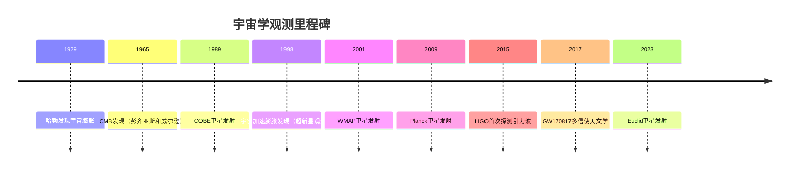

# 宇宙学观测

> [!quote] 卡尔·萨根
> "宇宙不仅比我们想象的更奇妙，它比我们能够想象的还要更奇妙。"

==宇宙学观测是检验宇宙学模型和探索宇宙起源、演化的关键手段==。通过多波段、多信使的观测技术，物理学家得以重建宇宙从大爆炸至今的完整历史，精确测定宇宙的基本参数，并揭示暗物质和暗能量等深层奥秘。

## 一、宇宙微波背景辐射（CMB）

### 1.1 发现与性质

1965年，阿诺·彭齐亚斯（Arno Penzias）和罗伯特·威尔逊（Robert Wilson）在贝尔实验室使用一台为卫星通信设计的喇叭天线时，意外发现了一种无法消除的微波噪声。这种噪声具有以下特征：

- **黑体谱**：辐射谱完美符合温度为 $T = 2.725 \pm 0.001 \text{ K}$ 的黑体辐射曲线
- **各向同性**：在各个方向上的强度几乎完全相同，差异小于十万分之一
- **弥漫全天**：来自宇宙各个方向，而非某个特定天体

> [!note] 历史意义
> 这一发现为大爆炸理论提供了决定性证据，终结了稳恒态宇宙模型的争论。彭齐亚斯和威尔逊因此获得1978年诺贝尔物理学奖。

CMB的物理起源可以追溯到宇宙年龄约38万年时的**复合时期**（recombination）。在此之前，宇宙温度极高，电子和质子以等离子体形式存在，光子频繁与自由电子散射（[[汤姆孙散射]]），宇宙对光子不透明。随着宇宙膨胀冷却，温度降至约3000K时，电子与质子结合形成中性氢原子，光子得以自由传播。这些光子经过138亿年的红移，如今以微波形式被我们观测到。

**CMB的黑体谱特性**：
CMB的能谱是自然界中最完美的黑体谱之一。COBE卫星的FIRAS仪器测量显示，CMB谱与理论黑体谱的偏差小于 $10^{-4}$。这一精确的黑体谱特性证明了早期宇宙处于热平衡状态，是大爆炸理论的关键证据。

**偶极各向异性**：
CMB最大的各向异性是偶极模式，幅度约为 $\Delta T/T \sim 10^{-3}$。这主要是由地球相对于CMB静止参考系的运动引起的多普勒效应。扣除偶极后，CMB的真实各向异性仅为 $\sim 10^{-5}$ 量级。

### 1.2 CMB各向异性

尽管CMB在大尺度上高度均匀，但精密观测揭示了微小的温度涨落：

$$
\frac{\Delta T}{T} \sim 10^{-5}
$$

这些微小的温度差异蕴含着宇宙早期结构形成的种子信息。

> [!important] 角功率谱
> CMB各向异性通常用球谐函数展开的角功率谱 $C_\ell$ 来描述：
> $$
> C(\theta) = \sum_{\ell=1}^{\infty} \frac{2\ell+1}{4\pi} C_\ell P_\ell(\cos\theta)
> $$
> 其中 $\ell$ 是多极矩，对应角尺度 $\theta \sim 180°/\ell$。

CMB功率谱呈现出显著的**声学峰**结构：

- **第一声学峰**（$\ell \approx 200$）：对应宇宙空间曲率，峰值位置表明宇宙是平坦的（$\Omega_k \approx 0$）
- **第二声学峰**（$\ell \approx 500$）：对重子密度敏感，用于测定 $\Omega_b$
- **第三声学峰**（$\ell \approx 800$）：约束物质密度 $\Omega_m$

**阻尼尾**（Damping Tail）：
在高多极矩（$\ell > 1000$）区域，CMB功率谱呈现指数衰减。这是由于光子在最后散射面上扩散（Silk阻尼）导致的，反映了原初扰动的耗散效应。阻尼尾的测量提供了关于复合物理和原初功率谱截止的重要信息。

### 1.3 物理起源

CMB各向异性的物理机制包括：

**原初密度涨落**：暴胀时期的量子涨落被放大为宇宙尺度的密度扰动，这是结构形成的种子。暴胀理论预言原初功率谱接近尺度不变（Harrison-Zel'dovich谱），即 $P(k) \propto k^{n_s}$，其中 $n_s \approx 0.965$（Planck测量值）。这种微小的偏离（$n_s$ 略小于1）是暴胀模型的关键预言之一。

**重子声学振荡**：在复合之前，重子-光子流体在引力作用下坍缩，但光子压力产生向外的辐射压，形成声波振荡。不同尺度的振荡在复合时刻"冻结"，在功率谱中留下特征印记。声学振荡的物理可以用流体方程描述：

$$
\ddot{\delta}_\gamma + c_s^2 k^2 \delta_\gamma = -k^2 \Phi
$$

其中 $\delta_\gamma$ 是光子密度扰动，$c_s = c/\sqrt{3}$ 是声速，$\Phi$ 是引力势。

**萨克斯-瓦福效应**（Sachs-Wolfe Effect）：
- **普通S-W效应**：光子从引力势阱中爬出时损失能量，导致温度降低。在大尺度（$\ell < 100$）上占主导，给出 $\Delta T/T = \Phi/3c^2$
- **积分S-W效应**：宇宙加速膨胀导致引力势随时间变化，光子穿过时获得净能量。这是暗能量存在的重要证据之一

**多普勒效应**：
最后散射面上的重子-光子流体具有宏观运动速度，产生多普勒频移。这在小尺度（高 $\ell$）上对CMB各向异性有贡献。

> [!tip] 偏振信号
> CMB光子在最后散射面上经历汤姆孙散射会产生偏振。偏振场可分解为：
> - **E模式**：标量密度扰动产生，已被观测确认
> - **B模式**：原初引力波产生，是检验暴胀理论的关键信号，尚未被探测到

### 1.4 观测设备

CMB观测经历了三代里程碑式的卫星实验：

**COBE卫星**（1989-1993）：
- 首次精确测量CMB黑体谱，确认温度 $T = 2.725 \text{ K}$
- 首次探测到CMB各向异性，$\Delta T/T \sim 10^{-5}$
- 角分辨率7°，仅能探测大尺度结构
- 三个主要仪器：FIRAS（远红外绝对光谱仪）、DMR（差分微波辐射计）、DIRBE（弥漫红外背景实验）

**WMAP卫星**（2001-2010）：
- 角分辨率提高到0.2°
- 精确测定宇宙学参数，确立 $\Lambda$CDM 标准模型
- 测量宇宙年龄 $t_0 = 13.7 \pm 0.2 \text{ Gyr}$
- 首次精确测量CMB偏振，确认再电离时代
- 位于日地第二拉格朗日点（L2）

**Planck卫星**（2009-2013）：
- 角分辨率达5角分，灵敏度达到 $\Delta T/T \sim 10^{-6}$
- 提供最精确的宇宙学参数测量
- 首次精确测量CMB偏振
- 两个仪器：LFI（低频仪器，30-70 GHz）和HFI（高频仪器，100-857 GHz）
- 冷却到0.1K，是太空史上最冷的物体之一

### 1.5 宇宙学参数

Planck 2018数据给出的关键宇宙学参数：

| 参数 | 符号 | 数值 | 物理意义 |
|------|------|------|----------|
| 哈勃常数 | $H_0$ | $67.4 \pm 0.5 \text{ km/s/Mpc}$ | 当前宇宙膨胀速率 |
| 物质密度 | $\Omega_m$ | $0.315 \pm 0.007$ | 物质（包括暗物质）占总能量密度比例 |
| 暗能量密度 | $\Omega_\Lambda$ | $0.685 \pm 0.007$ | 暗能量占总能量密度比例 |
| 重子密度 | $\Omega_b$ | $0.0493 \pm 0.0004$ | 普通物质占总能量密度比例 |
| 曲率 | $\Omega_k$ | $0.001 \pm 0.002$ | 空间曲率，接近零表明宇宙平坦 |

> [!warning] 哈勃常数张力
> CMB推断的 $H_0$ 与局部测量值存在显著差异（约4.4$\sigma$），这被称为"哈勃张力"，可能暗示新物理的存在。详见[[#七、哈勃常数张力]]。

## 二、大尺度结构

### 2.1 星系巡天

大规模星系巡天通过测量数百万乃至数千万个星系的位置和红移，绘制宇宙的三维分布图：

**SDSS**（斯隆数字巡天，2000-2008）：
- 测量超过100万个星系的红移
- 覆盖面积：10,000平方度
- 红移范围：$z < 0.3$
- 首次精确测量重子声学振荡特征尺度

**2dFGRS**（2度视场星系红移巡天，1997-2003）：
- 测量24.5万个星系的红移
- 首次探测到大尺度结构中的BAO信号

**DESI**（暗能量光谱巡天，2020-至今）：
- 目标测量4000万个星系的红移
- 使用5000个光纤定位器同时观测
- 红移范围：$z < 3.5$
- 将以前所未有的精度测量BAO和红移空间畸变

### 2.2 相关函数

星系分布的统计性质通过相关函数和功率谱来描述：

**两点相关函数**：
$$
\xi(r) = \langle \delta(\mathbf{x}) \delta(\mathbf{x} + \mathbf{r}) \rangle
$$
其中 $\delta(\mathbf{x}) = \frac{n(\mathbf{x}) - \bar{n}}{\bar{n}}$ 是密度对比。

观测发现 $\xi(r) \propto (r/r_0)^{-\gamma}$，其中 $r_0 \approx 5 \text{ Mpc}$，$\gamma \approx 1.8$。

**功率谱**：
$$
P(k) = \int \xi(r) e^{-i\mathbf{k}\cdot\mathbf{r}} d^3r
$$
功率谱 $P(k)$ 描述了不同尺度上的密度涨落幅度。

**重子声学振荡**（BAO）：
在功率谱中，BAO表现为一系列周期性振荡，特征尺度约为 $r_s \approx 150 \text{ Mpc}$。这个尺度由复合时刻声波传播的距离决定，可作为"标准尺"测量宇宙几何。

### 2.3 暗物质分布

暗物质不发光，但通过引力效应可以间接探测其分布：

**弱引力透镜**：
大尺度结构的引力场使背景星系图像发生微弱畸变（剪切），通过统计大量星系形状的相干扭曲，可以重建前景物质分布。详见[[#四、弱引力透镜]]。

**星系团计数**：
星系团的数目随红移的分布对物质密度 $\Omega_m$ 和密度涨落幅度 $\sigma_8$ 敏感。

**团簇相关**：
星系团之间的空间相关性强于单个星系，因为星系团倾向于聚集在高密度区域（偏袒效应）。

## 三、超新星观测

### 3.1 Ia型超新星

Ia型超新星是白矮星吸积伴星物质达到钱德拉塞卡极限（约1.4 $M_\odot$）时发生的热核爆炸：

> [!note] 标准烛光
> Ia型超新星具有以下优势：
> - **峰值光度一致**：经过光变曲线形状校正后，峰值光度分散小于0.1等
> - **极其明亮**：峰值光度可达 $M_B \approx -19.3$，在数十亿光年外仍可观测
> - **光谱特征明确**：缺乏氢线，有强硅吸收线，易于与其他类型超新星区分

**光度距离**：
通过比较观测到的视星等 $m$ 和绝对星等 $M$，可以测定光度距离：
$$
d_L = 10^{(m-M+5)/5} \text{ pc}
$$

### 3.2 加速膨胀的发现

1998年，两个独立的研究团队同时公布了令人震惊的发现：

**High-z Supernova Search Team**（由Brian Schmidt领导）和**Supernova Cosmology Project**（由Saul Perlmutter领导）分别观测了高红移（$z \sim 0.5$）Ia型超新星，发现：

> [!important] 关键发现
> 高红移超新星比在物质主导的减速膨胀宇宙中预期的要**暗**约0.2等，这意味着它们比预期更远。唯一的解释是：宇宙在过去膨胀得更慢，即**宇宙正在加速膨胀**！

这一发现彻底改变了人们对宇宙演化的认识，暗示存在一种排斥性的"暗能量"驱动加速膨胀。三位关键人物（Perlmutter、Schmidt、Adam Riess）因此获得2011年诺贝尔物理学奖。

### 3.3 主要项目

**High-z Supernova Search**（1994-2004）：
- 首批发现宇宙加速膨胀证据的团队之一
- 观测了约50个高红移超新星

**Supernova Cosmology Project**（1993-2003）：
- 另一个独立发现加速膨胀的团队
- 使用"发现图像"技术提高搜索效率

**Pan-STARRS**（泛星计划，2010-至今）：
- 使用1.8米望远镜进行全天巡天
- 发现数千个超新星，包括大量Ia型

**DES**（暗能量巡天，2013-2018）：
- 使用Blanco 4米望远镜观测5000平方度天区
- 发现并监测超过2000个超新星
- 结合超新星、BAO、弱透镜等多种探针约束暗能量

## 四、弱引力透镜

### 4.1 基本原理

根据广义相对论，大质量天体弯曲周围时空，使经过的光线发生偏折。当背景星系的图像经过前景物质分布时，会发生微弱的形变：

> [!note] 剪切场
> 弱引力透镜效应可以用剪切场 $\gamma$ 来描述：
> $$
> \gamma = \gamma_1 + i\gamma_2
> $$
> 其中 $\gamma_1$ 和 $\gamma_2$ 分别描述两个偏振方向的形变。典型剪切幅度 $|\gamma| \sim 0.01-0.03$，远小于星系本征形状的随机取向（$\sim 0.3$），因此需要统计大量星系才能探测信号。

### 4.2 宇宙剪切

在大尺度上，弱引力透镜效应表现为**宇宙剪切**——背景星系形状的相干扭曲模式：

**大尺度物质的统计**：
通过测量星系椭率的两点相关函数，可以推断物质密度场的功率谱。

**约束 $\sigma_8$ 和 $\Omega_m$**：
弱透镜对物质密度涨落幅度 $\sigma_8$ 和物质密度 $\Omega_m$ 的组合 $S_8 = \sigma_8 (\Omega_m/0.3)^{0.5}$ 非常敏感。

> [!warning] $S_8$ 张力
> 弱透镜测量给出的 $S_8 \approx 0.76-0.78$，略低于CMB推断值 $S_8 \approx 0.83$，差异约2-3$\sigma$。这可能暗示系统误差或新物理。

### 4.3 观测项目

**CFHTLenS**（加拿大-法国-夏威夷望远镜透镜巡天，2009-2013）：
- 覆盖154平方度
- 首次在大尺度上探测到宇宙剪切信号

**KiDS**（Kilo-Degree Survey，2011-至今）：
- 使用VLT巡天望远镜观测1350平方度
- 提供高精度的弱透镜测量

**HSC**（昴星团望远镜，2014-至今）：
- 使用 Subaru 8.2米望远镜
- 宽视场成像（1.77平方度/帧）
- 已发布多个数据释放

**Euclid**（欧几里得卫星，2023年发射）：
- 欧空局中型任务
- 观测15,000平方度天区
- 结合弱透镜和星系聚类
- 预期约束暗能量状态方程精度达到 $\Delta w \sim 0.05$

## 五、重子声学振荡（BAO）

### 5.1 物理起源

BAO的物理过程可以追溯到宇宙早期：

> [!note] 重子-光子流体
> 在复合之前（$z > 1100$），重子（质子和氦核）与光子紧密耦合，形成统一的流体。光子压力提供向外的辐射压，与向内的引力形成竞争。

**声波传播**：
原初密度扰动在重子-光子流体中激发声波。声波以声速 $c_s = c/\sqrt{3}$ 传播，在复合时刻（$t \approx 380,000$ 年）传播的距离约为：
$$
r_s = \int_0^{t_{rec}} \frac{c_s}{a(t)} dt \approx 150 \text{ Mpc}
$$
这个尺度被称为**声视界**（sound horizon）。

**冻结在物质分布中**：
复合后，光子自由传播（形成CMB），重子失去光子压力支撑，在引力作用下坍缩。但重子倾向于聚集在距离原初扰动中心约150 Mpc的球壳上，这个特征尺度被"冻结"在物质分布中。

### 5.2 观测方法

**星系相关函数**：
在星系两点相关函数 $\xi(r)$ 中，BAO表现为在 $r \approx 150 \text{ Mpc}$ 处的一个凸起（bump）。

**特征尺度**：
$$
\xi(r) \propto \left[1 + A \exp\left(-\frac{(r-r_s)^2}{2\sigma^2}\right)\right]
$$
其中 $r_s \approx 150 \text{ Mpc}$，$\sigma \sim 10 \text{ Mpc}$。

### 5.3 宇宙学应用

**标准尺**：
BAO提供了一个宇宙学"标准尺"，其物理长度 $r_s$ 可以由CMB精确测定。

**测量 $H(z)$ 和 $D_A(z)$**：
通过测量不同红移处BAO特征尺度在视线方向（平行）和垂直方向的投影，可以分别测定：
- 哈勃参数 $H(z)$（视线方向）
- 角直径距离 $D_A(z)$（垂直方向）

**约束暗能量**：
BAO测量对暗能量的状态方程参数 $w$ 敏感，因为暗能量影响宇宙的膨胀历史 $H(z)$ 和几何 $D_A(z)$。

> [!tip] BAO的优势
> 相比超新星，BAO作为几何探针具有以下优势：
> - 物理尺度由早期宇宙物理决定，不受天体物理不确定性影响
> - 是相对距离测量，不需要绝对定标
> - 可以同时测量 $H(z)$ 和 $D_A(z)$

## 六、暗能量观测

### 6.1 状态方程

暗能量的性质通过其状态方程参数 $w$ 来描述：
$$
w = \frac{p}{\rho}
$$
其中 $p$ 是压强，$\rho$ 是能量密度。

**宇宙学常数**：
最简单的暗能量模型是爱因斯坦的宇宙学常数 $\Lambda$，对应 $w = -1$，能量密度恒定。

**动力学暗能量**：
如果暗能量是动力学场（如Quintessence），$w$ 可以随时间演化：
$$
w(a) = w_0 + w_a(1-a)
$$
其中 $a$ 是宇宙尺度因子，$w_0$ 和 $w_a$ 是自由参数。

### 6.2 观测方法

多种独立的观测手段用于约束暗能量性质：

**超新星：距离-红移关系**：
Ia型超新星提供光度距离 $d_L(z)$，直接约束膨胀历史。

**BAO：几何测量**：
BAO提供角直径距离 $D_A(z)$ 和哈勃参数 $H(z)$，约束宇宙几何。

**弱透镜：结构增长**：
弱引力透镜对物质密度涨落的增长速率敏感，而增长速率受暗能量影响。

**星系团计数**：
星系团数目随红移的演化对暗能量状态方程敏感。

### 6.3 主要项目

**DES**（暗能量巡天，2013-2018）：
- 结合超新星、BAO、弱透镜、星系团四种探针
- 发布最终数据释放（Y6）结果

**HSC**（昴星团巡天，2014-至今）：
- 深度弱透镜测量
- 与DES结果互补

**Euclid**（欧几里得，2023年发射）：
- 欧空局旗舰任务
- 观测15,000平方度，红移范围 $z < 2$
- 预期约束 $w$ 精度达到 $\Delta w \sim 0.03$

**Roman**（南希·格雷斯·罗曼太空望远镜，预计2027年发射）：
- NASA旗舰任务
- 2亿平方度超新星巡天，发现约2000个Ia型超新星
- 弱透镜巡天覆盖2000平方度

**LSST**（薇拉·鲁宾天文台时空 Legacy 巡天，预计2025年开始）：
- 使用8.4米Simonyi望远镜
- 每3晚巡天一次全天
- 10年巡天期间预计发现数百万个超新星

## 七、哈勃常数张力

### 7.1 局部测量

通过"距离阶梯"方法在局部宇宙（$z < 0.1$）直接测量 $H_0$：

**造父变星+超新星**：
- 造父变星的周光关系提供近距星系距离
- 校准Ia型超新星光度
- 延伸到高红移测定 $H_0$

> [!important] SH0ES项目结果
> Adam Riess领导的SH0ES团队使用哈勃空间望远镜观测造父变星，最新结果（2022）：
> $$
> H_0 = 73.04 \pm 1.04 \text{ km/s/Mpc}
> $$

**其他局部测量方法**：
- **引力透镜时间延迟**：通过测量多重像之间的时间延迟测定 $H_0$（H0LiCOW项目）
- **表面亮度起伏**：利用椭圆星系表面亮度涨落测定距离
- **Tip of the Red Giant Branch**（TRGB）：红巨星支顶方法

### 7.2 CMB推断

从CMB数据推断 $H_0$ 需要假设宇宙学模型（通常是 $\Lambda$CDM）：

**Planck数据**：
Planck 2018在 $\Lambda$CDM 框架下给出：
$$
H_0 = 67.4 \pm 0.5 \text{ km/s/Mpc}
$$

**推断过程**：
- CMB各向异性对物理尺度 $r_s$（声视界）敏感
- 结合重子声学振荡（BAO）测量 $r_s/D_A(z)$
- 在 $\Lambda$CDM 框架下外推到 $z=0$ 得到 $H_0$

### 7.3 可能的解释

局部测量与CMB推断值之间存在约 $5.6 \text{ km/s/Mpc}$ 的差异，统计显著性约 $4.4\sigma$：

**系统误差**：
- 造父变星测光的零点误差
- 超新星宿主星系的金属丰度效应
- 尘埃消光修正的不确定性
- 但目前尚未发现足以解释差异的系统误差

**新物理**：
- **早期暗能量**：在复合之前存在短暂的暗能量成分，改变 $r_s$
- **额外辐射**：增加有效中微子种类 $N_{eff}$，改变膨胀历史
- **修改引力**：改变引力常数或引力定律
- **相互作用暗能量**：暗物质与暗能量存在非引力相互作用

> [!warning] 当前状态
> 哈勃张力是当前宇宙学最紧迫的问题之一。如果确认不是系统误差，将是对标准 $\Lambda$CDM 模型的重大挑战，可能开启新物理的窗口。

## 八、多信使宇宙学

### 8.1 引力波标准汽笛

双中子星并合事件GW170817开创了多信使宇宙学的新纪元：

> [!note] 标准汽笛原理
> 引力波信号波形直接编码了源的光度距离 $d_L$，无需距离阶梯定标，因此称为"标准汽笛"（standard siren）。

**独立距离测量**：
- 从引力波波形直接测定 $d_L$
- 结合电磁对应体测定红移 $z$
- 可以独立测定 $H_0$

**GW170817结果**：
$$
H_0 = 70^{+12}_{-8} \text{ km/s/Mpc}
$$
虽然精度较低，但这是完全独立的测量，不依赖距离阶梯。

**未来展望**：
随着更多双中子星并合事件的探测，引力波标准汽笛有望在10年内将 $H_0$ 精度提高到1-2%，为哈勃张力提供独立检验。

### 8.2 21cm宇宙学

中性氢原子的超精细结构跃迁产生波长21cm（频率1420 MHz）的射电辐射：

**中性氢分布**：
21cm辐射强度直接正比于中性氢密度，可以绘制大尺度结构。

**宇宙黎明**：
在红移 $z \sim 15-30$ 时期，第一代恒星开始形成，其紫外辐射开始影响周围中性氢。21cm信号可以探测这一时期。

**再电离**：
在 $z \sim 6-15$ 时期，第一代恒星和类星体的紫外辐射逐渐电离宇宙中的中性氢。21cm观测可以追踪再电离过程。

> [!tip] 21cm的优势
> - 可以探测黑暗时代和宇宙黎明，远早于星系形成
> - 提供三维密度场信息，而非二维投影
> - 对宇宙学参数高度敏感

**主要项目**：
- **LOFAR**（低频阵列）：已发布21cm功率谱上限
- **HERA**（氢外差阵列）：正在建设中，预期探测宇宙黎明信号
- **SKA**（平方千米阵列）：未来旗舰项目，将精确测量21cm功率谱

## 九、未来展望

### 9.1 CMB实验

下一代CMB实验将聚焦于原初B模式偏振的探测：

**CMB-S4**（第四阶段CMB实验）：
- 地面实验，预计2020年代末运行
- 使用超过50万个探测器
- 目标灵敏度：$\sigma(r) \sim 0.001$（张量-标量比）

**LiteBIRD**（轻型鸟卫星）：
- 日本主导的卫星任务，预计2029年发射
- 专注于大尺度B模式偏振
- 目标：探测或限制 $r < 0.001$

**原初B模式**：
如果探测到原初B模式，将直接证明暴胀理论，并测定暴胀能标。张量-标量比 $r$ 与暴胀势能 $V$ 相关：
$$
V^{1/4} \sim r^{1/4} \times 10^{16} \text{ GeV}
$$

### 9.2 大尺度结构

未来十年将迎来大尺度结构观测的黄金时代：

**Euclid**（2023年发射）：
- 弱透镜和星系聚类联合分析
- 红移范围 $z < 2$
- 预期约束暗能量状态方程 $\Delta w \sim 0.03$

**Roman**（预计2027年发射）：
- 超新星巡天和弱透镜
- 与Euclid互补

**DESI**（2020-2026）：
- 4000万星系红移
- 精确测量BAO和红移空间畸变

**SPHEREx**（球面探测器，预计2025年发射）：
- 低分辨率光谱巡天
- 测量宇宙红外背景和大尺度结构

### 9.3 新物理探测

未来观测将探索超越标准模型的新物理：

**中微子质量**：
CMB和大尺度结构对中微子质量总和 $\sum m_\nu$ 敏感。Planck数据给出上限 $\sum m_\nu < 0.12 \text{ eV}$。未来CMB-S4预期灵敏度 $\sigma(\sum m_\nu) \sim 0.015 \text{ eV}$，有望探测到中微子质量。

**原初引力波**：
原初B模式的探测将打开暴胀物理的窗口，检验高能标物理。

**暗物质性质**：
- 弱透镜和星系聚类约束暗物质与重子的相互作用
- 21cm观测探测暗物质衰变或湮灭对宇宙黎明的影响
- 引力波探测可能揭示原初黑洞暗物质

> [!quote] 展望未来
> 宇宙学正在进入精确测量时代。未来十年的观测将以前所未有的精度检验宇宙学标准模型，可能揭示暗物质和暗能量的本质，甚至发现超越 $\Lambda$CDM 的新物理。

---

## 延伸阅读

- [[相对论发展历程]] — 从经典时空观到广义相对论的完整历史
- [[SZ效应]] — Sunyaev-Zel'dovich效应与星系团观测
- [[天体物理]] — 恒星、星系和宇宙结构的物理基础

%%
宇宙学观测正在进入精确宇宙学时代。多信使、多探针的联合分析将提供更全面的宇宙图景。未来的观测将揭示更多关于暗物质和暗能量的奥秘，可能彻底改变我们对宇宙基本组成的理解。建议重点关注哈勃张力和 $S_8$ 张力的发展，这可能是新物理的突破口。
%%
