# 引力波与黑洞

## 概述

引力波和黑洞是广义相对论最重要的预言，它们代表了人类对时空本质理解的巅峰。==爱因斯坦在1915年提出广义相对论后，于1916年预言了引力波的存在==，而[[场方程与施瓦西解|施瓦西]]在同年就找到了描述黑洞的精确解。然而，这两个预言的验证却经历了漫长的等待：引力波直到2015年才被[[引力波天文学|LIGO]]首次直接探测到，而黑洞的事件视界直到2019年才通过事件视界望远镜被直接成像。

> [!abstract] 核心概念
> - **引力波**：时空弯曲的涟漪，以光速传播的引力辐射
> - **黑洞**：时空曲率大到连光都无法逃逸的区域
> - **事件视界**：黑洞的边界，信息无法从内部逃逸
> - **奇点**：时空曲率发散的地方，物理定律失效

这些极端现象不仅是理论物理的试金石，更是现代天文学的重要研究对象。通过[[相对论观测|多信使天文学]]，我们能够将引力波、电磁波、中微子等多种观测手段结合，全面理解宇宙中最剧烈的天体物理过程。

## 一、引力波的理论基础

### 1.1 线性化爱因斯坦方程

引力波的理论推导始于对爱因斯坦场方程的线性化处理。在远离强引力源的区域，时空弯曲很小，可以将度规张量写为平直时空度规加上一个小扰动：

$$g_{\mu\nu} = \eta_{\mu\nu} + h_{\mu\nu}, \quad |h_{\mu\nu}| \ll 1$$

其中 $\eta_{\mu\nu} = \text{diag}(-1, 1, 1, 1)$ 是闵可夫斯基度规，$h_{\mu\nu}$ 是微小的引力扰动。

> [!note] 弱场近似的物理意义
> 弱场近似适用于远离强引力源的区域，例如地球附近的引力波探测。在这种情况下，引力场很弱，可以用线性理论处理。

将上述度规代入爱因斯坦场方程，并保留到 $h_{\mu\nu}$ 的一阶项，得到线性化的爱因斯坦方程：

$$\Box \bar{h}_{\mu\nu} = -\frac{16\pi G}{c^4} T_{\mu\nu}$$

其中 $\bar{h}_{\mu\nu} = h_{\mu\nu} - \frac{1}{2}\eta_{\mu\nu}h$ 是迹反转扰动，$h = \eta^{\mu\nu}h_{\mu\nu}$ 是迹，$\Box = \eta^{\mu\nu}\partial_\mu\partial_\nu$ 是达朗贝尔算子。

在真空中（$T_{\mu\nu} = 0$），方程简化为：

$$\Box \bar{h}_{\mu\nu} = 0$$

这是一个标准的波动方程，表明引力扰动以波的形式传播。

#### 规范选择（TT规范）

由于广义相对论具有坐标不变性，我们可以选择合适的规范来简化问题。对于引力波，最常用的选择是**横向无迹规范**（Transverse-Traceless gauge，简称TT规范）：

1. **横向条件**：$\partial^i h_{ij}^{TT} = 0$（波矢方向与扰动垂直）
2. **无迹条件**：$h^{TT} = 0$（迹为零）
3. **时间分量为零**：$h_{0\mu}^{TT} = 0$

在TT规范下，对于沿 $z$ 方向传播的平面波，度规扰动只有两个独立的分量：

$$h_{\mu\nu}^{TT} = \begin{pmatrix} 0 & 0 & 0 & 0 \\ 0 & h_+ & h_\times & 0 \\ 0 & h_\times & -h_+ & 0 \\ 0 & 0 & 0 & 0 \end{pmatrix} \cos[\omega(t - z/c)]$$

其中 $h_+$ 和 $h_\times$ 分别对应两种偏振模式。

### 1.2 引力波的性质

#### 横波特性与偏振模式

引力波是横波，其扰动方向垂直于传播方向。与电磁波只有两种偏振态类似，引力波也有两种独立的偏振模式，通常称为**"+"模式**和**"×"模式**：

- **+模式**（plus polarization）：沿 $x$ 和 $y$ 方向的拉伸和压缩
- **×模式**（cross polarization）：沿 $45^\circ$ 方向的拉伸和压缩

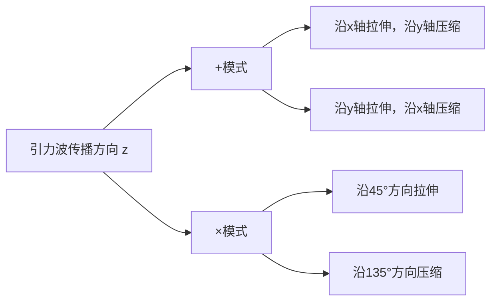

这两种偏振模式的变换性质与自旋为2的场一致，这表明==引力子（如果存在）应该是自旋为2的无质量粒子==。

#### 以光速传播

从波动方程 $\Box \bar{h}_{\mu\nu} = 0$ 可以直接看出，引力波以光速 $c$ 传播。这一预言在2017年的GW170817事件中得到了精确验证：引力波信号与伽马射线暴几乎同时到达地球，时间差不超过1.7秒，在传播了1.3亿光年后，这表明引力波速度与光速的差异小于 $10^{-15}$。

#### 携带能量和动量

虽然在线性理论中引力波的能量-动量张量为零（因为它是二阶小量），但在后牛顿近似下，可以定义引力波的有效能量-动量张量：

$$t_{\mu\nu} = \frac{c^4}{32\pi G} \langle \partial_\mu h_{ij}^{TT} \partial_\nu h^{ij}_{TT} \rangle$$

其中 $\langle \cdot \rangle$ 表示在一个波长尺度上的平均。

对于平面引力波，能量通量为：

$$F = \frac{c^3}{16\pi G} \omega^2 (h_+^2 + h_\times^2)$$

> [!important] 引力波的能量携带
> 引力波确实携带能量，这导致了双星系统轨道周期的衰减。赫尔斯-泰勒脉冲双星PSR B1913+16的观测结果与广义相对论的预言精确符合，为此获得了1993年诺贝尔物理学奖。

### 1.3 四极辐射公式

引力波的产生机制与电磁辐射有本质不同。由于质量守恒和动量守恒，引力辐射没有单极和偶极成分，==最低阶的引力辐射来自质量四极矩的二阶时间导数==。

#### 质量四极矩

质量四极矩张量定义为：

$$I_{ij} = \int \rho(\mathbf{x}) \left(x_i x_j - \frac{1}{3}r^2 \delta_{ij}\right) d^3x$$

其中 $\rho$ 是质量密度，积分遍及整个源。

#### 引力波振幅

在远场近似下（观测距离 $r$ 远大于源的尺度），引力波的振幅为：

$$h_{ij}^{TT} = \frac{2G}{c^4 r} \ddot{I}_{ij}^{TT}(t - r/c)$$

其中 $\ddot{I}_{ij}$ 是四极矩的二阶时间导数，上标TT表示取横向无迹部分。

> [!example] 数量级估计
> 对于一个质量为 $M$、尺度为 $R$、特征速度为 $v$ 的系统，引力波振幅的量级为：
> $$h \sim \frac{G}{c^4} \frac{Mv^2}{r} \sim \frac{GM}{rc^2} \left(\frac{v}{c}\right)^2$$
> 对于双黑洞并合（$M \sim 30M_\odot$，$r \sim 400\text{Mpc}$），$h \sim 10^{-21}$，这是一个极其微小的效应。

#### 辐射功率

引力波辐射的总功率由四极辐射公式给出：

$$P = \frac{G}{5c^5} \langle \dddot{I}_{ij} \dddot{I}_{ij} \rangle$$

这个公式表明，==引力辐射功率与四极矩的三阶时间导数的平方成正比==，且系数 $G/c^5$ 非常小，这解释了为什么引力辐射在大多数情况下可以忽略不计。

对于双星系统，四极矩的二阶导数约为 $\ddot{I} \sim \mu a^2 \omega^2$，其中 $\mu$ 是约化质量，$a$ 是轨道半径，$\omega$ 是轨道角频率。代入上式可得：

$$P = \frac{32G}{5c^5} \mu^2 a^4 \omega^6$$

利用开普勒第三定律 $\omega^2 = GM/a^3$（$M$ 是总质量），可以改写为：

$$P = \frac{32G^4}{5c^5} \frac{\mu^2 M^3}{a^5}$$

## 二、引力波源

引力波源可以分为几大类：致密双星系统、超新星爆发、旋转中子星、以及原初引力波。每种源都有其特定的频率范围和波形特征。

### 2.1 双星系统

双星系统是最重要的引力波源，包括双黑洞、双中子星、以及黑洞-中子星双星。

#### 轨道衰减与并合

双星系统通过引力辐射损失能量，导致轨道逐渐收缩，轨道频率增加。这个过程分为三个阶段：

1. **旋近阶段**（Inspiral）：双星在近似圆轨道上缓慢旋近，引力波频率逐渐增加
2. **并合阶段**（Merger）：双星快速靠近并最终合并
3. **铃宕阶段**（Ringdown）：合并后的黑洞通过辐射引力波达到稳态

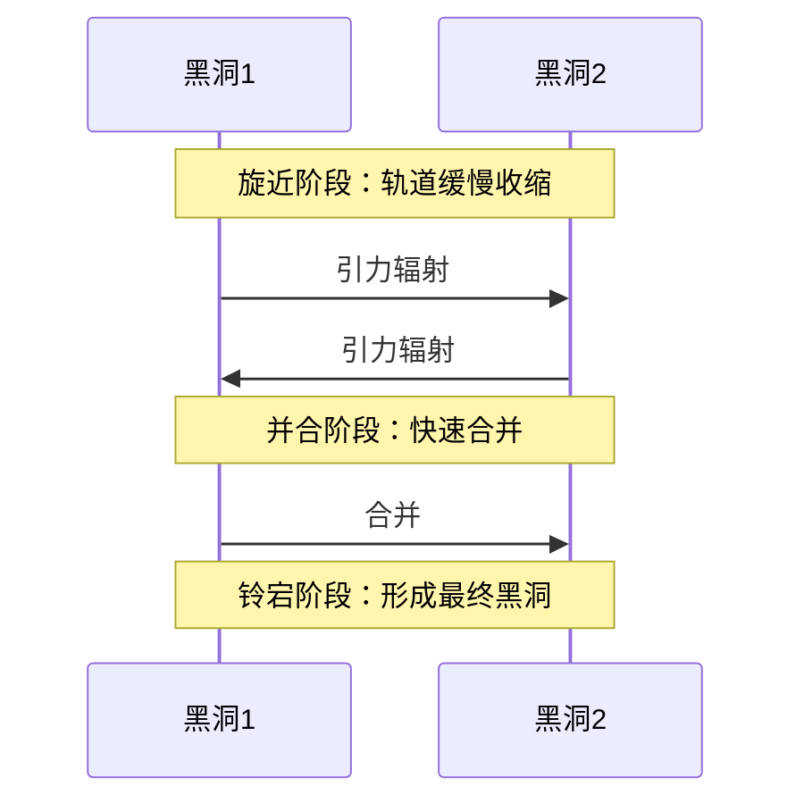

对于圆轨道的双星系统，轨道衰减率为：

$$\frac{da}{dt} = -\frac{64G^3}{5c^5} \frac{\mu M^2}{a^3}$$

轨道频率的时间导数为：

$$\dot{f} = \frac{96}{5} \frac{G^{5/3}}{c^5} (\pi f)^{8/3} \mathcal{M}^{5/3}$$

其中 $\mathcal{M} = \mu^{3/5} M^{2/5}$ 是**啁啾质量**（chirp mass），它是决定波形演化的关键参数。

#### 波形特征：啁啾信号

双星并合的引力波信号呈现特征性的"啁啾"（chirp）形态：频率和振幅都随时间增加。在旋近阶段，引力波频率 $f = 2f_{\text{orb}}$（$f_{\text{orb}}$ 是轨道频率），波形可以近似为：

$$h(t) = A(t) \cos\left[2\pi \int_0^t f(t') dt'\right]$$

其中振幅 $A(t) \propto \mathcal{M}^{5/3} f^{2/3} / r$，频率演化满足：

$$f(t) = \frac{1}{\pi} \left(\frac{5}{256} \frac{1}{t_c - t}\right)^{3/8} \left(\frac{G\mathcal{M}}{c^3}\right)^{-5/8}$$

这里 $t_c$ 是并合时刻。可以看到，随着 $t \to t_c$，频率趋向无穷大（实际上在并合时截止）。

> [!tip] 啁啾信号的物理意义
> 通过测量啁啾信号的频率演化，可以直接确定啁啾质量 $\mathcal{M}$。结合振幅测量，可以进一步确定距离 $r$。这是引力波天文学中提取物理信息的基础。

### 2.2 超新星爆发

超新星爆发是宇宙中最剧烈的爆发现象之一，如果爆发过程存在不对称性，就会产生引力波爆发信号。

#### 非对称坍缩

大质量恒星（$M > 8M_\odot$）在演化末期，核心会发生坍缩。如果坍缩过程是完美球对称的，根据伯克霍夫定理，不会产生引力波。但实际的超新星爆发存在多种不对称机制：

1. **旋转**：恒星核心的旋转会导致扁率，坍缩时产生引力波
2. **对流**：坍缩过程中的对流不稳定性会破坏球对称性
3. **中微子辐射各向异性**：中微子辐射的不均匀性会导致反冲
4. **磁流体动力学不稳定性**：强磁场会导致喷流形成

#### 引力波爆发信号

超新星产生的引力波信号是短暂的爆发，持续时间通常在毫秒量级，频率范围在100-1000 Hz。波形复杂，依赖于具体的物理机制。

对于旋转核心坍缩，典型的引力波振幅为：

$$h \sim \frac{G}{c^4} \frac{E_{\text{kin}}}{r} \sim 10^{-22} \left(\frac{E_{\text{kin}}}{10^{-8} M_\odot c^2}\right) \left(\frac{10\text{kpc}}{r}\right)$$

其中 $E_{\text{kin}}$ 是运动的动能，$r$ 是距离。银河系内的超新星（$r \sim 10\text{kpc}$）可能被当前的探测器探测到。

### 2.3 旋转中子星

旋转中子星如果存在不对称性，会辐射连续引力波。

#### 不对称性导致连续引力波

一个以角频率 $\Omega$ 旋转的中子星，如果存在赤道椭率 $\epsilon = (I_{xx} - I_{yy})/I_{zz}$，会辐射频率为 $f = 2\Omega$ 的连续引力波。引力波振幅为：

$$h_0 = \frac{4\pi^2 G}{c^4} \frac{I_{zz} \epsilon f^2}{r}$$

代入典型数值：

$$h_0 \sim 10^{-26} \left(\frac{\epsilon}{10^{-6}\right) \left(\frac{I_{zz}}{10^{45}\text{g cm}^2}\right) \left(\frac{f}{100\text{Hz}}\right)^2 \left(\frac{1\text{kpc}}{r}\right)$$

#### 山脉与磁层变形

中子星的不对称性可能来源于：

1. **固态地壳的"山脉"**：中子星地壳可以支撑高度约几厘米的"山脉"，对应 $\epsilon \sim 10^{-6}$
2. **内部磁场变形**：强磁场（$B \sim 10^{15}\text{G}$）会变形星体
3. **磁层变形**：外部磁场的不对称分布
4. **r模式不稳定性**：旋转流体中的振荡模式

> [!note] 连续引力波探测的挑战
> 连续引力波信号极其微弱（$h \sim 10^{-26}$），且需要从大量噪声中提取已知频率的信号。目前还没有确定的连续引力波探测，但已经对许多脉冲星设定了上限。

### 2.4 原初引力波

原初引力波产生于宇宙早期，是宇宙暴胀的直接预言。

#### 宇宙暴胀产生

在暴胀期间，量子涨落被放大到宇宙学尺度，形成原初引力扰动和张量扰动。张量扰动即为原初引力波，其功率谱为：

$$P_h(k) = A_t \left(\frac{k}{k_*}\right)^{n_t}$$

其中 $A_t$ 是张量振幅，$n_t$ 是张量谱指数，$k_*$ 是参考波数。

#### 随机引力波背景

原初引力波形成一个随机引力波背景（SGWB），其特征用能量密度参数描述：

$$\Omega_{\text{GW}}(f) = \frac{1}{\rho_c} \frac{d\rho_{\text{GW}}}{d\ln f}$$

其中 $\rho_c = 3H_0^2 c^2 / 8\pi G$ 是临界密度。

原初引力波的关键观测量是张量-标量比 $r = A_t / A_s$，其中 $A_s$ 是标量扰动振幅。目前的观测上限来自宇宙微波背景辐射的B模式偏振测量，$r < 0.036$（95%置信度）。

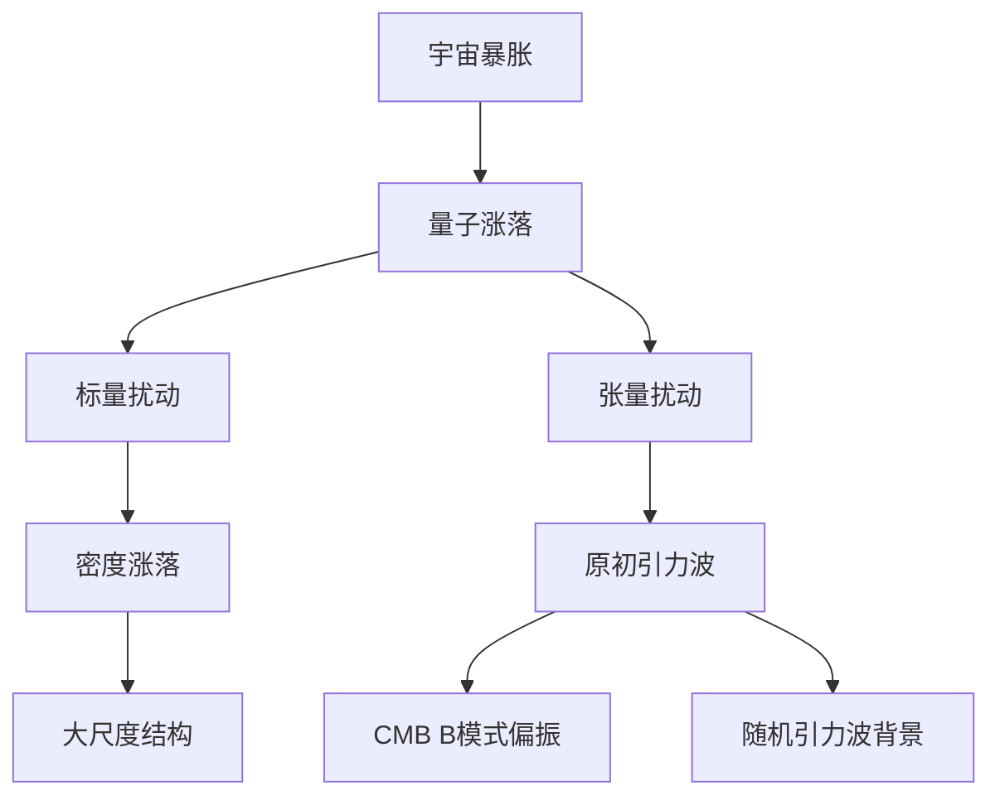

> [!important] 原初引力波的意义
> 探测到原初引力波将是暴胀理论的直接证据，并能够探索宇宙极早期的物理，远早于宇宙微波背景辐射的时期（大爆炸后38万年）。这将为量子引力理论提供观测约束。

## 三、引力波探测

引力波的探测是人类工程技术的巅峰成就之一。由于引力波信号极其微弱（$h \sim 10^{-21}$），探测器的灵敏度要求极高。

### 3.1 激光干涉仪原理

现代引力波探测器基于激光干涉测量原理。

#### 迈克尔逊干涉仪

基本的引力波探测器是一个迈克尔逊干涉仪，由两个垂直的臂组成。激光在分束器处分成两束，分别沿两个臂传播，在末端反射镜反射后返回分束器重新组合。

当引力波通过时，会改变两个臂的光程差，导致干涉条纹的变化。对于频率为 $f$、振幅为 $h$ 的引力波，臂长变化为：

$$\Delta L = hL$$

其中 $L$ 是臂长。

#### 臂长变化与相位差

光程差导致相位差：

$$\Delta \phi = \frac{4\pi}{\lambda} \Delta L = \frac{4\pi L}{\lambda} h$$

其中 $\lambda$ 是激光波长。对于 $L = 4\text{km}$，$\lambda = 1064\text{nm}$，$h = 10^{-21}$：

$$\Delta \phi \sim 10^{-10} \text{ rad}$$

这是一个极其微小的相位变化，需要极其精密的测量技术。

#### 灵敏度要求

为了达到所需的灵敏度，需要克服多种噪声源：

1. **散粒噪声**：光子计数的统计涨落，与激光功率的平方根成反比
2. **辐射压力噪声**：光子动量传递导致的镜面运动
3. **热噪声**：镜面和悬挂系统的热涨落
4. **地震噪声**：地面振动
5. **梯度噪声**：环境引力梯度的涨落

标准量子极限（SQL）给出了位移测量的量子极限：

$$S_h^{\text{SQL}}(f) = \frac{8\hbar}{mL^2 \omega^2}$$

其中 $m$ 是镜面质量，$\omega = 2\pi f$。

### 3.2 LIGO探测器

激光干涉引力波天文台（LIGO）是目前最灵敏的引力波探测器。

#### 结构：4km臂长

LIGO有两个探测器，分别位于美国华盛顿州的汉福德和路易斯安那州的利文斯顿，每个探测器都有4km长的臂。主要技术参数：

- **臂长**：4 km
- **激光功率**：~200 W（注入功率）
- **镜面质量**：40 kg（熔融石英）
- **镜面反射率**：> 99.9999%
- **真空度**：$10^{-9}$ torr
- **设计灵敏度**：$h \sim 10^{-23} / \sqrt{\text{Hz}}$（在100 Hz附近）

为了提高灵敏度，LIGO使用了多种技术：

1. **法布里-珀罗腔**：在每个臂中放置法布里-珀罗腔，使光在臂中往返约300次，有效臂长增加到约1200 km
2. **功率循环**：使用功率循环镜增加干涉仪内的激光功率
3. **信号循环**：使用信号循环镜优化高频灵敏度
4. **主动隔振**：多层悬挂和主动反馈系统隔离地面振动

#### 噪声来源与抑制

LIGO的噪声谱可以分为几个区域：

- **低频（< 10 Hz）**：地震噪声主导，通过主动隔振系统抑制
- **中频（10-100 Hz）**：热噪声和悬挂噪声
- **高频（> 100 Hz）**：散粒噪声主导

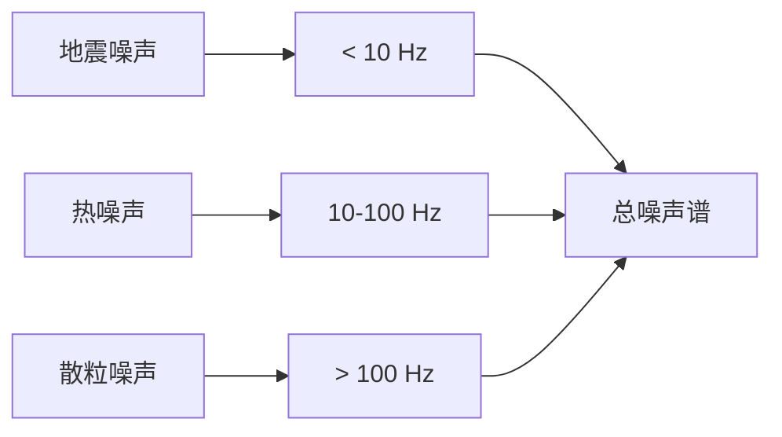

#### 首次探测：GW150914

2015年9月14日，LIGO首次直接探测到引力波信号，命名为GW150914。这个信号来自两个黑洞的并合：

- **黑洞1质量**：$36^{+5}_{-4} M_\odot$
- **黑洞2质量**：$29^{+4}_{-4} M_\odot$
- **最终黑洞质量**：$62^{+4}_{-4} M_\odot$
- **辐射能量**：$3.0^{+0.5}_{-0.5} M_\odot c^2$
- **距离**：$410^{+160}_{-180}$ Mpc
- **红移**：$z = 0.09^{+0.03}_{-0.04}$

> [!success] 历史性突破
> GW150914的探测标志着引力波天文学的开端，验证了广义相对论在强场、高速条件下的正确性，并首次直接证明了恒星级双黑洞系统的存在。这一成就获得了2017年诺贝尔物理学奖。

信号的特征频率从35 Hz增加到250 Hz，持续时间约0.2秒。观测到的峰值振幅 $h \sim 10^{-21}$，与广义相对论的预言精确符合。

### 3.3 Virgo与KAGRA

为了确定引力波源的天空位置，需要一个全球探测器网络。

#### 欧洲与日本的探测器

**Virgo**：位于意大利比萨附近，臂长3 km，2017年加入LIGO的观测运行。Virgo的加入显著提高了源定位能力。

**KAGRA**：位于日本神冈矿山地下200米，臂长3 km。KAGRA是第一个低温引力波探测器，使用蓝宝石镜面（20 K）来减少热噪声。

#### 全球引力波网络

目前的引力波网络包括LIGO（两个探测器）、Virgo和KAGRA，提供了：

1. **源定位**：通过到达时间差确定源的天空位置
2. **偏振测量**：多个探测器可以测量引力波的偏振
3. **参数估计**：提高物理参数测量的精度

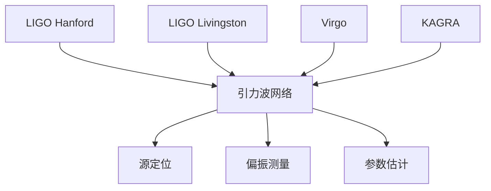

### 3.4 空间引力波探测

空间引力波探测器可以探测低频引力波（$10^{-4}$ - $1$ Hz），这是地面探测器无法触及的频段。

#### LISA计划

激光干涉空间天线（LISA）是欧空局主导的空间引力波探测计划，预计2030年代发射。LISA由三个航天器组成，形成边长为250万公里的等边三角形，绕太阳运行，落后地球20度。

主要科学目标：
- 超大质量黑洞并合
- 极端质量比旋近（EMRI）
- 银河系内致密双星
- 可能探测到原初引力波

#### 太极计划与天琴计划

中国有两个空间引力波探测计划：

**太极计划**：由中科院主导，计划发射三个航天器，形成边长300万公里的三角形编队。

**天琴计划**：由中山大学主导，计划发射三个航天器，形成边长17万公里的等边三角形，绕地球运行。

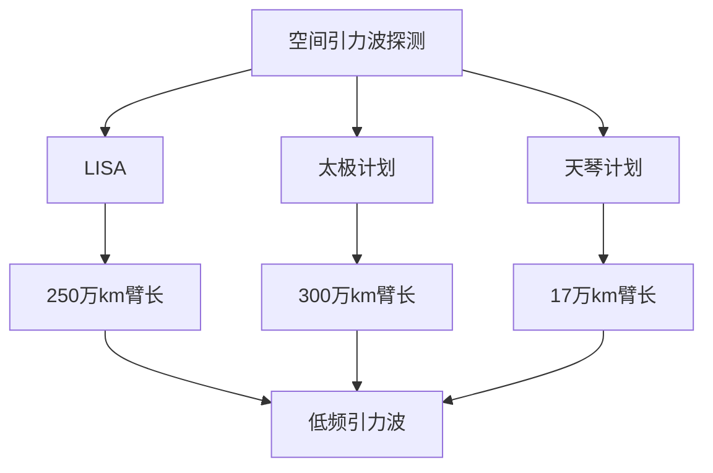

## 四、黑洞的基本性质

黑洞是广义相对论预言的最奇特的天体，其性质完全由几个基本参数决定。

### 4.1 无毛定理

无毛定理是黑洞物理的核心定理之一。

#### 黑洞仅由三个参数描述

==无毛定理指出：稳态黑洞完全由质量 $M$、角动量 $J$、电荷 $Q$ 三个参数唯一确定==。这意味着黑洞没有"毛发"（即没有其他独立的多极矩），所有其他信息都在形成过程中丢失了。

数学上，这表现为爱因斯坦-麦克斯韦方程的稳态解只有三个家族：
- 施瓦西解（$J = 0, Q = 0$）
- 克尔解（$J \neq 0, Q = 0$）
- 雷斯纳-诺德斯特洛姆解（$J = 0, Q \neq 0$）
- 克尔-纽曼解（$J \neq 0, Q \neq 0$）

> [!note] 无毛定理的物理意义
> 无毛定理意味着黑洞是宇宙中最简单的宏观物体。无论形成黑洞的物质是什么（恒星、气体、甚至其他黑洞），最终的黑洞状态只取决于三个守恒量。这与热力学第二定律密切相关。

#### "黑洞无毛"的含义

"黑洞无毛"（black holes have no hair）这个比喻由约翰·惠勒提出，意思是：

1. **信息丢失**：形成黑洞的物质的所有详细信息（除了 $M, J, Q$）都被隐藏在事件视界之后
2. **唯一性**：给定 $M, J, Q$，黑洞的时空几何完全确定
3. **稳定性**：任何扰动（"毛发"）都会通过引力辐射或落入黑洞而消失

### 4.2 事件视界

事件视界是黑洞的边界，是时空中最重要的概念之一。

#### 定义与性质

事件视界定义为：==无法向未来类光无穷远发送信号的区域的边界==。更直观地说，事件视界是光也无法逃逸的边界。

对于施瓦西黑洞，事件视界位于施瓦西半径处：

$$r_s = \frac{2GM}{c^2}$$

事件视界具有以下性质：

1. **零超曲面**：事件视界是由类光测地线生成的超曲面
2. **面积不减定理**：在经典物理中，事件视界的总面积永远不会减少（霍金面积定理）
3. **表面引力**：事件视界上的表面引力 $\kappa$ 是常数（零定律）

#### 表面积定理

霍金面积定理指出：==在经典广义相对论中，事件视界的总面积在任何物理过程中都不会减少==。

$$\delta A \geq 0$$

这一定理与热力学第二定律（熵不减）有深刻的联系。事实上，黑洞熵正比于事件视界的面积：

$$S_{\text{BH}} = \frac{k_B c^3 A}{4G\hbar}$$

这就是著名的贝肯斯坦-霍金熵公式。

#### 霍金辐射

虽然经典理论中黑洞不会辐射，但量子效应导致黑洞会以热辐射的形式蒸发。霍金辐射的温度为：

$$T_H = \frac{\hbar \kappa}{2\pi k_B c}$$

对于施瓦西黑洞，$\kappa = c^4 / 4GM$，因此：

$$T_H = \frac{\hbar c^3}{8\pi G M k_B} \approx 6.2 \times 10^{-8} \text{K} \left(\frac{M_\odot}{M}\right)$$

> [!info] 详见[[黑洞物理]]
> 霍金辐射的详细推导和物理意义将在[[黑洞物理]]中讨论。这里只需要注意，霍金辐射将黑洞力学定律与热力学定律联系了起来。

### 4.3 奇点

奇点是广义相对论中最令人不安的预言之一。

#### 时空奇点的存在性

奇点是指时空曲率发散的地方，在那里广义相对论失效。在施瓦西黑洞中，奇点位于 $r = 0$ 处，那里的克雷奇曼标量发散：

$$R_{\mu\nu\rho\sigma} R^{\mu\nu\rho\sigma} = \frac{48G^2M^2}{c^4 r^6} \to \infty \quad (r \to 0)$$

#### 奇点定理

彭罗斯和霍金证明了一系列奇点定理，指出在相当一般的条件下，奇点的形成是不可避免的。

**彭罗斯奇点定理**（1965）：如果满足以下条件，则时空必然存在奇点：
1. 能量条件成立（例如零能量条件 $T_{\mu\nu}k^\mu k^\nu \geq 0$）
2. 存在陷获面（trapped surface）
3. 时空具有非紧致的柯西面

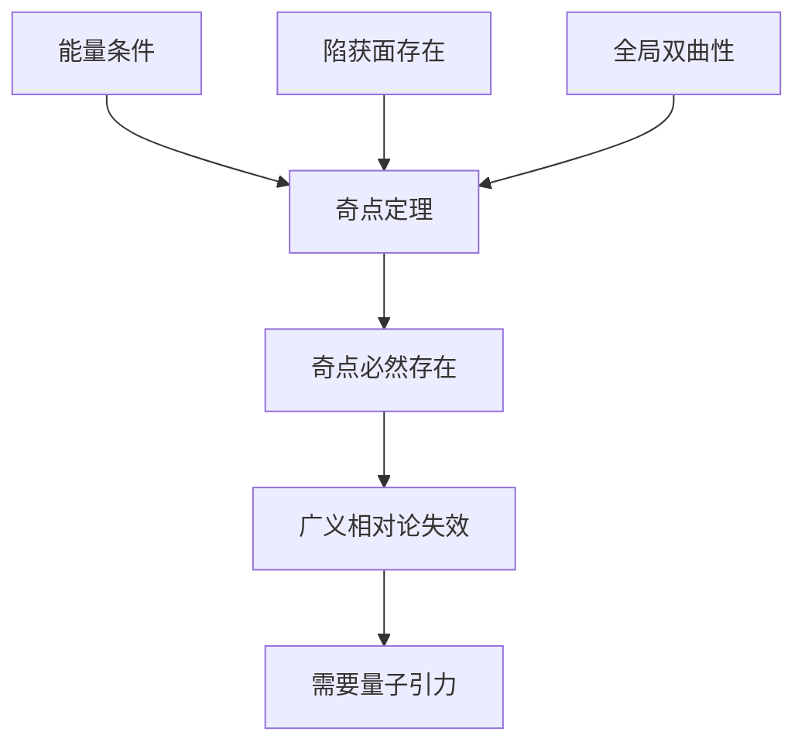

> [!warning] 奇点问题的意义
> 奇点的存在表明广义相对论是一个不完备的理论，在极高曲率区域需要被量子引力理论取代。这是当前理论物理最重要的开放问题之一。

#### 宇宙监督假设

彭罗斯提出的宇宙监督假设（cosmic censorship conjecture）指出：==自然界禁止裸奇点的出现==。也就是说，所有奇点都必须被事件视界包裹，无法被外部观测者看到。

这个假设尚未被证明，但如果成立，它保证了在事件视界外部，物理定律仍然有效，奇点不会影响外部宇宙。

## 五、黑洞的分类

根据质量、角动量和电荷的不同组合，黑洞可以分为几类。

### 5.1 施瓦西黑洞

施瓦西黑洞是最简单的黑洞，不带电也不旋转。

#### 不带电、不旋转

施瓦西黑洞由施瓦西度规描述：

$$ds^2 = -\left(1 - \frac{r_s}{r}\right)c^2dt^2 + \left(1 - \frac{r_s}{r}\right)^{-1}dr^2 + r^2(d\theta^2 + \sin^2\theta d\phi^2)$$

其中 $r_s = 2GM/c^2$ 是施瓦西半径。

#### 最简单的黑洞解

施瓦西解是爱因斯坦场方程的第一个精确解，由卡尔·施瓦西在1916年发现。这个解具有以下特点：

1. **球对称**：时空具有 $SO(3)$ 对称性
2. **静态**：存在类时的基灵矢量场
3. **真空解**：在 $r > 0$ 处满足 $R_{\mu\nu} = 0$

#### 施瓦西半径

施瓦西半径定义了事件视界的位置：

$$r_s = \frac{2GM}{c^2} \approx 2.95 \text{km} \left(\frac{M}{M_\odot}\right)$$

对于不同质量的天体，施瓦西半径为：
- 太阳：$r_s \approx 3$ km
- 地球：$r_s \approx 9$ mm
- 银河系中心黑洞（$4 \times 10^6 M_\odot$）：$r_s \approx 1.2 \times 10^7$ km

### 5.2 克尔黑洞

克尔黑洞是旋转的黑洞，是天体物理中最相关的黑洞类型。

#### 旋转黑洞

克尔黑洞由质量 $M$ 和角动量 $J$ 描述。定义自旋参数 $a = J/Mc$，则克尔度规在博耶-林德奎斯特坐标下为：

$$ds^2 = -\left(1 - \frac{r_s r}{\Sigma}\right)c^2dt^2 - \frac{2r_s a r \sin^2\theta}{\Sigma} c dt d\phi + \frac{\Sigma}{\Delta} dr^2 + \Sigma d\theta^2 + \left(r^2 + a^2 + \frac{r_s r a^2 \sin^2\theta}{\Sigma}\right)\sin^2\theta d\phi^2$$

其中：
$$\Sigma = r^2 + a^2 \cos^2\theta$$
$$\Delta = r^2 - r_s r + a^2$$

#### 能层与参考系拖曳

克尔黑洞有两个重要的边界：

1. **外事件视界**：$r_+ = \frac{r_s}{2} + \sqrt{\frac{r_s^2}{4} - a^2}$
2. **能层边界**（静止极限）：$r_{\text{SL}} = \frac{r_s}{2} + \sqrt{\frac{r_s^2}{4} - a^2 \cos^2\theta}$

在能层（$r_+ < r < r_{\text{SL}}$）内，任何物体都无法保持静止，必须随黑洞一起旋转。这种现象称为**参考系拖曳**（frame dragging）或**兰斯-蒂林效应**。

#### 彭罗斯过程

彭罗斯过程是一种从旋转黑洞中提取能量的机制。在能层内，一个入射粒子可以分裂成两个，其中一个粒子具有负能量（相对于无穷远观测者），落入黑洞；另一个粒子携带比入射粒子更多的能量逃逸。

提取的能量来自黑洞的旋转能。对于一个极端克尔黑洞（$a = r_s/2$），最多可以提取约29%的静止质量能量。

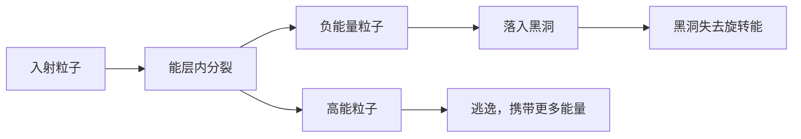

> [!tip] 彭罗斯过程的效率
> 彭罗斯过程的能量提取效率远高于核聚变（约0.7%）。对于极端克尔黑洞，理论最大效率约为20.7%。这解释了为什么活动星系核和伽马射线暴能够释放如此巨大的能量。

### 5.3 带电黑洞

虽然天体物理中的黑洞通常被认为是电中性的，但带电黑洞在理论上很重要。

#### 雷斯纳-诺德斯特洛姆黑洞

雷斯纳-诺德斯特洛姆（RN）黑洞描述带电、不旋转的黑洞，度规为：

$$ds^2 = -\left(1 - \frac{r_s}{r} + \frac{r_Q^2}{r^2}\right)c^2dt^2 + \left(1 - \frac{r_s}{r} + \frac{r_Q^2}{r^2}\right)^{-1}dr^2 + r^2 d\Omega^2$$

其中 $r_Q^2 = GQ^2 / 4\pi\epsilon_0 c^4$。

RN黑洞有两个视界：
- 外视界：$r_+ = \frac{r_s}{2} + \sqrt{\frac{r_s^2}{4} - r_Q^2}$
- 内视界（柯西视界）：$r_- = \frac{r_s}{2} - \sqrt{\frac{r_s^2}{4} - r_Q^2}$

当 $r_Q > r_s/2$ 时，视界消失，形成裸奇点，违反宇宙监督假设。

#### 克尔-纽曼黑洞

克尔-纽曼（KN）黑洞是最一般的稳态黑洞解，描述带电、旋转的黑洞，由 $M, J, Q$ 三个参数完全确定。

KN黑洞结合了克尔黑洞和RN黑洞的特征，具有外视界、内视界和能层。

#### 内视界与外视界

对于带电或旋转的黑洞，存在两个视界：

1. **外事件视界**：类似于施瓦西黑洞的事件视界，是光无法逃逸的边界
2. **内视界**（柯西视界）：在这个边界内，因果结构发生根本变化

在内视界处，广义相对论预言了"质量暴涨"（mass inflation）现象：微小的扰动会导致有效质量指数增长，可能将柯西视界转化为奇点。

## 六、黑洞的形成

黑洞可以通过多种机制形成，从恒星坍缩到宇宙早期的原初黑洞。

### 6.1 恒星坍缩

恒星坍缩是形成恒星级黑洞的主要机制。

#### 大质量恒星的演化终点

大质量恒星（$M > 8M_\odot$）在演化末期，核心会经历一系列的核燃烧阶段，最终形成铁核。铁核无法通过核聚变释放能量，当质量超过钱德拉塞卡极限时，电子简并压力无法支撑引力，核心开始坍缩。

#### 钱德拉塞卡极限

钱德拉塞卡极限是白矮星的最大质量：

$$M_{\text{Ch}} \approx 1.4 M_\odot$$

当核心质量超过这个极限时，电子简并压力无法抵抗引力，核心坍缩形成中子星或黑洞。

对于中子星，也存在一个最大质量（托尔曼-奥本海默-沃尔科夫极限），约为 $2-3 M_\odot$。超过这个质量，中子简并压力也无法支撑，继续坍缩形成黑洞。

#### 奥本海默-斯奈德坍缩

奥本海默和斯奈德在1939年研究了尘埃球的引力坍缩，这是第一个黑洞形成的精确解。

对于均匀尘埃球的坍缩，外部观测者看到：
1. 尘埃球表面逐渐红移
2. 坍缩时间趋向无穷长
3. 表面在 $t \to \infty$ 时趋近于施瓦西半径

但在共动观测者的参考系中，坍缩在有限时间内完成，形成奇点。

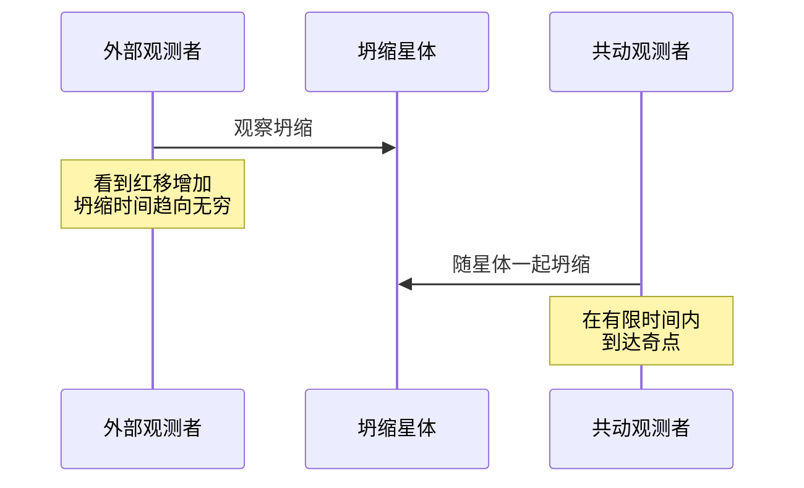

### 6.2 超大质量黑洞

超大质量黑洞（SMBH）位于大多数星系的中心，质量在 $10^6 - 10^{10} M_\odot$ 之间。

#### 星系中心的黑洞

观测表明，几乎每个大质量星系的中心都有一个超大质量黑洞。著名的例子包括：

- **银河系中心**：Sgr A*，质量约 $4 \times 10^6 M_\odot$
- **M87中心**：$6.5 \times 10^9 M_\odot$，第一个被直接成像的黑洞
- **类星体**：某些类星体的黑洞质量可达 $10^{10} M_\odot$

#### 形成机制

超大质量黑洞的形成机制尚不完全清楚，可能的途径包括：

1. **直接坍缩**：宇宙早期巨大的气体云直接坍缩形成 $10^4 - 10^5 M_\odot$ 的"种子"黑洞
2. ** Population III 恒星**：第一代大质量恒星（$100 - 1000 M_\odot$）坍缩形成种子
3. **合并增长**：种子黑洞通过吸积气体和与其他黑洞合并增长
4. **致密星团坍缩**：致密星团中的动力学过程导致黑洞形成

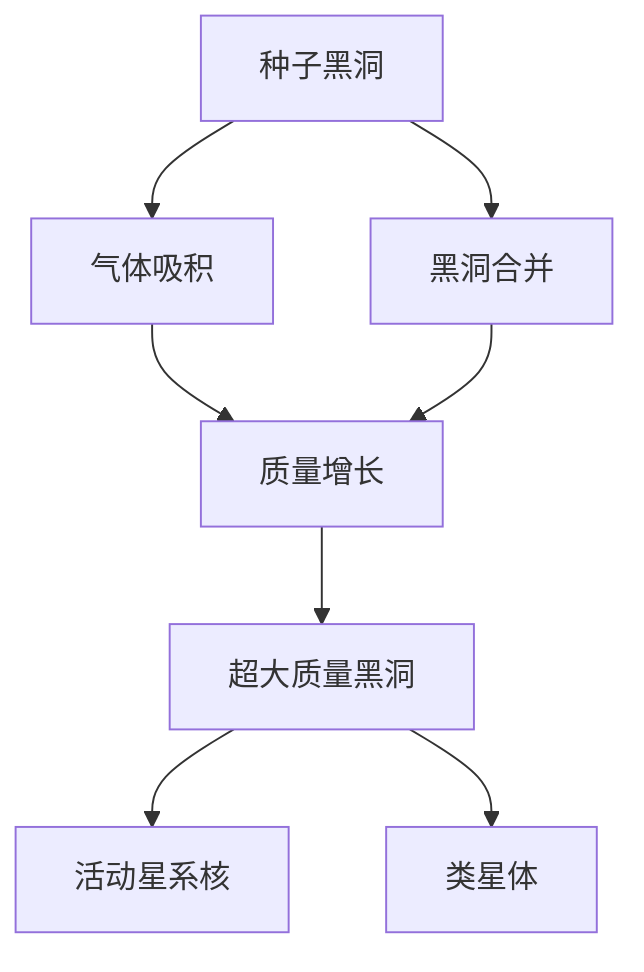

### 6.3 原初黑洞

原初黑洞形成于宇宙早期，与恒星演化无关。

#### 宇宙早期密度涨落

在宇宙早期（大爆炸后 $10^{-35}$ 秒到1秒），密度涨落可能导致某些区域直接坍缩形成黑洞。形成条件是该区域的密度对比 $\delta \rho / \rho$ 超过某个阈值（约0.3）。

#### 可能的质量范围

原初黑洞的质量取决于形成时的宇宙视界质量：

$$M_{\text{PBH}} \sim M_H(t) \sim \frac{c^3 t}{G}$$

不同形成时间对应的质量范围：
- $t \sim 10^{-23}$ s：$M \sim 10^{15}$ g（可能蒸发殆尽）
- $t \sim 10^{-5}$ s：$M \sim 1 M_\odot$
- $t \sim 1$ s：$M \sim 10^5 M_\odot$

原初黑洞是暗物质的候选者之一，特别是在行星质量范围（$10^{-16} - 10^{-10} M_\odot$）和恒星质量范围（$1 - 100 M_\odot$）的某些窗口。

## 七、黑洞的观测证据

虽然黑洞本身不发光，但可以通过其对周围物质的影响来观测。

### 7.1 X射线双星

X射线双星是黑洞存在的最早证据。

#### 天鹅座X-1

天鹅座X-1（Cyg X-1）是人类发现的第一个黑洞候选体。它是一个X射线双星系统，由一个可见的O型超巨星（HDE 226868）和一个不可见的致密伴星组成。

观测特征：
- X射线光度：$L_X \sim 10^{37}$ erg/s
- 轨道周期：5.6天
- 致密天体质量：$M = 14.8 \pm 1.0 M_\odot$

由于质量远超过中子星的最大质量（$\sim 3 M_\odot$），这个致密天体只能是黑洞。

#### 质量测量

在X射线双星中，黑洞质量可以通过动力学方法测量。通过观测可见星的光谱，可以确定轨道速度 $K$ 和轨道周期 $P$。质量函数为：

$$f(M) = \frac{PK^3}{2\pi G} = \frac{M_{\text{BH}}^3 \sin^3 i}{(M_{\text{BH}} + M_*)^2}$$

其中 $i$ 是轨道倾角，$M_*$ 是可见星质量。通过进一步约束 $M_*$ 和 $i$，可以确定黑洞质量。

### 7.2 星系中心

星系中心的超大质量黑洞可以通过追踪周围恒星的运动来探测。

#### 银河系中心Sgr A*

银河系中心有一个射电源Sgr A*，被认为是超大质量黑洞的位置。通过几十年的红外观测，已经精确测量了周围恒星（称为S星）的轨道。

#### S2星轨道

S2星是距离Sgr A*最近的恒星之一，轨道周期约16年，近心点距离约120 AU（约1400倍施瓦西半径）。

通过追踪S2的完整轨道，可以精确测定中心黑洞的质量：

$$M_{\text{BH}} = (4.15 \pm 0.06) \times 10^6 M_\odot$$

2018年，S2经过近心点时，观测到了广义相对论预言的引力红移，与理论预言精确符合。

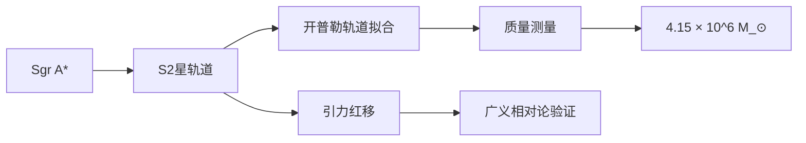

> [!success] 诺贝尔物理学奖2020
> 赖因哈德·根策尔和安德烈娅·盖兹因"发现银河系中心的超大质量致密天体"获得2020年诺贝尔物理学奖。他们的工作提供了黑洞存在的最令人信服的证据之一。

### 7.3 事件视界望远镜

事件视界望远镜（EHT）是一个全球性的毫米波干涉阵列，实现了黑洞事件视界的直接成像。

#### M87*黑洞照片

2019年4月，EHT合作组发布了M87星系中心黑洞的第一张照片。这是人类历史上第一张黑洞照片，显示了：

- **环形结构**：直径约42微角秒（对应约5.5 $r_s$）
- **不对称亮度**：南侧比北侧亮，符合相对论性喷流的预期
- **中心暗影**：直径约 $40 \pm 4$ 微角秒，与广义相对论预言的黑洞暗影大小一致

黑洞质量为 $M = (6.5 \pm 0.7) \times 10^9 M_\odot$。

#### Sgr A*黑洞照片

2022年5月，EHT发布了银河系中心Sgr A*的黑洞照片。与M87*相比，Sgr A*的质量更小（$4 \times 10^6 M_\odot$），距离更近（8 kpc），但变化更快（轨道时标约分钟量级），使得成像更加困难。

照片显示了类似的环形结构，直径与广义相对论预言一致。

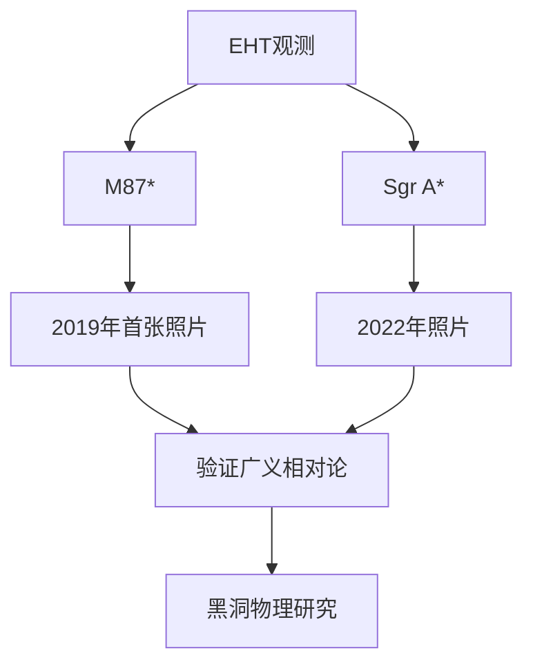

> [!important] 事件视界望远镜的意义
> EHT的观测直接验证了黑洞事件视界的存在，排除了其他致密天体模型的可能性。同时，这些观测为检验强场广义相对论提供了新的途径。

## 八、引力波天文学的意义

引力波天文学开启了观测宇宙的新窗口，带来了革命性的发现。

### 8.1 新的观测窗口

引力波提供了一种全新的观测宇宙的方式。

#### 电磁波无法穿透的区域

电磁波在宇宙中传播时会被吸收或散射，例如：
- 宇宙早期的等离子体（红移 $z > 1100$）对光子不透明
- 恒星内部的光子需要数万年才能到达表面
- 致密天体并合的内部区域被物质包裹

==引力波几乎不与物质相互作用，可以直接从这些区域传播到观测者==，携带关于源内部物理的直接信息。

#### 直接探测黑洞并合

在引力波探测之前，黑洞的存在只能通过间接证据推断（如X射线双星、星系中心动力学）。引力波提供了直接探测黑洞并合的手段，可以：

1. **确认黑洞的存在**：通过波形分析确定致密天体的质量
2. **测量黑洞参数**：精确测量质量、自旋
3. **检验无毛定理**：通过铃宕阶段的准正模分析
4. **研究黑洞种群**：统计双黑洞的质量分布

### 8.2 多信使天文学

多信使天文学结合引力波、电磁波、中微子等多种观测手段，全面研究天体物理事件。

#### 引力波+电磁波+中微子

理想的多信使观测包括：
- **引力波**：提供源的动力学信息（质量、距离、轨道参数）
- **电磁波**：提供源的环境信息（位置、红移、喷流、余辉）
- **中微子**：提供源内部核过程的信息

#### GW170817：双中子星并合

2017年8月17日，LIGO/Virgo探测到双中子星并合的引力波信号GW170817。1.7秒后，费米卫星探测到短伽马射线暴GRB 170817A。随后，全球数十个望远镜观测到了光学、红外、紫外、X射线和射电余辉。

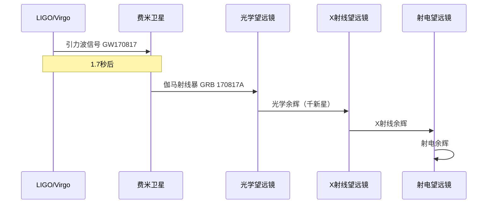

GW170817的科学成果包括：
1. **证实双中子星并合产生短伽马射线暴**
2. **观测到千新星**：证实重元素（金、铂等）通过r过程核合成产生
3. **测量引力波速度**：$|v_{\text{GW}} - c| / c < 3 \times 10^{-15}$
4. **独立测量哈勃常数**：$H_0 = 70^{+12}_{-8}$ km/s/Mpc
5. **检验广义相对论**：在弱场和强场条件下都得到验证

> [!success] 多信使天文学的开端
> GW170817标志着多信使天文学的开端，被称为"天文学的里程碑"。这一发现获得了2017年诺贝尔物理学奖（与GW150914共享）。

### 8.3 基础物理检验

引力波天文学为基础物理提供了新的检验手段。

#### 广义相对论的强场检验

引力波来自强引力场区域，提供了检验广义相对论的独特机会。可以检验的预言包括：

1. **波形检验**：比较观测波形与广义相对论预言
2. **引力波速度**：验证引力波以光速传播
3. **引力子质量**：如果引力子有质量，引力波速度会小于光速，且不同频率的引力波传播速度不同
4. **额外偏振模式**：某些修改引力理论预言额外的偏振模式
5. **非线性效应**：检验广义相对论的非线性预言

目前的观测结果与广义相对论完全一致，对修改引力理论设定了严格的限制。

#### 引力波速度测量

GW170817的观测提供了引力波速度最精确的测量。引力波和伽马射线在传播了约1.3亿光年后，到达时间差不超过1.7秒，这给出：

$$-3 \times 10^{-15} \leq \frac{v_{\text{GW}} - c}{c} \leq 7 \times 10^{-16}$$

这个结果排除了许多修改引力理论，特别是那些为解释宇宙加速膨胀而引入的理论。

#### 中子星物态方程

双中子星并合的引力波信号携带了中子星内部物态的信息。在旋近阶段，中子星的潮汐形变会影响引力波波形。潮汐形变用潮汐Love数 $k_2$ 或无量纲潮汐参数 $\Lambda$ 描述：

$$\Lambda = \frac{2}{3} k_2 \left(\frac{c^2 R}{GM}\right)^5$$

通过测量 $\Lambda$，可以约束中子星的半径和物态方程。GW170817的观测给出 $\Lambda_{1.4} \leq 580$（90%置信度），排除了某些"硬"物态方程。

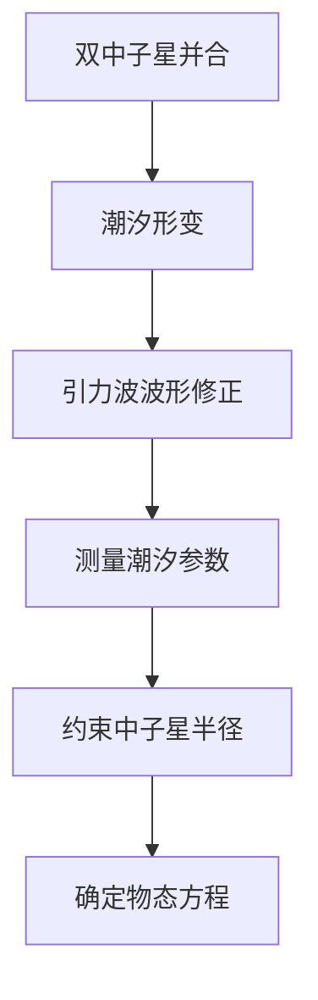

> [!note] 中子星物态的意义
> 中子星内部的物态方程是核物理和天体物理的重要问题。引力波观测提供了独立于电磁观测的约束，有助于理解极端密度下物质的行为。

## 延伸阅读

- [[场方程与施瓦西解]] - 爱因斯坦场方程的推导和施瓦西解的详细讨论
- [[引力波天文学]] - 引力波探测技术和数据分析的深入介绍
- [[黑洞物理]] - 黑洞热力学、霍金辐射和信息悖论
- [[相对论观测]] - 广义相对论的各种实验检验

%%
引力波和黑洞是广义相对论最激动人心的预言
2015年的首次探测开启了引力波天文学新时代
这些发现不仅验证了爱因斯坦的理论，更开启了理解宇宙的新窗口
未来，随着更灵敏的探测器和空间引力波天文台的建设
我们将能够探索更多宇宙中最极端的现象
%%
