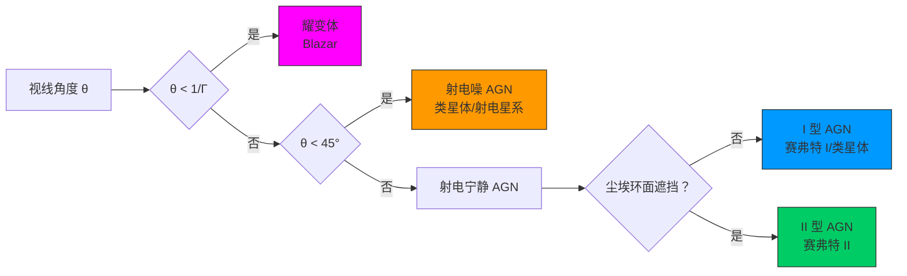

# 活动星系核物理

> [!abstract] 概述
> 活动星系核（Active Galactic Nuclei, AGN）是宇宙中最明亮的持续发光天体，其光度可达 $10^{40}-10^{48}\,\text{erg/s}$，远超普通星系的核球区域。AGN 的能量来源是中心超大质量黑洞（Supermassive Black Hole, SMBH）对周围物质的吸积过程，通过质能转换效率 $\eta \sim 0.1$ 释放出巨大能量。AGN 的研究对于理解[[黑洞物理]]、星系演化以及宇宙大尺度结构具有重要意义。

> [!info] 历史背景
> 1943 年，Carl Seyfert 首次发现一类具有明亮核球和宽发射线特征的旋涡星系，后来被称为"赛弗特星系"。1963 年，Maarten Schmidt 确认类星体 3C 273 的红移为 $z=0.158$，揭示了其巨大的距离和光度。1980 年代，AGN 的统一模型逐渐形成，认为不同类型的 AGN 本质上是同一类天体，只是观测角度不同。2019 年，事件视界望远镜（EHT）成功拍摄到 M87 星系中心黑洞的阴影图像，为 AGN 的中心引擎理论提供了直接证据。

## 一、AGN 的基本特征

### 1.1 观测特征

> [!note] AGN 的核心观测特征
> 活动星系核表现出四个显著的观测特征：极高光度、非热辐射谱、快速光变和相对论性喷流。这些特征共同指向一个致密的中心引擎。

#### 高光度

AGN 的光度范围极广，从 $10^{40}\,\text{erg/s}$ 到超过 $10^{48}\,\text{erg/s}$，跨越 8 个数量级。作为对比：

- 太阳光度：$L_\odot \approx 3.8 \times 10^{33}\,\text{erg/s}$
- 普通星系总光度：$L_{\text{galaxy}} \sim 10^{10} L_\odot \approx 10^{44}\,\text{erg/s}$
- 最亮类星体：$L_{\text{quasar}} \sim 10^{47}-10^{48}\,\text{erg/s}$

这意味着某些 AGN 的亮度可以超过其宿主星系的数千倍，在可见光波段就能在数十亿光年外被观测到。

AGN 的光度通常用**爱丁顿光度**（Eddington Luminosity）来归一化：

$$
L_{\text{Edd}} = \frac{4\pi G M m_p c}{\sigma_T} \approx 1.26 \times 10^{38} \left(\frac{M}{M_\odot}\right)\,\text{erg/s}
$$

其中 $M$ 是黑洞质量，$m_p$ 是质子质量，$\sigma_T$ 是[[汤姆孙散射]]截面。爱丁顿光度代表了辐射压与引力平衡时的最大稳定光度。对于 $10^8 M_\odot$ 的黑洞，$L_{\text{Edd}} \approx 1.26 \times 10^{46}\,\text{erg/s}$。

#### 非热辐射谱

与普通恒星的热辐射不同，AGN 的辐射谱呈现典型的**非热辐射**特征：

- **射电波段**：同步辐射谱，$F_\nu \propto \nu^{-\alpha}$，谱指数 $\alpha \sim 0.5-1.0$
- **光学 - 紫外波段**：大蓝包（Big Blue Bump），温度 $\sim 10^5\,\text{K}$
- **X 射线波段**：幂律谱，$F_\nu \propto \nu^{-\alpha_X}$，$\alpha_X \sim 0.9-1.0$
- **伽马射线波段**：高能光子，能量可达 TeV 量级

这种跨越多个数量级的连续谱表明存在多种辐射机制，包括同步辐射、逆康普顿散射和热辐射。详见[[同步辐射]]。

#### 快速光变

AGN 在多个波段都表现出显著的光度变化：

- **时标**：从分钟级（射电、X 射线、伽马射线）到年级（光学、射电喷流）
- **幅度**：可达数倍甚至数十倍
- **相关性**：不同波段的光变存在时延，反映了辐射区的物理尺寸

根据因果性原理，光变时标 $\Delta t$ 给出了辐射区尺寸的上限：

$$
R \leq c \Delta t \approx 3 \times 10^{10} \left(\frac{\Delta t}{1\,\text{s}}\right)\,\text{cm}
$$

对于分钟级的光变，辐射区尺寸仅为 $10^{13}-10^{14}\,\text{cm}$，这与太阳系尺度相当，却释放出远超整个星系的能量。这一矛盾只能通过**相对论射束效应**来解释。

考虑多普勒因子 $\delta = [\Gamma(1-\beta\cos\theta)]^{-1}$，观测到的光变时标 $\Delta t_{\text{obs}}$ 与本征时标 $\Delta t_{\text{int}}$ 的关系为：

$$
\Delta t_{\text{obs}} = \frac{\Delta t_{\text{int}}}{\delta}
$$

当喷流指向观测者（$\theta$ 很小）且洛伦兹因子 $\Gamma \gg 1$ 时，$\delta \sim 10-50$，观测时标可以缩短数十倍。

#### 喷流现象

约 10% 的 AGN 表现出相对论性喷流，其特征包括：

- **尺度**：从 pc 到 Mpc 量级
- **速度**：表观速度可达 $v_{\text{app}} > c$（超光速运动）
- **准直性**：喷流张角通常小于 $10^\circ$
- **偏振**：高度线偏振，偏振度可达 10%-50%

超光速运动的表观速度公式为：

$$
v_{\text{app}} = \frac{v \sin\theta}{1 - \beta\cos\theta}
$$

当 $v \approx c$ 且 $\theta$ 很小时，$v_{\text{app}}$ 可以远超光速。例如，当 $\Gamma = 10$，$\theta = 5^\circ$ 时，$v_{\text{app}} \approx 7c$。

### 1.2 能量来源

> [!tip] 质能转换效率的比较
> AGN 的能量来源是物质落入黑洞过程中的引力势能释放，其质能转换效率 $\eta \sim 0.1$，远高于恒星核聚变的 $\eta \sim 0.007$。

#### 吸积过程

物质从无穷远处落到黑洞表面释放的引力势能为：

$$
\Delta E = \frac{GMm}{R}
$$

对于施瓦西黑洞（非旋转），最内稳定圆轨道（ISCO）位于 $R_{\text{ISCO}} = 6GM/c^2 = 3R_s$，其中 $R_s = 2GM/c^2$ 是事件视界半径。物质从无穷远落到 ISCO 释放的能量为：

$$
\Delta E = mc^2 \left(1 - \sqrt{\frac{8}{9}}\right) \approx 0.057 mc^2
$$

对于极端克尔黑洞（最大旋转），ISCO 可以接近事件视界，质能转换效率可达：

$$
\eta_{\text{max}} \approx 0.42
$$

典型的 AGN 吸积效率为 $\eta \sim 0.1$，这意味着每吸积 1 kg 物质，可以释放 $0.1 \times 1 \times (3\times 10^8)^2 = 9 \times 10^{15}\,\text{J}$ 的能量。

#### 与恒星核聚变的对比

恒星通过核聚变将氢转化为氦，质量亏损约为：

$$
\Delta m = 4m_p - m_{\text{He}} \approx 0.007 \times 4m_p
$$

因此核聚变的质能转换效率仅为 $\eta_{\text{nuclear}} \approx 0.007$，比黑洞吸积低一个数量级。

假设一个 AGN 的光度为 $L = 10^{46}\,\text{erg/s}$，效率 $\eta = 0.1$，则所需的质量吸积率为：

$$
\dot{M} = \frac{L}{\eta c^2} = \frac{10^{46}}{0.1 \times (3\times 10^{10})^2} \approx 1.1\,M_\odot/\text{yr}
$$

这个吸积率在天体物理环境中是可以实现的，例如星系 merger 或盘不稳定性可以提供足够的气体供应。

#### 能量预算

一个典型类星体在其寿命（$\sim 10^7-10^8\,\text{yr}$）内消耗的总质量为：

$$
M_{\text{consumed}} = \dot{M} \times t_{\text{life}} \sim 10^7-10^8\,M_\odot
$$

这与观测到的本地宇宙中超大质量黑洞的质量分布一致，表明现代星系中心的黑洞曾经经历过类星体阶段。

## 二、AGN 的统一模型

### 2.1 基本图像

> [!note] AGN 统一模型的核心思想
> 所有 AGN 都具有相同的基本结构：中心超大质量黑洞 + 吸积盘 + 宽线区 + 窄线区 + 尘埃环面 + 喷流（部分 AGN）。观测到的不同类型仅仅是由于视线角度不同造成的。

```mermaid
graph TB
    A[中心超大质量黑洞<br/>10^6-10^10 M☉] --> B[吸积盘<br/>光学-紫外辐射]
    B --> C[宽线区 BLR<br/>10^3-10^4 km/s]
    B --> D[窄线区 NLR<br/>10^2-10^3 km/s]
    B --> E[尘埃环面<br/>pc 尺度]
    B --> F[相对论性喷流<br/>射电辐射]
    
    style A fill:#000,stroke:#fff
    style B fill:#f90,stroke:#333
    style C fill:#09f,stroke:#333
    style D fill:#0c6,stroke:#333
    style E fill:#963,stroke:#333
    style F fill:#f0f,stroke:#333
```

#### 中心引擎：超大质量黑洞 + 吸积盘

AGN 的中心是一个质量在 $10^6-10^{10}\,M_\odot$ 范围内的超大质量黑洞。黑洞周围的吸积盘将引力势能转化为辐射能。吸积盘的典型尺寸为：

$$
R_{\text{disk}} \sim 10^3-10^5 R_g = \frac{10^3-10^5 GM}{c^2}
$$

对于 $10^8 M_\odot$ 的黑洞，$R_{\text{disk}} \sim 10^{13}-10^{15}\,\text{cm}$，约为太阳系尺度。

吸积盘的温度分布遵循 $T(R) \propto R^{-3/4}$，内区温度可达 $T_{\text{in}} \sim 10^5-10^6\,\text{K}$，辐射峰值在光学 - 紫外波段，形成著名的"大蓝包"。

#### 宽线区（BLR）

宽线区位于吸积盘外围，距离中心约 $0.01-1\,\text{pc}$。其特征包括：

- **气体密度**：$n \sim 10^9-10^{11}\,\text{cm}^{-3}$
- **速度弥散**：$v \sim 10^3-10^4\,\text{km/s}$
- **发射线宽度**：$\Delta \lambda / \lambda \sim 0.01-0.1$（FWHM）
- **电离参数**：$\log U \sim -1$ 到 $-2$

常见的宽发射线包括：H$\alpha$、H$\beta$、Mg II $\lambda 2798$、C IV $\lambda 1549$、Ly$\alpha$ 等。

通过反响映射（Reverberation Mapping）技术，可以测量 BLR 的尺寸。BLR 半径与连续谱光度之间存在经验关系（Radius-Luminosity Relation）：

$$
R_{\text{BLR}} \propto L^{0.5}
$$

这一关系表明 BLR 的结构由中心辐射场决定。

#### 窄线区（NLR）

窄线区位于更远处，距离中心约 $10-1000\,\text{pc}$。其特征包括：

- **气体密度**：$n \sim 10^2-10^4\,\text{cm}^{-3}$
- **速度弥散**：$v \sim 10^2-10^3\,\text{km/s}$
- **发射线宽度**：$\Delta \lambda / \lambda \sim 0.001-0.01$（FWHM）
- **电离参数**：$\log U \sim -2$ 到 $-4$

窄发射线包括：[O III] $\lambda\lambda 4959, 5007$、[O II] $\lambda 3727$、[N II] $\lambda\lambda 6548, 6583$、[S II] $\lambda\lambda 6716, 6731$ 等。

NLR 的几何结构通常是双锥形的，受到尘埃环面的遮挡。

#### 尘埃环面（Torus）

尘埃环面是 AGN 统一模型的关键组件，位于 BLR 和 NLR 之间，距离中心约 $1-10\,\text{pc}$。其特征包括：

- **温度**：$T \sim 300-1500\,\text{K}$
- **尺寸**：内半径由尘埃升华温度决定，$R_{\text{sub}} \propto L^{0.5}$
- **几何**：可能是厚环面、风或团块状结构
- **消光**：$A_V \sim 10-100\,\text{mag}$

尘埃环面的主要作用是遮挡视线，使得从侧面观测时看不到 BLR 和吸积盘内区，从而产生 I 型和 II 型 AGN 的区别。

### 2.2 观测分类

> [!info] AGN 分类的历史
> AGN 的分类最初基于光学光谱特征，后来扩展到多波段观测。随着统一模型的发展，人们认识到这些分类本质上是取向效应和光度效应的结果。

#### 赛弗特星系（Seyfert Galaxies）

赛弗特星系是最近的 AGN，通常出现在旋涡星系中，分为两类：

**I 型赛弗特星系**：
- 宽发射线（FWHM $\sim 10^3-10^4\,\text{km/s}$）+ 窄发射线
- 连续谱较强，可见吸积盘辐射
- 视线穿过尘埃环面的极区

**II 型赛弗特星系**：
- 只有窄发射线（FWHM $\sim 10^2-10^3\,\text{km/s}$）
- 连续谱较弱，吸积盘被遮挡
- 视线被尘埃环面遮挡

典型例子：
- MCG-6-30-15（I 型）：著名的铁 K$\alpha$ 线源
- NGC 1068（II 型）：最早的 X 射线观测目标之一

#### 类星体（Quasars）

类星体是光度最高的 AGN，$L > 10^{45}\,\text{erg/s}$，特征包括：

- 点状光学对应体（恒星般的外观）
- 强发射线（宽线和窄线）
- 高红移（$z > 0.1$，最高可达 $z > 7$）
- 部分具有射电辐射

类星体可以进一步分为：
- **射电宁静类星体**（Radio-Quiet, RQ）：约 90%
- **射电噪类星体**（Radio-Loud, RL）：约 10%

最高红移类星体：
- J1342+0928（$z = 7.54$）：宇宙年龄仅 6.9 亿年时的类星体
- 其黑洞质量 $\sim 8 \times 10^8 M_\odot$，对黑洞形成理论提出挑战

#### BL Lac 天体

BL Lac 天体是喷流指向观测者的 AGN，特征包括：

- 光学连续谱强且变化剧烈
- 发射线极弱或不可见
- 高偏振（光学偏振度可达 10%-50%）
- 快速光变（时标从小时到天）
- 强伽马射线辐射

根据射电波段特征，BL Lac 天体分为：
- **低能峰 BL Lac**（LBL）：同步辐射峰值在红外 - 光学波段
- **高能峰 BL Lac**（HBL）：同步辐射峰值在 X 射线波段

典型例子：BL Lacertae 本身，OJ 287（具有周期性光变，可能包含双黑洞系统）

#### 射电星系（Radio Galaxies）

射电星系是具有强射电辐射的 AGN，根据射电形态分为：

**Fanaroff-Riley I 型（FR I）**：
- 射电光度较低：$L_{1.4\text{GHz}} < 10^{25}\,\text{W/Hz}$
- 射电结构：中心亮，向外变暗
- 喷流明显，速度较快
- 宿主星系：椭圆星系，质量较小

**Fanaroff-Riley II 型（FR II）**：
- 射电光度较高：$L_{1.4\text{GHz}} > 10^{25}\,\text{W/Hz}$
- 射电结构：边缘亮，存在热斑（hotspots）
- 喷流末端与星际介质相互作用
- 宿主星系：大质量椭圆星系

典型例子：
- M87（FR I）：最近的射电星系，EHT 成像目标
- Cygnus A（FR II）：最强的射电源之一

### 2.3 取向效应

> [!tip] 统一模型的几何图像
> AGN 的观测分类主要取决于视线与喷流轴（或尘埃环面法线）的夹角 $\theta$。

#### 视线角度决定观测类型

根据统一模型，不同观测类型对应的视线角度为：

- **耀变体**（Blazar）：$\theta \lesssim 1/\Gamma \sim 5^\circ-10^\circ$
  - 喷流直接指向观测者
  - 相对论射束效应最强
  - 包括 BL Lac 天体和光学剧变类星体（OVV）

- **射电噪类星体 / 射电星系**：$10^\circ \lesssim \theta \lesssim 45^\circ$
  - 可以看到喷流的一侧（单侧喷流）
  - 射电瓣结构清晰

- **I 型赛弗特星系**：$45^\circ \lesssim \theta \lesssim 70^\circ$
  - 视线穿过尘埃环面的开口
  - 可以看到 BLR 和吸积盘

- **II 型赛弗特星系**：$\theta \gtrsim 70^\circ$
  - 视线被尘埃环面遮挡
  - 只能看到 NLR

#### 相对论射束效应

当喷流以相对论速度运动且指向观测者时，会出现显著的射束效应：

**多普勒因子**：
$$
\delta = \frac{1}{\Gamma(1-\beta\cos\theta)}
$$

其中 $\Gamma = (1-\beta^2)^{-1/2}$ 是洛伦兹因子，$\beta = v/c$。

**辐射增强**：
观测到的流量 $S_{\text{obs}}$ 与本征流量 $S_{\text{int}}$ 的关系为：

$$
S_{\text{obs}} = \delta^{3+\alpha} S_{\text{int}}
$$

其中 $\alpha$ 是谱指数（$S_\nu \propto \nu^{-\alpha}$）。对于典型的 $\Gamma = 10$，$\theta = 5^\circ$，$\delta \approx 10$，辐射增强因子可达 $10^3-10^4$。

**光变时标压缩**：
$$
\Delta t_{\text{obs}} = \frac{\Delta t_{\text{int}}}{\delta}
$$

**表观横向速度**：
$$
v_{\text{app}} = \frac{\beta c \sin\theta}{1-\beta\cos\theta}
$$

当 $\Gamma \gg 1$ 且 $\theta \sim 1/\Gamma$ 时，$v_{\text{app}}$ 可以达到 $\Gamma c$，产生超光速运动的假象。

## 三、吸积盘物理

### 3.1 标准吸积盘模型

> [!note] Shakura-Sunyaev α-盘模型
> 标准吸积盘模型假设几何薄、光学厚，通过 α-粘滞机制传输角动量。该模型成功解释了 AGN 的光学 - 紫外连续谱。

#### 薄盘假设

吸积盘的几何厚度 $H$ 远小于半径 $R$：

$$
\frac{H}{R} \ll 1
$$

对于 AGN 吸积盘，$H/R \sim 10^{-2}-10^{-3}$，满足薄盘条件。

盘的光学厚度 $\tau \gg 1$，辐射从盘表面以黑体谱形式发射。

#### 粘滞机制

吸积需要角动量向外转移。Shakura & Sunyaev (1973) 引入参数化粘滞：

$$
\nu = \alpha c_s H
$$

其中 $\nu$ 是运动学粘滞系数，$\alpha$ 是无量纲粘滞参数（$0 < \alpha < 1$），$c_s$ 是声速，$H$ 是盘厚度。

典型的 $\alpha$ 值为 $0.01-0.3$。现代研究表明，磁旋转不稳定性（MRI）是产生有效粘滞的主要机制。

#### 基本方程

稳态薄吸积盘满足以下方程：

**质量守恒**：
$$
\dot{M} = 2\pi R \Sigma v_R = \text{const}
$$

其中 $\Sigma$ 是表面密度，$v_R$ 是径向速度。

**角动量守恒**：
$$
\dot{M} \frac{d}{dR}(R^2 \Omega) = \frac{d}{dR}\left(2\pi R \nu \Sigma R^2 \frac{d\Omega}{dR}\right)
$$

对于开普勒盘，$\Omega = (GM/R^3)^{1/2}$，解得：

$$
\nu \Sigma = \frac{\dot{M}}{3\pi} \left[1 - \left(\frac{R_{\text{in}}}{R}\right)^{1/2}\right]
$$

**能量守恒**：
粘滞耗散产生的能量以辐射形式释放，单位面积的辐射通量为：

$$
F(R) = \frac{3GM\dot{M}}{8\pi R^3} \left[1 - \left(\frac{R_{\text{in}}}{R}\right)^{1/2}\right]
$$

#### 温度分布

假设局部黑体辐射，$F(R) = \sigma T^4(R)$，得到温度分布：

$$
T(R) = \left[\frac{3GM\dot{M}}{8\pi \sigma R^3} \left(1 - \sqrt{\frac{R_{\text{in}}}{R}}\right)\right]^{1/4}
$$

在 $R \gg R_{\text{in}}$ 处，近似为：

$$
T(R) \approx \left(\frac{3GM\dot{M}}{8\pi \sigma}\right)^{1/4} R^{-3/4} \propto R^{-3/4}
$$

对于 $M = 10^8 M_\odot$，$\dot{M} = 1 M_\odot/\text{yr}$，内区温度（$R \sim 10 R_g$）为：

$$
T_{\text{in}} \sim 10^5 \left(\frac{M}{10^8 M_\odot}\right)^{-1/4} \left(\frac{\dot{M}}{1 M_\odot/\text{yr}}\right)^{1/4}\,\text{K}
$$

### 3.2 吸积盘辐射

> [!tip] 多色黑体谱
> 吸积盘不同半径处的温度不同，整体辐射是所有半径处黑体辐射的叠加，形成多色黑体谱。

#### 理论谱

吸积盘的总辐射光度为：

$$
L_{\text{disk}} = \int_{R_{\text{in}}}^{R_{\text{out}}} 2\pi R \cdot 2\sigma T^4(R) dR \approx \frac{GM\dot{M}}{2R_{\text{in}}}
$$

（假设 $R_{\text{out}} \gg R_{\text{in}}$）

谱能量分布为：

$$
\nu L_\nu = \int_{R_{\text{in}}}^{R_{\text{out}}} 2\pi R \cdot \pi B_\nu(T(R)) \cdot 2 dR
$$

其中 $B_\nu(T)$ 是普朗克函数。

在高频段（$h\nu \gg kT_{\text{out}}$），谱指数为：

$$
\nu L_\nu \propto \nu^{1/3}
$$

在中间频段（$kT_{\text{out}} \ll h\nu \ll kT_{\text{in}}$），谱指数为：

$$
\nu L_\nu \propto \nu^{4/3}
$$

这形成了特征性的 $\nu^{4/3}$ 幂律谱，在光学 - 紫外波段表现为"大蓝包"。

#### 光学 - 紫外大蓝包

观测上，AGN 的光学 - 紫外连续谱可以用温度 $T \sim 10^5\,\text{K}$ 的黑体谱拟合，但实际谱形比单一黑体更平坦，与多色黑体模型的 $\nu^{4/3}$ 预言一致。

大蓝包的光度通常占总光度的 10%-30%，是吸积盘存在的直接证据。

#### X 射线辐射

标准薄盘模型无法解释 AGN 的强 X 射线辐射（$E > 0.1\,\text{keV}$）。X 射线通常认为来自吸积盘上方的热冕（corona），通过逆康普顿散射产生。

### 3.3 吸积盘的稳定性

> [!warning] 辐射压主导区的不稳定性
> 当吸积率接近爱丁顿极限时，辐射压主导吸积盘会出现热不稳定性，可能导致盘的结构剧烈变化。

#### 热不稳定性

吸积盘的稳定性取决于冷却机制。对于气体压主导的区域，粘滞加热率 $Q^+ \propto T^{1/2}$，辐射冷却率 $Q^- \propto T^4$，系统是稳定的。

但对于辐射压主导的区域，$Q^+ \propto T^0$（与温度无关），而 $Q^-$ 随温度增加，导致热平衡不稳定。

不稳定性判据为：

$$
\frac{d\ln Q^+}{d\ln T} < \frac{d\ln Q^-}{d\ln T}
$$

在辐射压主导区，左边为 0，右边为正，因此不稳定。

#### 辐射压主导区

辐射压与气体压的比值为：

$$
\frac{P_{\text{rad}}}{P_{\text{gas}}} = \frac{aT^4/3}{nkT} \propto \frac{\dot{M}}{M}
$$

当吸积率超过某个临界值时，辐射压超过气体压。对于 AGN，这个临界吸积率约为：

$$
\dot{M}_{\text{crit}} \sim 0.01 \dot{M}_{\text{Edd}}
$$

其中 $\dot{M}_{\text{Edd}} = L_{\text{Edd}}/(\eta c^2)$ 是爱丁顿吸积率。

不稳定性可能导致：
- 吸积盘的间歇性爆发
- 盘的内区被吹散
- 光度快速变化

这可能与某些 AGN 的观测特征（如变化态 AGN）有关。

## 四、喷流形成机制

### 4.1 观测证据

> [!note] 喷流的多波段观测
> 从射电到伽马射线，AGN 喷流在多个波段都有显著辐射，提供了丰富的物理信息。

#### 射电喷流

甚长基线干涉测量（VLBI）可以解析 AGN 喷流的结构，空间分辨率可达毫角秒（mas）量级，对应亚秒差距尺度。

典型观测特征：
- 单侧喷流（相对论射束效应）
- 喷流中的结状结构（knots）
- 喷流边缘亮（边界层加速）
- 喷流弯曲（与周围介质相互作用）

#### 超光速运动

VLBI 监测显示，许多 AGN 喷流中的结表现出超光速运动：

- 表观速度：$v_{\text{app}} \sim 5-40c$
- 最高记录：$v_{\text{app}} \approx 42c$（PKS 0637-757）
- 运动轨迹：通常是直线，少数有弯曲

超光速运动是喷流相对论性速度的直接证据，也证实了喷流指向观测者的几何构型。

#### 喷流 - 盘连接

观测证据表明喷流与吸积盘密切相关：

- 喷流功率与吸积率相关
- 喷流方向与吸积盘法线一致
- 喷流基部尺寸与吸积盘内区尺寸相当
- 喷流光度与吸积盘光度相关

这些相关性支持喷流能量来自吸积盘或黑洞的理论模型。

### 4.2 Blandford-Znajek 过程

> [!tip] 旋转黑洞的能量提取
> Blandford & Znajek (1977) 提出，旋转黑洞可以通过磁场提取转动能，为喷流提供能量。这是目前最被广泛接受的喷流形成机制。

#### 物理图像

旋转黑洞（克尔黑洞）的能层（ergosphere）是一个位于事件视界外的区域，在这个区域内，所有物体都必须随黑洞一起旋转。

如果能层中存在磁场，磁场线会被黑洞的旋转拖曳，产生电磁转矩，将黑洞的转动能转化为向外传播的 Poynting 通量。

#### 磁场的作用

磁场必须满足以下条件：
- 大尺度有序磁场（极向分量）
- 磁场线穿透事件视界
- 磁场强度足够强

磁场可能来自吸积盘，通过吸积过程被输运到黑洞附近。

#### 功率公式

Blandford-Znajek 过程的功率为：

$$
P_{\text{BZ}} = \frac{\kappa}{4\pi c} \Phi_{\text{BH}}^2 \Omega_H^2
$$

其中：
- $\kappa \approx 0.05$ 是几何因子
- $\Phi_{\text{BH}}$ 是穿透事件视界的磁通量
- $\Omega_H = \frac{a c}{2 r_H}$ 是黑洞视界的角速度
- $a = J/(Mc)$ 是无量纲自旋参数
- $r_H = \frac{GM}{c^2}\left(1 + \sqrt{1-a^2}\right)$ 是视界半径

对于最大旋转黑洞（$a \approx 1$），功率可以写为：

$$
P_{\text{BZ}} \approx 10^{45} \left(\frac{B}{10^4\,\text{G}}\right)^2 \left(\frac{M}{10^9 M_\odot}\right)^2 \left(\frac{a}{0.9}\right)^2\,\text{erg/s}
$$

其中 $B$ 是黑洞附近的磁场强度。

这个功率足以解释最亮类星体的喷流光度。

### 4.3 Blandford-Payne 机制

> [!info] 吸积盘驱动的喷流
> Blandford & Payne (1982) 提出，喷流也可以从吸积盘表面直接提取角动量和能量，通过磁离心力加速物质。

#### 物理图像

吸积盘表面的磁场线如果与盘面法线的夹角小于 $60^\circ$，盘表面的物质会沿磁场线被离心力加速向外抛出。

这类似于投石索效应：旋转的盘通过磁场"抓住"物质，然后将其甩出。

#### 磁离心力

在旋转参考系中，有效势为：

$$
\Phi_{\text{eff}} = -\frac{GM}{\sqrt{R^2 + z^2}} - \frac{1}{2}\Omega^2 R^2
$$

其中 $\Omega$ 是磁场线的角速度（假设刚性旋转）。

沿磁场线的有效重力分量为：

$$
g_{\parallel} = -\nabla_{\parallel} \Phi_{\text{eff}}
$$

当磁场线向外倾斜时，离心力可以超过引力，物质被加速向外。

#### 质量流失率

Blandford-Payne 机制的质量流失率为：

$$
\dot{M}_{\text{jet}} \sim 0.1-0.3 \dot{M}_{\text{acc}}
$$

即喷流携带的质量约为吸积率的 10%-30%。

喷流的动能光度为：

$$
L_{\text{jet}} \sim \frac{1}{2} \dot{M}_{\text{jet}} v_{\text{jet}}^2 \sim 0.01-0.1 L_{\text{acc}}
$$

### 4.4 喷流加速与准直

> [!note] 磁流体动力学加速
> 喷流从亚声速加速到相对论性速度，并通过磁场自我准直，形成高度准直的束流。

#### 磁流体动力学（MHD）

喷流的加速和准直由相对论性 MHD 方程描述：

**质量守恒**：
$$
\nabla \cdot (\gamma \rho \mathbf{v}) = 0
$$

**动量守恒**：
$$
\nabla \cdot (\gamma^2 \rho \mathbf{v}\mathbf{v} + P\mathbf{I} - \mathbf{B}\mathbf{B}/4\pi + B^2\mathbf{I}/8\pi) = 0
$$

**能量守恒**：
$$
\nabla \cdot (\gamma^2 \rho c^2 \mathbf{v} + \mathbf{E} \times \mathbf{B}/4\pi) = 0
$$

#### 加速机制

喷流加速主要通过两种机制：

1. **热压力梯度**：在喷流基部，热压力驱动初始加速
2. **磁压力梯度**：在远处，磁压力主导加速

对于 Poynting 通量主导的喷流，加速可以持续到很大距离：

$$
\Gamma(r) \propto r^{1/3}
$$

直到磁能完全转化为动能，达到最终洛伦兹因子 $\Gamma_{\text{max}} \sim 10-50$。

#### 准直机制

喷流的准直由环向磁场的箍缩效应（hoop stress）实现：

$$
F_{\text{hoop}} = -\frac{B_\phi^2}{4\pi R}
$$

这个向内的力平衡了喷流的横向膨胀，维持了喷流的准直性。

观测上，喷流的张角通常小于 $10^\circ$，有些甚至小于 $1^\circ$。

#### 洛伦兹因子

AGN 喷流的洛伦兹因子范围：

- 射电波段：$\Gamma \sim 5-15$
- 光学 / X 射线：$\Gamma \sim 10-30$
- 伽马射线：$\Gamma \sim 30-50$

这些值来自对超光速运动和逆康普顿灾变的分析。

## 五、辐射机制

### 5.1 同步辐射

> [!note] 喷流中的主要辐射机制
> 相对论性电子在磁场中做螺旋运动，发出同步辐射。这是 AGN 射电到光学波段的主要辐射机制。详见[[同步辐射]]。

#### 基本公式

单个相对论性电子的同步辐射功率为：

$$
P_{\text{sync}} = \frac{4}{3} \sigma_T c \gamma^2 U_B
$$

其中 $\gamma$ 是电子洛伦兹因子，$U_B = B^2/8\pi$ 是磁能密度。

辐射峰值频率为：

$$
\nu_c \approx \frac{3}{4\pi} \gamma^2 \frac{eB}{m_e c} \approx 4.2 \times 10^6 \gamma^2 B\,\text{Hz}
$$

对于 $\gamma \sim 10^4$，$B \sim 0.1\,\text{G}$，$\nu_c \sim 10^{15}\,\text{Hz}$（光学波段）。

#### 谱特征

幂律分布的电子 $N(\gamma) \propto \gamma^{-p}$ 产生的同步辐射谱为：

$$
F_\nu \propto \nu^{-\alpha}, \quad \alpha = \frac{p-1}{2}
$$

典型的谱指数 $\alpha \sim 0.5-1.0$，对应 $p \sim 2-3$。

#### 自吸收

低频同步辐射会被电子自身吸收，导致谱变平或反转：

$$
F_\nu \propto \nu^{5/2} \quad (\nu < \nu_{\text{self-abs}})
$$

自吸收频率通常在射电波段（$\sim 1-100\,\text{GHz}$）。

### 5.2 逆康普顿散射

> [!tip] 高能光子的产生
> 相对论性电子通过逆康普顿散射将低能光子提升到 X 射线和伽马射线能段，是 AGN 高能辐射的主要机制。

#### 同步辐射自康普顿（SSC）

同步辐射光子被同一批电子再次散射：

$$
\nu_{\text{IC}} \approx \gamma^2 \nu_{\text{sync}}
$$

对于 $\gamma \sim 10^4$，$\nu_{\text{sync}} \sim 10^{14}\,\text{Hz}$（光学），$\nu_{\text{IC}} \sim 10^{22}\,\text{Hz}$（GeV 伽马射线）。

SSC 的光度比为：

$$
\frac{L_{\text{IC}}}{L_{\text{sync}}} \approx \frac{U_{\text{sync}}}{U_B}
$$

其中 $U_{\text{sync}}$ 是同步辐射光子的能量密度。

#### 外部康普顿（EC）

外部光子源（如吸积盘、BLR、尘埃环面）的光子被喷流中的电子散射：

$$
L_{\text{EC}} \approx \frac{4}{3} \sigma_T c \gamma^2 U_{\text{ext}} N_e
$$

其中 $U_{\text{ext}}$ 是外部光子的能量密度，$N_e$ 是电子总数。

外部光子源的能量密度：
- 吸积盘：$U_{\text{disk}} \sim L_{\text{disk}}/(4\pi R^2 c)$
- BLR：$U_{\text{BLR}} \sim L_{\text{BLR}}/(4\pi R_{\text{BLR}}^2 c)$
- 尘埃环面：$U_{\text{torus}} \sim L_{\text{torus}}/(4\pi R_{\text{torus}}^2 c)$

当喷流穿过这些区域时，EC 辐射会显著增强。

#### X 射线和伽马射线产生

AGN 的 X 射线和伽马射线主要由逆康普顿散射产生：

- **X 射线**（0.1-100 keV）：SSC 或 EC（散射吸积盘光子）
- **伽马射线**（>100 MeV）：EC（散射 BLR 或尘埃环面光子）
- **甚高能伽马射线**（>100 GeV）：EC 或 SSC（在 BL Lac 天体中）

### 5.3 热辐射

> [!info] 吸积盘的热辐射
> 吸积盘的热辐射在光学 - 紫外波段形成大蓝包，是 AGN 连续谱的重要组成部分。

#### 吸积盘的热辐射

如前所述，吸积盘的多色黑体谱在光学 - 紫外波段表现为：

$$
\nu L_\nu \propto \nu^{4/3}
$$

温度分布 $T \propto R^{-3/4}$ 导致不同半径处的辐射峰值在不同波段。

#### 光学 - 紫外波段

光学 - 紫外连续谱的特征：
- 峰值频率：$\nu_{\text{peak}} \sim 10^{15}-10^{16}\,\text{Hz}$
- 等效温度：$T \sim 10^5\,\text{K}$
- 光度占比：10%-30% $L_{\text{bol}}$

这个辐射成分直接反映了吸积盘内区的物理状态。

### 5.4 发射线

> [!note] AGN 的发射线特征
> AGN 的发射线分为宽线（来自 BLR）和窄线（来自 NLR），提供了关于气体物理条件和运动学的重要信息。

#### 宽发射线区

BLR 的发射线宽度由多普勒展宽决定：

$$
\frac{\Delta \lambda}{\lambda} = \frac{v}{c} \sim 0.01-0.1
$$

对应速度 $v \sim 10^3-10^4\,\text{km/s}$。

常见的宽发射线：
- Ly$\alpha$ $\lambda 1216$
- C IV $\lambda 1549$
- Mg II $\lambda 2798$
- H$\beta$ $\lambda 4861$
- H$\alpha$ $\lambda 6563$

线强度比可以用于诊断气体密度和电离参数。

#### 窄发射线区

NLR 的发射线宽度较窄：

$$
\frac{\Delta \lambda}{\lambda} \sim 0.001-0.01
$$

对应速度 $v \sim 10^2-10^3\,\text{km/s}$。

常见的窄发射线（禁线）：
- [O III] $\lambda\lambda 4959, 5007$
- [O II] $\lambda 3727$
- [N II] $\lambda\lambda 6548, 6583$
- [S II] $\lambda\lambda 6716, 6731$

这些禁线的临界密度较低（$n_{\text{crit}} \sim 10^4-10^6\,\text{cm}^{-3}$），因此只能在低密度环境中存在。

#### 铁 K$\alpha$ 线

铁 K$\alpha$ 线（6.4 keV）是 AGN X 射线谱中的重要特征：

- **产生机制**：X 射线照射冷物质（吸积盘或环面），激发铁原子的 K 壳层电子
- **静止能量**：6.4 keV（中性铁）到 6.97 keV（类氢铁）
- **轮廓**：通常呈现宽而不对称的形状，受相对论效应影响

铁 K$\alpha$ 线的轮廓受到以下效应的影响：
- 引力红移：$z_{\text{grav}} = (1-2GM/Rc^2)^{-1/2} - 1$
- 多普勒效应：由于吸积盘的旋转
- 光线弯曲：强引力场中的广义相对论效应

通过拟合铁 K$\alpha$ 线轮廓，可以推断黑洞的自旋参数 $a$。

## 六、AGN 的演化

### 6.1 宇宙学演化

> [!note] 类星体的宇宙学演化
> 类星体的数密度随红移显著变化，在 $z \sim 2-3$ 达到峰值，反映了宇宙中黑洞活动的历史。

#### 类星体数密度随红移的变化

观测显示，类星体的共动数密度 $\Phi$ 随红移 $z$ 的变化遵循：

$$
\Phi(z) \propto (1+z)^k
$$

其中：
- $z < 2$：$k \sim 3-4$（快速增长）
- $z \sim 2-3$：达到峰值
- $z > 3$：$k \sim -1$ 到 $-2$（缓慢下降）

这意味着宇宙中 AGN 的活动在约 100 亿年前（$z \sim 2-3$）最为剧烈，之后逐渐减弱。

#### 峰值红移：$z \sim 2-3$

峰值红移对应宇宙年龄约 20-30 亿年。这个时期：
- 宇宙中的气体含量较高
- 星系并合频繁
- 黑洞吸积率最高

峰值之后，随着气体消耗和反馈效应，AGN 活动逐渐减弱。

#### 光度函数的演化

AGN 的 X 射线光度函数 $\Phi(L_X, z)$ 描述了不同光度和红移处的数密度。演化模式主要有两种：

- **密度演化**：特征光度不变，数密度随红移变化
- **光度演化**：数密度不变，特征光度随红移变化

观测支持"光度演化"模型，即高红移的 AGN 倾向于更亮。

### 6.2 黑洞 - 星系共同演化

> [!tip] M-σ 关系
> 本地宇宙中，超大质量黑洞的质量与宿主星系的速度弥散存在紧密相关，表明黑洞与星系共同演化。

#### M-σ 关系

Ferrarese & Merritt (2000) 和 Gebhardt et al. (2000) 发现：

$$
\log\left(\frac{M_{\text{BH}}}{M_\odot}\right) = \alpha + \beta \log\left(\frac{\sigma}{200\,\text{km/s}}\right)
$$

其中：
- $\alpha \approx 8.1-8.2$
- $\beta \approx 4-5$
- $\sigma$ 是星系核球的速度弥散

这个关系的弥散很小（$\sim 0.3\,\text{dex}$），表明黑洞质量与星系核球的引力势紧密相关。

黑洞质量与核球质量的关系：

$$
M_{\text{BH}} \approx 0.001-0.002 M_{\text{bulge}}
$$

即黑洞质量约占核球质量的 0.1%-0.2%。

#### 反馈机制

M-σ 关系的存在暗示了某种反馈机制调节了黑洞和星系的生长：

1. **能量反馈**：AGN 释放的能量加热或吹散周围气体，抑制恒星形成和进一步吸积
2. **动量反馈**：AGN 风的动量推动周围气体，限制星系生长

反馈的自调节机制：
- 黑洞吸积 → AGN 活动增强
- AGN 反馈 → 气体被加热/吹散
- 气体减少 → 吸积率下降 → AGN 活动减弱
- 气体冷却/补充 → 吸积重新开始

这个循环可以自然地解释 M-σ 关系的 tightness。

### 6.3 AGN 反馈

> [!warning] AGN 反馈的重要性
> AGN 反馈是解决星系形成模型中"过度冷却问题"的关键，也是调节黑洞和星系共同演化的核心机制。

#### 辐射反馈

AGN 的辐射通过以下方式影响周围环境：

**辐射压**：
$$
P_{\text{rad}} = \frac{L}{4\pi R^2 c}
$$

当 $L \sim L_{\text{Edd}}$ 时，辐射压可以推动周围气体向外。

**光电离加热**：
AGN 的硬 X 射线可以电离周围气体，加热到 $T \sim 10^7\,\text{K}$，抑制恒星形成。

**辐射驱动风**：
观测显示，许多 AGN 存在高速外流（$v \sim 0.1-0.2c$），质量流失率可达吸积率的数倍。

#### 喷流反馈

射电噪 AGN 的喷流对周围介质的影响：

**机械加热**：
喷流将动能注入星系团内介质（ICM），产生空腔和激波。

观测证据：
- Perseus 星系团中的空腔（由中心 AGN 喷流产生）
- 空腔的 $PV$ 功足以补偿 ICM 的辐射冷却

**磁场放大**：
喷流压缩周围介质，放大磁场，影响热传导和宇宙线传播。

#### 对星系形成的影响

AGN 反馈在星系形成中的作用：

1. **抑制恒星形成**：
   - 加热气体，防止冷却
   - 吹散气体，减少恒星形成原料
   - 解释大质量星系的"红序"（red sequence）

2. **调节黑洞生长**：
   - 限制黑洞最终质量
   - 解释 M-σ 关系

3. **影响星系团演化**：
   - 维持 ICM 的热平衡
   - 防止过度冷却流

现代宇宙学模拟（如 IllustrisTNG、EAGLE）必须包含 AGN 反馈才能重现观测到的星系质量函数和颜色分布。

## 七、特殊 AGN 类型

### 7.1 耀变体（Blazar）

> [!note] 喷流指向观测者的 AGN
> 耀变体是喷流几乎正对观测者的 AGN，表现出极端的光变和高能辐射。

#### 喷流指向观测者

耀变体的视线与喷流轴的夹角 $\theta \lesssim 1/\Gamma \sim 5^\circ-10^\circ$。

由于相对论射束效应：
- 辐射增强 $\sim \delta^{3+\alpha} \sim 10^3-10^4$
- 光变时标压缩 $\sim \delta^{-1} \sim 0.01-0.1$
- 表观超光速运动 $\sim \Gamma c$

#### 极端光变

耀变体在所有波段都表现出快速光变：

- **射电波段**：时标数天到数周，幅度 $\sim 50\%$
- **光学波段**：时标数小时到数天，幅度可达数倍
- **X 射线**：时标数分钟到数小时，幅度 $\sim 2-3$ 倍
- **伽马射线**：时标数分钟，幅度可达 10 倍以上

著名的光学剧变：
- OJ 287：周期性爆发（约 12 年），可能包含双黑洞系统
- BL Lacertae：原型天体，快速光变
- 3C 454.3：2010 年伽马射线大爆发，流量增加 20 倍

#### 高能辐射

耀变体是最强的持续伽马射线源：

- **GeV 波段**：Fermi-LAT 探测到数百个耀变体
- **TeV 波段**：地面切伦科夫望远镜探测到约 100 个耀变体

能谱分布（SED）通常呈现双峰结构：
- 低能峰：同步辐射（射电到 X 射线）
- 高能峰：逆康普顿散射（MeV 到 TeV）

### 7.2 射电噪 AGN

> [!info] Fanaroff-Riley 分类
> 射电噪 AGN 根据射电形态分为 FR I 和 FR II 两类，反映了不同的喷流物理和周围环境。

#### Fanaroff-Riley 分类

Fanaroff & Riley (1974) 根据射电形态将射电星系分为两类：

**FR I 型**：
- 射电光度：$L_{1.4\text{GHz}} < 10^{25}\,\text{W/Hz}$
- 形态：中心亮，向外逐渐变暗
- 喷流：宽，速度较慢（$\Gamma \sim 2-5$）
- 宿主星系：小质量椭圆星系
- 环境：富气体环境

**FR II 型**：
- 射电光度：$L_{1.4\text{GHz}} > 10^{25}\,\text{W/Hz}$
- 形态：边缘亮，存在热斑
- 喷流：窄，速度较快（$\Gamma \sim 5-20$）
- 宿主星系：大质量椭圆星系
- 环境：贫气体环境

分界光度对应于喷流从稳定到不稳定的转变。

#### 射电瓣与热斑

**射电瓣（Radio Lobes）**：
- 尺寸：$10-1000\,\text{kpc}$
- 磁场：$1-100\,\mu\text{G}$
- 辐射机制：同步辐射
- 年龄：$10^6-10^8\,\text{yr}$

**热斑（Hotspots）**：
- 位置：FR II 射电瓣的边缘
- 成因：喷流末端与星际介质的强激波
- 特征：高亮度，高偏振，谱指数较陡

热斑是粒子加速的场所，电子可以被加速到 $\gamma \sim 10^6-10^7$。

### 7.3 低光度 AGN

> [!tip] 低吸积率下的径流主导吸积
> 当吸积率远低于爱丁顿极限时，吸积流变得稀薄，形成径流主导吸积盘（ADAF），辐射效率极低。

#### 低吸积率

低光度 AGN 的吸积率通常 $\dot{M} < 0.01 \dot{M}_{\text{Edd}}$。

例子：
- 银河系中心：Sgr A*，$\dot{M} \sim 10^{-8} \dot{M}_{\text{Edd}}$
- M87 中心：$\dot{M} \sim 10^{-5} \dot{M}_{\text{Edd}}$
- 本地宇宙中大多数星系核

#### 径流主导吸积（ADAF）

Narayan & Yi (1994) 提出 ADAF 模型：

**基本特征**：
- 几何厚：$H/R \sim 0.5-1$
- 光学薄：$\tau < 1$
- 辐射效率低：$\eta \sim 10^{-3}-10^{-2}$
- 离子温度高：$T_i \sim 10^{12}\,\text{K}$
- 电子温度较低：$T_e \sim 10^{10}-10^{11}\,\text{K}$

**物理图像**：
吸积物质的大部分引力势能被储存为离子的热能，而不是辐射出去。这些能量随物质一起落入黑洞（径流），或者通过对流传递给电子，再以同步辐射或轫致辐射形式释放。

**辐射谱**：
- 射电 - 红外：同步辐射（来自热电子）
- X 射线：轫致辐射和同步辐射自康普顿
- 缺乏光学 - 紫外大蓝包

ADAF 模型成功解释了 Sgr A* 和 M87 的低光度和宽波段辐射谱。

## 八、多信使天文学

### 8.1 中微子

> [!note] 高能中微子的探测
> AGN 是高能宇宙线和中微子的候选源，IceCube 中微子天文台已经提供了初步证据。

#### IceCube 探测

IceCube 是位于南极冰层中的中微子探测器，探测能量在 TeV-PeV 范围的高能中微子。

2017 年 9 月 22 日，IceCube 探测到一个能量约 $290\,\text{TeV}$ 的中微子事件（IceCube-170922A），方向指向耀变体 TXS 0506+056。

#### TXS 0506+056

TXS 0506+056 是一个 BL Lac 天体，红移 $z = 0.3365$。

关键观测：
- 中微子事件发生时，Fermi-LAT 和 MAGIC 探测到伽马射线增强
- 历史数据显示，2014-2015 年期间，TXS 0506+056 有中微子过剩（约 $3.5\sigma$）
- 这是首个将高能中微子与特定 AGN 关联的证据

中微子产生机制：
- 高能质子与光子或质子相互作用产生 π 介子
- π 介子衰变产生中微子：$\pi^+ \to \mu^+ + \nu_\mu \to e^+ + \nu_e + \bar{\nu}_\mu + \nu_\mu$
- 中微子能量约为质子能量的 5%

这一发现表明 AGN 喷流中可以加速质子到 PeV 能量，是高能宇宙线的候选源。

### 8.2 宇宙线

> [!info] 高能宇宙线的起源
> 能量超过 $10^{18}\,\text{eV}$ 的超高能宇宙线（UHECR）的起源仍是未解之谜，AGN 是主要候选源之一。

#### 高能宇宙线起源

宇宙线能谱在 $10^{15}-10^{20}\,\text{eV}$ 范围呈现幂律分布：

$$
\frac{dN}{dE} \propto E^{-\gamma}
$$

其中 $\gamma \approx 2.7-3.0$。

关键特征：
- **膝区**（Knee）：$E \sim 3 \times 10^{15}\,\text{eV}$，谱指数变陡
- **踝区**（Ankle）：$E \sim 5 \times 10^{18}\,\text{eV}$，谱指数变平
- **GZK 截断**：$E \sim 5 \times 10^{19}\,\text{eV}$，与宇宙微波背景光子相互作用

#### AGN 作为候选源

AGN 加速宇宙线的条件：

**Hillas 判据**：
粒子在磁场中加速的最大能量为：

$$
E_{\text{max}} \approx Z e B R \beta
$$

其中 $Z$ 是电荷数，$B$ 是磁场强度，$R$ 是加速区尺寸，$\beta = v/c$。

对于 AGN 喷流：
- $B \sim 0.1-1\,\text{G}$
- $R \sim 0.1-1\,\text{pc} \sim 10^{17}-10^{18}\,\text{cm}$
- $\beta \sim 1$

$$
E_{\text{max}} \sim 10^{20} Z\,\text{eV}
$$

这足以加速质子到超高能。

**观测证据**：
- Pierre Auger 天文台显示，UHECR 的方向与近邻 AGN 相关
- 但统计显著性有限，仍需更多数据

**挑战**：
- 磁场偏转：宇宙线在传播过程中被星系际磁场偏转，难以追溯源的方向
- 成分：Auger 数据显示 UHECR 可能是重核，而非质子

尽管存在挑战，AGN 仍然是 UHECR 最有力的候选源之一，未来的观测（如 CTA、IceCube-Gen2）将提供更严格的检验。

## 延伸阅读

- [[同步辐射]]：喷流中的主要辐射机制
- [[汤姆孙散射]]：辐射转移的基础过程
- [[天体物理]]：AGN 在天体物理中的地位
- [[黑洞物理]]：中心引擎的理论基础

%%
AGN 是宇宙中最强大的持续能源，其光度可达 $10^{48}\,\text{erg/s}$，超过整个星系数千倍。
研究 AGN 有助于理解黑洞物理、吸积过程、喷流形成、辐射机制以及星系演化。
AGN 的统一模型表明，不同类型的 AGN 本质上是同一类天体，只是观测角度不同。
多信使天文学（电磁波、中微子、宇宙线、引力波）为 AGN 研究提供了新的视角。
%%
