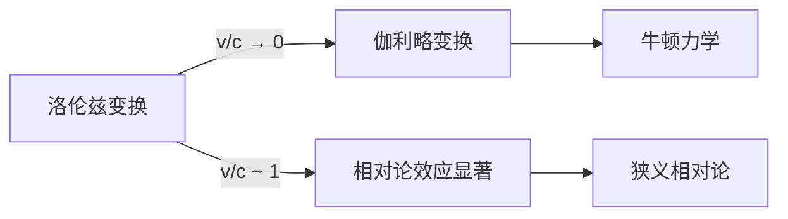
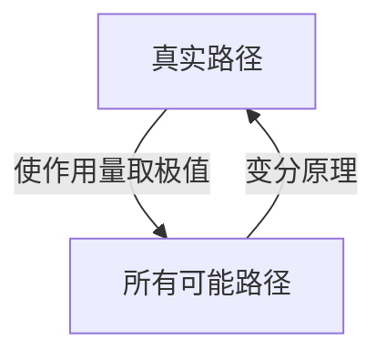
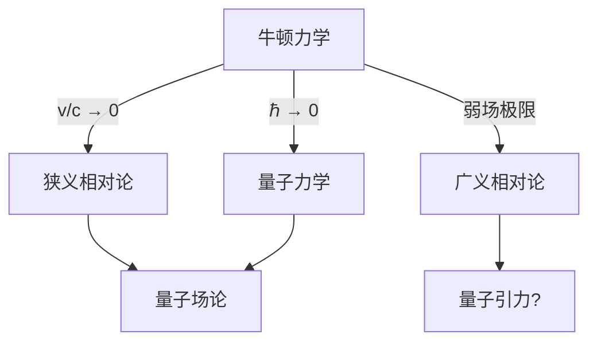

# 牛顿力学

> [!abstract] 概述
> 牛顿力学是经典物理学的基础，由艾萨克·牛顿在 1687 年的《自然哲学的数学原理》中系统阐述。它建立了宏观物体低速运动的基本规律，在==低速弱场极限下是相对论的良好近似==。牛顿力学不仅在物理学发展中占据核心地位，更是现代工程学、天文学和应用数学的基石。

## 一、牛顿运动定律

### 1.1 第一定律（惯性定律）

#### 内容表述

> [!note] 牛顿第一定律
> 任何物体都要保持匀速直线运动或静止状态，直到外力迫使它改变运动状态为止。

数学表述：若 $\sum \mathbf{F} = 0$，则 $\mathbf{v} = \text{const}$（包括 $\mathbf{v} = 0$ 的情况）。

**核心概念**：
- **惯性**：物体保持运动状态不变的性质
- **力**：改变物体运动状态的原因
- **惯性参考系**：第一定律成立的参考系

#### 惯性参考系

> [!important] 惯性系的定义
> 惯性参考系是指牛顿第一定律成立的参考系。在这样的参考系中，不受力的物体保持静止或匀速直线运动。

**惯性系的性质**：
1. 所有相对于某一惯性系做匀速直线运动的参考系都是惯性系
2. 惯性系之间有无穷多个，它们通过==伽利略变换==相联系
3. 地球表面近似为惯性系（忽略自转和公转的加速度）

**非惯性系中的惯性力**：
- 平动加速系：惯性力 $\mathbf{F}_{\text{in}} = -m\mathbf{a}_0$
- 转动参考系：
  - 离心力：$\mathbf{F}_{\text{cf}} = m\omega^2 \mathbf{r}_\perp$
  - 科里奥利力：$\mathbf{F}_{\text{Cor}} = -2m\boldsymbol{\omega} \times \mathbf{v}'$

#### 与相对论的关系

> [!warning] 局限性
> 牛顿第一定律在狭义相对论中仍然成立，但需要重新定义动量和力的概念。在广义相对论中，惯性系的概念被局部惯性系所取代，惯性运动对应于时空中的测地线。

### 1.2 第二定律

#### 基本形式：$\mathbf{F} = m\mathbf{a}$

> [!note] 牛顿第二定律
> 物体的加速度与作用力成正比，与物体质量成反比，加速度方向与作用力方向相同。

$$
\mathbf{F} = m\mathbf{a} = m\frac{d\mathbf{v}}{dt}
$$

**适用条件**：
- 质量 $m$ 为常量
- 低速运动（$v \ll c$）
- 惯性参考系

#### 动量形式：$\mathbf{F} = \frac{d\mathbf{p}}{dt}$

更普遍的形式使用动量 $\mathbf{p} = m\mathbf{v}$：

$$
\mathbf{F} = \frac{d\mathbf{p}}{dt} = \frac{d(m\mathbf{v})}{dt}
$$

当质量变化时（如火箭运动）：

$$
\mathbf{F} = \frac{dm}{dt}\mathbf{v} + m\frac{d\mathbf{v}}{dt}
$$

> [!example] 火箭方程
> 设火箭喷气速度为 $u$（相对火箭），质量流率为 $\frac{dm}{dt}$，则推力为：
> $$T = -u\frac{dm}{dt}$$
> 火箭运动方程（齐奥尔科夫斯基公式）：
> $$\Delta v = u \ln\frac{m_0}{m_f}$$

#### 适用范围

| 领域 | 是否适用 | 说明 |
|------|---------|------|
| 宏观低速 | ✅ | 日常工程应用 |
| 高速运动 | ❌ | 需用相对论力学 |
| 微观粒子 | ❌ | 需用量子力学 |
| 强引力场 | ❌ | 需用广义相对论 |

### 1.3 第三定律

#### 作用力与反作用力

> [!note] 牛顿第三定律
> 两个物体之间的作用力和反作用力总是大小相等、方向相反，作用在同一直线上。

$$
\mathbf{F}_{12} = -\mathbf{F}_{21}
$$

**特点**：
- 同时产生、同时消失
- 性质相同（如同为引力、同为弹力）
- 作用在不同物体上，==不能抵消==

#### 动量守恒

由第三定律可推导出质点系的动量守恒：

$$
\frac{d\mathbf{P}}{dt} = \sum_i \mathbf{F}_i^{\text{ext}} + \sum_{i,j} \mathbf{F}_{ij}^{\text{int}}
$$

由于内力成对抵消（$\mathbf{F}_{ij} = -\mathbf{F}_{ji}$），当外力为零时：

$$
\frac{d\mathbf{P}}{dt} = 0 \implies \mathbf{P} = \text{const}
$$

#### 局限：非接触力、相对论情况

> [!bug] 第三定律的局限
> 1. **非接触力**：电磁场中的运动电荷，作用力不满足严格的"同一直线"条件
> 2. **相对论情况**：力的传递需要时间，超距作用不成立
> 3. **场的作用**：现代物理认为力通过场传递，第三定律需要修正为包含场的动量

## 二、万有引力定律

### 2.1 定律表述

#### 引力公式

> [!note] 万有引力定律
> 任何两个质点都存在通过其连心线方向上的相互吸引的力，该引力大小与它们质量的乘积成正比，与它们距离的平方成反比。

$$
\mathbf{F} = -G\frac{Mm}{r^2}\hat{\mathbf{r}}
$$

其中：
- $G = 6.674 \times 10^{-11} \, \text{N}\cdot\text{m}^2/\text{kg}^2$ 为万有引力常数
- $\hat{\mathbf{r}}$ 为从 $M$ 指向 $m$ 的单位矢量

#### 引力常数 $G$

**卡文迪许实验**（1798）：
- 使用扭秤测量微小引力
- 首次精确测定 $G$ 值
- 被称为"称量地球"的实验

> [!info] 现代测量
> 目前 $G$ 的测量精度约为 $10^{-5}$，是基本物理常数中精度最低的之一。

### 2.2 引力势

#### 定义：$\Phi = -\frac{GM}{r}$

引力势定义为单位质量在引力场中的势能：

$$
\Phi(\mathbf{r}) = -\int_{\infty}^{\mathbf{r}} \mathbf{g} \cdot d\mathbf{l}
$$

对于质点 $M$：

$$
\Phi(r) = -\frac{GM}{r}
$$

引力场强度：

$$
\mathbf{g} = -\nabla\Phi
$$

#### 泊松方程：$\nabla^2\Phi = 4\pi G\rho$

> [!important] 引力场方程
> 引力势满足泊松方程，其中 $\rho$ 为质量密度：
> $$\nabla^2\Phi = 4\pi G\rho$$
> 
> 在无物质区域（$\rho = 0$），退化为拉普拉斯方程：
> $$\nabla^2\Phi = 0$$

**推导**：
由高斯定理，对任意闭合曲面：

$$
\oint \mathbf{g} \cdot d\mathbf{A} = -4\pi GM_{\text{enc}}
$$

转化为微分形式即得泊松方程。

### 2.3 轨道运动

#### 开普勒定律

> [!note] 开普勒三定律
> 1. **椭圆定律**：行星绕太阳的轨道是椭圆，太阳位于椭圆的一个焦点上
> 2. **面积定律**：行星与太阳的连线在相等时间内扫过相等的面积
> 3. **调和定律**：行星公转周期的平方与轨道半长轴的立方成正比

数学表述：
$$
T^2 = \frac{4\pi^2}{GM}a^3
$$

#### 椭圆轨道

在中心力场中，轨道方程为：

$$
r(\theta) = \frac{p}{1 + e\cos\theta}
$$

其中：
- $p = \frac{L^2}{GMm^2}$ 为半通径
- $e$ 为偏心率
- $L$ 为角动量

**轨道类型**：
| 偏心率 $e$ | 轨道类型 | 能量 $E$ |
|-----------|---------|---------|
| $e = 0$ | 圆 | $E < 0$（最小） |
| $0 < e < 1$ | 椭圆 | $E < 0$ |
| $e = 1$ | 抛物线 | $E = 0$ |
| $e > 1$ | 双曲线 | $E > 0$ |

#### 逃逸速度

从质量为 $M$、半径为 $R$ 的天体表面逃逸所需的最小速度：

$$
v_{\text{esc}} = \sqrt{\frac{2GM}{R}}
$$

> [!example] 地球的逃逸速度
> 代入 $M_\oplus = 5.97 \times 10^{24} \, \text{kg}$，$R_\oplus = 6.37 \times 10^6 \, \text{m}$：
> $$v_{\text{esc}} \approx 11.2 \, \text{km/s}$$

### 2.4 局限

> [!warning] 牛顿引力的局限
> 尽管牛顿万有引力定律在大多数情况下极其精确，但仍存在以下问题：

#### 水星近日点进动

水星轨道近日点的进动观测值为每世纪 $574''$，其中：
- 其他行星摄动贡献：$531''$
- ==剩余 $43''$ 无法用牛顿理论解释==

这一偏差最终由广义相对论完美解释。

#### 与狭义相对论的矛盾

1. **超距作用**：牛顿引力是瞬时作用，违反光速极限
2. **洛伦兹协变性**：牛顿引力方程不是洛伦兹协变的
3. **质量概念**：引力质量与惯性质量的等价性无法解释

#### 超距作用问题

> [!quote] 爱因斯坦的批评
> "牛顿的引力理论虽然在实际应用中极其成功，但它缺乏一个合理的物理机制来解释引力是如何跨越虚空瞬间作用的。"

## 三、伽利略变换

### 3.1 变换公式

设惯性系 $S'$ 相对于 $S$ 以速度 $v$ 沿 $x$ 轴运动，坐标变换为：

$$
\begin{cases}
x' = x - vt \\
y' = y \\
z' = z \\
t' = t
\end{cases}
$$

矩阵形式：

$$
\begin{pmatrix} x' \\ y' \\ z' \\ t' \end{pmatrix} = 
\begin{pmatrix} 
1 & 0 & 0 & -v \\
0 & 1 & 0 & 0 \\
0 & 0 & 1 & 0 \\
0 & 0 & 0 & 1 
\end{pmatrix}
\begin{pmatrix} x \\ y \\ z \\ t \end{pmatrix}
$$

#### 速度叠加

对时间求导得速度变换：

$$
\begin{cases}
u_x' = u_x - v \\
u_y' = u_y \\
u_z' = u_z
\end{cases}
$$

即 $\mathbf{u}' = \mathbf{u} - \mathbf{v}$

> [!example] 应用
> 在行驶的火车上（速度 $v$）向前抛球（相对火车速度 $u'$），地面观察者看到球的速度为 $u = u' + v$。

#### 加速度不变性

$$
\mathbf{a}' = \frac{d\mathbf{u}'}{dt'} = \frac{d(\mathbf{u} - \mathbf{v})}{dt} = \mathbf{a}
$$

加速度在所有惯性系中相同，保证牛顿第二定律形式不变。

### 3.2 绝对时空观

#### 时间绝对

> [!important] 绝对时间
> 牛顿认为："绝对的、真实的和数学的时间，由其本性决定，均匀地流逝，与任何外部事物无关。"

数学表述：$t' = t$，时间间隔与参考系无关。

#### 空间绝对

同时，空间间隔也是绝对的：

$$
\Delta l' = \sqrt{\Delta x'^2 + \Delta y'^2 + \Delta z'^2} = \sqrt{\Delta x^2 + \Delta y^2 + \Delta z^2} = \Delta l
$$

#### 同时性绝对

在 $S$ 系中同时发生的两个事件（$\Delta t = 0$），在 $S'$ 系中也同时（$\Delta t' = 0$）。

> [!bug] 问题所在
> 这种绝对同时性与麦克斯韦电磁理论矛盾。爱因斯坦在 1905 年的论文中正是从==同时性的相对性==出发，建立了狭义相对论。

### 3.3 与洛伦兹变换的关系

#### 低速极限：$v/c \to 0$

洛伦兹变换：

$$
\begin{cases}
x' = \gamma(x - vt) \\
t' = \gamma\left(t - \frac{vx}{c^2}\right)
\end{cases}
$$

其中 $\gamma = \frac{1}{\sqrt{1 - v^2/c^2}}$。

当 $v \ll c$ 时：
- $\gamma \to 1$
- $\frac{vx}{c^2} \to 0$

洛伦兹变换退化为伽利略变换。

#### 伽利略变换是洛伦兹变换的低速近似

> [!tip] 对应原理
> 新理论（相对论）必须在适当条件下包含旧理论（牛顿力学）作为极限情况。这是物理学理论自洽性的基本要求。

## 四、拉格朗日力学

### 4.1 拉格朗日量

#### 定义：$L = T - V$

> [!note] 拉格朗日量
> 对于一个力学系统，定义拉格朗日量为动能与势能之差：
> $$L = T - V$$
> 其中 $T$ 为系统动能，$V$ 为势能。

**例子**：自由质点
$$L = \frac{1}{2}m\dot{x}^2$$

**例子**：谐振子
$$L = \frac{1}{2}m\dot{x}^2 - \frac{1}{2}kx^2$$

#### 作用量原理

> [!important] 哈密顿原理（最小作用量原理）
> 系统的真实运动使作用量 $S$ 取极值：
> $$S = \int_{t_1}^{t_2} L \, dt$$
> $\delta S = 0$

**物理意义**：
- 自然界"选择"使作用量取极值的路径
- 这是一种全局性的描述，不同于牛顿力学的局部微分方程

### 4.2 欧拉-拉格朗日方程

#### 方程推导

由 $\delta S = 0$，对路径做变分 $q(t) \to q(t) + \delta q(t)$：

$$
\delta S = \int_{t_1}^{t_2} \left(\frac{\partial L}{\partial q}\delta q + \frac{\partial L}{\partial \dot{q}}\delta \dot{q}\right) dt = 0
$$

对第二项分部积分，利用边界条件 $\delta q(t_1) = \delta q(t_2) = 0$：

$$
\int_{t_1}^{t_2} \left[\frac{\partial L}{\partial q} - \frac{d}{dt}\left(\frac{\partial L}{\partial \dot{q}}\right)\right] \delta q \, dt = 0
$$

由于 $\delta q$ 任意，被积函数必为零：

$$
\frac{d}{dt}\left(\frac{\partial L}{\partial \dot{q}}\right) - \frac{\partial L}{\partial q} = 0
$$

#### 广义坐标

> [!note] 广义坐标
> 描述系统位形的一组独立参数 $q_1, q_2, \ldots, q_n$，可以是长度、角度或其他任何方便的量。

**例子**：
- 单摆：广义坐标为角度 $\theta$
- 双摆：广义坐标为 $\theta_1, \theta_2$
- 刚体：广义坐标为质心位置 + 欧拉角

### 4.3 对称性与守恒律

#### 诺特定理

> [!important] 诺特定理
> 每一种连续对称性都对应一个守恒量。

| 对称性 | 守恒量 |
|--------|--------|
| 时间平移不变性 | 能量 |
| 空间平移不变性 | 动量 |
| 旋转不变性 | 角动量 |
| 规范对称性 | 电荷 |

#### 时间平移 → 能量守恒

若 $L$ 不显含时间 $t$，则：

$$
\frac{dH}{dt} = 0, \quad H = \dot{q}\frac{\partial L}{\partial \dot{q}} - L
$$

$H$ 为哈密顿量，通常等于总能量 $T + V$。

#### 空间平移 → 动量守恒

若 $L$ 不显含坐标 $q_i$（循环坐标），则：

$$
\frac{\partial L}{\partial q_i} = 0 \implies \frac{d}{dt}\left(\frac{\partial L}{\partial \dot{q}_i}\right) = 0
$$

定义广义动量 $p_i = \frac{\partial L}{\partial \dot{q}_i}$，则 $p_i = \text{const}$。

#### 旋转 → 角动量守恒

若系统具有旋转对称性，则角动量守恒：

$$
\mathbf{L} = \mathbf{r} \times \mathbf{p} = \text{const}
$$

### 4.4 与相对论的联系

#### 相对论拉格朗日量

> [!tip] 自由粒子的相对论拉格朗日量
> $$L = -mc^2\sqrt{1 - \frac{v^2}{c^2}}$$
> 
> 低速展开（$v \ll c$）：
> $$L \approx -mc^2 + \frac{1}{2}mv^2 + \cdots$$
> 常数项 $-mc^2$ 不影响运动方程，第二项即为经典动能。

#### 最小作用量原理的推广

在广义相对论中，自由粒子的作用量为：

$$
S = -mc \int ds
$$

其中 $ds$ 为时空线元。这体现了==几何化==的思想：粒子沿着时空中的"直线"（测地线）运动。

## 五、哈密顿力学

### 5.1 哈密顿量

#### 定义：$H = \mathbf{p} \cdot \dot{\mathbf{q}} - L$

通过勒让德变换，从拉格朗日量 $L(q, \dot{q}, t)$ 转换到哈密顿量 $H(q, p, t)$：

$$
H = \sum_i p_i \dot{q}_i - L
$$

其中 $p_i = \frac{\partial L}{\partial \dot{q}_i}$ 为广义动量。

#### 正则方程

哈密顿运动方程（一阶微分方程组）：

$$
\begin{cases}
\dot{q}_i = \frac{\partial H}{\partial p_i} \\
\dot{p}_i = -\frac{\partial H}{\partial q_i}
\end{cases}
$$

> [!note] 与拉格朗日方程的比较
> - 拉格朗日方程：$n$ 个二阶方程
> - 哈密顿方程：$2n$ 个一阶方程
> - 哈密顿形式更对称，便于研究相空间结构

**例子**：自由粒子
$$H = \frac{p^2}{2m}$$

**例子**：谐振子
$$H = \frac{p^2}{2m} + \frac{1}{2}kq^2$$

### 5.2 相空间

#### $(q, p)$ 空间

> [!important] 相空间
> 由所有广义坐标和广义动量张成的 $2n$ 维空间。系统的状态由相空间中的一个点表示，运动轨迹称为相轨道。

**相空间体积元**：
$$d\Gamma = \prod_i dq_i \, dp_i$$

#### 刘维尔定理

> [!note] 刘维尔定理
> 保守系统的相空间体积在运动过程中保持不变：
> $$\frac{d\rho}{dt} = 0$$
> 其中 $\rho(q, p, t)$ 为相空间密度。

**物理意义**：
- 相空间中的"流体"不可压缩
- 是统计力学的基础
- 保证了微观可逆性

### 5.3 泊松括号

#### $\{f, g\}$ 的定义

对于相空间中的任意两个函数 $f(q, p)$ 和 $g(q, p)$：

$$
\{f, g\} = \sum_i \left(\frac{\partial f}{\partial q_i}\frac{\partial g}{\partial p_i} - \frac{\partial f}{\partial p_i}\frac{\partial g}{\partial q_i}\right)
$$

**基本泊松括号**：
$$
\{q_i, q_j\} = 0, \quad \{p_i, p_j\} = 0, \quad \{q_i, p_j\} = \delta_{ij}
$$

#### 运动方程的泊松括号形式

$$
\frac{df}{dt} = \frac{\partial f}{\partial t} + \{f, H\}
$$

#### 与量子力学的联系

> [!tip] 量子化规则
> 经典泊松括号与量子对易子的对应：
> $$\{f, g\} \longleftrightarrow \frac{1}{i\hbar}[\hat{f}, \hat{g}]$$
> 
> 特别地：
> $$\{q, p\} = 1 \longleftrightarrow [\hat{q}, \hat{p}] = i\hbar$$

这是从经典力学到量子力学的**正则量子化**方法的基础。

### 5.4 与相对论的联系

#### 相对论哈密顿量

对于相对论自由粒子：

$$
H = \sqrt{p^2c^2 + m^2c^4}
$$

低速展开：
$$
H \approx mc^2 + \frac{p^2}{2m} - \frac{p^4}{8m^3c^2} + \cdots
$$

第一项为静止能量，第二项为经典动能，第三项为相对论修正。

#### 协变形式

引入四维动量 $p^\mu = (E/c, \mathbf{p})$，质壳条件：

$$
p^\mu p_\mu = m^2c^2
$$

即：
$$
E^2 = p^2c^2 + m^2c^4
$$

## 六、牛顿力学与相对论的对应

### 6.1 低速极限

#### $\gamma \to 1$

洛伦兹因子：
$$
\gamma = \frac{1}{\sqrt{1 - v^2/c^2}}
$$

当 $v \ll c$ 时，泰勒展开：
$$
\gamma \approx 1 + \frac{1}{2}\frac{v^2}{c^2} + \frac{3}{8}\frac{v^4}{c^4} + \cdots
$$

#### 相对论动量 → 牛顿动量

相对论动量：
$$
\mathbf{p} = \gamma m\mathbf{v}
$$

低速极限：
$$
\mathbf{p} \approx m\mathbf{v}\left(1 + \frac{1}{2}\frac{v^2}{c^2} + \cdots\right) \to m\mathbf{v}
$$

#### 相对论能量 → 静止能量 + 动能

相对论总能量：
$$
E = \gamma mc^2 = mc^2 + \frac{1}{2}mv^2 + \cdots
$$

- 第一项 $mc^2$：静止能量（经典力学中无对应）
- 第二项 $\frac{1}{2}mv^2$：经典动能
- 高阶项：相对论修正

> [!important] 质能关系
> 即使静止物体也具有能量 $E_0 = mc^2$，这是核能释放的理论基础。

### 6.2 弱场极限

#### 施瓦西度规 → 牛顿引力势

施瓦西度规（球对称质量外部）：

$$
ds^2 = -\left(1 - \frac{2GM}{rc^2}\right)c^2dt^2 + \left(1 - \frac{2GM}{rc^2}\right)^{-1}dr^2 + r^2d\Omega^2
$$

弱场低速近似下，时间分量：

$$
g_{00} \approx -\left(1 + \frac{2\Phi}{c^2}\right)
$$

其中 $\Phi = -\frac{GM}{r}$ 为牛顿引力势。

#### 测地线方程 → 牛顿运动方程

广义相对论中的测地线方程：

$$
\frac{d^2x^\mu}{d\tau^2} + \Gamma^\mu_{\alpha\beta}\frac{dx^\alpha}{d\tau}\frac{dx^\beta}{d\tau} = 0
$$

在弱场低速近似下，空间分量退化为：

$$
\frac{d^2\mathbf{x}}{dt^2} = -\nabla\Phi
$$

这正是牛顿引力中的运动方程。

### 6.3 对应原理

> [!abstract] 对应原理
> 任何新的物理理论必须在旧理论已被验证的范围内与旧理论一致。

**具体表述**：
- 相对论在 $v/c \to 0$ 时回到牛顿力学
- 量子力学在 $\hbar \to 0$ 时回到经典力学
- 新理论不是"推翻"旧理论，而是==扩展其适用范围==

## 七、牛顿力学的成就

### 7.1 天体力学

#### 行星运动

牛顿力学成功解释了：
- 开普勒三定律的理论基础
- 行星轨道的精确计算
- 行星摄动效应

#### 彗星轨道

哈雷彗星的预言（1705）：
- 埃德蒙·哈雷应用牛顿理论计算彗星轨道
- 预言 1682 年出现的彗星将于 1758 年回归
- 1758 年彗星如期而至，验证了牛顿理论

#### 海王星的发现

> [!success] 牛顿力学的巅峰成就
> 1846 年，勒维耶和亚当斯分别独立通过天王星轨道的异常摄动，预言了海王星的位置。伽勒在预言位置附近发现了海王星，被誉为"笔尖上的发现"。

### 7.2 工程应用

#### 结构设计

- 建筑、桥梁的静力学分析
- 材料力学：应力、应变计算
- 稳定性分析

#### 流体力学

- 纳维-斯托克斯方程（基于牛顿第二定律）
- 伯努利方程
- 飞机翼型设计

#### 弹性力学

- 胡克定律：$F = -kx$
- 弹性波传播
- 振动分析

### 7.3 局限性总结

> [!warning] 牛顿力学的适用边界
> | 情况 | 失效原因 | 替代理论 |
> |------|---------|---------|
> | 高速运动（$v \sim c$） | 伽利略变换不成立 | 狭义相对论 |
> | 强引力场 | 引力几何化效应 | 广义相对论 |
> | 微观世界（原子尺度） | 量子效应显著 | 量子力学 |
> | 高速 + 微观 | 相对论量子效应 | 量子场论 |

## 延伸阅读

- [[相对论推导]] - 从洛伦兹变换到爱因斯坦场方程的完整推导
- [[相对论发展历程]] - 从伽利略到爱因斯坦的物理学革命

%%
牛顿力学是物理学的基石
虽然有其局限，但在日常应用中仍然极其重要
它是理解更高级理论（相对论、量子力学）的必经之路
掌握牛顿力学不仅是学习物理的基础，更是培养科学思维的关键
%%
