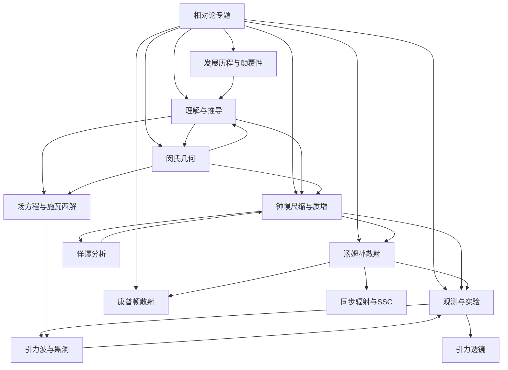
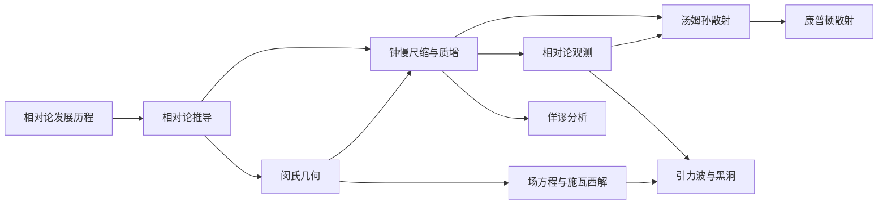

# 相对论专题

> [!abstract] 专题概述
> 相对论是现代物理学的两大支柱之一（另一为[[量子力学专题]]），由爱因斯坦于 1905 年（狭义相对论）和 1915 年（广义相对论）建立。它彻底颠覆了牛顿力学的绝对时空观，揭示了时空与物质、能量之间的深刻联系。
>
> 本专题已扩充，现涵盖：从以太理论到引力波探测的完整历史脉络、狭义与广义相对论的数学推导（含张量分析、场方程、施瓦西解）、钟慢尺缩与质增的定量分析及各类佯谬（双生子佯谬、贝尔飞船佯谬）、相对论观测（引力透镜、脉冲星计时、CMB）、闵氏几何与张量分析、以及汤姆孙散射的 QED 描述与同步辐射等天体物理应用。

## 专题地图

## 核心概念速览

| 概念         | 核心公式                                                                                                                  | 含义            | 详见                    |
| ---------- | --------------------------------------------------------------------------------------------------------------------- | ------------- | --------------------- |
| 洛伦兹因子      | $\gamma = \frac{1}{\sqrt{1 - v^2/c^2}}$                                                                               | 相对论效应的核心因子    | [[钟慢尺缩与质增#一、相对论因子 $\gamma$]]     |
| 时间膨胀       | $\Delta t = \gamma \Delta t_0$                                                                                        | 运动时钟变慢        | [[钟慢尺缩与质增#二、时间膨胀（钟慢效应）]]      |
| 长度收缩       | $L = L_0 / \gamma$                                                                                                    | 运动方向长度缩短      | [[钟慢尺缩与质增#三、长度收缩（尺缩效应）]]      |
| 质能等价       | $E = mc^2$                                                                                                            | 质量与能量等价       | [[相对论推导#3.4 质能方程的推导思路]]        |
| 洛伦兹变换      | $\begin{align} x' &= \gamma(x - vt) \\ y' &= y \\ z' &= z \\ t' &= \gamma\left(t - \frac{vx}{c^2}\right) \end{align}$ | 惯性系间的时空坐标变换   | [[相对论推导#一、洛伦兹变换的推导]]       |
| 时空间隔       | $\Delta s^2 = c^2\Delta t^2 - \Delta x^2$                                                                             | 闵氏时空中的不变量     | [[闵氏几何#1.3 时空间隔]]         |
| 光锥         | —                                                                                                                     | 因果结构的几何表示     | [[闵氏几何#三、光锥与因果结构]]           |
| 快度         | $\eta = \operatorname{artanh}(v/c)$                                                                                   | 速度的加法参数化      | [[闵氏几何#4.2 快度的优势]]          |
| 四维动量       | $P^\mu = (E/c, \mathbf{p})$                                                                                           | 能量与动量的统一      | [[闵氏几何#5.2 四维动量]]         |
| 多普勒效应      | $f_o = f_s \sqrt{\frac{1+\beta}{1-\beta}}$                                                                            | 相对论性频率移动      | [[钟慢尺缩与质增#五、相对论多普勒效应]]     |
| Terrell 转动 | —                                                                                                                     | 高速运动物体的视觉形变   | [[钟慢尺缩与质增#3.4 视觉效应：Terrell 转动（1959）]] |
| 引力红移       | $\frac{\Delta\lambda}{\lambda} = \frac{GM}{Rc^2}$                                                                     | 引力场中光的频率变化    | [[相对论推导#4.5.3 引力红移]]        |
| 引力透镜       | $\theta_E = \sqrt{\frac{4GM}{c^2}\frac{D_{ls}}{D_l D_s}}$                                                             | 引力场弯曲光线       | [[相对论观测#5.2 引力透镜]]        |
| 引力波        | $h \sim \frac{2G\ddot{Q}}{c^4 r}$                                                                                     | 时空曲率的涟漪       | [[相对论发展历程#3.4 引力波]]       |
| 爱因斯坦场方程    | $G_{\mu\nu} = \frac{8\pi G}{c^4} T_{\mu\nu}$                                                                          | 物质告诉时空如何弯曲    | [[相对论推导#4.3 爱因斯坦场方程]]         |
| 施瓦西度规      | $ds^2 = -\left(1-\frac{r_s}{r}\right)dt^2 + \left(1-\frac{r_s}{r}\right)^{-1}dr^2 + r^2 d\Omega^2$                    | 球对称真空解        | [[相对论推导#4.5.1 施瓦西解的推导概要]]        |
| 贝尔飞船佯谬     | —                                                                                                                     | 加速参考系中的长度收缩悖论 | [[钟慢尺缩与质增#3.6 贝尔的飞船佯谬]]    |
| 康普顿散射       | $\Delta\lambda = \lambda_C(1-\cos\theta)$                                                                             | 高能光子-电子非弹性散射   | [[康普顿散射#2.4 康普顿公式]]         |

## 专题子笔记

### 1. [[相对论发展历程]]

- 从伽利略相对性到爱因斯坦革命
- 以太理论与迈克尔逊-莫雷实验的"零结果"
- 狭义相对论的两条基本假设
- 广义相对论的建立：等效原理与引力几何化
- 水星近日点进动 —— 广义相对论的第一个胜利
- 引力波的预言与 LIGO 直接探测（2015）
- 黑洞物理：从施瓦西解到霍金辐射
- 相对论宇宙学：膨胀宇宙、大爆炸与暗能量
- 相对论的颠覆性：告别绝对时空

### 2. [[相对论推导]]

- 洛伦兹变换的推导
- 速度叠加公式与快度参数化
- 相对论动量与能量
- 质能方程 $E = mc^2$ 的推导
- 从狭义到广义：等效原理与测地线
- 张量分析基础：协变导数、黎曼曲率张量
- 爱因斯坦场方程的推导（最小作用量原理）
- 施瓦西解：球对称天体外部时空

### 3. [[钟慢尺缩与质增]]

- 时间膨胀的物理图像与推导
- 长度收缩的物理图像与推导
- 相对论质量增加
- 相对论因子 $\gamma$ 的深入理解
- 相对论多普勒效应（纵、横）
- 光行差效应
- Terrell 转动：高速运动物体的视觉外观
- 双生子佯谬的定量分析：加速阶段与全程积分
- 贝尔飞船佯谬：加速参考系中的弦断裂问题
- 车库佯谬等其他经典佯谬

### 4. [[相对论观测]]

- 同时性的相对性
- 光行差效应
- 相对论多普勒效应
- 关键实验验证（μ子寿命、Hafele-Keating 等）
- 引力红移与 Pound-Rebka 实验
- 引力透镜：强透镜、弱透镜、微透镜
- 脉冲星双星计时（PSR B1913+16）与引力波间接证据
- 宇宙微波背景辐射（CMB）中的相对论效应
- 相对论天体物理：活动星系核、喷流、伽马暴

### 5. [[汤姆孙散射]]

- 经典汤姆孙散射
- 相对论修正：[[康普顿散射]]的详细推导
- 量子电动力学（QED）描述：Klein-Nishina 公式
- 同步辐射谱：单电子与电子系综
- 同步自康普顿（SSC）模型
- 在相对论天体物理中的应用
- 与[[相对论观测]]的交叉

### 5b. [[康普顿散射]]（独立专题）

- 康普顿波长偏移的推导（三维守恒 + 四维动量法）
- Klein-Nishina 公式与极限行为
- 逆康普顿散射与能量增益 $\gamma^2$
- 康普顿化与康普顿 Y 参数
- S-Z 效应与宇宙学应用
- 与[[汤姆孙散射]]的低能衔接

### 6. [[闵氏几何]]

- 闵可夫斯基时空的数学结构
- 世界线与固有时
- 光锥与因果结构
- 时空间隔的不变性
- 张量分析：度规、逆变/协变分量、指标升降
- 洛伦兹群与庞加莱群：对称性与分类
- 四维速度、四维加速度、四维力、四维电流密度
- 诺特定理与守恒流
- 与[[钟慢尺缩与质增]]和[[相对论推导]]的几何统一

---

## 推荐阅读顺序

> [!tip] 学习建议
> 建议先阅读[[相对论发展历程]]建立历史直觉，再进入[[相对论推导]]掌握数学工具，然后通过[[闵氏几何]]获得几何图像，进而深入[[场方程与施瓦西解]]理解广义相对论。[[钟慢尺缩与质增]]和[[佯谬分析]]可配合阅读以巩固物理理解，[[相对论观测]]和[[引力波与黑洞]]提供实验与天体物理视角。[[汤姆孙散射]]和[[康普顿散射]]可作为进阶交叉阅读。

---

## 关键公式汇总

### 洛伦兹变换

$$
\begin{cases}
x' = \gamma(x - vt) \\
t' = \gamma\left(t - \frac{vx}{c^2}\right) \\
y' = y \\
z' = z
\end{cases}
\qquad
\gamma = \frac{1}{\sqrt{1 - v^2/c^2}}
$$

### 速度变换与快度

$$
u_x' = \frac{u_x - v}{1 - \frac{v u_x}{c^2}}, \qquad
\eta = \operatorname{artanh}\left(\frac{v}{c}\right), \qquad
\eta_{\text{tot}} = \eta_1 + \eta_2
$$

### 相对论动量与能量

$$
\mathbf{p} = \gamma m_0 \mathbf{v}, \qquad
E = \gamma m_0 c^2, \qquad
E^2 = p^2 c^2 + m_0^2 c^4
$$

### 四维动量

$$
P^\mu = \left(\frac{E}{c}, \mathbf{p}\right), \qquad
P^\mu P_\mu = -\frac{E^2}{c^2} + p^2 = -m_0^2 c^2
$$

### 时空间隔（闵氏度规）

$$
\Delta s^2 = c^2\Delta t^2 - \Delta x^2 - \Delta y^2 - \Delta z^2
$$

### 相对论多普勒效应

$$
f_o = f_s\, \frac{\sqrt{1 - \beta^2}}{1 - \beta \cos\theta_o}, \qquad
\beta = \frac{v}{c}
$$

### 引力红移

$$
\frac{\Delta \lambda}{\lambda} = \frac{GM}{Rc^2}, \qquad
\frac{\nu_\infty}{\nu_0} = \sqrt{1 - \frac{2GM}{Rc^2}}
$$

### 爱因斯坦场方程

$$
G_{\mu\nu} \equiv R_{\mu\nu} - \frac{1}{2}g_{\mu\nu}R = \frac{8\pi G}{c^4} T_{\mu\nu}
$$

### 施瓦西度规

$$
ds^2 = -\left(1 - \frac{r_s}{r}\right)c^2 dt^2 + \left(1 - \frac{r_s}{r}\right)^{-1} dr^2 + r^2(d\theta^2 + \sin^2\theta\, d\phi^2)
$$

其中 $r_s = \dfrac{2GM}{c^2}$ 为施瓦西半径。

### 引力透镜（爱因斯坦环角半径）

$$
\theta_E = \sqrt{\frac{4GM}{c^2} \frac{D_{ls}}{D_l D_s}}
$$

### [[康普顿散射]]（Klein-Nishina）

$$
\sigma_{\text{KN}} = \frac{3}{4}\sigma_T \left[ \frac{1+x}{x^3}\left(\frac{2x(1+x)}{1+2x} - \ln(1+2x)\right) + \frac{1}{2x}\ln(1+2x) - \frac{1+3x}{(1+2x)^2} \right], \quad x = \frac{h\nu}{m_e c^2}
$$

---

## 相关主题

- [[量子力学专题]] — 现代物理另一支柱，与相对论在量子场论中统一
- [[电磁学]] — 麦克斯韦方程组是狭义相对论的直接前驱
- [[牛顿力学]] — 相对论的低速近似
- [[天体物理]] — 相对论在天文尺度的重要应用

%%
专题持续更新中，已扩充历史脉络、数学推导、佯谬分析、天体物理观测等内容。
欢迎补充实验验证与数学推导细节。
%%