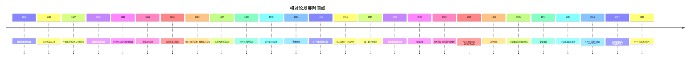

# 相对论发展历程

> [!quote] 爱因斯坦
> "想象力比知识更重要。知识是有限的，而想象力环绕整个世界。"

## 一、前相对论时代：经典时空观的困境

### 1.1 伽利略相对性原理 (1632)

伽利略在《关于两大世界体系的对话》中提出了最早的相对性思想：

> [!note] 伽利略相对性原理
> 在匀速运动的船舱内，任何力学实验都无法判断船是静止还是匀速运动。力学定律在所有惯性系中具有相同形式。

**伽利略变换**：

$$
\begin{cases}
x' = x - vt \\
t' = t \\
y' = y, \quad z' = z
\end{cases}
$$

核心假设：**时间是绝对的**，$t' = t$ 在所有参考系中成立。

#### 牛顿水桶实验与绝对空间 (1687)

牛顿在《自然哲学的数学原理》中提出了著名的**水桶实验**来论证绝对空间的存在：

> [!note] 水桶实验
> 将一只装有水的桶用绳索悬挂并旋转，绳索拧紧后释放。桶开始旋转时，水面最初保持平坦；随着水逐渐被桶壁带动旋转，水面呈现凹形；当桶停止旋转时，水继续旋转，水面仍保持凹形。

牛顿的分析：水面凹陷源于水相对于**绝对空间**的旋转，而非相对于桶壁的相对运动。他由此断言：

> [!important] 牛顿的论证
> 1. 当水和桶相对静止但水面平坦时——水相对于绝对空间静止
> 2. 当水和桶相对旋转但水面凹陷时——水相对于绝对空间旋转
> 3. 因此，离心力（惯性力）是相对于绝对空间的加速运动产生的真实效应

牛顿由此建立了绝对空间概念：**绝对空间**与外界任何事物无关，永远相同、不动；**绝对时间**与外界任何事物无关，均匀流逝。

#### 莱布尼兹与牛顿的时空观辩论

莱布尼兹与牛顿（通过克拉克进行书信辩论）就时空本质展开了哲学史上最深刻的争论之一：

> [!info] 双方立场
> | 牛顿-克拉克 | 莱布尼兹 |
> |---|---|
> | 时空是绝对的实体 | 时空是事物间关系的集合 |
> | 空间是上帝的感觉器官 | 空间不过是共存的秩序 |
> | 时间独立于事物均匀流逝 | 时间不过是连续的秩序 |
> | 真空可以存在 | 没有物质就没有空间 |

莱布尼兹的**关系论时空观**以"不可分辨事物的同一性"原理反驳牛顿：如果宇宙整体平移，按照牛顿绝对空间理论，这将是一个不同的物理状态，但在莱布尼兹看来，这连物理上可分辨的差异都不构成，因此绝对空间是多余的形而上学假设。

这场辩论在当时以牛顿的胜利告终，但莱布尼兹的思想在两个世纪后，通过马赫重新影响了爱因斯坦。

#### 马赫对绝对空间的批判（马赫原理）

恩斯特·马赫在其《力学史评》（1883）中对牛顿的绝对空间进行了系统批判：

> [!quote] 马赫
> "牛顿的水桶实验只是告诉我们，水相对于桶壁的旋转并不产生明显的离心力，而是水相对于地球和其他天体质量的旋转才产生离心力。如果桶壁做得足够厚、足够重，达到几英里厚，那么水相对于桶壁旋转时就会产生离心力。"

**马赫原理**的核心思想：

- 惯性不是物体自身的属性，而是物体与宇宙中所有其他物质相互作用的结果
- 一个物体的惯性取决于宇宙中所有物质的质量分布
- 如果宇宙中只有地球，地球就没有惯性；如果只有水桶，水桶的旋转就不产生离心力

> [!tip] 对爱因斯坦的影响
> 爱因斯坦深受马赫思想的启发，他将马赫原理称为"马赫原理"，并试图在广义相对论中实现它。尽管广义相对论并未完全实现马赫的设想，但马赫对绝对空间的批判直接催生了爱因斯坦的等效原理。

### 1.2 牛顿的绝对时空观 (1687)

牛顿在《自然哲学的数学原理》中明确：

> [!warning] 绝对时空观的局限
> - **绝对空间**：与外界任何事物无关，永远相同、不动
> - **绝对时间**：与外界任何事物无关，均匀流逝
> - 这种观念统治物理学两百余年，直到被相对论颠覆

牛顿的绝对时空观在经典力学中取得了巨大成功，但它隐含了一个根本假设：**存在一个优越的惯性参考系**——绝对空间本身。光速不变实验最终撼动了这个假设的根基。

### 1.3 麦克斯韦电磁理论与"以太"危机 (1865)

麦克斯韦方程组预言了电磁波的存在，且真空中光速为：

$$
c = \frac{1}{\sqrt{\mu_0\varepsilon_0}} \approx 3 \times 10^8 \text{ m/s}
$$

**关键问题**：光速 $c$ 是相对于哪个参考系的？

当时的物理学家假设存在"以太"——一种充满全空间的绝对静止介质，光是相对于以太的波动。

#### 以太理论的发展史

以太的概念经历了漫长的演变：

> [!info] 以太理论时间线
> - **笛卡尔（1644）**：提出"漩涡以太"理论，认为空间中充满不可见的微粒，天体的运动由以太漩涡驱动
> - **惠更斯（1690）**：在《光论》中明确将光视为以太中的纵波，以太必须极为坚硬（光速极大）却又极其稀薄（行星运动无阻力）——这一矛盾从一开始就困扰着以太理论
> - **托马斯·杨（1801）**：双缝干涉实验复兴了光的波动说，以太的存在似乎不可回避
> - **菲涅尔（1818）**：提出以太部分拖曳假说——运动介质中的以太被部分拖曳，拖曳系数为 $1 - 1/n^2$（$n$ 为折射率），成功解释了阿拉果星光折射实验
> - **麦克斯韦（1861-1865）**：将电磁场视为以太中的应力状态，建立了电磁以太的力学模型——分子涡旋模型，以太既是电磁场的载体，又是一种具有弹性的机械介质

> [!warning] 以太的矛盾
> 以太必须同时满足多个看似矛盾的性质：
> - 极度刚性（传播横波需要）—— 比钢硬得多
> - 极度稀薄（行星运动无阻力）
> - 充满所有空间，没有质量
> - 绝对静止，不可被拖曳

麦克斯韦本人意识到，如果以太是绝对静止的，那么地球在以太中运动时，应该能通过光学实验检测到"以太风"。

#### 菲索流水实验（1851）

阿曼德·菲索设计了第一个在地球上测量"以太拖曳"效应的实验：

> [!note] 菲索流水实验
> 让光通过流动的水，测量水的运动对光速的影响。仪器使用干涉测量法，光分成两束分别顺水流和逆水流通过水管，测量两束光的光程差。

**实验结果**：光速被水流部分拖曳，拖曳系数为：

$$
f = 1 - \frac{1}{n^2}
$$

其中 $n$ 为水的折射率（$n \approx 1.33$）。

> [!important] 实验意义
> - 与菲涅尔的部分拖曳假说完全吻合
> - 似乎支持运动介质中的以太被部分拖曳
> - 但无法区分"以太被拖曳"和"以太完全静止"两个模型——特殊相对论效应后来给出了完全不同的解释（速度叠加公式）
> - 这个实验是狭义相对论实验基础中不可或缺的一环

### 1.4 迈克尔逊-莫雷实验 (1887)

> [!important] 关键实验
> 迈克尔逊和莫雷设计了干涉仪来测量地球相对于以太的运动速度，预期观察到干涉条纹的移动。然而**实验中始终未发现任何条纹移动**——这就是著名的"零结果"。

#### 实验装置详细描述

迈克尔逊干涉仪的核心设计：

- 单色钠光源发出的光经半镀银镜分成两束
- 一束沿地球运动方向（"以太风"方向）传播，反射后返回
- 另一束垂直于地球运动方向传播，反射后返回
- 两束光会合后产生干涉条纹
- 整个装置安装在浮于水银池中的石板上，可以平稳旋转 90°

> [!note] 装置参数
> - 光臂长度：约 11 米（通过多次反射有效光程达 11 米）
> - 光源：钠光灯（波长 $\lambda \approx 589 \text{ nm}$）
> - 预期地球轨道速度：$v \approx 30 \text{ km/s}$
> - 预期条纹移动：约 0.4 个条纹宽度

#### 干涉原理的数学推导

设地球在以太中运动速度为 $v$，光速为 $c$。

**沿以太风方向（臂长 $L$）**：光去程需时 $t_1 = \frac{L}{c - v}$，回程需时 $t_2 = \frac{L}{c + v}$，总时间：

$$
t_{\parallel} = t_1 + t_2 = \frac{L}{c - v} + \frac{L}{c + v} = \frac{2L}{c} \cdot \frac{1}{1 - v^2/c^2} \approx \frac{2L}{c}\left(1 + \frac{v^2}{c^2}\right)
$$

**垂直于以太风方向（臂长 $L$）**：光在以太中的实际路径是斜线，总时间：

$$
t_{\perp} = \frac{2L}{\sqrt{c^2 - v^2}} = \frac{2L}{c} \cdot \frac{1}{\sqrt{1 - v^2/c^2}} \approx \frac{2L}{c}\left(1 + \frac{v^2}{2c^2}\right)
$$

**时间差**：

$$
\Delta t = t_{\parallel} - t_{\perp} \approx \frac{L v^2}{c^3}
$$

将装置旋转 90° 后，两臂角色互换，总时间差变为 $2\Delta t$。对应的条纹移动数：

$$
\Delta N = \frac{2L}{\lambda} \cdot \frac{v^2}{c^2}
$$

代入 $L = 11\text{ m}$，$\lambda = 589\text{ nm}$，$v = 30\text{ km/s}$：

$$
\Delta N \approx 0.4 \text{ 个条纹}
$$

迈克尔逊干涉仪可以检测到 0.01 个条纹的移动，因此 0.4 个条纹完全在可检测范围内。

#### 实验结果与后续验证

> [!danger] 零结果
> 实验观察到的条纹移动**始终为零**，远小于预期值。这意味着地球相对于以太的运动速度为零——这只有两种可能：
> 1. 以太被地球完全拖曳（但与其他实验矛盾）
> 2. 以太根本不存在，光速在所有惯性系中相同

迈克尔逊和莫雷在不同条件下重复实验：

- 在不同季节（地球轨道速度方向不同）
- 在不同海拔高度
- 在一天中的不同时间

所有实验均未发现预期的条纹移动。

> [!info] 莫雷-米勒后续实验（1904-1905）
> 莫雷与米勒在 1904-1905 年使用更灵敏的干涉仪（光臂长达 32 米，安装在木制结构上）重复了实验，灵敏度提高到 0.015 个条纹。结果仍为**零**。米勒后来在 1920 年代声称检测到约 10 km/s 的"以太漂移"，但这一结果被后续更精确的实验否定，普遍认为是系统误差所致。

**实验意义**：
- 否定了"以太"的存在
- 暗示光速在所有惯性系中可能都是相同的
- 成为狭义相对论最重要的实验前奏
- 迈克尔逊因此获得 1907 年诺贝尔物理学奖（美国第一个诺贝尔科学奖）

## 二、狭义相对论的诞生 (1905)

### 2.1 爱因斯坦的"奇迹年"

1905 年，26 岁的爱因斯坦在《论动体的电动力学》中提出了狭义相对论。同一年他还发表了光电效应、布朗运动等划时代论文。

> [!note] 1905 年爱因斯坦的四篇论文
> 1. **光电效应**（3月）：提出光量子假说，解释光电效应（1921年诺贝尔奖）
> 2. **布朗运动**（5月）：证明原子分子的存在
> 3. **狭义相对论**（6月）：《论动体的电动力学》
> 4. **质能等价**（9月）：$E = mc^2$

### 2.2 两条基本假设

> [!tip] 狭义相对论的两条公理
> 1. **相对性原理**：所有物理定律在所有惯性参考系中具有相同的形式
> 2. **光速不变原理**：真空中光速 $c$ 在所有惯性系中都是相同的，与光源的运动状态无关

这两条看似简单的假设，彻底颠覆了牛顿的绝对时空观。

### 2.3 洛伦兹、庞加莱的贡献

> [!note] 同时代人的工作
> - **洛伦兹** (1904)：提出了长度收缩和"地方时"的概念，导出了洛伦兹变换
> - **庞加莱** (1905)：几乎同时独立提出了相对性原理，并命名了"洛伦兹变换"
> - 但只有爱因斯坦将这两条假设提升为基本原理，并从中推导出全新的时空观

#### 洛伦兹的电子论与长度收缩

亨德里克·洛伦兹是 19 世纪末 20 世纪初最受尊敬的理论物理学家之一。他的**电子论**（1892-1904）试图在以太框架下解释电磁现象：

> [!info] 洛伦兹电子论的核心观点
> - 物质由带电粒子（电子）组成，以太是电磁场的载体且绝对静止
> - 迈克尔逊-莫雷实验的零结果需要物理上的解释
> - 洛伦兹与菲茨杰拉德独立提出：物体在以太中运动时，沿运动方向的长度会收缩

**洛伦兹-菲茨杰拉德收缩**：

$$
L = L_0 \sqrt{1 - \frac{v^2}{c^2}}
$$

> [!note] 收缩假说的由来
> 菲茨杰拉德在 1889 年首次提出长度收缩作为对迈克尔逊-莫雷实验的"特设性"解释。洛伦兹在 1892 年独立提出了同样的想法，并试图从电子论出发给出物理基础——分子间作用力是电磁力，如果电磁力受运动影响，分子间距也会改变。

洛伦兹还引入了**地方时**（local time）概念：

$$
t' = t - \frac{vx}{c^2}
$$

但他认为这只是数学辅助工具，不具备物理意义。

**对应态定理**（1895）：洛伦兹证明，对于在以太中匀速运动的系统，如果在"地方时"坐标下描述，电磁现象的一阶效应（$v/c$ 量级）与静止系统相同——这解释了为什么一阶光学实验无法检测到以太风。

**洛伦兹变换的原始推导动机**：洛伦兹在 1904 年试图找到一组坐标变换，使得麦克斯韦方程组在所有匀速运动参考系中保持相同形式（精确到所有阶，不仅仅是 $v/c$ 的一阶）。他最终得到了我们现在称为"洛伦兹变换"的方程组，但仍在以太框架下理解它——变换后的坐标只是"辅助量"，真实的空间和时间仍是绝对的。

#### 庞加莱的相对性思想

亨利·庞加莱是另一位接近狭义相对论的巨擘：

> [!info] 庞加莱的贡献
> 1. **《科学与假设》（1902）**：讨论了绝对空间和绝对时间概念的危机，质疑同时性的绝对性——"我们不仅没有关于两个时间段相等的直接直觉，甚至没有关于发生在不同地点的两个事件的同时性的直接直觉"
> 2. **1904 年圣路易斯演讲**：明确提出"相对性原理"——"根据这个原理，物理现象的定律对于一个固定的观察者和一个相对于他匀速平移运动的观察者应该是相同的，因此我们没有办法也没有任何手段辨别我们是否参与了这样的运动"
> 3. **1905 年 6 月论文**（比爱因斯坦的论文稍早提交）：完整推导了洛伦兹变换的群性质，命名了"洛伦兹变换"，证明了麦克斯韦方程组在这些变换下的协变性，并注意到洛伦兹变换在数学上构成一个群（洛伦兹群）

#### 为何历史将荣誉归于爱因斯坦

> [!question] 爱因斯坦的独特贡献
> 洛伦兹和庞加莱都掌握了洛伦兹变换的数学工具和相对性原理的思想，但：
> - **洛伦兹**始终将变换视为数学技巧，物理上坚持以太和绝对同时性，地方时只是辅助变量
> - **庞加莱**虽然更接近现代理解，但仍保留了以太概念，认为洛伦兹变换是"约定"而非物理实在的揭示
> - **爱因斯坦**将两条假设提升为**公理**，彻底抛弃了以太，重新定义了"同时性"的物理意义，将洛伦兹变换从数学工具转化为时空本性的揭示

爱因斯坦的贡献不在于变换公式本身，而在于**重新解释了时空概念**——同时性是相对的，时间和空间不再是分离的绝对实体，而是统一的四维时空的投影。这是一种深刻的**概念革命**，而非仅仅是数学技巧的改进。

## 三、广义相对论的建立 (1915)

### 3.1 等效原理

> [!note] 等效原理
> 引力场中的局部物理与加速参考系中的物理不可区分。

爱因斯坦称之为"一生中最快乐的思想"。

#### 爱因斯坦的电梯思想实验

1907 年，爱因斯坦在伯尔尼专利局工作时，构思了后来被称为"爱因斯坦电梯"的思想实验：

> [!example] 爱因斯坦电梯
> 想象一个封闭的电梯，无法看到外部。电梯中的物理学家做实验：
> 1. **电梯静止在地球表面**：物体自由下落，以加速度 $g$ 加速
> 2. **电梯在无引力太空中以加速度 $g$ 上升**：物体由于惯性"下落"，同样以加速度 $g$ 加速
> 
> 电梯内的物理学家**无法区分**这两种情况。所有力学实验给出相同结果。

> [!info] 关键推论
> 如果引力与加速不可区分，那么：
> - 引力场中光线应该弯曲（因为加速参考系中光线弯曲）
> - 引力场中时钟应该变慢（因为加速参考系中时间膨胀）
> - 引力质量与惯性质量的等价不再是巧合，而是深刻物理原理的体现

#### 弱等效原理与强等效原理

> [!important] 两种等效原理的区别
> | 弱等效原理（WEP） | 强等效原理（SEP） |
> |---|---|
> | 引力质量 = 惯性质量 | 所有物理定律（不仅是力学）在局部惯性系中与狭义相对论相同 |
> | 只涉及力学实验 | 涉及所有物理实验（包括电磁学、量子力学） |
> | 实验验证精度较高 | 验证更加困难 |
> | 广义相对论蕴涵 WEP | 广义相对论蕴涵 SEP |

#### Eötvös 实验

洛兰·厄特沃什（Eötvös Loránd）在 1889-1908 年间进行了精确测量引力质量与惯性质量比值的实验：

> [!note] Eötvös 扭秤实验
> 使用扭秤同时测量不同材料（木、铜、铅、水等）的引力加速度。如果引力质量与惯性质量之比因材料而异，地球自转产生的离心力（正比于惯性质量）与引力（正比于引力质量）的合力方向会略有不同，扭秤会检测到微小的扭矩。

**实验结果**：在 $10^{-9}$ 的精度内，所有材料的引力质量与惯性质量之比相同。

> [!info] 后续改进
> - Dicke 实验（1964）：精度提高到 $10^{-11}$
> - Braginsky 实验（1971）：精度达到 $10^{-12}$
> - 微卫星 MICROSCOPE 实验（2017）：精度达到 $10^{-15}$
> - 所有实验始终确认：引力质量 = 惯性质量

### 3.2 引力几何化

广义相对论的核心思想：

- 引力不是"力"，而是**时空弯曲**的表现
- 物质告诉时空如何弯曲，时空告诉物质如何运动（惠勒语）
- 爱因斯坦场方程：
  $$
  G_{\mu\nu} = \frac{8\pi G}{c^4} T_{\mu\nu}
  $$

### 3.3 三大经典验证

| 验证 | 年份 | 现象 |
|------|------|------|
| 水星近日点进动 | 1859(观测) / 1915(解释) | 每世纪 43 角秒的额外进动 |
| 光线在引力场中偏折 | 1919 (Eddington) | 日全食观测到星光偏折 1.75 角秒 |
| 引力红移 | 1959 (Pound-Rebka) | 光子在引力场中频率变化 |

#### 水星近日点进动

水星近日点进动是广义相对论的第一个胜利：

> [!note] 水星近日点进动的详细计算
> 水星轨道的近日点每世纪总进动约为 **5600 角秒**：
> - 地球岁差导致的坐标效应：约 5025 角秒
> - 其他行星引力摄动（牛顿力学）：约 532 角秒
> - 牛顿力学总计可解释：约 **5557 角秒**
> - **剩余无法解释的额外进动：约 43 角秒/世纪**

这 43 角秒的差异虽然微小，但远超出观测误差，困扰了天文学家半个多世纪。曾有人提出"火神星"（Vulcan）假说——一颗在太阳内侧未被发现的行星——但从未被观测到。

> [!quote] 爱因斯坦的激动
> 1915 年 11 月，爱因斯坦用广义相对论场方程计算水星近日点进动，得到精确的 43 角秒/世纪。他在给朋友的信中写道："我简直高兴得发狂了。水星近日点进动的计算结果是完全正确的。" 这是他一生中最激动人心的时刻之一。

广义相对论给出的进动角速度公式：

$$
\Delta \varphi = \frac{6\pi G M}{c^2 a(1 - e^2)}
$$

其中 $M$ 为太阳质量，$a$ 为轨道半长轴，$e$ 为偏心率。代入水星轨道参数，恰好得到 43 角秒/世纪。

#### 爱丁顿 1919 年日食观测

> [!note] 爱丁顿日食远征
> 1919 年 5 月 29 日的日全食为验证光线偏折提供了难得的机会。爱丁顿组织了两支远征队：
> - **索布拉尔（巴西）队**：格林尼治天文台的 Crommelin 和 Davidson 带队
> - **普林西比岛（西非）队**：爱丁顿本人和 Cottingham 带队

**观测原理**：日全食时，太阳附近的恒星可见。比较日食照片中恒星的位置与夜间（太阳不在附近时）恒星的位置，如果引力使光线偏折，太阳附近的恒星位置会向外移动。

> [!info] 观测过程
> - 普林西比岛当天有云，爱丁顿在日食期间只拍到 2 张有恒星的可分析照片
> - 索布拉尔队使用了两种望远镜，主望远镜因热膨胀导致焦距变化，备用望远镜（4 英寸）获得较好数据
> - 爱丁顿花了数月时间分析数据，最终在 1919 年 11 月 6 日公布了结果

**结果**：
- 索布拉尔：偏折角 $1.98'' \pm 0.16''$
- 普林西比：偏折角 $1.61'' \pm 0.40''$
- 广义相对论预言：$1.75''$（恰好是牛顿光学预言 $0.87''$ 的两倍）

> [!important] 历史意义
> 1919 年 11 月 7 日，《泰晤士报》头版标题："科学革命——牛顿理论被推翻"。爱因斯坦一夜之间成为世界名人。尽管后来对爱丁顿的数据分析存在争议（有人认为他有意排除了不利数据），但后续多次日食观测（1922 年、1929 年、1952 年）以及射电天文干涉测量都确认了广义相对论的预言。

#### Pound-Rebka 实验（1959）

> [!note] 实验设计
> Robert Pound 和 Glen Rebka 在哈佛大学杰斐逊实验室的 22.5 米高的塔上进行了引力红移的地面验证实验。

**原理**：光子从塔底射向塔顶时，需要克服引力势能，频率降低（红移）。相对频移为：

$$
\frac{\Delta \nu}{\nu} = \frac{g h}{c^2} \approx 2.46 \times 10^{-15}
$$

这是一个极其微小的效应。Pound 和 Rebka 利用**穆斯堡尔效应**（无反冲核共振吸收）来检测这一微小频移：

- 使用 $^{57}\text{Fe}$ 同位素，发射和吸收 14.4 keV 的伽马光子
- 穆斯堡尔效应提供极窄的谱线宽度（$\Delta E / E \approx 10^{-12}$），使得检测 $10^{-15}$ 量级的频移成为可能

> [!info] 实验结果
> 测量值：$\Delta \nu / \nu = (2.57 \pm 0.26) \times 10^{-15}$
> 理论值：$\Delta \nu / \nu = 2.46 \times 10^{-15}$
> 两者在误差范围内一致，首次在地面实验中确认了引力红移。

### 3.4 引力波

#### 爱因斯坦 1916 年预言

1916 年，爱因斯坦在广义相对论刚建立不久，就通过线性化爱因斯坦场方程预言了引力波的存在：

> [!note] 引力波的基本性质
> - 引力波是时空曲率的涟漪，以光速传播
> - 如同加速电荷产生电磁波，加速质量产生引力波
> - 引力波是横波，有两种偏振模式：$h_+$（加模式）和 $h_\times$（叉模式）
> - 引力波极其微弱——双黑洞并合产生的引力波到达地球时，空间应变仅约 $10^{-21}$（相当于测量地球到太阳距离的变化小于一个原子直径）

#### GW150914：人类首次直接探测引力波

2015 年 9 月 14 日，LIGO（激光干涉引力波天文台）的两台探测器几乎同时记录到了一个信号：

> [!important] GW150914 参数
> | 参数 | 数值 |
> |---|---|
> | 黑洞质量 | $36 M_\odot$ 和 $29 M_\odot$ |
> | 并合后质量 | $62 M_\odot$ |
> | 辐射的引力波能量 | $3 M_\odot c^2$ |
> | 距离 | 约 13 亿光年 |
> | 信号持续时间 | 约 0.2 秒 |
> | 峰值功率 | 约 $3.6 \times 10^{49}$ 瓦（超过可观测宇宙所有恒星的光度总和） |

> [!info] 双黑洞并合三阶段
> 1. **旋近阶段**（inspiral）：两个黑洞绕共同质心旋转，轨道逐渐衰减，引力波频率和振幅逐渐增大——"啁啾"信号
> 2. **并合阶段**（merger）：两个黑洞事件视界接触，合并为一个黑洞，引力波振幅达到峰值
> 3. **铃宕阶段**（ringdown）：新形成的黑洞通过辐射引力波振荡弛豫到稳定状态

#### GW170817：双中子星并合的多信使天文学

2017 年 8 月 17 日，LIGO 和 Virgo 探测到双中子星并合事件 GW170817：

> [!note] 多信使天文学里程碑
> - 引力波信号到达后约 1.7 秒，费米伽马射线望远镜探测到短伽马射线暴
> - 全球 70 多个天文台随后在电磁波全波段（射电、红外、光学、紫外、X 射线）观测到对应体
> - 确认了**千新星**（kilonova）——双中子星并合产生重元素（如金、铂）的核合成过程
> - 引力波与电磁波几乎同时到达，确认引力波以光速传播（验证了广义相对论）
> - 这是**多信使天文学**（multi-messenger astronomy）的开端

> [!tip] 引力波天文学的未来
> - **LISA**（空间激光干涉引力波天线）：欧空局计划在 2030 年代发射的空间引力波探测器，将探测低频引力波（超大质量黑洞并合等）
> - **Pulsar Timing Array**（脉冲星计时阵列）：利用脉冲星极稳定的脉冲到达时间变化来探测极低频引力波（纳赫兹引力波背景）
> - 引力波天文学将打开一扇全新的窗口，让我们"聆听"宇宙中最剧烈的天体物理事件

### 3.5 黑洞物理

#### 施瓦西解（1916）

就在爱因斯坦发表广义相对论场方程后仅几个月，德国天文学家卡尔·施瓦西在第一次世界大战前线（他当时在德国军队服役）找到了场方程的第一个精确解：

> [!note] 施瓦西度规
> $$
> ds^2 = -\left(1 - \frac{2GM}{c^2 r}\right)c^2 dt^2 + \left(1 - \frac{2GM}{c^2 r}\right)^{-1} dr^2 + r^2(d\theta^2 + \sin^2\theta d\phi^2)
> $$
>
> 在 $r = r_s = \frac{2GM}{c^2}$（施瓦西半径）处，度规出现奇异性——这是事件视界的位置。

施瓦西在 1916 年 5 月因天疱疮病逝于俄国前线，年仅 42 岁。他的解在数十年后才被充分理解其物理意义。

#### 奥本海默-斯奈德坍缩模型（1939）

> [!note] 恒星坍缩
> J. Robert Oppenheimer 和 Hartland Snyder 在 1939 年发表论文，证明大质量恒星在核燃料耗尽后，如果质量超过一定限度，没有任何已知的物理机制可以阻止其坍缩。从外部观察者看来，坍缩恒星表面无限接近施瓦西半径，但永远不会穿越——形成"冻结星"。但从坍缩物质自身的参考系来看，它会在有限时间内穿越事件视界，最终形成奇点。

#### 克尔度规（1963）

罗伊·克尔在 1963 年找到了描述**旋转黑洞**的精确解：

> [!info] 克尔黑洞
> - 由两个参数描述：质量 $M$ 和角动量 $a = J/M$
> - 存在**能层**（ergosphere）——在事件视界之外，时空被旋转黑洞拖曳，任何物体都无法相对于远处恒星保持静止
> - 从能层中可以提取黑洞的旋转能量（彭罗斯过程）
> - 旋转黑洞的奇点是一个**环**而非点

#### 霍金辐射（1974）

斯蒂芬·霍金将量子场论应用到弯曲时空，发现黑洞并非完全"黑"：

> [!important] 霍金辐射
> - 黑洞事件视界附近的量子涨落产生粒子-反粒子对
> - 其中一个粒子落入黑洞，另一个逃逸到无穷远
> - 对于远处的观察者，黑洞似乎在辐射粒子
> - 黑洞温度：$T_H = \frac{\hbar c^3}{8\pi G M k_B}$
> - 一个太阳质量的黑洞温度仅约 $10^{-7} \text{ K}$，辐射极其微弱

霍金辐射引发了**黑洞信息悖论**：落入黑洞的物质信息是否永久丢失？这与量子力学的基本原理（幺正性）矛盾。这一悖论至今仍是理论物理的核心难题之一。

#### 事件视界望远镜（EHT）——首张黑洞照片（2019）

2019 年 4 月 10 日，事件视界望远镜（Event Horizon Telescope）合作组发布了人类历史上首张黑洞照片：

> [!note] M87* 黑洞
> - 黑洞位于 M87 星系中心，距离地球约 5500 万光年
> - 质量约为太阳的 65 亿倍
> - EHT 使用全球 8 个射电望远镜进行甚长基线干涉测量（VLBI），等效口径达到地球直径
> - 照片显示了黑洞的"阴影"——被弯曲的光子路径形成的暗区，周围环绕着明亮的吸积盘光子环
> - 阴影大小与广义相对论对 $6.5 \times 10^9 M_\odot$ 黑洞的预言一致

2022 年，EHT 又发布了银河系中心黑洞 **Sgr A\*** 的照片，进一步确认了广义相对论的预言。

### 3.6 现代宇宙学

#### 弗里德曼方程与哈勃定律

> [!note] 弗里德曼方程（1922）
> 苏联数学家亚历山大·弗里德曼在 1922 年找到了爱因斯坦场方程的非静态宇宙解，证明了宇宙可以是膨胀或收缩的。爱因斯坦最初拒绝了这一结果（甚至发表短文认为弗里德曼的计算有误，后来撤回），但弗里德曼的工作最终被证明是正确的。

**弗里德曼方程**：

$$
\left(\frac{\dot{a}}{a}\right)^2 = \frac{8\pi G}{3}\rho - \frac{k c^2}{a^2} + \frac{\Lambda c^2}{3}
$$

其中 $a(t)$ 为宇宙尺度因子，$k$ 为空间曲率（$k = 0, \pm 1$），$\Lambda$ 为宇宙学常数。

> [!note] 哈勃定律（1929）
> 埃德温·哈勃通过观测发现，遥远星系的红移与距离成正比：
> $$
> v = H_0 d
> $$
> 其中 $H_0$ 为哈勃常数（当前测量值约为 $70 \text{ km/s/Mpc}$）。这直接表明宇宙正在膨胀。

#### 大爆炸理论与宇宙微波背景辐射

> [!info] 大爆炸理论要点
> - 宇宙初期处于极高温、极高密度的状态
> - 约 138 亿年前发生"大爆炸"
> - 早期宇宙经历原初核合成（BBN），生成氢、氦和少量锂
> - 约 38 万年后，宇宙冷却到足以让电子与原子核结合，光子自由传播——这就是**宇宙微波背景辐射**（CMB）的来源

**CMB 的发现**（1965）：彭齐亚斯和威尔逊在贝尔实验室使用射电天线时意外发现了弥漫全天的微波背景辐射，温度为 $2.725 \text{ K}$。这一发现为大爆炸理论提供了决定性证据，他们因此获得 1978 年诺贝尔物理学奖。

#### 暴胀理论

> [!note] 暴胀（Inflation）
> 1980 年代，古斯（Alan Guth）等人提出暴胀理论：宇宙在极早期（约 $10^{-36}$ 到 $10^{-32}$ 秒）经历了一次指数级加速膨胀，尺度增大了至少 $10^{26}$ 倍。暴胀解释了：
> - 宇宙的平坦性（为什么 $k \approx 0$）
> - 视界问题（为什么 CMB 在全天如此均匀）
> - 宇宙大尺度结构的种子（量子涨落在暴胀中被放大为密度扰动）

#### 暗能量与暗物质

> [!warning] 当代宇宙学的最大谜题
> 根据 Planck 卫星（2018）的 CMB 测量数据，宇宙的组成：
> - **普通物质**（重子物质）：约 5%
> - **暗物质**：约 27%
> - **暗能量**：约 68%
>
> 我们只能直接观测到约 5% 的宇宙，其余 95% 的本质至今未知。

> [!info] 暗物质
> - 不参与电磁相互作用，无法发光或反射光
> - 通过引力效应间接探测（星系旋转曲线、引力透镜、星系团碰撞）
> - 候选粒子：WIMP（弱相互作用大质量粒子）、轴子（axion）等
> - 直接探测实验（如 XENON、PandaX）至今未发现确凿信号

> [!info] 暗能量
> - 驱动宇宙加速膨胀（1998 年通过 Ia 型超新星观测发现，2011 年诺贝尔奖）
> - 最简单的模型是爱因斯坦的宇宙学常数 $\Lambda$
> - 状态方程参数 $w = p/\rho \approx -1$（与宇宙学常数一致）
> - 暗能量的本质是当代物理学最深奥的问题之一，可能涉及量子引力

## 四、相对论的颠覆性

### 4.1 对经典时空观的颠覆

> [!danger] 颠覆性总结
> | 牛顿力学 | 相对论 |
> |----------|--------|
> | 时空绝对分离 | 时空统一为四维时空 |
> | 同时性绝对 | 同时性是相对的 |
> | 质量不变 | 质量随速度增大 |
> | 引力是超距作用 | 引力是时空弯曲 |
> | 光速可变 | 光速是速度上限 |

### 4.2 哲学影响

- 打破了康德"先验时空观"——空间和时间不是先天的直观形式
- 科学实在论与操作主义的辩论
- 因果律的新理解：光锥结构

### 4.3 现代发展

- **引力波**：2015 年 LIGO 首次直接探测（2017 年诺贝尔奖）
- **黑洞**：2019 年 EHT 拍摄首张黑洞照片
- **宇宙学**：大爆炸理论、宇宙膨胀、暗能量
- **GPS 系统**：必须考虑广义和狭义相对论修正才能精确定位

### 4.4 相对论在日常生活中的应用

相对论并非只是远离日常生活的抽象理论，许多现代技术都依赖于相对论效应：

> [!example] GPS 全球定位系统
> GPS 卫星在距地面约 20,200 公里的轨道上以约 3.9 km/s 的速度运行。相对论效应导致卫星时钟与地面时钟产生偏差：
> - **狭义相对论效应**（速度导致时间膨胀）：卫星时钟每天慢约 7 微秒
> - **广义相对论效应**（引力势差导致时间快慢）：卫星时钟每天快约 45 微秒
> - **净效应**：卫星时钟每天快约 38 微秒
>
> 38 微秒看似微小，但如果不修正，乘以光速 ($3 \times 10^8 \text{ m/s}$)，会导致每天约 10 公里的定位误差。GPS 系统必须同时进行狭义和广义相对论修正才能实现米级定位精度。

> [!example] 粒子加速器
> 在大型强子对撞机（LHC）中，质子被加速到 6.5 TeV 的能量，速度达到 $0.99999999c$。狭义相对论效应：
> - 质子的动质量是静质量的约 7000 倍
> - 加速器设计必须考虑相对论性束流动力学
> - 粒子的寿命因时间膨胀而延长（例如，高速缪子的寿命比静止缪子长约 30 倍）

> [!example] 同步辐射光源
> 当电子在磁场中以接近光速偏转时，发出强烈的电磁辐射——同步辐射。相对论效应将辐射集中在沿运动方向的极窄锥角内（$\theta \sim 1/\gamma$，$\gamma$ 为洛伦兹因子）。同步辐射光源广泛应用于材料科学、结构生物学、化学等领域。

> [!example] PET 扫描
> 正电子发射断层扫描（PET）利用正负电子湮灭产生两个 511 keV 伽马光子，这两个光子以相反方向发射。广义相对论效应在这里不起作用，但狭义相对论质能关系 $E = mc^2$ 是 PET 成像的物理基础——正负电子质量转化为光子能量。

## 五、时间线总结

---

## 延伸阅读

- [[相对论推导]] — 深入数学推导
- [[钟慢尺缩与质增]] — 核心物理效应
- [[相对论观测]] — 实验验证详情
- [[闵氏几何]] — 时空几何表述
- [[量子力学专题]] — 量子力学与相对论的交汇
- [[黑体辐射]] — 量子论起源与相对论的历史背景
- [[电磁学]] — 麦克斯韦理论与相对论的电动力学基础

%%
历史脉络清晰后，可重点阅读迈克尔逊-莫雷实验的细节，这是理解相对论动机的关键。同时建议关注洛伦兹、庞加莱与爱因斯坦三者的思想差异，以理解科学革命中概念突破的重要性。
%%