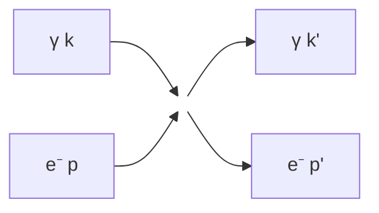
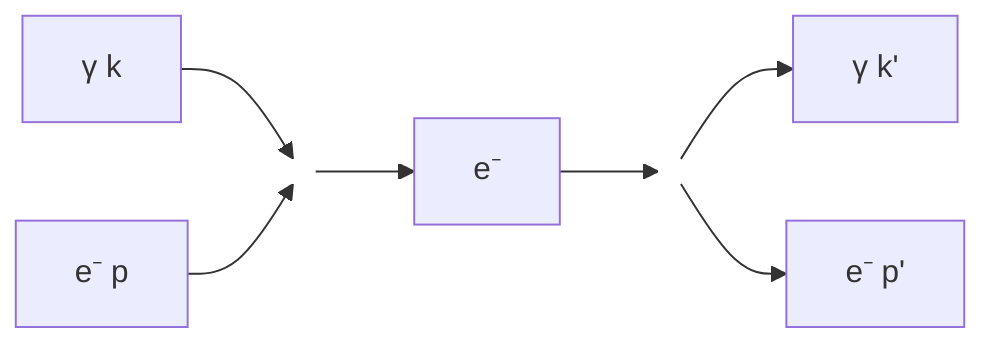
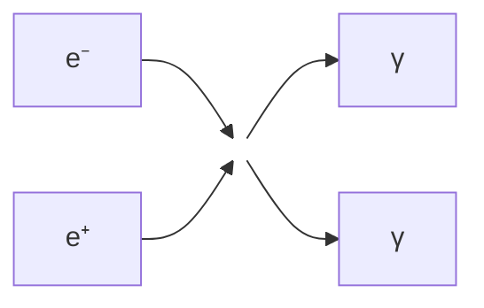
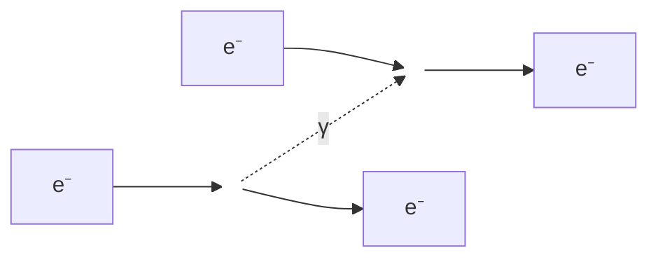
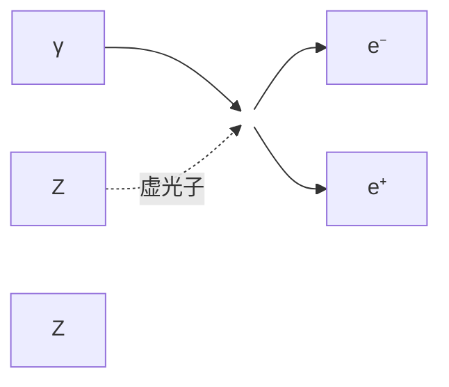
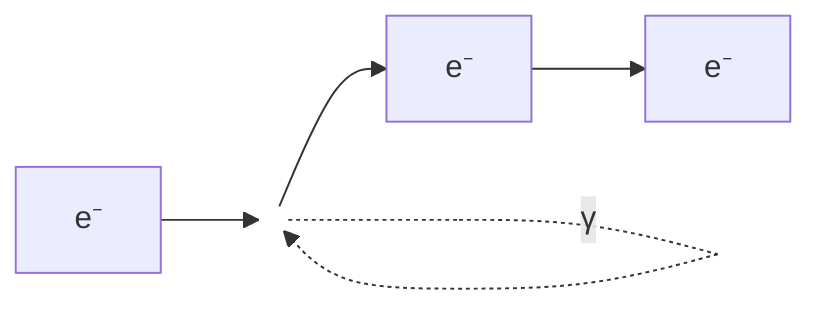
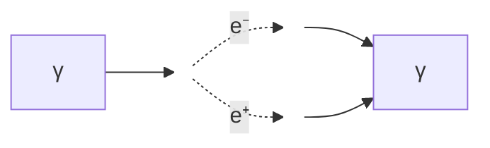
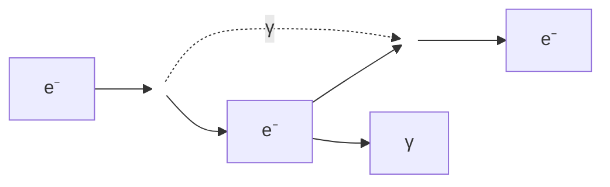

# 量子电动力学

> [!abstract] 概述
> **量子电动力学**（Quantum Electrodynamics, QED）是描述电磁相互作用的量子场论，是物理学中最精确的理论之一。它将量子力学与狭相对论相结合，成功描述了光与物质的相互作用，其预言精度达到 $10^{-12}$ 量级。QED 的核心思想是将电磁场量子化，引入光子作为电磁相互作用的媒介粒子，并通过微扰论计算各种物理过程的概率振幅。

QED 不仅是现代粒子物理标准模型的基石，也是理解原子物理、凝聚态物理乃至天体物理中电磁现象的基础理论。它的成功为后续发展量子色动力学（QCD）和电弱统一理论提供了重要的方法论基础。在某种意义上，QED 是人类对自然界理解最深刻的理论之一，其数学结构的优美和物理预言的精确令人叹为观止。

从历史的角度看，QED 的发展经历了近半个世纪的曲折过程。从 1928 年狄拉克提出相对论性电子方程开始，到 1940 年代末朝永振一郎、施温格和费曼完成重整化理论，再到 1950 年代以后的高精度实验检验，QED 的每一步发展都凝聚着众多物理学家的智慧。==QED 的创立是二十世纪理论物理学最伟大的成就之一==。

---

## 一、历史发展

### 1.1 早期量子电动力学

#### 狄拉克方程（1928）

1928年，保罗·狄拉克提出了相对论性量子力学的基本方程——**狄拉克方程**：

$$
(i\gamma^\mu \partial_\mu - m)\psi = 0
$$

其中 $\gamma^\mu$ 是狄拉克矩阵（满足反对易关系 $\{\gamma^\mu, \gamma^\nu\} = 2g^{\mu\nu}$），$\psi$ 是四分量旋量波函数。这个方程的提出是物理学史上的一个里程碑，它第一次成功地将量子力学与狭相对论统一起来。

狄拉克方程的推导思路如下：克莱因-戈登方程 $(\partial^2 + m^2)\phi = 0$ 是二阶的，导致负概率问题。狄拉克试图找到一个对时间和空间都是一阶的方程：

$$
i\frac{\partial \psi}{\partial t} = (-i\boldsymbol{\alpha} \cdot \nabla + \beta m)\psi
$$

为了保证概率密度正定，要求 $\alpha_i$ 和 $\beta$ 满足特定的反对易关系，这自然导致了矩阵表示和旋量结构。

> [!note] 狄拉克方程的意义
> - 自然导出电子自旋 $s = 1/2$，不需要人为引入
> - 预言反磁矩 $g = 2$，与实验近似符合
> - 为量子场论奠定基础，开辟了反物质研究的新领域
> - 解决了克莱因-戈登方程的负概率困难
> - 揭示了自旋是相对论性量子力学的必然结果

狄拉克方程成功地将量子力学与狭相对论统一起来，解决了克莱因-戈登方程的负概率问题。然而，它也带来了新的问题——负能量解的存在。狄拉克对此给出了一个大胆的解释，即著名的"空穴理论"。

#### 正电子的预言与发现

1931年，狄拉克基于**空穴理论**预言了正电子的存在。空穴理论的核心思想是：

1. 假设所有负能态都被电子填满（"狄拉克海"）
2. 如果一个负能态电子被激发到正能态，留下的"空穴"表现为一个带正电的粒子
3. 这个"空穴"具有与电子相同的质量但相反的电荷

> [!quote] 狄拉克的预言
> "对于每一个电子，都存在一个对应的反粒子，具有相同的质量但相反的电荷。这一预言彻底改变了我们对物质基本组成的理解。"

1932年，卡尔·安德森在宇宙线实验中利用云室观测到了正电子的轨迹。他在磁场中观察到一个粒子的偏转方向与电子相反，但曲率半径表明其质量与电子相同。这一发现证实了狄拉克的预言，标志着反物质概念的诞生。安德森因此获得了 1936 年诺贝尔物理学奖。

正电子的发现不仅验证了狄拉克理论的正确性，更重要的是它开创了粒子物理学的新纪元。此后，物理学家陆续发现了反质子、反中子等反粒子，所有已知的基本粒子都有对应的反粒子。

#### 空穴理论的局限

空穴理论虽然成功预言了反粒子，但存在严重缺陷：

- **只能描述费米子**：空穴理论依赖于泡利不相容原理来阻止所有电子落入负能态，因此无法应用于不服从泡利原理的玻色子
- **真空概念不自然**：真空被定义为"填满所有负能态的海"，这个概念在物理上不够基本，而且暗示真空具有无穷大的电荷密度和能量密度
- **无法处理粒子产生和湮灭过程**：在高能过程中，粒子数不守恒，空穴理论无法自然地描述粒子对的产生和湮灭
- **多体问题**：当涉及大量粒子时，追踪每个负能态是否被占据变得不切实际

这些局限性促使物理学家发展出更完善的**量子场论**框架。在量子场论中，粒子和反粒子被平等对待，粒子数可以不守恒，真空被定义为所有场的基态而非"填满的负能海"。

> [!note] 从空穴理论到量子场论的过渡
> 量子场论的核心思想是将场（而非粒子）视为基本的物理实体。粒子是场的激发态（量子），反粒子也是场的激发态，只是具有相反的量子数。这种观点自然地解释了粒子产生和湮灭过程：当场的能量足够高时，可以激发出更多的量子（粒子）。这种框架不仅适用于费米子，也适用于玻色子，具有更广泛的适用性。

### 1.2 重整化的诞生

#### 发散问题的出现

1930-1940年代，物理学家在计算高阶量子修正时遇到了严重的**发散问题**。这些发散出现在三个基本过程中：

- **电子自能**：电子发射并重新吸收一个虚光子，导致质量修正发散。这个发散是线性的，意味着电子的电磁质量无穷大
- **真空极化**：虚电子-正电子对的产生导致电荷屏蔽效应发散。真空不再是"空"的，而是充满了虚粒子对
- **顶点修正**：电子-光子顶点的高阶修正发散，导致电荷的重整化

> [!warning] 发散危机
> 这些无穷大似乎表明 QED 是一个不完备的理论，无法做出有限的物理预言。许多物理学家对此感到沮丧，甚至怀疑量子场论的基本框架是否有问题。玻尔曾考虑放弃场论方法，而海森堡则试图寻找新的基本长度标度来截断发散。

1937年，贝特首次估算了兰姆位移，使用了一个截断参数来正则化发散积分。虽然这个计算是半经验的，但它暗示发散问题可能是可以解决的。

#### 朝永振一郎、施温格、费曼的贡献

1940年代末，三位物理学家独立发展出了**重整化**方法，彻底解决了发散问题：

1. **朝永振一郎**（1947）：日本物理学家朝永振一郎发展了系统的重整化方案，提出了"超场"的概念，证明了所有发散都可以通过有限个参数的重新定义来吸收。他的工作虽然在日本发表，起初未引起国际物理学界的广泛关注。

2. **朱利安·施温格**（1948）：美国物理学家施温格用严格的数学形式完成了重整化计算。他的方法虽然复杂但极其精确，成功计算了电子的反常磁矩和兰姆位移。施温格的方法基于算符 formalism，计算过程极为繁琐但逻辑严密。

3. **理查德·费曼**（1948）：美国物理学家费曼发明了直观的**费曼图**方法。费曼图将复杂的数学计算转化为简单的图形规则，极大地简化了量子场论的计算。费曼的方法起初受到戴森等人的质疑，但很快被证明与施温格和朝永的方法等价。

> [!success] 重整化的突破
> 重整化理论证明，所有发散都可以通过重新定义物理质量、电荷和波函数来吸收，最终得到有限的、可测量的物理量。一个理论如果只需要有限个参数的重新定义就能吸收所有发散，就称为**可重整化**的。QED 正是这样一个可重整化理论。

戴森在 1949 年发表了一篇重要论文，证明了朝永、施温格和费曼三种方法的等价性，并给出了重整化理论的严格数学表述。这一工作为 QED 的最终确立奠定了基础。

三人因此共同获得 1965 年诺贝尔物理学奖。这是量子场论发展史上的一个高峰，标志着人类对电磁相互作用的理解达到了一个新的高度。

### 1.3 现代发展

#### 高精度检验

QED 经受了越来越精确的实验检验，每一次检验都进一步证实了理论的正确性：

- **电子反常磁矩**：理论预言与实验测量符合到 $10^{-12}$ 精度，这是物理学中最精确的验证之一。最新的测量使用单电子在彭宁阱中的回旋频率，精度达到了惊人的程度。这个实验将单个电子冷却到接近绝对零度，在超强磁场中束缚长达数月之久，测量其回旋频率和自旋进动频率的比值。
- **兰姆位移**：成功解释了氢原子 $2S_{1/2}$ 与 $2P_{1/2}$ 能级的微小差异，精度达到 kHz 量级。现代实验使用激光光谱学技术，精度比兰姆最初的测量提高了数百万倍。
- **里德伯常数**：高精度测定验证了 QED 预言，里德伯常数是物理学中测量最精确的常数之一，不确定度仅为 $10^{-12}$ 量级。
- **束缚态 QED**：对于高 Z 类氢离子，QED 修正变得非常重要，理论计算与实验结果高度一致。在铀离子（$Z = 92$）中，QED 修正可以达到总能量的 10% 以上。
- **卡西米尔效应**：1948年预言，1997年精确测量。两块不带电的金属板在真空中会相互吸引，这是真空零点能的直接物理效应。

#### 与其他相互作用的统一

QED 的成功为统一其他基本相互作用提供了范例和方法论基础：

- **电弱统一理论**（1967）：温伯格、萨拉姆和格拉肖将电磁相互作用与弱相互作用统一为电弱相互作用，基于 $SU(2)_L \times U(1)_Y$ 规范对称性。这一理论预言了 W 和 Z 玻色子的存在，并在 1983 年被实验发现。
- **标准模型**：基于 $SU(3) \times SU(2) \times U(1)$ 规范群，描述了强、弱、电磁三种基本相互作用，是当代粒子物理的基础框架。标准模型的最后一个重要组成部分——希格斯玻色子——于 2012 年在 LHC 上被发现。
- **大统一理论**：试图将电弱相互作用与强相互作用进一步统一，虽然尚未得到实验证实，但代表了物理学追求统一的传统。最简的 $SU(5)$ 模型已被质子衰变实验排除，但更复杂的模型（如 $SO(10)$）仍然可能。
- **量子引力**：将 QED 的方法推广到引力相互作用是物理学最大的挑战之一。弦理论、圈量子引力等候选理论试图解决这一问题，但尚未有实验验证。

---

## 二、经典场论基础

### 2.1 麦克斯韦方程组的协变形式

#### 四维势

在相对论性电动力学中，电磁场由**四维势**描述：

$$
A^\mu = \left(\frac{\phi}{c}, \mathbf{A}\right)
$$

其中 $\phi$ 是标量势，$\mathbf{A}$ 是矢量势。四维势的引入使得电磁场的描述具有明显的洛伦兹协变性。

电磁场可以由四维势导出：
$$
\mathbf{E} = -\nabla\phi - \frac{\partial \mathbf{A}}{\partial t}, \quad \mathbf{B} = \nabla \times \mathbf{A}
$$

这表明电场和磁场不是独立的，它们统一在四维势 $A^\mu$ 之中。

#### 场强张量

电磁场张量（场强张量）定义为四维势的外导数：

$$
F^{\mu\nu} = \partial^\mu A^\nu - \partial^\nu A^\mu
$$

其矩阵形式为：

$$
F^{\mu\nu} = \begin{pmatrix}
0 & -E_x/c & -E_y/c & -E_z/c \\
E_x/c & 0 & -B_z & B_y \\
E_y/c & B_z & 0 & -B_x \\
E_z/c & -B_y & B_x & 0
\end{pmatrix}
$$

场强张量是一个反对称张量，包含 6 个独立分量，正好对应电场的 3 个分量和磁场的 3 个分量。

对偶场强张量定义为：
$$
\tilde{F}^{\mu\nu} = \frac{1}{2}\epsilon^{\mu\nu\rho\sigma}F_{\rho\sigma}
$$

其矩阵形式将电场和磁场的角色互换。

#### 麦克斯韦方程

麦克斯韦方程组可以写成优美的协变形式：

**非齐次方程**（包含源）：
$$
\partial_\mu F^{\mu\nu} = \mu_0 J^\nu
$$

当 $\nu = 0$ 时，这给出高斯定律 $\nabla \cdot \mathbf{E} = \rho/\epsilon_0$；当 $\nu = i$ 时，给出安培-麦克斯韦定律。

**齐次方程**（比安基恒等式）：
$$
\partial_\lambda F_{\mu\nu} + \partial_\mu F_{\nu\lambda} + \partial_\nu F_{\lambda\mu} = 0
$$

等价地写为 $\partial_\mu \tilde{F}^{\mu\nu} = 0$。当 $\nu = 0$ 时，这给出 $\nabla \cdot \mathbf{B} = 0$；当 $\nu = i$ 时，给出法拉第电磁感应定律。

> [!tip] 协变形式的优势
> 麦克斯韦方程的协变形式明确显示了洛伦兹不变性，为量子化提供了自然的起点。它还将原本四个独立的方程压缩为两个简洁的张量方程，体现了物理学中统一和简洁的美学原则。

### 2.2 规范对称性

#### U(1) 规范对称性

QED 的基础是**局域 U(1) 规范对称性**。这是物理学中最基本的对称性之一。

全局 U(1) 变换：$\psi \rightarrow e^{-i\alpha}\psi$（$\alpha$ 为常数）对应电荷守恒。

局域 U(1) 变换：$\psi(x) \rightarrow e^{-ie\alpha(x)}\psi(x)$，其中 $\alpha(x)$ 是时空坐标的函数。

自由狄拉克拉格朗日量 $\mathcal{L} = \bar{\psi}(i\gamma^\mu \partial_\mu - m)\psi$ 在局域变换下不是不变的，因为导数项会产生额外的项：

$$
\partial_\mu \psi \rightarrow e^{-ie\alpha(x)}(\partial_\mu \psi - ie\partial_\mu\alpha \cdot \psi)
$$

#### 规范不变性

为了保持局域规范不变性，需要引入**规范场** $A_\mu$，并作如下变换：

$$
A_\mu \rightarrow A_\mu - \partial_\mu \alpha(x)
$$

同时引入**协变导数**：

$$
D_\mu = \partial_\mu + ieA_\mu
$$

协变导数的关键性质是它与规范场同步变换：
$$
D_\mu \psi \rightarrow e^{-ie\alpha(x)} D_\mu \psi
$$

这样，狄拉克拉格朗日量在局域 U(1) 变换下保持不变：

$$
\mathcal{L} = \bar{\psi}(i\gamma^\mu D_\mu - m)\psi = \bar{\psi}(i\gamma^\mu \partial_\mu - m)\psi - e\bar{\psi}\gamma^\mu \psi A_\mu
$$

> [!important] 规范不变性的物理意义
> 规范不变性不仅是一个数学技巧，它**决定了相互作用的形式**。QED 中电子与光子的耦合形式 $-e\bar{\psi}\gamma^\mu \psi A_\mu$ 完全由 U(1) 规范对称性决定。这就是所谓的"规范原理"——对称性决定相互作用。这一思想后来被推广到非阿贝尔规范理论，成为构建标准模型的核心原则。

#### 库仑规范与洛伦兹规范

为了量子化电磁场，需要选择适当的**规范条件**来消除冗余的自由度：

**库仑规范**（$\nabla \cdot \mathbf{A} = 0$）：
- 优点：物理自由度明确，只有横波模式；适合非相对论问题和原子物理
- 缺点：破坏洛伦兹协变性；标量势满足瞬时库仑势，不直观

**洛伦兹规范**（$\partial_\mu A^\mu = 0$）：
- 优点：保持洛伦兹协变性；方程形式简洁
- 缺点：需要引入不定度规（Gupta-Bleuler 方法）处理负范数态；条件不能完全固定规范

**轴规范**（$A_3 = 0$）和**光锥规范**（$A^+ = 0$）等其他规范选择在特定问题中也有应用。

---

## 三、量子化

### 3.1 电磁场的量子化

#### 光子作为场的量子

电磁场的量子化将经典电磁场分解为一系列谐振子模式。在库仑规范下，矢量势可以展开为平面波的叠加：

$$
\mathbf{A}(\mathbf{x}, t) = \sum_{\lambda=1,2} \int \frac{d^3k}{(2\pi)^3} \frac{1}{\sqrt{2\omega_k}} \left[ \boldsymbol{\epsilon}_\lambda(\mathbf{k}) a_\lambda(\mathbf{k}) e^{-ik\cdot x} + \boldsymbol{\epsilon}_\lambda^*(\mathbf{k}) a^\dagger_\lambda(\mathbf{k}) e^{ik\cdot x} \right]
$$

其中：
- $\omega_k = |\mathbf{k}|$ 是光子频率（光子无质量，满足 $E = |\mathbf{p}|$）
- $\boldsymbol{\epsilon}_\lambda(\mathbf{k})$ 是偏振矢量，满足 $\boldsymbol{\epsilon}_\lambda \cdot \mathbf{k} = 0$（横波条件）
- $a_\lambda(\mathbf{k})$ 是湮灭算符
- $a^\dagger_\lambda(\mathbf{k})$ 是产生算符

#### 产生与湮灭算符

产生算符 $a^\dagger_\lambda(\mathbf{k})$ 和湮灭算符 $a_\lambda(\mathbf{k})$ 满足**玻色子对易关系**：

$$
[a_\lambda(\mathbf{k}), a^\dagger_{\lambda'}(\mathbf{k}')] = (2\pi)^3 \delta_{\lambda\lambda'} \delta^{(3)}(\mathbf{k} - \mathbf{k}')
$$

$$
[a_\lambda(\mathbf{k}), a_{\lambda'}(\mathbf{k}')] = [a^\dagger_\lambda(\mathbf{k}), a^\dagger_{\lambda'}(\mathbf{k}')] = 0
$$

物理意义：
- $a^\dagger_\lambda(\mathbf{k})|0\rangle$ 产生一个动量为 $\mathbf{k}$、偏振为 $\lambda$ 的光子
- $a_\lambda(\mathbf{k})|n_\mathbf{k}\rangle = \sqrt{n_\mathbf{k}}|n_\mathbf{k}-1\rangle$ 湮灭一个光子
- $a^\dagger_\lambda(\mathbf{k})|n_\mathbf{k}\rangle = \sqrt{n_\mathbf{k}+1}|n_\mathbf{k}+1\rangle$ 产生一个光子
- 光子数算符 $N = a^\dagger a$ 的本征值为非负整数

#### 福克空间

多粒子态构成**福克空间**（Fock space）：

$$
\mathcal{F} = \bigoplus_{n=0}^{\infty} \mathcal{H}_n = \mathcal{H}_0 \oplus \mathcal{H}_1 \oplus \mathcal{H}_2 \oplus \cdots
$$

其中 $\mathcal{H}_n$ 是 $n$ 粒子态的希尔伯特空间。

真空态 $|0\rangle$ 满足：
$$
a_\lambda(\mathbf{k})|0\rangle = 0 \quad \forall \lambda, \mathbf{k}
$$

单光子态：$|\mathbf{k}, \lambda\rangle = a^\dagger_\lambda(\mathbf{k})|0\rangle$

双光子态：$|\mathbf{k}_1, \lambda_1; \mathbf{k}_2, \lambda_2\rangle = a^\dagger_{\lambda_1}(\mathbf{k}_1) a^\dagger_{\lambda_2}(\mathbf{k}_2)|0\rangle$

> [!note] 零点能
> 电磁场的哈密顿量为：
> $$H = \sum_\lambda \int d^3k \, \omega_k \left(a^\dagger_\lambda(\mathbf{k}) a_\lambda(\mathbf{k}) + \frac{1}{2}\right)$$
> 无穷大的零点能 $\frac{1}{2}\sum \omega_k$ 通过正规序乘积去除。在量子场论中，我们定义物理哈密顿量为正规序形式 $:H:$，使得真空能量为零。零点能的物理效应在卡西米尔效应中可以被观测到。

### 3.2 狄拉克场的量子化

#### 旋量场

狄拉克场 $\psi(x)$ 是四分量旋量，可以展开为正频和负频部分的叠加：

$$
\psi(x) = \int \frac{d^3p}{(2\pi)^3} \frac{1}{\sqrt{2E_p}} \sum_{s=1,2} \left[ u^s(\mathbf{p}) b^s(\mathbf{p}) e^{-ip\cdot x} + v^s(\mathbf{p}) d^{s\dagger}(\mathbf{p}) e^{ip\cdot x} \right]
$$

其中：
- $u^s(\mathbf{p})$ 是正能解旋量，满足 $(\not{p} - m)u^s(p) = 0$
- $v^s(\mathbf{p})$ 是负能解旋量，满足 $(\not{p} + m)v^s(p) = 0$
- $b^s(\mathbf{p})$ 是电子湮灭算符
- $d^s(\mathbf{p})$ 是正电子湮灭算符

旋量的归一化条件：
$$
\bar{u}^r(p) u^s(p) = 2m\delta^{rs}, \quad \bar{v}^r(p) v^s(p) = -2m\delta^{rs}
$$

完备性关系：
$$
\sum_s u^s(p)\bar{u}^s(p) = \not{p} + m, \quad \sum_s v^s(p)\bar{v}^s(p) = \not{p} - m
$$

#### 反对易关系

由于狄拉克场描述费米子，必须使用**反对易关系**（这是泡利不相容原理的场论表述）：

$$
\{b^r(\mathbf{p}), b^{s\dagger}(\mathbf{q})\} = (2\pi)^3 \delta^{rs} \delta^{(3)}(\mathbf{p} - \mathbf{q})
$$

$$
\{d^r(\mathbf{p}), d^{s\dagger}(\mathbf{q})\} = (2\pi)^3 \delta^{rs} \delta^{(3)}(\mathbf{p} - \mathbf{q})
$$

所有其他反对易子为零：$\{b, b\} = \{d, d\} = \{b, d\} = \{b, d^\dagger\} = 0$

等时反对易关系：
$$
\{\psi_\alpha(\mathbf{x}, t), \psi^\dagger_\beta(\mathbf{y}, t)\} = \delta^{(3)}(\mathbf{x} - \mathbf{y})\delta_{\alpha\beta}
$$

> [!warning] 为什么使用反对易关系？
> 如果对费米子场使用对易关系，会导致：
> - 能量无下界（负能态问题无法解决）
> - 违反自旋-统计定理（自旋半整数粒子必须服从费米-狄拉克统计）
> - 破坏因果性（类空间隔的观测量的对易子不为零）
> 
> 这是**自旋-统计定理**的一个具体体现：半整数自旋粒子必须是费米子，服从泡利不相容原理。

#### 粒子与反粒子

狄拉克场的量子化自然导出了**反粒子**概念：

- $b^{s\dagger}(\mathbf{p})|0\rangle$：产生一个电子（电荷 $-e$，自旋投影 $s$，能量 $E_p = \sqrt{\mathbf{p}^2 + m^2}$）
- $d^{s\dagger}(\mathbf{p})|0\rangle$：产生一个正电子（电荷 $+e$，自旋投影 $s$，能量 $E_p$）

正电子是电子的反粒子，具有相同的质量和自旋，但电荷和所有相加性量子数相反。

电荷算符：
$$
Q = -e \int \frac{d^3p}{(2\pi)^3} \sum_s \left(b^{s\dagger}(\mathbf{p}) b^s(\mathbf{p}) - d^{s\dagger}(\mathbf{p}) d^s(\mathbf{p})\right)
$$

这表明电子带负电，正电子带正电。

### 3.3 相互作用

#### 最小耦合

从经典力学到电动力学的过渡遵循**最小耦合**原则：

$$
p^\mu \rightarrow p^\mu - eA^\mu
$$

在量子力学中，这对应于动量算符的替换 $\hat{p}_\mu \rightarrow \hat{p}_\mu - eA_\mu$。

在量子场论中，这对应于将普通导数替换为协变导数：

$$
\partial_\mu \rightarrow D_\mu = \partial_\mu + ieA_\mu
$$

最小耦合原则保证了规范不变性，并且是唯一的不导数耦合形式。这一原则的物理直觉是：带电粒子在电磁场中运动时，其动量不仅包含机械动量 $p^\mu$，还包含与电磁场相互作用的贡献 $eA^\mu$。总动量 $p^\mu - eA^\mu$ 才是规范不变的物理量。

最小耦合还可以从几何角度理解：在规范理论中，协变导数 $D_\mu$ 是纤维丛上的联络（connection），规范场 $A_\mu$ 是联络系数。最小耦合就是要求物理定律在纤维丛的规范变换下保持不变，这是微分几何中"平行移动"概念在物理学中的自然体现。

#### 相互作用拉格朗日量

完整的 QED 拉格朗日量为：

$$
\mathcal{L}_{\text{QED}} = \bar{\psi}(i\gamma^\mu D_\mu - m)\psi - \frac{1}{4}F_{\mu\nu}F^{\mu\nu}
$$

展开后得到三个部分：

$$
\mathcal{L}_{\text{QED}} = \underbrace{\bar{\psi}(i\gamma^\mu \partial_\mu - m)\psi}_{\text{自由狄拉克场}} - \underbrace{\frac{1}{4}F_{\mu\nu}F^{\mu\nu}}_{\text{自由电磁场}} - \underbrace{e\bar{\psi}\gamma^\mu \psi A_\mu}_{\text{相互作用}}
$$

相互作用项可以写成：

$$
\mathcal{L}_{\text{int}} = -e\bar{\psi}\gamma^\mu \psi A_\mu = -eJ^\mu A_\mu
$$

其中 $J^\mu = \bar{\psi}\gamma^\mu \psi$ 是电磁流密度，它守恒：$\partial_\mu J^\mu = 0$。

> [!important] 相互作用的物理意义
> 相互作用项 $-e\bar{\psi}\gamma^\mu \psi A_\mu$ 描述了电子-正电子场与电磁场的耦合，是 QED 中所有物理过程的起源。这个简单的三项耦合包含了几乎所有已知的电磁现象：光的发射和吸收、电子散射、正负电子对产生等等。耦合常数 $e$（或等价地 $\alpha = e^2/4\pi \approx 1/137$）决定了电磁相互作用的强度。

---

## 四、费曼图

### 4.1 微扰展开

#### S 矩阵

散射过程由**S 矩阵**（散射矩阵）描述：

$$
S = \lim_{t\to\infty, t_0\to-\infty} U(t, t_0)
$$

其中 $U(t, t_0)$ 是时间演化算符。S 矩阵元 $\langle f|S|i\rangle$ 给出从初态 $|i\rangle$ 到末态 $|f\rangle$ 的跃迁振幅。

S 矩阵可以分解为：
$$
S = 1 + iT
$$

其中 $1$ 代表无散射（粒子直线通过），$T$ 是跃迁矩阵。物理上有意义的是 $T$ 矩阵元。

对于散射过程，定义不变振幅 $\mathcal{M}$：
$$
\langle f|iT|i\rangle = (2\pi)^4 \delta^{(4)}(p_f - p_i) \cdot i\mathcal{M}
$$

#### 戴森级数

在相互作用绘景中，S 矩阵可以展开为**戴森级数**：

$$
S = \sum_{n=0}^{\infty} \frac{(-i)^n}{n!} \int d^4x_1 \cdots d^4x_n \, T\{\mathcal{H}_{\text{int}}(x_1) \cdots \mathcal{H}_{\text{int}}(x_n)\}
$$

其中 $T$ 是编时乘积算符，$\mathcal{H}_{\text{int}} = -\mathcal{L}_{\text{int}} = e\bar{\psi}\gamma^\mu \psi A_\mu$。

各项的物理意义：
- $n = 0$：$S^{(0)} = 1$，无散射
- $n = 1$：$S^{(1)}$，单顶点过程（对于 QED，由于 Furry 定理，许多单顶点过程为零）
- $n = 2$：$S^{(2)}$，双顶点过程，对应树图阶散射

#### 威克定理

**威克定理**是将编时乘积转化为正规序乘积的关键工具：

$$
T\{\psi(x_1)\bar{\psi}(x_2)\} = :\psi(x_1)\bar{\psi}(x_2): + \contraction{}{\psi}{(x_1)}{\bar{\psi}} \psi(x_1)\bar{\psi}(x_2)
$$

收缩定义为真空期望值：

$$
\contraction{}{\psi}{(x_1)}{\bar{\psi}} \psi(x_1)\bar{\psi}(x_2) = \langle 0|T\{\psi(x_1)\bar{\psi}(x_2)\}|0\rangle = S_F(x_1 - x_2)
$$

这就是**费曼传播子**（坐标空间）。

对于光子场：
$$
\contraction{}{A}{_\mu(x_1) A}{_\nu} A_\mu(x_1) A_\nu(x_2) = \langle 0|T\{A_\mu(x_1) A_\nu(x_2)\}|0\rangle = D_{F,\mu\nu}(x_1 - x_2)
$$

威克定理使得我们可以系统地将 S 矩阵的每一项分解为各种收缩的组合，每种组合对应一个费曼图。

### 4.2 费曼规则

#### 传播子

**电子传播子**（动量空间）：

$$
S_F(p) = \frac{i(\gamma^\mu p_\mu + m)}{p^2 - m^2 + i\epsilon} = \frac{i(\not{p} + m)}{p^2 - m^2 + i\epsilon}
$$

物理意义：传播子描述了电子从一点传播到另一点的概率振幅。分母中的 $p^2 - m^2$ 在质壳上为零，对应实粒子传播；偏离质壳时对应虚粒子传播。传播子的分子 $(\not{p} + m)$ 编码了电子自旋的信息，它包含了正能态和负能态投影算符的叠加。在坐标空间中，传播子在类空间隔上指数衰减（$\sim e^{-mr}$），这表明虚电子的传播范围受限于其康普顿波长 $\lambda_C = 1/m$。

**光子传播子**（费曼规范）：

$$
D_F^{\mu\nu}(k) = \frac{-ig^{\mu\nu}}{k^2 + i\epsilon}
$$

不同规范选择给出不同的光子传播子形式，但物理结果（S 矩阵元）与规范选择无关。

> [!note] $i\epsilon$  prescriptions
> 无穷小量 $i\epsilon$ 确保了传播子的正确解析性质，对应于因果性条件（费曼传播子包含正频向前传播和负频反向传播）。在数学上，它规定了如何绕过极点，定义了费曼传播子与推迟/超前格林函数的关系。

#### 顶点

每个电子-光子顶点贡献因子：

$$
-ie\gamma^\mu
$$

其中 $\mu$ 是与光子极化对应的洛伦兹指标。顶点因子包含了电磁相互作用的所有旋量结构。

#### 费曼图的构造规则

对于给定的物理过程，费曼振幅的计算规则如下：

1. **画出所有可能的连通费曼图**（到所需微扰阶数）
2. **为每条外线分配旋量或极化矢量**：
   - 入射电子：$u^s(p)$
   - 出射电子：$\bar{u}^{s'}(p')$
   - 入射正电子：$\bar{v}^s(p)$
   - 出射正电子：$v^{s'}(p')$
   - 入射光子：$\epsilon_\mu(k)$
   - 出射光子：$\epsilon^*_\mu(k')$
3. **为每条内线分配传播子**
4. **为每个顶点分配因子** $-ie\gamma^\mu$
5. **对每个未确定的内动量积分** $\int \frac{d^4k}{(2\pi)^4}$
6. **确保每个顶点满足能量-动量守恒**
7. **考虑费米子线的符号**：每个闭合费米子圈贡献 $(-1)$
8. **对相同外粒子排列求和**（如果末态有不可区分的粒子）

### 4.3 典型过程

#### 康普顿散射

康普顿散射 $\gamma + e^- \rightarrow \gamma + e^-$ 是光子与电子的弹性散射过程。在树图阶（$\mathcal{O}(e^2)$）有两个费曼图：

第一个图称为 s-通道图，第二个称为 t-通道图。散射振幅为：

$$
i\mathcal{M} = -ie^2 \bar{u}(p') \left[ \epsilon\!\!/^{\prime *} \frac{\not{p} + \not{k} + m}{(p+k)^2 - m^2} \epsilon\!\!/ + \epsilon\!\!/ \frac{\not{p} - \not{k}' + m}{(p-k')^2 - m^2} \epsilon\!\!/^{\prime *} \right] u(p)
$$

康普顿散射的截面由**克莱因-仁科公式**给出，在低能极限下退化为**汤姆孙散射**截面。

#### 电子-正电子湮灭

过程 $e^+ + e^- \rightarrow \gamma + \gamma$ 是正负电子对湮灭产生两个光子的过程。在树图阶有两个费曼图（t-通道和 u-通道）：

这个过程在正电子湮灭谱学中非常重要，也是 PET（正电子发射断层扫描）成像的物理基础。

#### 莫勒散射

电子-电子散射 $e^- + e^- \rightarrow e^- + e^-$（莫勒散射）在树图阶有两个费曼图：

t-通道图（左）和 u-通道图（右）。由于电子是全同费米子，两个图之间需要减去（反对称化）。

#### 贝特-海特勒过程

光子在原子核场中产生电子-正电子对 $\gamma + Z \rightarrow e^+ + e^- + Z$（贝特-海特勒过程）：

这个过程是高能光子在物质中产生电子对的主要机制，对于理解宇宙线在大气中的级联过程非常重要。

### 4.4 费曼图的物理意义

#### 虚粒子

费曼图中的**内线**对应**虚粒子**，它们具有以下特征：

- 不在质壳上：$p^2 \neq m^2$，即不满足能量-动量关系 $E^2 = p^2 + m^2$
- 不能直接观测，只作为中间态存在
- 是量子涨落的数学描述
- 传递相互作用（如虚光子传递电磁力）
- 可以"违反"经典物理的守恒律（如能量守恒），只要满足不确定性原理 $\Delta E \cdot \Delta t \sim \hbar$

> [!warning] 虚粒子的误解
> 虚粒子不是真实的粒子，而是微扰展开中的数学项。将它们视为"短暂存在的粒子"是一种启发式图像，有助于物理直觉，但严格来说，它们只是传播子的形象化表示。虚粒子的概念在非微扰方法中并不存在。不同的微扰阶数对应不同的虚粒子图像，但物理结果是所有阶数之和。

#### 圈图与辐射修正

包含**闭合圈**的费曼图对应**辐射修正**（量子修正）：

- **树图**（无圈）：最低阶近似，对应经典物理
- **单圈图**：$\mathcal{O}(\alpha)$ 修正，第一个量子修正
- **双圈图**：$\mathcal{O}(\alpha^2)$ 修正
- **L 圈图**：$\mathcal{O}(\alpha^L)$ 修正

每个圈对应一个未确定的内动量积分 $\int \frac{d^4k}{(2\pi)^4}$，这些积分往往导致发散。

圈图的物理意义：
- 真空极化：虚粒子对改变真空的性质
- 自能修正：粒子与自身场的相互作用
- 顶点修正：改变粒子的电磁结构（如反常磁矩）

---

## 五、辐射修正

### 5.1 电子自能

#### 单圈图

电子自能对应电子发射并重新吸收一个虚光子的过程。这是电子与自身电磁场相互作用的量子描述：

对应的自能振幅为：

$$
-i\Sigma(p) = (-ie)^2 \int \frac{d^4k}{(2\pi)^4} \gamma^\mu \frac{i(\not{p} - \not{k} + m)}{(p-k)^2 - m^2 + i\epsilon} \gamma^\nu \frac{-ig_{\mu\nu}}{k^2 + i\epsilon}
$$

使用费曼参数化技术，可以将分母合并：

$$
\frac{1}{AB} = \int_0^1 dx \frac{1}{[xA + (1-x)B]^2}
$$

完成动量积分后，自能函数可以写成：

$$
\Sigma(p) = \frac{\alpha}{4\pi} \int_0^1 dx \left[ \cdots \right] \left( \frac{2}{\epsilon} - \gamma + \ln 4\pi - \ln \Delta \right) + \text{有限项}
$$

其中 $\Delta = m^2 - x(1-x)p^2$。这个积分在紫外区域**线性发散**（在维度正规化中表现为 $1/\epsilon$ 极点）。

#### 质量重整化

自能修正修改了电子的传播子。完整的（全传播子）可以写成戴森方程：

$$
S_F(p) \rightarrow \frac{i}{\not{p} - m_0 - \Sigma(p)}
$$

其中 $m_0$ 是裸质量。在质壳附近（$p^2 \approx m^2$），传播子可以展开为：

$$
S_F(p) \approx \frac{iZ_2}{\not{p} - m_{\text{phys}}}
$$

其中：
- $m_{\text{phys}} = m_0 + \delta m$ 是物理质量（观测到的电子质量）
- $\delta m = \Sigma(p)|_{\not{p}=m}$ 是质量修正
- $Z_2 = \left(1 - \frac{\partial \Sigma}{\partial \not{p}}\Big|_{\not{p}=m}\right)^{-1}$ 是波函数重整化常数

> [!tip] 重整化的物理意义
> 裸质量 $m_0$ 是不可观测的，只有包含所有量子修正的物理质量 $m_{\text{phys}}$ 才有物理意义。重整化的本质是将理论参数（裸参数）与物理观测量联系起来。电子的观测质量包含了它与自身电磁场相互作用的全部效应。

### 5.2 真空极化

#### 光子自能

真空极化对应光子暂时分裂为虚电子-正电子对的过程。这是真空作为"介质"对电磁场的响应：

极化张量为：

$$
i\Pi^{\mu\nu}(q) = -(-ie)^2 \int \frac{d^4k}{(2\pi)^4} \text{Tr}\left[\gamma^\mu \frac{i(\not{k} + m)}{k^2 - m^2 + i\epsilon} \gamma^\nu \frac{i(\not{k} - \not{q} + m)}{(k-q)^2 - m^2 + i\epsilon}\right]
$$

前面的负号来自费米子圈的规则。迹的计算使用狄拉克矩阵的性质。

由规范不变性（Ward 恒等式），极化张量必须具有横向形式：

$$
\Pi^{\mu\nu}(q) = (q^2 g^{\mu\nu} - q^\mu q^\nu)\Pi(q^2)
$$

这保证了光子保持无质量。

#### 电荷屏蔽

真空极化导致**电荷屏蔽**效应：

- 虚电子-正电子对像偶极子一样排列在裸电荷周围
- 正虚粒子被吸引向裸负电荷，负虚粒子被排斥
- 裸电荷被部分屏蔽
- 从远处观测到的有效电荷小于裸电荷

有效电荷随距离（或能量标度）变化：

$$
e_{\text{eff}}^2(q^2) = \frac{e^2}{1 - \Pi(q^2)}
$$

在低能极限（$q^2 \rightarrow 0$），有效电荷就是我们通常测量的电子电荷 $e$。

#### 跑动耦合常数

在单圈近似下，极化函数的计算给出：

$$
\Pi(q^2) = \frac{\alpha}{3\pi} \left( \frac{2}{\epsilon} - \gamma + \ln 4\pi - \ln \frac{m^2}{\mu^2} + \int_0^1 dx \ln\left(1 - \frac{q^2}{m^2}x(1-x)\right) \right)
$$

重整化后，有效耦合常数随能量标度变化：

$$
\alpha(q^2) = \frac{\alpha(\mu^2)}{1 - \frac{\alpha}{3\pi} \ln\left(\frac{q^2}{\mu^2}\right)} \quad (q^2 \gg m^2)
$$

其中 $\alpha = e^2/4\pi \approx 1/137$ 是精细结构常数。

> [!important] 跑动耦合常数的意义
> - 低能（长距离）：$\alpha \approx 1/137$，这是我们在日常生活中遇到的电磁相互作用强度
> - 高能（短距离）：$\alpha$ 增大，因为屏蔽效应减弱
> - 在 $q^2 \approx (m_Z)^2 \approx (91.2 \text{ GeV})^2$ 处：$\alpha \approx 1/128$
> - 这意味着在更短的距离上，电磁相互作用变得更强

### 5.3 顶点修正

#### 反常磁矩

顶点修正对应电子-光子顶点的高阶修正。最基本的顶点修正是单圈修正（三角图）：

顶点函数可以参数化为两个形状因子的形式（Ward 恒等式的结果）：

$$
\Gamma^\mu(p', p) = \gamma^\mu F_1(q^2) + \frac{i\sigma^{\mu\nu}q_\nu}{2m} F_2(q^2)
$$

其中：
- $F_1(q^2)$ 是电荷形状因子（Dirac 形状因子）
- $F_2(q^2)$ 是反常磁矩形状因子（Pauli 形状因子）
- $q = p' - p$ 是动量转移
- $\sigma^{\mu\nu} = \frac{i}{2}[\gamma^\mu, \gamma^\nu]$

#### 形状因子

在 $q^2 = 0$ 处：

$$
F_1(0) = 1 \quad \text{（电荷归一化，由 Ward 恒等式保证）}
$$

$$
F_2(0) = \frac{\alpha}{2\pi} + \mathcal{O}(\alpha^2) \quad \text{（反常磁矩）}
$$

电子的 $g$ 因子为：

$$
g = 2(1 + F_2(0)) = 2\left(1 + \frac{\alpha}{2\pi} + \cdots\right)
$$

狄拉克方程预言 $g = 2$，QED 修正给出了超出 2 的部分，即反常磁矩 $a_e = (g-2)/2$。

> [!success] 施温格的计算
> 1948年，施温格首次计算了反常磁矩的单圈修正：
> $$a_e = \frac{g-2}{2} = \frac{\alpha}{2\pi} \approx 0.00116$$
> 这与当时已有的实验测量完美符合，成为 QED 重整化理论的第一个重大胜利。这个结果后来被称为"施温格项"，是物理学中最著名的公式之一。

---

## 六、重整化

### 6.1 发散问题

#### 紫外发散

**紫外发散**来自动量积分的高能（短距离）区域：

- 电子自能：线性发散（$\sim \Lambda$）
- 真空极化：对数发散（$\sim \ln\Lambda$）
- 顶点修正：对数发散（$\sim \ln\Lambda$）

QED 中的紫外发散可以通过重整化完全吸收，因为 QED 是**可重整化**理论。可重整化的条件是：所有发散可以通过有限个参数的重新定义来吸收。

> [!warning] 发散的本质
> 紫外发散源于点粒子假设——在极短距离（高能）处相互作用过于强烈。这可能暗示在某个极小的距离标度上，点粒子的图像需要被修改（如弦理论）。然而，从有效场论的观点看，紫外发散并不影响低能物理的预言。

#### 红外发散

**红外发散**来自无质量光子的软（低能）辐射：

- 虚光子的低能贡献导致圈图积分发散
- 实软光子的辐射截面也发散
- 两者相加后发散抵消（**Bloch-Nordsieck 定理**）

物理上，这是因为任何探测器都有有限的能量分辨率，无法区分"弹性散射"和"弹性散射加软光子辐射"。只有将两者相加，才能得到物理上可观测的有限结果。

### 6.2 重整化方案

#### 正规化

为了处理发散，首先需要**正规化**积分，使发散以可控的方式出现：

**泡利-维拉斯正规化**（动量截断）：
引入重规子场，修改传播子：

$$
\frac{1}{k^2} \rightarrow \frac{1}{k^2} - \frac{1}{k^2 - \Lambda^2}
$$

其中 $\Lambda$ 是截断参数。这种方法简单但破坏规范不变性。

**维度正规化**（'t Hooft & Veltman, 1972）：
将积分维度从 4 延拓到 $d = 4 - \epsilon$：

$$
\int \frac{d^4k}{(2\pi)^4} \rightarrow \mu^{4-d} \int \frac{d^dk}{(2\pi)^d}
$$

其中 $\mu$ 是重整化标度（'t Hooft-Veltman 标度），用于保持耦合常数的量纲不变。

在维度正规化下，发散表现为 $1/\epsilon$ 极点。

> [!tip] 维度正规化的优势
> - 保持洛伦兹不变性
> - 保持规范不变性（这是最关键的优势）
> - 数学上更优雅，计算更系统化
> - 适合计算高阶修正
> - 自动处理某些幂次发散（在维度正规化中表现为零）

#### 重整化条件

重整化需要指定**重整化条件**（减除方案）来确定有限部分：

**在壳方案**（on-shell scheme）：
- 电子传播子在 $p^2 = m_{\text{phys}}^2$ 处有极点，留数为 1
- 光子传播子在 $q^2 = 0$ 处有极点
- 顶点在 $q^2 = 0$ 处等于树图值 $-ie\gamma^\mu$
- 优点：物理意义明确
- 缺点：计算较复杂

**最小减除方案**（MS 和 $\overline{\text{MS}}$ 方案）：
- 只减除 $1/\epsilon$ 极点项（MS）或 $1/\epsilon - \gamma + \ln 4\pi$ 项（$\overline{\text{MS}}$）
- 不直接对应物理量
- 计算更简单
- 在 QCD 和高阶计算中广泛使用

#### 抵消项

重整化的拉格朗日量写成：

$$
\mathcal{L} = \mathcal{L}_{\text{ren}} + \mathcal{L}_{\text{ct}}
$$

引入重整化常数：
$$
\psi_0 = Z_2^{1/2} \psi, \quad A_0^\mu = Z_3^{1/2} A^\mu, \quad m_0 = Z_m m, \quad e_0 = Z_e e
$$

其中：
- $\mathcal{L}_{\text{ren}}$ 是用重整化场和参数写的拉格朗日量
- $\mathcal{L}_{\text{ct}}$ 是抵消项，吸收发散

例如，电子传播子的抵消项：

$$
\mathcal{L}_{\text{ct}} = (Z_2 - 1)\bar{\psi}(i\not{\partial} - m)\psi - (Z_2 Z_m - 1)m\bar{\psi}\psi
$$

Ward 恒等式给出重要关系：$Z_1 = Z_2$（顶点重整化常数等于波函数重整化常数），这意味着 $Z_e = Z_3^{-1/2}$，即电荷重整化完全由光子传播子决定。

### 6.3 重整化群

#### 跑动耦合常数

重整化群方程描述物理量随能标的变化。物理可观测量不依赖于人为选择的重整化标度 $\mu$，这导致了重整化群方程。

对于耦合常数：

$$
\alpha(\mu) = \frac{\alpha(\mu_0)}{1 - \frac{\alpha(\mu_0)}{3\pi} \ln\left(\frac{\mu^2}{\mu_0^2}\right)}
$$

#### β 函数

**β 函数**定义耦合常数随能标的变化率：

$$
\beta(\alpha) = \mu \frac{d\alpha}{d\mu} = \frac{\alpha^2}{3\pi} + \mathcal{O}(\alpha^3)
$$

β 函数的符号决定了耦合常数随能量的变化趋势。

> [!note] β 函数的符号
> - QED：$\beta > 0$，耦合常数随能量增加 → **红外自由**（低能时耦合弱）
> - QCD：$\beta < 0$，耦合常数随能量减小 → **渐近自由**（高能时耦合弱）
> 
> 这一差异的根本原因在于：QED 中真空极化以电荷屏蔽为主，而 QCD 中胶子自相互作用导致反屏蔽效应占主导。

#### 渐进自由（QCD）vs 红外自由（QED）

**QED 的红外自由**（Landau 极点问题）：
- 低能时 $\alpha \approx 1/137$
- 高能时 $\alpha$ 增大
- 存在**朗道极点**：$\Lambda_{\text{Landau}} \sim m_e \exp\left(\frac{3\pi}{\alpha}\right) \sim 10^{286}$ eV
- 在这个能标处微扰论完全失效
- 朗道极点远超普朗克能标，物理上可能不可达到
- QED 可能不是基本理论，而是在某个能标上需要被新的物理取代

**QCD 的渐近自由**（Gross, Wilczek, Politzer, 2004年诺贝尔奖）：
- 高能时 $\alpha_s$ 减小，夸克和胶子表现得像自由粒子
- 低能时 $\alpha_s$ 增大 → 色禁闭（夸克不能单独存在）
- 解释了深度非弹性散射实验中的标度无关性
- QCD 的能标参数 $\Lambda_{\text{QCD}} \sim 200$ MeV

---

## 七、精确检验

### 7.1 反常磁矩

#### 电子 g-2

电子的反常磁矩定义为：

$$
a_e = \frac{g_e - 2}{2}
$$

狄拉克方程预言 $g = 2$（即 $a_e = 0$），QED 辐射修正给出了非零的反常磁矩。

#### 理论计算

QED 对 $a_e$ 的理论计算是一个巨大的工程，涉及数千个费曼图：

**单圈**（Schwinger, 1948）：1 个费曼图
$$
a_e^{(2)} = \frac{\alpha}{2\pi} \approx 0.0011614
$$

**双圈**（Petermann, Sommerfield, 1957）：7 个费曼图
$$
a_e^{(4)} = -0.328478965 \left(\frac{\alpha}{\pi}\right)^2
$$

**三圈**（Kinoshita, 1996）：72 个费曼图
$$
a_e^{(6)} = 1.181241456 \left(\frac{\alpha}{\pi}\right)^3
$$

**四圈**（Aoyama et al., 2018）：891 个费曼图
$$
a_e^{(8)} = -1.9144 \left(\frac{\alpha}{\pi}\right)^4
$$

除了纯 QED 贡献，还有电弱贡献和强子贡献：
- 电弱贡献：$\sim 10^{-11}$（涉及 W、Z 玻色子和希格斯粒子）
- 强子贡献：$\sim 10^{-12}$（涉及虚强子中间态）

完整理论值：
$$
a_e^{\text{theory}} = 0.001159652181643(25)
$$

#### 实验测量精度

最新实验测量（Hanneke, Hoogerheide, Gabrielse, 2008）使用单电子彭宁阱：
$$
a_e^{\text{exp}} = 0.00115965218073(28)
$$

实验原理：将单个电子束缚在彭宁阱中，测量其回旋频率和自旋进动频率。两个频率的比值直接给出 $g$ 因子。

> [!success] 理论与实验的符合
> 理论预言与实验测量符合到 $10^{-12}$ 精度，这是物理学中最精确的验证之一！这个精度相当于测量地球到月球的距离，误差小于一根头发丝的直径。这也使得电子 g-2 成为确定精细结构常数 $\alpha$ 的最精确方法之一。

### 7.2 兰姆位移

#### $2S_{1/2}$ 与 $2P_{1/2}$ 能级差

根据狄拉克方程的预言，氢原子的 $2S_{1/2}$ 和 $2P_{1/2}$ 态应该具有完全相同的能量（简并）。这是因为狄拉克能级只依赖于主量子数 $n$ 和总角动量量子数 $j$，而这两个态具有相同的 $n = 2$ 和 $j = 1/2$。

然而，1947 年兰姆和雷瑟福德利用微波技术精确测量了这两个能级的差异，发现了著名的**兰姆位移**：

$$
\Delta E_{\text{Lamb}} = E(2S_{1/2}) - E(2P_{1/2}) \approx 1057 \text{ MHz}
$$

这个发现震惊了物理学界，直接推动了量子电动力学的发展。

#### 物理机制

兰姆位移的主要贡献来自以下几个 QED 效应：

1. **电子自能**（主要贡献，约 $+1017$ MHz）：
   - 电子与自身辐射场的相互作用
   - 导致电子位置发生"颤动"（Zitterbewegung）
   - $S$ 态电子在原点有非零概率，因此更接近原子核
   - 颤动使得电子感受到的平均库仑势发生变化
   - 导致 $S$ 态能级显著上移

2. **真空极化**（次要贡献，约 $-27$ MHz）：
   - 虚电子-正电子对屏蔽核电荷
   - 等效于核电荷在短距离上被"稀释"
   - 导致所有能级下移
   - 对 $S$ 态影响最大（因为 $S$ 态电子更接近核）

3. **核有限大小效应**（约 $+2$ MHz）：
   - 原子核不是点电荷，具有有限的电荷分布
   - 主要影响 $S$ 态（因为只有 $S$ 态电子能进入核内）

4. **高阶 QED 修正**：双圈、三圈等更高阶的贡献

#### 理论计算与实验

**贝特计算**（1947）：
贝特在从 Shelter Island 会议返回的火车上，使用非相对论近似首次估算了兰姆位移。他的关键洞察是将贡献分为高能和低能两部分，在高能部分使用相对论性计算，低能部分使用非相对论性计算：

$$
\Delta E_{\text{Lamb}} \approx \frac{4\alpha^5 m_e}{3\pi} \ln\left(\frac{1}{\alpha}\right) \approx 1040 \text{ MHz}
$$

这个粗略的估算与实验值惊人地接近。

**精确 QED 计算**：
$$
\Delta E_{\text{Lamb}}^{\text{theory}} = 1057.845(9) \text{ MHz}
$$

**实验值**（最新测量）：
$$
\Delta E_{\text{Lamb}}^{\text{exp}} = 1057.844(9) \text{ MHz}
$$

> [!important] 兰姆位移的意义
> 兰姆位移的发现直接验证了量子电动力学的正确性，标志着现代量子场论的诞生。它证明了真空不是"空"的，而是充满了量子涨落；证明了电子与自身辐射场的相互作用具有可观测的物理效应。兰姆因此获得了 1955 年诺贝尔物理学奖。

### 7.3 其他检验

#### 里德伯常数

里德伯常数是原子物理的基本常数，决定了氢原子光谱的基本标度：

$$
R_\infty = \frac{m_e e^4}{8\epsilon_0^2 h^3 c} = \frac{m_e c \alpha^2}{2h}
$$

通过氢原子光谱的精密测量（特别是 $1S-2S$ 跃迁频率），可以提取 $R_\infty$ 的值。QED 修正对于高精度确定 $R_\infty$ 至关重要，因为理论预言的能级包含了各种 QED 修正项。

目前 $R_\infty$ 的测量精度达到了 $10^{-12}$ 量级，是物理学中测量最精确的常数之一。

#### 精细结构常数

精细结构常数 $\alpha \approx 1/137$ 是物理学中最基本的无量纲常数之一。它可以通过多种方式独立测量：

- 电子 $g-2$（最精确）
- 原子干涉仪（测量铷原子的反冲速度）
- 量子霍尔效应
- 铯原子反冲

不同方法的一致性检验了 QED 的自洽性。如果这些方法给出不同的 $\alpha$ 值，将暗示 QED 存在问题或新物理的存在。

#### 缪子 g-2

缪子的反常磁矩 $a_\mu$ 对重粒子更敏感，因为缪子质量是电子的 207 倍：

$$
a_\mu \approx \left(\frac{m_\mu}{m_e}\right)^2 a_e \approx 206 \times a_e
$$

由于缪子更重，它对虚重粒子（如 W、Z 玻色子、顶夸克、希格斯粒子）的量子涨落更敏感。

> [!warning] 缪子 g-2 异常
> 2021年费米实验室的结果与布鲁克海文实验室之前的结果合并，显示 $a_\mu$ 的实验测量与标准模型预言存在约 $4.2\sigma$ 的偏差：
> $$a_\mu^{\text{exp}} - a_\mu^{\text{SM}} = (25.1 \pm 5.9) \times 10^{-10}$$
> 这可能暗示新物理的存在，如超对称粒子、暗光子、或其他超出标准模型的新粒子。2023年费米实验室发布了新的测量结果，进一步确认了这一偏差。然而，格点 QCD 对强子真空极化贡献的新计算可能减小理论预言值，从而减小偏差。这一情况仍在发展中。

---

## 八、QED 的应用

### 8.1 原子物理

#### 高精度原子能级

QED 修正对于理解高精度原子能级至关重要。在精密光谱学中，理论预言必须包含各种 QED 修正才能与实验数据比较。

**氢原子**：
- 兰姆位移：$2S_{1/2} - 2P_{1/2}$ 能级差
- 精细结构：$2P_{3/2} - 2P_{1/2}$ 能级差
- 超精细结构：$1S$ 态的基态分裂（21 cm 线）
- $1S-2S$ 跃迁频率：测量精度达到 $10^{-15}$

**类氢离子**：
- 高 $Z$ 系统中 QED 效应增强（$\sim Z^4\alpha$）
- 检验强场 QED
- 铀离子 $U^{91+}$ 是最强的库仑场实验室

**多电子原子**：
- 氦原子：QED 修正需要处理电子-电子关联
- 锂离子：高精度测试三电子系统的 QED

#### 氢原子精细结构

氢原子能级的精细结构包括相对论修正和 QED 修正：

狄拉克能级（精确到 $\alpha^4$）：
$$
E_{n,j} = -\frac{R_y}{n^2} \left[ 1 + \frac{\alpha^2}{n^2} \left( \frac{n}{j+1/2} - \frac{3}{4} \right) \right]
$$

相对论修正（$\alpha^4$ 阶）包括：
- 动能的相对论修正
- 自旋-轨道耦合
- 达尔文项（仅影响 $S$ 态）

QED 修正进一步修改能级（$\alpha^5$ 阶及以上）：

$$
\Delta E_{n,j}^{\text{QED}} = \frac{\alpha^5 m_e}{\pi n^3} \left[ \frac{2}{3}\delta_{l,0}\ln\frac{1}{\alpha} + \cdots \right]
$$

### 8.2 粒子物理

#### 电子-正电子对撞

$e^+e^-$ 对撞机是检验 QED 的理想场所，因为初始态干净（点粒子），理论计算精确。

**重要过程**：
- $e^+e^- \rightarrow \mu^+\mu^-$：通过虚光子（和 Z 玻色子）的 s-通道
- $e^+e^- \rightarrow \gamma\gamma$：Bhabha 散射的特殊情况
- $e^+e^- \rightarrow e^+e^-$（Bhabha 散射）：t-通道和 s-通道
- $e^+e^- \rightarrow \text{强子}$：通过虚光子产生夸克对

**应用**：
- 精确测量 $\alpha$（通过 Bhabha 散射截面）
- 检验电弱理论（在 $Z$ 共振附近）
- 寻找新物理（偏离 QED 预言的信号）
- 亮度监测（使用 QED 过程作为标准烛光）

#### 精确测量

QED 预言的截面通常作为**亮度监测**的标准过程。在 $e^+e^-$ 对撞机中，小角度 Bhabha 散射的截面可以由 QED 精确计算，用于确定对撞机的亮度 $\mathcal{L}$：

$$
N = \mathcal{L} \cdot \sigma
$$

其中 $N$ 是观测到的事件数，$\sigma$ 是 QED 预言的截面。

$$
\sigma(e^+e^- \rightarrow \gamma\gamma) = \frac{2\pi\alpha^2}{s} \left[ \ln\left(\frac{s}{m_e^2}\right) - 1 \right]
$$

### 8.3 凝聚态物理中的应用

QED 的概念和方法在凝聚态物理中也有重要应用。虽然凝聚态系统的特征能量远低于粒子物理，但许多量子场论的概念可以自然地应用于描述凝聚态系统中的集体激发和相变。

**石墨烯中的狄拉克费米子**：
石墨烯中的电子在低能下表现为无质量的狄拉克费米子，其有效速度为费米速度 $v_F \approx c/300$。石墨烯中的"量子电动力学"具有许多奇特的性质：

- 克莱因隧穿：电子可以完美穿透任意高的势垒
- 反常量子霍尔效应：半整数霍尔电导
- 最小电导率：即使在零载流子密度下也存在有限电导

**拓扑绝缘体**：
拓扑绝缘体是一类内部绝缘但表面存在受拓扑保护导电态的材料。其表面态由狄拉克方程描述，并且具有自旋-动量锁定的特性。QED 中的反常磁矩计算与拓扑绝缘体中的表面态修正有深刻的数学联系。

**量子霍尔效应**：
整数量子霍尔效应中的平台值由拓扑不变量（陈数）决定，与 QED 中的反常有深刻的数学联系。这种联系体现了物理学中"反常"概念的普适性。

### 8.4 天体物理

#### 强场 QED

在极强电磁场中，QED 效应变得重要，导致真空不再是"空"的，而是表现出类似介质的性质。

**临界场强**（Schwinger 极限）：
$$
E_c = \frac{m_e^2 c^3}{e\hbar} \approx 1.3 \times 10^{18} \text{ V/m}
$$

$$
B_c = \frac{E_c}{c} = \frac{m_e^2 c^2}{e\hbar} \approx 4.4 \times 10^9 \text{ T}
$$

当 $E \sim E_c$ 或 $B \sim B_c$ 时，QED 的非线性效应变得重要：
- **真空双折射**：真空像双折射晶体一样，不同偏振方向的光以不同速度传播
- **光子分裂**：$\gamma \rightarrow \gamma\gamma$（在库仑场中）
- **正负电子对产生**：$\gamma\gamma \rightarrow e^+e^-$（Breit-Wheeler 过程）
- **真空衰变**：在超强电场中，真空自发产生正负电子对（Schwinger 机制）

#### 磁星物理

**磁星**是具有超强磁场的中子星，是宇宙中已知最强的磁场源：

- 磁场强度：$B \sim 10^{10} - 10^{11}$ T（超过 Schwinger 临界场 $B_c$）
- QED 效应显著，真空极化修改了光子的传播特性
- 光子在磁层中的传播受到强烈影响

**观测特征**：
- X 射线辐射的高度偏振（真空双折射的直接或间接证据）
- 软伽马射线重复暴（SGR）：磁星耀发
- 反常 X 射线脉冲星（AXP）：强磁场中的中子星
- 2020年，IXPE 卫星观测到了磁星 4U 0142+61 的 X 射线偏振，为真空双折射提供了观测证据

> [!note] 磁星中的 QED
> 在磁星表面附近，真空极化效应修改了光子的传播，导致真空双折射——这是 QED 在宏观尺度上的直接表现。强磁场中的 QED 效应还影响着磁星的热演化、磁层物理和辐射机制。

---

## 九、QED 的局限与扩展

### 9.1 电弱统一

#### 温伯格-萨拉姆理论

1967年，温伯格和萨拉姆（以及格拉肖 earlier 的工作）提出了**电弱统一理论**，将电磁相互作用与弱相互作用统一为单一的電弱相互作用。

**规范群**：$SU(2)_L \times U(1)_Y$

其中 $SU(2)_L$ 是弱同位旋群（只作用于左手费米子），$U(1)_Y$ 是弱超荷群。

**规范玻色子**：
- $W^1, W^2, W^3$（$SU(2)_L$ 的三个规范玻色子，耦合常数 $g$）
- $B$（$U(1)_Y$ 的规范玻色子，耦合常数 $g'$）

**对称性破缺**：
通过希格斯机制，$SU(2)_L \times U(1)_Y \rightarrow U(1)_{\text{em}}$

物理玻色子是规范玻色子的线性组合：
$$
W^\pm = \frac{W^1 \mp iW^2}{\sqrt{2}} \quad \text{（质量 } \approx 80.4 \text{ GeV）}
$$

$$
Z^0 = W^3 \cos\theta_W - B \sin\theta_W \quad \text{（质量 } \approx 91.2 \text{ GeV）}
$$

$$
A = W^3 \sin\theta_W + B \cos\theta_W \quad \text{（光子，质量为零）}
$$

其中 $\theta_W$ 是温伯格角（弱混合角），满足 $\tan\theta_W = g'/g$。

#### 弱相互作用的规范玻色子

- **$W^\pm$ 玻色子**：质量 $\approx 80.4$ GeV，传递带电流相互作用（如 $\beta$ 衰变）
- **$Z^0$ 玻色子**：质量 $\approx 91.2$ GeV，传递中性流相互作用
- **光子**：质量为零，传递电磁相互作用

> [!tip] 统一的能量标度
> 在低能下（$E \ll m_W$），电磁和弱相互作用表现截然不同——电磁力是长程力，弱力是短程力。但在高能（$E \gg m_W$）下，它们的强度趋于一致，统一为电弱相互作用。这一图像已在 LEP 和 LHC 对撞机实验中得到了精确验证。

### 9.2 标准模型

#### 量子色动力学（QCD）

**QCD** 描述强相互作用，是标准模型中最重要的组成部分之一：

**规范群**：$SU(3)_C$（色群）

**夸克场**：
- 六种味（flavor）：$u, d, c, s, t, b$
- 三种色（color）：红、绿、蓝
- 每种夸克有 3 × 2 = 6 个自由度（色 × 手征性）

**胶子场**：
- 8 种胶子 $G^a_\mu$（$a = 1, \ldots, 8$），对应 $SU(3)$ 的 8 个生成元
- 无质量
- 携带色荷（与光子不同，光子不带电荷）
- 胶子之间存在自相互作用（三胶子和四胶子顶点）

**QCD 拉格朗日量**：
$$
\mathcal{L}_{\text{QCD}} = \sum_f \bar{q}_f(i\gamma^\mu D_\mu - m_f)q_f - \frac{1}{4}G^a_{\mu\nu}G_a^{\mu\nu}
$$

其中 $D_\mu = \partial_\mu + ig_s T^a G^a_\mu$ 是 QCD 协变导数。

**渐近自由**：
$$
\beta_{\text{QCD}} = -\frac{g_s^3}{16\pi^2}\left(11 - \frac{2n_f}{3}\right) < 0
$$

这意味着 $\alpha_s(Q^2) \rightarrow 0$ 当 $Q^2 \rightarrow \infty$。

#### 希格斯机制

**希格斯场**：
$$
\phi = \begin{pmatrix} \phi^+ \\ \phi^0 \end{pmatrix}
$$

这是 $SU(2)_L$ 二重态，带有弱超荷 $Y = 1$。

**希格斯势**：
$$
V(\phi) = -\mu^2 \phi^\dagger \phi + \lambda (\phi^\dagger \phi)^2
$$

当 $\mu^2 > 0$ 时，势能在 $\phi = 0$ 处有不稳定的极大值，真空自发破缺到非零值。

**对称性破缺**：
真空期望值 $\langle \phi \rangle = \frac{1}{\sqrt{2}} \begin{pmatrix} 0 \\ v \end{pmatrix}$，其中 $v = \sqrt{\mu^2/\lambda} \approx 246$ GeV

**粒子质量生成**：
- $W^\pm$ 获得质量：$m_W = gv/2 \approx 80.4$ GeV
- $Z^0$ 获得质量：$m_Z = \sqrt{g^2 + g'^2}v/2 \approx 91.2$ GeV
- 费米子通过汤川耦合获得质量：$m_f = y_f v/\sqrt{2}$
- 希格斯玻色子质量：$m_H = \sqrt{2\lambda}v \approx 125$ GeV（2012年 LHC 发现）

### 9.3 超出标准模型

#### 大统一理论

**大统一理论**（GUT）试图将强、弱、电磁三种相互作用统一到一个更大的规范群中：

**候选规范群**：$SU(5)$（最简）、$SO(10)$、$E_6$ 等

**核心思想**：
- 在高能标（$M_{\text{GUT}} \sim 10^{16}$ GeV）下，三种耦合常数交汇于一点
- 夸克和轻子属于同一个多重态
- 存在新的超重规范玻色子（$X, Y$ 玻色子），可以转换夸克和轻子

**预言**：
- 质子衰变：$p \rightarrow e^+ + \pi^0$（寿命 $\sim 10^{34-35}$ 年）
- 磁单极子（宇宙学问题）
- 中微子质量（通过跷跷板机制）

> [!warning] GUT 的挑战
> - 质子衰变尚未观测到（Super-Kamiokande 下限：$\tau_p > 2.4 \times 10^{34}$ 年），排除了最简 $SU(5)$ 模型
> - 统一能标极高：$M_{\text{GUT}} \sim 10^{16}$ GeV，远超任何可预见的加速器能标
> - 在最小超对称标准模型中，跑动耦合常数更好地统一，但超对称粒子尚未被发现
> - 等级问题：为什么电弱能标（$\sim 10^2$ GeV）与 GUT 能标（$\sim 10^{16}$ GeV）相差如此之大？

#### 超对称

**超对称**（SUSY）是费米子与玻色子之间的对称性，是标准模型最流行的扩展之一：

**超对称变换**：
$$
Q|\text{玻色子}\rangle = |\text{费米子}\rangle
$$

$$
Q|\text{费米子}\rangle = |\text{玻色子}\rangle
$$

超对称生成元 $Q$ 是旋量算符，满足超代数：
$$
\{Q, \bar{Q}\} = 2\gamma^\mu P_\mu
$$

**粒子超多重态**：
- 夸克 $\leftrightarrow$ 标量夸克（squark）
- 轻子 $\leftrightarrow$ 标量轻子（slepton）
- 规范玻色子 $\leftrightarrow$ 规范微子（gaugino）
- 希格斯 $\leftrightarrow$ 希格斯微子（higgsino）
- 胶子 $\leftrightarrow$ 胶子微子（gluino）

**SUSY 的优点**：
- 解决等级问题：费米子和玻色子圈图的贡献相互抵消，保护希格斯质量
- 改善耦合常数统一：超对称粒子的贡献使得三种耦合常数在 $\sim 10^{16}$ GeV 处精确交汇
- 提供暗物质候选者：最轻超对称粒子（LSP，通常是中性微子 neutralino）是稳定的暗物质候选者
- 与弦理论自然兼容

> [!note] 超对称的现状
> LHC 尚未发现超对称粒子，对最小超对称模型（MSSM）的参数空间施加了严格限制。胶子微子质量下限约为 2.3 TeV，标量夸克质量下限约为 1 TeV。这给"自然"超对称模型带来了压力，因为要解释电弱能标的自然性，超对称粒子应该在 TeV 能标附近。如果超对称确实存在，破缺能标可能远高于预期。

---

## 十、QED 的数学结构

### 10.1 洛伦兹群与旋量表示

QED 的数学基础建立在洛伦兹群的表示论之上。洛伦兹群 $SO(1,3)$ 描述了闵可夫斯基时空中的对称性，包括空间旋转和洛伦兹 boosts。

**洛伦兹代数**：
洛伦兹群的生成元包括三个旋转生成元 $J_i$ 和三个 boost 生成元 $K_i$，满足对易关系：

$$
[J_i, J_j] = i\epsilon_{ijk}J_k, \quad [J_i, K_j] = i\epsilon_{ijk}K_k, \quad [K_i, K_j] = -i\epsilon_{ijk}J_k
$$

**旋量表示**：
狄拉克旋量属于洛伦兹群的 $(1/2, 0) \oplus (0, 1/2)$ 表示。左手旋量 $\psi_L$ 和右手旋量 $\psi_R$ 分别属于 $(1/2, 0)$ 和 $(0, 1/2)$ 表示：

$$
\psi = \begin{pmatrix} \psi_L \\ \psi_R \end{pmatrix}
$$

在洛伦兹变换下：
$$
\psi_L \rightarrow \exp\left(-i\boldsymbol{\theta}\cdot\frac{\boldsymbol{\sigma}}{2} - \boldsymbol{\eta}\cdot\frac{\boldsymbol{\sigma}}{2}\right)\psi_L
$$

$$
\psi_R \rightarrow \exp\left(-i\boldsymbol{\theta}\cdot\frac{\boldsymbol{\sigma}}{2} + \boldsymbol{\eta}\cdot\frac{\boldsymbol{\sigma}}{2}\right)\psi_R
$$

其中 $\boldsymbol{\theta}$ 是旋转参数，$\boldsymbol{\eta}$ 是 boost 参数。

> [!note] 手征性的重要性
> 手征性在弱相互作用中扮演核心角色。弱相互作用只耦合左手费米子和右手反费米子，这就是所谓的"宇称最大破坏"。在 QED 中，电磁相互作用保持宇称守恒，同时耦合左手和右手分量。

### 10.2 路径积分量子化

除了正则量子化，QED 还可以通过**路径积分**方法进行量子化。这种方法由费曼在 1948 年提出，提供了对量子力学和量子场论的另一种深刻理解。

**路径积分公式**：
量子力学中，粒子从点 $A$ 到点 $B$ 的传播子可以写成对所有可能路径的积分：

$$
K(B, A) = \int \mathcal{D}x(t) \exp\left(\frac{i}{\hbar}S[x(t)]\right)
$$

其中 $S[x(t)] = \int L(x, \dot{x})dt$ 是作用量。

**场论的路径积分**：
在量子场论中，路径积分对所有场构型进行：

$$
Z = \int \mathcal{D}\psi \mathcal{D}\bar{\psi} \mathcal{D}A_\mu \exp\left(i\int d^4x \mathcal{L}_{\text{QED}}\right)
$$

生成泛函 $Z[J]$ 可以通过引入外源 $J$ 来计算关联函数：

$$
\langle 0|T\{\phi(x_1)\cdots\phi(x_n)\}|0\rangle = \frac{1}{Z[0]}\frac{\delta^n Z[J]}{\delta J(x_1)\cdots\delta J(x_n)}\Bigg|_{J=0}
$$

> [!tip] 路径积分的优势
> - 明显保持洛伦兹不变性
> - 自然地处理约束系统（如规范场）
> - 便于推导费曼规则
> - 在非微扰方法（如格点场论）中不可或缺
> - 与统计力学的配分函数形式相似，便于应用数学工具

### 10.3 规范固定与鬼场

在量子化规范场时，需要处理规范冗余。不同的规范选择导致不同的数学形式，但物理结果与规范选择无关。

**协变量子化**：
在洛伦兹规范 $\partial_\mu A^\mu = 0$ 下，引入规范固定项和鬼场（Faddeev-Popov 鬼场）：

$$
\mathcal{L}_{\text{gf}} = -\frac{1}{2\xi}(\partial_\mu A^\mu)^2
$$

$$
\mathcal{L}_{\text{ghost}} = \bar{c}(-\partial^2)c
$$

其中 $\xi$ 是规范参数，$c$ 和 $\bar{c}$ 是鬼场（反对易标量场）。

> [!warning] 鬼场的物理意义
> 在 QED 中，鬼场与物理粒子解耦，因此可以忽略。但在非阿贝尔规范理论（如 QCD）中，鬼场与物理粒子耦合，必须包含在计算中以保持规范不变性和幺正性。鬼场没有物理对应，它们只是数学工具，出现在中间计算中但不会出现在最终的物理态中。

---

## 十一、QED 的实验技术

### 11.1 彭宁阱技术

**彭宁阱**（Penning trap）是测量电子 g-2 的核心技术。它使用均匀磁场和四极电场将单个带电粒子束缚在真空中。

**工作原理**：
- 均匀磁场 $B$ 提供径向束缚（回旋运动）
- 四极电场提供轴向束缚（振荡运动）
- 粒子在阱中可以束缚数月之久

**测量方法**：
通过测量回旋频率 $\omega_c = eB/m$ 和自旋进动频率 $\omega_s = g(eB/2m)$ 的比值，直接得到 g 因子：

$$
\frac{\omega_s}{\omega_c} = \frac{g}{2}
$$

现代实验使用量子非破坏性测量技术，可以连续监测单个电子的量子态长达数周。

### 11.2 激光光谱学

**激光光谱学**是测量原子能级和兰姆位移的关键技术。

**饱和光谱学**：
消除多普勒展宽，测量原子跃迁的自然线宽。

**频率梳技术**：
2000年诺贝尔物理学奖（Hänsch 和 Cornu）。光学频率梳提供了连接光学频率和微波频率的精确标尺，使得光学频率的测量精度提高了数个量级。

**氢原子 1S-2S 跃迁**：
这是物理学中测量最精确的跃迁频率之一：

$$
f_{1S-2S} = 2466061413187035(10) \text{ Hz}
$$

相对不确定度达到 $4 \times 10^{-15}$，相当于测量地球周长精确到毫米量级。

### 11.3 粒子对撞机实验

**电子-正电子对撞机**提供了检验 QED 的最干净环境。

**LEP（大型电子-正电子对撞机）**：
CERN 的 LEP 对撞机在 1989-2000 年运行，质心能量达到 209 GeV。它精确测量了 Z 玻色子的性质，检验了电弱理论，并提供了 QED 在高能下的精确检验。

**B 工厂**：
KEKB（日本）和 PEP-II（美国）等 B 工厂在 $\Upsilon(4S)$ 共振处运行，产生大量的 B 介子对。这些实验精确检验了 CP 破坏，并提供了 QED 辐射修正的精确测量。

**未来对撞机**：
国际直线对撞机（ILC）和环形正负电子对撞机（FCC-ee）等未来项目将进一步提高 QED 和电弱理论的检验精度。

---

## 十二、QED 的哲学意义

### 12.1 真空的本质

QED 彻底改变了我们对"真空"的理解。在经典物理学中，真空是"空无一物"的空间。但在 QED 中，真空是一个复杂的量子态，充满了虚粒子对的涨落。

**真空涨落**：
即使在绝对零度，电磁场也不完全静止，而是存在零点涨落。这些涨落导致可观测的物理效应，如兰姆位移和卡西米尔效应。

**真空极化**：
外电场可以"极化"真空，使得虚电子-正电子对像介质中的偶极子一样排列。这导致电荷屏蔽效应，使得有效电荷随距离变化。

> [!important] 哲学启示
> QED 告诉我们，"空"的空间实际上充满了活动和结构。真空不是虚无，而是量子场的基态，具有丰富的物理性质。这一认识深刻地改变了我们对物质和空间本质的理解。

### 12.2 重整化的哲学

重整化理论不仅是一个数学技巧，它还包含了深刻的物理和哲学意义。

**有效场论观点**：
从现代观点看，QED 是一个**有效场论**，只在某个能标以下有效。在这个能标之上，可能需要新的物理（如弦理论）来描述。重整化是将高能物理的影响参数化到低能有效理论中的方法。

**自然性与精细调节**：
QED 中存在一些"自然性"问题。例如，为什么电子质量远小于普朗克质量？为什么精细结构常数接近 1/137？这些问题暗示可能存在更深层的物理原理。

> [!quote] 温伯格的观点
> "物理学的一个重要目标是发现自然界的基本常数，并理解为什么它们取这些特定的值。QED 的成功使得这个问题变得更加紧迫。"

### 12.3 可计算性与物理实在

QED 的微扰展开是一个渐近级数，而非收敛级数。戴森在 1952 年给出了一个优美的论证：如果 QED 的微扰级数收敛，那么它应该在 $\alpha < 0$（即虚电荷 $e$ 为虚数）时也收敛。但 $\alpha < 0$ 意味着同号电荷相互吸引，真空将不稳定——会自发产生无穷多的电子-正电子对。因此微扰级数不可能收敛，其收敛半径为零。

这意味着 QED 的微扰展开是一个**渐近级数**：对于固定的阶数 $n$，当 $\alpha \rightarrow 0$ 时，近似越来越好；但对于固定的 $\alpha$，当阶数 $n$ 增大时，级数最终发散。

> [!note] 渐近级数的意义
> 尽管微扰级数发散，但由于 $\alpha \approx 1/137$ 非常小，前几阶的贡献就给出了极其精确的结果。在实际计算中，四圈修正的贡献约为 $\alpha^4 \sim 10^{-8}$，已经远小于当前的实验精度。渐近级数的最优截断给出了指数级精度的近似，这在数学上称为"超渐近"（hyperasymptotics）或"超收敛"（superconvergence）。

---

## 十三、QED 的未来方向

### 13.1 高精度计算

随着计算能力的提升和算法的改进，QED 的高阶计算仍在继续推进。目前的方向包括：

- **五圈修正**：计算电子 g-2 的五圈贡献，涉及约 12,000 个费曼图。这些计算需要先进的符号计算技术和大规模数值积分方法
- **强子真空极化**：使用格点 QCD 计算强子对真空极化的贡献，减少理论不确定性。这是当前电子 g-2 理论误差的主要来源
- **光对光散射**：计算高阶光子-光子散射过程，检验 QED 的非线性效应。这些过程在强场 QED 和天体物理中具有重要意义
- **束缚态 QED**：改进高 Z 离子的束缚态 QED 计算，检验强库仑场中的 QED 效应

### 13.2 新物理搜寻

QED 的精确测量也是搜寻新物理的重要手段：

- **暗光子搜寻**：通过精确测量原子能级和 g-2，搜寻暗光子（dark photon）等新粒子。暗光子是暗物质候选者之一，可能通过微弱的混合与标准模型粒子耦合
- **第五种力**：检验在微米尺度上是否存在超出电磁力的新相互作用。这类实验通常使用精密测量技术，如原子力显微镜或扭秤实验
- **洛伦兹对称性破缺**：通过高精度实验检验洛伦兹对称性是否严格成立。某些量子引力理论预言洛伦兹对称性可能在普朗克能标附近破缺
- **CPT 对称性检验**：比较粒子与反粒子的性质（如质量、磁矩），检验 CPT 定理是否严格成立

> [!tip] 精度前沿
> QED 的精确检验正处于"精度前沿"（precision frontier），与"能量前沿"（energy frontier，如 LHC）互补。即使在高能对撞机中没有直接发现新粒子，高精度的低能实验也可能通过量子修正间接揭示新物理的存在。这种"间接搜寻"方法在某些情况下甚至比直接产生新粒子更灵敏。

### 13.3 量子技术与 QED

量子技术的快速发展为 QED 的精确检验提供了新的工具和平台：

- **量子计算**：未来的量子计算机可能能够模拟 QED 的非微扰效应，解决经典计算机难以处理的强耦合问题
- **量子传感器**：基于量子纠缠和压缩态的精密测量技术，可能进一步提高原子能级和 g-2 的测量精度
- **冷原子系统**：超冷原子系统可以模拟 QED 的某些方面，如真空涨落和粒子产生过程

---

## 附录：重要常数与数值

| 物理量 | 符号 | 数值 |
|--------|------|------|
| 精细结构常数 | $\alpha$ | $\approx 1/137.036$ |
| 电子质量 | $m_e$ | $0.511$ MeV/$c^2$ |
| 电子经典半径 | $r_e$ | $2.818 \times 10^{-15}$ m |
| 康普顿波长 | $\lambda_C$ | $2.426 \times 10^{-12}$ m |
| 玻尔半径 | $a_0$ | $0.529 \times 10^{-10}$ m |
| 里德伯能量 | $R_y$ | $13.606$ eV |
| 施温格临界电场 | $E_c$ | $1.32 \times 10^{18}$ V/m |
| 施温格临界磁场 | $B_c$ | $4.41 \times 10^{9}$ T |
| 电子反常磁矩 | $a_e$ | $1.159 \times 10^{-3}$ |
| 缪子质量 | $m_\mu$ | $105.66$ MeV/$c^2$ |

---

## 附录：QED 发展年表

| 年份 | 事件 |
|------|------|
| 1900 | 普朗克提出量子假说 |
| 1905 | 爱因斯坦提出光量子假说 |
| 1913 | 玻尔原子模型 |
| 1923 | 康普顿散射实验证实光的粒子性 |
| 1925 | 海森堡建立矩阵力学 |
| 1926 | 薛定谔建立波动力学 |
| 1927 | 狄拉克提出电磁场的量子化 |
| 1928 | 狄拉克提出狄拉克方程 |
| 1929 | 海森堡-泡利提出量子场论的系统框架 |
| 1930 | 狄拉克提出空穴理论 |
| 1932 | 安德森发现正电子 |
| 1937 | 贝特估算兰姆位移 |
| 1947 | 兰姆和雷瑟福德测量兰姆位移 |
| 1947 | 库什测量电子反常磁矩 |
| 1947 | 朝永振一郎发展重整化方案 |
| 1948 | 施温格计算反常磁矩 $\alpha/2\pi$ |
| 1948 | 费曼发明费曼图方法 |
| 1949 | 戴森证明三种方法等价 |
| 1955 | 兰姆获诺贝尔物理学奖 |
| 1965 | 朝永、施温格、费曼获诺贝尔物理学奖 |
| 1967 | 温伯格提出电弱统一理论 |
| 2008 | Gabrielse 组精确测量电子 g-2 |
| 2012 | LHC 发现希格斯玻色子 |
| 2021 | 费米实验室确认缪子 g-2 异常 |

---

## 延伸阅读

- [[汤姆孙散射]] - 经典电磁散射理论，QED 的低能极限
- [[量子力学专题]] - 量子力学基础与进阶内容，QED 的前置知识
- [[相对论推导]] - 狭义相对论的数学推导，QED 的时空基础

---

## 参考资源

> [!info] 推荐教材
> - **Peskin & Schroeder**: *An Introduction to Quantum Field Theory* — 量子场论的标准教材
> - **Schwartz**: *Quantum Field Theory and the Standard Model* — 现代视角的量子场论教材
> - **Weinberg**: *The Quantum Theory of Fields* (三卷本) — 深入而全面的参考书
> - **Greiner**: *Quantum Electrodynamics* — 详细的计算和例题
> - **Berestetskii, Lifshitz, Pitaevskii**: *Quantum Electrodynamics* — 朗道学派经典著作

> [!quote] 费曼的名言
> "QED 是物理学中最精确的理论，它的预言与实验的符合程度就像测量纽约到洛杉矶的距离，误差不到一根头发丝。"
> 
> "I think I can safely say that nobody understands quantum mechanics." — Richard Feynman

---

%%
QED 是物理学中最成功的理论之一
其预言精度达到 $10^{-12}$ 量级
从 1928 年狄拉克方程到 1948 年重整化理论
再到今天的高精度检验，QED 经历了近一个世纪的发展
它不仅是理论物理的瑰宝，也是现代科技的基石
从激光到半导体，从医学成像到量子计算
QED 的影响无处不在
%%
