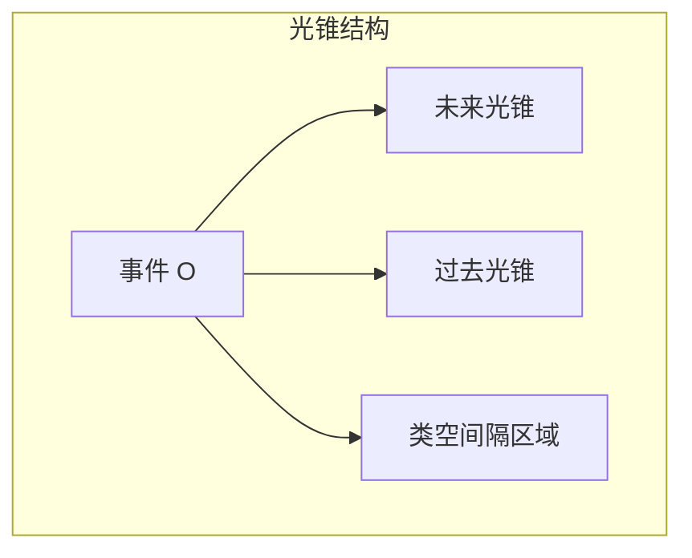

# 闵氏几何

> [!quote] 闵可夫斯基 (1908)
> "从此以后，空间本身和时间本身都将注定消失在阴影之中，只有它们两者的某种结合才能保持独立的实在。"

## 一、闵可夫斯基时空的基本结构

### 1.1 四维时空

狭义相对论揭示了时间和空间不是独立的，而是统一在**四维时空**（闵可夫斯基时空）中。一个事件用四个坐标描述：

$$
x^\mu = (ct, x, y, z) = (x^0, x^1, x^2, x^3)
$$

> [!tip] 约定
> 使用 $x^0 = ct$ 使所有坐标具有相同的量纲（长度）。

### 1.2 闵氏度规

> [!important] 闵氏度规（核心定义）
> $$
> \eta_{\mu\nu} =
> \begin{pmatrix}
> 1 & 0 & 0 & 0 \\
> 0 & -1 & 0 & 0 \\
> 0 & 0 & -1 & 0 \\
> 0 & 0 & 0 & -1
> \end{pmatrix}
> $$
>
> 这是 $(+,-,-,-)$ 号差（signature），也可使用 $(-,+,+,+)$ 约定。

#### 两种号差约定的详细对比

闵氏度规的号差（signature）是闵氏几何中最基本也最容易引起混淆的约定。两种主流约定并存于物理学文献中，各有其适用场景和优缺点。

> [!important] 号差约定的比较
>
> | 性质 | $(+,-,-,-)$ | $(-,+,+,+)$ |
> |------|-------------|-------------|
> | **时间分量符号** | 正 $(+)$ | 负 $(-)$ |
> | **空间分量符号** | 负 $(-)$ | 正 $(+)$ |
> | **类时矢量模方** | $> 0$ | $< 0$ |
> | **类空矢量模方** | $< 0$ | $> 0$ |
> | **四维动量模方** | $P^\mu P_\mu = m^2c^2 > 0$ | $P^\mu P_\mu = -m^2c^2 < 0$ |
> | **时空间隔** | $\Delta s^2 = c^2\Delta t^2 - \Delta \mathbf{x}^2$ | $\Delta s^2 = -c^2\Delta t^2 + \Delta \mathbf{x}^2$ |

> [!note] 不同领域的约定习惯
>
> - **粒子物理/高能物理**：几乎普遍使用 $(+,-,-,-)$ 约定。原因在于，在粒子物理中，最重要的不变量是四维动量的模方 $P^\mu P_\mu = m^2$，使其为正数在物理上更直观——有质量粒子的质量平方为正。Weinberg、Peskin & Schroeder 等经典教材均采用此约定。
>
> - **广义相对论与引力物理**：多数教材使用 $(-,+,+,+)$ 约定。原因在于，在弯曲时空中，空间部分的度规在弱场极限下退化为欧氏度规 $g_{ij} \to \delta_{ij}$，空间线元为正更符合直觉。Misner, Thorne & Wheeler (MTW) 的《Gravitation》、Wald 的《General Relativity》均采用此约定。
>
> - **弦论**：通常采用 $(-,+,+,+)$ 约定，与广义相对论保持一致。Polchinski 的教材即为典型。
>
> - **凝聚态物理中的相对论性系统**：多采用 $(+,-,-,-)$，与粒子物理习惯一致。

> [!warning] 跨约定使用时的注意事项
> 在阅读不同来源的文献时，务必首先确认作者使用的号差约定。关键判断方法：查看时空间隔的定义——若 $\Delta s^2 = c^2\Delta t^2 - \Delta \mathbf{x}^2$，则为 $(+,-,-,-)$；若 $\Delta s^2 = -c^2\Delta t^2 + \Delta \mathbf{x}^2$，则为 $(-,+,+,+)$。**切勿混用两种约定进行推导**，否则符号错误会贯穿始终。

本笔记采用 $(+,-,-,-)$ 约定，与[[相对论推导]]中的约定保持一致。

### 1.3 时空间隔

> [!tip] 时空间隔（不变量）
> 两个事件之间的时空间隔定义为：
> $$
> \Delta s^2 = \eta_{\mu\nu} \Delta x^\mu \Delta x^\nu = c^2\Delta t^2 - \Delta x^2 - \Delta y^2 - \Delta z^2
> $$
>
> 这是**洛伦兹不变量**——在所有惯性系中数值相同。

### 1.4 间隔的分类

根据 $\Delta s^2$ 的符号，事件对分为三类：

| 类型 | 条件 | 物理意义 |
|------|------|----------|
| **类时间隔** (timelike) | $\Delta s^2 > 0$ | 可以有因果联系，可被亚光速信号连接 |
| **类光间隔** (lightlike) | $\Delta s^2 = 0$ | 只能被光信号连接 |
| **类空间隔** (spacelike) | $\Delta s^2 < 0$ | 不可能有因果联系 |

> [!warning] 类空间隔与因果律
> 类空间隔的两个事件，其时间先后顺序在不同参考系中可能不同。但由于它们**不可能有因果联系**，这并不违反因果律。

#### 间隔分类的详细数学分析

> [!note] 类时间隔的深入分析
>
> 对于类时间隔 $\Delta s^2 > 0$，存在一个参考系使得这两个事件发生在**同一空间位置**。在该参考系中，$\Delta \mathbf{x} = 0$，间隔简化为 $\Delta s^2 = c^2 \Delta \tau^2$，其中 $\Delta \tau$ 就是这两个事件之间的**固有时**。
>
> 类时间隔的一个重要性质是**时间顺序的绝对性**：如果在一个惯性系中事件 $A$ 先于事件 $B$ 发生（$\Delta t > 0$），则在所有惯性系中 $A$ 都先于 $B$。证明如下：
>
> 由洛伦兹变换，$\Delta t' = \gamma(\Delta t - \frac{v}{c^2}\Delta x)$。对于类时间隔，$|\Delta x| < c|\Delta t|$，因此 $|\frac{v}{c^2}\Delta x| < |\frac{v}{c}|\Delta t| < |\Delta t|$（因为 $|v| < c$），故 $\Delta t'$ 与 $\Delta t$ 同号。

> [!note] 类光间隔的几何意义
>
> 类光间隔 $\Delta s^2 = 0$ 定义了时空中的**光锥面**。光锥是闵氏时空因果结构的骨架。在 $c=1$ 的自然单位制中，光锥方程简化为 $\Delta t = \pm |\Delta \mathbf{x}|$，即光锥面与时间轴的夹角为 $45^\circ$。
>
> 类光间隔的一个重要性质：不存在任何惯性系使得两个类光分离的事件发生在同一空间位置或同一时刻。光速在所有惯性系中不变，因此类光关系是洛伦兹不变的。

> [!note] 类空间隔的"别处"区域
>
> 对于类空间隔 $\Delta s^2 < 0$，存在一个参考系使得这两个事件**同时发生**（$\Delta t' = 0$）。在该参考系中，间隔简化为 $\Delta s^2 = -|\Delta \mathbf{x}'|^2$，即两事件的空间距离的负值。
>
> 类空间隔的关键特征是：不同惯性系中这两个事件的时间顺序可以不同。有些观察者认为 $A$ 先于 $B$，有些认为 $B$ 先于 $A$，还有些认为两者同时。但这不违反因果律，因为类空间隔的事件之间不可能有物理信号的传递。

#### 间隔分类的几何可视化

> [!note] 以事件 $O$ 为原点审视时空
>
> 将事件 $O$ 取为时空原点 $(0, 0, 0, 0)$，则整个闵氏时空被划分为三个区域：
>
> 1. **未来光锥内部**（$\Delta s^2 > 0$，$\Delta t > 0$）：所有可以被 $O$ 影响的未来事件——$O$ 的"绝对未来"
> 2. **过去光锥内部**（$\Delta s^2 > 0$，$\Delta t < 0$）：所有可以影响 $O$ 的过去事件——$O$ 的"绝对过去"
> 3. **光锥外部**（$\Delta s^2 < 0$）：与 $O$ 因果无关的事件——$O$ 的"别处"（elsewhere）
>
> 在二维时空图（$ct$-$x$ 平面）中，光锥退化为两条 $45^\circ$ 的直线，将平面分为四个区域。这是一个极为有用的可视化工具，能够直观展示因果结构。

## 二、世界线与固有时

### 2.1 世界线

> [!note] 世界线
> 粒子在四维时空中的轨迹称为**世界线**。世界线是粒子的完整历史——它记录了粒子在每一时刻的位置。

- 静止粒子：世界线是平行于 $t$ 轴的直线
- 匀速运动粒子：世界线是倾斜直线（斜率 $> 1/c$，即 $v < c$）
- 光子的世界线：倾角为 $45^\circ$（在 $c=1$ 单位制中）

### 2.2 固有时

> [!tip] 固有时
> 沿着粒子世界线的时空间隔积分给出**固有时**：
> $$
> \tau = \int \sqrt{1 - \frac{v^2}{c^2}}\ dt = \int \frac{dt}{\gamma}
> $$
>
> 固有时是粒子自身携带的时钟测量的时间，是**洛伦兹不变量**。

> [!note] 闵可夫斯基的"最长固有时"
> 在闵氏时空中，连接两个事件的所有世界线中，**直线（惯性运动）具有最长的固有时**。这解释了[[钟慢尺缩与质增#双生子佯谬]]：加速的旅行者经历较短的固有时，所以更年轻。

这与欧氏几何中"直线最短"形成对比，根源在于闵氏度规的号差。

### 2.3 世界线的参数化

> [!important] 以固有时为参数的自然参数化
>
> 世界线 $x^\mu(\lambda)$ 可以用任意参数 $\lambda$ 来描述。但对于类时世界线，最自然的选择是以**固有时 $\tau$** 为参数：
>
> $$
> x^\mu(\tau) = (ct(\tau), \mathbf{x}(\tau))
> $$
>
> 这种参数化的优势在于，切线矢量的模方自动归一化。定义**四维速度**为世界线对固有时的导数：
>
> $$
> U^\mu = \frac{dx^\mu}{d\tau}
> $$
>
> 由于 $d\tau^2 = \eta_{\mu\nu} dx^\mu dx^\nu / c^2$（在 $(+,-,-,-)$ 约定下为 $ds^2/c^2$），直接得到：
>
> $$
> U^\mu U_\mu = \eta_{\mu\nu} \frac{dx^\mu}{d\tau} \frac{dx^\nu}{d\tau} = \frac{ds^2}{d\tau^2} = c^2
> $$

> [!tip] 四维速度作为单位切矢量
>
> 四维速度 $U^\mu$ 是世界线的**单位切矢量**（模长为 $c$）。在 $c=1$ 的自然单位制中，$U^\mu U_\mu = 1$。在三维语言中：
>
> $$
> U^\mu = \gamma(c, \mathbf{v}), \quad \gamma = \frac{1}{\sqrt{1-v^2/c^2}}
> $$
>
> 验证：$U^\mu U_\mu = \gamma^2(c^2 - v^2) = c^2 \gamma^2(1-v^2/c^2) = c^2$，与参数化无关的结论一致。
>
> 对于**类光世界线**（光子），固有时恒为零，因此不能以固有时为参数。此时需使用**仿射参数** $\lambda$，使得 $dx^\mu/d\lambda$ 为类光矢量且满足测地线方程。

> [!note] 参数化不变性与物理可观测量的关系
>
> 物理可观测量必须与参数化的选择无关。固有时作为参数具有直接的物理意义——它是粒子自身携带的理想时钟的读数。使用任意参数 $\lambda$ 时，四维速度定义为 $dx^\mu/d\lambda$，其模方不再恒定，但固有时仍可通过积分 $\tau = \frac{1}{c}\int \sqrt{\eta_{\mu\nu} \frac{dx^\mu}{d\lambda} \frac{dx^\nu}{d\lambda}} \, d\lambda$ 计算。

### 2.4 加速运动的世界线

> [!important] 匀加速运动与 Rindler 运动
>
> 在狭义相对论中，"匀加速"需要仔细定义。**匀固有加速度**（constant proper acceleration）是指粒子瞬时静止系中测得的加速度恒定。设固有加速度大小为 $a$（沿 $x$ 方向），则世界线方程为**双曲运动**（hyperbolic motion）：
>
> $$
> x^\mu(\tau) = \left( \frac{c^2}{a} \sinh\left(\frac{a\tau}{c}\right), \; \frac{c^2}{a} \cosh\left(\frac{a\tau}{c}\right), \; 0, \; 0 \right)
> $$
>
> 消去 $\tau$ 得到世界线在 $ct$-$x$ 平面上的轨迹：
>
> $$
> x^2 - c^2 t^2 = \left(\frac{c^2}{a}\right)^2
> $$
>
> 这是一条**双曲线**，渐近线为 $x = \pm ct$（即光锥）。

> [!note] Rindler 坐标与 Rindler 视界
>
> 匀加速观察者的世界线构成了一族共焦双曲线。以这些双曲线和从原点出发的直线为坐标线，可以建立**Rindler 坐标系** $(\xi, \eta)$：
>
> $$
> ct = \xi \sinh\eta, \quad x = \xi \cosh\eta
> $$
>
> 其中 $\xi = c^2/a$ 标记不同的加速观察者，$\eta = a\tau/c$ 是时间坐标。
>
> Rindler 坐标系的一个重要特征是存在**Rindler 视界**：光锥面 $x = \pm ct$ 将时空分为两个区域。区域 I（$x > |ct|$）中的观察者永远无法收到来自区域 II（$x < -|ct|$）的信号，反之亦然。Rindler 视界是匀加速观察者的**事件视界**——它不依赖于时空曲率，纯粹由加速运动产生。

> [!tip] 匀加速运动与等效原理
>
> 匀加速观察者的 Rindler 视界是理解**等效原理**和**黑洞物理**的重要桥梁。根据等效原理，匀加速参考系中的物理局域等价于均匀引力场中的物理。Rindler 视界因此可以视为黑洞事件视界的"平直时空版本"——两者都导致信息丢失和热辐射（Unruh 效应与 Hawking 辐射的对应）。

## 三、光锥与因果结构

### 3.1 光锥的定义

以事件 $O$ 为顶点，所有满足 $\Delta s^2 = 0$ 的事件构成**光锥**：

- **未来光锥**：$\Delta t > 0$，$c^2\Delta t^2 = \Delta x^2 + \Delta y^2 + \Delta z^2$
- **过去光锥**：$\Delta t < 0$，$c^2\Delta t^2 = \Delta x^2 + \Delta y^2 + \Delta z^2$

### 3.2 光锥的物理意义

> [!important] 因果结构
> - 光锥内部（类时）：可被物理信号到达，可建立因果联系
> - 光锥表面（类光）：只能被光信号到达
> - 光锥外部（类空）：无法到达，也不可被到达——**因果无关**

$$
\begin{array}{c}
\text{未来光锥内} = \text{绝对未来} \\
\text{过去光锥内} = \text{绝对过去} \\
\text{光锥外} = \text{别处 (elsewhere)}
\end{array}
$$

### 3.3 闵氏时空图

> [!note] 视觉化技巧
> 通常画二维时空图时，压缩两个空间维度，用 $ct$ 为纵轴，一维空间为横轴。光锥退化为 $45^\circ$ 的两条交叉线。

#### 时空图的详细绘制技巧

> [!tip] 二维时空图的绘制规范
>
> 绘制闵氏时空图时，有几个关键要点：
>
> 1. **坐标轴选择**：纵轴为 $ct$（时间轴），横轴为 $x$（空间轴）。光锥线为 $ct = \pm x$，即 $45^\circ$ 线。在 $c=1$ 单位制中，光速线恰好是倾角 $45^\circ$ 的直线。
>
> 2. **校准曲线**：时空间隔不变的双曲线 $c^2 t^2 - x^2 = \text{const}$ 可作为校准曲线。不同惯性系的坐标轴在这些双曲线上截取的单位长度不同，直观反映了度规的非欧性。
>
> 3. **运动参考系的坐标轴**：参考系 $S'$ 以速度 $v$ 相对 $S$ 运动，则 $S'$ 的 $ct'$ 轴（$x'=0$）在 $S$ 图中是 $x = \beta ct$ 的直线，$S'$ 的 $x'$ 轴（$ct'=0$）是 $ct = \beta x$ 的直线。两条轴关于 $45^\circ$ 光线对称。
>
> 4. **同时线的倾斜**：$S'$ 系中的同时线（$ct' = \text{const}$）在 $S$ 系中是倾斜的。这直接体现了**同时性的相对性**——不同参考系中"同一时刻"截取的时空截面不同。

#### 从时空图中直观理解时间膨胀和长度收缩

> [!note] 时间膨胀的几何直观
>
> 在时空图中，考虑在 $S'$ 系中同一地点发生的两个事件（例如一个静止在 $S'$ 系中的钟的两次滴答）。这两个事件在 $S'$ 系中的时间间隔为 $\Delta \tau$（固有时），在 $S$ 系中的时间间隔为 $\Delta t$。
>
> 从时空图上看，$S'$ 系的时间轴 $ct'$ 相对 $S$ 系的 $ct$ 轴倾斜。沿 $ct'$ 轴上的线段 $\Delta \tau$ 在 $ct$ 轴上的投影为 $\Delta t = \gamma \Delta \tau$。这本质上是双曲几何中"斜边比直角边短"的闵氏版本——在欧氏几何中斜边最长，在闵氏几何中类时斜边（直线）的固有时最长。

> [!note] 长度收缩的几何直观
>
> 在时空图中，"长度"的测量依赖于同时性。一根在 $S'$ 系中静止的杆，其世界线是两条平行于 $ct'$ 轴的直线（世界条纹）。在 $S$ 系中测量杆长，需要在 $S$ 系的同一时刻（水平线 $ct = \text{const}$）截取这两条世界条纹，截距为 $L$。在 $S'$ 系中测量杆长，需要在 $S'$ 系的同一时刻（倾斜线 $ct' = \text{const}$）截取，截距为 $L_0$（固有长度）。
>
> 从时空图的几何关系可得 $L = L_0 / \gamma$，即运动杆的长度收缩。收缩的本质是：不同参考系的"同时截面"截取了世界条纹的不同段落。

### 3.4 因果结构的深入讨论

> [!important] 时序保护与因果律
>
> 闵氏时空的因果结构保证了**时序保护**（chronology protection）：如果两个事件由类时或类光曲线连接，则它们的时间顺序在所有惯性系中保持不变。这是因果律的几何基础。
>
> 具体而言，设 $A$ 和 $B$ 是两个事件，$A$ 在 $B$ 的过去光锥内。则对于任意惯性系，$A$ 的时间坐标都小于 $B$ 的时间坐标。这使得"因在果之前"成为洛伦兹不变的陈述。

> [!warning] 封闭类时曲线与因果悖论
>
> **封闭类时曲线**（closed timelike curve, CTC）是一条回到自身过去的世界线，允许时间旅行到过去。在闵氏平直时空中，不存在封闭类时曲线——这是闵氏时空因果性质良好的重要体现。
>
> 然而，在广义相对论中，某些弯曲时空解（如 Gödel 宇宙、Kerr 黑洞内部）允许封闭类时曲线的存在。这引发了著名的**祖父悖论**等因果悖论。

> [!note] 时序保护猜想
>
> **霍金时序保护猜想**（Hawking's chronology protection conjecture）断言：物理定律将阻止封闭类时曲线的形成。量子场论中的能量条件可能会在 CTC 即将形成时使时空出现奇点或使真空极化能量发散，从而"保护"时序。
>
> 在闵氏时空中，光锥结构天然地阻止了任何超光速信号和封闭类时曲线，这使得狭义相对论的因果结构是自洽且完备的。

### 3.5 视界简介

> [!important] 视界的定义与分类
>
> **视界**（horizon）是时空中的一种边界，它将时空分为因果连通和因果不连通的两个区域。在闵氏时空的框架下，我们可以引入两种重要的视界概念。

> [!note] Rindler 视界
>
> 如 2.4 节所述，Rindler 视界是匀加速观察者的事件视界。光锥面 $x = \pm ct$ 将时空分为 Rindler 坐标能够覆盖的区域 I（$x > |ct|$）和无法覆盖的区域 II、III、IV。区域 I 中的匀加速观察者永远无法收到来自区域 II 的任何信号。
>
> Rindler 视界的一个重要特征是：它并非时空的固有属性，而是与观察者的运动状态相关。惯性观察者看到的是整个闵氏时空，而匀加速观察者只能看到 Rindler 楔形区域。

> [!note] 事件视界与因果结构的联系
>
> 在广义相对论中，**事件视界**是黑洞的边界——进入事件视界内部的任何物质和信号都无法逃逸到外部。事件视界是全局概念，依赖于整个时空的未来演化。
>
> 在闵氏时空中，由于没有引力，不存在事件视界。但 Rindler 视界为我们理解事件视界提供了一个平直时空的类比模型。两者都体现了视界的核心特征：**因果结构的单向性**——信息只能从视界的一侧传递到另一侧，而不能反向。

> [!tip] 视界与热力学
>
> 视界与热力学有着深刻的联系。Rindler 视界导致 Unruh 效应（匀加速观察者看到热辐射），黑洞事件视界导致 Hawking 辐射。这些现象暗示引力、热力学和量子理论之间存在深层的统一——这是[[相对论推导]]中提及的现代理论物理的核心问题之一。

## 四、洛伦兹变换作为伪转动

### 4.1 欧氏旋转 vs 闵氏伪转动

在欧氏平面中，旋转保持距离不变：$x^2 + y^2 = \text{const}$。

在闵氏时空中，洛伦兹变换保持时空间隔不变：$c^2 t^2 - x^2 = \text{const}$。

> [!tip] 洛伦兹变换 = 伪转动
> 洛伦兹 boost 可写为：
> $$
> \begin{pmatrix}
> ct' \\ x'
> \end{pmatrix}
> =
> \begin{pmatrix}
> \cosh\phi & -\sinh\phi \\
> -\sinh\phi & \cosh\phi
> \end{pmatrix}
> \begin{pmatrix}
> ct \\ x
> \end{pmatrix}
> $$
>
> 其中 $\phi$ 为**快度**（rapidity），满足：
> $$
> \tanh\phi = \beta = \frac{v}{c}, \qquad
> \cosh\phi = \gamma, \qquad
> \sinh\phi = \gamma\beta
> $$

### 4.2 快度的优势

> [!note] 快度的可加性
> 快度的最大优势是**可加性**：如果 $S''$ 相对 $S'$ 的快度为 $\phi_2$，$S'$ 相对 $S$ 的快度为 $\phi_1$，则 $S''$ 相对 $S$ 的快度为 $\phi = \phi_1 + \phi_2$。
>
> 这与[[相对论推导#速度叠加公式]]形成对比：速度不能简单相加，但快度可以。

#### 快度的数学性质

> [!tip] 双曲函数的详细性质
>
> 快度 $\phi$ 与双曲函数的关系是理解洛伦兹变换几何本质的关键。回顾双曲函数的定义：
>
> $$
> \cosh\phi = \frac{e^\phi + e^{-\phi}}{2}, \quad
> \sinh\phi = \frac{e^\phi - e^{-\phi}}{2}, \quad
> \tanh\phi = \frac{\sinh\phi}{\cosh\phi}
> $$
>
> 基本恒等式：
>
> $$
> \cosh^2\phi - \sinh^2\phi = 1
> $$
>
> 这与 $\gamma^2 - \gamma^2\beta^2 = 1$ 完全对应，也直接保证了洛伦兹变换保持时空间隔不变。
>
> 双曲函数的导数关系：
>
> $$
> \frac{d}{d\phi}\cosh\phi = \sinh\phi, \quad
> \frac{d}{d\phi}\sinh\phi = \cosh\phi
> $$
>
> 双曲函数的和角公式：
>
> $$
> \cosh(\phi_1 + \phi_2) = \cosh\phi_1 \cosh\phi_2 + \sinh\phi_1 \sinh\phi_2
> $$
> $$
> \sinh(\phi_1 + \phi_2) = \sinh\phi_1 \cosh\phi_2 + \cosh\phi_1 \sinh\phi_2
> $$

> [!note] 快度相加的几何意义
>
> 快度相加 $\phi = \phi_1 + \phi_2$ 对应于伪转动矩阵的乘法：
>
> $$
> \begin{pmatrix}
> \cosh\phi_2 & -\sinh\phi_2 \\
> -\sinh\phi_2 & \cosh\phi_2
> \end{pmatrix}
> \begin{pmatrix}
> \cosh\phi_1 & -\sinh\phi_1 \\
> -\sinh\phi_1 & \cosh\phi_1
> \end{pmatrix}
> =
> \begin{pmatrix}
> \cosh(\phi_1+\phi_2) & -\sinh(\phi_1+\phi_2) \\
> -\sinh(\phi_1+\phi_2) & \cosh(\phi_1+\phi_2)
> \end{pmatrix}
> $$
>
> 在几何上，这意味着沿同一方向的连续 boost 等价于快度相加。快度是 boost 操作的**加法参数**，就像角度是旋转操作的加法参数一样。
>
> 快度的取值范围是 $(-\infty, +\infty)$，对应速度范围 $(-c, +c)$。当 $\phi \to \infty$ 时，$v \to c$（从下方趋近光速）。光速对应于无限大的快度，这解释了为什么有质量粒子永远无法达到光速——需要无限大的快度增量。

> [!note] 快度与赝球面几何
>
> 速度空间（所有可能的三维速度矢量的集合）在相对论中具有**双曲几何**（Lobachevsky 几何）的结构。快度可以视为速度空间中的"距离"——这是理解相对论运动学的深层几何视角。在此几何中，Einstein 速度叠加公式不过是双曲空间中的"矢量加法"。

### 4.3 洛伦兹群

> [!important] 固有正时洛伦兹群 $\mathrm{SO}^+(1,3)$
>
> 所有保持闵氏度规不变的线性变换构成**洛伦兹群** $\mathrm{O}(1,3)$。满足 $\Lambda^T \eta \Lambda = \eta$ 的矩阵 $\Lambda^\mu_{\ \nu}$ 即为洛伦兹变换。
>
> 洛伦兹群可按照两个离散对称性进行分类：
>
> | 分类 | 条件 | 包含的变换 |
> |------|------|-----------|
> | **固有** (proper) | $\det\Lambda = +1$ | 连续连接到恒等变换 |
> | **非固有** (improper) | $\det\Lambda = -1$ | 包含空间反射 |
> | **正时** (orthochronous) | $\Lambda^0_{\ 0} \geq 1$ | 保持时间方向 |
> | **非正时** (non-orthochronous) | $\Lambda^0_{\ 0} \leq -1$ | 包含时间反演 |

> [!note] 洛伦兹群的四个连通分支
>
> 洛伦兹群 $\mathrm{O}(1,3)$ 由四个不连通的拓扑分支组成：
>
> 1. $\mathrm{SO}^+(1,3)$：**固有正时洛伦兹群**（restricted Lorentz group），$\det\Lambda = +1$，$\Lambda^0_{\ 0} \geq 1$。包含所有 boost 和空间旋转，是连续连接到恒等变换的分支。这是物理上最重要的分支——所有物理上可实现的洛伦兹变换都属于此分支。
>
> 2. $\mathcal{P} \cdot \mathrm{SO}^+(1,3)$：包含**空间反射**（parity）$P = \mathrm{diag}(1, -1, -1, -1)$ 的分支。
>
> 3. $\mathcal{T} \cdot \mathrm{SO}^+(1,3)$：包含**时间反演**（time reversal）$T = \mathrm{diag}(-1, 1, 1, 1)$ 的分支。
>
> 4. $\mathcal{PT} \cdot \mathrm{SO}^+(1,3)$：同时包含空间反射和时间反演的分支。

> [!tip] 李代数与生成元
>
> 固有正时洛伦兹群 $\mathrm{SO}^+(1,3)$ 是六维李群，其李代数 $\mathfrak{so}(1,3)$ 有六个生成元：三个 boost 生成元 $K_i$（对应伪转动）和三个旋转生成元 $J_i$（对应空间转动）。它们的对易关系为：
>
> $$
> [J_i, J_j] = i\epsilon_{ijk} J_k, \quad
> [J_i, K_j] = i\epsilon_{ijk} K_k, \quad
> [K_i, K_j] = -i\epsilon_{ijk} J_k
> $$
>
> 注意最后一个对易关系的负号——这是洛伦兹群非紧致性的代数体现：两个 boost 的组合产生一个空间旋转（Thomas 进动）。

> [!note] 庞加莱群
>
> 洛伦兹变换加上时空平移构成**庞加莱群**（Poincaré group）$\mathrm{ISO}(1,3)$，它是狭义相对论的全部时空对称群。庞加莱群的不可约表示对应于相对论性粒子的分类——质量与自旋。这是[[相对论推导]]中量子场论构造的基础。

## 五、四维矢量

### 5.1 四维速度

$$
U^\mu = \frac{dx^\mu}{d\tau} = \gamma(c, \mathbf{v})
$$

其模方是常数：$U^\mu U_\mu = c^2$

### 5.2 四维动量

> [!tip] 四维动量
> $$
> P^\mu = m_0 U^\mu = (E/c, \mathbf{p})
> $$
>
> 其模方：
> $$
> P^\mu P_\mu = \frac{E^2}{c^2} - \mathbf{p}^2 = m_0^2 c^2
> $$
>
> 这正是[[相对论推导#能量-动量关系]]的几何表述。

### 5.3 四维波矢

[[汤姆孙散射]]中的辐射可用四维波矢描述：

$$
k^\mu = (\omega/c, \mathbf{k})
$$

多普勒效应和光行差对应于 $k^\mu$ 在不同参考系间的洛伦兹变换。

### 5.4 四维力

> [!important] 四维力的定义
>
> **四维力**（four-force）定义为四维动量对固有时的导数：
>
> $$
> F^\mu = \frac{dP^\mu}{d\tau} = \frac{d}{d\tau}(m_0 U^\mu)
> $$
>
> 对于恒定静质量 $m_0$ 的情况：
>
> $$
> F^\mu = m_0 \frac{dU^\mu}{d\tau} = m_0 A^\mu
> $$
>
> 其中 $A^\mu$ 是四维加速度（见 5.5 节）。

> [!note] 四维力与牛顿力的关系
>
> 四维力的空间分量与三维牛顿力 $\mathbf{f} = d\mathbf{p}/dt$ 的关系为：
>
> $$
> F^\mu = \gamma\left(\frac{\mathbf{f} \cdot \mathbf{v}}{c}, \mathbf{f}\right)
> $$
>
> 其中 $F^0 = \gamma \mathbf{f} \cdot \mathbf{v} / c$ 代表功率（除以 $c$）。四维力的时间分量与三维力做功的功率直接相关——这体现了能量和动量在四维语言中的统一。
>
> 四维力满足一个重要约束：$F^\mu U_\mu = 0$。这是因为 $U^\mu U_\mu = c^2$ 为常数，求导得 $2U^\mu (dU_\mu/d\tau) = 0$，即 $F^\mu U_\mu = 0$。四维力始终与四维速度正交（在闵氏度规意义下）。

### 5.5 四维加速度

> [!important] 四维加速度的定义
>
> **四维加速度**（four-acceleration）定义为四维速度对固有时的导数：
>
> $$
> A^\mu = \frac{dU^\mu}{d\tau} = \frac{d^2 x^\mu}{d\tau^2}
> $$
>
> 在三维语言中：
>
> $$
> A^\mu = \gamma\left( \gamma^2 \frac{\mathbf{a} \cdot \mathbf{v}}{c}, \; \gamma^2 \mathbf{a}_{\parallel} + \mathbf{a}_{\perp} \right)
> $$
>
> 其中 $\mathbf{a} = d\mathbf{v}/dt$ 是三维加速度，$\mathbf{a}_{\parallel}$ 和 $\mathbf{a}_{\perp}$ 分别是平行和垂直于速度的分量。

> [!tip] 四维加速度与四维速度的正交性
>
> 由于 $U^\mu U_\mu = c^2$ 为常数，对固有时求导：
>
> $$
> \frac{d}{d\tau}(U^\mu U_\mu) = 2U^\mu \frac{dU_\mu}{d\tau} = 2U^\mu A_\mu = 0
> $$
>
> 因此 $A^\mu U_\mu = 0$，即四维加速度始终与四维速度正交。这是闵氏几何中一个非常重要的性质：在粒子的瞬时静止系中，$U^\mu = (c, \mathbf{0})$，正交性要求 $A^\mu = (0, \mathbf{a}_0)$，其中 $\mathbf{a}_0$ 是固有加速度。

> [!note] 匀加速运动再讨论
>
> 利用四维加速度，可以更简洁地表述 2.4 节中的匀加速运动。匀固有加速度意味着 $A^\mu A_\mu = -a^2$（在 $(+,-,-,-)$ 约定下为负常数）。在粒子的瞬时静止系中，$A^\mu = (0, a, 0, 0)$。通过洛伦兹变换到实验室系，即可导出双曲运动的世界线方程。

### 5.6 四维电流密度

> [!important] 四维电流密度的定义
>
> **四维电流密度**（four-current density）将电荷密度 $\rho$ 和电流密度 $\mathbf{j}$ 统一为一个四维矢量：
>
> $$
> j^\mu = (\rho c, \mathbf{j}) = \rho_0 U^\mu
> $$
>
> 其中 $\rho_0$ 是固有电荷密度（在电荷静止系中测得的密度）。

> [!note] 连续性方程的四维形式
>
> 电荷守恒的**连续性方程**在四维语言中具有极为简洁的形式：
>
> $$
> \partial_\mu j^\mu = \frac{\partial \rho}{\partial t} + \nabla \cdot \mathbf{j} = 0
> $$
>
> 其中 $\partial_\mu = \partial / \partial x^\mu = (\partial / \partial(ct), \nabla)$。这是四维散度为零的形式，直接表达了电荷守恒的洛伦兹不变性。方程左边是一个洛伦兹标量，在所有惯性系中形式相同——这体现了相对性原理在电磁学中的自然实现。

> [!tip] 四维电流密度与电荷不变性
>
> 总电荷 $Q = \int j^0 d^3x / c$ 是洛伦兹不变量。虽然电荷密度 $\rho$ 和体积 $d^3x$ 各自随参考系变化（长度收缩效应），但两者的乘积保持不变。这是电荷守恒与相对论相容性的重要体现。

### 5.7 四维势

> [!important] 电磁场的四维势表示
>
> 电磁场的标势 $\phi$ 和矢势 $\mathbf{A}$ 统一为**四维势**（four-potential）：
>
> $$
> A^\mu = (\phi/c, \mathbf{A})
> $$
>
> 电磁场张量 $F^{\mu\nu}$ 由四维势的旋度定义：
>
> $$
> F^{\mu\nu} = \partial^\mu A^\nu - \partial^\nu A^\mu
> $$
>
> 其分量为：
>
> $$
> F^{0i} = -E^i/c, \quad F^{ij} = -\epsilon^{ijk} B^k
> $$
>
> 即电场和磁场是电磁场张量的不同分量，在不同参考系中互相转化。

> [!note] 麦克斯韦方程组的协变形式
>
> 在四维语言中，麦克斯韦方程组变得极其简洁：
>
> **非齐次方程**（有源）：
> $$
> \partial_\mu F^{\mu\nu} = \mu_0 j^\nu
> $$
>
> **齐次方程**（无源）：
> $$
> \partial_\mu \tilde{F}^{\mu\nu} = 0
> $$
>
> 其中 $\tilde{F}^{\mu\nu} = \frac{1}{2}\epsilon^{\mu\nu\rho\sigma}F_{\rho\sigma}$ 是对偶张量。
>
> 这两组方程都是洛伦兹协变的——在所有惯性系中形式相同。这直接体现了电磁学天生与狭义相对论相容。事实上，正是电磁学与伽利略变换的不相容性，引导爱因斯坦发现了狭义相对论。

> [!tip] 规范不变性
>
> 四维势的规范变换 $A^\mu \to A^\mu + \partial^\mu \Lambda$（其中 $\Lambda$ 是任意标量函数）不改变电磁场张量 $F^{\mu\nu}$。在四维语言中，规范不变性表现为 $F^{\mu\nu}$ 在 $A^\mu$ 的"梯度变换"下不变——这是现代规范场论的起点。

## 六、张量分析在闵氏时空中的应用

### 6.1 度规张量的升降指标操作

> [!important] 指标升降的基本规则
>
> 在闵氏时空中，度规张量 $\eta_{\mu\nu}$ 及其逆 $\eta^{\mu\nu}$ 用于升降张量的指标：
>
> **降指标**（contravariant → covariant）：
> $$
> V_\mu = \eta_{\mu\nu} V^\nu
> $$
>
> **升指标**（covariant → contravariant）：
> $$
> V^\mu = \eta^{\mu\nu} V_\nu
> $$
>
> 在 $(+,-,-,-)$ 约定下，升降指标的效果是改变空间分量的符号，而时间分量保持不变：
>
> $$
> V^0 = V_0, \quad V^1 = -V_1, \quad V^2 = -V_2, \quad V^3 = -V_3
> $$

> [!note] 升降指标的实际应用
>
> 四维动量的协变分量：
> $$
> P_\mu = \eta_{\mu\nu} P^\nu = (E/c, -\mathbf{p})
> $$
>
> 四维动量的模方可以用协变和逆变分量简洁写出：
> $$
> P^\mu P_\mu = P^0 P_0 + P^1 P_1 + P^2 P_2 + P^3 P_3 = \frac{E^2}{c^2} - \mathbf{p}^2
> $$
>
> 梯度算符的升降：
> $$
> \partial_\mu = \frac{\partial}{\partial x^\mu} = \left(\frac{1}{c}\frac{\partial}{\partial t}, \nabla\right), \quad
> \partial^\mu = \eta^{\mu\nu}\partial_\nu = \left(\frac{1}{c}\frac{\partial}{\partial t}, -\nabla\right)
> $$
>
> 达朗贝尔算符（d'Alembertian）：
> $$
> \Box = \partial^\mu \partial_\mu = \frac{1}{c^2}\frac{\partial^2}{\partial t^2} - \nabla^2
> $$
>
> 这是波动方程的洛伦兹不变算符，在[[汤姆孙散射]]的辐射理论中频繁出现。

> [!tip] 指标升降的深层意义
>
> 在弯曲时空的推广中，度规张量 $g_{\mu\nu}(x)$ 不再是常数矩阵，而是时空坐标的函数。指标升降操作变为 $V_\mu = g_{\mu\nu}(x) V^\nu$，这使得张量在坐标变换下的行为保持一致。闵氏时空中的常数度规是这一般框架的最简单特例。

### 6.2 洛伦兹变换的张量形式

> [!important] 洛伦兹变换的张量表示
>
> 在张量语言中，洛伦兹变换是一个线性变换 $\Lambda^\mu_{\ \nu}$，它将逆变矢量变换为：
>
> $$
> x'^\mu = \Lambda^\mu_{\ \nu} x^\nu
> $$
>
> 协变矢量按逆变换的转置变换：
>
> $$
> V'_\mu = (\Lambda^{-1})^\nu_{\ \mu} V_\nu = \Lambda_\mu^{\ \nu} V_\nu
> $$
>
> 其中 $\Lambda_\mu^{\ \nu} = \eta_{\mu\alpha} \eta^{\nu\beta} \Lambda^\alpha_{\ \beta}$。

> [!note] 张量的洛伦兹变换规则
>
> 一般张量按以下规则变换——每个逆变指标乘以 $\Lambda$，每个协变指标乘以 $\Lambda^{-1}$：
>
> **二阶逆变张量**：
> $$
> T'^{\mu\nu} = \Lambda^\mu_{\ \alpha} \Lambda^\nu_{\ \beta} T^{\alpha\beta}
> $$
>
> **二阶协变张量**：
> $$
> T'_{\mu\nu} = (\Lambda^{-1})^\alpha_{\ \mu} (\Lambda^{-1})^\beta_{\ \nu} T_{\alpha\beta}
> $$
>
> **混合张量**：
> $$
> T'^{\mu}_{\ \nu} = \Lambda^\mu_{\ \alpha} (\Lambda^{-1})^\beta_{\ \nu} T^{\alpha}_{\ \beta}
> $$

> [!tip] 闵氏度规的洛伦兹不变性
>
> 度规张量 $\eta_{\mu\nu}$ 在洛伦兹变换下不变：
>
> $$
> \eta'_{\mu\nu} = (\Lambda^{-1})^\alpha_{\ \mu} (\Lambda^{-1})^\beta_{\ \nu} \eta_{\alpha\beta} = \eta_{\mu\nu}
> $$
>
> 这正是洛伦兹变换的定义性质——$\Lambda^T \eta \Lambda = \eta$。度规张量的不变性是闵氏时空作为洛伦兹流形的基础。

> [!note] 标量、矢量、张量的物理意义
>
> 在相对论性物理中，物理定律需要在洛伦兹变换下协变。这要求我们用张量来表达物理量：
>
> - **洛伦兹标量**（如固有时 $\tau$、静质量 $m_0$、时空间隔 $\Delta s^2$）：在所有惯性系中取值相同，有直接的物理意义
> - **洛伦兹四维矢量**（如 $x^\mu$、$P^\mu$、$j^\mu$）：按 $\Lambda$ 变换，分量在不同参考系中不同但物理内容等价
> - **洛伦兹张量**（如 $F^{\mu\nu}$、$T^{\mu\nu}$）：按多个 $\Lambda$ 变换，描述更复杂的物理量
>
> 构建物理定律时，需确保等式两边是相同类型的张量（或标量），这样定律在所有惯性系中形式相同。

### 6.3 能量-动量张量简介

> [!important] 能量-动量张量的定义
>
> **能量-动量张量**（stress-energy tensor）$T^{\mu\nu}$ 是描述物质和场中能量、动量、应力分布的对称二阶张量。其分量的物理意义为：
>
> - $T^{00}$：能量密度（除以 $c^2$）
> - $T^{0i} = T^{i0}$：动量密度（或能量流密度）$/c$
> - $T^{ij}$：动量流密度（应力张量）

> [!note] 能量-动量张量的守恒律
>
> 能量和动量的局域守恒在四维语言中表述为：
>
> $$
> \partial_\mu T^{\mu\nu} = 0
> $$
>
> 这是四个方程的集合：
> - $\nu = 0$：能量守恒，$\partial_t (\text{能量密度}) + \nabla \cdot (\text{能量流}) = 0$
> - $\nu = i$：动量守恒，$\partial_t (\text{动量密度}) + \nabla \cdot (\text{动量流}) = 0$

> [!tip] 理想流体的能量-动量张量
>
> 对于理想流体（无黏性和热传导），能量-动量张量为：
>
> $$
> T^{\mu\nu} = \left(\rho + \frac{p}{c^2}\right) U^\mu U^\nu - p \eta^{\mu\nu}
> $$
>
> 其中 $\rho$ 是固有能量密度，$p$ 是压强，$U^\mu$ 是流体的四维速度场。这一形式在宇宙学和相对论流体力学中有广泛应用，也将在[[相对论推导]]中进一步讨论其广义相对论推广。

## 七、闵氏时空中的积分与守恒律

### 7.1 诺特定理简介

> [!important] 诺特定理（Noether's Theorem）
>
> **诺特定理**是理论物理中最重要的定理之一：每一个连续对称性对应一个守恒量。在闵氏时空的框架下，庞加莱群的对称性直接导致基本的守恒律。
>
> 诺特定理的核心思想：若作用量 $S = \int \mathcal{L} \, d^4x$ 在某连续变换下不变，则存在一个守恒流 $j^\mu$ 满足 $\partial_\mu j^\mu = 0$，对应的守恒荷 $Q = \int j^0 d^3x$ 不随时间变化。

> [!note] 闵氏时空中的对称性与守恒量
>
> | 对称性 | 生成元 | 守恒量 |
> |--------|--------|--------|
> | 时间平移不变性 | $\partial_t$ | 能量 $E$ |
> | 空间平移不变性 | $\partial_x, \partial_y, \partial_z$ | 动量 $\mathbf{p}$ |
> | 空间旋转不变性 | $J_i$（角动量） | 角动量 $\mathbf{L}$ |
> | Boost 不变性 | $K_i$ | 质心运动 |

> [!tip] 诺特定理的深层意义
>
> 诺特定理揭示了对称性与守恒律之间的深刻联系。在闵氏时空中，时空的均匀性（平移不变性）保证了能量-动量守恒，时空的各向同性（旋转不变性）保证了角动量守恒。这些守恒律不是偶然的，而是闵氏时空几何对称性的必然结果。
>
> 在量子场论中，诺特定理是构造守恒量的标准工具，也是理解规范对称性与电荷守恒的基础。

### 7.2 能量-动量守恒的四维形式

> [!important] 能量-动量守恒的张量表述
>
> 在狭义相对论中，能量和动量不再是独立的守恒量，而是统一为**四维能量-动量矢量**的守恒。能量-动量守恒的局域形式为：
>
> $$
> \partial_\mu T^{\mu\nu} = 0
> $$
>
> 其中 $T^{\mu\nu}$ 是能量-动量张量（见 6.3 节）。这一方程同时包含了能量守恒和动量守恒。

> [!note] 全局守恒律
>
> 对守恒方程在一个空间超曲面上积分，得到全局守恒律：
>
> $$
> P^\nu = \int_{\Sigma} T^{0\nu} \, d^3x = \text{const}
> $$
>
> 其中 $P^0 = E/c$，$P^i$ 是三维动量。四维动量矢量 $P^\mu$ 是全局守恒量，且是洛伦兹矢量——在不同惯性系中，它的分量变换但矢量本身不变。

> [!tip] 从闵氏时空到弯曲时空的守恒律
>
> 在弯曲时空中，$\partial_\mu T^{\mu\nu} = 0$ 被协变导数版本 $\nabla_\mu T^{\mu\nu} = 0$ 取代。但一个重要区别是：在弯曲时空中，能量-动量张量的协变守恒不再导致全局守恒的积分形式。这是因为引力场本身携带能量-动量，而弯曲时空没有全局的时间平移对称性。这反映了广义相对论中能量守恒的微妙之处——见[[相对论推导#爱因斯坦场方程]]。

## 八、闵氏几何如何统一相对论效应

### 8.1 钟慢效应的几何解释

在闵氏时空图中，不同参考系的时间轴方向不同。**时间膨胀**对应于：运动观察者的时间轴在 $S$ 系的时间轴上投影，得到 $\Delta t = \gamma \Delta \tau$。

### 8.2 尺缩效应的几何解释

**长度收缩**对应于：不同参考系的"同时线"方向不同。在 $S$ 系中"同时"测量的两端，在 $S'$ 系中不是同时的——杆的"世界条纹"在不同同时线上的截距不同。

### 8.3 质量增加的几何解释

动质量增加对应于四维动量 $P^\mu$ 的时间分量 $E/c$ 随参考系变化。在[[钟慢尺缩与质增]]中讨论的"质量增加"本质上是能量-动量四维矢量的分量变换。

> [!tip] 核心洞察
> 所有相对论效应都是**四维时空的几何结构在不同三维超曲面上的投影**。就像旋转一个棒子，它在不同方向上的投影长度不同，但棒子本身不变。参考系变换 = 闵氏时空中的"伪转动"。

---

## 九、从闵氏时空到弯曲时空

闵氏几何是**平直时空**的几何，是狭义相对论的几何语言。广义相对论将其推广为**弯曲时空**，度规 $\eta_{\mu\nu}$ 被推广为 $g_{\mu\nu}(x)$：

$$
ds^2 = g_{\mu\nu}(x) dx^\mu dx^\nu
$$

时空曲率由爱因斯坦场方程决定（见[[相对论推导#爱因斯坦场方程]]）。

### 从平直度规到动态度规的物理意义

> [!important] 度规的推广：从 $\eta_{\mu\nu}$ 到 $g_{\mu\nu}(x)$
>
> 在闵氏时空中，度规 $\eta_{\mu\nu}$ 是全局常数矩阵——无论你在何时何处，度规都相同。这是平直时空的标志。在弯曲时空中，度规 $g_{\mu\nu}(x)$ 是时空坐标的函数——不同位置的度规不同，反映了时空的弯曲。
>
> 弯曲时空中，时空间隔变为：
> $$
> ds^2 = g_{\mu\nu}(x) dx^\mu dx^\nu
> $$
>
> 自由粒子不再沿直线运动，而是沿**测地线**（geodesic）运动。测地线方程：
> $$
> \frac{d^2 x^\mu}{d\tau^2} + \Gamma^\mu_{\alpha\beta} \frac{dx^\alpha}{d\tau} \frac{dx^\beta}{d\tau} = 0
> $$
>
> 其中 Christoffel 符号 $\Gamma^\mu_{\alpha\beta}$ 由度规的导数构成：
> $$
> \Gamma^\mu_{\alpha\beta} = \frac{1}{2} g^{\mu\nu} (\partial_\alpha g_{\nu\beta} + \partial_\beta g_{\nu\alpha} - \partial_\nu g_{\alpha\beta})
> $$
>
> 在闵氏时空中，$\eta_{\mu\nu}$ 为常数，$\Gamma^\mu_{\alpha\beta} = 0$，测地线退化为直线 $d^2 x^\mu / d\tau^2 = 0$——这正是惯性运动。

### 爱因斯坦等效原理与最小耦合原理

> [!important] 爱因斯坦等效原理
>
> **等效原理**（equivalence principle）是广义相对论的基石，它断言：在任意时空点的局域惯性系中，物理定律退化为狭义相对论的形式。换言之：
>
> > 在任何引力场中，时空的每一点都存在一个局域惯性系，使得在该系的一个足够小的邻域内，物理定律取闵氏时空中的形式。
>
> 等效原理的直接推论是：引力不是一种"力"，而是时空弯曲的几何效应。在自由落体的参考系中，引力被"消除"——观察者感受不到引力，物理定律等同于闵氏时空中的形式。

> [!note] 最小耦合原理
>
> **最小耦合原理**（minimal coupling principle）是从狭义相对论物理定律推广到广义相对论的标准方法。规则是：
>
> 1. 将闵氏度规 $\eta_{\mu\nu}$ 替换为弯曲时空度规 $g_{\mu\nu}(x)$
> 2. 将普通导数 $\partial_\mu$ 替换为协变导数 $\nabla_\mu$（包含 Christoffel 符号的联络）
> 3. 将积分测度 $d^4x$ 替换为协变体积元 $\sqrt{-g} \, d^4x$
>
> 例如，克莱因-戈登方程从闵氏时空 $\Box \phi + m^2\phi = 0$ 推广为弯曲时空 $\nabla^\mu\nabla_\mu \phi + m^2\phi = 0$；麦克斯韦方程从 $\partial_\mu F^{\mu\nu} = \mu_0 j^\nu$ 推广为 $\nabla_\mu F^{\mu\nu} = \mu_0 j^\nu$。

> [!tip] 从闵氏几何到弯曲时空的核心思路
>
> 闵氏几何为理解弯曲时空提供了不可或缺的基础。在弯曲时空中，虽然全局的洛伦兹对称性被破坏，但**局域洛伦兹对称性**依然存在——在每一点的切空间中，度规都可以通过坐标变换对角化为 $\eta_{\mu\nu}$。这意味着闵氏几何的全部内容：四维矢量、张量、光锥结构、因果结构等，在局域上仍然适用。
>
> 弯曲时空的物理可以理解为：在每一点附着了一个闵氏切空间，物理定律在切空间中取狭义相对论的形式，而度规 $g_{\mu\nu}(x)$ 和联络 $\Gamma^\mu_{\alpha\beta}$ 描述了不同点的切空间如何"连接"在一起。

> [!note] 闵氏几何作为弯曲时空的切空间几何
>
> 在数学上，弯曲时空是一个**洛伦兹流形**（Lorentzian manifold），其每一点的切空间 $T_pM$ 都同构于闵氏时空 $\mathbb{R}^{1,3}$。度规 $g_{\mu\nu}(x)$ 在切空间上定义了内积，Christoffel 符号定义了不同切空间之间的平行运输。
>
> 这一几何图像使得闵氏几何成为理解广义相对论的前提。正如学习曲面几何之前需要先掌握平面几何，学习弯曲时空之前需要先精通闵氏时空。

---

## 延伸阅读

- [[钟慢尺缩与质增]] — 三大效应的几何解释
- [[相对论推导]] — 洛伦兹变换与快度
- [[相对论观测]] — 因果律与光锥
- [[汤姆孙散射]] — 四维波矢的应用

%%
闵氏几何是理解相对论最优雅的方式。一旦掌握了"时空间隔不变"和"伪转动"这两个核心概念，所有相对论效应都变得直观自然。从平直时空的闵氏几何出发，推广到弯曲时空的黎曼几何，这一路径不仅是物理学的逻辑必然，也是数学上的自然延伸。掌握闵氏几何，就掌握了通向现代物理——量子场论、广义相对论、弦论——的钥匙。
%%